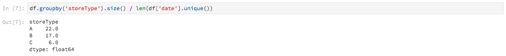

# [!DNL Data Science Workspace] 연습

이 문서에서는 Adobe Experience Platform [!DNL Data Science Workspace]에 대한 연습을 제공합니다. 이 자습서는 일반적인 데이터 과학자 워크플로우와 머신 러닝을 사용하여 이러한 워크플로우가 어떻게 접근하고 문제를 해결할 수 있는지 설명합니다.

## 전제 조건

- 등록된 Adobe ID 계정
   - Adobe ID 계정이 Adobe Experience Platform 및 [!DNL Data Science Workspace]에 액세스할 수 있는 조직에 추가되어야 합니다.

## 소매 사용 사례

소매업체는 현재 시장에서 경쟁력을 유지하기 위해 많은 과제에 직면해 있습니다. 소매업체의 주요 관심사 중 하나는 제품의 최적의 가격을 결정하고 판매 동향을 예측하는 것이다. 정확한 예측 모델을 사용하면 소매업체는 수요와 가격 정책 간의 관계를 파악할 수 있고 매출과 매출을 극대화하기 위해 최적화된 가격 결정을 내릴 수 있습니다.

## 데이터 과학자의 솔루션

데이터 과학자는 소매업체에서 제공하는 방대한 양의 내역 정보를 활용하여 향후 동향을 예측하고 가격 결정을 최적화하는 것입니다. 이 연습에서는 이전 판매 데이터를 사용하여 기계 학습 모델을 교육하고 모델을 사용하여 향후 판매 동향을 예측합니다. 이를 통해 인사이트를 생성하여 최적의 가격 변경을 수행할 수 있습니다.

이 개요는 데이터 과학자가 데이터 세트를 선택하고 주간 매출을 예측할 수 있는 모델을 만들기 위해 거쳐야 하는 단계를 반영합니다. 이 자습서에서는 Adobe Experience Platform [!DNL Data Science Workspace]의 샘플 소매 판매 전자 필기장에 있는 다음 섹션에 대해 설명합니다.

- [설정](#setup)
- [데이터 탐색](#exploring-data)
- [기능 엔지니어링](#feature-engineering)
- [교육 및 확인](#training-and-verification)

### [!DNL Data Science Workspace]의 노트북

Adobe Experience Platform UI의 **[!UICONTROL Data Science]** 탭 내에서 **[!UICONTROL Notebooks]**&#x200B;을 선택하여 [!UICONTROL Notebooks] 개요 페이지로 이동합니다. 이 페이지에서 [!DNL JupyterLab] 탭을 선택하여 [!DNL JupyterLab] 환경을 시작합니다. [!DNL JupyterLab]의 기본 랜딩 페이지는 **[!UICONTROL Launcher]**&#x200B;입니다.


이 자습서는 [!DNL JupyterLab Notebooks]의 [!DNL Python] 3을 사용하여 데이터에 액세스하고 데이터를 탐색하는 방법을 보여 줍니다. 실행 시작 페이지에는 제공된 샘플 전자 필기장이 있습니다. **[!UICONTROL Retail Sales]** 샘플 노트북은 아래 예에서 사용됩니다.

### 설정 {#setup}

소매 판매 전자 필기장이 열리면 먼저 워크플로우에 필요한 라이브러리를 불러오는 것입니다. 다음 목록은 이후 단계의 예에 사용된 각 라이브러리에 대한 간략한 설명을 제공합니다.

- **숫자**:대형 다차원 배열 및 행렬 지원을 추가하는 과학 컴퓨팅 라이브러리
- **판다**:데이터 조작 및 분석에 사용되는 데이터 구조 및 작업을 제공하는 라이브러리
- **matplotlib.pyplot**:플로팅 시 MATLAB과 유사한 경험을 제공하는 라이브러리 설정
- **공동 작업** :matplotlib을 기반으로 하는 고급 인터페이스 데이터 시각화 라이브러리
- **sklearn**:분류, 회귀, 벡터 및 클러스터 알고리즘을 지원하는 기계 학습 라이브러리
- **경고**:경고 메시지를 제어하는 라이브러리

### 데이터 탐색 {#exploring-data}

#### 데이터 로드

라이브러리가 로드되면 데이터를 볼 수 있습니다. 다음 [!DNL Python] 코드는 팬더 &#39; `DataFrame` 데이터 구조와 [read_csv()](https://pandas.pydata.org/pandas-docs/stable/generated/pandas.read_csv.html#pandas.read_csv) 함수를 사용하여 [!DNL Github]에서 호스팅되는 CSV를 팬더 DataFrame으로 읽습니다.


팬더의 데이터 프레임 데이터 구조는 2차원 레이블이 지정된 데이터 구조입니다. 데이터의 크기를 빠르게 보려면 `df.shape`을(를) 사용할 수 있습니다. DataFrame의 크기를 나타내는 튜플을 반환합니다.


마지막으로 데이터의 모양을 미리 볼 수 있습니다. `df.head(n)`을 사용하여 DataFrame의 첫 번째 `n` 행을 볼 수 있습니다.


#### 통계 요약

[!DNL Python's] 팬더 라이브러리를 활용하여 각 속성의 데이터 유형을 가져올 수 있습니다. 다음 호출의 결과에는 각 열에 대한 항목 수와 데이터 유형에 대한 정보가 제공됩니다.

```PYTHON
df.info()
```


이 정보는 각 열의 데이터 유형을 알면 데이터를 처리하는 방법을 알 수 있으므로 유용합니다.

이제 통계 요약을 살펴보죠. 숫자 데이터 유형만 표시되므로 `date`, `storeType` 및 `isHoliday`은(는) 출력되지 않습니다.

```PYTHON
df.describe()
```


이를 통해 각 특성에 대해 6435개의 인스턴스가 있음을 확인할 수 있습니다. 또한 평균, 표준 편차(표준), 최소, 최대 및 사분간 타일과 같은 통계 정보가 제공됩니다. 이는 데이터의 편차에 대한 정보를 제공합니다. 다음 섹션에서는 데이터에 대한 완벽한 이해를 제공하기 위해 이 정보와 함께 작동하는 시각화를 살펴봅니다.

`store`에 대한 최소 및 최대 값을 보면 데이터가 나타내는 고유 저장소가 45개 있음을 알 수 있습니다. 스토어가 무엇인지 구별하는 `storeTypes`도 있습니다. 다음을 수행하여 `storeTypes` 분포를 볼 수 있습니다.



즉, 22개 스토어는 `storeType A`, 17은 `storeType B`, 6은 `storeType C`입니다.

#### 데이터 시각화

이제 데이터 프레임 값을 알고 있으므로 시각화를 통해 패턴을 보다 명확하고 손쉽게 식별할 수 있도록 보완할 수 있습니다. 이러한 그래프는 결과를 대상자에게 전달하는 데에도 유용합니다.

#### 다변량 그래프

다변량 그래프는 개별 변수의 그래프입니다. 데이터를 시각화하는 데 사용되는 일반적인 다변량 그래프는 박스 및 거품형 그래프입니다.

이전에는 리테일 데이터 세트를 사용하여 45개 매장과 매주 영업을 위한 상자를 생성하고 짧은 줄거리를 생성할 수 있습니다. 플롯은 `seaborn.boxplot` 함수를 사용하여 생성됩니다.


상자 하나와 거품형 줄거리는 데이터의 분포를 보여주는 데 사용된다. 플롯의 외부 선은 위쪽 및 아래쪽 사분위수를 보여주며 상자는 사분위수 범위에 걸쳐 있습니다. 상자에 있는 줄은 중간값을 표시합니다. 1.5배 이상의 데이터 포인트는 상위 또는 하위 사분위의 모든 점으로 원으로 표시됩니다. 이러한 사항들은 이상치라고 간주된다.

그 다음에는 시간에 따라 주간 판매를 계획할 수 있습니다. 첫 번째 스토어의 결과물만 표시됩니다. 노트북의 코드는 데이터세트에 있는 45개 스토어 중 6개에 해당하는 6개의 플롯을 생성합니다.


이 다이어그램에서는 2년의 기간 동안 주별 매출을 비교할 수 있습니다. 시간이 지남에 따라 판매의 최고점과 단점을 쉽게 볼 수 있다.

#### 다변량 그래프

다변수 플롯은 변수 간의 상호 작용을 보는 데 사용됩니다. 시각화를 통해 데이터 과학자들은 변수 간에 상관 관계나 패턴이 있는지 확인할 수 있습니다. 일반적인 다변량 그래프는 상관 관계 행렬입니다. 상관 관계 행렬에서는 여러 변수 간의 종속성을 상관 계수와 함께 수량화합니다.

동일한 소매 데이터 세트를 사용하여 상관 관계 행렬을 생성할 수 있습니다.


가운데 아래에 있는 대각선을 보세요. 이것은 변수를 자신과 비교할 때 완전한 긍정적인 상관관계가 있음을 보여줍니다. 긍정적인 상관관계는 1에 가까울수록 약하지만 상관관계는 0에 가깝다는 것이다. 음수 상관관계는 역트렌드를 나타내는 음수 계수와 함께 표시됩니다.

### 기능 엔지니어링 {#feature-engineering}

이 섹션에서 기능 엔지니어링은 다음 작업을 수행하여 소매 데이터 세트를 수정하는 데 사용됩니다.

- 주 및 연도 열 추가
- storeType을 표시기 변수로 변환
- 휴일을 숫자 변수로 변환
- 주별 판매 예측다음 주

#### 주 및 연도 열 추가

날짜(`2010-02-05`)의 현재 형식을 사용하면 데이터가 매주 형식인지 구별하기 어려울 수 있습니다. 따라서 날짜를 주 및 년으로 변환해야 합니다.


이제 주와 날짜는 다음과 같습니다.


#### storeType을 표시기 변수로 변환

그런 다음 storeType 열을 각 `storeType`을 나타내는 열로 변환하려고 합니다. 3개의 새 열을 만드는 스토어 유형(`A`, `B`, `C`)이 3개 있습니다. 각 열에 설정된 값은 `storeType`이(가) 무엇이었는지에 따라 &#39;1&#39;이 설정되고 다른 2개의 열에는 `0`이(가) 설정되는 부울 값입니다.


현재 `storeType` 열이 삭제되었습니다.

#### 휴일을 숫자 유형으로 변환

다음 수정 사항은 `isHoliday` 부울 값을 숫자 표현으로 변경하는 것입니다.


#### 주별 판매 예측다음 주

이제 각 데이터 세트에 이전 및 향후 주별 매출을 추가할 수 있습니다. 이 작업은 `weeklySales`을(를) 오프셋하여 수행할 수 있습니다. 또한 `weeklySales` 차이는 계산됩니다. 이는 이전 주의 `weeklySales`에서 `weeklySales`을 뺀 것입니다.


새 열을 만들기 위해 `weeklySales` 데이터 45개 데이터 세트와 45개의 데이터 세트를 뒤로 대체하므로 첫 번째 및 마지막 45개의 데이터 포인트에는 NaN 값이 있습니다. NaN 값이 있는 모든 행을 제거하는 `df.dropna()` 함수를 사용하여 데이터 세트에서 이러한 점을 제거할 수 있습니다.


수정 후 데이터 세트에 대한 요약이 아래에 표시됩니다.


### 교육 및 확인 {#training-and-verification}

이제 데이터 모델을 생성하고 향후 매출을 예측할 수 있는 가장 적합한 모델을 선택해야 합니다. 다음 5개의 알고리즘을 평가합니다.

- 선형 회귀
- 의사 결정 트리
- Random Forest
- 그레이디언트 향상
- K 이웃들

#### 데이터 세트를 트레이닝 및 테스트 하위 세트로 분할

모델이 얼마나 정확한지 알 수 있는 방법이 필요합니다. 이 평가는 데이터 집합의 일부를 인증으로 사용하고 나머지는 교육 데이터로 할당하여 수행할 수 있습니다. `weeklySalesAhead`은 `weeklySales`의 실제 미래 값이므로 이 값을 사용하여 모델이 값을 예측하는 정확도를 평가할 수 있습니다. 분할은 아래에 수행됩니다.


이제 모델 준비를 위한 `X_train` 및 `y_train`, 나중에 평가를 위해 `X_test` 및 `y_test`이(가) 있습니다.

#### 별색 확인 알고리즘

이 단원에서는 모든 알고리즘을 `model`이라는 배열로 선언합니다. 다음으로 이 배열과 각 알고리즘에 대해 `model.fit()` 모델을 만드는 교육 데이터를 `mdl`에 입력합니다. 이 모델을 사용하면 `X_test` 데이터로 `weeklySalesAhead`을 예측할 수 있습니다.


점수 지정 시 `y_test` 데이터의 실제 값과 함께 예측된 `weeklySalesAhead` 간의 평균 백분율 차이를 사용합니다. 예측과 실제 결과 간의 차이를 최소화하려는 경우 그래디언트 증폭 회귀 모델이 가장 성과가 좋은 모델입니다.

#### 예측 시각화

마지막으로 예측 모델을 실제 주별 판매 값으로 시각화할 수 있습니다. 파란색 선은 실제 숫자를 나타내며 녹색은 그라디언트 증폭을 사용하여 예측을 나타냅니다. 다음 코드는 데이터 세트에 있는 45개 스토어 중 6개를 나타내는 6개의 플롯을 생성합니다. 다음은 `Store 1`만 표시됩니다.


## 다음 단계

이 문서는 소매 판매 문제를 해결하기 위한 일반적인 데이터 과학자 워크플로우를 다룹니다. 요약하려면:

- 워크플로우에 필요한 라이브러리를 로드합니다.
- 라이브러리가 로드되면 통계 요약, 시각화 및 그래프를 사용하여 데이터를 볼 수 있습니다.
- 다음으로 리테일 데이터 세트를 수정하는 데 기능 엔지니어링이 사용됩니다.
- 마지막으로 데이터의 모델을 생성하고 향후 매출을 예측할 수 있는 가장 적합한 모델을 선택합니다.

준비가 되면 Adobe Experience Platform Data Science Workspace에서 전자 필기장에 대한 빠른 개요를 보려면 [JupiterLab 사용자 안내서](./jupyterlab/overview.md)를 읽어 보십시오. 또한 모델 및 레서피에 대해 학습하려는 경우 [소매 판매 스키마 및 데이터 세트](./models-recipes/create-retails-sales-dataset.md) 자습서를 읽으십시오. 이 자습서는 데이터 과학 작업 공간 [자습서 페이지](../tutorials/data-science-workspace.md)에서 볼 수 있는 후속 데이터 과학 작업 공간 자습서를 준비합니다.
