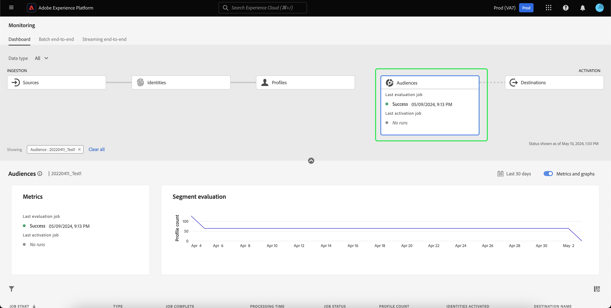

# UI에서 대상에 대한 데이터 흐름 모니터링

세그멘테이션 서비스를 사용하면 의 세그먼트 정의 또는 다른 소스를 통해 대상자를 만들 수 있습니다. [!DNL Real-Time Customer Profile] 데이터. Platform은 소스에서 대상으로 이러한 데이터 흐름을 투명하게 추적할 수 있는 데이터 흐름을 제공합니다.

모니터링 대시보드를 사용하여 데이터의 세분화 상태를 포함하여 대상자 내의 데이터 활동을 시각적으로 표시합니다. Experience Platform 사용자 인터페이스를 사용하여 모니터링 대시보드를 사용하여 데이터의 세그먼테이션을 모니터링하고, 대상 활성화, 평가 및 내보내기 작업의 상태를 추적할 수 있는 방법에 대한 지침은 튜토리얼을 참조하십시오.

## 시작하기 {#getting-started}

이 안내서를 사용하려면 Adobe Experience Platform의 다음 구성 요소에 대해 이해하고 있어야 합니다.

- [데이터 흐름](../home.md): 데이터 흐름은 플랫폼 간에 데이터를 이동하는 데이터 작업을 나타냅니다. 데이터 흐름은 서로 다른 서비스에 걸쳐 구성되어 데이터를 소스 커넥터에서 대상 데이터 세트로 이동하는 데 도움이 됩니다. [!DNL Identity] 및 [!DNL Profile], 및 까지 [!DNL Destinations].
   - [데이터 흐름 실행](../../sources/notifications.md): 데이터 흐름 실행은 선택한 데이터 흐름의 빈도 구성을 기반으로 하는 반복되는 예약된 작업입니다.
- [세분화](../../segmentation/home.md): 세분화를 사용하면 실시간 고객 프로필 데이터에서 대상을 만들 수 있습니다.
   - [활성화 작업](../../destinations/ui/activation-overview.md): 활성화 작업은 대상자를 지정된 대상에 활성화하는 데 사용됩니다.
   - [평가 작업](../../segmentation/tutorials/evaluate-a-segment.md#evaluate-a-segment): 평가 작업은 대상자를 평가하는 비동기 프로세스입니다.
   - [내보내기 작업](../../segmentation/api/export-jobs.md): 내보내기 작업은 대상 구성원을 데이터 세트로 지속하는 데 사용되는 비동기 프로세스입니다.
- [샌드박스](../../sandboxes/home.md): [!DNL Experience Platform] 단일 파티션을 만드는 가상 샌드박스를 제공합니다. [!DNL Platform] 인스턴스를 별도의 가상 환경으로 전환하여 디지털 경험 애플리케이션을 개발하고 발전시킵니다.

## 모니터링 대상자 대시보드 {#monitoring-audiences-dashboard}

>[!CONTEXTUALHELP]
>id="platform_monitoring_segments"
>title="대상자"
>abstract="대상자 보기에는 조직의 모든 대상자에 대한 정보와 해당 대상자의 활성화 및 평가 작업에 대한 추가 정보가 포함됩니다."

에 액세스하려면 **[!UICONTROL 대상]** 대시보드, 선택 **[!UICONTROL 모니터링]** 왼쪽 탐색. 다음에 한 번 **[!UICONTROL 모니터링]** 페이지에서 **[!UICONTROL 대상]** 카드.

기본 **[!UICONTROL 대상]** 대시보드, **[!UICONTROL 대상]** 카드에 마지막 평가 작업 및 마지막 내보내기 작업의 상태와 날짜가 표시됩니다.

대시보드 자체에는 대상 및 세분화 작업 모두에 대한 지표가 포함되어 있습니다. 기본적으로 대시보드에는 지난 24시간 동안의 대상 지표가 표시됩니다. 세분화 작업 보기에 대한 자세한 내용은 [세그먼테이션 작업 모니터링](#monitoring-segmentation-jobs-dashboard) 섹션.

>[!IMPORTANT]
>
>현재 활성화된 대상만 [배치(파일 기반) 대상](../../destinations/destination-types.md#file-based) 모니터링 대상자 대시보드에 대해 지원됩니다.

이 대시보드 보기에 사용할 수 있는 지표는 다음과 같습니다.

| 지표 | 설명 |
| ------ | ----------- |
| **[!UICONTROL 대상 이름]** | 대상자의 이름입니다. |
| **[!UICONTROL 데이터 유형]** | 대상의 데이터 유형입니다. 가능한 값은 다음과 같습니다. **[!UICONTROL 고객]**, **[!UICONTROL 계정]**, 및 **[!UICONTROL 잠재 고객]**. 다음을 사용하여 지정된 데이터 유형의 대상에 대한 을 볼 수 있습니다. [!UICONTROL 데이터 유형] 카드 리본 위에 필터링합니다. |
| **[!UICONTROL 마지막 평가 타임스탬프]** | 대상자의 마지막 평가 작업이 실행된 날짜 및 시간입니다. |
| **[!UICONTROL 마지막 평가 상태]** | 대상자의 마지막 평가 작업 상태입니다. 가능한 값은 다음과 같습니다. **[!UICONTROL 성공]**, **[!UICONTROL 실행 없음]**, 및 **[!UICONTROL 실패]**. |
| **[!UICONTROL 마지막 평가 방법]** | 대상자의 평가 방법입니다. 일괄 처리 세분화만 지원되므로 가능한 값은 다음과 같습니다. **[!UICONTROL 일괄 처리]**. |
| **[!UICONTROL 마지막 평가 프로필]** | 대상자의 마지막 평가 작업에서 평가된 프로필 수입니다. |
| **[!UICONTROL 마지막 활성화 타임스탬프]** | 대상자의 마지막 활성화 작업이 실행된 날짜 및 시간입니다. |
| **[!UICONTROL 마지막 활성화 상태]** | 대상자의 마지막 활성화 작업 상태입니다. 가능한 값은 다음과 같습니다. **[!UICONTROL 성공]**, **[!UICONTROL 실행 없음]**, 및 **[!UICONTROL 실패]**. |
| **[!UICONTROL 마지막 활성화 ID]** | 대상자의 마지막 활성화 작업에서 활성화된 ID의 수입니다. |
| **[!UICONTROL 마지막 활성화 대상]** | 대상자의 마지막 활성화 작업이 활성화된 대상 이름입니다. |

필터 아이콘( )을 선택하여 결과를 특정 대상에게 필터링하고 해당 세분화 작업을 볼 수 있습니다. 참조). 세그먼테이션 작업은 시간 순서대로 정렬되며, 가장 최근 세그먼테이션 작업이 먼저 표시됩니다.

필터링된 대상 대시보드가 나타납니다. 다음 **[!UICONTROL 대상]** 카드에 마지막 평가 작업 및 마지막 활성화 작업의 상태와 날짜가 표시됩니다.

대시보드 자체에는 마지막 평가 및 활성화 작업의 시간과 상태, 대상 평가의 프로필 수를 보여 주는 그래프 및 실행된 세분화 작업에 대한 지표가 표시됩니다. 기본적으로 대시보드에는 지난 24시간 동안의 세그먼테이션 작업 지표가 표시됩니다.

이 대시보드 보기에 사용할 수 있는 지표는 다음과 같습니다.

| 지표 | 설명 |
| ------ | ----------- |
| **[!UICONTROL 작업 시작]** | 세분화 작업이 시작된 날짜 및 시간입니다. |
| **[!UICONTROL 유형]** | 세분화 작업의 유형을 나타냅니다. 지원되는 두 가지 작업 유형은 다음과 같습니다 **활성화** 및 **평가** 작업. |
| **[!UICONTROL 작업 완료]** | 세분화 작업이 완료된 날짜 및 시간입니다. |
| **[!UICONTROL 처리 시간]** | 세분화 작업을 완료하는 데 걸린 시간입니다. |
| **[!UICONTROL 작업 상태]** | 세분화 작업의 상태입니다. 지원되는 값: **[!UICONTROL 성공]**, **[!UICONTROL 진행 중]**, 및 **[!UICONTROL 실패]**. |
| **[!UICONTROL 프로필 개수]** | 세분화 작업에서 평가 중인 프로필 수입니다. 각 사용자에게는 고유한 프로필이 있어야 합니다. |
| **[!UICONTROL ID 활성화됨]** | 세분화 작업이 활성화 중인 ID 수입니다. 각 프로필에는 여러 ID가 있을 수 있습니다. 예를 들어 프로필에는 이메일, 전화 번호 및 고객 충성도 번호가 ID로 있을 수 있습니다. |
| **[!UICONTROL 대상 이름]** | 세분화 작업이 활성화 중인 대상 이름입니다. |

필터 아이콘( )을 선택하여 특정 세분화 작업을 추가로 필터링하고 세부 정보를 볼 수 있습니다. 참조). 필터링할 수 있는 세분화 작업에는 활성화 작업과 평가 작업이 있습니다.

### 활성화 작업 세부 정보 {#activation-job-details}

활성화 작업 데이터 흐름 실행 세부 정보 페이지에는 세분화 작업과 관련된 실행 지표, 데이터 흐름 실행 오류 및 대상에 대한 정보가 표시됩니다. 활성화 작업은 지정된 대상에 대해 대상을 활성화하는 데 사용됩니다.

이 대시보드 보기에 사용할 수 있는 지표는 다음과 같습니다.

| 지표 | 설명 |
| ------ | ----------- |
| **[!UICONTROL 받은 프로필]** | 활성화 플로우에서 받은 총 프로필 수입니다. |
| **[!UICONTROL ID 활성화됨]** | 받은 프로필을 기반으로 대상에 성공적으로 활성화된 총 ID 수입니다. |
| **[!UICONTROL ID 제외됨]** | 받은 프로필을 기반으로 하여 대상에서 제외한 총 ID 수. 속성 누락 또는 동의 위반으로 인해 이러한 ID를 제외할 수 있습니다. |
| **[!UICONTROL 데이터 크기]** | 활성화 중인 데이터 흐름의 크기입니다. |
| **[!UICONTROL 총 파일 수]** | 데이터 흐름에서 활성화된 총 파일 수입니다. |
| **[!UICONTROL 상태]** | 활성화 작업의 현재 상태입니다. |
| **[!UICONTROL 데이터 흐름 실행 시작]** | 활성화 작업이 시작된 날짜 및 시간입니다. |
| **[!UICONTROL 데이터 흐름 실행 종료]** | 활성화 작업이 종료된 날짜 및 시간입니다. |
| **[!UICONTROL 데이터 흐름 실행 ID]** | 현재 활성화 작업의 ID입니다. |
| **[!UICONTROL IMS 조직 ID]** | 활성화 작업이 속한 조직의 ID입니다. |
| **[!UICONTROL 대상 이름]** | 데이터를 활성화할 대상의 이름입니다. |

대상자 섹션에서 활성화 작업의 일부로 활성화된 대상자 목록을 볼 수 있습니다.

대상자 섹션의 경우 다음 지표를 사용할 수 있습니다.

| 지표 | 설명 |
| ------ | ----------- |
| **[!UICONTROL 이름]** | 활성화된 대상자의 이름입니다. |
| **[!UICONTROL ID 활성화됨]** | 받은 프로필을 기반으로 대상에 성공적으로 활성화된 총 ID 수입니다. |
| **[!UICONTROL ID 제외됨]** | 받은 프로필을 기반으로 하여 대상에서 제외한 총 ID 수. 속성 누락 또는 동의 위반으로 인해 이러한 ID를 제외할 수 있습니다. |
| **[!UICONTROL 마지막 데이터 흐름 실행 상태]** | 해당 대상에 대해 실행된 마지막 활성화 작업의 상태입니다. |
| **[!UICONTROL 마지막 데이터 흐름 실행 일자]** | 해당 대상에 대해 실행된 마지막 활성화 작업의 날짜 및 시간입니다. |

또한 데이터 흐름 실행 오류에 대한 세부 사항을 볼 수 있습니다. 데이터 흐름 실행 오류 섹션에서 실패한 ID나 제외된 ID를 모두 볼 수 있습니다. 오류 섹션에는 오류 코드 및 실패 또는 제외된 ID 수에 대한 세부 정보가 포함됩니다.

### 평가 작업 세부 정보 {#evaluation-job-details}

평가 작업 데이터 흐름 실행 세부 정보 페이지에는 세분화 작업과 관련된 실행 지표 및 대상에 대한 정보가 표시됩니다.

이 대시보드 보기에 사용할 수 있는 지표는 다음과 같습니다.

| 지표 | 설명 |
| ------ | ----------- |
| **[!UICONTROL 총 프로필]** | 평가 중인 총 프로필 수입니다. |
| **[!UICONTROL 상태]** | 평가 작업의 상태입니다. 평가 작업에 대해 가능한 상태는 다음과 같습니다. **[!UICONTROL 성공]** 및 **[!UICONTROL 실패]**. |
| **[!UICONTROL 작업 시작]** | 평가 작업이 시작된 날짜 및 시간입니다. |
| **[!UICONTROL 작업 종료]** | 평가 작업이 종료된 날짜 및 시간입니다. |
| **[!UICONTROL 작업 유형]** | 세분화 작업 유형. 이 경우 항상 **[!UICONTROL 세그먼트 평가]** 작업. |
| **[!UICONTROL 평가 유형]** | 수행 중인 평가의 유형입니다. 다음 중 하나일 수 있습니다. **[!UICONTROL 일괄 처리]** 또는 **[!UICONTROL 스트리밍]**. |
| **[!UICONTROL 작업 ID]** | 평가 작업의 ID입니다. |
| **[!UICONTROL IMS 조직 ID]** | 평가 작업이 속한 조직의 ID입니다. |
| **[!UICONTROL 대상 이름]** | 평가 중인 대상자의 이름입니다. |
| **[!UICONTROL 대상자 ID]** | 평가 중인 대상자의 ID입니다. |

아래 [!UICONTROL 대상] 섹션에서 평가 작업의 일부로 평가되는 대상자 목록을 볼 수 있습니다. 검색 창을 사용하여 이름별로 대상 목록을 필터링할 수 있습니다.

>[!IMPORTANT]
>
>이 대시보드 보기는 현재 최대 800개의 대상 지표를 지원합니다.

의 경우 [!UICONTROL 대상] 섹션에서 다음 지표를 사용할 수 있습니다.

| 지표 | 설명 |
| ------ | ----------- |
| **[!UICONTROL 이름]** | 평가 중인 대상자의 이름입니다. |
| **[!UICONTROL 프로필 개수]** | 평가 중인 프로필 수입니다. |

## 모니터링 세분화 작업 대시보드 {#monitoring-segmentation-jobs-dashboard}

>[!CONTEXTUALHELP]
>id="platform_monitoring_segment_jobs"
>title="세분화 작업"
>abstract="세분화 작업 보기에는 모든 대상자에 대한 평가 및 내보내기 작업에 대한 정보가 포함됩니다."

에 액세스하려면 **[!UICONTROL 세분화 작업]** 대시보드, 선택 **[!UICONTROL 세분화 작업]** 다음에서 [!UICONTROL 대상] 대시보드입니다. 다음 [!UICONTROL 모니터링] 대시보드에는 평가 및 내보내기 작업에 대한 지표와 정보가 포함되어 있습니다.

>[!NOTE]
>
>전용 **세분화 평가 작업** 은 대상자별 모니터링에 대해 지원됩니다. 세그먼테이션 내보내기 작업은 조직 수준의 모니터링만 지원합니다.

사용 [!UICONTROL 세분화 작업] 대시보드를 통해 프로필 평가 및 내보내기가 예외 없이 제시간에 수행되는지 여부를 확인할 수 있으므로 대상 활성화를 위한 다운스트림 서비스에 최신 평가된 프로필 데이터가 있을 수 있습니다.

세분화 작업에 사용할 수 있는 지표는 다음과 같습니다.

| 지표 | 설명 |
| ------ | ----------- |
| **[!UICONTROL 세분화 작업]** | 세분화 작업의 이름을 나타냅니다. |
| **[!UICONTROL 유형]** | 세그먼테이션 작업 유형(내보내기 또는 평가)을 나타냅니다. 두 경우 모두, 세분화 작업은 평가되거나 내보내집니다 **모두** 조직에 속한 대상입니다. 내보내기 작업에 대한 자세한 내용은 [내보내기 작업 엔드포인트](../../segmentation/api/export-jobs.md). 평가 작업에 대한 자세한 내용은 다음 자습서를 참조하십시오. [세그먼트 정의 평가](../../segmentation/tutorials/evaluate-a-segment.md#evaluate-a-segment). |
| **[!UICONTROL 작업 시작]** | 세분화 작업이 시작된 날짜 및 시간입니다. |
| **[!UICONTROL 작업 종료]** | 세분화 작업이 완료된 날짜 및 시간입니다. |
| **[!UICONTROL 상태]** | 완료된 작업의 상태입니다. 세분화 작업에 대해 가능한 상태에는 성공 또는 실패가 포함됩니다. |
