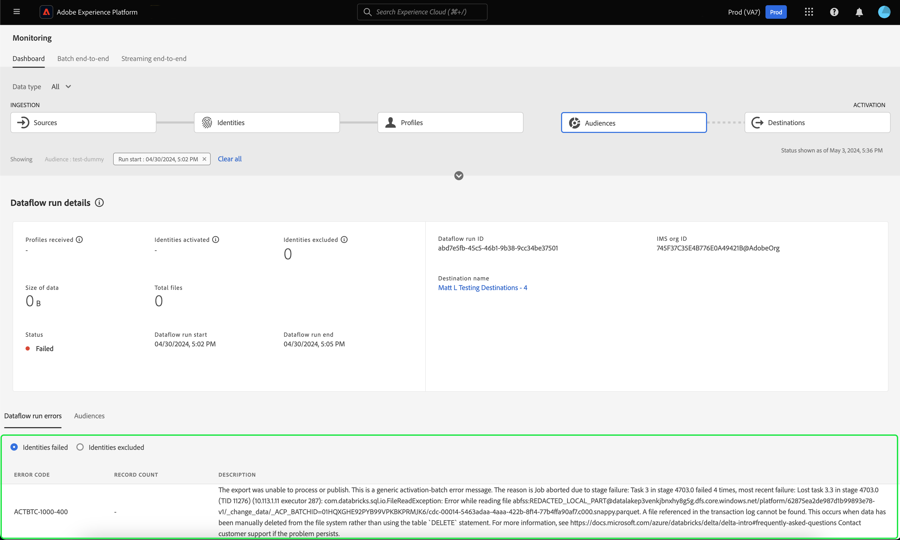

# UI에서 대상에 대한 데이터 흐름 모니터링

세분화 서비스를 사용하면 [!DNL Real-Time Customer Profile] 데이터에서 세그먼트 정의나 다른 소스를 통해 대상자를 만들 수 있습니다. Experience Platform은 소스에서 대상으로 이러한 데이터 흐름을 투명하게 추적할 수 있는 데이터 흐름을 제공합니다.

모니터링 대시보드를 사용하여 데이터의 세분화 상태를 포함하여 대상자 내의 데이터 활동을 시각적으로 표시합니다. 모니터링 대시보드를 사용하여 Experience Platform 사용자 인터페이스를 사용하여 데이터의 세그먼테이션을 모니터링하고, 대상 활성화, 평가 및 내보내기 작업의 상태를 추적할 수 있는 방법에 대한 지침은 튜토리얼을 참조하십시오.

## 시작 {#getting-started}

이 안내서를 사용하려면 Adobe Experience Platform의 다음 구성 요소에 대해 이해하고 있어야 합니다.

- [데이터 흐름](../home.md): 데이터 흐름은 Experience Platform에서 데이터를 이동하는 데이터 작업을 나타냅니다. 데이터 흐름은 여러 서비스에 걸쳐 구성되어 있으므로 데이터를 소스 커넥터에서 대상 데이터 세트로, [!DNL Identity] 및 [!DNL Profile], [!DNL Destinations]&#x200B;(으)로 이동하는 데 도움이 됩니다.
   - [데이터 흐름 실행](../../sources/notifications.md): 데이터 흐름 실행은 선택한 데이터 흐름의 빈도 구성에 따라 반복되는 예약된 작업입니다.
- [세그먼테이션](../../segmentation/home.md): 세그먼테이션을 사용하면 실시간 고객 프로필 데이터에서 대상을 만들 수 있습니다.
   - [활성화 작업](../../destinations/ui/activation-overview.md): 활성화 작업은 대상을 지정된 대상으로 활성화하는 데 사용됩니다.
   - [평가 작업](../../segmentation/tutorials/evaluate-a-segment.md#evaluate-a-segment): 평가 작업은 대상을 평가하는 비동기 프로세스입니다.
   - [내보내기 작업](../../segmentation/api/export-jobs.md): 내보내기 작업은 대상 구성원을 데이터 세트로 유지하는 데 사용되는 비동기 프로세스입니다.
- [샌드박스](../../sandboxes/home.md): [!DNL Experience Platform]에서는 단일 [!DNL Experience Platform] 인스턴스를 별도의 가상 환경으로 분할하여 디지털 경험 응용 프로그램을 개발하고 발전시키는 데 도움이 되는 가상 샌드박스를 제공합니다.

## 모니터링 대상자 대시보드 {#monitoring-audiences-dashboard}

>[!CONTEXTUALHELP]
>id="platform_monitoring_segments"
>title="대상자"
>abstract="대상자 보기에는 조직의 모든 대상자에 대한 정보와 해당 대상자의 활성화 및 평가 작업에 대한 추가 정보가 포함됩니다."

**[!UICONTROL Audiences]** 대시보드에 액세스하려면 왼쪽 탐색에서 **[!UICONTROL Monitoring]**&#x200B;을(를) 선택하십시오. **[!UICONTROL Monitoring]** 페이지에서 **[!UICONTROL Audiences]** 카드를 선택하십시오.

기본 **[!UICONTROL Audiences]** 대시보드에서 **[!UICONTROL Audiences]** 카드에 마지막 평가 작업 및 마지막 내보내기 작업의 상태와 날짜가 표시됩니다.

대시보드 자체에는 대상 및 세분화 작업 모두에 대한 지표가 포함되어 있습니다. 기본적으로 대시보드에는 지난 24시간 동안의 대상 지표가 표시됩니다. 세분화 작업 보기에 대한 자세한 내용은 [세분화 작업 모니터링](#monitoring-segmentation-jobs-dashboard) 섹션을 참조하십시오.

>[!IMPORTANT]
>
>현재 [일괄 처리(파일 기반) 대상](../../destinations/destination-types.md#file-based)에 활성화된 대상만 모니터링 대상자 대시보드에 대해 지원됩니다.

이 대시보드 보기에 사용할 수 있는 지표는 다음과 같습니다.

| 지표 | 설명 |
| ------ | ----------- |
| **[!UICONTROL Audience name]** | 대상자의 이름입니다. |
| **[!UICONTROL Data type]** | 대상의 데이터 유형입니다. 가능한 값은 **[!UICONTROL Customer]**, **[!UICONTROL Account]** 및 **[!UICONTROL Prospect]**&#x200B;입니다. 카드 리본 위에 있는 [!UICONTROL Data type] 필터를 사용하여 지정된 데이터 형식의 대상에 대해 볼 수 있습니다. |
| **[!UICONTROL Last evaluation timestamp]** | 대상자의 마지막 평가 작업이 실행된 날짜 및 시간입니다. |
| **[!UICONTROL Last evaluation status]** | 대상자의 마지막 평가 작업 상태입니다. 가능한 값은 **[!UICONTROL Success]**, **[!UICONTROL No runs]** 및 **[!UICONTROL Failed]**&#x200B;입니다. |
| **[!UICONTROL Last evaluation method]** | 대상자의 평가 방법입니다. 일괄 처리 세분화만 지원되므로 가능한 값은 **[!UICONTROL Batch]**&#x200B;뿐입니다. |
| **[!UICONTROL Last evaluation profiles]** | 대상자의 마지막 평가 작업에서 평가된 프로필 수입니다. |
| **[!UICONTROL Last activation timestamp]** | 대상자의 마지막 활성화 작업이 실행된 날짜 및 시간입니다. |
| **[!UICONTROL Last activation status]** | 대상자의 마지막 활성화 작업 상태입니다. 가능한 값은 **[!UICONTROL Success]**, **[!UICONTROL No runs]** 및 **[!UICONTROL Failed]**&#x200B;입니다. |
| **[!UICONTROL Last activation identities]** | 대상자의 마지막 활성화 작업에서 활성화된 ID의 수입니다. |
| **[!UICONTROL Last activation destination]** | 대상자의 마지막 활성화 작업이 활성화된 대상 이름입니다. |

필터 아이콘(). 세그먼테이션 작업은 시간 순서대로 정렬되며, 가장 최근 세그먼테이션 작업이 먼저 표시됩니다.

필터링된 대상 대시보드가 나타납니다. **[!UICONTROL Audiences]** 카드는 마지막 평가 작업 및 마지막 활성화 작업의 상태와 날짜를 표시합니다.

대시보드 자체에는 마지막 평가 및 활성화 작업의 시간과 상태, 대상 평가의 프로필 수를 보여 주는 그래프 및 실행된 세분화 작업에 대한 지표가 표시됩니다. 기본적으로 대시보드에는 지난 24시간 동안의 세그먼테이션 작업 지표가 표시됩니다.

이 대시보드 보기에 사용할 수 있는 지표는 다음과 같습니다.

| 지표 | 설명 |
| ------ | ----------- |
| **[!UICONTROL Job start]** | 세분화 작업이 시작된 날짜 및 시간입니다. |
| **[!UICONTROL Type]** | 세분화 작업의 유형을 나타냅니다. 지원되는 두 가지 작업 유형은 **활성화** 및 **평가** 작업입니다. |
| **[!UICONTROL Job complete]** | 세분화 작업이 완료된 날짜 및 시간입니다. |
| **[!UICONTROL Processing time]** | 세분화 작업을 완료하는 데 걸린 시간입니다. |
| **[!UICONTROL Job status]** | 세분화 작업의 상태입니다. 지원되는 값은 **[!UICONTROL Success]**, **[!UICONTROL In Progress]** 및 **[!UICONTROL Failed]**&#x200B;입니다. |
| **[!UICONTROL Profile count]** | 세분화 작업에서 평가 중인 프로필 수입니다. 각 사용자에게는 고유한 프로필이 있어야 합니다. |
| **[!UICONTROL Identity activated]** | 세분화 작업이 활성화 중인 ID 수입니다. 각 프로필에는 여러 ID가 있을 수 있습니다. 예를 들어 프로필에는 이메일, 전화 번호 및 고객 충성도 번호가 ID로 있을 수 있습니다. |
| **[!UICONTROL Destination name]** | 세분화 작업이 활성화 중인 대상 이름입니다. |

필터 아이콘(). 필터링할 수 있는 세분화 작업에는 활성화 작업과 평가 작업이 있습니다.

### 활성화 작업 세부 정보 {#activation-job-details}

활성화 작업 데이터 흐름 실행 세부 정보 페이지에는 세분화 작업과 관련된 실행 지표, 데이터 흐름 실행 오류 및 대상에 대한 정보가 표시됩니다. 활성화 작업은 지정된 대상에 대해 대상을 활성화하는 데 사용됩니다.

이 대시보드 보기에 사용할 수 있는 지표는 다음과 같습니다.

| 지표 | 설명 |
| ------ | ----------- |
| **[!UICONTROL Profiles received]** | 활성화 플로우에서 받은 총 프로필 수입니다. |
| **[!UICONTROL Identities activated]** | 받은 프로필을 기반으로 대상에 성공적으로 활성화된 총 ID 수입니다. |
| **[!UICONTROL Identities excluded]** | 받은 프로필을 기반으로 하여 대상에서 제외한 총 ID 수. 속성 누락 또는 동의 위반으로 인해 이러한 ID를 제외할 수 있습니다. |
| **[!UICONTROL Size of data]** | 활성화 중인 데이터 흐름의 크기입니다. |
| **[!UICONTROL Total files]** | 데이터 흐름에서 활성화된 총 파일 수입니다. |
| **[!UICONTROL Status]** | 활성화 작업의 현재 상태입니다. |
| **[!UICONTROL Dataflow run start]** | 활성화 작업이 시작된 날짜 및 시간입니다. |
| **[!UICONTROL Dataflow run end]** | 활성화 작업이 종료된 날짜 및 시간입니다. |
| **[!UICONTROL Dataflow run ID]** | 현재 활성화 작업의 ID입니다. |
| **[!UICONTROL IMS org ID]** | 활성화 작업이 속한 조직의 ID입니다. |
| **[!UICONTROL Destination name]** | 데이터를 활성화할 대상의 이름입니다. |

대상자 섹션에서 활성화 작업의 일부로 활성화된 대상자 목록을 볼 수 있습니다.

대상자 섹션의 경우 다음 지표를 사용할 수 있습니다.

| 지표 | 설명 |
| ------ | ----------- |
| **[!UICONTROL Name]** | 활성화된 대상자의 이름입니다. |
| **[!UICONTROL Identities activated]** | 받은 프로필을 기반으로 대상에 성공적으로 활성화된 총 ID 수입니다. |
| **[!UICONTROL Identities excluded]** | 받은 프로필을 기반으로 하여 대상에서 제외한 총 ID 수. 속성 누락 또는 동의 위반으로 인해 이러한 ID를 제외할 수 있습니다. |
| **[!UICONTROL Last dataflow run status]** | 해당 대상에 대해 실행된 마지막 활성화 작업의 상태입니다. |
| **[!UICONTROL Last dataflow run date]** | 해당 대상에 대해 실행된 마지막 활성화 작업의 날짜 및 시간입니다. |

또한 데이터 흐름 실행 오류에 대한 세부 사항을 볼 수 있습니다. 데이터 흐름 실행 오류 섹션에서 실패한 ID나 제외된 ID를 모두 볼 수 있습니다. 오류 섹션에는 오류 코드 및 실패 또는 제외된 ID 수에 대한 세부 정보가 포함됩니다.

### 평가 작업 세부 정보 {#evaluation-job-details}

평가 작업 데이터 흐름 실행 세부 정보 페이지에는 세분화 작업과 관련된 실행 지표 및 대상에 대한 정보가 표시됩니다.

이 대시보드 보기에 사용할 수 있는 지표는 다음과 같습니다.

| 지표 | 설명 |
| ------ | ----------- |
| **[!UICONTROL Total profiles]** | 평가 중인 총 프로필 수입니다. |
| **[!UICONTROL Status]** | 평가 작업의 상태입니다. 평가 작업에 대해 가능한 상태는 **[!UICONTROL Success]** 및 **[!UICONTROL Failed]**&#x200B;입니다. |
| **[!UICONTROL Job start]** | 평가 작업이 시작된 날짜 및 시간입니다. |
| **[!UICONTROL Job end]** | 평가 작업이 종료된 날짜 및 시간입니다. |
| **[!UICONTROL Job type]** | 세분화 작업 유형. 이 경우 항상 **[!UICONTROL Segment evaluation]** 작업이 됩니다. |
| **[!UICONTROL Evaluation type]** | 수행 중인 평가의 유형입니다. **[!UICONTROL Batch]** 또는 **[!UICONTROL Streaming]**&#x200B;일 수 있습니다. |
| **[!UICONTROL Job ID]** | 평가 작업의 ID입니다. |
| **[!UICONTROL IMS org ID]** | 평가 작업이 속한 조직의 ID입니다. |
| **[!UICONTROL Audience name]** | 평가 중인 대상자의 이름입니다. |
| **[!UICONTROL Audience ID]** | 평가 중인 대상자의 ID입니다. |

[!UICONTROL Audiences] 섹션에서 평가 작업의 일부로 평가되는 대상 목록을 볼 수 있습니다. 검색 창을 사용하여 이름별로 대상 목록을 필터링할 수 있습니다.

>[!IMPORTANT]
>
>이 대시보드 보기는 현재 최대 800개의 대상 지표를 지원합니다.

[!UICONTROL Audiences] 섹션의 경우 다음 지표를 사용할 수 있습니다.

| 지표 | 설명 |
| ------ | ----------- |
| **[!UICONTROL Name]** | 평가 중인 대상자의 이름입니다. |
| **[!UICONTROL Profile count]** | 평가 중인 프로필 수입니다. |

## 모니터링 세분화 작업 대시보드 {#monitoring-segmentation-jobs-dashboard}

>[!CONTEXTUALHELP]
>id="platform_monitoring_segment_jobs"
>title="세분화 작업"
>abstract="세분화 작업 보기에는 모든 대상자에 대한 평가 및 내보내기 작업에 대한 정보가 포함됩니다."

**[!UICONTROL Segmentation Jobs]** 대시보드에 액세스하려면 **[!UICONTROL Segmentation jobs]** 대시보드에서 [!UICONTROL Audiences]을(를) 선택하십시오. [!UICONTROL Monitoring] 대시보드에는 평가 및 내보내기 작업에 대한 지표와 정보가 포함되어 있습니다.

>[!NOTE]
>
>대상별 모니터링에는 **세그먼테이션 평가 작업**&#x200B;만 지원됩니다. 세그먼테이션 내보내기 작업은 조직 수준의 모니터링만 지원합니다.

[!UICONTROL Segmentation Jobs] 대시보드를 사용하여 프로필 평가 및 내보내기가 예외 없이 제시간에 수행되는지 여부를 이해하면 대상 활성화를 위한 다운스트림 서비스에 평가된 최신 프로필 데이터가 있을 수 있습니다.

세분화 작업에 사용할 수 있는 지표는 다음과 같습니다.

| 지표 | 설명 |
| ------ | ----------- |
| **[!UICONTROL Segmentation job]** | 세분화 작업의 이름을 나타냅니다. |
| **[!UICONTROL Type]** | 세그먼테이션 작업 유형(내보내기 또는 평가)을 나타냅니다. 두 경우 모두, 세분화 작업은 조직에 속한 **모든** 대상을 평가하거나 내보냅니다. 내보내기 작업에 대한 자세한 내용은 [내보내기 작업 끝점](../../segmentation/api/export-jobs.md)의 안내서를 참조하십시오. 평가 작업에 대한 자세한 내용은 [세그먼트 정의 평가](../../segmentation/tutorials/evaluate-a-segment.md#evaluate-a-segment)에 대한 자습서를 참조하십시오. |
| **[!UICONTROL Job start]** | 세분화 작업이 시작된 날짜 및 시간입니다. |
| **[!UICONTROL Job end]** | 세분화 작업이 완료된 날짜 및 시간입니다. |
| **[!UICONTROL Status]** | 완료된 작업의 상태입니다. 세분화 작업에 대해 가능한 상태에는 성공 또는 실패가 포함됩니다. |
