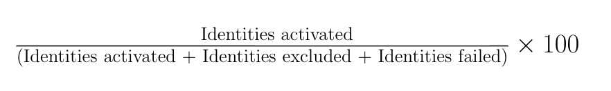
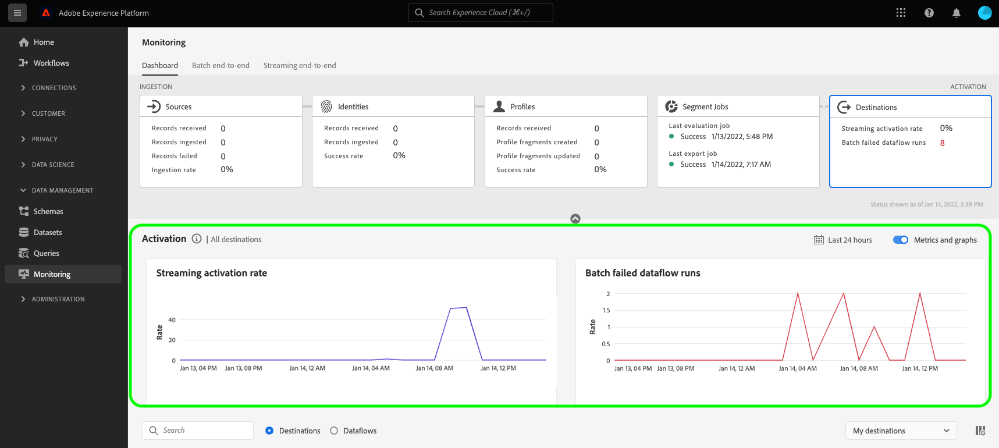

# UI의 대상에 대한 데이터 흐름 모니터링

Experience Platform 카탈로그의 다양한 대상을 사용하여 플랫폼에서 수많은 외부 파트너로 데이터를 활성화합니다. Platform은 데이터 흐름과 함께 투명성을 제공하여 대상으로의 데이터 흐름을 추적하는 프로세스를 간소화합니다.

모니터링 대시보드는 데이터가 활성화되고 있는 대상, 보고 있는 데이터 유형, 데이터 흐름 실행당 내보낸 데이터 등을 포함하여 데이터 흐름의 여정을 시각적으로 표시합니다.

이 자습서에서는 대상 작업 영역에서 데이터 흐름을 직접 모니터링하거나 모니터링 대시보드를 사용하여 Experience Platform 사용자 인터페이스를 사용하여 대상의 데이터 흐름을 모니터링하는 방법에 대한 지침을 제공합니다.

## 시작하기 {#getting-started}

이 안내서를 사용하려면 Adobe Experience Platform의 다음 구성 요소에 대해 이해하고 있어야 합니다.

- [데이터 흐름](../home.md): 데이터 흐름은 플랫폼 간에 데이터를 이동하는 데이터 작업을 나타냅니다. 데이터 흐름은 여러 서비스에 걸쳐 구성되어 있으므로 데이터를 소스 커넥터에서 대상 데이터 세트로, [!DNL Identity] 및 [!DNL Profile], [!DNL Destinations](으)로 이동하는 데 도움이 됩니다.
   - [데이터 흐름 실행](../../sources/notifications.md): 데이터 흐름 실행은 선택한 데이터 흐름의 빈도 구성에 따라 반복되는 예약된 작업입니다.
- [대상](../../destinations/home.md): 대상은 크로스 채널 마케팅 캠페인, 이메일 캠페인, 타겟팅 광고 및 기타 다양한 사용 사례를 위해 플랫폼에서 데이터를 원활하게 활성화할 수 있도록 일반적으로 사용되는 애플리케이션과의 사전 빌드된 통합입니다.
- [샌드박스](../../sandboxes/home.md): [!DNL Experience Platform]에서는 단일 [!DNL Platform] 인스턴스를 별도의 가상 환경으로 분할하여 디지털 경험 응용 프로그램을 개발하고 발전시키는 데 도움이 되는 가상 샌드박스를 제공합니다.

## 대상 작업 영역에서 데이터 흐름 모니터링 {#monitor-dataflows-in-the-destinations-workspace}

Platform UI의 **[!UICONTROL 대상]** 작업 영역에서 **[!UICONTROL 찾아보기]** 탭으로 이동하여 보려는 대상의 이름을 선택합니다.

기존 데이터 흐름 목록이 나타납니다. 이 페이지에는 대상, 사용자 이름, 데이터 흐름 수 및 상태에 대한 정보를 포함하여 볼 수 있는 데이터 흐름 목록이 있습니다.

상태에 대한 자세한 내용은 다음 표를 참조하십시오.

| 상태 | 설명 |
| ------ | ----------- |
| 활성화됨 | `Enabled` 상태는 데이터 흐름이 활성 상태이며 제공된 일정에 따라 데이터를 내보내고 있음을 나타냅니다. |
| 비활성화됨 | `Disabled` 상태는 데이터 흐름이 비활성 상태이며 데이터를 내보내고 있지 않음을 나타냅니다. |
| 처리 중 | `Processing` 상태는 데이터 흐름이 아직 활성화되지 않았음을 나타냅니다. 이 상태는 종종 새 데이터 흐름이 생성된 직후에 발생합니다. |
| 오류 | `Error` 상태는 데이터 흐름의 활성화 프로세스가 중단되었음을 나타냅니다. |

### 스트리밍 대상에 대한 데이터 흐름 실행 {#dataflow-runs-for-streaming-destinations}

>[!CONTEXTUALHELP]
>id="platform_monitoring_dataflow_run_details_activation_streaming"
>title="데이터 흐름 실행 세부 정보"
>abstract="대상 데이터 흐름 실행 세부 정보에는 고유한 ID를 생성하기 위해 실시간 고객 프로필에서 가져온 대상자의 활성화 상태 및 지표에 대한 정보가 포함됩니다. 자세한 내용은 지표 정의 안내서를 검토하십시오."

>[!CONTEXTUALHELP]
>id="platform_monitoring_profiles_received_streaming"
>title="받은 프로필"
>abstract="데이터 흐름에서 받은 총 프로필 개수입니다. 이 값은 60분마다 업데이트됩니다."

>[!CONTEXTUALHELP]
>id="platform_destinations_dataflow_identitiesactivated_streaming"
>title="활성화된 ID"
>abstract="선택한 대상에 대해 활성화된 개별 프로필 ID의 개수입니다. 이 지표에는 내보낸 대상자에서 생성, 업데이트 및 제거된 ID가 포함됩니다."

>[!CONTEXTUALHELP]
>id="platform_destinations_dataflow_identitiesexcluded_streaming"
>title="제외된 ID"
>abstract="누락된 속성 및 동의 위반을 기준으로 선택한 대상에 대한 활성화에서 제외된 개별 프로필 레코드의 개수입니다."

>[!CONTEXTUALHELP]
>id="platform_destinations_dataflow_identitiesfailed_streaming"
>title="실패한 ID"
>abstract="선택한 대상에 대해 실패한 개별 프로필 ID의 개수입니다. 자세한 내용은 오류 진단을 확인하십시오."

스트리밍 대상의 경우 [!UICONTROL 데이터 흐름 실행] 탭에서 데이터 흐름 실행의 지표 데이터에 대한 시간별 업데이트를 제공합니다. 레이블이 지정된 가장 두드러진 통계는 ID용입니다.

ID는 프로필의 다양한 측면을 나타냅니다. 예를 들어 프로필에 전화번호와 이메일 주소가 모두 포함된 경우 해당 프로필에는 두 개의 ID가 있습니다.

개별 실행 및 특정 지표 목록이 ID에 대한 다음 합계와 함께 표시됩니다.

- **[!UICONTROL ID 활성화]**: 선택한 대상에 대해 성공적으로 활성화된 총 프로필 ID 수입니다. 이 지표에는 내보낸 대상자에서 생성, 업데이트 및 제거된 ID가 포함됩니다.
- **[!UICONTROL 제외된 ID]**: 누락된 특성 및 동의 위반에 따라 활성화를 위해 건너뛴 총 프로필 ID 수입니다.
- **[!UICONTROL ID 실패]**: 오류로 인해 대상에 활성화되지 않은 총 프로필 ID 수입니다.

각 개별 데이터 흐름 실행에는 다음 세부 사항이 표시됩니다.

- **[!UICONTROL 데이터 흐름 실행 시작]**: 데이터 흐름 실행이 시작된 시간입니다. 스트리밍 데이터 흐름 실행의 경우, Experience Platform은 데이터 흐름 실행 시작을 기반으로 한 지표를 시간별 지표 형태로 캡처합니다. 즉, 스트리밍 데이터 흐름 실행의 경우 데이터 흐름 실행이 예를 들어 오후 10시 30분에 시작된 경우 지표는 UI에서 시작 시간을 오후 10시로 표시합니다.
- **[!UICONTROL 처리 시간]**: 데이터 흐름 실행을 처리하는 데 걸린 시간입니다.
   - **[!UICONTROL 완료됨]** 실행의 경우 처리 시간 지표는 항상 1시간을 표시합니다.
   - 아직 **[!UICONTROL 처리 중]** 상태인 데이터 흐름 실행의 경우 모든 지표를 캡처하는 창이 1시간 이상 열려 있어 데이터 흐름 실행에 해당하는 모든 지표를 처리합니다. 예를 들어 오전 9시 30분에 시작된 데이터 흐름 실행은 모든 지표를 캡처하고 처리하기 위해 1시간 30분 동안 처리 상태를 유지할 수 있습니다. 그런 다음 처리 창이 닫히고 데이터 흐름 실행 상태가 **완료됨**(으)로 업데이트되면 표시된 처리 시간이 1시간으로 변경됩니다.
- **[!UICONTROL 받은 프로필]**: 데이터 흐름에서 받은 총 프로필 수입니다.
- **[!UICONTROL 활성화된 ID]**: 데이터 흐름 실행의 일부로 선택한 대상에 성공적으로 활성화된 총 프로필 ID 수입니다. 이 지표에는 내보낸 대상자에서 생성, 업데이트 및 제거된 ID가 포함됩니다.
- **[!UICONTROL 제외된 ID]**: 누락된 특성 및 동의 위반에 따라 활성화에서 제외된 총 프로필 ID 수입니다.
- **[!UICONTROL ID 실패]** 오류로 인해 대상에 활성화되지 않은 총 프로필 ID 수입니다.

  >[!IMPORTANT]
  >
  > Adobe는 2024년 10월부터 스트리밍 대상에 대한 보고 정확도를 높이기 위한 업데이트를 출시할 예정입니다. 이러한 향상된 기능을 통해 Experience Platform과 대상 플랫폼 보고 간의 정렬 성능이 향상되었습니다.
  >
  > 이 업데이트 이전에는 **[!UICONTROL ID 실패]**&#x200B;에 모든 활성화 다시 시도가 포함되었습니다. 이 업데이트 후에는 마지막 활성화 재시도만 총 횟수에 포함됩니다.
  > 
  > 이 개선 사항은 현재 [Google Customer Match 대상](../../destinations/catalog/advertising/google-customer-match.md)에 적용되지만 점차 다른 Experience Platform 스트리밍 대상으로 롤아웃됩니다.
  > 이러한 개선 사항에 따라 [Google 고객 일치 타기팅 대상](../../destinations/catalog/advertising/google-customer-match.md)을 사용하는 사용자에게는 **[!UICONTROL ID 실패]** 수가 감소한 것으로 표시될 수 있습니다.

- **[!UICONTROL 활성화 비율]**: 성공적으로 활성화된 수신 ID의 비율입니다. 다음 수식은 이 값이 계산되는 방법을 보여 줍니다.
  
- **[!UICONTROL 상태]**: 데이터 흐름의 상태를 나타냅니다. [!UICONTROL 완료] 또는 [!UICONTROL 처리]. [!UICONTROL 완료됨]은(는) 해당 데이터 흐름 실행의 모든 ID가 1시간 이내에 내보내졌음을 의미합니다. [!UICONTROL 처리]는 데이터 흐름 실행이 아직 완료되지 않았음을 의미합니다.

특정 데이터 흐름 실행의 세부 정보를 보려면 목록에서 실행 시작 시간을 선택합니다.

데이터 흐름 실행을 위한 세부 정보 페이지에는 수신된 프로필 수, 활성화된 ID 수, 실패한 ID 수 및 제외된 ID 수와 같은 추가 정보가 포함되어 있습니다.

스트리밍 대상에 대한 

세부 정보 페이지에는 실패한 ID와 제외된 ID 목록도 표시됩니다. 오류 코드, ID 수 및 설명을 포함하여 실패한 ID와 제외된 ID 모두에 대한 정보가 표시됩니다. 기본적으로 목록에는 실패한 ID가 표시됩니다. 건너뛴 ID를 표시하려면 **[!UICONTROL 제외된 ID]** 전환을 선택합니다.

#### (Beta) 스트리밍 대상에 대한 대상 수준 데이터 흐름 실행 모니터링 {#audience-level-dataflow-runs-for-streaming-destinations}

데이터 흐름의 일부인 각 대상에 대해 대상 수준에서 분류된 활성화, 제외 또는 실패한 ID에 대한 정보를 볼 수 있습니다. 스트리밍 대상에 대한 대상 수준 모니터링은 현재 [[!DNL Google Customer Match + Display & Video 360] 대상](/help/destinations/catalog/advertising/google-customer-match-dv360.md)에만 사용할 수 있습니다.

>[!NOTE]
>
>**[!UICONTROL 대상]** 탭의 **[!UICONTROL 받은 프로필]** 수가 데이터 흐름 실행에 대해 받은 프로필 수와 항상 일치하지 않을 수 있습니다. 이는 지정된 프로필이 데이터 흐름 실행에서 활성화되는 두 개 이상의 대상에 속할 수 있기 때문입니다.

### 일괄 처리 대상에 대한 데이터 흐름 실행 {#dataflow-runs-for-batch-destinations}

>[!CONTEXTUALHELP]
>id="platform_monitoring_dataflow_run_details_activation"
>title="데이터 흐름 실행 세부 정보"
>abstract="대상 데이터 흐름 실행 세부 정보에는 고유한 ID를 생성하기 위해 실시간 고객 프로필에서 가져온 대상자의 활성화 상태 및 지표에 대한 정보가 포함됩니다. 자세한 내용은 지표 정의 안내서를 검토하십시오."
>additional-url="https://experienceleague.adobe.com/docs/experience-platform/dataflows/ui/monitor-destinations.html#dataflow-runs-for-streaming-destinations" text="스트리밍 대상에 대한 데이터 흐름 실행"

>[!CONTEXTUALHELP]
>id="platform_monitoring_profiles_received_batch"
>title="받은 프로필"
>abstract="데이터 흐름에서 받은 총 프로필 개수입니다. 이 값은 60분마다 업데이트됩니다."

>[!CONTEXTUALHELP]
>id="platform_destinations_dataflow_identitiesactivated_batch"
>title="활성화된 ID"
>abstract="선택한 대상에 대해 활성화된 개별 프로필 ID의 개수입니다. 이 지표에는 내보낸 대상자에서 생성, 업데이트 및 제거된 ID가 포함됩니다."

>[!CONTEXTUALHELP]
>id="platform_destinations_dataflow_identitiesexcluded_batch"
>title="제외된 ID"
>abstract="누락된 속성 및 동의 위반을 기준으로 선택한 대상에 대한 활성화에서 제외된 개별 프로필 레코드의 개수입니다."

배치 대상의 경우 [!UICONTROL 데이터 흐름 실행] 탭에서 데이터 흐름 실행에 대한 지표 데이터를 제공합니다. 개별 실행 및 특정 지표 목록이 ID에 대한 다음 합계와 함께 표시됩니다.

- **[!UICONTROL ID 활성화]**: 선택한 대상에 대해 성공적으로 활성화된 총 프로필 ID 수입니다. 이 지표에는 내보낸 대상자에서 생성, 업데이트 및 제거된 ID가 포함됩니다.
- **[!UICONTROL 제외된 ID]**: 누락된 특성 및 동의 위반에 따라 선택한 대상에 대한 활성화에서 제외된 개별 프로필 ID의 수입니다.

각 개별 데이터 흐름 실행에는 다음 세부 사항이 표시됩니다.

- **[!UICONTROL 데이터 흐름 실행 시작]**: 데이터 흐름 실행이 시작된 시간입니다.
- **[!UICONTROL 대상]**: 각 데이터 흐름 실행과 연결된 대상의 이름입니다.
- **[!UICONTROL 처리 시간]**: 데이터 흐름 실행을 처리하는 데 걸린 시간입니다.
- **[!UICONTROL 받은 프로필]**: 데이터 흐름에서 받은 총 프로필 수입니다. 이 값은 60분마다 업데이트됩니다.
- **[!UICONTROL 활성화된 ID]**: 데이터 흐름 실행의 일부로 선택한 대상에 성공적으로 활성화된 총 프로필 ID 수입니다. 이 지표에는 내보낸 대상자에서 생성, 업데이트 및 제거된 ID가 포함됩니다.
- **[!UICONTROL 제외된 ID]**: 누락된 특성 및 동의 위반에 따라 활성화에서 제외된 총 프로필 ID 수입니다.
- **[!UICONTROL 상태]**: 데이터 흐름의 상태를 나타냅니다. 다음 세 가지 상태 중 하나일 수 있습니다. [!UICONTROL 성공], [!UICONTROL 실패] 및 [!UICONTROL 처리]. [!UICONTROL 성공]은(는) 데이터 흐름이 활성 상태이며 제공된 일정에 따라 데이터를 내보내고 있음을 의미합니다. [!UICONTROL 실패]는 오류로 인해 데이터 활성화가 일시 중단되었음을 의미합니다. [!UICONTROL 처리 중]은(는) 데이터 흐름이 아직 활성화되지 않았으며 일반적으로 새 데이터 흐름이 만들어질 때 발생합니다.

특정 데이터 흐름 실행의 세부 정보를 보려면 목록에서 실행 시작 시간을 선택합니다.

>[!NOTE]
>
>데이터 흐름 실행은 대상 데이터 흐름의 예약 빈도를 기반으로 생성됩니다. 대상에 적용된 각 [병합 정책](../../profile/merge-policies/overview.md)에 대해 별도의 데이터 흐름이 실행됩니다.

데이터 흐름 목록에 표시된 세부 정보 외에 데이터 흐름에 대한 세부 정보 페이지에는 데이터 흐름에 대한 보다 구체적인 정보가 표시됩니다.

- **[!UICONTROL 데이터 크기]**: 내보내는 데이터 흐름의 크기입니다.
- **[!UICONTROL 총 파일]**: 데이터 흐름에서 내보낸 총 파일 수입니다.
- **[!UICONTROL 마지막 업데이트]**: 데이터 흐름 실행을 마지막으로 업데이트한 시간입니다.

일괄 처리 대상에 대한 

세부 정보 페이지에는 실패한 ID와 제외된 ID 목록도 표시됩니다. 오류 코드와 설명을 포함하여 실패한 ID와 제외된 ID 모두에 대한 정보가 표시됩니다. 기본적으로 목록에는 실패한 ID가 표시됩니다. 제외된 ID를 표시하려면 **[!UICONTROL 제외된 ID]** 전환을 선택합니다.

### 모니터링에서 보기 {#view-in-monitoring}

모니터링 대시보드에서 특정 데이터 흐름 및 해당 데이터 흐름에 대한 풍부한 정보를 보도록 선택할 수도 있습니다. 모니터링 대시보드에서 데이터 흐름에 대한 정보를 보려면 다음과 같이 하십시오.

1. **[!UICONTROL 연결]** > **[!UICONTROL 대상]** > **[!UICONTROL 찾아보기]** 탭으로 이동
2. 검사할 데이터 흐름으로 이동합니다.
3. 줄임표 기호와  **[!UICONTROL 모니터링에서 보기]**&#x200B;를 선택하십시오.

>[!SUCCESS]
>
>이제 모니터링 대시보드에서 데이터 흐름 및 관련 데이터 흐름 실행에 대한 정보를 볼 수 있습니다. 자세한 내용은 아래 섹션을 참조하십시오.

## 대상 대시보드 모니터링 {#monitoring-destinations-dashboard}

>[!NOTE]
>
>대상 모니터링 기능은 현재 [Adobe Target](/help/destinations/catalog/personalization/adobe-target-connection.md) 및 [사용자 지정 개인화](/help/destinations/catalog/personalization/custom-personalization.md) 대상을 제외한&#x200B;*Experience Platform의 모든 대상에 대해 지원됩니다.*

>[!CONTEXTUALHELP]
>id="platform_monitoring_activation"
>title="활성화"
>abstract="대상 활성화 보기에는 고유한 ID를 생성하기 위해 실시간 고객 프로필에서 가져온 대상자의 활성화 상태 및 지표에 대한 정보가 포함됩니다."

[!UICONTROL 모니터링] 대시보드에 액세스하려면 왼쪽 탐색에서 **[!UICONTROL 모니터링]**()을 선택하십시오. [!UICONTROL 모니터링] 페이지에서 [!UICONTROL 대상]을 선택하세요. [!UICONTROL 모니터링] 대시보드에는 대상 실행 작업에 대한 지표 및 정보가 포함되어 있습니다.

[!UICONTROL 대상] 대시보드를 사용하여 활성화 흐름의 상태에 대한 전반적인 아이디어를 얻을 수 있습니다. 먼저 모든 일괄 처리 및 스트리밍 대상에 대한 집계된 수준에서 통찰력을 얻은 다음 데이터 흐름, 데이터 흐름 실행 및 활성화된 대상에 대한 세부 보기로 드릴다운하여 활성화 데이터를 자세히 살펴봅니다. [!UICONTROL 모니터링] 대시보드의 화면은 활성화 시나리오에서 발생할 수 있는 문제를 해결하는 데 도움이 되는 지표 및 오류 설명을 통해 실행 가능한 통찰력을 제공합니다.

고객, 계정(Adobe Real-Time CDP B2B edition에만 해당), 잠재 고객 및 계정 보강과 같은 데이터 유형별로 표시된 정보를 필터링할 수 있습니다. [모니터링 대시보드 가이드](/help/dataflows/ui/monitor.md#monitoring-dashboard-overview)에서 이러한 옵션에 대해 자세히 알아보세요.

대시보드의 중앙에는 [!UICONTROL 활성화] 패널이 있으며, 이 패널에는 스트리밍 대상으로 내보낸 데이터의 활성화 비율과 배치 대상으로 실행되는 실패한 일괄 처리 데이터 흐름의 데이터를 표시하는 지표와 그래프가 포함되어 있습니다.

기본적으로 표시된 데이터에는 지난 24시간 동안의 활성화 정보가 포함됩니다. 표시되는 레코드의 시간대를 조정하려면 **[!UICONTROL 최근 24시간]**&#x200B;을(를) 선택하십시오. 사용 가능한 옵션에는 **[!UICONTROL 최근 24시간]**, **[!UICONTROL 최근 7일]** 및 **[!UICONTROL 최근 30일]**&#x200B;이 있습니다. 또는 나타나는 달력 팝업 창에서 날짜를 선택할 수 있습니다. 날짜를 선택한 후 **[!UICONTROL 적용]**&#x200B;을 선택하여 표시되는 정보의 시간대를 조정합니다.

>[!NOTE]
>
>다음 스크린샷은 지난 24시간이 아닌 지난 30일 동안의 활성화율 및 일괄 데이터 흐름 실행을 보여 줍니다. **[!UICONTROL 최근 30일]**&#x200B;을(를) 선택하여 시간대를 조정할 수 있습니다.

화살표 아이콘()을 사용하여 대상 유형(스트리밍 또는 배치)에 따라 활성화 세부 정보에 대한 정보를 한눈에 표시하는 화면 상단의 카드를 확장하거나 종료합니다.

- **[!UICONTROL 스트리밍 활성화 비율]**: 활성화 또는 건너뛴 수신 ID의 백분율을 나타냅니다. 이 비율을 계산하는 데 사용되는 수식은 이 페이지의 [스트리밍 대상에 대한 데이터 흐름 실행](#dataflow-runs-for-streaming-destinations) 섹션에서 위에 자세히 설명되어 있습니다.
- **[!UICONTROL 일괄 처리 실패 데이터 흐름 실행]**: 선택한 시간 간격에서 실패한 데이터 흐름 실행 수를 나타냅니다.

**[!UICONTROL 활성화]** 그래프는 기본적으로 표시되며 비활성화하여 아래 대상 목록을 확장할 수 있습니다. 그래프를 비활성화하려면 **[!UICONTROL 지표 및 그래프]** 전환을 선택하십시오.

**[!UICONTROL 활성화]** 패널에 하나 이상의 기존 계정이 포함된 대상 목록이 표시됩니다. 이 목록에는 수신된 프로필, 활성화된 ID, 실패한 ID, 제외된 ID, 활성화율, 실패한 총 데이터 흐름 및 이러한 대상에 대한 마지막 업데이트 날짜에 대한 정보도 포함됩니다. 모든 대상 유형에 모든 지표를 사용할 수 있는 것은 아닙니다. 아래 표는 대상 유형별로 사용할 수 있는 지표와 정보를 간략하게 설명합니다.

| 지표 | 대상 유형 |
|--------------------------------------|-----------------------|
| **[!UICONTROL 받은 레코드]** | 스트리밍 및 일괄 처리 |
| **[!UICONTROL 레코드 활성화됨]** | 스트리밍 및 일괄 처리 |
| **[!UICONTROL 기록 실패]** | 스트리밍 |
| **[!UICONTROL 생략된 레코드]** | 스트리밍 및 일괄 처리 |
| **[!UICONTROL 데이터 형식]** | 스트리밍 및 일괄 처리 |
| **[!UICONTROL 활성화 비율]** | 스트리밍 |
| **[!UICONTROL 실패한 총 데이터 흐름]** | 배치 |
| **[!UICONTROL 마지막으로 업데이트됨]** | 스트리밍 및 일괄 처리 |

{style="table-layout:auto"}

대상 목록을 필터링하여 선택한 대상 범주만 표시할 수도 있습니다. **[!UICONTROL 내 대상]** 드롭다운을 선택하고 필터링할 [대상 범주](/help/destinations/destination-types.md#categories)를 선택합니다.

또한 검색 막대에 대상을 입력하여 단일 대상으로 격리할 수 있습니다. 대상의 데이터 흐름을 보려면 그 옆에 있는 필터 를 선택하여 활성 데이터 흐름 목록을 볼 수 있습니다.

모든 대상에 대한 기존 데이터 흐름을 모두 보려면 **[!UICONTROL 데이터 흐름]**&#x200B;을 선택하십시오.

마지막 데이터 흐름 실행별로 정렬된 데이터 흐름 목록이 나타납니다. 모니터링할 대상을 찾아 그 옆에서 필터 을(를) 선택한 다음 자세히 알아보려는 데이터 흐름 옆에서 필터 을(를) 선택하면 특정 데이터 흐름에 대한 추가 세부 정보를 볼 수 있습니다.

추가 검사를 위해 데이터 흐름을 선택하면 데이터 흐름 세부 정보 페이지에 데이터 흐름 실행 또는 대상별로 분류된 데이터 흐름에서 활성화된 데이터를 볼 수 있는 토글이 포함됩니다.

### 데이터 흐름 실행 보기 {#dataflow-runs-view}

**[!UICONTROL 데이터 흐름 실행]**&#x200B;을 선택하면 선택한 데이터 흐름의 데이터 흐름 실행 목록과 각 실행에 대한 추가 정보를 볼 수 있습니다.

>[!INFO]
>
>스트리밍 대상으로의 데이터 흐름의 경우 데이터 흐름 실행은 시간별 창으로 분류됩니다. 각 시간별 창은 해당 데이터 흐름 실행 ID를 생성합니다.
>
>배치 대상으로 데이터 흐름을 이동하는 경우 각 대상에는 대상자 활성화 예약 빈도에 따라 해당 데이터 흐름 실행이 생성됩니다. 예를 들어, 동일한 대상 데이터 흐름의 5개 대상에 대해 매일 예약된 활성화를 설정하는 경우 5개의 개별 데이터 흐름이 매일 생성됩니다.

**[!UICONTROL 오류만 표시]** 전환을 사용하여 데이터 흐름의 실패한 실행만 표시합니다.

### 대상자 수준 보기 {#segment-level-view}

**[!UICONTROL 대상]**&#x200B;을(를) 선택하면 선택한 시간 범위 내에서 선택한 데이터 흐름에 활성화된 대상 목록이 표시됩니다. 이 화면에는 활성화된 레코드, 제외된 레코드에 대한 대상 수준 정보와 마지막 데이터 흐름 실행의 상태 및 시간이 포함됩니다. 제외되고 활성화된 레코드에 대한 지표를 검토하여 대상이 성공적으로 활성화되었는지 여부를 확인할 수 있습니다.

예를 들어 &quot;Loyalty Members in California&quot;라는 대상을 Amazon S3 대상 &quot;Loyalty Members California December&quot;로 활성화합니다. 선택한 대상자에 100개의 프로필이 있지만 100개의 레코드 중 80개만 충성도 ID 특성을 포함하고 있으며 내보내기 매핑 규칙을 `loyalty.id`이(가) 필요함으로 정의했다고 가정해 보겠습니다. 이 경우 대상 수준에서 80개의 레코드가 활성화되고 20개의 레코드가 제외됩니다.

>[!IMPORTANT]
>
>대상 수준 지표와 관련된 현재 제한 사항을 참고하십시오.
>- 현재 대상 수준 보기는 일괄 처리(파일 기반) 대상 및 [Google Customer Match DV 360](/help/destinations/catalog/advertising/google-customer-match-dv360.md) 스트리밍 대상에만 사용할 수 있습니다. 추가 스트리밍 대상에 대한 롤아웃이 계획되어 있습니다.
>- 배치 대상의 경우, 현재 대상자 수준 지표는 성공적인 데이터 흐름 실행에 대해서만 기록됩니다. 실패한 데이터 흐름 실행 및 제외된 레코드에 대해서는 기록되지 않습니다. 스트리밍 대상으로 데이터 흐름이 실행되는 경우 활성화 및 제외된 레코드에 대해 지표가 캡처되고 표시됩니다.

대상자 수준 보기에서 지표는 선택한 시간 범위 내의 여러 데이터 흐름 실행 간에 집계됩니다. 데이터 흐름 실행이 여러 개 있는 경우 대상 수준에서 드릴다운하여 선택한 대상으로 필터링한 각 데이터 흐름 실행에 대한 분류를 확인할 수 있습니다.
필터 단추 을(를) 사용하여 데이터 흐름의 각 대상에 대한 데이터 흐름 실행 보기로 드릴다운합니다.

### 데이터 흐름 실행 페이지 {#dataflow-runs-page}

데이터 흐름 실행 페이지에는 데이터 흐름 실행 시작 시간, 처리 시간, 받은 레코드, 활성화된 레코드, 제외된 레코드, 실패한 레코드, 활성화 비율 및 상태를 비롯한 데이터 흐름 실행에 대한 정보가 표시됩니다.

[대상 수준 보기](#segment-level-view)에서 데이터 흐름 실행 페이지로 드릴다운하면 다음 옵션을 사용하여 데이터 흐름 실행을 필터링할 수 있습니다.

- **[!UICONTROL 실패한 레코드로 데이터 흐름 실행]**: 선택한 대상에 대해 이 옵션은 활성화하지 못한 모든 데이터 흐름 실행을 나열합니다. 특정 데이터 흐름 실행의 레코드가 실패한 이유를 검사하려면 해당 데이터 흐름 실행에 대한 [데이터 흐름 실행 세부 정보 페이지](#dataflow-run-details-page)를 참조하십시오.
- **[!UICONTROL 제외된 레코드로 데이터 흐름 실행]**: 선택한 대상에 대해 이 옵션은 일부 레코드가 완전히 활성화되지 않았고 일부 프로필은 건너뛴 모든 데이터 흐름 실행을 나열합니다. 특정 데이터 흐름 실행의 레코드를 건너뛰는 이유를 검사하려면 해당 데이터 흐름 실행에 대한 [데이터 흐름 실행 세부 정보 페이지](#dataflow-run-details-page)를 참조하십시오.
- **[!UICONTROL 활성화된 레코드로 데이터 흐름 실행]**: 선택한 대상에 대해 이 옵션은 활성화된 레코드가 있는 모든 데이터 흐름 실행을 나열합니다.

특정 데이터 흐름 실행에 대한 자세한 내용을 보려면 데이터 흐름 실행 시작 시간 옆에 있는 필터 을(를) 선택하여 데이터 흐름 실행 세부 정보 페이지를 보십시오.

### 데이터 흐름 실행 세부 정보 페이지 {#dataflow-run-details-page}

데이터 흐름 실행 목록에 표시된 세부 정보 외에 데이터 흐름 실행 세부 정보 페이지에는 데이터 흐름에 대한 보다 구체적인 정보가 표시됩니다.

- **[!UICONTROL 데이터 흐름 실행 ID]**: 데이터 흐름의 ID입니다.
- **[!UICONTROL IMS 조직 ID]**: 데이터 흐름이 속한 조직입니다.
- **[!UICONTROL 마지막 업데이트]**: 데이터 흐름 실행을 마지막으로 업데이트한 시간입니다.

또한 세부 정보 페이지에는 데이터 흐름 실행 오류와 대상 간을 전환하는 토글이 있습니다. 이 옵션은 일괄 처리 대상의 데이터 흐름 실행과 [Google Customer Match DV 360](/help/destinations/catalog/advertising/google-customer-match-dv360.md) 스트리밍 대상에만 사용할 수 있습니다.

데이터 흐름 실행 오류 보기에는 실패한 레코드와 건너뛴 레코드 목록이 표시됩니다. 오류 코드, ID 카운트 및 설명을 포함하여 실패 및 생략된 레코드에 대한 정보가 표시됩니다. 기본적으로 이 목록에는 실패한 레코드가 표시됩니다. 건너뛴 레코드를 표시하려면 **[!UICONTROL 건너뛴 레코드]** 전환을 선택합니다.

**[!UICONTROL 대상]**&#x200B;을(를) 선택하면 선택한 데이터 흐름 실행에서 활성화된 대상 목록이 표시됩니다. 이 화면에는 활성화된 레코드, 제외된 레코드에 대한 대상 수준 정보와 마지막 데이터 흐름 실행의 상태 및 시간이 포함됩니다.

## 다음 단계 {#next-steps}

이 안내서를 따라 처리 시간, 활성화 비율 및 상태와 같은 모든 관련 정보를 포함하여 배치 및 스트리밍 대상에 대한 데이터 흐름을 모니터링하는 방법을 이해합니다. Platform의 데이터 흐름에 대한 자세한 내용은 [데이터 흐름 개요](../home.md)를 참조하십시오. 대상에 대해 자세히 알아보려면 [대상 개요](../../destinations/home.md)를 읽어 보세요.