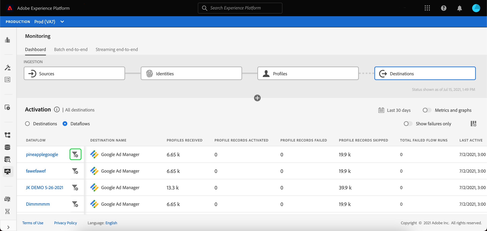

# UI에서 대상에 대한 데이터 흐름 모니터링

대상을 사용하면 Adobe Experience Platform에서 수많은 외부 파트너로 데이터를 활성화할 수 있습니다. 플랫폼 을 사용하면 데이터 흐름에 투명성을 제공하여 대상으로의 데이터 흐름 추적 프로세스를 보다 쉽게 수행할 수 있습니다.

모니터링 대시보드는 데이터가 활성화된 대상을 포함하여 데이터 흐름의 여정을 시각적으로 나타냅니다. 이 자습서에서는 대상 작업 영역에서 직접 데이터 흐름을 모니터링하거나 모니터링 대시보드를 사용하여 Experience Platform 사용자 인터페이스를 사용하여 대상의 데이터 흐름을 모니터링하는 방법에 대한 지침을 제공합니다.

## 시작하기

이 안내서에서는 Adobe Experience Platform의 다음 구성 요소를 이해하고 있어야 합니다.

- [데이터 흐름](../home.md): 데이터 흐름은 플랫폼 간에 데이터를 이동하는 데이터 작업을 나타냅니다. 데이터 흐름은 서로 다른 서비스 간에 구성되므로 소스 커넥터에서 대상 데이터 세트로 데이터를 [!DNL Identity] 및 [!DNL Profile], 및에 [!DNL Destinations].
   - [데이터 흐름 실행](../../sources/notifications.md): 데이터 흐름 실행은 선택한 데이터 흐름의 빈도 구성에 따라 반복되는 예약된 작업입니다.
- [Destinations](../../destinations/home.md): Destinations are pre-built integrations with commonly used applications that allow for the seamless activation of data from Platform for cross-channel marketing campaigns, email campaigns, targeted advertising, and many other use cases.
- [Sandboxes](../../sandboxes/home.md): [!DNL Experience Platform] provides virtual sandboxes which partition a single [!DNL Platform] instance into separate virtual environments to help develop and evolve digital experience applications.

## 대상 작업 공간에서 데이터 흐름 모니터링 {#monitor-dataflows-in-the-destinations-workspace}

In the **[!UICONTROL Destinations]** workspace within the Platform UI, navigate to the **[!UICONTROL Browse]** tab and select the name of a destination that you want to view.

기존 데이터 흐름 목록이 나타납니다. 이 페이지에는 대상, 사용자 이름, 데이터 흐름 수 및 상태에 대한 정보를 포함하여 볼 수 있는 데이터 흐름 목록이 있습니다.

상태에 대한 자세한 내용은 다음 표를 참조하십시오.

| 상태 | 설명 |
| ------ | ----------- |
| 활성화됨 | 다음 `Enabled` 상태는 데이터 흐름이 활성 상태이며 제공된 일정에 따라 데이터를 내보내고 있음을 나타냅니다. |
| 비활성화됨 | 다음 `Disabled` 상태는 데이터 흐름이 비활성 상태이고 데이터를 내보내지 않고 있음을 나타냅니다. |
| 처리 중 | 다음 `Processing` 상태는 데이터 흐름이 아직 활성화되지 않았음을 나타냅니다. 이 상태는 종종 새 데이터 흐름을 만든 후 즉시 발생합니다. |
| 오류 | 다음 `Error` 상태는 데이터 흐름의 활성화 프로세스가 중단되었음을 나타냅니다. |

### 스트리밍 대상에 대해 데이터 흐름 실행 {#dataflow-runs-for-streaming-destinations}

>[!CONTEXTUALHELP]
>id="platform_destinations_dataflow_identitiesactivated"
>title="ID가 활성화됨"
>abstract="개별 프로필 ID의 수가 선택한 대상에 성공적으로 활성화되었습니다."
>text="Learn more in documentation"

>[!CONTEXTUALHELP]
>id="platform_destinations_dataflow_identitiesexcluded"
>title="제외된 ID"
>abstract="누락된 속성 및 동의 위반을 기반으로 선택한 대상에 대한 활성화에서 제외된 개별 프로필 레코드 수입니다."
>text="Learn more in documentation"

>[!CONTEXTUALHELP]
>id="platform_destinations_dataflow_identitiesfailed"
>title="ID 실패"
>abstract="선택한 대상에 대해 실패한 개별 프로필 ID의 수입니다. 자세한 내용은 오류 진단을 확인하십시오."
>additional-url="https://adobe.com/go/destinations-monitor-dataflows-batch-en" text="자세한 내용은 문서에서 알아보십시오"

>[!CONTEXTUALHELP]
>id="platform_monitoring_dataflow_run_details_activation_streaming"
>title="데이터 흐름 실행 세부 정보"
>abstract="대상 데이터 흐름 실행 세부 사항에는 실시간 고객 프로필에서 가져온 세그먼트의 활성화 상태 및 지표에 대한 정보가 포함되어 있으며 고유한 ID를 생성합니다. 자세한 내용은 지표 정의 안내서를 참조하십시오."

>[!CONTEXTUALHELP]
>id="platform_monitoring_profiles_received_streaming"
>title="받은 프로필"
>abstract="데이터 플로우에서 받은 총 프로필 수 이 값은 60분마다 업데이트됩니다."
>text="Learn more in documentation"

>[!CONTEXTUALHELP]
>id="platform_destinations_dataflow_identitiesactivated_streaming"
>title="ID가 활성화됨"
>abstract="개별 프로필 ID의 수가 선택한 대상에 성공적으로 활성화되었습니다."
>text="Learn more in documentation"

>[!CONTEXTUALHELP]
>id="platform_destinations_dataflow_identitiesexcluded_streaming"
>title="제외된 ID"
>abstract="누락된 속성 및 동의 위반을 기반으로 선택한 대상에 대한 활성화에서 제외된 개별 프로필 레코드 수입니다."
>text="Learn more in documentation"

>[!CONTEXTUALHELP]
>id="platform_destinations_dataflow_identitiesfailed_streaming"
>title="ID 실패"
>abstract="선택한 대상에 대해 실패한 개별 프로필 ID의 수입니다. 자세한 내용은 오류 진단을 확인하십시오."
>text="Learn more in documentation"

스트리밍 대상의 경우, [!UICONTROL 데이터 흐름 실행] 탭은 데이터 흐름 실행에 대한 지표 데이터에 대한 시간별 업데이트를 제공합니다. 가장 눈에 띄는 통계들은 ID에 대한 것이다.

ID는 프로필의 다른 패싯을 나타냅니다. 예를 들어 프로필에 전화 번호와 이메일 주소가 모두 포함된 경우 해당 프로필에는 두 개의 ID가 있습니다.

개별 실행 및 해당 특정 지표 목록과 ID에 대한 다음 합계가 표시됩니다.

- **[!UICONTROL ID가 활성화됨]**: 활성화를 위해 만들거나 업데이트한 총 프로필 ID 수입니다.
- **[!UICONTROL 제외된 ID]**: 누락된 속성 및 동의 위반을 기반으로 하여 활성화를 위해 건너뛴 총 프로필 ID 수입니다.
- **[!UICONTROL ID 실패]**: 오류로 인해 대상에 활성화되지 않은 총 프로필 ID 수입니다.

각 개별 데이터 흐름 실행에는 다음 세부 정보가 표시됩니다.

- **[!UICONTROL 데이터 흐름 실행 시작]**: 데이터 흐름 실행이 시작된 시간입니다.
- **[!UICONTROL 처리 시간]**: 데이터 흐름을 처리하는 데 걸린 시간입니다.
- **[!UICONTROL 받은 프로필]**: 데이터 플로우에서 받은 총 프로필 수
- **[!UICONTROL ID가 활성화됨]**: 선택한 대상에 성공적으로 활성화된 총 프로필 ID 수입니다.
- **[!UICONTROL 제외된 ID]**: 누락된 속성 및 동의 위반으로 인해 활성화에서 제외된 총 프로필 ID 수입니다.
- **[!UICONTROL ID 실패]** 오류로 인해 대상에 활성화되지 않은 총 프로필 ID 수입니다.
- **[!UICONTROL 활성화 비율]**: 성공적으로 활성화되었거나 건너뛴 받은 ID의 백분율입니다. 다음 수식은 이 값을 계산하는 방법을 보여 줍니다.
   
- **[!UICONTROL 상태]**: 데이터 흐름의 상태를 나타냅니다. 둘 중 하나 [!UICONTROL 완료됨] 또는 [!UICONTROL 처리 중]. [!UICONTROL 완료됨] 은(는) 해당 데이터 흐름 실행에 대한 모든 ID를 1시간 기간 내에 내보냈음을 의미합니다. [!UICONTROL 처리 중] 은(는) 데이터 흐름 실행이 아직 완료되지 않았음을 의미합니다.

특정 데이터 흐름 실행에 대한 세부 정보를 보려면 목록에서 실행 시작 시간을 선택합니다.

데이터 흐름 실행에 대한 세부 정보 페이지에는 받은 프로필 수, 활성화된 ID 수, 실패한 ID 수 및 제외된 ID 수와 같은 추가 정보가 포함되어 있습니다.

세부 사항 페이지에는 실패한 ID 목록과 제외된 ID도 표시됩니다. 오류 코드, ID 수 및 설명을 포함하여 실패한 ID와 제외된 ID에 대한 정보가 표시됩니다. By default, the list displays the failed identities. 건너뛴 ID를 표시하려면 **[!UICONTROL 제외된 ID]** 토글.

### 데이터 흐름은 배치 대상에 대해 실행됩니다 {#dataflow-runs-for-batch-destinations}

>[!CONTEXTUALHELP]
>id="platform_monitoring_profiles_received"
>title="Profiles received"
>abstract="데이터 플로우에서 받은 총 프로필 수 This value is updated every 60 minutes."
>text="Learn more in documentation"

>[!CONTEXTUALHELP]
>id="platform_monitoring_dataflow_run_details_activation"
>title="데이터 흐름 실행 세부 정보"
>abstract="대상 데이터 흐름 실행 세부 사항에는 실시간 고객 프로필에서 가져온 세그먼트의 활성화 상태 및 지표에 대한 정보가 포함되어 있으며 고유한 ID를 생성합니다. To learn more, please review the metric definitions guide."

>[!CONTEXTUALHELP]
>id="platform_monitoring_dataflow_run_details_activation_batch"
>title="데이터 흐름 실행 세부 정보"
>abstract="대상 데이터 흐름 실행 세부 사항에는 실시간 고객 프로필에서 가져온 세그먼트의 활성화 상태 및 지표에 대한 정보가 포함되어 있으며 고유한 ID를 생성합니다. 자세한 내용은 지표 정의 안내서를 참조하십시오."

>[!CONTEXTUALHELP]
>id="platform_monitoring_profiles_received_batch"
>title="Profiles received"
>abstract="데이터 플로우에서 받은 총 프로필 수 이 값은 60분마다 업데이트됩니다."
>text="Learn more in documentation"

>[!CONTEXTUALHELP]
>id="platform_destinations_dataflow_identitiesactivated_batch"
>title="ID가 활성화됨"
>abstract="개별 프로필 ID의 수가 선택한 대상에 성공적으로 활성화되었습니다."
>text="Learn more in documentation"

>[!CONTEXTUALHELP]
>id="platform_destinations_dataflow_identitiesexcluded_batch"
>title="제외된 ID"
>abstract="누락된 속성 및 동의 위반을 기반으로 선택한 대상에 대한 활성화에서 제외된 개별 프로필 레코드 수입니다."
>text="Learn more in documentation"

배치 대상의 경우, [!UICONTROL 데이터 흐름 실행] 탭은 데이터 흐름 실행에 대한 지표 데이터를 제공합니다. 개별 실행 및 해당 특정 지표 목록과 ID에 대한 다음 합계가 표시됩니다.

- **[!UICONTROL ID가 활성화됨]**: 개별 프로필 ID의 수가 선택한 대상에 성공적으로 활성화되었습니다.
- **[!UICONTROL 제외된 ID]**: 누락된 속성 및 동의 위반을 기반으로 선택한 대상에 대한 활성화에서 제외된 개별 프로필 ID의 수입니다.

각 개별 데이터 흐름 실행에는 다음 세부 정보가 표시됩니다.

- **[!UICONTROL 데이터 흐름 실행 시작]**: 데이터 흐름 실행이 시작된 시간입니다.
- **[!UICONTROL 처리 시간]**: 데이터 흐름 실행을 처리하는 데 걸린 시간입니다.
- **[!UICONTROL 받은 프로필]**: 데이터 플로우에서 받은 총 프로필 수 이 값은 60분마다 업데이트됩니다.
- **[!UICONTROL ID가 활성화됨]**: 선택한 대상에 성공적으로 활성화된 총 프로필 ID 수입니다.
- **[!UICONTROL 제외된 ID]**: 누락된 속성 및 동의 위반으로 인해 활성화에서 제외된 총 프로필 ID 수입니다.
- **[!UICONTROL 상태]**: 데이터 흐름의 상태를 나타냅니다. 다음 세 가지 상태 중 하나일 수 있습니다. [!UICONTROL 성공], [!UICONTROL 실패], 및 [!UICONTROL 처리 중]. [!UICONTROL 성공] 은(는) 데이터 흐름이 활성 상태이고 제공된 일정에 따라 데이터를 내보내고 있음을 의미합니다. [!UICONTROL 실패] 은(는) 오류로 인해 데이터 활성화가 일시 중단되었음을 의미합니다. [!UICONTROL 처리 중] 은(는) 데이터 흐름이 아직 활성 상태가 아니며 새 데이터 흐름을 만들 때 일반적으로 발생함을 의미합니다.

특정 데이터 흐름 실행에 대한 세부 정보를 보려면 목록에서 실행 시작 시간을 선택합니다.

>[!NOTE]
>
>데이터 흐름 실행은 대상 데이터 흐름의 예약 빈도를 기반으로 생성됩니다. 세그먼트에 적용된 각 병합 정책에 대해 별도의 데이터 흐름 실행이 수행됩니다.

데이터 흐름 목록에 표시된 세부 정보 외에 데이터 흐름의 세부 정보 페이지에는 데이터 흐름에 대한 보다 구체적인 정보가 표시됩니다.

- **[!UICONTROL 데이터 크기]**: 내보낼 데이터 흐름의 크기입니다.
- **[!UICONTROL 총 파일 수]**: 데이터 흐름에서 내보낸 총 파일 수입니다.
- **[!UICONTROL 마지막 업데이트 날짜]**: 데이터 흐름 실행이 마지막으로 업데이트된 시간입니다.

세부 사항 페이지에는 실패한 ID 목록과 제외된 ID도 표시됩니다. 오류 코드 및 설명을 포함하여 실패한 ID와 제외된 ID에 대한 정보가 표시됩니다. 기본적으로 목록에 실패한 ID가 표시됩니다. 제외된 ID를 표시하려면 **[!UICONTROL 제외된 ID]** 토글.

## 대상 대시보드 모니터링 {#monitoring-destinations-dashboard}

>[!CONTEXTUALHELP]
>id="platform_monitoring_activation"
>title="활성화"
>abstract="대상 활성화에는 실시간 고객 프로필에서 가져온 세그먼트의 활성화 상태 및 지표에 대한 정보가 포함되어 있으며 고유한 ID를 생성합니다."

>[!CONTEXTUALHELP]
>id="platform_monitoring_segment_jobs"
>title="세그먼트 작업"
>abstract="세그먼트 작업 대시보드에는 모든 세그먼트에 대한 평가 및 내보내기 작업에 대한 정보가 포함되어 있습니다."

에 액세스하려면 [!UICONTROL 모니터링] 대시보드, 선택 **[!UICONTROL 모니터링]** ()을 클릭하여 제품에서 사용할 수 있습니다. 에 한 번 [!UICONTROL 모니터링] 페이지를 선택하고 [!UICONTROL 대상]. 다음 [!UICONTROL 모니터링] 대시보드에는 대상 실행 작업에 대한 지표와 정보가 포함되어 있습니다.

대시보드 중앙에는 대상으로 내보낸 데이터의 활성화 비율에 대한 데이터를 표시하는 지표와 그래프가 포함된 활성화 패널이 있습니다.

기본적으로 표시되는 데이터에는 지난 24시간의 활성화율이 포함됩니다. 선택 **[!UICONTROL 최근 24시간]** 를 눌러 표시되는 레코드의 시간대를 조정합니다. 사용 가능한 옵션은 다음과 같습니다 **[!UICONTROL 최근 24시간]**, **[!UICONTROL 최근 7일]**, 및 **[!UICONTROL 최근 30일]**. 또는 나타나는 달력 팝업 창에서 날짜를 선택할 수 있습니다. 날짜를 선택한 후 **[!UICONTROL 적용]** 를 눌러 표시된 정보의 시간대를 조정합니다.

>[!NOTE]
>
>다음 스크린샷은 지난 24시간이 아니라 최근 30일 동안의 활성화 율을 보여줍니다. 을(를) 선택하여 시간 프레임을 조정할 수 있습니다 **[!UICONTROL 최근 30일]**.

그래프가 기본적으로 표시되며, 이를 비활성화하여 아래 대상 목록을 확장할 수 있습니다. 을(를) 선택합니다 **[!UICONTROL 지표 및 그래프]** 그래프를 비활성화하려면 을(를) 전환합니다.

다음 **[!UICONTROL 활성화]** 패널에는 하나 이상의 기존 계정이 포함된 대상 목록이 표시됩니다. 이 목록에는 받은 프로필, 활성화된 프로필 레코드, 프로필 레코드 실패, 프로필 레코드 건너뛰기, 실패한 총 데이터 흐름, 이러한 대상에 대한 마지막 업데이트 날짜에 대한 정보도 포함됩니다.

대상 목록을 필터링하여 선택한 대상 카테고리만 표시할 수도 있습니다. 을(를) 선택합니다 **[!UICONTROL 내 대상]** 드롭다운을 누르고 필터링할 대상 유형을 선택합니다.

또한 검색 막대에 대상을 입력하여 단일 대상으로 분리할 수 있습니다. 대상의 데이터 흐름을 보려면 필터를 선택할 수 있습니다  옆에 활성 데이터 흐름 목록을 보려면 해당 데이터 흐름 목록을 확인하십시오.

모든 대상에서 기존 데이터 흐름을 모두 보려면 **[!UICONTROL 데이터 흐름]**.

데이터 흐름 목록이 표시되며, 각 대상을 기준으로 그룹화됩니다. 모니터링할 대상을 찾아 필터를 선택하여 특정 데이터 집합에 대한 추가 세부 정보를 볼 수 있습니다  옆에 있는 필터를 선택한 다음 필터를 선택합니다  데이터 흐름 옆의 정보 옆에 있어야 합니다.

데이터 흐름 실행 페이지에는 데이터 흐름 실행 시작 시간, 처리 시간, 받은 프로필, 활성화된 ID, 제외된 ID, 실패한 ID, 활성화 비율 및 상태를 비롯한 데이터 흐름 관련 정보가 표시됩니다. 특정 데이터 흐름 실행에 대한 자세한 내용을 보려면 필터를 선택합니다  데이터 흐름 실행 시작 시간 옆의 를 클릭합니다.

데이터 흐름 세부 정보 페이지에는 데이터 흐름 목록에 표시된 세부 정보 외에 데이터 흐름에 대한 자세한 정보가 표시됩니다.

- **[!UICONTROL 데이터 흐름 실행 ID]**: 데이터 흐름의 ID입니다.
- **[!UICONTROL IMS 조직 ID]**: 데이터 흐름이 속한 IMS 조직입니다.
- **[!UICONTROL 마지막 업데이트 날짜]**: 데이터 흐름 실행이 마지막으로 업데이트된 시간입니다.

세부 사항 페이지에는 실패한 ID 목록과 제외된 ID도 표시됩니다. Information for both the failed and excluded identities is displayed, including the error code, identity count, and description. By default, the list displays the failed identities. 건너뛴 ID를 표시하려면 **[!UICONTROL 제외된 ID]** 토글.

## 다음 단계

By following this guide, you now know how to monitor dataflows for both batch and streaming destinations, including all the relevant information such as processing time, activation rate, and status. Platform의 데이터 플로우에 대한 자세한 내용은 [데이터 흐름 개요](../home.md). 대상에 대한 자세한 내용은 [대상 개요](../../destinations/home.md).