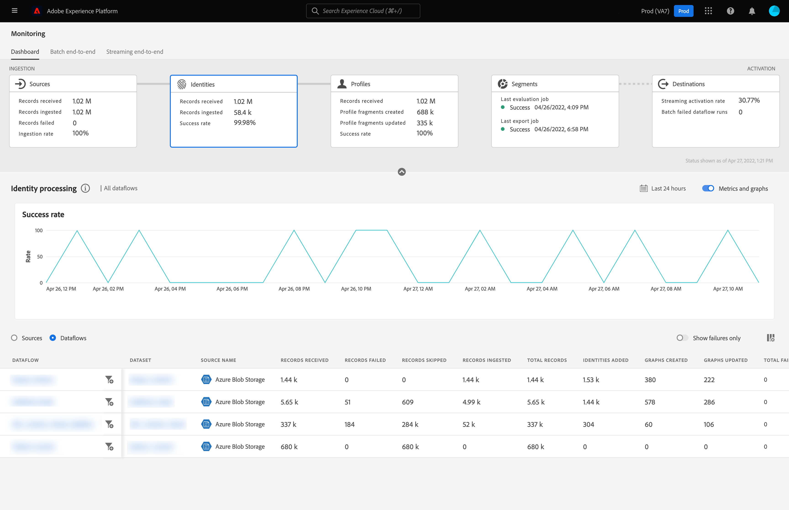

# UI에서 ID에 대한 데이터 흐름 모니터링

Adobe Experience Platform ID 서비스는 여러 디바이스 및 시스템에 걸쳐 ID를 연결하여 고객과 고객의 행동을 종합적으로 파악할 수 있으므로, 실시간으로 효과적인 개인 디지털 환경을 제공할 수 있습니다.

모니터링 대시보드는 데이터의 ID 상태를 포함하여 ID 내에서 데이터의 활동을 시각적으로 표시합니다. 이 자습서에서는 모니터링 대시보드를 사용하여 ID 처리 상태를 추적할 수 있도록 Experience Platform 사용자 인터페이스를 사용하여 데이터의 ID를 모니터링하는 방법에 대한 지침을 제공합니다.

## 시작하기 {#getting-started}

- [데이터 흐름](../home.md): 데이터 흐름은 플랫폼 간에 데이터를 이동하는 데이터 작업을 나타냅니다. 데이터 흐름은 여러 서비스에 걸쳐 구성되어 있으므로 데이터를 소스 커넥터에서 대상 데이터 세트로, [!DNL Identity] 및 [!DNL Profile], [!DNL Destinations](으)로 이동하는 데 도움이 됩니다.
   - [데이터 흐름 실행](../../sources/notifications.md): 데이터 흐름 실행은 선택한 데이터 흐름의 빈도 구성에 따라 반복되는 예약된 작업입니다.
- [ID 서비스](../../identity-service/home.md): 장치 및 시스템 간에 ID를 연결하여 개별 고객 및 개별 고객의 행동을 더 잘 볼 수 있습니다.
- [샌드박스](../../sandboxes/home.md): [!DNL Experience Platform]에서는 단일 [!DNL Platform] 인스턴스를 별도의 가상 환경으로 분할하여 디지털 경험 응용 프로그램을 개발하고 발전시키는 데 도움이 되는 가상 샌드박스를 제공합니다.

## ID 대시보드 모니터링 {#identity-metrics}

>[!CONTEXTUALHELP]
>id="platform_monitoring_identity_processing"
>title="ID 처리"
>abstract="ID 처리 보기에는 추가된 ID 수, 생성된 그래프와 업데이트된 그래프 등 ID 서비스에 수집된 레코드에 대한 정보가 포함됩니다. 지표와 그래프에 대해 자세한 내용은 지표 정의 안내서를 검토하십시오."
>text="Learn more in documentation"

>[!CONTEXTUALHELP]
>id="platform_monitoring_dataflow_run_details_identity"
>title="데이터 흐름 실행 세부 정보"
>abstract="데이터 흐름 실행 세부 정보 페이지에 조직 ID와 데이터 흐름 실행 ID 등 ID 데이터 흐름 실행에 대한 추가 정보가 표시됩니다."

**[!UICONTROL ID]** 대시보드에 액세스하려면 왼쪽 탐색에서 **[!UICONTROL 모니터링]**&#x200B;을 선택하십시오. **[!UICONTROL 모니터링]** 페이지에서 **[!UICONTROL ID]** 카드를 선택하십시오.

기본 **[!UICONTROL ID]** 대시보드에서 **[!UICONTROL ID]** 카드에 받은 총 레코드 수, 수집된 레코드 수 및 레코드 수집 성공률에 대한 정보가 표시됩니다.

대시보드 자체에는 ID 처리에 대한 지표가 포함되어 있습니다. 기본적으로 대시보드에는 지난 24시간 동안 조직 소스에 대한 ID 처리 세부 정보가 표시됩니다.

[!UICONTROL ID 처리] 페이지에는 추가된 ID 수, 만들어진 그래프 및 업데이트된 그래프를 포함하여 [!DNL Identity Service]에 수집된 레코드에 대한 정보가 포함되어 있습니다.

이 대시보드 보기에 사용할 수 있는 지표는 다음과 같습니다.

| ID 지표 | 설명 |
| ---------------- | ----------- |
| **[!UICONTROL 받은 레코드]** | 데이터 레이크에서 받은 레코드 수입니다. |
| **[!UICONTROL 기록 실패]** | 데이터의 오류로 인해 플랫폼으로 수집되지 않은 레코드 수입니다. |
| **[!UICONTROL 생략된 레코드]** | 레코드 행에 식별자가 하나만 있으므로 [!DNL Identity Service]에 수집되지 않고 수집된 레코드 수입니다. |
| **[!UICONTROL 수집된 레코드]** | [!DNL Identity Service]에 수집된 레코드 수입니다. |
| **[!UICONTROL 추가된 ID]** | [!DNL Identity Service]에 추가된 순 새 식별자 수입니다. |
| **[!UICONTROL 그래프 생성됨]** | [!DNL Identity Service]에 만들어진 순 새 ID 그래프 수입니다. |
| **[!UICONTROL 그래프 업데이트됨]** | 새 에지로 업데이트된 기존 ID 그래프 수입니다. |
| **[!UICONTROL 실패한 총 데이터 흐름]** | 실패한 데이터 흐름 실행 수입니다. |

소스 이름 옆에 있는 필터 아이콘 을 선택하여 선택한 소스의 데이터 흐름에 대한 ID 처리 정보를 볼 수 있습니다.

또는 토글을 선택하여 지난 24시간 동안 조직의 데이터 흐름에 대한 ID 처리 세부 정보를 볼 수 있습니다. **[!UICONTROL 데이터 흐름]**

이 대시보드 보기에 사용할 수 있는 지표는 다음과 같습니다.

| 지표 | 설명 |
| -------| ----------- |
| **[!UICONTROL 데이터 흐름]** | 데이터 흐름의 이름입니다. |
| **[!UICONTROL 데이터 집합]** | 데이터 흐름이 삽입되는 데이터 세트의 이름입니다. |
| **[!UICONTROL Source 이름]** | 데이터 흐름이 속하는 소스의 이름입니다. |
| **[!UICONTROL 받은 레코드]** | 데이터 레이크에서 받은 레코드 수입니다. |
| **[!UICONTROL 기록 실패]** | 데이터의 오류로 인해 플랫폼으로 수집되지 않은 레코드 수입니다. |
| **[!UICONTROL 생략된 레코드]** | 레코드 행에 식별자가 하나만 있으므로 [!DNL Identity Service]에 수집되지 않고 수집된 레코드 수입니다. |
| **[!UICONTROL 수집된 레코드]** | [!DNL Identity Service]에 수집된 레코드 수입니다. |
| **[!UICONTROL 총 레코드]** | 실패한 레코드, 건너뛴 레코드, 추가된 ID 및 복제된 레코드를 포함한 모든 레코드의 총 개수입니다. |
| **[!UICONTROL 추가된 ID]** | [!DNL Identity Service]에 추가된 순 새 식별자 수입니다. |
| **[!UICONTROL 그래프 생성됨]** | [!DNL Identity Service]에 만들어진 순 새 ID 그래프 수입니다. |
| **[!UICONTROL 그래프 업데이트됨]** | 새 에지로 업데이트된 기존 ID 그래프 수입니다. |
| **[!UICONTROL 실패한 총 데이터 흐름]** | 실패한 데이터 흐름 실행 수입니다. |

[!DNL Identity] 데이터 흐름 실행에 대한 자세한 내용을 보려면 데이터 흐름 실행 시작 시간 옆에 있는 필터 아이콘 을(를) 선택하십시오.

[!UICONTROL 데이터 흐름 실행 세부 정보] 페이지에는 조직 ID 및 데이터 흐름 실행 ID를 포함하여 [!DNL Identity] 데이터 흐름 실행에 대한 자세한 정보가 표시됩니다. 수집 프로세스에서 오류가 발생하는 경우 해당 오류 코드와 [!DNL Identity Service]에서 제공한 오류 메시지도 이 페이지에 표시됩니다.

이 대시보드 보기에 사용할 수 있는 지표는 다음과 같습니다.

| 지표 | 설명 |
| -------| ----------- |
| **[!UICONTROL 받은 레코드]** | 데이터 레이크에서 받은 레코드 수입니다. |
| **[!UICONTROL 기록 실패]** | 데이터의 오류로 인해 플랫폼으로 수집되지 않은 레코드 수입니다. |
| **[!UICONTROL 생략된 레코드]** | 레코드 행에 식별자가 하나만 있으므로 [!DNL Identity Service]에 수집되지 않고 수집된 레코드 수입니다. |
| **[!UICONTROL 수집된 레코드]** | [!DNL Identity Service]에 수집된 레코드 수입니다. |
| **[!UICONTROL 추가된 ID]** | [!DNL Identity Service]에 추가된 순 새 식별자 수입니다. |
| **[!UICONTROL 그래프 생성됨]** | [!DNL Identity Service]에 만들어진 순 새 ID 그래프 수입니다. |
| **[!UICONTROL 그래프 업데이트됨]** | 새 에지로 업데이트된 기존 ID 그래프 수입니다. |
| **[!UICONTROL 상태]** | 데이터 흐름의 전체 상태를 정의합니다. 가능한 상태 값은 다음과 같습니다. <ul><li>`Success`: 데이터 흐름이 활성 상태이며 제공된 일정에 따라 데이터를 수집 중임을 나타냅니다.</li><li>`Failed`: 오류로 인해 데이터 흐름의 활성화 프로세스가 중단되었음을 나타냅니다. </li><li>`Processing`: 데이터 흐름이 아직 활성화되지 않았음을 나타냅니다. 이 상태는 종종 새 데이터 흐름이 생성된 직후에 발생합니다.</li></ul> |
| **[!UICONTROL 데이터 흐름 실행 시작]** | 데이터 흐름이 실행된 날짜 및 시간입니다. |
| **[!UICONTROL 마지막으로 업데이트됨]** | 데이터 흐름이 마지막으로 업데이트된 날짜 및 시간입니다. |
| **[!UICONTROL 오류 요약]** | 데이터 흐름 실행이 실패한 경우 데이터 흐름 실행이 실패한 이유에 대한 오류 코드와 요약이 표시됩니다. |
| **[!UICONTROL 데이터 흐름 실행 ID]** | 데이터 흐름이 실행되는 ID입니다. |
| **[!UICONTROL IMS 조직 ID]** | 데이터 흐름 실행이 속한 조직 ID입니다. |

또한 토글을 선택하여 실패한 레코드 또는 건너뛴 레코드를 볼 수 있습니다. 오류 섹션에는 오류 코드 및 실패 또는 제외된 레코드 수에 대한 세부 정보가 포함됩니다.
