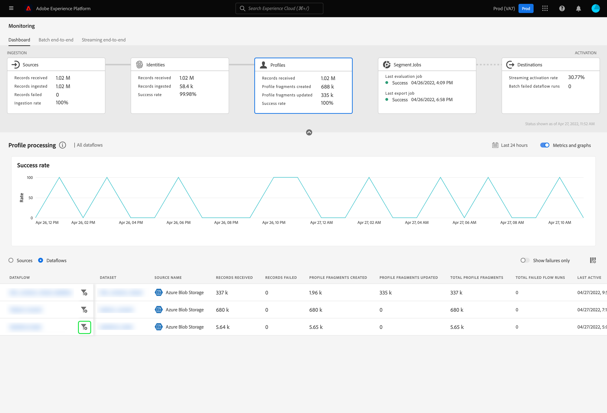

# UI에서 프로필에 대한 데이터 흐름 모니터링

실시간 고객 프로필을 사용하면 온라인, 오프라인, CRM 및 서드파티를 비롯한 여러 채널의 데이터를 결합하여 각 개별 고객에 대한 거시적인 보기를 확인할 수 있습니다. 프로필을 사용하면 모든 고객 상호 작용에 대해 실행 가능한 타임스탬프 계정을 제공하는 통합 보기로 고객 데이터를 통합할 수 있습니다.

모니터링 대시보드는 데이터 프로필의 상태를 포함하여 프로필 내에서 데이터의 활동을 시각적으로 표시합니다. 이 자습서에서는 Experience Platform 사용자 인터페이스를 사용하여 모니터링 대시보드를 사용하여 데이터의 프로필을 모니터링하여 프로필 처리 상태를 추적하는 방법에 대한 지침을 제공합니다.

## 시작하기 {#getting-started}

이 안내서를 사용하려면 Adobe Experience Platform의 다음 구성 요소에 대해 이해하고 있어야 합니다.

- [데이터 흐름](../home.md): 데이터 흐름은 플랫폼 간에 데이터를 이동하는 데이터 작업을 나타냅니다. 데이터 흐름은 여러 서비스에 걸쳐 구성되어 있으므로 데이터를 소스 커넥터에서 대상 데이터 세트로, [!DNL Identity] 및 [!DNL Profile], [!DNL Destinations](으)로 이동하는 데 도움이 됩니다.
   - [데이터 흐름 실행](../../sources/notifications.md): 데이터 흐름 실행은 선택한 데이터 흐름의 빈도 구성에 따라 반복되는 예약된 작업입니다.
- [실시간 고객 프로필](../../profile/home.md): 여러 소스의 집계 데이터를 기반으로 통합된 실시간 고객 프로필을 제공합니다.
- [샌드박스](../../sandboxes/home.md): [!DNL Experience Platform]에서는 단일 [!DNL Platform] 인스턴스를 별도의 가상 환경으로 분할하여 디지털 경험 응용 프로그램을 개발하고 발전시키는 데 도움이 되는 가상 샌드박스를 제공합니다.

## 프로필 대시보드 모니터링 {#profile-metrics}

>[!CONTEXTUALHELP]
>id="platform_monitoring_profile_processing"
>title="프로필 처리"
>abstract="프로필 처리 보기에는 생성된 프로필 조각 수, 업데이트된 프로필 조각과 총 프로필 조각 수 등 프로필 서비스에 수집된 레코드에 대한 정보가 포함됩니다."
>text="Learn more in documentation"

>[!CONTEXTUALHELP]
>id="platform_monitoring_dataflow_run_details_profile"
>title="데이터 흐름 실행 세부 정보"
>abstract="데이터 흐름 실행 세부 정보 페이지에 조직 ID와 데이터 흐름 실행 ID 등 프로필 데이터 흐름 실행에 대한 추가 정보가 표시됩니다."

**[!UICONTROL 프로필]** 대시보드에 액세스하려면 왼쪽 탐색에서 **[!UICONTROL 모니터링]**&#x200B;을 선택하십시오. **[!UICONTROL 모니터링]** 페이지에서 **[!UICONTROL 프로필]** 카드를 선택하십시오.

기본 **[!UICONTROL 프로필]** 대시보드에서 **[!UICONTROL 프로필]** 카드는 받은 총 레코드 수, 만들고 업데이트한 프로필 조각 수 및 만들고 업데이트한 프로필 조각의 성공률에 대한 정보를 표시합니다.

대시보드 자체에는 프로필 처리에 대한 지표가 포함되어 있습니다. 기본적으로 대시보드에는 지난 24시간 동안 조직의 소스에 대한 프로필 처리 세부 정보가 표시됩니다.

[!UICONTROL 프로필 처리] 페이지에는 만들어진 프로필 조각 수, 업데이트된 프로필 조각 수 및 총 프로필 조각 수를 포함하여 [!DNL Profile]에 수집된 레코드에 대한 정보가 포함되어 있습니다.

이 대시보드 보기에 사용할 수 있는 지표는 다음과 같습니다.

| 지표 | 설명 |
| -------| ----------- |
| **[!UICONTROL Source 이름]** | 소스의 이름입니다. |
| **[!UICONTROL 받은 레코드]** | 데이터 레이크에서 받은 레코드 수입니다. |
| **[!UICONTROL 기록 실패]** | 수집되었지만 오류로 인해 [!DNL Profile]에 수집되지 않은 레코드 수입니다. |
| **[!UICONTROL 프로필 조각 생성됨]** | 추가된 순 새 [!DNL Profile] 조각의 수입니다. |
| **[!UICONTROL 프로필 조각 업데이트됨]** | 업데이트된 기존 [!DNL Profile] 조각의 수입니다. |
| **[!UICONTROL 총 프로필 조각]** | 업데이트된 기존 [!DNL Profile]개 조각과 새로 만든 [!DNL Profile]개 조각을 포함하여 [!DNL Profile]에 기록된 총 레코드 수입니다. |
| **[!UICONTROL 실패한 총 데이터 흐름]** | 실패한 데이터 흐름 실행 수입니다. |

소스 이름 옆에 있는 필터 아이콘 을 선택하여 선택한 소스의 데이터 흐름에 대한 프로필 처리 정보를 볼 수 있습니다.

또는 토글을 선택하여 지난 24시간 동안 조직의 데이터 흐름에 대한 프로필 처리 세부 정보를 볼 수 있습니다. **[!UICONTROL 데이터 흐름]**

이 대시보드 보기에 사용할 수 있는 지표는 다음과 같습니다.

| 지표 | 설명 |
| -------| ----------- |
| **[!UICONTROL 데이터 흐름]** | 데이터 흐름의 이름입니다. |
| **[!UICONTROL 데이터 집합]** | 데이터 흐름이 삽입되는 데이터 세트의 이름입니다. |
| **[!UICONTROL Source 이름]** | 데이터 흐름이 속하는 소스의 이름입니다. |
| **[!UICONTROL 받은 레코드**] | 데이터 레이크에서 받은 레코드 수입니다. |
| **[!UICONTROL 기록 실패]** | 수집되었지만 오류로 인해 [!DNL Profile]에 수집되지 않은 레코드 수입니다. |
| **[!UICONTROL 프로필 조각 생성됨]** | 추가된 순 새 [!DNL Profile] 조각의 수입니다. |
| **[!UICONTROL 프로필 조각 업데이트됨]** | 업데이트된 기존 [!DNL Profile]개 조각 수 |
| **[!UICONTROL 총 프로필 조각]** | 업데이트된 기존 [!DNL Profile]개 조각과 새로 만든 [!DNL Profile]개 조각을 포함하여 [!DNL Profile]에 기록된 총 레코드 수입니다. |
| **[!UICONTROL 총 실패한 흐름 실행]** | 실패한 데이터 흐름 실행 수입니다. |
| **[!UICONTROL 마지막 활성]** | 데이터 흐름이 마지막으로 실행된 타임스탬프입니다. |

[!DNL Profile] 데이터 흐름 실행에 대한 자세한 내용을 보려면 데이터 흐름 실행 시작 시간 옆에 있는 필터 아이콘 을(를) 선택하십시오.

[!UICONTROL 데이터 흐름 실행 세부 정보] 페이지에는 조직 ID 및 데이터 흐름 실행 ID를 포함하여 [!DNL Profile] 데이터 흐름 실행에 대한 자세한 정보가 표시됩니다. 수집 프로세스에서 오류가 발생하는 경우 해당 오류 코드와 [!DNL Profile]에서 제공한 오류 메시지도 이 페이지에 표시됩니다.

이 대시보드 보기에 사용할 수 있는 지표는 다음과 같습니다.

| 지표 | 설명 |
| -------| ----------- |
| **[!UICONTROL 받은 레코드]** | 데이터 레이크에서 받은 레코드 수입니다. |
| **[!UICONTROL 기록 실패]** | 수집되었지만 오류로 인해 [!DNL Profile]에 수집되지 않은 레코드 수입니다. |
| **[!UICONTROL 프로필 조각 생성됨]** | 추가된 순 새 [!DNL Profile] 조각의 수입니다. |
| **[!UICONTROL 프로필 조각 업데이트됨]** | 업데이트된 기존 [!DNL Profile] 조각의 수입니다. |
| **[!UICONTROL 상태]** | 데이터 흐름의 전체 상태를 정의합니다. 가능한 상태 값은 다음과 같습니다. <ul><li>`Success`: 데이터 흐름이 활성 상태이며 제공된 일정에 따라 데이터를 수집 중임을 나타냅니다.</li><li>`Failed`: 오류로 인해 데이터 흐름의 활성화 프로세스가 중단되었음을 나타냅니다. </li><li>`Processing`: 데이터 흐름이 아직 활성화되지 않았음을 나타냅니다. 이 상태는 종종 새 데이터 흐름이 생성된 직후에 발생합니다.</li></ul> |
| **[!UICONTROL 데이터 흐름 실행 시작]** | 데이터 흐름이 실행된 날짜 및 시간입니다. |
| **[!UICONTROL 마지막으로 업데이트됨]** | 데이터 흐름이 마지막으로 업데이트된 날짜 및 시간입니다. |
| **[!UICONTROL 오류 요약]** | 데이터 흐름 실행이 실패한 경우 데이터 흐름 실행이 실패한 이유에 대한 오류 코드와 요약이 표시됩니다. |
| **[!UICONTROL 데이터 흐름 실행 ID]** | 데이터 흐름이 실행되는 ID입니다. |
| **[!UICONTROL IMS 조직 ID]** | 데이터 흐름 실행이 속한 조직 ID입니다. |

또한 토글을 선택하여 실패한 레코드 또는 건너뛴 레코드를 볼 수 있습니다. 오류 섹션에는 오류 코드 및 실패 또는 제외된 레코드 수에 대한 세부 정보가 포함됩니다.
