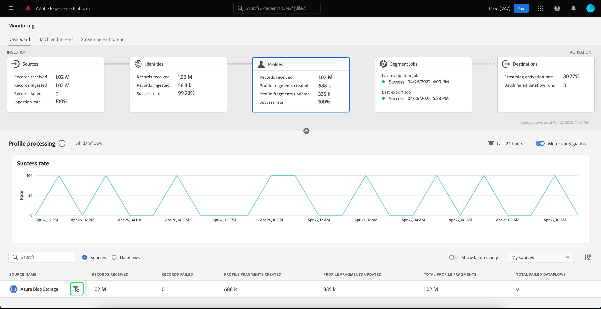
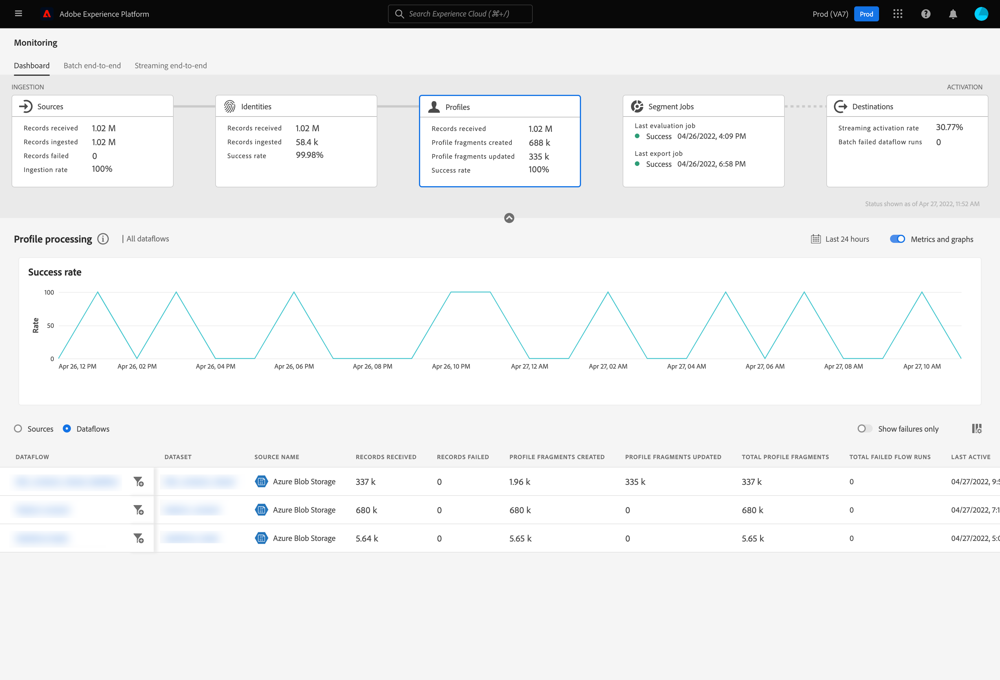

# UI에서 프로필에 대한 데이터 흐름 모니터링

실시간 고객 프로필을 사용하면 온라인, 오프라인, CRM 및 타사 등 여러 채널의 데이터를 결합하여 각 개별 고객을 전체적으로 볼 수 있습니다. 프로필을 사용하면 모든 고객 인터랙션에 대해 실행 가능한 타임스탬프 계정을 제공하는 통합 보기로 고객 데이터를 통합할 수 있습니다.

모니터링 대시보드는 데이터의 프로필 상태를 포함하여 프로필 내에서 데이터의 활동을 시각적으로 보여줍니다. 이 자습서에서는 Experience Platform 사용자 인터페이스를 사용하여 모니터링 대시보드를 사용하여 데이터의 프로필을 모니터링하는 방법에 대한 지침을 제공하여 프로필 처리 상태를 추적할 수 있습니다.

## 시작하기 {#getting-started}

이 안내서에서는 Adobe Experience Platform의 다음 구성 요소를 이해하고 있어야 합니다.

- [데이터 흐름](../home.md): 데이터 흐름은 플랫폼 간에 데이터를 이동하는 데이터 작업을 나타냅니다. 데이터 흐름은 서로 다른 서비스 간에 구성되므로 소스 커넥터에서 대상 데이터 세트로 데이터를 [!DNL Identity] 및 [!DNL Profile], 및에 [!DNL Destinations].
   - [데이터 흐름 실행](../../sources/notifications.md): 데이터 흐름 실행은 선택한 데이터 흐름의 빈도 구성에 따라 반복되는 예약된 작업입니다.
- [실시간 고객 프로필](../../profile/home.md): 여러 소스에서 집계된 데이터를 기반으로 통합된 실시간 소비자 프로필을 제공합니다.
- [샌드박스](../../sandboxes/home.md): [!DNL Experience Platform] 단일 파티션을 생성하는 가상 샌드박스 제공 [!DNL Platform] 디지털 경험 애플리케이션을 개발하고 발전시키는 데 도움이 되는 별도의 가상 환경으로 인스턴스를 구축할 수 있습니다.

## 프로필 대시보드 모니터링 {#profile-metrics}

>[!CONTEXTUALHELP]
>id="platform_monitoring_profile_processing"
>title="프로필 처리"
>abstract="프로필 처리 보기에는 생성된 프로필 조각 수, 업데이트된 프로필 조각 및 총 프로필 조각 수를 포함하여 프로필 서비스에 수집된 레코드에 대한 정보가 포함되어 있습니다."
>text="Learn more in documentation"

>[!CONTEXTUALHELP]
>id="platform_monitoring_dataflow_run_details_profile"
>title="데이터 흐름 실행 세부 정보"
>abstract="데이터 흐름 실행 세부 정보 페이지에는 조직 ID 및 데이터 흐름 실행 ID를 포함하여 프로필 데이터 흐름 실행에 대한 자세한 정보가 표시됩니다."

에 액세스하려면 **[!UICONTROL 프로필]** 대시보드, 선택 **[!UICONTROL 모니터링]** 을 클릭합니다. 에 한 번 **[!UICONTROL 모니터링]** 페이지에서 을 선택합니다 **[!UICONTROL 프로필]** 카드.

주 **[!UICONTROL 프로필]** 대시보드, **[!UICONTROL 프로필]** 카드에는 받은 총 레코드 수, 만들고 업데이트된 프로필 조각 수 및 작성된 프로필 조각과 업데이트된 프로필 조각의 성공 비율에 대한 정보가 표시됩니다.

대시보드 자체에는 프로필 처리에 대한 지표가 포함되어 있습니다. 기본적으로 대시보드는 최근 24시간 동안 조직 소스에 대한 프로필 처리 세부 정보를 표시합니다.

다음 [!UICONTROL 프로필 처리] 페이지에 수집되는 레코드에 대한 정보가 포함되어 있습니다 [!DNL Profile]생성된 프로필 조각, 업데이트된 프로필 조각 및 총 프로필 조각 수를 포함합니다.

이 대시보드 보기에 다음 지표를 사용할 수 있습니다.

| 지표 | 설명 |
| -------| ----------- |
| **[!UICONTROL 소스 이름]** | 소스의 이름입니다. |
| **[!UICONTROL 받은 레코드]** | 데이터 레이크에서 받은 레코드 수입니다. |
| **[!UICONTROL 레코드 실패]** | 수집되었지만 수집되지 않은 레코드 수입니다. [!DNL Profile] 오류 때문에. |
| **[!UICONTROL 생성된 프로필 조각]** | 새 순 개수 [!DNL Profile] 조각이 추가되었습니다. |
| **[!UICONTROL 프로필 조각 업데이트됨]** | 기존 수 [!DNL Profile] 조각이 업데이트되었습니다. |
| **[!UICONTROL 총 프로필 조각]** | 에 작성된 총 레코드 수 [!DNL Profile], 기존 항목 모두 포함 [!DNL Profile] 조각 업데이트와 새 [!DNL Profile] 조각을 만들었습니다. |
| **[!UICONTROL 실패한 총 데이터 흐름 수]** | 실패한 데이터 흐름 실행 수입니다. |

필터 아이콘을 선택할 수 있습니다  소스 이름 옆에 를 추가하여 선택한 소스의 데이터 플로우에 대한 프로필 처리 정보를 확인합니다.

또는 다음을 선택할 수 있습니다 **[!UICONTROL 데이터 흐름]** 토글을 통해 지난 24시간 동안 조직의 데이터 플로우에 대한 프로필 처리 세부 사항을 확인하십시오.

이 대시보드 보기에 다음 지표를 사용할 수 있습니다.

| 지표 | 설명 |
| -------| ----------- |
| **[!UICONTROL 데이터 흐름]** | 데이터 흐름의 이름입니다. |
| **[!UICONTROL 데이터 세트]** | 데이터 플로가 삽입하는 데이터 집합의 이름입니다. |
| **[!UICONTROL 소스 이름]** | 데이터 흐름이 속한 소스의 이름입니다. |
| **[!UICONTROL 받은 레코드**] | 데이터 레이크에서 받은 레코드 수입니다. |
| **[!UICONTROL 레코드 실패]** | 수집되었지만 수집되지 않은 레코드 수입니다. [!DNL Profile] 오류 때문에. |
| **[!UICONTROL 생성된 프로필 조각]** | 새 순 개수 [!DNL Profile] 조각이 추가되었습니다. |
| **[!UICONTROL 프로필 조각 업데이트됨]** | 기존 수 [!DNL Profile] 업데이트된 조각 |
| **[!UICONTROL 총 프로필 조각]** | 에 작성된 총 레코드 수 [!DNL Profile], 기존 항목 모두 포함 [!DNL Profile] 조각 업데이트와 새 [!DNL Profile] 조각을 만들었습니다. |
| **[!UICONTROL 실패한 총 흐름 실행 수]** | 실패한 데이터 흐름 실행 수입니다. |
| **[!UICONTROL 마지막 활성]** | 데이터 흐름이 마지막으로 실행된 타임스탬프입니다. |

필터 아이콘을 선택합니다  데이터 흐름 시작 시간 옆의 를 사용하여 [!DNL Profile] 데이터 흐름 실행.

다음 [!UICONTROL 데이터 흐름 실행 세부 정보] 페이지에 자세한 정보가 표시됩니다 [!DNL Profile] 데이터 흐름 실행(조직 ID 및 데이터 흐름 실행 ID 포함). 또한 이 페이지에는 [!DNL Profile]: 수집 프로세스에서 오류가 발생하는 경우

이 대시보드 보기에 다음 지표를 사용할 수 있습니다.

| 지표 | 설명 |
| -------| ----------- |
| **[!UICONTROL 받은 레코드]** | 데이터 레이크에서 받은 레코드 수입니다. |
| **[!UICONTROL 레코드 실패]** | 수집되었지만 수집되지 않은 레코드 수입니다. [!DNL Profile] 오류 때문에. |
| **[!UICONTROL 생성된 프로필 조각]** | 새 순 개수 [!DNL Profile] 조각이 추가되었습니다. |
| **[!UICONTROL 프로필 조각 업데이트됨]** | 기존 수 [!DNL Profile] 조각이 업데이트되었습니다. |
| **[!UICONTROL 상태]** | 데이터 흐름의 전체 상태를 정의합니다. 가능한 상태 값은 다음과 같습니다. <ul><li>`Success`: 데이터 흐름이 활성 상태이고 제공된 일정에 따라 데이터를 수집 중임을 나타냅니다.</li><li>`Failed`: 오류로 인해 데이터 흐름의 활성화 프로세스가 중단되었음을 나타냅니다. </li><li>`Processing`: 데이터 흐름이 아직 활성 상태가 아님을 나타냅니다. 이 상태는 종종 새 데이터 흐름을 만든 후 즉시 발생합니다.</li></ul> |
| **[!UICONTROL 데이터 흐름 실행 시작]** | 데이터 흐름 실행이 시작된 날짜 및 시간입니다. |
| **[!UICONTROL 마지막으로 업데이트됨]** | 데이터 흐름이 마지막으로 업데이트된 날짜 및 시간입니다. |
| **[!UICONTROL 오류 요약]** | 데이터 흐름 실행이 실패하면 오류 코드와 데이터 흐름 실행이 실패한 이유에 대한 요약이 표시됩니다. |
| **[!UICONTROL 데이터 흐름 실행 ID]** | 데이터 흐름 실행의 ID입니다. |
| **[!UICONTROL IMS 조직 ID]** | 데이터 흐름 실행이 속하는 조직 ID입니다. |

또한 토글을 선택하여 레코드 실패 또는 건너뛴 레코드를 볼 수 있습니다. 오류 섹션에는 오류 코드 및 실패 또는 제외된 레코드 수에 대한 세부 정보가 포함됩니다.
