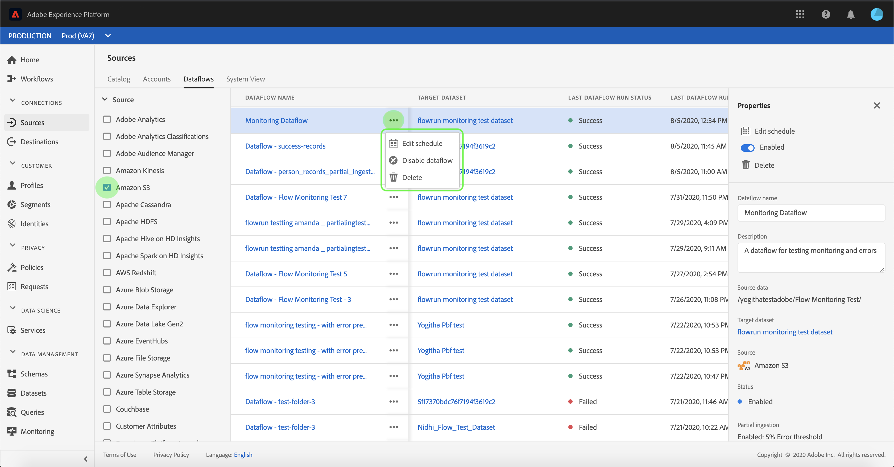

# UI에서 소스의 데이터 흐름 모니터링

Adobe Experience Platform의 소스 커넥터는 예약된 기준으로 외부 소스 데이터를 인제스트하는 기능을 제공합니다. 이 자습서에서는 소스 작업 영역에서 기존 데이터 흐름을 보는 [!UICONTROL 단계를] 제공합니다.

## 시작하기

이 자습서에서는 다음 Adobe Experience Platform 구성 요소에 대해 작업해야 합니다.

- [소스](../../sources/home.md): [!DNL Experience Platform] 서비스를 사용하여 들어오는 데이터를 구조화, 레이블 지정 및 향상시키는 기능을 제공하면서 다양한 소스에서 데이터를 수집할 수 [!DNL Platform] 있습니다.
- [샌드박스](../../sandboxes/home.md): [!DNL Experience Platform] 디지털 경험 애플리케이션을 개발하고 발전시키는 데 도움이 되도록 단일 [!DNL Platform] 인스턴스를 별도의 가상 환경으로 분할하는 가상 샌드박스를 제공합니다.

## 데이터 흐름 모니터링

Experience Platform [UI에](https://platform.adobe.com) 로그인한 다음 왼쪽 탐색 **[!UICONTROL 에서 소스]** 를 선택하여 [!UICONTROL 소스 작업 영역에] 액세스합니다. 상위 **[!UICONTROL 헤더에서 데이터 흐름]** 을 선택하여 기존 데이터 흐름을 봅니다.

기존 데이터 흐름 목록이 나타납니다. 이 페이지에서는 소스, 사용자 이름, 데이터 흐름 수 및 상태에 대한 정보를 비롯하여 볼 수 있는 데이터 흐름 목록이 있습니다.

상태에 대한 자세한 내용은 다음 표를 참조하십시오.

| 상태 | 설명 |
| ------ | ----------- |
| 활성화됨 | 상태는 데이터 흐름 `Enabled` 이 활성화되어 있고 제공된 일정에 따라 데이터를 인제스트하고 있음을 나타냅니다. |
| 비활성화됨 | 상태는 데이터 흐름 `Disabled` 이 비활성 상태이며 데이터를 인제스트하고 있지 않음을 나타냅니다. |
| 처리 중 | 상태는 데이터 흐름 `Processing` 이 아직 활성화되지 않았음을 나타냅니다. 이 상태는 종종 새 데이터 흐름 만들기 직후 발생합니다. |
| 오류 | 데이터 흐름 활성화 프로세스가 중단되었음을 `Error` 나타냅니다. |

왼쪽 상단의 단계 아이콘을 선택하여 정렬합니다.

정렬 패널이 나타납니다. 스크롤 메뉴에서 액세스할 소스를 선택하고 오른쪽의 목록에서 데이터 흐름을 선택합니다. 또한 줄임표(`...`) 단추를 선택하여 선택한 데이터 흐름을 위한 사용 가능한 추가 옵션을 표시할 수도 있습니다.

데이터 **[!UICONTROL 흐름 활동]** 페이지에는 데이터 흐름 상태 및 처리 시간에 대한 정보는 물론, 수집된 레코드 및 실패한 레코드 수에 대한 자세한 정보가 포함되어 있습니다. 데이터 흐름 위의 달력 아이콘을 선택하여 통합 레코드 기간을 조정합니다.

달력에서 인제스트된 레코드의 다른 기간을 볼 수 있습니다. 두 개의 사전 설정된 옵션 &quot;[!UICONTROL 지난 7일]&quot; 또는 &quot;[!UICONTROL 지난 30일]&quot;중 하나를 선택할 수 있습니다. 또는 달력을 사용하여 사용자 지정 기간을 설정할 수 있습니다. 원하는 시간대를 선택하고 적용을 **[!UICONTROL 선택하여]** 계속합니다.

기본적으로 **[!UICONTROL 데이터 흐름 활동에는]** 데이터 흐름 **[!UICONTROL 과 연결된 속성]** 패널이표시됩니다. 목록에서 흐름을 선택하여 고유한 실행 ID에 대한 정보를 포함하여 관련 메타 데이터를 확인합니다.

데이터 흐름 **[!UICONTROL 실행 시작]** 을 선택하여 **[!UICONTROL 데이터 흐름 실행 개요에 액세스합니다]**.

데이터 흐름 **[!UICONTROL 실행 개요에는 데이터 흐름 메타데이터, 부분 통합 상태, 할당된 오류 임계값 등 데이터 수에 대한 정보가 표시됩니다]** . 상단 헤더에는 오류 요약이 포함되어 있습니다. 오류 **[!UICONTROL 요약에는]** 처리 과정에서 오류가 발생한 단계를 보여주는 특정 최상위 오류가 포함되어 있습니다.

오류 요약에서 볼 수 있는 오류는 다음 표를 **[!UICONTROL 참조하십시오]**.

| 오류 | 설명 |
| ---------- | ----------- |
| `CONNECTOR-1001-500` | 소스에서 데이터를 복사하는 동안 오류가 발생했습니다. |
| `CONNECTOR-2001-500` | 복사한 데이터를 처리하는 동안 오류가 발생했습니다 [!DNL Platform]. 구문 분석, 유효성 검사 또는 변환과 관련하여 이 오류가 발생할 수 있습니다. |

화면 하단에는 데이터 흐름 실행 오류에 대한 **[!UICONTROL 정보가 포함되어 있습니다]**. 여기에서 인제스트된 파일을 보거나 오류 진단을 미리 보고 다운로드하거나 파일 매니페스트를 다운로드할 수도 있습니다.

데이터 흐름 **[!UICONTROL 실행 오류]** 섹션에는 오류 코드, 실패한 레코드 수 및 오류를 설명하는 정보가 표시됩니다.

문제 **[!UICONTROL 발생]** 오류에 대한 자세한 내용을 보려면 [오류 진단 미리 보기]를 선택합니다.

오류 **[!UICONTROL 진단 미리 보기]** 패널이 나타납니다. 이 화면에는 파일 이름, 오류 코드, 오류가 발생한 열의 이름, 오류 설명 등 통합 실패와 관련된 특정 정보가 표시됩니다.

이 섹션에는 오류가 포함된 열의 미리 보기도 포함됩니다.

>[!IMPORTANT]
>
>오류 진단 미리 보기 **[!UICONTROL 를]** 활성화하려면 데이터 흐름 **[!UICONTROL 을 구성할]** 때 **[!UICONTROL 부분 섭취]** 및오류 진단을활성화해야합니다. 이렇게 하면 시스템이 흐름 실행 중에 수집되는 모든 레코드를 검색할 수 있습니다.

오류를 미리 본 후 **[!UICONTROL 데이터 흐름 실행 개요]** 패널 내에서 [다운로드 **** ]를 선택하여 전체 오류 진단에 액세스하고 파일 매니페스트를 다운로드할 수 있습니다. 자세한 내용은 [오류 진단](../../ingestion/batch-ingestion/partial.md#retrieve-errors) 및 메타데이터 [다운로드에 대한](../../ingestion/batch-ingestion/partial.md#download-metadata) 문서를 참조하십시오.

데이터 흐름 및 섭취 모니터링에 대한 자세한 내용은 스트리밍 데이터 흐름 [모니터링에 대한 자습서를 참조하십시오](../../ingestion/quality/monitor-data-ingestion.md).

## 다음 단계

이 튜토리얼을 따라 소스 작업 영역에서 기존 계정 및 데이터 흐름 **[!UICONTROL 에]** 성공적으로 액세스했습니다. 이제 및 같은 다운스트림 [!DNL Platform] 서비스에서 들어오는 데이터를 사용할 수 [!DNL Real-time Customer Profile] 있습니다 [!DNL Data Science Workspace]. 자세한 내용은 다음 문서를 참조하십시오.

- [실시간 고객 프로필 개요](../../profile/home.md)
- [데이터 과학 작업 공간 개요](../../data-science-workspace/home.md)
