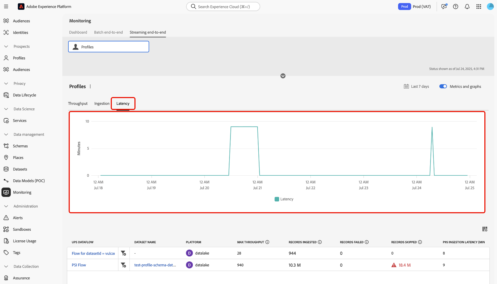

# 스트리밍 프로필 수집 모니터

Adobe Experience Platform UI의 모니터링 대시보드를 사용하여 조직 내에서 스트리밍 프로필 수집을 실시간으로 모니터링할 수 있습니다. 이 기능을 사용하여 스트리밍 데이터와 관련된 처리량, 대기 시간 및 데이터 품질 지표에 대한 투명도를 높일 수 있습니다. 또한 사전 경고 및 실행 가능한 통찰력 검색에 이 기능을 사용하여 잠재적인 용량 위반 및 데이터 수집 문제를 식별하는 데 도움이 됩니다.

모니터링 대시보드를 사용하여 조직에서 프로필 수집 작업을 스트리밍하기 위한 비율 및 지표를 추적하는 방법에 대해 알아보려면 다음 안내서를 참조하십시오.

## 시작

이 안내서를 사용하려면 Experience Platform의 다음 구성 요소에 대해 이해하고 있어야 합니다.

* [데이터 흐름](../home.md): 데이터 흐름은 Experience Platform에서 정보를 전송하는 데이터 작업을 나타냅니다. ID 서비스, 실시간 고객 프로필 및 대상뿐만 아니라 소스 커넥터에서 대상 데이터 세트로 데이터를 쉽게 이동할 수 있도록 다양한 서비스에 걸쳐 구성됩니다.
* [실시간 고객 프로필](../../profile/home.md): 실시간 고객 프로필은 온라인, 오프라인, CRM 및 서드파티와 같은 여러 소스의 데이터를 각 고객에 대한 실행 가능한 단일 보기로 결합하여 모든 접점에서 일관되고 개인화된 경험을 제공합니다.
* [스트리밍 수집](../../ingestion/streaming-ingestion/overview.md): Experience Platform에 대한 스트리밍 수집은 클라이언트 및 서버측 장치에서 실시간으로 Experience Platform으로 데이터를 전송하는 방법을 사용자에게 제공합니다.Experience Platform을 사용하면 각 개별 고객에 대한 실시간 고객 프로필을 생성하여 조정되고 일관되며 관련 있는 환경을 구현할 수 있습니다. &#x200B;스트리밍 수집은 이러한 프로필을 빌드하는 데 있어 가능한 한 적은 지연으로 중요한 역할을 합니다.
* [기능](../../landing/license-usage-and-guardrails/capacity.md): Experience Platform에서 기능은 조직이 보호 기능을 초과했는지 여부를 알려주고 이러한 문제를 해결하는 방법에 대한 정보를 제공합니다.

>[!NOTE]
>
>스트리밍 처리량 용량은 초당 최대 1500개의 인바운드 이벤트를 지원합니다. 추가 스트리밍 세분화를 구매하여 초당 최대 13,500개의 추가 인바운드 이벤트를 지원할 수 있습니다&#x200B;. 자세한 내용은 [Real-Time CDP B2C Edition - Prime 및 Ultimate 패키지 제품 설명](https://helpx.adobe.com/legal/product-descriptions/real-time-customer-data-platform-b2c-edition-prime-and-ultimate-packages.html)을 참조하세요.

## 스트리밍 프로필 수집을 위한 모니터링 지표 {#streaming-profile-metrics}

>[!CONTEXTUALHELP]
>id="platform_monitoring_streaming_profile"
>title="스트리밍 프로필 수집 모니터"
>abstract="스트리밍 프로필에 대한 모니터링 대시보드에는 처리량, 수집 속도, 지연 시간에 대한 정보가 표시됩니다. 이 대시보드를 사용하면 데이터 처리 지표를 조회하고 이해하고 분석할 수 있습니다. Experience Platform의 스트리밍 프로필."
>text="Learn more in documentation"

>[!CONTEXTUALHELP]
>id="platform_monitoring_streaming_profile_request_throughput"
>title="요청 처리량"
>abstract="이 지표는 초당 수집 시스템에 들어오는 이벤트 수를 나타냅니다."
>text="Learn more in documentation"

>[!CONTEXTUALHELP]
>id="platform_monitoring_streaming_profile_processing_throughput"
>title="프로세싱 처리량"
>abstract="이 지표는 시스템이 매 초마다 성공적으로 수집한 이벤트 수를 나타냅니다."
>text="Learn more in documentation"

>[!CONTEXTUALHELP]
>id="platform_monitoring_streaming_profile_p95_ingestion_latency"
>title="P95 수집 지연"
>abstract="이 지표는 이벤트가 Experience Platform에 도착한 순간부터 프로필 스토어에 성공적으로 수집될 때까지의 95번째 백분위수 지연 시간을 측정합니다."
>text="Learn more in documentation"

>[!CONTEXTUALHELP]
>id="platform_monitoring_streaming_profile_max_throughput"
>title="최대 처리량"
>abstract="이 지표는 스트리밍 프로필 수집에 들어가는 초당 최대 인바운드 요청 수를 나타냅니다."
>text="Learn more in documentation"

>[!CONTEXTUALHELP]
>id="platform_monitoring_streaming_profile_records_ingested"
>title="레코드 수집됨"
>abstract="이 지표는 구성된 시간 창 내에 프로필 스토어에 수집된 총 레코드 수를 나타냅니다."
>text="Learn more in documentation"

>[!CONTEXTUALHELP]
>id="platform_monitoring_streaming_profile_records_failed"
>title="레코드 실패"
>abstract="이 지표는 구성된 시간 창 내에 오류로 인해 프로필 스토어로 수집에 실패한 총 레코드 수를 나타냅니다."
>text="Learn more in documentation"

>[!CONTEXTUALHELP]
>id="platform_monitoring_streaming_profile_records_skipped"
>title="생략된 레코드"
>abstract="이 지표는 구성 또는 용량 침해로 인해 구성된 시간 창 내에 삭제된 총 레코드 수를 나타냅니다."
>text="Learn more in documentation"

>[!CONTEXTUALHELP]
>id="platform_monitoring_streaming_profile_error_details"
>title="오류 세부 사항"
>abstract="이 지표는 오류로 인해 실패한 이벤트의 수를 나타냅니다."
>text="Learn more in documentation"

데이터 흐름과 관련된 정보는 지표 테이블을 사용하십시오. 각 열에 대한 자세한 내용은 다음 표를 참조하십시오.

| 지표 | 설명 | 차원 | 측정 빈도 |
| --- | --- | --- | --- |
| 요청 처리량 | 이 지표는 초당 수집 시스템에 들어오는 이벤트 수를 나타냅니다. | 샌드박스/데이터 흐름 | 60초마다 데이터 새로 고침으로 실시간 모니터링. |
| 프로세싱 처리량 | 이 지표는 시스템이 매 초마다 성공적으로 수집한 이벤트 수를 나타냅니다. | 샌드박스/데이터 흐름 | 60초마다 데이터 새로 고침으로 실시간 모니터링. |
| P95 수집 지연 | 이 지표는 이벤트가 Experience Platform에 도착한 순간부터 프로필 스토어에 성공적으로 수집될 때까지의 95번째 백분위수 지연 시간을 측정합니다. | 샌드박스/데이터 흐름 | 60초마다 데이터 새로 고침으로 실시간 모니터링. |
| 최대 처리량 | 이 지표는 스트리밍 프로필 수집을 시작하는 초당 최대 인바운드 요청 수를 나타냅니다 | <ul><li>샌드박스/데이터 흐름</li><li>데이터 흐름 실행</li></ul> |
| 레코드 수집됨 | 이 지표는 구성된 시간 창 내에 프로필 스토어에 수집된 총 레코드 수를 나타냅니다. | <ul><li>샌드박스/데이터 흐름</li><li>데이터 흐름 실행</li></ul> | <ul><li>샌드박스/데이터 흐름: 60초마다 데이터 새로 고침으로 실시간 모니터링.</li><li>데이터 흐름 실행: 15분 안에 그룹화됩니다.</li></ul> |
| 레코드 실패 | 이 지표는 구성된 시간 창 내에 오류로 인해 프로필 스토어로 수집에 실패한 총 레코드 수를 나타냅니다. | <ul><li>샌드박스/데이터 흐름</li><li>데이터 흐름 실행</li></ul> | <ul><li>샌드박스/데이터 흐름: 60초마다 데이터 새로 고침으로 실시간 모니터링.</li><li>데이터 흐름 실행: 15분 안에 그룹화됩니다.</li></ul> |
| 생략된 레코드 | 이 지표는 구성 또는 용량 침해로 인해 구성된 시간 창 내에 삭제된 총 레코드 수를 나타냅니다. | <ul><li>샌드박스/데이터 흐름</li><li>데이터 흐름 실행</li></ul> | <ul><li>샌드박스/데이터 흐름: 60초마다 데이터 새로 고침으로 실시간 모니터링.</li><li>데이터 흐름 실행: 15분 안에 그룹화됩니다.</li></ul> |
| 오류 세부 사항 | 이 지표는 오류로 인해 실패한 이벤트의 수를 나타냅니다. | 데이터 흐름 실행 | 시간별 창에 그룹화됩니다. |

{style="table-layout:auto"}

## 스트리밍 프로필 수집에 모니터링 대시보드 사용

스트리밍 프로필 수집을 위한 모니터링 대시보드에 액세스하려면 Experience Platform UI로 이동하여 왼쪽 탐색에서 **[!UICONTROL 모니터링]**&#x200B;을 선택한 다음 **[!UICONTROL 전체 스트리밍]**&#x200B;을 선택하십시오.

*[!UICONTROL 프로필]* 지표 카드에 대한 대시보드의 상단 헤더를 참조하십시오. 이 표시를 사용하여 수집, 실패 및 건너뛴 레코드에 대한 정보와 요청 처리량 및 대기 시간의 현재 상태에 대한 정보를 볼 수 있습니다.

다음으로, 인터페이스를 사용하여 스트리밍 프로필 수집 지표에 대한 자세한 정보를 확인합니다. 달력 기능을 사용하여 서로 다른 시간대를 전환할 수 있습니다. 사전 구성된 다음 시간 창 중에서 선택할 수 있습니다.

* [!UICONTROL 지난 6시간]
* [!UICONTROL 지난 12시간]
* [!UICONTROL 지난 24시간]
* [!UICONTROL 최근 7일]
* [!UICONTROL 최근 30일]

또는 달력을 사용하여 직접 일정을 구성할 수도 있습니다.

스트리밍 프로필 수집을 위해 모니터링 대시보드에서 [!UICONTROL 처리량], [!UICONTROL 수집], [!UICONTROL 대기 시간]의 세 가지 지표 범주를 사용할 수 있습니다.

>[!BEGINTABS]

>[!TAB 처리량]

구성된 기간 동안 Experience Platform에서 처리하는 데이터 양에 대한 정보를 보려면 **[!UICONTROL 처리량]**&#x200B;을(를) 선택하십시오. 이 지표를 참조하여 시스템의 효율성 및 용량을 평가하십시오.

* **[용량](../../landing/license-usage-and-guardrails/capacity.md)**: 정의된 조건에서 샌드박스가 처리할 수 있는 최대 데이터 양입니다.
* **요청 처리량**: 수집 시스템에서 이벤트를 받는 비율(초당 이벤트 수)입니다.
* **처리 처리량**: 시스템이 들어오는 이벤트 페이로드를 수집 및 처리하는 속도로서 초당 이벤트로 측정됩니다.

>[!TAB 수집]

**수집**: 샌드박스의 수집 작업에 대한 정보를 보려면 **[!UICONTROL 수집]**&#x200B;을 선택하십시오. 이러한 수집 작업은 세 가지 다른 지표로 측정됩니다.

* **수집된 레코드**: 지정된 기간 내에 만들어진 총 레코드 양입니다. 이 지표는 샌드박스의 성공적인 데이터 수집 프로세스를 나타냅니다.
* **건너뛴 레코드**: 오류로 인해 수집되지 않은 총 레코드 수입니다.
* **건너뛴 레코드**: 용량 제한을 위반하여 삭제된 총 레코드 수입니다.

>[!TAB 대기 시간]

Experience Platform이 요청에 응답하거나 지정된 기간 내에 작업을 완료하는 데 걸리는 시간에 대한 정보를 보려면 **[!UICONTROL 지연]**&#x200B;을 선택하십시오.

>[!ENDTABS]

### 데이터 흐름 지표 테이블 사용

데이터 흐름 표에는 실시간 고객 프로필에 대한 해당 지표 세트와 함께 모든 스트리밍 수집 활동이 나열됩니다. 각 데이터 흐름은 해당 데이터 세트와 함께 나열됩니다.

샌드박스 수준 용량의 한도에 가까워지면 [!UICONTROL 최대 처리량] 열을 참조하여 소비율에 영향을 주는 기존 데이터 흐름을 식별할 수 있습니다. 데이터 흐름 관리 모범 사례에 대한 자세한 내용은 [모범 사례 섹션](#best-practices)을 읽어 보십시오.

특정 데이터 흐름에서 수집되는 데이터를 모니터링하려면 데이터 흐름 이름 옆에 있는 필터 아이콘 을(를) 선택합니다.

그런 다음 데이터 흐름 지표 인터페이스를 사용하여 검사할 특정 플로우 실행을 선택합니다. 선택한 흐름 실행에 관련된 지표를 보려면 흐름 실행 반복 옆의 필터 아이콘 을(를) 선택하십시오.

데이터 흐름 실행은 데이터 흐름 실행의 인스턴스를 나타냅니다. 예를 들어 데이터 흐름이 매시간 오전 9:00, 오전 10:00, 오전 11:00에 실행되도록 예약되어 있는 경우 세 개의 흐름 실행 인스턴스가 생깁니다. 플로우 실행은 특정 조직에만 해당됩니다.

데이터 흐름 실행 세부 정보 페이지에서는 선택한 실행 반복의 측정 단위 및 정보를 확인할 수 있습니다.

## 데이터 흐름 관리 모범 사례 {#best-practices}

Experience Platform에서 데이터 흐름을 가장 잘 관리하고 데이터 소비를 최적화하는 방법에 대한 자세한 내용은 다음 섹션을 참조하십시오.

### 스트리밍 수집 데이터 흐름 평가 및 최적화

효율적인 스트리밍 수집을 보장하려면 데이터 흐름 및 처리 전략을 검토하고 조정합니다.

* **현재 사용량 평가**: 처리량에 가장 많이 기여하는 데이터 흐름과 데이터 세트를 식별합니다.
* **중요한 데이터의 우선 순위 지정**: 일부 데이터는 필요하지 않을 수 있습니다. 사용 사례를 지원하지 않는 데이터는 제외하여 스토리지를 줄이고 효율성을 개선합니다.
* **처리 모드 최적화**: 일부 데이터를 스트리밍에서 일괄 수집으로 이동할 수 있는지 확인합니다. 실시간 세그먼테이션과 같이 짧은 지연 시간이 필요한 사용 사례에 대해 스트리밍을 예약합니다.

### 용량 및 시즌 트래픽 계획

현재 제한인 **초당 1,500개 이벤트**&#x200B;가 충분하지 않은 경우 데이터 전략을 최적화하거나 라이선스 용량을 늘리는 것이 좋습니다.

* **데이터 집합 및 샌드박스 사용 분석**: 현재 데이터와 이전 데이터를 모두 검토하여 트래픽 및 참여가 스트리밍 세분화 처리량에 미치는 영향을 파악합니다.
* **계절성 계정**: 되풀이하는 마케팅 캠페인이나 업종별 주기에 따라 파생되는 최대 트래픽 기간을 식별합니다.
* **향후 수요 예측**: 이전 시즌 트렌드, 계획된 캠페인 또는 주요 이벤트를 기반으로 예정된 트래픽 및 참여 볼륨을 예측합니다.

| 기여 요인 | 정의 | 사용 사례에 미치는 영향 | 모범 사례 |
| --- | --- | --- | --- |
| 일괄 처리-스트리밍 전환 | 스트리밍으로 전환된 일괄 작업 로드는 처리량을 크게 증가시켜 성능과 리소스 할당에 영향을 줄 수 있습니다. 예를 들어, 비율 제한 없이 이벤트 후에 벌크 프로필 업데이트를 수행하는 경우입니다. | 짧은 지연 처리가 필요하지 않은 일괄 사용 사례에는 스트리밍 전략이 필요하지 않습니다. | 사용 사례 요구 사항 평가 일괄 아웃바운드 마케팅의 경우 스트리밍 대신 [일괄 처리 수집](../../ingestion/batch-ingestion/overview.md)을 사용하여 데이터 수집을 보다 효율적으로 관리하는 것이 좋습니다. |
| 불필요한 데이터 수집 | 개인화에 필요하지 않은 데이터를 수집하면 가치를 추가하지 않고 처리량이 증가하여 리소스를 낭비할 수 있습니다. 예를 들어 관련성에 관계없이 모든 분석 트래픽을 프로필로 수집합니다. | 관련 없는 데이터가 너무 많으면 노이즈가 발생하여 영향을 미치는 데이터 포인트를 식별하기가 더 어려워집니다. 또한 대상자 및 프로필을 정의하고 관리할 때 마찰이 발생할 수 있습니다. | 사용 사례에 필요한 데이터만 수집합니다. 불필요한 데이터를 필터링해야 합니다.<ul><li>**Adobe Analytics**: [행 수준 필터링](../../sources/tutorials/ui/create/adobe-applications/analytics.md#filtering-for-real-time-customer-profile)을 사용하여 데이터 섭취를 최적화합니다.</li><li>**소스**: [[!DNL Flow Service] API를 사용하여 ](../../sources/tutorials/api/filter.md) 및 [!DNL Snowflake]과(와) 같은 지원되는 소스에 대해 행 수준 데이터를 필터링[!DNL Google BigQuery]합니다.</li></li>**Edge 데이터스트림**: WebSDK에서 들어오는 트래픽의 행 수준 필터링을 수행하려면 [동적 데이터스트림](../../datastreams/configure-dynamic-datastream.md)을 구성하십시오.</li></ul> |

{style="table-layout:auto"}

## 다음 단계 {#next-steps}

이 자습서를 따라 조직에서 스트리밍 프로필 수집 작업을 모니터링하는 방법을 배웠습니다. 실시간 고객 프로필의 데이터 모니터링에 대한 자세한 내용은 다음 문서를 참조하십시오.

* [모니터링 대시보드를 사용합니다](./monitor.md).
* [프로필 데이터 모니터링](./monitor-profiles.md).
