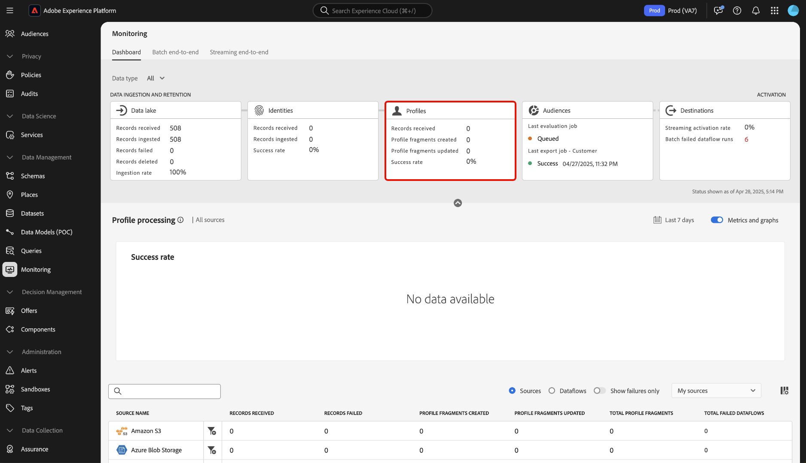

# 모니터링 대시보드 개요

Adobe Experience Platform UI의 모니터링 대시보드를 사용하여 수집에서 활성화까지의 데이터 여정을 볼 수 있습니다. 모니터링 대시보드를 사용하여 다음을 수행할 수 있습니다.

* 소스, ID 서비스, 실시간 고객 프로필, 대상 및 마지막으로 대상에서 데이터 여정을 모니터링합니다.
* 데이터가 있는 단계에 따라 다른 지표와 상태를 봅니다.
* 데이터 유형별로 데이터 모니터링 보기를 필터링합니다.

모니터링 대시보드는 다음과 같은 몇 가지 다양한 데이터 유형 보기를 지원합니다.

* **고객 및 계정**: 고객 데이터는 [Real-Time Customer Data Platform](../../rtcdp/home.md)에서 사용되는 데이터를 참조하고, 계정 데이터는 [Real-Time CDP, B2B edition](../../rtcdp/b2b-overview.md)을(를) 구독할 때 액세스할 수 있는 [계정 프로필 데이터](../../rtcdp/accounts/account-profile-overview.md)를 참조합니다. Real-Time CDP 라이선스에 Real-Time CDP, B2B edition이 포함되지 않은 경우 모니터링 대시보드만 사용하여 고객 데이터를 모니터링할 수 있습니다.
* **잠재 고객**: [잠재 고객 프로필](../../profile/ui/prospect-profile.md)은(는) 아직 회사에 가입하지 않았지만 연락을 주고 받고 싶은 사람을 나타내는 데 사용됩니다. 잠재 고객 프로필을 통해 신뢰할 수 있는 타사 파트너의 특성을 통해 고객 프로필을 보완할 수 있습니다. 잠재 고객 데이터 유형을 보려면 Real-Time CDP(앱 서비스), Adobe Experience Platform Activation, Real-Time CDP, Real-Time CDP Prime, Real-Time CDP Ultimate 라이선스가 있어야 합니다.
* **계정 프로필 보강**: 계정 프로필을 사용하면 여러 원본에서 계정 정보를 통합할 수 있습니다. 계정 프로필 보강 데이터를 모니터링하려면 Real-Time CDP, B2B edition에 대한 라이선스가 있어야 합니다.

모니터링 대시보드를 사용하여 다양한 Experience Platform 서비스에서 데이터 여정을 모니터링하는 방법에 대해 알아보려면 이 문서 를 참조하십시오.

## 시작하기

이 문서를 사용하려면 Experience Platform의 다음 구성 요소에 대해 잘 알고 있어야 합니다.

* [데이터 흐름](../home.md): 데이터 흐름은 Experience Platform에서 데이터를 이동하는 데이터 작업을 나타냅니다. 소스 작업 영역을 사용하여 주어진 소스에서 Experience Platform으로 데이터를 수집하는 데이터 흐름을 만들 수 있습니다.
* [소스](../../sources/home.md): Experience Platform의 소스를 사용하여 Adobe 응용 프로그램 또는 타사 데이터 소스에서 데이터를 수집합니다.
* [ID 서비스](../../identity-service/home.md): 장치 및 시스템 간에 ID를 연결하여 개별 고객 및 개별 고객의 행동을 더 잘 볼 수 있습니다.
* [실시간 고객 프로필](../../profile/home.md): 여러 소스의 집계 데이터를 기반으로 통합된 실시간 고객 프로필을 제공합니다.
* [세그먼테이션](../../segmentation/home.md): 실시간 고객 프로필 데이터에서 세그먼트와 대상자를 만들려면 세그먼테이션 서비스를 사용하십시오.
* [대상](../../destinations/home.md): 대상은 크로스 채널 마케팅 캠페인, 이메일 캠페인, 타깃팅된 광고 및 기타 다양한 사용 사례를 위해 Experience Platform의 데이터를 원활하게 활성화할 수 있도록 일반적으로 사용되는 애플리케이션과의 사전 빌드된 통합입니다.

## 모니터링 대시보드 안내서

Experience Platform UI의 왼쪽 탐색에서 [!UICONTROL 데이터 관리]의 **[!UICONTROL 모니터링]**&#x200B;을 선택합니다.

**[!UICONTROL 데이터 형식]**&#x200B;을(를) 선택한 다음 드롭다운 메뉴를 사용하여 보려는 데이터 형식을 선택합니다. 데이터 유형은 XDM(Experience Data Model) 스키마 클래스로 정의하여 Experience Platform에 수집할 때 데이터가 표준 형식을 따르도록 합니다. 자세한 내용은 다음 설명서를 참조하십시오.

* [B2B 계정 데이터 유형](../../rtcdp/b2b-tutorial.md)
* [잠재 고객 데이터 유형](../../rtcdp/partner-data/prospecting.md)

다음 데이터 유형을 기반으로 보기를 필터링할 수 있습니다.

>[!BEGINTABS]

>[!TAB 모두]

**[!UICONTROL 모두]**&#x200B;를 선택하여 대시보드를 업데이트하고 지정된 기간 동안 Experience Platform에 수집된 모든 데이터에 대한 지표를 표시합니다.

>[!TAB 고객 및 계정]

대시보드를 업데이트하고 지정된 기간 동안 Experience Platform에 수집된 고객 및 계정 데이터에 대한 지표를 표시하려면 **[!UICONTROL 고객 및 계정]**&#x200B;을(를) 선택하십시오.

>[!TAB 계정 프로필 보강]

**[!UICONTROL 계정 프로필 보강]**&#x200B;을 선택하여 대시보드를 업데이트하고 프로필 보강 데이터에 지표를 표시합니다. **참고**: [B2B 데이터](../../rtcdp/b2b-tutorial.md)에 대한 권한이 있는 경우에만 계정 프로필 보강 지표를 볼 수 있습니다.

>[!ENDTABS]

교차 서비스 모니터링 환경을 위해 대시보드의 상단 헤더를 사용합니다. 데이터 범주 헤더에서 선택한 기능 카드를 선택하여 지표 및 그래프 보기를 필터링할 수 있습니다.

>[!BEGINTABS]

>[!TAB 데이터 레이크]

데이터 레이크 수집 속도에 대한 지표를 보려면 **[!UICONTROL 데이터 레이크]**&#x200B;를 선택하십시오. 자세한 내용은 [데이터 레이크 수집 모니터링](monitor-sources.md)에 대한 안내서를 참조하십시오.

>[!TAB ID]

ID 데이터의 처리 성공률을 보려면 **[!UICONTROL ID]**&#x200B;을(를) 선택하십시오. 자세한 내용은 [ID 데이터 모니터링](monitor-identities.md)에 대한 안내서를 참조하십시오.

>[!TAB 프로필]

프로필 데이터의 처리 성공률을 보려면 **[!UICONTROL 프로필]**&#x200B;을(를) 선택하십시오. 자세한 내용은 [프로필 데이터 모니터링](monitor-profiles.md)에 대한 안내서를 참조하십시오.

>[!TAB 대상자]

대상자 및 세분화 작업에 대한 지표를 보려면 **[!UICONTROL 대상자]**&#x200B;를 선택하십시오. 자세한 내용은 [대상 데이터 모니터링](monitor-audiences.md)에 대한 안내서를 참조하십시오.

>[!TAB 대상]

[!UICONTROL 스트리밍 활성화 비율] 및 [!UICONTROL 일괄 처리 실패 데이터 흐름 실행]에서 지표를 보려면 **[!UICONTROL 대상]**&#x200B;을 선택하십시오. 자세한 내용은 [대상 데이터 모니터링](monitor-destinations.md)에 대한 안내서를 참조하십시오.

>[!ENDTABS]

### 모니터링 시간대 구성 {#configure-monitoring-time-frame}

기본적으로 모니터링 대시보드에는 지난 24시간 내에 수집된 데이터에 대한 지표가 표시됩니다. 시간대를 업데이트하려면 **[!UICONTROL 최근 24시간]**&#x200B;을(를) 선택하세요.

표시되는 대화 상자에서 데이터 모니터링 보기에 대한 새 시간대를 구성할 수 있습니다. 사용자 지정 시간대를 만들거나 사전 구성된 옵션 목록에서 선택할 수 있는 옵션이 있습니다.

* [!UICONTROL 지난 24시간]
* [!UICONTROL 최근 7일]
* [!UICONTROL 최근 30일]

완료되면 **[!UICONTROL 적용]**&#x200B;을 선택합니다.

## 다음 단계

이제 이 문서를 읽고 UI의 모니터링 대시보드를 탐색할 수 있습니다. 특정 Experience Platform 서비스의 데이터를 모니터링하는 방법에 대한 자세한 내용은 아래 설명서를 참조하십시오.

* [데이터 레이크 수집 모니터링](monitor-sources.md).
* [ID 데이터 모니터링](monitor-identities.md).
* [프로필 데이터 모니터링](monitor-profiles.md).
* [대상 데이터 모니터링](monitor-audiences.md).
* [대상 데이터 모니터링](monitor-destinations.md).

<!-- >[!TAB Prospect]

Select **[!UICONTROL Prospect]** to update your dashboard and display metrics on prospecting data that has been ingested to Experience Platform over the course of a given period. **Note**: You can only view prospect data type activities if you are [entitled to prospect data](../../rtcdp/partner-data/prospecting.md). -->