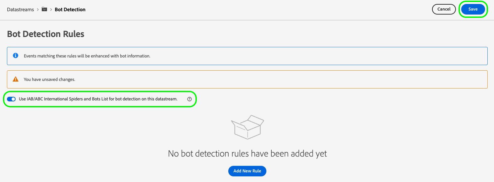

# 데이터스트림에 대한 보트 탐지 구성

자동화된 프로그램, 웹 스크레이퍼, 스파이더, 스크립팅된 스캐너와 같은 비인간 엔티티에서 발생하는 트래픽은 인간 방문자에서 발생하는 이벤트를 식별하는 것을 더 어렵게 할 수 있습니다. 이 유형의 트래픽은 중요한 비즈니스 지표에 부정적인 영향을 주어 잘못된 트래픽 보고를 초래할 수 있습니다.

보트 감지를 사용하면 [웹 SDK](../web-sdk/home.md), [Mobile SDK](https://developer.adobe.com/client-sdks/home/) 및 [[!DNL Server API]](../server-api/overview.md) 알려진 스파이더 및 보트에서 생성됨.

데이터스트림에 대한 보트 감지를 구성하여 보트 이벤트로 분류하려는 특정 IP 주소, IP 범위 및 요청 헤더를 식별할 수 있습니다.

보트 트래픽을 식별하면 사이트 또는 모바일 애플리케이션에서 사용자 활동을 보다 정확하게 측정할 수 있습니다.

Edge Network에 대한 요청이 보트 탐지 규칙과 일치하는 경우 XDM 스키마는 아래와 같이 보트 점수로 업데이트됩니다(항상 1로 설정됨).

```json
{
  "botDetection": {
    "score": 1
  }
}
```

이 보트 점수는 요청을 받는 솔루션이 보트 트래픽을 올바르게 식별하는 데 도움이 됩니다.

>[!IMPORTANT]
>
>보트 감지는 보트 요청을 삭제하지 않습니다. 보트 점수로 XDM 스키마만 업데이트하고 이벤트를 [데이터 스트림 서비스](configure.md) 을 참조하십시오.
>
>Adobe 솔루션은 다양한 방식으로 봇 점수를 처리할 수 있습니다. 예를 들어 Adobe Analytics은 자체 를 사용합니다 [보트 필터링 서비스](https://experienceleague.adobe.com/docs/analytics/admin/admin-tools/manage-report-suites/edit-report-suite/report-suite-general/bot-removal/bot-rules.html) 에서는 Edge Network이 설정한 점수를 사용하지 않습니다. 두 서비스는 동일한 것을 사용합니다 [IAB 보트 목록](https://www.iab.com/guidelines/iab-abc-international-spiders-bots-list/), 따라서 보트 점수는 동일합니다.

보트 탐지 규칙은 만들어진 후 Edge Network에서 전파되는 데 최대 15분이 걸릴 수 있습니다.

## 전제 조건 {#prerequisites}

데이터 스트림에서 보트 감지가 작동하려면 **[!UICONTROL 보트 탐지 정보]** 스키마에 대한 필드 그룹입니다. 다음을 참조하십시오. [XDM 스키마](../xdm/ui/resources/schemas.md#add-field-groups) 스키마에 필드 그룹을 추가하는 방법을 알아보는 설명서입니다.

## 데이터스트림에 대한 보트 탐지 구성 {#configure}

데이터 스트림 구성을 만든 후 보트 검색을 구성할 수 있습니다. 방법 설명서 참조 [데이터 스트림 만들기 및 구성](configure.md)를 클릭한 다음 아래 지침에 따라 데이터 스트림에 보트 감지 기능을 추가합니다.

데이터 스트림 목록으로 이동하여 보트 검색을 추가할 데이터 스트림을 선택합니다.


데이터스트림 세부 정보 페이지에서 **[!UICONTROL 보트 탐지]** 오른쪽 레일에 있는 옵션입니다.


다음 **[!UICONTROL 보트 탐지 규칙]** 페이지가 표시됩니다.


[보트 탐지 규칙] 페이지에서 다음 기능을 사용하여 보트 탐지를 구성할 수 있습니다.

* 사용 [!DNL [IAB/ABC International Spiders and Bots List]](https://www.iab.com/guidelines/iab-abc-international-spiders-bots-list/).
* 보트 감지 규칙을 만듭니다.

### IAB/ABC International Spiders and Bots List 사용 {#iab-list}

다음 [IAB/ABC 국제 스파이더 및 보트 목록](https://www.iab.com/guidelines/iab-abc-international-spiders-bots-list/) 는 업계 표준의 제3자 인터넷 스파이더 및 봇 목록으로서, 검색 엔진 크롤러, 모니터링 도구 및 분석 횟수에 표시하지 않으려 하는 기타 비인적 트래픽과 같은 자동화된 트래픽을 식별하는 데 도움이 됩니다.

를 사용하도록 데이터 스트림을 구성하려면 다음을 수행하십시오. [!DNL IAB/ABC International Spiders and Bots List], 전환 **[!UICONTROL 이 데이터 스트림에서 보트 탐지에 IAB/ABC International Spiders and Bots List 사용]** 옵션을 선택한 다음 저장 을 선택하여 데이터 스트림에 보트 감지 설정을 적용합니다.



### 보트 탐지 규칙 만들기 {#rules}

을 사용하는 것 외에도 [IAB/ABC 국제 스파이더 및 보트 목록](https://www.iab.com/guidelines/iab-abc-international-spiders-bots-list/), 각 데이터 스트림에 대한 보트 감지 규칙을 정의할 수 있습니다.

다음을 기반으로 보트 탐지 규칙을 만들 수 있습니다. **IP 주소** 및 **IP 주소 범위**.

보다 세분화된 보트 탐지 규칙이 필요한 경우 IP 조건을 요청 헤더 조건과 결합할 수 있습니다. 보트 탐지 규칙은 다음 헤더를 사용할 수 있습니다.

| HTTP 헤더 | 설명 |
| --- | --- |
| `user-agent` | 서버 및 네트워크 피어가 요청한 사용자 에이전트의 애플리케이션, 운영 체제, 공급업체 및/또는 버전을 식별할 수 있도록 해주는 헤더입니다. |
| `content-type` | 리소스의 원래 미디어 유형을 나타냅니다(컨텐츠 인코딩이 전송되기 전). |
| `referer` | 리소스를 요청한 웹 페이지의 주소를 식별합니다. |
| `sec-ch-ua` | 브라우저와 연결된 각 브랜드의 브랜드 및 중요 버전을 쉼표로 구분된 목록으로 제공합니다. |
| `sec-ch-ua-mobile` | 브라우저가 모바일 장치에 있는지 여부를 나타냅니다. 데스크탑 브라우저에서 모바일 사용자 경험에 대한 기본 설정을 나타내는 데 사용할 수도 있습니다. |
| `sec-ch-ua-platform` | 사용자 에이전트가 실행 중인 플랫폼 또는 운영 체제를 제공합니다. 예: &quot;Windows&quot; 또는 &quot;Android&quot;. |
| `sec-ch-ua-platform-version` | 사용자 에이전트가 실행 중인 운영 체제의 버전을 제공합니다. |
| `sec-ch-ua-arch` | ARM 또는 x86과 같은 사용자 에이전트의 기본 CPU 아키텍처를 제공합니다. |
| `sec-ch-ua-model` | 브라우저가 실행 중인 디바이스 모델을 나타냅니다. |
| `sec-ch-ua-bitness` | 사용자 에이전트의 기본 CPU 아키텍처에 대한 &quot;비트율&quot;을 제공합니다. 이는 정수 또는 메모리 주소의 비트 단위 크기이며, 일반적으로 64 또는 32비트입니다. |
| `sec-ch-ua-wow64` | 사용자 에이전트 바이너리가 64비트 Windows에서 32비트 모드로 실행 중인지 여부를 나타냅니다. |

보트 탐지 규칙을 만들려면 아래 단계를 수행하십시오.

1. 선택 **[!UICONTROL 새 규칙 추가]**.

   

2. 에 규칙 이름을 입력합니다. **[!UICONTROL 규칙 이름]** 필드.

   

3. 선택 **[!UICONTROL 새 IP 조건 추가]** 새 IP 기반 규칙을 추가합니다. IP 주소 또는 IP 주소 범위별로 규칙을 정의할 수 있습니다.

   

   

   >[!TIP]
   >
   >IP 조건은 논리를 기반으로 합니다 `OR` 작업. 정의한 IP 조건 중 하나와 일치하는 경우 요청이 봇에서 시작된 것으로 표시됩니다.

4. 규칙에 헤더 조건을 추가하려면 **[!UICONTROL 헤더 조건 그룹 추가]**&#x200B;을 클릭하고 규칙을 사용할 헤더를 선택합니다.

   

   그런 다음 선택한 헤더에 사용할 조건을 추가합니다.

   

5. 원하는 보트 탐지 규칙을 구성한 후 를 선택합니다. **[!UICONTROL 저장]** 을 클릭하여 데이터스트림에 규칙을 적용합니다.

   


## 보트 탐지 규칙 예 {#examples}

보트 감지를 시작하는 데 도움이 되도록 아래 설명된 예를 사용하여 보트 감지 규칙을 만들 수 있습니다.

### 하나의 IP 주소를 기반으로 한 보트 감지 {#one-ip}

특정 IP 주소에서 발생하는 모든 요청을 보트 트래픽으로 표시하려면 아래 이미지에 표시된 대로 단일 IP 주소를 평가하는 새 보트 감지 규칙을 만듭니다.


### 두 개의 IP 주소를 기반으로 한 보트 감지 {#two-ip}

두 개의 특정 IP 주소 중 하나에서 발생하는 모든 요청을 보트 트래픽으로 표시하려면 아래 이미지에 표시된 대로 두 개의 IP 주소를 평가하는 새 보트 감지 규칙을 만듭니다.


### IP 주소 범위를 기반으로 한 보트 감지 {#range}

특정 범위의 IP 주소에서 발생하는 모든 요청을 보트 트래픽으로 표시하려면 아래 이미지에 표시된 대로 전체 IP 주소 범위를 평가하는 새 보트 감지 규칙을 만듭니다.


### IP 주소 및 요청 헤더를 기반으로 한 보트 탐지 {#ip-header}

특정 IP 주소에서 시작되고 특정 요청 헤더를 봇 트래픽으로 포함하는 모든 요청을 표시하려면 아래 이미지에 표시된 대로 새 봇 탐지 규칙을 만듭니다.

이 규칙은 요청이 특정 IP 주소에서 발생하는지 및 `referer` 요청 헤더 시작 문자 `www.adobe.com`.


### 여러 조건을 기반으로 한 보트 감지 {#multiple-conditions}

다음을 기반으로 보트 탐지 규칙을 만들 수 있습니다.

* **여러 가지 다른 조건**: 다른 조건이 논리로 평가됨 `AND` 작업: 요청이 봇에서 시작된 것으로 식별되려면 조건이 동시에 충족되어야 함을 의미합니다.
* **동일한 유형의 여러 조건**: 동일한 유형의 조건이 논리로 평가됨 `OR` 작업: 조건 중 하나라도 충족되면 요청이 봇에서 시작된 것으로 식별됩니다.

아래 이미지에 표시된 규칙은 다음 조건이 충족되는 경우 봇 발생 요청을 식별합니다.

요청은 두 IP 주소 중 하나인 `referer` 헤더 시작 문자 `www.adobe.com`및 `sec-ch-ua-mobile` 헤더는 요청을 데스크탑 브라우저에서 시작한 것으로 식별합니다.


