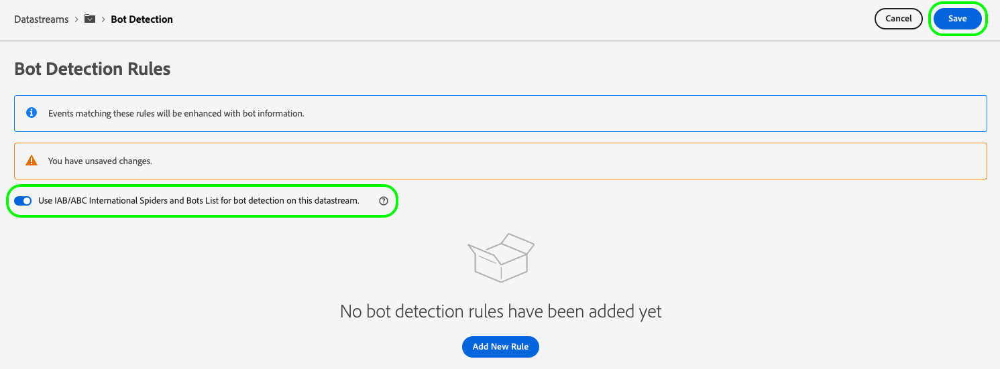
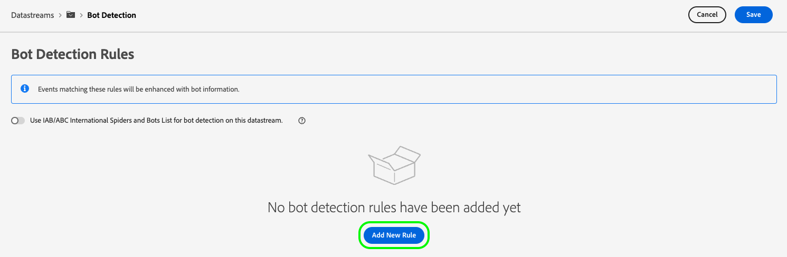
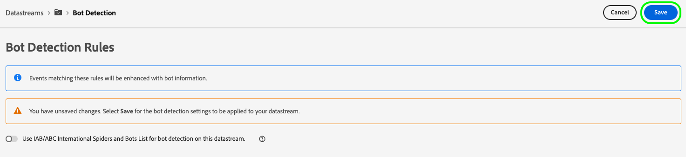
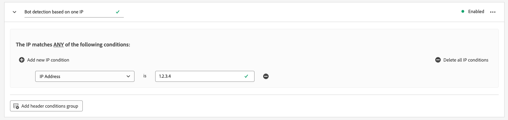

# 데이터스트림에 대한 보트 탐지 구성

자동화된 프로그램, 웹 스크레이퍼, 스파이더 및 스크립팅된 스캐너로부터의 비사람 트래픽은 사람 방문자로부터 발생하는 이벤트를 식별하는 것을 어렵게 할 수 있습니다. 이러한 유형의 트래픽은 중요한 비즈니스 지표에 부정적인 영향을 미쳐 잘못된 트래픽 보고로 이어질 수 있습니다.

보트 검색을 사용하면 [Web SDK](/help/collection/js/js-overview.md), [Mobile SDK](https://developer.adobe.com/client-sdks/home/) 및 [[!DNL Edge Network API]](https://developer.adobe.com/data-collection-apis/docs/api/)에서 생성된 이벤트를 알려진 스파이더 및 보트에서 생성된 이벤트로 식별할 수 있습니다.

>[!NOTE]
>
>[!DNL Bot Detection Service]을(를) 사용하여 데이터에서 비사람(봇) 트래픽을 식별하고 필터링합니다. 이렇게 하면 수집된 데이터 세트의 노이즈가 줄어들고 분석 및 보고가 진정한 사용자 상호 작용을 반영하도록 하는 데 도움이 됩니다.

데이터스트림에 대한 보트 감지를 구성하여 특정 IP 주소, IP 범위 및 요청 헤더를 식별하여 보트 이벤트로 분류할 수 있습니다. 이렇게 하면 사이트 또는 모바일 애플리케이션에서 사용자 활동을 보다 정확하게 측정할 수 있습니다.

Edge Network에 대한 요청이 보트 감지 규칙과 일치하는 경우, XDM 스키마는 아래와 같이 보트 점수로 업데이트됩니다(항상 1로 설정됨).

```json
{
  "botDetection": {
    "score": 1
  }
}
```

이 보트 점수는 요청을 받는 솔루션이 보트 트래픽을 올바르게 식별하는 데 도움이 됩니다.

>[!IMPORTANT]
>
>보트 감지는 보트 요청을 삭제하지 않습니다. 보트 채점을 사용하여 XDM 스키마만 업데이트하고 이벤트를 구성한 [데이터스트림 서비스](configure.md)에 전달합니다.
>
>Adobe 솔루션은 다양한 방식으로 봇 점수를 처리할 수 있습니다. 예를 들어 Adobe Analytics은 자체 [보트 필터링 서비스](https://experienceleague.adobe.com/docs/analytics/admin/admin-tools/manage-report-suites/edit-report-suite/report-suite-general/bot-removal/bot-rules.html?lang=ko)를 사용하며 Edge Network에서 설정한 점수를 사용하지 않습니다. 두 서비스는 동일한 [IAB 보트 목록](https://www.iab.com/guidelines/iab-abc-international-spiders-bots-list/)을 사용하므로 보트 점수는 동일합니다.

## 기술 고려 사항 {#technical-considerations}

데이터스트림에서 보트 탐지를 활성화하기 전에 정확한 결과와 원활한 구현을 보장하기 위해 몇 가지 유의해야 할 사항은 다음과 같습니다.

* 보트 감지는 `edge.adobedc.net`에 전송된 인증되지 않은 요청에만 적용됩니다.
* 인증된 트래픽은 신뢰할 수 있는 것으로 간주되므로 `server.adobedc.net`에 전송된 인증된 요청은 봇 트래픽에 대해 평가되지 않습니다.
* 보트 감지 규칙은 만들어진 후 Edge Network을 통해 전파되는 데 최대 15분이 걸릴 수 있습니다.

## 전제 조건 {#prerequisites}

데이터 스트림에서 봇 탐지가 작동하려면 **[[!UICONTROL [Bot Detection Information]]](../xdm/field-groups/event/bot-detection-information.md)** 필드 그룹을 스키마에 추가해야 합니다. 스키마에 필드 그룹을 추가하는 방법에 대해 알아보려면 [XDM 스키마](../xdm/ui/resources/schemas.md#add-field-groups) 설명서를 참조하세요.

## 데이터스트림에 대한 보트 탐지 구성 {#configure}

데이터 스트림 구성을 만든 후 보트 검색을 구성할 수 있습니다. [데이터 스트림을 만들고 구성](configure.md)하는 방법에 대한 설명서를 참조한 다음 아래 지침에 따라 데이터 스트림에 봇 감지 기능을 추가하십시오.

데이터 스트림 목록으로 이동하여 보트 검색을 추가할 데이터 스트림을 선택합니다.


데이터 스트림 세부 정보 페이지에서 오른쪽 레일의 **[!UICONTROL Bot Detection]** 옵션을 선택합니다.


**[!UICONTROL Bot Detection Rules]** 페이지가 표시됩니다.


[보트 탐지 규칙] 페이지에서 다음 기능을 사용하여 보트 탐지를 구성할 수 있습니다.

* [IAB/ABC International Spiders and Bots List](https://www.iab.com/guidelines/iab-abc-international-spiders-bots-list/) 사용.
* 보트 감지 규칙을 만듭니다.

### IAB/ABC International Spiders and Bots List 사용 {#iab-list}

[IAB/ABC International Spiders and Bots List](https://www.iab.com/guidelines/iab-abc-international-spiders-bots-list/)은(는) 타사의 산업 표준 인터넷 스파이더 및 보트 목록입니다. 이 목록은 검색 엔진 웹 크롤러, 모니터링 도구 및 분석 횟수에 포함하지 않으려는 기타 비인적 트래픽과 같은 자동화된 트래픽을 식별하는 데 도움이 됩니다.

IAB/ABC International Spiders and Bots List를 사용하도록 데이터 스트림을 구성하려면 다음을 수행하십시오.

1. **[!UICONTROL Use IAB/ABC International Spiders and Bots List for bot detection on this datastream]** 옵션을 전환합니다.
2. 보트 검색 설정을 데이터 스트림에 적용하려면 **[!UICONTROL Save]**&#x200B;을(를) 선택하십시오.



### 보트 탐지 규칙 만들기 {#rules}

[IAB/ABC International Spiders and Bots List](https://www.iab.com/guidelines/iab-abc-international-spiders-bots-list/)을(를) 사용하는 것 외에도 각 데이터 스트림에 대해 고유한 보트 감지 규칙을 정의할 수 있습니다.

You can create bot detection rules based on **IP addresses** and **IP address ranges**.

If you need more granular bot detection rules, you can combine the IP conditions with request header conditions. Bot detection rules can use the following headers:

| HTTP 헤더 | 설명 |
| --- | --- |
| `user-agent` | A header which lets servers and network peers identify the application, operating system, vendor, and/or version of the requesting user agent. |
| `content-type` | Indicates the original media type of the resource (prior to any content encoding applied for sending). |
| `referer` | Identifies the address of the web page from which the resource has been requested. |
| `sec-ch-ua` | Provides the brand and significant version for each brand associated with the browser in a comma-separated list. |
| `sec-ch-ua-mobile` | Indicates whether the browser is on a mobile device. It can also be used by a desktop browser to indicate a preference for a mobile user experience. |
| `sec-ch-ua-platform` | Provides the platform or operating system on which the user agent is running. For example: &quot;Windows&quot; or &quot;Android&quot;. |
| `sec-ch-ua-platform-version` | Provides the version of the operating system on which the user agent is running. |
| `sec-ch-ua-arch` | Provides the user-agent&#39;s underlying CPU architecture, such as ARM or x86. |
| `sec-ch-ua-model` | Indicates the device model on which the browser is running. |
| `sec-ch-ua-bitness` | Provides the &quot;bitness&quot; of the user-agent&#39;s underlying CPU architecture. This is the size in bits of an integer or memory address—typically 64 or 32 bits. |
| `sec-ch-ua-wow64` | Indicates whether a user agent binary is running in 32-bit mode on 64-bit Windows. |

To create a bot detection rule, follow the steps below:

1. **[!UICONTROL Add New Rule]**&#x200B;를 선택합니다.

   

2. Type a name for the rule in the **[!UICONTROL Rule Name]** field.

   

3. Select **[!UICONTROL Add new IP condition]** to add a new IP-based rule. You can define the rule by IP address or by IP address range.

   

   

   >[!TIP]
   >
   >IP 조건은 논리 `OR` 작업을 기반으로 합니다. 정의한 IP 조건 중 하나와 일치하는 경우 요청이 봇에서 시작된 것으로 표시됩니다.

4. 규칙에 헤더 조건을 추가하려면 **[!UICONTROL Add header conditions group]**&#x200B;을(를) 선택한 다음 규칙이 사용할 헤더를 선택합니다.

   헤더 조건이 강조 표시된 

   그런 다음 선택한 헤더에 사용할 조건을 추가합니다.

   헤더 조건이 강조 표시된 

5. 원하는 보트 탐지 규칙을 구성한 후 **[!UICONTROL Save]**&#x200B;을(를) 선택하여 데이터 스트림에 규칙을 적용합니다.

   헤더 조건이 강조 표시된 


## 보트 탐지 규칙 예 {#examples}

보트 감지를 시작하는 데 도움이 되도록 아래 설명된 예를 사용하여 보트 감지 규칙을 만들 수 있습니다.

### 하나의 IP 주소를 기반으로 한 보트 감지 {#one-ip}

특정 IP 주소에서 발생하는 모든 요청을 보트 트래픽으로 표시하려면 아래 이미지에 표시된 대로 단일 IP 주소를 평가하는 새 보트 감지 규칙을 만듭니다.



### 두 개의 IP 주소를 기반으로 한 보트 감지 {#two-ip}

두 개의 특정 IP 주소 중 하나에서 발생하는 모든 요청을 보트 트래픽으로 표시하려면 아래 이미지에 표시된 대로 두 개의 IP 주소를 평가하는 새 보트 감지 규칙을 만듭니다.


### IP 주소 범위를 기반으로 한 보트 감지 {#range}

특정 범위의 IP 주소에서 발생하는 모든 요청을 보트 트래픽으로 표시하려면 아래 이미지에 표시된 대로 전체 IP 주소 범위를 평가하는 새 보트 감지 규칙을 만듭니다.


### IP 주소 및 요청 헤더를 기반으로 한 보트 탐지 {#ip-header}

특정 IP 주소에서 시작되고 특정 요청 헤더를 봇 트래픽으로 포함하는 모든 요청을 표시하려면 아래 이미지에 표시된 대로 새 봇 탐지 규칙을 만듭니다.

이 규칙은 요청이 특정 IP 주소에서 발생하는지, `referer` 요청 헤더가 `www.adobe.com`(으)로 시작하는지 확인합니다.


### 여러 조건을 기반으로 한 보트 감지 {#multiple-conditions}

다음을 기반으로 보트 탐지 규칙을 만들 수 있습니다.

* **여러 다른 조건**: 다른 조건은 논리 `AND` 작업으로 평가됩니다. 즉, 요청이 봇에서 시작된 것으로 식별되려면 조건이 동시에 충족되어야 합니다.
* **같은 형식의 여러 조건**: 같은 형식의 조건은 논리 `OR` 작업으로 평가됩니다. 즉, 조건이 하나라도 충족되면 요청이 봇에서 시작된 것으로 식별됩니다.

아래 이미지에 표시된 규칙은 다음 조건이 충족되는 경우 봇 발생 요청을 식별합니다.

요청은 두 IP 주소 중 하나에서 시작되며, `referer` 헤더는 `www.adobe.com`(으)로 시작되고, `sec-ch-ua-mobile` 헤더는 요청을 데스크톱 브라우저에서 시작한 것으로 식별합니다.


