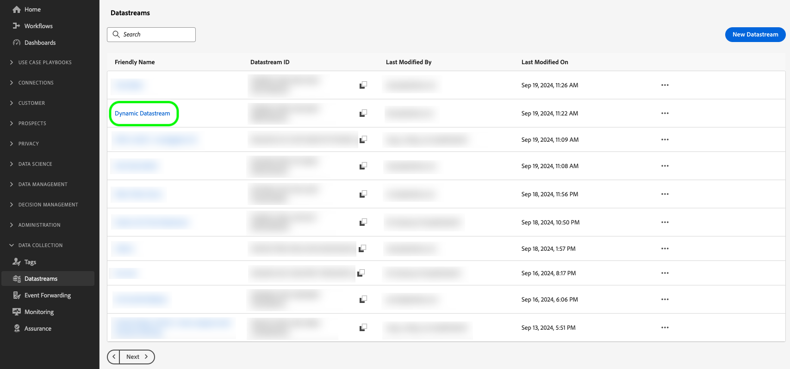

# 동적 데이터 스트림 구성 만들기

>[!AVAILABILITY]
>
>* 동적 데이터스트림 구성을 정의하는 옵션은 현재 Beta에 있으며 제한된 수의 고객이 사용할 수 있습니다. 이 기능에 대한 액세스 권한을 받으려면 Adobe 담당자에게 문의하십시오. 설명서 및 기능은 변경될 수 있습니다.

기본적으로 Experience Platform Edge Network은 데이터스트림에 도달하는 모든 이벤트를 데이터스트림에 대해 활성화한 모든 Experience Cloud [서비스](configure.md#add-services)로 보냅니다. 사용 사례에 따라 항상 적합한 워크플로는 아닐 수 있습니다.

동적 데이터스트림 구성은 데이터스트림에 대해 활성화된 각 서비스에 대해 정의하는 Experience Cloud 구성 가능한 규칙 세트를 통해 이러한 문제를 해결합니다. 이는 각 유형의 데이터를 수신해야 하는 사용자 솔루션을 나타냅니다.

## 전제 조건 {#prerequisites}

데이터 스트림에 대한 동적 구성을 만들려면 다음 두 가지 조건을 충족해야 합니다.

* 작업할 데이터 스트림을 *최소*&#x200B;개 만들어야 합니다. 자세한 내용은 [데이터 스트림을 만드는 방법](configure.md)에 대한 설명서를 참조하십시오.
* 데이터 스트림에 Experience Cloud 서비스를 *최소*&#x200B;개 추가해야 합니다. 자세한 내용은 데이터스트림에 [서비스를 추가](configure.md#add-services)하는 방법에 대한 설명서를 참조하십시오.

데이터 스트림을 만들고 Experience Cloud 서비스를 추가한 후 [동적 구성을 만들](#create-dynamic-configuration)수 있습니다.

## 동적 데이터 스트림 구성 만들기 {#create-dynamic-configuration}

[데이터 스트림을 만들고](configure.md)에 [서비스를 추가](configure.md#add-services)한 후 아래 단계에 따라 서비스에 동적 구성을 추가하십시오.

1. **[!UICONTROL 데이터 수집]** > **[!UICONTROL 데이터스트림]** 페이지로 이동하여 만든 데이터스트림을 선택합니다.

   

1. 동적 구성을 정의할 서비스에서 **[!UICONTROL 편집]** 옵션을 선택하십시오.

   

1. **[!UICONTROL 구성]** 페이지에서 **[!UICONTROL 동적 구성 저장 및 편집]**&#x200B;을 선택합니다.

   

1. **[!UICONTROL 동적 구성 추가]**&#x200B;를 선택합니다.

   

1. **[!UICONTROL 리소스]** 패널에서 규칙을 작성할 항목을 창의 오른쪽으로 끌어다 놓습니다. 여러 리소스를 결합하여 복잡한 규칙을 작성할 수 있습니다.

   **[!UICONTROL 같음]**, **[!UICONTROL 같지 않음]**, **[!UICONTROL 존재]** 등과 같은 각 리소스의 옵션을 사용하여 규칙을 미세 조정하십시오.

   

1. **[!UICONTROL 구성]** 섹션에서 데이터를 각 서비스로 전송할지 여부에 따라 각 규칙에 대해 활성화하거나 비활성화할 서비스를 전환합니다. 토글을 끄면 서비스 라우팅이 비활성화되고 *데이터가 업스트림 서비스로 전송되지 않습니다*.

   

1. 규칙 구성이 완료되면 **[!UICONTROL 저장]**&#x200B;을 선택합니다.

## 규칙 우선 순위 고려 사항 {#considerations}

각 동적 데이터스트림 구성에 대해 여러 규칙을 정의할 수 있습니다. 그러나 데이터가 여러 규칙의 조건과 일치하는 경우 목록의 첫 번째 일치하는 규칙만 고려되며 다른 모든 일치하는 규칙은 무시됩니다.

원하는 데이터 라우팅 동작을 달성하려면 규칙을 정렬하는 순서에 주의하십시오.

규칙 순서를 구성하려면 규칙 창을 원하는 순서로 드래그 앤 드롭할 수 있습니다.

