# 데이터스트림 만들기 및 구성

이 문서에서는 UI에서 [데이터스트림](./overview.md)을 구성하는 단계를 설명합니다.

## [!UICONTROL 데이터스트림] 작업 영역에 액세스

왼쪽 탐색 영역에서 **[!UICONTROL 데이터스트림]**&#x200B;을 선택하여 데이터 수집 UI 또는 Experience Platform UI에서 데이터스트림을 만들고 관리할 수 있습니다.

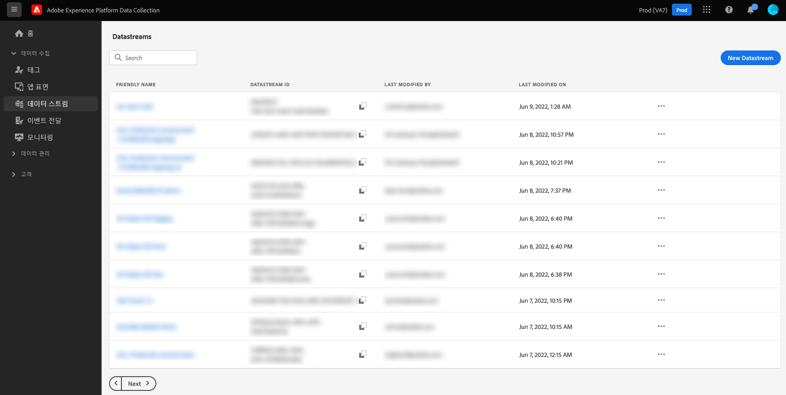

**[!UICONTROL 데이터스트림]** 탭에는 친숙한 이름, ID와 마지막 수정 날짜를 포함하여 기존 데이터스트림 목록이 표시됩니다. [세부 정보를 보고 서비스를 구성하려면](#view-details) 데이터 스트림의 이름을 선택하십시오.

특정 데이터 스트림에 대한 추가 옵션을 표시하려면 &quot;기타&quot; 아이콘(**...**)을 선택하십시오. 데이터 스트림에 대한 [기본 구성](#configure)을 업데이트하려면 **[!UICONTROL 편집]**&#x200B;을 선택하세요. 데이터 스트림을 제거하려면 **[!UICONTROL 삭제]**&#x200B;를 선택합니다.

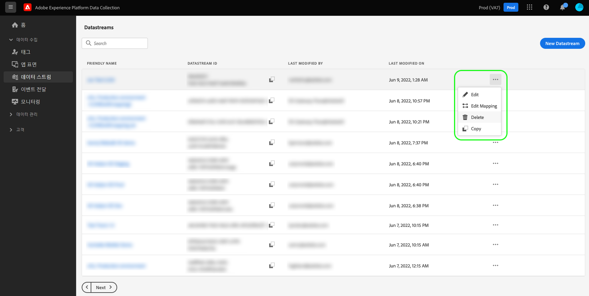

## 데이터 스트림 만들기 {#create}

데이터스트림을 만들려면 먼저 **[!UICONTROL 새 데이터스트림]**&#x200B;을 선택합니다.

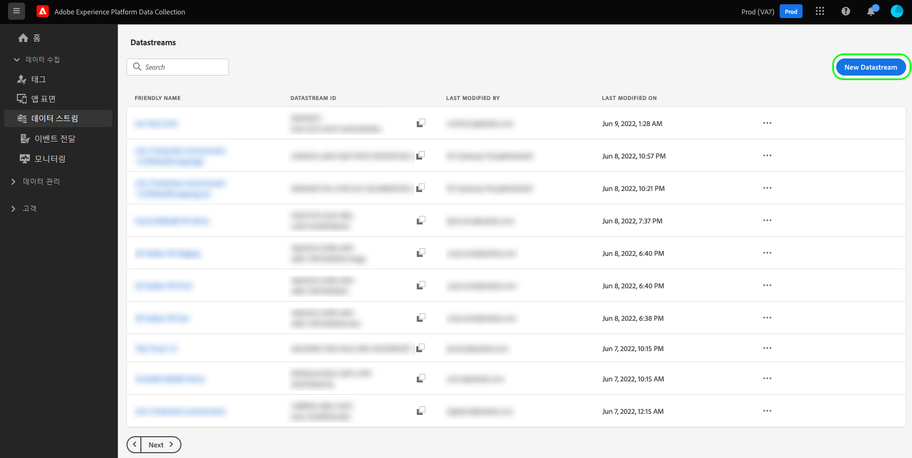

데이터스트림 생성 워크플로는 구성 단계부터 표시됩니다. 여기에 데이터스트림에 대한 이름 및 선택적 설명을 입력해야 합니다.

Experience Platform에서 사용할 데이터 스트림을 구성하고 웹 SDK도 사용하는 경우 수집할 데이터를 나타내는 [이벤트 기반 XDM(Experience Data Model) 스키마](../xdm/classes/experienceevent.md)도 선택해야 합니다.

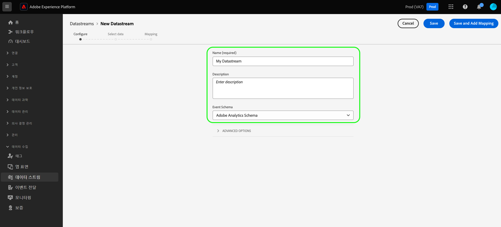

### 지리적 위치 및 네트워크 조회 구성 {#geolocation-network-lookup}

지리적 위치 및 네트워크 조회 설정을 사용하면 수집하려는 지리적 및 네트워크 수준 데이터의 세부 기간 수준을 정의할 수 있습니다.

**[!UICONTROL 지리적 위치 및 네트워크 조회]** 섹션을 확장하여 아래에 설명된 설정을 구성합니다.

지리적 위치 및 네트워크 조회 설정이 강조 표시된 

| 설정 | 설명 |
| --- | --- |
| [!UICONTROL 지역 조회] | 방문자의 IP 주소를 기반으로 선택한 옵션에 대한 지리적 위치 조회를 활성화합니다. 사용 가능한 옵션은 다음과 같습니다. <ul><li>**국가**: `xdm.placeContext.geo.countryCode` 채우기</li><li>**우편 번호**: `xdm.placeContext.geo.postalCode`을 채웁니다.</li><li>**시/도**: `xdm.placeContext.geo.stateProvince`을(를) 채웁니다.</li><li>**DMA**: `xdm.placeContext.geo.dmaID` 채우기</li><li>**구/군/시**: `xdm.placeContext.geo.city`을(를) 채웁니다</li><li>**위도**: `xdm.placeContext.geo._schema.latitude`을(를) 채웁니다.</li><li>**경도**: `xdm.placeContext.geo._schema.longitude` 채우기</li></ul>**[!UICONTROL 도시]**, **[!UICONTROL 위도]** 또는 **[!UICONTROL 경도]**&#x200B;를 선택하면 선택한 다른 옵션에 관계없이 소수점 이하 두 자리까지 좌표가 제공됩니다. 이는 도시 수준의 세부 기간으로 간주됩니다.   옵션을 선택하지 않으면 지리적 위치 조회가 비활성화됩니다. 지리적 위치는 [!UICONTROL IP 난독화] 전에 발생하므로 [!UICONTROL IP 난독화] 설정의 영향을 받지 않습니다. |
| [!UICONTROL 네트워크 조회] | 방문자의 IP 주소를 기반으로 선택한 옵션에 대한 네트워크 조회를 활성화합니다. 사용 가능한 옵션은 다음과 같습니다. <ul><li>**이동통신사**: `xdm.environment.carrier`을(를) 채웁니다.</li><li>**도메인**: `xdm.environment.domain`을 채웁니다.</li><li>**ISP**: `xdm.environment.ISP`을 채웁니다.</li><li>**연결 형식**: `xdm.environment.connectionType`을(를) 채웁니다.</li></ul> |

데이터 수집을 위해 위의 필드 중 하나를 사용하도록 설정하는 경우 웹 SDK을 구성할 때 [`context`](/help/web-sdk/commands/configure/context.md) 배열 속성을 올바르게 설정했는지 확인하십시오.

지리적 위치 조회 필드는 `context` 배열 문자열 `"placeContext"`을(를) 사용하고 네트워크 조회 필드는 `context` 배열 문자열 `"environment"`을(를) 사용합니다.

또한 원하는 각 XDM 필드가 스키마에 있는지 확인합니다. 그렇지 않으면 Adobe에서 제공한 `Environment Details` 필드 그룹을 스키마에 추가할 수 있습니다.

### 장치 조회 구성 {#geolocation-device-lookup}

**[!UICONTROL 장치 조회]** 설정을 사용하면 수집할 장치별 정보를 선택할 수 있습니다.

**[!UICONTROL 장치 조회]** 섹션을 확장하여 아래에 설명된 설정을 구성하십시오.

>[!IMPORTANT]
>
>아래 표에 표시된 설정은 함께 사용할 수 없습니다. 사용자 에이전트 정보 *및* 장치 조회 데이터를 동시에 선택할 수 없습니다.

| 설정 | 설명 |
| --- | --- |
| **[!UICONTROL 사용자 에이전트 및 클라이언트 힌트 헤더 유지]** | 사용자 에이전트 문자열에 저장된 정보만 수집하려면 이 옵션을 선택합니다. 이 설정은 기본적으로 선택됩니다. `xdm.environment.browserDetails.userAgent` 채우기 |
| **[!UICONTROL 장치 조회를 사용하여 다음 정보를 수집합니다]** | 다음 장치별 정보 중 하나 이상을 수집하려면 이 옵션을 선택합니다. <ul><li>**[!UICONTROL 장치]** 정보:<ul><li>**장치 제조업체**: `xdm.device.manufacturer`을 채웁니다.</li><li>**장치 모델**: `xdm.device.modelNumber` 채우기</li><li>**마케팅 이름**: `xdm.device.model` 채우기</li></ul></li><li>**[!UICONTROL 하드웨어]** 정보: <ul><li>**하드웨어 형식**: `xdm.device.type`을(를) 채웁니다.</li><li>**표시 높이**: `xdm.device.screenHeight`을(를) 채웁니다.</li><li>**표시 너비**: `xdm.device.screenWidth`을 채웁니다.</li><li>**표시 색 농도**: `xdm.device.colorDepth`을(를) 채웁니다.</li></ul></li><li>**[!UICONTROL 브라우저]** 정보: <ul><li>**브라우저 공급업체**: `xdm.environment.browserDetails.vendor` 채우기</li><li>**브라우저 이름**: `xdm.environment.browserDetails.name`을 채웁니다.</li><li>**브라우저 버전**: `xdm.environment.browserDetails.version`을 채웁니다.</li></ul></li><li>**[!UICONTROL 운영 체제]** 정보: <ul><li>**OS 공급업체**: `xdm.environment.operatingSystemVendor` 채우기</li><li>**OS 이름**: `xdm.environment.operatingSystem` 채우기</li><li>**OS 버전**: `xdm.environment.operatingSystemVersion`을 채웁니다.</li></ul></li></ul>사용자 에이전트 및 클라이언트 힌트와 함께 디바이스 조회 정보를 수집할 수 없습니다. 디바이스 정보를 수집하도록 선택하면 사용자 에이전트 및 클라이언트 힌트 수집이 비활성화되고 그 반대의 경우도 마찬가지입니다. |
| **[!UICONTROL 장치 정보를 수집하지 않음]** | 장치 조회 정보를 수집하지 않으려면 이 옵션을 선택합니다. 장치, 하드웨어, 브라우저, 운영 체제, 사용자 에이전트 또는 클라이언트 힌트 데이터가 수집되지 않습니다. |

데이터 수집을 위해 위의 필드 중 하나를 사용하도록 설정하는 경우 웹 SDK을 구성할 때 [`context`](/help/web-sdk/commands/configure/context.md) 배열 속성을 올바르게 설정했는지 확인하십시오.

장치 및 하드웨어 정보는 `context` 배열 문자열 `"device"`을(를) 사용하고, 브라우저 및 운영 체제 정보는 `context` 배열 문자열 `"environment"`을(를) 사용합니다.

또한 원하는 각 XDM 필드가 스키마에 있는지 확인합니다. 그렇지 않으면 Adobe에서 제공한 `Environment Details` 필드 그룹을 스키마에 추가할 수 있습니다.

### 고급 옵션 구성 {#@advanced-options}

고급 구성 옵션을 표시하려면 **[!UICONTROL 고급 옵션]**&#x200B;을 선택합니다. 여기에서 IP 난독화, 자사 ID 쿠키 등과 같은 추가 데이터스트림 설정을 구성할 수 있습니다.

>[!IMPORTANT]
>
> 정확한 지리적 위치 정보를 포함한 개인 데이터를 수집, 처리 및 전송하기 위해 해당 법률 및 규정에 따라 필요한 모든 권한, 동의, 승인 및 인증을 획득했는지 확인할 책임이 있습니다.
> 
> IP 주소 난독화 선택은 IP 주소에서 파생되어 구성된 Adobe 솔루션으로 전송되는 지리적 위치 정보 수준에 영향을 주지 않습니다. 지리적 위치 조회는 개별적으로 제한되거나 비활성화되어야 합니다.

| 설정 | 설명 |
| --- | --- |
| [!UICONTROL IP 난독화] | 데이터스트림에 적용할 IP 난독화 유형을 표시합니다. 고객 IP를 기반으로 하는 모든 처리는 IP 난독화 설정의 영향을 받습니다. 여기에는 데이터스트림에서 데이터를 수신하는 모든 Experience Cloud 서비스가 포함됩니다. 
사용 가능한 옵션:
 <ul><li>**[!UICONTROL 없음]**: IP 난독화를 비활성화합니다. 데이터 스트림을 통해 전체 사용자 IP 주소가 전송됩니다.</li><li>**[!UICONTROL 부분]**: IPv4 주소의 경우 사용자 IP 주소의 마지막 옥텟을 난독화합니다. IPv6 주소의 경우 주소의 마지막 80비트를 난독화합니다. 
예:
 <ul><li>IPv4: `1.2.3.4` -> `1.2.3.0`</li><li>IPv6: `2001:0db8:1345:fd27:0000:ff00:0042:8329` -> `2001:0db8:1345:0000:0000:0000:0000:0000`</li></ul></li><li>**[!UICONTROL 전체]**: 전체 IP 주소를 난독화합니다. 
예:
 <ul><li>IPv4: `1.2.3.4` -> `0.0.0.0`</li><li>IPv6: `2001:0db8:1345:fd27:0000:ff00:0042:8329` -> `0:0:0:0:0:0:0:0`</li></ul></li></ul> 다른 Adobe 제품에 미치는 IP 난독화 영향: <ul><li>**Adobe Target**: Adobe Target에서 수행된 [!UICONTROL IP 난독화] 전에 데이터 스트림 수준 [!UICONTROL IP 난독화]이(가) 요청에 있는 모든 IP 주소에 적용됩니다. 예를 들어 데이터스트림 수준 [!UICONTROL IP 난독화] 옵션이 **[!UICONTROL 전체]**(으)로 설정되고 Adobe Target IP 난독화 옵션이 **[!UICONTROL 마지막 옥텟 난독화]**(으)로 설정된 경우 Adobe Target은 완전히 난독화된 IP를 받습니다. 데이터스트림 수준 [!UICONTROL IP 난독화] 옵션이 **[!UICONTROL Partial]**(으)로 설정되고 Adobe Target IP 난독화 옵션이 **[!UICONTROL Full]**(으)로 설정된 경우 Adobe Target은 부분적으로 난독화된 IP를 받은 다음 전체 난독화를 적용합니다. Adobe Target IP 난독화는 데이터 스트림 IP와 독립적으로 관리됩니다. 자세한 내용은 [IP 난독화](https://experienceleague.adobe.com/docs/target-dev/developer/implementation/privacy/privacy.html) 및 [지리적 위치](https://experienceleague.adobe.com/docs/target/using/audiences/create-audiences/categories-audiences/geo.html)에 대한 Adobe Target 설명서를 참조하십시오.</li><li>**Audience Manager**: Audience Manager에서 수행한 [!UICONTROL IP 난독화] 전에 데이터 스트림 수준 [!UICONTROL IP 난독화] 설정이 요청에 있는 모든 IP 주소에 적용됩니다. Audience Manager가 수행하는 지리적 위치 조회는 데이터스트림 수준의 [!UICONTROL IP 난독화] 옵션에 영향을 받습니다. 완전히 난독화된 IP를 기반으로 하는 Audience Manager의 지리적 위치 조회는 알 수 없는 영역을 발생시키고, 결과 지리적 위치 데이터를 기반으로 하는 모든 세그먼트는 실현되지 않습니다. 자세한 내용은 [IP 난독화](https://experienceleague.adobe.com/docs/audience-manager/user-guide/features/administration/ip-obfuscation.html)에 대한 Audience Manager 설명서를 참조하십시오.</li><li>**Adobe Analytics**: 데이터스트림 수준 IP 난독화 설정이 **[!UICONTROL 전체]**(으)로 설정된 경우 Adobe Analytics에서는 IP 주소를 공백으로 취급합니다. 이는 지리적 위치 조회 및 IP 필터링과 같이 IP 주소에 따라 달라지는 모든 Analytics 처리에 영향을 줍니다. Analytics가 난독화되지 않은 또는 부분적으로 난독화된 IP 주소를 받으려면 IP 난독화 설정을 **[!UICONTROL Partial]** 또는 **[!UICONTROL None]**(으)로 설정하십시오. 부분적으로 난독화되고 난독화되지 않은 IP 주소는 Analytics 내에서 더 난독화될 수 있습니다. Analytics에서 IP 난독화를 사용하는 방법에 대한 자세한 내용은 Adobe Analytics [설명서](https://experienceleague.adobe.com/docs/analytics/admin/admin-tools/manage-report-suites/edit-report-suite/report-suite-general/general-acct-settings-admin.html)를 참조하십시오. IP 주소가 완전히 난독화되고 페이지 히트에 [!DNL ECID]과(와) [!DNL VisitorID]이(가) 없는 경우 Analytics에서는 IP 주소를 부분적으로 기반으로 하는 [대체 ID](https://experienceleague.adobe.com/docs/id-service/using/reference/analytics-reference/analytics-ids.html?lang=en)을(를) 생성하지 않고 히트를 삭제합니다.</li></ul> |
| [!UICONTROL 자사 ID 쿠키] | 활성화되면 이 설정은 [자사 디바이스 ID](../web-sdk/identity/first-party-device-ids.md) 조회 시 ID 맵에서 이 값을 조회하는 대신 지정된 쿠키를 참조하도록 Edge Network에 지시합니다.  이 설정을 사용할 때는 ID를 저장할 쿠키의 이름을 입력해야 합니다. |
| [!UICONTROL 서드파티 ID 동기화] | ID 동기화를 컨테이너로 그룹화하면 다른 시간대에 다른 ID 동기화를 실행할 수 있습니다. 활성화되면 이 설정을 사용하여 이 데이터스트림에 실행되는 ID 동기화의 컨테이너를 지정할 수 있습니다. |
| [!UICONTROL 서드파티 ID 동기화 컨테이너 ID] | 서드파티 ID 동기화에 사용할 컨테이너의 숫자 ID. |
| [!UICONTROL 컨테이너 ID 재정의] | 이 섹션에서는 기본 ID를 재정의하는 데 사용할 수 있는 추가 타사 ID 동기화 컨테이너 ID를 정의할 수 있습니다. |
| [!UICONTROL 유형에 액세스] | Edge Network가 데이터스트림에 대해 허용하는 인증 유형을 정의합니다. <ul><li>**[!UICONTROL 혼합 인증]**: 이 옵션을 선택하는 경우 Edge Network는 인증된 요청과 인증되지 않은 요청을 모두 허용합니다. Web SDK 또는 [Mobile SDK](https://developer.adobe.com/client-sdks/home/)를 사용하려는 경우 [Server API](../server-api/overview.md)와 함께 이 옵션을 선택합니다. </li><li>**[!UICONTROL 인증된 요청만]**: 이 옵션을 선택하는 경우 Edge Network는 인증된 요청만 허용합니다. Server API만 사용하고 인증되지 않은 요청이 Edge Network에서 처리되지 않도록 하려면 이 옵션을 선택합니다.</li></ul> |
| [!UICONTROL Media Analytics] | Experience Platform SDK 또는 [Media Edge API](https://developer.adobe.com/cja-apis/docs/endpoints/media-edge/getting-started/)를 통해 Edge Network 통합을 위한 스트리밍 추적 데이터를 처리할 수 있습니다. [설명서](https://experienceleague.adobe.com/docs/media-analytics/using/media-overview.html?lang=ko-KR)에서 Media Analytics에 대해 알아보세요. |

여기에서 Experience Platform에 대한 데이터스트림을 구성하는 경우 [데이터 수집을 위한 데이터 준비](./data-prep.md)에 대한 튜토리얼을 참조하여 이 안내서로 돌아가기 전에 데이터를 Platform 이벤트 스키마에 매핑합니다. 그렇지 않은 경우 **[!UICONTROL 저장]**&#x200B;을 선택하고 다음 섹션으로 계속 진행합니다.

## 데이터스트림 세부 사항 보기 {#view-details}

새 데이터스트림을 구성하거나 보려는 기존 데이터스트림을 선택하면 해당 데이터스트림에 대한 세부 사항 페이지가 나타납니다. 여기에서 해당 ID가 포함된 데이터스트림에 대한 자세한 내용을 찾을 수 있습니다.

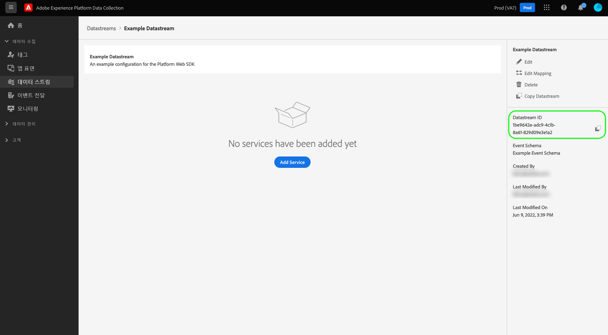

데이터스트림 세부 사항 화면에서 [서비스를 추가](#add-services)하여 액세스 권한이 있는 Adobe Experience Cloud 제품의 기능을 활성화할 수 있습니다. 데이터스트림의 [기본 구성](#create)을 편집하고, [매핑 규칙](./data-prep.md)을 업데이트하고, [데이터스트림을 복사](#copy)하거나 완전히 삭제할 수도 있습니다.

## 데이터스트림에 서비스 추가 {#add-services}

데이터스트림의 세부 사항 페이지에서 **[!UICONTROL 서비스 추가]**&#x200B;를 선택하여 해당 데이터스트림에서 사용할 수 있는 서비스를 추가합니다.

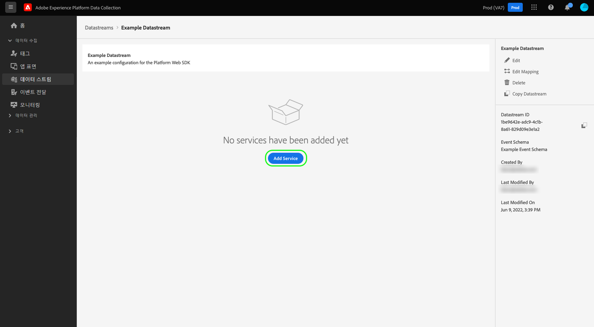

다음 화면에서 드롭다운 메뉴를 사용하여 이 데이터스트림에 대해 구성하는 서비스를 선택합니다. 액세스 권한이 있는 서비스만 이 목록에 표시됩니다.

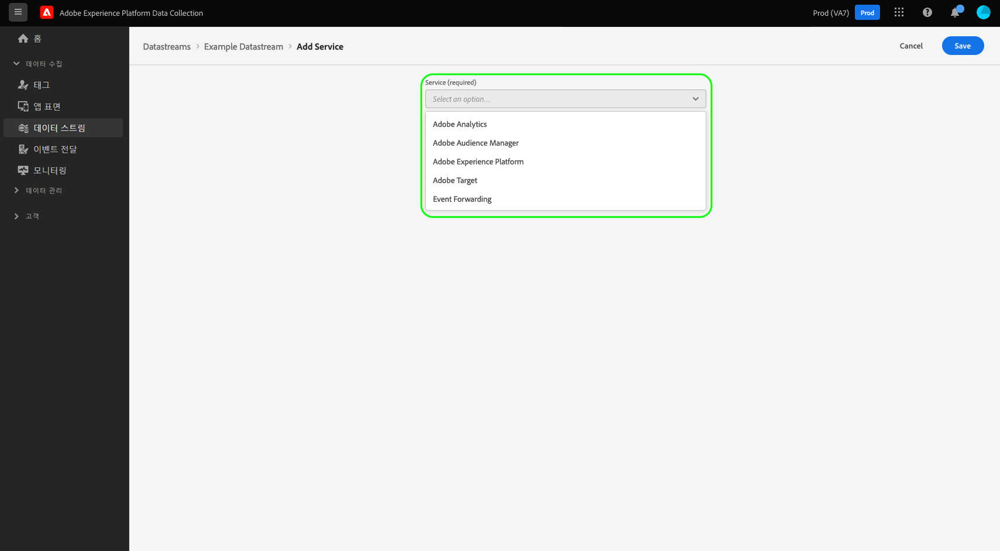

원하는 서비스를 선택하고 표시되는 구성 옵션을 입력한 다음 **[!UICONTROL 저장]**&#x200B;을 선택하여 서비스를 데이터스트림에 추가합니다. 추가된 모든 서비스가 데이터스트림의 세부 사항 보기에 표시됩니다.

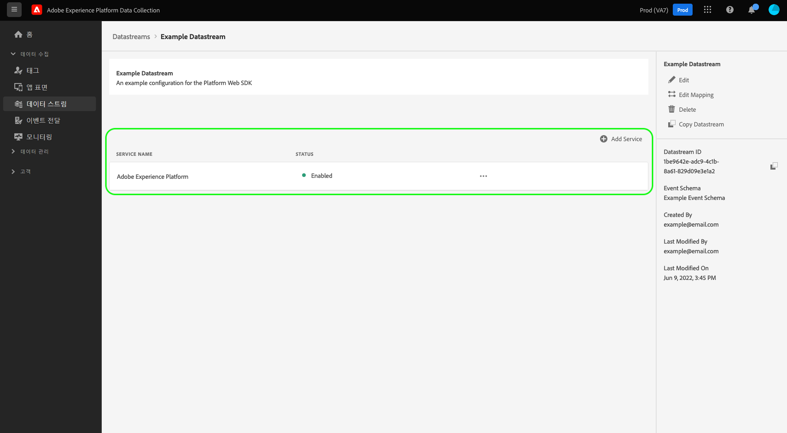

아래 하위 섹션에서는 각 서비스에 대한 구성 옵션에 대해 설명합니다.

>[!NOTE]
>
>각 서비스 구성에는 서비스 선택 시 자동으로 활성화되는 **[!UICONTROL 활성화된]** 토글이 포함됩니다. 이 데이터스트림에 대해 선택한 서비스를 비활성화하려면 **[!UICONTROL 활성화된]** 토글을 다시 선택합니다.

### Adobe Analytics 설정 {#analytics}

이 서비스는 데이터가 Adobe Analytics로 전송되는지 여부와 그 방법을 제어합니다. [Adobe Analytics에 데이터 보내기](/help/web-sdk/use-cases/adobe-analytics.md)를 참조하십시오.

| 설정 | 설명 |
| --- | --- |
| [!UICONTROL 보고서 세트 ID] | **(필수)** 데이터를 전송하려는 Analytics 보고서 세트 ID. 이 ID는 [!UICONTROL 관리] > [!UICONTROL 보고서 세트] 아래의 Adobe Analytics UI에서 찾을 수 있습니다. 여러 보고서 세트가 지정된 경우 데이터는 각 보고서 세트에 복사됩니다. |
| [!UICONTROL 방문자 ID 네임스페이스] | (선택 사항) Adobe Analytics [visitorID](https://experienceleague.adobe.com/docs/analytics/implementation/vars/config-vars/visitorid.html?lang=ko-KR)에 사용할 네임스페이스입니다. 이 네임스페이스에 대해 지정된 값이 있는 이벤트를 보내면 Analytics에서 `visitorID`(으)로 자동으로 사용됩니다. |
| [!UICONTROL 보고서 세트 재정의] | 이 섹션에서는 기본 ID 재정의에 사용할 수 있는 추가 보고서 세트 ID를 추가할 수 있습니다. |

### Adobe Audience Manager 설정 {#audience-manager}

이 서비스는 데이터가 Adobe Audience Manager로 전송되는지 여부와 그 방법을 제어합니다. 이 섹션을 활성화하려면 Audience Manager로 데이터를 전송하면 됩니다. 다른 설정은 선택 사항이지만 사용하는 것이 좋습니다.

| 설정 | 설명 |
| --- | --- |
| [!UICONTROL 쿠키 대상 활성화] | SDK는 [!DNL Audience Manager]의 [쿠키 대상](https://experienceleague.adobe.com/docs/audience-manager/user-guide/features/destinations/custom-destinations/create-cookie-destination.html)을 통해서 세그먼트 정보를 공유할 수 있습니다. |
| [!UICONTROL URL 대상 활성화] | SDK는 [!DNL Audience Manager]의 [URL 대상](https://experienceleague.adobe.com/docs/audience-manager/user-guide/features/destinations/custom-destinations/create-url-destination.html)을 통해서 세그먼트 정보를 공유할 수 있습니다. |

### Adobe Experience Platform 설정 {#aep}

>[!IMPORTANT]
>
>Platform에 대한 데이터스트림을 활성화하는 경우 현재 사용 중인 Platform 샌드박스가 UI의 상단 리본에 표시되므로 메모해 두십시오.
>
>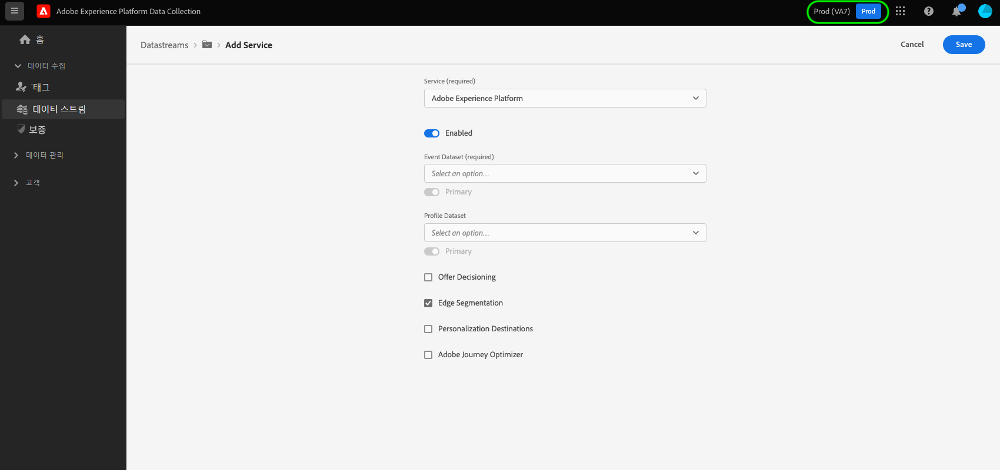
>
>샌드박스는 Adobe Experience Platform의 가상 파티션으로서 데이터와 구현 기능을 조직의 다른 사용자로부터 분리할 수 있습니다. 데이터스트림이 생성되면 해당 샌드박스는 변경될 수 없습니다. Experience Platform의 샌드박스 역할에 대한 자세한 내용은 [샌드박스 설명서](../sandboxes/home.md)를 참조하십시오.

이 서비스는 데이터가 Adobe Experience Platform으로 전송되는지 여부와 그 방법을 제어합니다.

| 설정 | 설명 |
|---| --- |
| [!UICONTROL 이벤트 데이터 세트] | **(필수)** 고객 이벤트 데이터가 스트리밍되는 Platform 데이터 세트를 선택합니다. 이 스키마는 [XDM ExperienceEvent 클래스](../xdm/classes/experienceevent.md)를 사용해야 합니다. 추가 데이터 세트를 추가하려면 **[!UICONTROL 이벤트 데이터 세트 추가]**&#x200B;를 선택합니다. |
| [!UICONTROL 프로필 데이터 세트] | 고객 속성 데이터를 전송할 Platform 데이터 세트를 선택합니다. 이 스키마는 [XDM 개별 프로필 클래스](../xdm/classes/individual-profile.md)를 사용해야 합니다. |
| [!UICONTROL Offer Decisioning] | 웹 SDK 구현용 Offer Decisioning을 활성화합니다. 자세한 구현 정보는 [Web SDK에서 Offer Decisioning 사용](../web-sdk/personalization/offer-decisioning/offer-decisioning-overview.md)에 대한 안내서를 참조하십시오.  Offer Decisioning 기능에 대한 자세한 내용은 [Adobe Journey Optimizer 설명서](https://experienceleague.adobe.com/docs/journey-optimizer/using/offer-decisioning/get-started-decision/starting-offer-decisioning.html?lang=ko-KR)를 참조하십시오. |
| [!UICONTROL 에지 세분화] | 이 데이터 스트림에 대해 [에지 세분화](../segmentation/methods/edge-segmentation.md)을(를) 사용합니다. [Web SDK](../web-sdk/home.md) 또는 [Edge Network Server API](../server-api/overview.md)에서 에지 세분화가 활성화된 데이터 스트림을 통해 데이터를 보내면 해당 프로필에 대해 업데이트된 대상 멤버십이 응답으로 다시 전송됩니다.  이 옵션은 [Edge 대상](../destinations/ui/activate-edge-personalization-destinations.md) 또는 [!DNL Offer Decisioning]을(를) 통해 같은 페이지 및 다음 페이지 개인화 사용 사례에 대해 **[!UICONTROL Personalization 대상]**&#x200B;과 함께 사용할 수 있습니다. |
| [!UICONTROL 개인화 대상] | [!UICONTROL 에지 세분화] 확인란을 활성화하고 이 옵션을 활성화하는 경우 데이터스트림을 [사용자 정의 개인화](../destinations/catalog/personalization/custom-personalization.md)와 같은 개인화 대상에 연결할 수 있습니다.  [개인화 대상 구성](../destinations/ui/activate-edge-personalization-destinations.md)에 대한 구체적인 단계는 대상 설명서를 참조하십시오. |
| [!UICONTROL Adobe Journey Optimizer] | 이 데이터 스트림에 대해 [Adobe Journey Optimizer](https://experienceleague.adobe.com/docs/journey-optimizer/using/ajo-home.html)을(를) 사용합니다.    이 옵션을 활성화하면 데이터스트림은 [!DNL Adobe Journey Optimizer]의 웹 및 앱 기반 인바운드 캠페인에서 개인화된 콘텐츠를 반환할 수 있습니다. 이 옵션을 사용하려면 [!UICONTROL 에지 세분화]를 활성화해야 합니다. [!UICONTROL Edge 세분화]을 선택하지 않으면 이 옵션이 회색으로 표시됩니다. |

### Adobe Target 설정 {#target}

이 서비스는 데이터가 Adobe Target로 전송되는지 여부와 그 방법을 제어합니다.

| 설정 | 설명 |
| --- | --- |
| [!UICONTROL 속성 토큰] | [!DNL Target]에서는 고객이 속성을 사용하여 권한을 제어할 수 있습니다. 속성에 대한 자세한 내용은 [!DNL Target] 설명서의 [Enterprise 권한 구성](https://experienceleague.adobe.com/docs/target/using/administer/manage-users/enterprise/properties-overview.html)에 대한 안내서를 참조하십시오.  속성 토큰은 [!UICONTROL 설정] > [!UICONTROL 속성]의 Adobe Target UI에서 찾을 수 있습니다. |
| [!UICONTROL 대상 환경 ID] | [Adobe Target의 환경](https://experienceleague.adobe.com/docs/target/using/administer/hosts.html)을 사용하여 모든 단계의 개발을 통해 구현을 관리할 수 있습니다. 이 설정은 이 데이터스트림과 함께 사용하려는 환경을 지정합니다.  각 `dev`, `stage` 및 `prod` 데이터스트림 환경에 대해서는 다르게 설정하여 작업을 단순하게 유지할 수 있습니다. 단, Adobe Target 환경이 이미 정의되어 있는 경우 해당 환경을 사용할 수 있습니다. |
| [!UICONTROL Target 서드파티 ID 네임스페이스] | 이 데이터스트림에 사용하려는 `mbox3rdPartyId`에 대한 ID 네임스페이스. Adobe Target과 [!DNL Customer Attributes] 통합을 사용하거나 `thirdPartyId`을(를) 사용하여 [Adobe Target 프로필 API](https://experienceleague.adobe.com/en/docs/target-dev/developer/api/profile-apis/profiles-api)를 통해 프로필을 업데이트하거나 만드는 경우 원하는 네임스페이스 값을 제공해야 합니다. 고객 특성 파일 업로드나 프로필 업데이트 API 호출에 사용된 `customerID` 또는 `thirdPartyId`을(를) 전송하려면 XDM 스키마의 `IdentityMap` 섹션에서 이 네임스페이스를 사용해야 합니다.  자세한 내용은 [Web SDK를 사용하여 `mbox3rdPartyId` 구현](../web-sdk/personalization/adobe-target/using-mbox-3rdpartyid.md) 안내서를 참조하십시오. |
| [!UICONTROL 속성 토큰 재정의] | 이 섹션에서는 기본 속성 토큰을 재정의하는 데 사용할 수 있는 추가 속성 토큰을 정의할 수 있습니다. |

### [!UICONTROL 이벤트 전달] 설정

이 서비스는 데이터가 [이벤트 전달](../tags/ui/event-forwarding/overview.md)로 전송되는지 여부와 그 방법을 제어합니다.

데이터 스트림 구성 화면의 

| 설정 | 설명 |
| --- | --- |
| [!UICONTROL Launch 속성] | **(필수)** 데이터를 전송하려는 이벤트 전달 속성. |
| [!UICONTROL Launch 환경] | **(필수)** 데이터를 전송하려는 선택 속성 내 환경. |

>[!NOTE]
>
>**[!UICONTROL 수동으로 ID 입력]**&#x200B;을 선택하여 드롭다운 메뉴를 사용하는 대신 속성 및 환경 이름을 입력할 수 있습니다.

## 데이터스트림 복사 {#copy}

기존 데이터스트림의 사본을 만들고 필요에 따라 세부 사항을 변경할 수 있습니다.

>[!NOTE]
>
>데이터스트림은 동일한 [샌드박스](../sandboxes/home.md) 내에서만 복사할 수 있습니다. 다시 말해, 한 샌드박스에서 다른 샌드박스로 데이터스트림을 복사할 수 없습니다.

[!UICONTROL 데이터스트림] 작업 영역의 메인 페이지에서 문제가 있는 데이터스트림의 줄임표(**....**)를 선택한 다음 **[!UICONTROL 복사]**&#x200B;를 선택합니다.

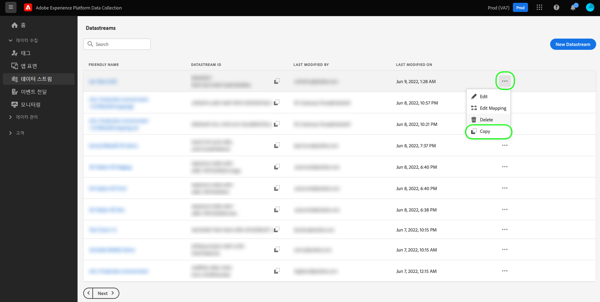

또는 특정 데이터스트림의 세부 사항 보기에서 **[!UICONTROL 데이터스트림 복사]**&#x200B;를 선택할 수 있습니다.

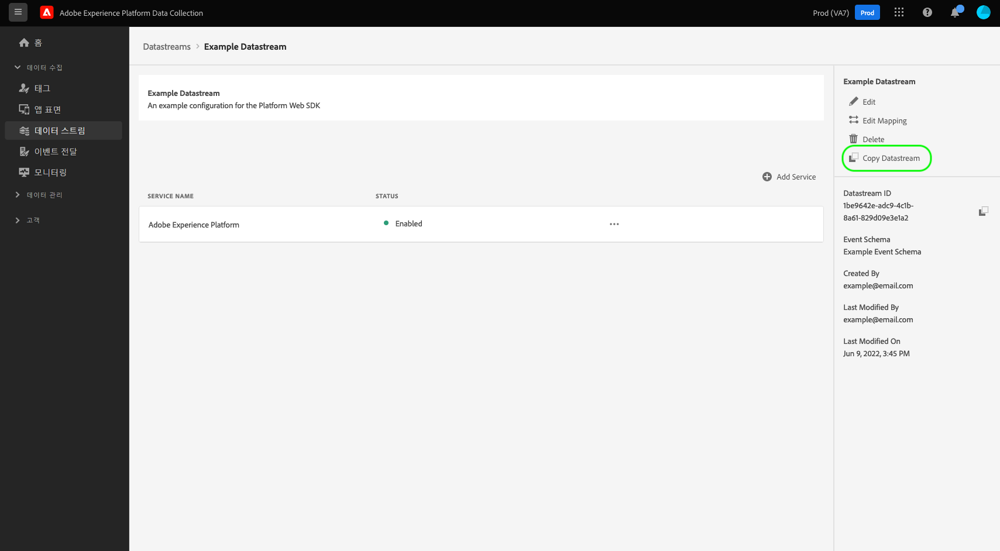

전체 복사하려는 구성 옵션에 대한 세부 사항과 함께 생성할 새 데이터스트림의 고유 이름을 제공하라는 확인 대화 상자가 나타납니다. 준비가 되면 **[!UICONTROL 복사]**&#x200B;를 선택합니다.

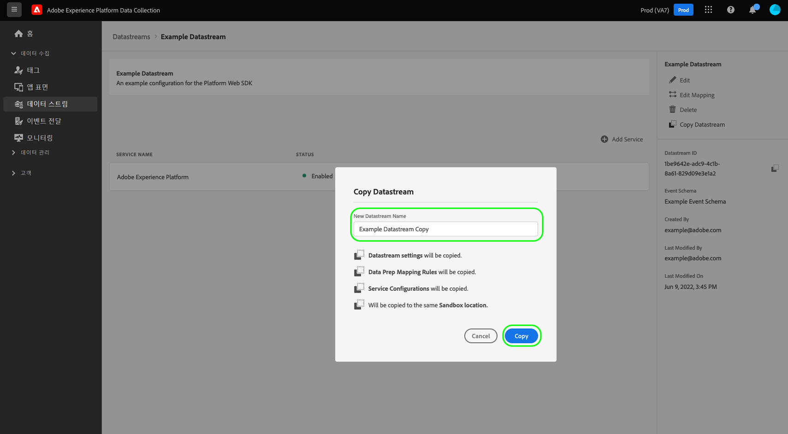

새 데이터스트림이 제공되면 [!UICONTROL 데이터스트림] 작업 영역의 메인 페이지가 다시 나타납니다.

## 다음 단계

이 안내서에는 데이터 수집 UI에서 데이터스트림을 관리하는 방법이 나와 있습니다. 데이터스트림을 설정한 후 Web SDK를 설치하고 구성하는 방법에 대한 자세한 내용은 [데이터 수집 E2E 안내서](../collection/e2e.md#install)를 참조하십시오.
