# 데이터스트림 만들기 및 구성

이 안내서에서는 UI에서 [데이터스트림](/help/datastreams/overview.md)을 구성하는 단계를 다룹니다.

## [!UICONTROL Datastreams] 작업 영역 액세스 {#workspace}

왼쪽 탐색에서 **[!UICONTROL Datastreams]**&#x200B;을(를) 선택하여 데이터 수집 UI 또는 [!DNL Adobe Experience Platform] UI에서 데이터스트림을 만들고 관리할 수 있습니다.

데이터 수집 UI의 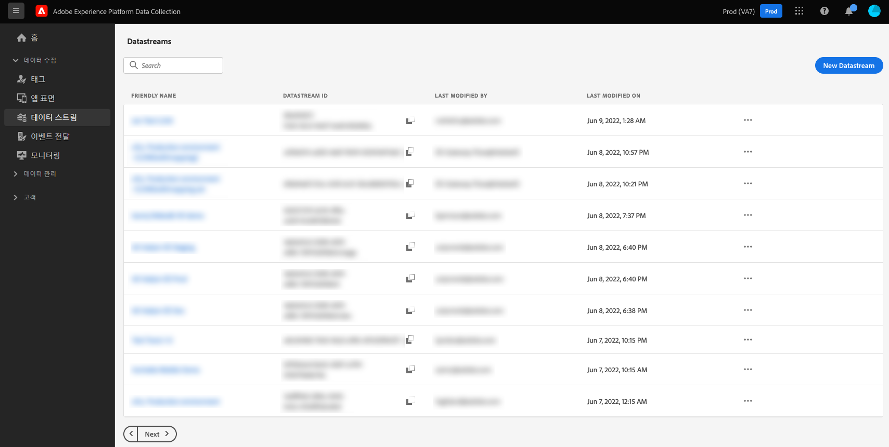

**[!UICONTROL Datastreams]** 탭에는 알기 쉬운 이름, ID 및 마지막으로 수정한 날짜를 포함하여 기존 데이터 스트림 목록이 표시됩니다. [세부 정보를 보고 서비스를 구성하려면](#view-details) 데이터 스트림의 이름을 선택하십시오.

특정 데이터 스트림에 대한 추가 옵션을 표시하려면 자세히 아이콘(**..**)을 선택하십시오. 데이터 스트림에 대한 [기본 구성](#configure)을(를) 업데이트하려면 **[!UICONTROL Edit]**&#x200B;을(를) 선택하십시오. 데이터 스트림을 제거하려면 **[!UICONTROL Delete]**&#x200B;을(를) 선택합니다.

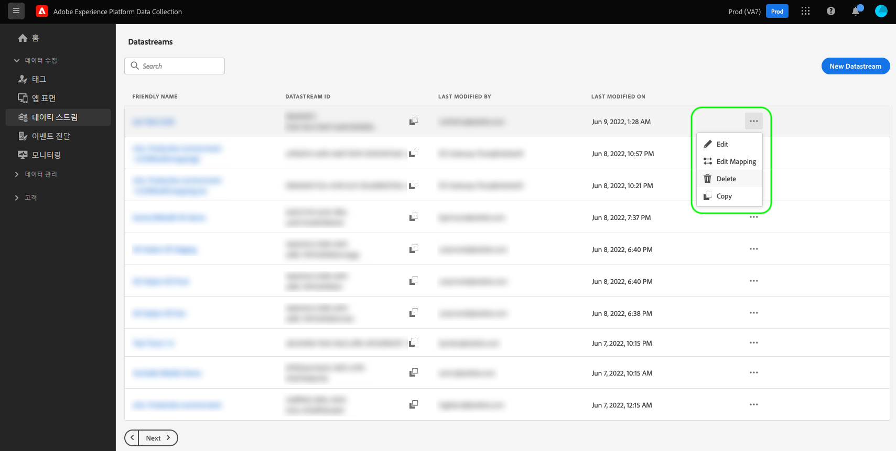

## 데이터 스트림 만들기 {#create}

데이터 스트림을 만들려면 **[!UICONTROL New Datastream]**&#x200B;을(를) 선택하여 시작합니다.

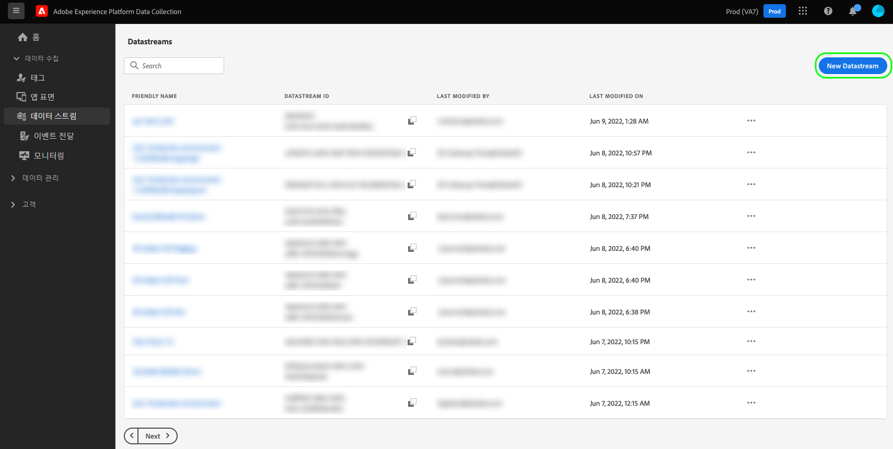

데이터스트림 생성 워크플로는 구성 단계부터 표시됩니다. 여기에 데이터스트림에 대한 이름 및 선택적 설명을 입력해야 합니다.

Experience Platform에서 사용할 데이터 스트림을 구성하고 웹 SDK도 사용하는 경우 수집할 데이터를 나타내는 [이벤트 기반 XDM(Experience Data Model) 스키마](/help/xdm/classes/experienceevent.md)도 선택해야 합니다.

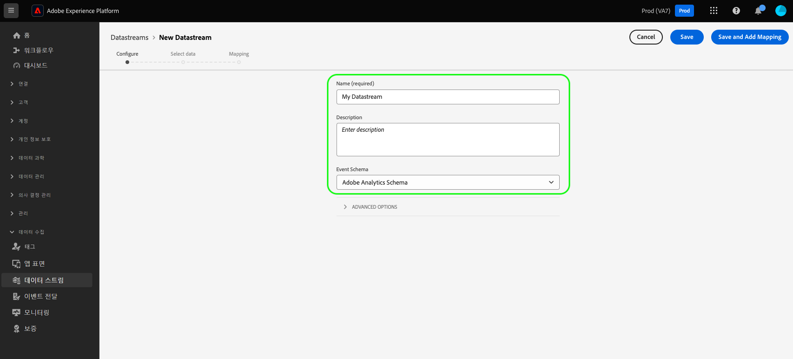

### 지리적 위치 및 네트워크 조회 구성 {#geolocation-network-lookup}

지리적 위치 및 네트워크 조회 설정을 사용하면 수집하려는 지리적 및 네트워크 수준 데이터의 세부 기간 수준을 정의할 수 있습니다.

**[!UICONTROL Geolocation and network lookup]** 섹션을 확장하여 아래에 설명된 설정을 구성합니다.

지리적 위치 및 네트워크 조회 설정이 강조 표시된 

| 설정 | 설명 |
| --- | --- |
| [!UICONTROL Geo Lookup] | 방문자의 IP 주소를 기반으로 선택한 옵션에 대한 지리적 위치 조회를 활성화합니다. 사용 가능한 옵션은 다음과 같습니다. <ul><li>**국가**: `xdm.placeContext.geo.countryCode` 채우기</li><li>**우편 번호**: `xdm.placeContext.geo.postalCode`을 채웁니다.</li><li>**시/도**: `xdm.placeContext.geo.stateProvince`을(를) 채웁니다.</li><li>**DMA**: `xdm.placeContext.geo.dmaID` 채우기</li><li>**구/군/시**: `xdm.placeContext.geo.city`을(를) 채웁니다</li><li>**위도**: `xdm.placeContext.geo._schema.latitude`을(를) 채웁니다.</li><li>**경도**: `xdm.placeContext.geo._schema.longitude` 채우기</li></ul>**[!UICONTROL City]**, **[!UICONTROL Latitude]** 또는 **[!UICONTROL Longitude]**&#x200B;을(를) 선택하면 선택한 다른 옵션에 관계없이 최대 2개의 소수점 이하 좌표를 제공합니다. 이는 도시 수준의 세부 기간으로 간주됩니다.   옵션을 선택하지 않으면 지리적 위치 조회가 비활성화됩니다. 지리적 위치는 [!UICONTROL IP Obfuscation] 전에 발생하며, 이는 지리적 위치가 [!UICONTROL IP Obfuscation] 설정의 영향을 받지 않음을 의미합니다. |
| [!UICONTROL Network Lookup] | 방문자의 IP 주소를 기반으로 선택한 옵션에 대한 네트워크 조회를 활성화합니다. 사용 가능한 옵션은 다음과 같습니다. <ul><li>**이동통신사**: `xdm.environment.carrier`을(를) 채웁니다.</li><li>**도메인**: `xdm.environment.domain`을 채웁니다.</li><li>**ISP**: `xdm.environment.ISP`을 채웁니다.</li><li>**연결 형식**: `xdm.environment.connectionType`을(를) 채웁니다.</li></ul> |

데이터 수집에 이러한 필드를 사용하도록 설정하는 경우 웹 SDK을 구성할 때 [`context`](/help/collection/js/commands/configure/context.md) 배열 속성을 올바르게 설정했는지 확인하십시오.

지리적 위치 조회 필드는 `context` 배열 문자열 `"placeContext"`을(를) 사용하고 네트워크 조회 필드는 `context` 배열 문자열 `"environment"`을(를) 사용합니다.

또한 원하는 각 XDM 필드가 스키마에 있는지 확인합니다. 그렇지 않으면 Adobe에서 제공한 `Environment Details` 필드 그룹을 스키마에 추가할 수 있습니다.

### 장치 조회 구성 {#geolocation-device-lookup}

**[!UICONTROL Device Lookup]** 설정을 사용하여 수집할 장치별 정보를 선택합니다.

**[!UICONTROL Device Lookup]** 섹션을 확장하여 아래에 설명된 설정을 구성합니다.

>[!IMPORTANT]
>
>아래 표에 표시된 설정은 함께 사용할 수 없습니다. 사용자 에이전트 정보 *및* 장치 조회 데이터를 동시에 선택할 수 없습니다.

| 설정 | 설명 |
| --- | --- |
| **[!UICONTROL Keep user agent and client hints headers]** | 사용자 에이전트 문자열에 저장된 정보만 수집하려면 이 옵션을 선택합니다. 이 설정은 기본적으로 선택됩니다. `xdm.environment.browserDetails.userAgent` 채우기 |
| **[!UICONTROL Use device lookup to collect the following information]** | 다음 장치별 정보 중 하나 이상을 수집하려면 이 옵션을 선택합니다. <ul><li>**[!UICONTROL Device]** 정보:<ul><li>**장치 제조업체**: `xdm.device.manufacturer`을 채웁니다.</li><li>**장치 모델**: `xdm.device.modelNumber` 채우기</li><li>**마케팅 이름**: `xdm.device.model` 채우기</li></ul></li><li>**[!UICONTROL Hardware]** 정보: <ul><li>**하드웨어 형식**: `xdm.device.type`을(를) 채웁니다.</li><li>**표시 높이**: `xdm.device.screenHeight`을(를) 채웁니다.</li><li>**표시 너비**: `xdm.device.screenWidth`을 채웁니다.</li><li>**표시 색 농도**: `xdm.device.colorDepth`을(를) 채웁니다.</li></ul></li><li>**[!UICONTROL Browser]** 정보: <ul><li>**브라우저 공급업체**: `xdm.environment.browserDetails.vendor` 채우기</li><li>**브라우저 이름**: `xdm.environment.browserDetails.name`을 채웁니다.</li><li>**브라우저 버전**: `xdm.environment.browserDetails.version`을 채웁니다.</li></ul></li><li>**[!UICONTROL Operating system]** 정보: <ul><li>**OS 공급업체**: `xdm.environment.operatingSystemVendor` 채우기</li><li>**OS 이름**: `xdm.environment.operatingSystem` 채우기</li><li>**OS 버전**: `xdm.environment.operatingSystemVersion`을 채웁니다.</li></ul></li></ul>사용자 에이전트 및 클라이언트 힌트와 함께 디바이스 조회 정보를 수집할 수 없습니다. 디바이스 정보를 수집하도록 선택하면 사용자 에이전트 및 클라이언트 힌트 수집이 비활성화되고 그 반대의 경우도 마찬가지입니다. |
| **[!UICONTROL Do not collect any device information]** | 장치 조회 정보를 수집하지 않으려면 이 옵션을 선택합니다. 장치, 하드웨어, 브라우저, 운영 체제, 사용자 에이전트 또는 클라이언트 힌트 데이터가 수집되지 않습니다. |

데이터 수집에 이러한 필드를 사용하도록 설정하는 경우 웹 SDK을 구성할 때 [`context`](/help/collection/js/commands/configure/context.md) 배열 속성을 올바르게 설정했는지 확인하십시오.

장치 및 하드웨어 정보는 `context` 배열 문자열 `"device"`을(를) 사용하고, 브라우저 및 운영 체제 정보는 `context` 배열 문자열 `"environment"`을(를) 사용합니다.

또한 원하는 각 XDM 필드가 스키마에 있는지 확인합니다. 그렇지 않으면 Adobe에서 제공한 `Environment Details` 필드 그룹을 스키마에 추가할 수 있습니다.

### 고급 옵션 구성 {#advanced-options}

고급 구성 옵션에 액세스하려면 **[!UICONTROL Advanced Options]**&#x200B;을(를) 선택합니다. 여기에서 IP 난독화, 자사 ID 쿠키 등과 같은 추가 데이터스트림 설정을 구성할 수 있습니다.

>[!IMPORTANT]
>
>정확한 지리적 위치 정보를 포함한 개인 데이터를 수집, 처리 및 전송하기 위해 해당 법률 및 규정에 따라 필요한 모든 권한, 동의, 승인 및 인증을 획득했는지 확인할 책임이 있습니다.
>
>IP 주소 난독화 선택은 IP 주소에서 파생되어 구성된 Adobe 솔루션으로 전송되는 지리적 위치 정보 수준에 영향을 주지 않습니다. 지리적 위치 조회는 개별적으로 제한되거나 비활성화되어야 합니다.

| 설정 | 설명 |
| --- | --- |
| [!UICONTROL IP Obfuscation] | 데이터스트림에 적용할 IP 난독화 유형을 표시합니다. 고객 IP를 기반으로 하는 모든 처리는 IP 난독화 설정의 영향을 받습니다. 데이터스트림에서 데이터를 받는 모든 Experience Cloud 서비스가 여기에 포함됩니다. IP 난독화는 이벤트가 데이터 준비와 같은 다운스트림 서비스로 전송되기 전에 발생합니다. 
사용 가능한 옵션:
 <ul><li>**[!UICONTROL None]**: IP 난독화를 사용하지 않도록 설정합니다. 데이터 스트림을 통해 전체 사용자 IP 주소가 전송됩니다.</li><li>**[!UICONTROL Partial]**: IPv4 주소의 경우 사용자 IP 주소의 마지막 옥텟을 난독화합니다. IPv6 주소의 경우 주소의 마지막 80비트를 난독화합니다. 
예:
 <ul><li>IPv4: `1.2.3.4` -> `1.2.3.0`</li><li>IPv6: `2001:0db8:1345:fd27:0000:ff00:0042:8329` -> `2001:0db8:1345:0000:0000:0000:0000:0000`</li></ul></li><li>**[!UICONTROL Full]**: 전체 IP 주소를 난독화합니다. 
예:
 <ul><li>IPv4: `1.2.3.4` -> `0.0.0.0`</li><li>IPv6: `2001:0db8:1345:fd27:0000:ff00:0042:8329` -> `0:0:0:0:0:0:0:0`</li></ul></li></ul> 다른 Adobe 제품에 미치는 IP 난독화 영향: <ul><li>**Adobe Target**: Adobe Target에서 수행된 [!UICONTROL IP obfuscation] 전에 데이터 스트림 수준 [!UICONTROL IP obfuscation]이(가) 요청에 있는 모든 IP 주소에 적용됩니다. 예를 들어 데이터 스트림 수준 [!UICONTROL IP obfuscation] 옵션이 **[!UICONTROL Full]**(으)로 설정되어 있고 Adobe Target IP 난독화 옵션이 **[!UICONTROL Last octet obfuscation]**(으)로 설정되어 있으면 Adobe Target에서 완전히 난독화된 IP를 수신합니다. 데이터스트림 수준 [!UICONTROL IP obfuscation] 옵션이 **[!UICONTROL Partial]**(으)로 설정되어 있고 Adobe Target IP 난독화 옵션이 **[!UICONTROL Full]**(으)로 설정되어 있으면 Adobe Target에서 부분적으로 난독화된 IP를 받은 다음 전체 난독화를 적용합니다. Adobe Target IP 난독화는 데이터 스트림 IP와 독립적으로 관리됩니다. 자세한 내용은 [IP 난독화](https://experienceleague.adobe.com/docs/target-dev/developer/implementation/privacy/privacy.html) 및 [지리적 위치](https://experienceleague.adobe.com/docs/target/using/audiences/create-audiences/categories-audiences/geo.html)에 대한 Adobe Target 설명서를 참조하십시오.</li><li>**Audience Manager**: Audience Manager에서 수행한 [!UICONTROL IP obfuscation] 전에 데이터 스트림 수준 [!UICONTROL IP obfuscation] 설정이 요청에 있는 모든 IP 주소에 적용됩니다. Audience Manager에서 수행한 모든 지리적 위치 조회는 데이터 스트림 수준 [!UICONTROL IP obfuscation] 옵션의 영향을 받습니다. 완전히 난독화된 IP를 기반으로 하는 Audience Manager의 지리적 위치 조회는 알 수 없는 영역을 발생시키고 결과 지리적 위치 데이터를 기반으로 하는 모든 세그먼트는 실현되지 않습니다. 자세한 내용은 [IP 난독화](https://experienceleague.adobe.com/docs/audience-manager/user-guide/features/administration/ip-obfuscation.html)에 대한 Audience Manager 설명서를 참조하십시오.</li><li>**Adobe Analytics**: 데이터 스트림 수준의 IP 난독화 설정이 **[!UICONTROL Full]**(으)로 설정된 경우 Adobe Analytics에서는 IP 주소를 공백으로 취급합니다. 이는 지리적 위치 조회 및 IP 필터링과 같이 IP 주소에 따라 달라지는 모든 Analytics 처리에 영향을 줍니다. Analytics가 난독화되지 않은 또는 부분적으로 난독화된 IP 주소를 받으려면 IP 난독화 설정을 **[!UICONTROL Partial]** 또는 **[!UICONTROL None]**(으)로 설정하십시오. 부분적으로 난독화되고 난독화되지 않은 IP 주소는 Analytics 내에서 더 난독화될 수 있습니다. Analytics에서 IP 난독화를 사용하는 방법에 대한 자세한 내용은 Adobe Analytics [설명서](https://experienceleague.adobe.com/docs/analytics/admin/admin-tools/manage-report-suites/edit-report-suite/report-suite-general/general-acct-settings-admin.html)를 참조하십시오. IP 주소가 완전히 난독화되고 페이지 히트에 [!DNL ECID]과(와) [!DNL VisitorID]이(가) 없는 경우 Analytics에서는 IP 주소를 부분적으로 기반으로 하는 [대체 ID](https://experienceleague.adobe.com/docs/id-service/using/reference/analytics-reference/analytics-ids.html?lang=en)을(를) 생성하지 않고 히트를 삭제합니다.</li><li>**[!DNL Adobe Advertising]**: 데이터스트림 수준 IP 난독화가 [!UICONTROL Partial] 또는 [!UICONTROL Full]&#x200B;(으)로 설정된 경우 연결된 TV 광고를 제외한 Advertising DSP에서 지리적 보고 및 기능(측정 및 리마케팅 포함)이 비활성화됩니다.</li></ul> |
| [!UICONTROL First Party ID Cookie] | 이 설정을 사용하면 Edge Network에서 ID 맵에서 이 값을 조회하는 대신 [자사 장치 ID](/help/collection/identity/fpid.md)를 조회할 때 지정된 쿠키를 참조하도록 합니다.  이 설정을 활성화할 경우 ID를 저장해야 하는 쿠키의 이름을 제공해야 합니다. |
| [!UICONTROL Third Party ID Sync] | ID 동기화를 컨테이너로 그룹화하면 다른 시간대에 다른 ID 동기화를 실행할 수 있습니다. 활성화되면 이 설정을 사용하여 이 데이터스트림에 실행되는 ID 동기화의 컨테이너를 지정할 수 있습니다. |
| [!UICONTROL Third Party ID Sync Container ID] | 타사 ID 동기화에 사용할 컨테이너의 숫자 ID입니다.  **참고:** 데이터 스트림은 기본 Audience Manager 컨테이너 ID(0)를 참조합니다. 여러 Audience Manager ID 동기화 컨테이너 ID가 있는 경우 Audience Manager 컨설턴트와 함께 ID 동기화 구성을 올바르게 식별하고 해결하십시오. |
| [!UICONTROL Container ID Overrides] | 이 섹션에서는 기본 ID를 재정의하는 데 사용할 수 있는 추가 타사 ID 동기화 컨테이너 ID를 정의할 수 있습니다. |
| [!UICONTROL Access Type] | Edge Network가 데이터스트림에 대해 허용하는 인증 유형을 정의합니다. <ul><li>**[!UICONTROL Mixed Authentication]**: 이 옵션을 선택하면 Edge Network에서 인증된 요청과 인증되지 않은 요청을 모두 수락합니다. [Edge Network API](https://developer.adobe.com/data-collection-apis/docs/api/)와 함께 웹 SDK 또는 [모바일 SDK](https://developer.adobe.com/client-sdks/home/)을(를) 사용하려면 이 옵션을 선택하십시오. </li><li>**[!UICONTROL Authenticated Only]**: 이 옵션을 선택하면 Edge Network에서 인증된 요청만 수락합니다. Edge Network API만 사용하고 인증되지 않은 요청이 Edge Network에 의해 처리되지 않도록 하려는 경우 이 옵션을 선택합니다.</li></ul> |
| [!UICONTROL Media Analytics] | Experience Platform SDK 또는 [Media Edge API](https://developer.adobe.com/cja-apis/docs/endpoints/media-edge/getting-started/)를 통해 [!DNL Edge Network] 통합을 위한 스트리밍 추적 데이터를 처리할 수 있습니다. [설명서](https://experienceleague.adobe.com/docs/media-analytics/using/media-overview.html?lang=ko)에서 Media Analytics에 대해 알아보세요. |

여기에서 Experience Platform에 대한 데이터스트림을 구성하는 경우 이 안내서로 돌아가기 전에 [데이터 수집을 위한 데이터 준비](/help/datastreams/data-prep.md)의 자습서에 따라 데이터를 Experience Platform 이벤트 스키마에 매핑하십시오. 그렇지 않으면 **[!UICONTROL Save]**&#x200B;을(를) 선택하고 다음 섹션으로 계속 진행하십시오.

>[!NOTE]
>
>변경 내용을 데이터스트림 구성에 저장한 후 변경 내용이 [!DNL Edge Network]에 전파될 수 있도록 최대 35분을 허용하십시오. 이 전달 기간 동안 이전 구성으로 요청이 계속 제공될 수 있습니다.

## 데이터스트림 세부 사항 보기 {#view-details}

새 데이터스트림을 구성하거나 보려는 기존 데이터스트림을 선택하면 해당 데이터스트림에 대한 세부 사항 페이지가 나타납니다. 여기에서 해당 ID가 포함된 데이터스트림에 대한 자세한 내용을 찾을 수 있습니다.

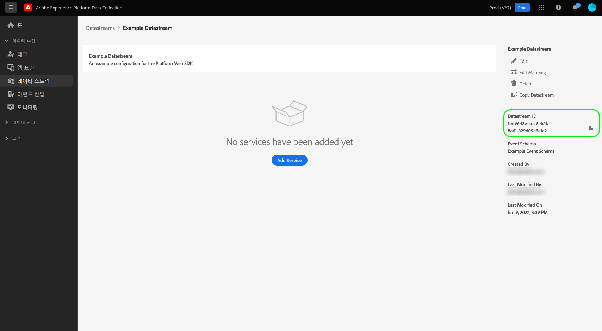

데이터스트림 세부 사항 화면에서 [서비스를 추가](#add-services)하여 액세스 권한이 있는 Adobe Experience Cloud 제품의 기능을 활성화할 수 있습니다. 데이터스트림의 [기본 구성](#create)을 편집하고, [매핑 규칙](/help/datastreams/data-prep.md)을 업데이트하고, [데이터스트림을 복사](#copy)하거나 완전히 삭제할 수도 있습니다.

## 데이터스트림에 서비스 추가 {#add-services}

데이터 스트림의 세부 정보 페이지에서 **[!UICONTROL Add Service]**&#x200B;을(를) 선택하여 해당 데이터 스트림에 사용할 수 있는 서비스를 추가하십시오.

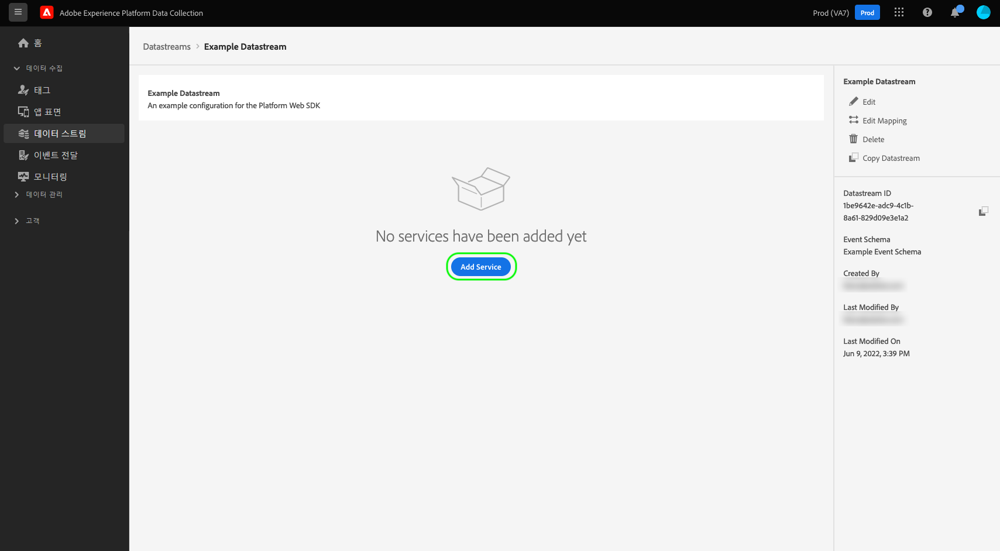

다음 화면에서 드롭다운 메뉴를 사용하여 이 데이터스트림에 대해 구성하는 서비스를 선택합니다. 액세스 권한이 있는 서비스만 이 목록에 표시됩니다.

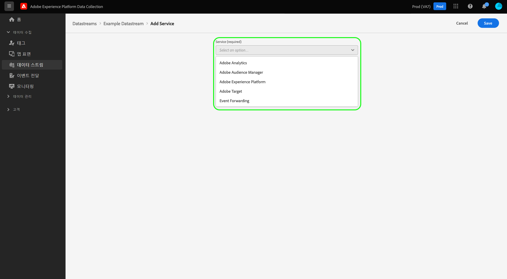

원하는 서비스를 선택하고 표시되는 구성 옵션을 입력한 다음 **[!UICONTROL Save]**&#x200B;을(를) 선택하여 데이터 스트림에 서비스를 추가합니다. 추가된 모든 서비스가 데이터스트림의 세부 사항 보기에 표시됩니다.

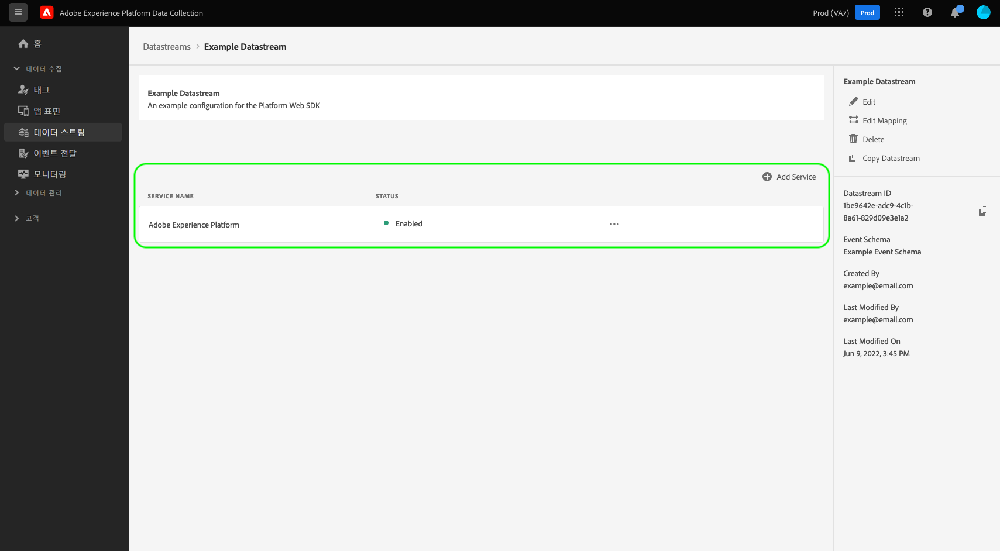

아래 하위 섹션에서는 각 서비스에 대한 구성 옵션에 대해 설명합니다.

>[!NOTE]
>
>각 서비스 구성에는 서비스를 선택할 때 자동으로 켜지는 **[!UICONTROL Enabled]** 옵션이 포함되어 있습니다. 이 데이터 스트림에 대해 선택한 서비스를 사용하지 않으려면 **[!UICONTROL Enabled]**&#x200B;을(를) 다시 선택하십시오.

### Adobe Advertising 설정 {#advertising}

이 서비스는 [!DNL Customer Journey Analytics]과(와) [!DNL Adobe Advertising]을(를) 통합하는 데 필요합니다.

### Adobe Analytics 설정 {#analytics}

이 서비스를 사용하여 데이터를 [!DNL Adobe Analytics]&#x200B;(으)로 보냅니다.

| 설정 | 설명 |
| --- | --- |
| [!UICONTROL Report Suite ID] | **(필수)** 데이터를 보낼 [!DNL Analytics] 보고서 세트의 ID입니다. 이 ID는 [!UICONTROL Admin] > [!UICONTROL ReportSuites]의 [!DNL Adobe Analytics] UI에서 찾을 수 있습니다. 여러 보고서 세트가 지정된 경우 데이터는 각 보고서 세트에 복사됩니다. |
| [!UICONTROL Visitor ID namespace] | (선택 사항) [!DNL Adobe Analytics] [visitorID](https://experienceleague.adobe.com/docs/analytics/implementation/vars/config-vars/visitorid.html?lang=ko-KR)에 사용할 네임스페이스입니다. 이 네임스페이스에 지정된 값이 있는 이벤트를 보내면 [!DNL Analytics]에서 `visitorID`(으)로 자동으로 사용됩니다.   필드가 채워지면 데이터 스트림이 `visitorID` 값을 [!DNL Adobe Analytics]에 보냅니다. 방문자 ID가 `identityMap`에 포함되어 있는지 여부에 관계없이 `ECID`은(는) 계속 생성되어 보내는 요청에 포함됩니다. [!DNL Analytics]에서는 여러 ID를 포함할 수 있습니다. ID는 이 페이지에 설명된 순서대로 평가됩니다. [Adobe Analytics 작업 식별 순서](https://experienceleague.adobe.com/en/docs/analytics/implementation/id/overview#adobe-analytics-identification-order-of-operations). |
| [!UICONTROL Report Suite Overrides] | 이 섹션에서는 기본 ID 재정의에 사용할 수 있는 추가 보고서 세트 ID를 추가할 수 있습니다. |

자세한 내용은 [!DNL Analytics] 구현 안내서의 [Edge Network을 사용하여 Adobe Analytics 구현](https://experienceleague.adobe.com/en/docs/analytics/implementation/aep-edge/overview)을 참조하십시오.

### Adobe Audience Manager 설정 {#audience-manager}

데이터를 [!DNL Adobe Audience Manager]&#x200B;(으)로 보내려면 이 서비스를 활성화하십시오. 다른 설정은 선택 사항이지만 사용하는 것이 좋습니다.

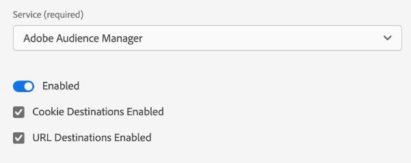

| 설정 | 설명 |
| --- | --- |
| [!UICONTROL Cookie Destinations Enabled] | SDK에서 [!DNL Audience Manager]의 [쿠키 대상](https://experienceleague.adobe.com/docs/audience-manager/user-guide/features/destinations/custom-destinations/create-cookie-destination.html)을 통해 세그먼트 정보를 공유할 수 있습니다. |
| [!UICONTROL URL Destinations Enabled] | SDK에서 [!DNL Audience Manager]의 [URL 대상](https://experienceleague.adobe.com/docs/audience-manager/user-guide/features/destinations/custom-destinations/create-url-destination.html)을 통해 세그먼트 정보를 공유할 수 있습니다. |

### Adobe Experience Platform 설정 {#aep}

>[!IMPORTANT]
>
>Experience Platform에 대한 데이터스트림을 활성화할 때 UI의 상단 리본에 표시된 대로 현재 사용 중인 Experience Platform 샌드박스를 주목하십시오.
>
>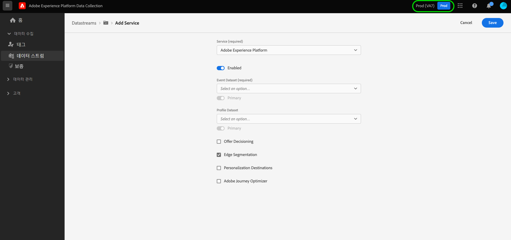
>
>샌드박스는 [!DNL Adobe Experience Platform]에서 사용자의 데이터 및 구현을 조직의 다른 파티션과 격리하는 가상 파티션입니다. 데이터스트림이 생성되면 해당 샌드박스는 변경될 수 없습니다. Experience Platform의 샌드박스 역할에 대한 자세한 내용은 [샌드박스 설명서](/help/sandboxes/home.md)를 참조하십시오.

이 서비스를 사용하여 데이터를 [!DNL Adobe Experience Platform]&#x200B;(으)로 보냅니다.

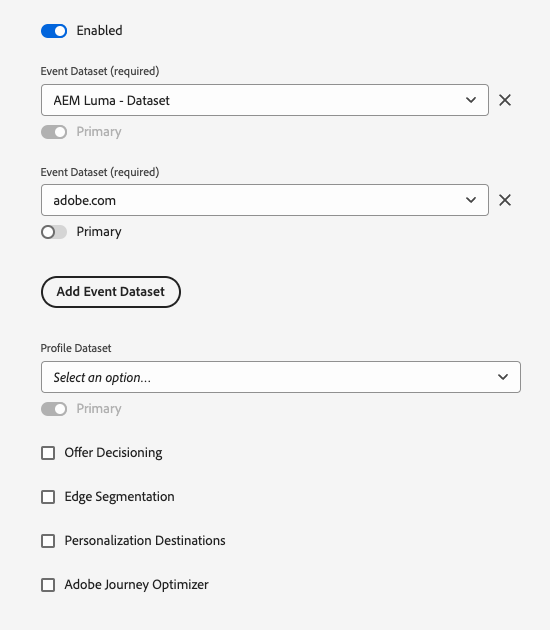

| 설정 | 설명 |
|---| --- |
| [!UICONTROL Event Dataset] | **(필수)** 고객 이벤트 데이터를 스트리밍할 Experience Platform 데이터 세트를 선택하십시오. 이 스키마는 [XDM ExperienceEvent 클래스](/help/xdm/classes/experienceevent.md)를 사용해야 합니다. 데이터 세트를 더 추가하려면 **[!UICONTROL Add Event Dataset]**&#x200B;을(를) 선택하십시오. |
| [!UICONTROL Profile Dataset] | **동의**, **푸시 토큰** 및 **사용자 활동 영역** 고객 특성을 보내는 데 사용할 Experience Platform 데이터 집합을 선택하십시오. 이 스키마는 [XDM 개별 프로필 클래스](/help/xdm/classes/individual-profile.md)를 사용해야 합니다. |
| [!UICONTROL Offer Decisioning] | 웹 SDK 구현에 대한 의사 결정 관리(이전 Offer Decisioning)를 활성화합니다. 구현 세부 정보는 [의사 결정 관리 설명서](https://experienceleague.adobe.com/ko/docs/journey-optimizer/using/decisioning/offer-decisioning/get-started-decision/starting-offer-decisioning)를 참조하세요. |
| [!UICONTROL Edge Segmentation] | 이 데이터 스트림에 대해 [에지 세분화](/help/segmentation/methods/edge-segmentation.md)을(를) 사용합니다. 웹 SDK 또는 [Edge Network API](https://developer.adobe.com/data-collection-apis/docs/api/)에서 에지 세분화가 활성화된 데이터 스트림을 통해 데이터를 보내면 해당 프로필에 대해 업데이트된 대상 멤버십이 응답으로 다시 전송됩니다.  이 옵션은 [Edge 대상](/help/destinations/ui/activate-edge-personalization-destinations.md), 의사 결정 관리, [Personalization](https://experienceleague.adobe.com/en/docs/target) 또는 [Adobe Journey Optimizer](https://experienceleague.adobe.com/ko/docs/journey-optimizer/using/ajo-home)을 통해 같은 페이지 및 다음 페이지 개인화 사용 사례에 대해 **Adobe Target 대상**&#x200B;과 함께 사용할 수 있습니다. |
| [!UICONTROL Personalization Destinations] | 이 데이터 스트림에 대해 [사용자 지정 Personalization](/help/destinations/catalog/personalization/custom-personalization.md)을(를) 사용하도록 설정합니다. 웹 SDK 또는 [Edge Network API](https://developer.adobe.com/data-collection-apis/docs/api/)가 개인화 대상이 활성화된 데이터 스트림을 통해 데이터를 전송하는 경우 해당 프로필에 대한 대상 멤버십 및 매핑된 프로필 속성(인증된 [Edge Network API](https://developer.adobe.com/data-collection-apis/docs/api/) 요청에 대해서만)이 응답으로 다시 전송됩니다. |
| [!UICONTROL Adobe Journey Optimizer] | 이 데이터 스트림에 대해 [!DNL Adobe Journey Optimizer]을(를) 사용하도록 설정합니다.  이 옵션을 사용하면 데이터 스트림이 [!DNL Adobe Journey Optimizer]의 웹 및 앱 기반 인바운드 캠페인에서 개인화된 콘텐츠를 반환할 수 있습니다.  이 옵션을 사용하려면 선택한 데이터 집합이 **[!UICONTROL Experience Event - Proposition Interactions]** [필드 그룹](/help/xdm/ui/resources/schemas.md#add-field-groups)을 포함하는 스키마를 사용해야 합니다. 이 필드 그룹은 [!DNL Adobe Journey Optimizer]개의 캠페인 및 경험과의 모든 사용자 상호 작용을 기록하는 데 사용됩니다. |

### Adobe Target 설정 {#target}

이 서비스를 사용하여 데이터를 [!DNL Adobe Target]&#x200B;(으)로 보냅니다.

| 설정 | 설명 |
| --- | --- |
| [!UICONTROL Property Token] | [!DNL Target]에서는 고객이 속성을 사용하여 권한을 제어할 수 있습니다. 속성에 대한 자세한 내용은 [!DNL Target] 설명서의 [Enterprise 권한 구성](https://experienceleague.adobe.com/docs/target/using/administer/manage-users/enterprise/properties-overview.html)에 대한 안내서를 참조하십시오.  속성 토큰은 [!UICONTROL Setup] > [!UICONTROL Properties]의 [!DNL Adobe Target] UI에서 찾을 수 있습니다. |
| [!UICONTROL Target Environment ID] | [Adobe Target의 환경](https://experienceleague.adobe.com/docs/target/using/administer/hosts.html)을 사용하여 모든 단계의 개발을 통해 구현을 관리할 수 있습니다. 이 설정은 이 데이터스트림과 함께 사용하려는 환경을 지정합니다.  가장 좋은 방법은 구성 오류를 방지하기 위해 각 `dev`, `stage` 및 `prod` 데이터 스트림 환경에 대해 이 설정을 다르게 설정하는 것입니다. 그러나 이미 [!DNL Adobe Target]개의 환경이 정의된 경우 해당 환경을 사용할 수 있습니다. |
| [!UICONTROL Target Third Party ID namespace] | 이 데이터스트림에 사용하려는 `mbox3rdPartyId`에 대한 ID 네임스페이스. [!DNL Adobe Target]과(와) [!DNL Customer Attributes] 통합을 사용하거나 `thirdPartyId`을(를) 사용하여 [Adobe Target 프로필 API](https://experienceleague.adobe.com/en/docs/target-dev/developer/api/profile-apis/profiles-api)를 통해 프로필을 업데이트하거나 만드는 경우 원하는 네임스페이스 값을 제공해야 합니다. 고객 특성 파일 업로드나 프로필 업데이트 API 호출에 사용된 `customerID` 또는 `thirdPartyId`을(를) 전송하려면 XDM 스키마의 `IdentityMap` 섹션에서 이 네임스페이스를 사용해야 합니다. |
| [!UICONTROL Property Token Overrides] | 이 섹션에서는 기본 속성 토큰을 재정의하는 데 사용할 수 있는 추가 속성 토큰을 정의할 수 있습니다. |

### [!UICONTROL Event Forwarding] 설정 {#event-forwarding}

이 서비스를 사용하여 [이벤트 전달](/help/tags/ui/event-forwarding/overview.md)에 데이터를 보냅니다.

데이터 스트림 구성 화면의 

| 설정 | 설명 |
| --- | --- |
| [!UICONTROL Launch Property] | **(필수)** 데이터를 전송하려는 이벤트 전달 속성. |
| [!UICONTROL Launch Environment] | **(필수)** 데이터를 전송하려는 선택 속성 내 환경. |

>[!NOTE]
>
>드롭다운 메뉴를 사용하는 대신 **[!UICONTROL Manually enter IDs]**&#x200B;을(를) 선택하여 속성 및 환경 이름을 입력할 수 있습니다.

## 데이터스트림 복사 {#copy}

기존 데이터스트림의 사본을 만들고 필요에 따라 세부 사항을 변경할 수 있습니다.

>[!NOTE]
>
>데이터스트림은 동일한 [샌드박스](/help/sandboxes/home.md) 내에서만 복사할 수 있습니다. 한 샌드박스에서 다른 샌드박스로 데이터 스트림을 복사할 수 없습니다.

[!UICONTROL Datastreams] 작업 영역의 기본 페이지에서 줄임표(**....**)를 선택합니다. 해당 데이터 스트림에 대해 **[!UICONTROL Copy]**&#x200B;을(를) 선택합니다.

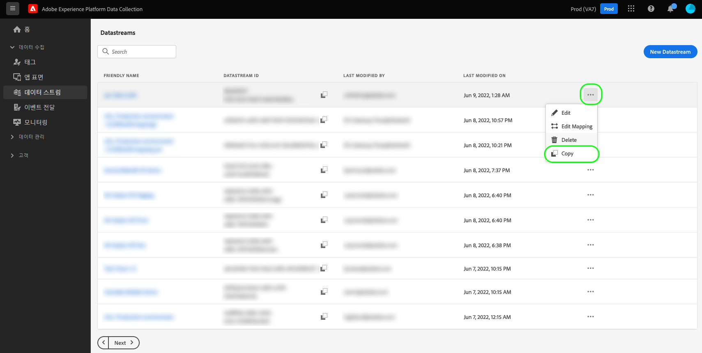

또는 지정된 데이터 스트림의 세부 정보 보기에서 **[!UICONTROL Copy Datastream]**&#x200B;을(를) 선택할 수 있습니다.

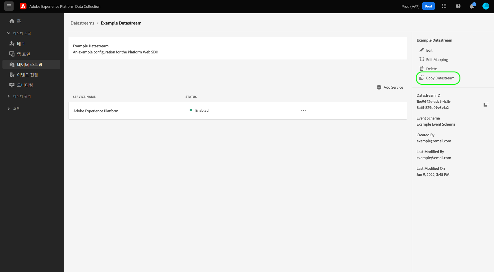

전체 복사하려는 구성 옵션에 대한 세부 사항과 함께 생성할 새 데이터스트림의 고유 이름을 제공하라는 확인 대화 상자가 나타납니다. 준비가 되면 **[!UICONTROL Copy]**&#x200B;을(를) 선택합니다.

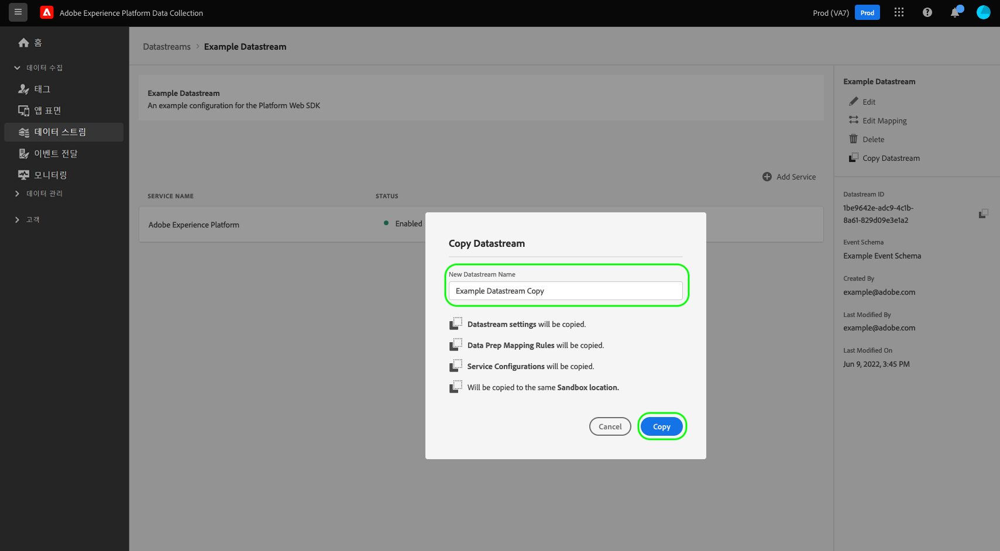

[!UICONTROL Datastreams] 작업 영역의 기본 페이지가 새 데이터 스트림이 나열된 상태로 다시 나타납니다.

## 다음 단계 {#next-steps}

이 안내서에는 데이터 수집 UI에서 데이터스트림을 관리하는 방법이 나와 있습니다. 데이터 스트림을 설정한 후 웹 SDK을 설치하고 구성하는 방법에 대한 자세한 내용은 [태그 확장 시작하기](/help/tags/extensions/client/web-sdk/getting-started.md)를 참조하십시오. [!DNL Web SDK] 
