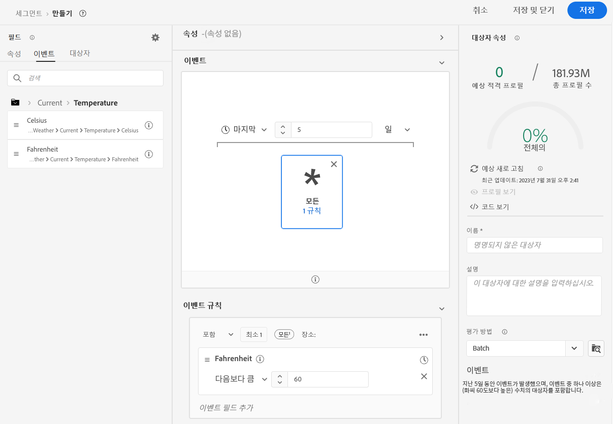
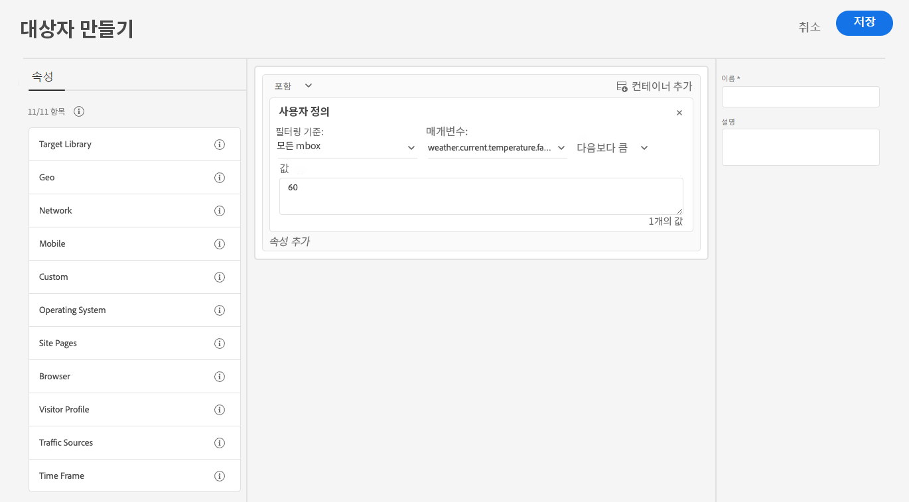

# 다음의 날씨 데이터 사용 [!DNL The Weather Channel]

Adobe은 [!DNL [The Weather Company]](https://www.ibm.com/weather) 데이터스트림을 통해 수집된 데이터에 미국 날씨의 추가 컨텍스트를 가져옵니다. Experience Platform에서 분석, 타기팅 및 세그먼트 생성에 이 데이터를 사용할 수 있습니다.

사용 가능한 데이터에는 3가지 유형이 있습니다. [!DNL The Weather Channel]:

* **[!UICONTROL 현재 날씨]**: 위치를 기반으로 한 사용자의 현재 날씨 상태입니다. 여기에는 현재 온도, 섭취, 구름 범위 등이 포함됩니다.
* **[!UICONTROL 예보된 날씨]**: 예측에는 사용자 위치에 대한 1,2,3,5,7 및 10일 예측이 포함됩니다.
* **[!UICONTROL 트리거]**: 트리거는 서로 다른 의미 있는 날씨 조건에 매핑되는 특정 조합입니다. 세 가지 유형의 날씨 유발기가 있습니다.

   * **[!UICONTROL 날씨 트리거]**: 추위나 비가 오는 날씨와 같이 의미상 의미 있는 상태. 이들은 다양한 기후 간에 그 정의가 다를 수 있다.
   * **[!UICONTROL 제품 트리거]**: 다양한 유형의 제품을 구매하는 조건입니다. 예를 들어, 추운 날씨 예보는 비 코트 구입이 더 가능성이 높다는 것을 의미할 수 있습니다.
   * **[!UICONTROL 악천후 유발인자]**: 겨울 폭풍 또는 허리케인 경고와 같은 심각한 기상 경고입니다.

## 사전 요구 사항 {#prerequisites}

날씨 데이터를 사용하기 전에 다음 사전 요구 사항을 충족하는지 확인하십시오.

* 사용할 날씨 데이터에 라이선스를 부여해야 합니다. [!DNL The Weather Channel]. 그러면 사용자가 계정에서 활성화합니다.
* 날씨 데이터는 데이터스트림을 통해서만 사용할 수 있습니다. 날씨 데이터를 사용하려면 다음을 사용해야 합니다. [!DNL Web SDK], [!DNL Mobile Edge Extension] 또는 [서버 API](../../server-api/overview.md) 을 클릭하여 이 데이터를 활용하십시오.
* 데이터 스트림에 다음이 있어야 합니다. [[!UICONTROL 지리적 위치]](../configure.md#advanced-options) 활성화되었습니다.
* 추가 [기상 필드 그룹](#schema-configuration) 사용 중인 스키마에 매핑합니다.

## 프로비저닝 {#provisioning}

데이터 라이센스를 받은 위치 [!DNL The Weather Channel]: 귀하의 계정이 데이터에 액세스할 수 있도록 합니다. 그런 다음 데이터 스트림에 데이터를 활성화하려면 Adobe 고객 지원 센터에 연결해야 합니다. 활성화되면 데이터가 자동으로 추가됩니다.

디버거로 Edge 추적을 실행하거나 Assurance를 사용하여 히트를 추적하여 이 히트가 추가되고 있는지 확인할 수 있습니다. [!DNL Edge Network].

### 스키마 구성 {#schema-configuration}

데이터 스트림에서 사용 중인 이벤트 데이터 세트에 해당하는 Experience Platform 스키마에 날씨 필드 그룹을 추가해야 합니다. 5개의 필드 그룹을 사용할 수 있습니다.

* [!UICONTROL 예보된 날씨]
* [!UICONTROL 현재 날씨]
* [!UICONTROL 제품 트리거]
* [!UICONTROL 상대적 트리거]
* [!UICONTROL 악천후 유발인자]

## 날씨 데이터 액세스 {#access-weather-data}

데이터에 대한 라이센스가 부여되고 사용 가능해지면 Adobe 서비스 전체에서 다양한 방법으로 액세스할 수 있습니다.

### Adobe Analytics {#analytics}

위치 [!DNL Adobe Analytics], 날씨 데이터는 나머지 와 함께 처리 규칙을 통해 매핑할 수 있습니다. [!DNL XDM] 스키마.

매핑할 수 있는 필드 목록은 [날씨 참조](weather-reference.md) 페이지를 가리키도록 업데이트하는 중입니다. 모두와 마찬가지로 [!DNL XDM] 스키마, 키 접두어: `a.x`. 예를 들어, 이름이 인 필드 `weather.current.temperature.farenheit` 다음에 나타남: [!DNL Analytics] 다음으로: `a.x.weather.current.temperature.farenheit`.

### Adobe Customer Journey Analytics {#cja}

위치 [!DNL Adobe Customer Journey Analytics]: 날씨 데이터는 데이터스트림에 지정된 데이터 세트에서 사용할 수 있습니다. 날씨 속성인 한 [스키마에 추가됨](#prerequisites-prerequisites), 다음에 대한 사용 가능: [데이터 보기에 추가](https://experienceleague.adobe.com/docs/analytics-platform/using/cja-dataviews/create-dataview.html) 위치: [!DNL Customer Journey Analytics].

### Real-Time Customer Data Platform {#rtcdp}

날씨 데이터는 다음 위치에서 사용할 수 있습니다. [Real-time Customer Data Platform](../../rtcdp/overview.md): 세그먼트에서 사용됩니다. 날씨 데이터가 이벤트에 첨부됩니다.

Adobe 기상 상태는 종종 변경되므로 위의 예제와 같이 세그먼트에 시간 제한을 설정하는 것이 좋습니다. 마지막 한두 날 추운 날이 6개월 전 추운 날보다 훨씬 더 영향력이 있다.

다음을 참조하십시오. [날씨 참조](weather-reference.md) 사용 가능한 필드.

### Adobe Target {#target}

위치 [!DNL Adobe Target], 날씨 데이터를 사용하여 실시간으로 개인화를 추진할 수 있습니다. 날씨 데이터가에 전달됩니다. [!DNL Target] 다음으로: [!UICONTROL mBox] 매개 변수 및 사용자 지정을 통해 액세스할 수 있습니다. [!UICONTROL mBox] 매개 변수.

매개 변수는 [!DNL XDM] 특정 필드의 경로. 다음을 참조하십시오. [날씨 참조](weather-reference.md) 사용 가능한 필드 및 해당 경로.

## 다음 단계 {#next-steps}

이 문서를 읽은 후에는 다양한 Adobe 솔루션에서 날씨 데이터를 사용하는 방법을 더 잘 이해할 수 있습니다. 날씨 데이터 필드 매핑에 대한 자세한 내용은 다음을 참조하십시오. [필드 매핑 참조](weather-reference.md).
