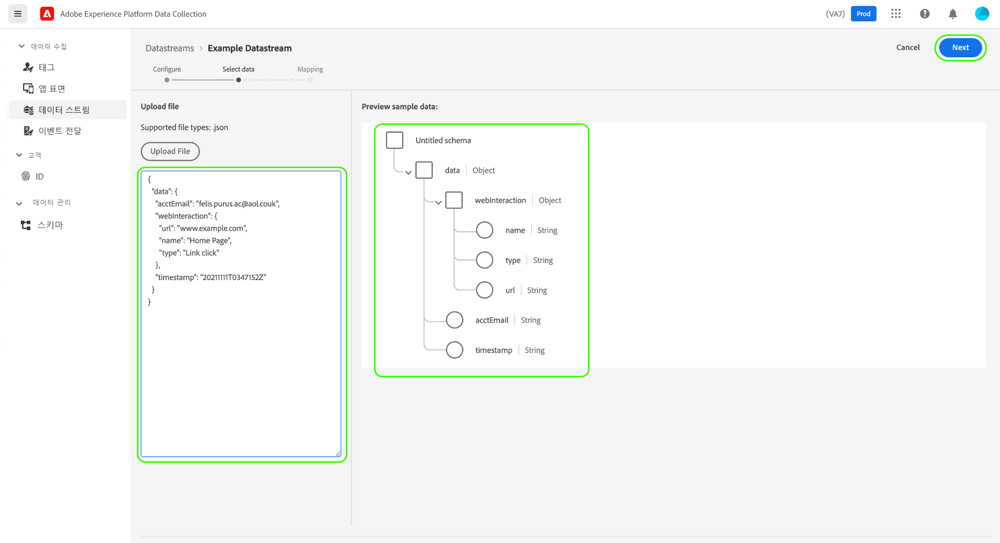
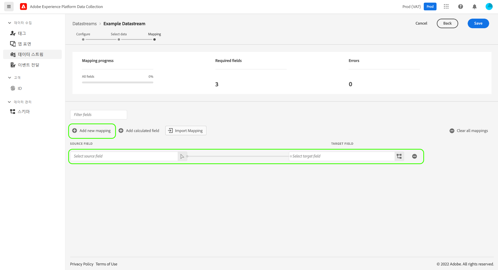
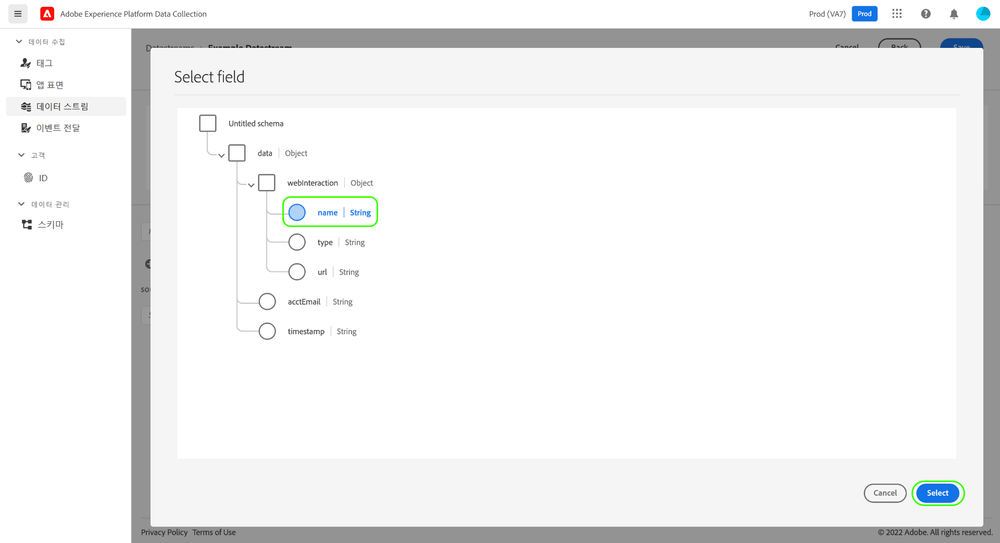
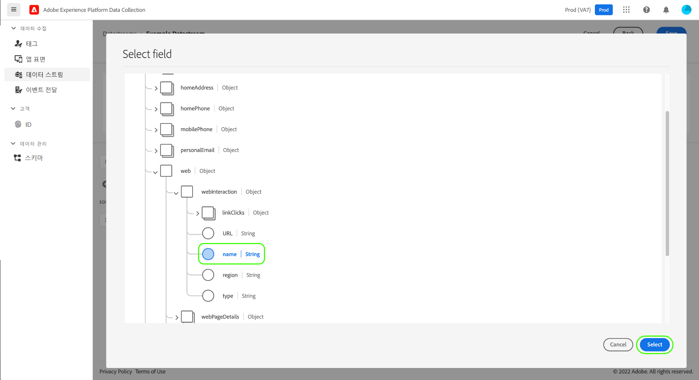
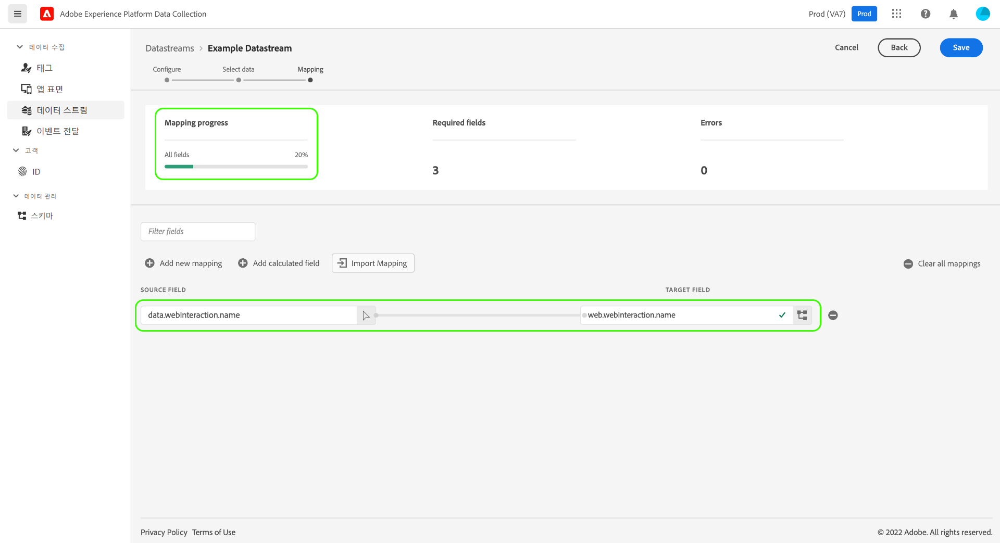
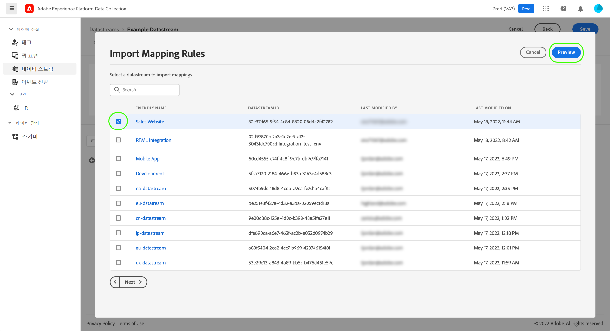
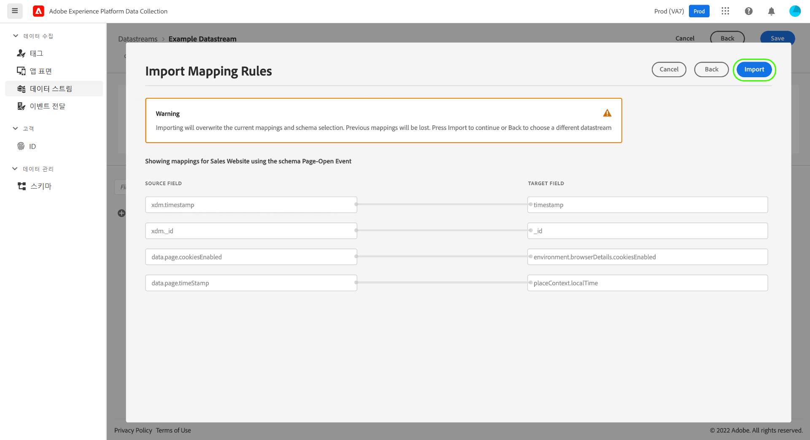
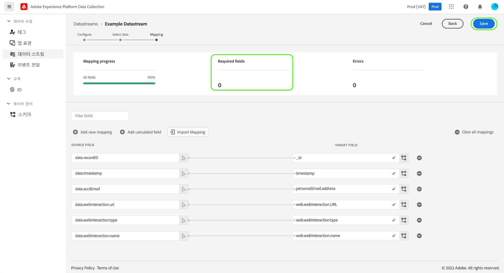

# 데이터 수집을 위한 데이터 준비

데이터 준비는 [Experience Data Model(XDM)](../xdm/home.md)과의 데이터를 매핑, 변환 및 확인할 수 있는 Adobe Experience Platform 서비스입니다. Platform 지원 [데이터스트림](./overview.md)을 구성할 때 데이터 준비 기능을 사용하여 소스 데이터를 Platform Edge Network로 전송 시 XDM에 매핑할 수 있습니다.

>[!NOTE]
>
>계산된 필드의 변환 기능을 포함하여 모든 데이터 준비 기능에 대한 포괄적인 지침은 다음 설명서를 참조하십시오.
>
>* [데이터 준비 개요](../data-prep/home.md)
>* [데이터 준비 매핑 기능](../data-prep/functions.md)
>* [데이터 준비로 데이터 포맷 처리](../data-prep/data-handling.md)

이 안내서에는 UI에서 데이터를 매핑하는 방법을 설명합니다. 단계와 함께 팔로우하려면 [기본 구성 단계](./overview.md#create)까지(이를 포함) 데이터스트림을 생성하는 프로세스를 시작합니다.

데이터 수집 프로세스에 대한 데이터 준비 데모를 빠르게 보려면 다음 비디오를 참조하십시오.

>[!VIDEO](https://video.tv.adobe.com/v/342120?quality=12&enable10seconds=on&speedcontrol=on)

## [!UICONTROL 데이터 선택] {#select-data}

데이터스트림에 대한 기본 구성을 완료한 후 **[!UICONTROL 매핑 저장 및 추가]**&#x200B;를 선택하면 **[!UICONTROL 데이터 선택]** 단계가 표시됩니다. 여기서 Platform으로 전송할 데이터의 구조를 나타내는 샘플 JSON 오브젝트를 제공해야 합니다.

데이터 계층에서 바로 속성을 캡처하려면 JSON 오브젝트에는 단일 루트 속성이 있어야 합니다`data`. 의 하위 속성 `data` 그런 다음 캡처할 데이터 레이어 속성에 매핑되는 방식으로 개체를 구성해야 합니다. 아래 섹션을 선택하여 `data` 루트로 형식이 제대로 지정된 JSON 오브젝트의 예제를 확인합니다.

`data` 루트가 포함된 +++샘플 JSON 파일

```json
{
  "data": {
    "eventMergeId": "cce1b53c-571f-4f36-b3c1-153d85be6602",
    "eventType": "view:load",
    "timestamp": "2021-09-30T14:50:09.604Z",
    "web": {
      "webPageDetails": {
        "siteSection": "Product section",
        "server": "example.com",
        "name": "product home",
        "URL": "https://www.example.com"
      },
      "webReferrer": {
        "URL": "https://www.adobe.com/index2.html",
        "type": "external"
      }
    },
    "commerce": {
      "purchase": 1,
      "order": {
        "orderID": "1234"
      }
    },
    "product": [
      {
        "productInfo": {
          "productID": "123"
        }
      },
      {
        "productInfo": {
          "productID": "1234"
        }
      }
    ],
    "reservation": {
      "id": "anc45123xlm",
      "name": "Embassy Suits",
      "SKU": "12345-L",
      "skuVariant": "12345-LG-R",
      "priceTotal": "112.99",
      "currencyCode": "USD",
      "adults": 2,
      "children": 3,
      "productAddMethod": "PDP",
      "_namespace": {
        "test": 1,
        "priceTotal": "112.99",
        "category": "Overnight Stay"
      },
      "freeCancellation": false,
      "cancellationFee": 20,
      "refundable": true
    }
  }
}
```

+++

XDM 오브젝트 데이터 요소에서 속성을 캡처하려면 동일한 규칙이 JSON 오브젝트에 적용되지만 루트 속성은 대신 `xdm`으로 입력되어야 합니다. 아래 섹션을 선택하여 `xdm` 루트로 형식이 제대로 지정된 JSON 오브젝트의 예제를 확인합니다.

`xdm` 루트가 포함된 +++샘플 JSON 파일

```json
{
  "xdm": {
    "environment": {
      "type": "browser",
      "browserDetails": {
        "userAgent": "Mozilla/5.0 (Macintosh; Intel Mac OS X 10_7_5) AppleWebkit/537.36 (KHTML, like Gecko) Chrome/49.0.2623.112 Safari/537.36",
        "javaScriptEnabled": true,
        "javaScriptVersion": "1.8.5",
        "cookiesEnabled": true,
        "viewportHeight": 900,
        "viewportWidth": 1680,
        "javaEnabled": true
      },
      "domain": "adobe.com",
      "colorDepth": 24,
      "viewportHeight": 1050,
      "viewportWidth": 1680
    },
    "device": {
      "screenHeight": 1050,
      "screenWidth": 1680
    }
  }
}
```

+++

옵션을 선택하여 오브젝트를 파일로 업로드하거나 원시 오브젝트를 대신 제공된 텍스트 상자에 붙여넣을 수 있습니다. JSON이 유효한 경우 오른쪽 패널에 미리보기 스키마가 표시됩니다. 계속하려면 **[!UICONTROL 다음]**&#x200B;을 선택합니다.



## [!UICONTROL 매핑]

**[!UICONTROL 매핑]** 단계가 표시되면 Platform에서 소스 데이터의 필드를 대상 이벤트 스키마의 필드에 매핑할 수 있습니다. 여기서 두 가지 방법으로 매핑을 구성할 수 있습니다.

* [매핑 규칙 만들기](#create-mapping) 수동 프로세스를 통해 이 데이터스트림에 대한 것입니다.
* 기존 데이터스트림에서 [매핑 규칙을 가져옵니다](#import-mapping).

### 매핑 규칙 만들기 {#create-mapping}

매핑 규칙을 만들려면 다음을 선택합니다. **[!UICONTROL 새 매핑 추가]**.



소스 아이콘()을 선택하고 표시되는 대화 상자에서 제공된 캔버스에서 매핑하려는 소스 필드를 선택합니다. 필드가 선택되면 **[!UICONTROL 선택]** 버튼을 사용하여 계속합니다.



다음으로 스키마 아이콘()을 선택하여 대상 이벤트 스키마에 유사한 대화 상자를 엽니다. **[!UICONTROL 선택]**&#x200B;을 사용하여 확인 전에 데이터를 매핑하려는 필드를 선택합니다.



완료된 필드 매핑이 표시되면 매핑 페이지가 다시 나타납니다. 매핑이 완료된 총 필드 수를 반영하도록 **[!UICONTROL 매핑 프로세스]** 섹션이 업데이트됩니다.



>[!TIP]
>
>(소스 필드의) 오브젝트 배열을 (대상 필드의) 다른 오브젝트 배열에 매핑하려면 아래와 같이 소스 및 대상 필드 경로에서 배열 이름 다음에 `[*]`을 추가합니다.
>
>

### 기존 매핑 규칙 가져오기 {#import-mapping}

이전에 데이터스트림을 생성한 경우 구성된 매핑 규칙을 새 데이터스트림에 대해 재사용할 수 있습니다.

>[!WARNING]
>
>다른 데이터 스트림에서 매핑 규칙을 가져오면 가져오기 전에 추가했을 수 있는 필드 매핑을 덮어씁니다.

시작하려면 **[!UICONTROL 매핑 가져오기]**&#x200B;를 선택합니다.

![선택 중인 [!UICONTROL 매핑 가져오기] 버튼을 보여 주는 이미지](assets/data-prep/import-mapping-button.png)

표시되는 대화 상자에서 가져오려는 매핑 규칙이 있는 데이터스트림을 선택합니다. 데이터스트림이 선택되면 **[!UICONTROL 미리보기]**&#x200B;를 선택합니다.



>[!NOTE]
>
>데이터스트림은 동일한 [샌드박스](../sandboxes/home.md) 내에서만 가져올 수 있습니다. 다시 말해, 한 샌드박스에서 다른 샌드박스로 데이터스트림을 가져올 수 없습니다.

다음 화면에는 선택한 데이터스트림에 대해 저장된 매핑 규칙의 미리보기가 표시됩니다. 표시된 매핑이 예상한 매핑인지 확인한 다음 **[!UICONTROL 가져오기]**&#x200B;를 선택하여 매핑을 확인하고 새 데이터스트림에 추가합니다.



>[!NOTE]
>
>가져온 매핑 규칙의 소스 필드가 [이전에 제공한](#select-data) 샘플 JSON 데이터에 포함되지 않은 경우 해당 필드 매핑은 가져오기에 포함되지 않습니다.

### 매핑 완료

위 단계를 따라 나머지 필드를 대상 스키마에 계속 매핑합니다. 사용 가능한 모든 소스 필드를 매핑할 필요는 없지만 필요에 따라 설정된 대상 스키마의 모든 필드를 매핑해야 이 단계를 완료할 수 있습니다. **[!UICONTROL 필수 필드]** 카운터는 아직 현재 구성에 매핑되지 않은 필수 필드의 수를 표시합니다.

필수 필드 수가 0에 도달하고 매핑이 만족스러우면 다음을 선택합니다. **[!UICONTROL 저장]** 을 눌러 변경 사항을 완료합니다.



## 다음 단계

이 안내서에서는 UI에서 데이터스트림 설정 시 데이터를 XDM에 매핑하는 방법이 나와 있습니다. 일반 데이터스트림 튜토리얼을 참조하는 경우 이제 [데이터스트림 세부 정보 보기](./overview.md) 단계로 돌아갈 수 있습니다.
