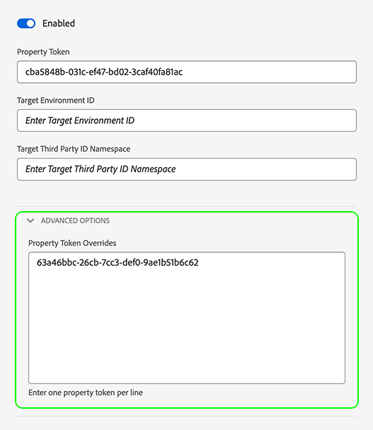

# 데이터스트림 재정의 구성

데이터 스트림 재정의를 사용하면 웹 SDK 또는 Mobile SDK를 통해 Edge Network에 전달되는 데이터 스트림에 대한 추가 구성을 정의할 수 있습니다.

이렇게 하면 데이터 스트림을 만들거나 기존 설정을 수정하지 않고도 기본 데이터 스트림 비헤이비어와 다른 데이터 스트림 비헤이비어를 트리거할 수 있습니다.

데이터 스트림 구성 재정의는 2단계 프로세스입니다.

1. 먼저 [데이터 스트림 구성 페이지](configure.md)에서 데이터 스트림 구성 재정의를 정의해야 합니다.
2. 그런 다음 다음 방법 중 하나로 Edge Network에 재정의를 전송해야 합니다.
   * `sendEvent` 또는 `configure` [Web SDK](#send-overrides) 명령을 통해.
   * 웹 SDK를 통해 [태그 확장](../tags/extensions/client/web-sdk/web-sdk-extension-configuration.md).
   * Mobile SDK [sendEvent](#send-overrides) API를 사용하거나 [규칙](#send-overrides)을(를) 사용합니다.

이 문서에서는 지원되는 모든 재정의에 대한 전반적인 데이터스트림 구성 재정의 프로세스를 설명합니다.

>[!IMPORTANT]
>
>데이터 스트림 재정의는 [Web SDK](../web-sdk/home.md) 및 [Mobile SDK](https://developer.adobe.com/client-sdks/home/) 통합에만 지원됩니다. [Server API](../server-api/overview.md) 통합은 현재 데이터 스트림 재정의를 지원하지 않습니다.
><br>
>데이터스트림 재정의는 다른 데이터스트림으로 전송되는 다른 데이터가 필요할 때 사용해야 합니다. 개인화 사용 사례 또는 동의 데이터에 데이터스트림 재정의를 사용하지 마십시오.

## 사용 사례 {#use-cases}

데이터스트림 재정의를 사용하는 방법과 시기를 더 잘 이해할 수 있도록, 다음과 같이 Adobe Experience Platform 고객이 이 기능을 사용하여 문제를 해결할 수 있는 몇 가지 사용 사례를 소개합니다.

**다중 지역 데이터 수집**

한 회사가 운영되는 국가마다 다른 웹 사이트 또는 하위 도메인을 보유하고 있습니다. [구성된](configure.md) 별도의 데이터스트림과 여기에 딸린 해당 분석 관련 보고서 세트, 국가별 Adobe Target 속성 토큰, 국가별 스키마, 데이터 세트, Journey Optimizer 구성 등이 있습니다. 또한 회사는 모든 국가별 데이터가 집계되는 전역 구성 세트를 보유하고 있습니다.

회사는 데이터스트림 재정의를 사용하여 데이터를 하나의 데이터스트림으로 보내는 기본 동작 대신 데이터 흐름을 다른 데이터스트림으로 동적으로 전환할 수 있습니다.

일반적인 사용 사례는 고객이 주문 또는 사용자 프로필 업데이트와 같은 중요한 작업을 수행하는 국가별 데이터스트림 및 글로벌 데이터스트림으로 데이터를 전송하는 것일 수 있습니다.

**다양한 사업부의 프로필 및 ID 차별화**

여러 사업부를 가진 회사는 여러 Experience Platform 샌드박스를 사용하여 각 사업부와 관련된 데이터를 저장하려고 합니다.

회사는 데이터를 기본 데이터스트림으로 보내는 대신 데이터스트림 재정의를 사용하여 각 사업부가 데이터를 수신할 자체 데이터스트림을 보유하도록 할 수 있습니다.

## Datastreams UI에서 데이터스트림 재정의 구성 {#configure-overrides}

데이터스트림 구성 재정의를 사용하여 다음 데이터스트림 구성을 수정할 수 있습니다.

* Experience Platform 이벤트 데이터 세트
* Adobe Target 속성 토큰
* Audience Manager ID 동기화 컨테이너
* Adobe Analytics 보고서 세트

### Adobe Target에 대한 데이터스트림 재정의 {#target-overrides}

Adobe Target 데이터스트림에 대한 데이터스트림 재정의를 구성하려면 먼저 Adobe Target 데이터스트림을 만들어야 합니다. 지침에 따라 [Adobe Target](configure.md#target) 서비스로 [데이터스트림을 구성](configure.md)합니다.

데이터 스트림을 만들었으면 추가한 [Adobe Target](configure.md#target) 서비스를 편집하고 **[!UICONTROL 속성 토큰 재정의]** 섹션을 사용하여 아래 그림과 같이 원하는 데이터 스트림 재정의를 추가하십시오. 한 줄에 하나의 속성 토큰을 추가합니다.



원하는 재정의가 추가되면 데이터스트림 설정을 저장합니다.

이제 Adobe Target 데이터스트림 재정의를 구성해야 합니다. 이제 [Web SDK 또는 Mobile SDK를 통해 Edge Network에 재정의를 보낼 수 있습니다](#send-overrides).

### Adobe Analytics에 대한 데이터스트림 재정의 {#analytics-overrides}

Adobe Analytics 데이터스트림에 대한 데이터스트림 재정의를 구성하려면 먼저 [Adobe Analytics](configure.md#analytics) 데이터스트림을 만들어야 합니다. 지침에 따라 [Adobe Analytics](configure.md#analytics) 서비스로 [데이터스트림을 구성](configure.md)합니다.

데이터 스트림을 만들었으면 추가한 [Adobe Analytics](configure.md#target) 서비스를 편집하고 **[!UICONTROL 보고서 세트 재정의]** 섹션을 사용하여 아래 그림과 같이 원하는 데이터 스트림 재정의를 추가하십시오.

**[!UICONTROL 배치 모드 표시]**&#x200B;를 선택하여 보고서 세트 재정의의 일괄 편집을 활성화합니다. 보고서 세트 재정의 목록을 복사하여 붙여넣으면 한 줄에 하나의 보고서 세트를 입력할 수 있습니다.


원하는 재정의가 추가되면 데이터스트림 설정을 저장합니다.

이제 Adobe Analytics 데이터스트림 재정의를 구성해야 합니다. 이제 [Web SDK 또는 Mobile SDK를 통해 Edge Network에 재정의를 보낼 수 있습니다](#send-overrides).

### Experience Platform 이벤트 데이터 세트에 대한 데이터스트림 재정의 {#event-dataset-overrides}

Experience Platform 이벤트 데이터 세트에 대한 데이터스트림 재정의를 구성하려면 먼저 [Adobe Experience Platform](configure.md#aep) 데이터스트림을 만들어야 합니다. 지침에 따라 [Adobe Experience Platform](configure.md#aep) 서비스로 [데이터스트림을 구성](configure.md)합니다.

데이터 스트림을 만들었으면 추가한 [Adobe Experience Platform](configure.md#aep) 서비스를 편집하고 **[!UICONTROL 이벤트 데이터 세트 추가]** 옵션을 선택하여 아래 이미지에 표시된 대로 하나 이상의 재정의 이벤트 데이터 세트를 추가합니다.


원하는 재정의가 추가되면 데이터스트림 설정을 저장합니다.

이제 Adobe Experience Platform 데이터스트림 재정의를 구성해야 합니다. 이제 [Web SDK 또는 Mobile SDK를 통해 Edge Network에 재정의를 보낼 수 있습니다](#send-overrides).

### 서드파티 ID 동기화 컨테이너에 대한 데이터스트림 재정의 {#container-overrides}

서드파티 ID 동기화 컨테이너에 대한 데이터스트림 재정의를 구성하려면 먼저 데이터스트림을 만들어야 합니다. 다음 지침에 따라 [데이터스트림을 구성](configure.md)하여 하나의 데이터스트림을 만듭니다.

데이터스트림이 생성되면 **[!UICONTROL 고급 옵션]**&#x200B;으로 이동하고 **[!UICONTROL 서드파티 ID 동기화]** 옵션을 활성화합니다.

그런 다음 **[!UICONTROL 컨테이너 ID 재정의]** 섹션을 사용하여 아래 이미지에 표시된 대로 기본 설정을 재정의하려는 컨테이너 ID를 추가합니다.

>[!IMPORTANT]
>
>컨테이너 ID는 `"1234567"`과 같은 문자열이 아니라 `1234567`과 같은 숫자 값이어야 합니다. Web SDK를 통해 컨테이너 ID 재정의로 문자열 값을 전송하면 오류가 발생합니다.


원하는 재정의가 추가되면 데이터스트림 설정을 저장합니다.

이제 ID 동기화 컨테이너 재정의를 구성해야 합니다. 이제 [Web SDK 또는 Mobile SDK를 통해 Edge Network에 재정의를 보낼 수 있습니다](#send-overrides).

## Edge Network에 재정의 보내기 {#send-overrides}

데이터 수집 UI에서 데이터스트림 재정의를 구성한 후 웹 SDK 또는 Mobile SDK를 통해 Edge Network에게 재정의를 전송할 수 있습니다.

* **Web SDK**: 태그 확장 지침 및 JavaScript 라이브러리 코드 예제는 [데이터스트림 구성 재정의](../web-sdk/commands/datastream-overrides.md#library)를 참조하십시오.
* **Mobile SDK**: [sendEvent API](https://developer.adobe.com/client-sdks/edge/edge-network/tutorials/send-overrides-sendevent/)를 사용하거나 [규칙](https://developer.adobe.com/client-sdks/edge/edge-network/tutorials/send-overrides-rules/)을 사용하여 데이터 스트림 ID 재정의를 보낼 수 있습니다.

## 페이로드 예제 {#payload-example}

위의 예에서는 아래 예와 유사한 [!DNL Edge Network] 페이로드를 생성합니다.

```json
{
  "meta": {
    "configOverrides": {
      "com_adobe_experience_platform": {
        "datasets": {
          "event": {
            "datasetId": "SampleProfileDatasetIdOverride"
          }
        }
      },
      "com_adobe_analytics": {
        "reportSuites": [
        "MyFirstOverrideReportSuite",
        "MySecondOverrideReportSuite",
        "MyThirdOverrideReportSuite"
        ]
      },
      "com_adobe_identity": {
        "idSyncContainerId": "1234567"
      },
      "com_adobe_target": {
        "propertyToken": "63a46bbc-26cb-7cc3-def0-9ae1b51b6c62"
      }
    },
    "state": {  }
  },
  "events": [  ]
}
```
