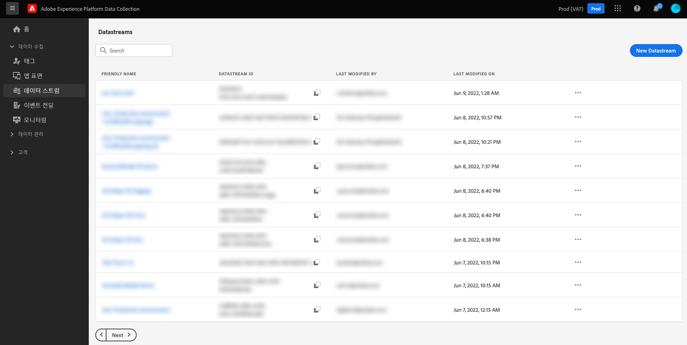

# 데이터스트림 개요

데이터스트림은 Adobe Experience Platform Web 및 Mobile SDK 구현 시 서버측 구성을 나타냅니다. SDK의 [`configure`](/help/web-sdk/commands/configure/overview.md) 명령은 클라이언트에서 처리해야 하는 항목을 제어하는 반면(`edgeDomain` 등), 데이터스트림은 SDK에 대한 다른 모든 구성을 처리합니다. Adobe Experience Platform Edge Network로 요청이 전송되면 `datastreamId`는 데이터스트림을 참조하는 데 사용됩니다. 이를 통해 웹 사이트에서 코드를 변경하지 않고도 서버측 구성을 업데이트할 수 있습니다.

Adobe Experience Platform UI 또는 데이터 수집 UI 내의 왼쪽 탐색 영역에서 **[!UICONTROL 데이터스트림]**&#x200B;을 선택하여 데이터스트림을 만들고 관리할 수 있습니다.

UI에서 데이터스트림을 구성하는 방법에 대한 자세한 내용은 [ 구성 안내서](./configure.md)를 참조하십시오.

## 데이터스트림의 민감한 데이터 처리 {#sensitive}

>[!IMPORTANT]
>
>이 문서의 콘텐츠는 법률적인 조언이 아니며, 법률적인 조언을 대체하지 않습니다. 민감한 데이터의 처리에 대한 자세한 내용은 회사의 법무 부서에 문의하십시오.

기업 데이터 관리 정책 및 규제 요구 사항으로 인해 민감한 고객 데이터의 수집, 처리 및 사용 방법에 대한 제한 사항이 늘고 있습니다. 여기에는 건강 보험 이동성 및 책임법(HIPAA)과 같은 규정에 적용되는 개인건강정보(PHI)의 수집, 처리 및 사용이 포함됩니다.

데이터스트림은 민감한 데이터를 안전하게 처리할 수 있는 세 가지 방법을 제공합니다.

* [향상된 암호화](#encryption)
* [데이터 거버넌스](#governance)
* [감사 로그](#audit-logs)

### 향상된 암호화 {#encryption}

Edge Network를 통해 전송 중인 모든 데이터는 [HTTPS TLS 1.2](https://datatracker.ietf.org/doc/html/rfc5246)를 사용하여 암호화된 보안 연결을 통해 제공됩니다. 데이터스트림이 데이터를 Experience Platform으로 가져올 경우 데이터는 Experience Platform 데이터 레이크에서 사용하지 않을 때 암호화됩니다. 자세한 내용은 [Experience Platform의 데이터 암호화](../landing/governance-privacy-security/encryption.md)에 대한 문서를 참조하십시오.

### 데이터 거버넌스 {#governance}

데이터스트림은 Experience Platform 기본 제공 데이터 거버넌스 기능을 사용하여 중요한 데이터가 비 HIPAA 지원 서비스로 전송되지 않도록 합니다. 데이터스트림 스키마의 민감한 데이터에 포함된 특정 필드 레이블을 지정하여 특정 용도에 사용할 수 있는 데이터 필드를 세밀하게 제어할 수 있습니다.

다음 비디오는 UI에서 데이터스트림의 데이터 사용 제한이 구성 및 적용되는 방법에 대한 간략한 개요를 제공합니다.

>[!VIDEO](https://video.tv.adobe.com/v/3409588/?quality=12&learn=on&speedcontrol=on)

조직에서 민감하다고 판단되는 스키마와 필드에 Experience Platform의 [민감한 데이터 사용 레이블](../data-governance/labels/reference.md#sensitive)을 적용할 수 있습니다. 예를 들어 `RHD` 레이블은 개인건강정보(PHI)를 나타내는 데 사용되고 `S1` 레이블은 지리적 위치 데이터를 나타냅니다.

>[!NOTE]
>
>Experience Platform UI 또는 데이터 수집 UI의 [!UICONTROL 스키마] 탭에서 데이터 사용 레이블을 적용하는 방법에 대한 자세한 내용은 [스키마 레이블 지정 튜토리얼](../xdm/tutorials/labels.md)을 참조하십시오.

데이터스트림을 생성할 때 선택한 스키마에 중요한 데이터 사용 레이블이 포함된 경우 해당 데이터를 HIPAA 준비 대상으로 보내도록 데이터스트림만 구성할 수 있습니다. 현재 데이터스트림에서 지원하는 유일한 HIPAA 지원 대상은 Adobe Experience Platform입니다. Adobe Target, Adobe Analytics, Adobe Audience Manager, 이벤트 전달 및 에지 대상 등 기타 대상 서비스는 민감한 데이터 사용 레이블이 포함된 데이터스트림에 대해 비활성화되어 있습니다.

HIPAA 지원 서비스가 아닌 기존 데이터스트림에서 스키마를 사용 중인 경우 민감한 데이터 사용 레이블을 스키마에 추가하게 되면 정책 위반 메시지가 표시되고 작업이 차단됩니다. 이 메시지는 위반을 트리거한 데이터 스트림을 지정하고 문제를 해결하기 위해 데이터 스트림에서 비 HIPAA 준비 서비스를 제거하도록 제안합니다.

### 감사 로그

Experience Platform에서 감사 로그 형식으로 데이터스트림 활동을 모니터링할 수 있습니다. 감사 로그는 **누가**&#x200B;에서 **무엇을** 작업하고 **언제**&#x200B;을(를) 수행했으며, 데이터 스트림과 관련된 문제를 해결하는 데 도움이 되는 다른 상황별 데이터와 함께 귀사에서 기업 데이터 관리 정책 및 규제 요구 사항을 준수하도록 도와줍니다.

사용자가 데이터스트림을 생성하고 업데이트하거나 삭제할 때마다 감사 로그를 생성하여 작업을 기록합니다. 사용자가 [데이터 수집을 위한 데이터 준비](./data-prep.md)를 통해 매핑을 생성하고 업데이트하거나 삭제할 때도 마찬가지입니다. 데이터스트림 또는 매핑이 업데이트되었는지 여부와 상관없이 결과 감사 로그는 [!UICONTROL 데이터스트림] 리소스 유형으로 분류됩니다.

데이터스트림 및 다른 지원되는 서비스에서 로그를 해석하는 방법에 대한 자세한 내용은 [감사 로그](../landing/governance-privacy-security/audit-logs/overview.md)에 관한 설명서를 참조하십시오.

## 다음 단계

이 안내서에서는 데이터스트림 및 데이터 수집에서의 사용과 민감한 데이터 처리에 대한 높은 수준의 개요를 제공했습니다. 새 데이터스트림을 설정하는 방법에 대한 단계는 [ 데이터스트림 구성 안내서](./configure.md)를 참조하십시오.
