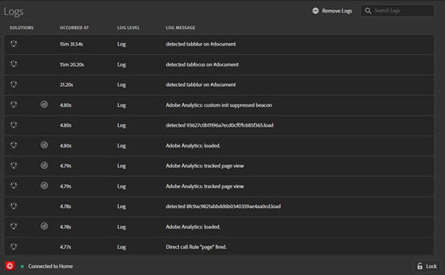

# 로그 탭

**로그** 탭에서는 태그 및 Adobe Experience Platform Web SDK 구현에 대한 정보를 제공합니다. 관련된 도구를 통해 구현된 솔루션별로 필터링할 수 있습니다.

Logs 탭에는 다음 네 가지 열에 정보가 표시됩니다.

**[!UICONTROL 솔루션]:** 로그된 항목의 영향을 받는 Experience Cloud 솔루션의 아이콘을 표시합니다. 아이콘 위로 마우스 커서를 이동하면 텍스트 설명이 표시됩니다.

**[!UICONTROL 다음 시간에 발생]:** 로그된 문제가 세션 중 언제 발생했는지 표시합니다.

**[!UICONTROL 로그 수준]:**&#x200B;은(는) 문제 심각도를 표시합니다. 심각도는 다음 수준 중 하나입니다.

* 로그
* 정보
* 경고
* 오류

**[!UICONTROL 로그 메시지]:**&#x200B;에서 문제를 설명합니다.

일부 로그 메시지에는 코드 표시 선택 사항이 포함됩니다. 규칙 실행 여부를 결정하는 조건부 코드를 보려면 **[!UICONTROL 코드 표시]**&#x200B;를 선택하십시오.

로그를 지우려면 **[!UICONTROL 로그 제거]**&#x200B;를 선택하십시오.
