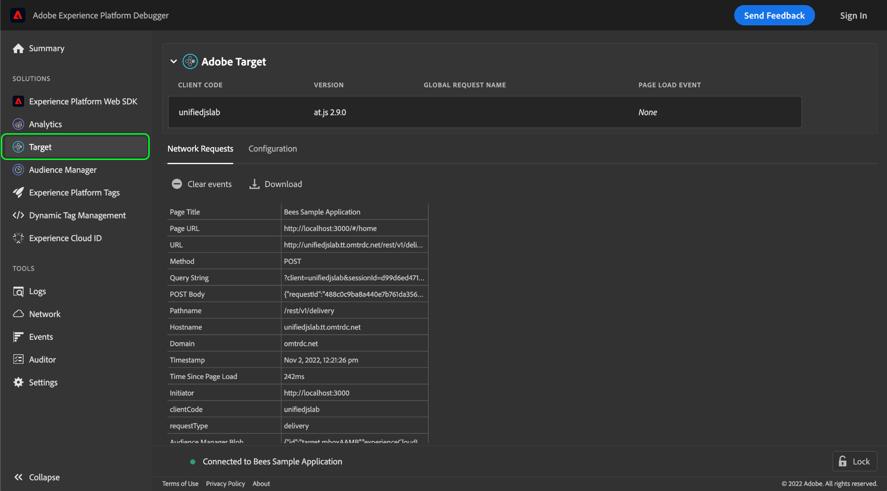

# Adobe Experience Platform Debugger을 사용하여 Adobe Target 구현 테스트

Adobe Experience Platform Debugger은 Adobe Target 구현과 함께 개발된 웹 사이트를 테스트하고 디버깅하는 데 유용한 도구 모음을 제공합니다. 이 안내서에서는 Target을 사용할 수 있는 웹 사이트에서 Experience Platform Debugger를 사용하기 위한 몇 가지 일반적인 워크플로우 및 모범 사례를 다룹니다.

## 전제 조건

Target용 Experience Platform Debugger를 사용하려면 웹 사이트에서 [at.js 라이브러리](https://developer.adobe.com/target/implement/client-side/atjs/how-atjs-works/) 버전 1.x 이상을 사용해야 합니다. 이전 버전은 지원되지 않습니다.

## Experience Platform 디버거 초기화 중

브라우저에서 테스트할 웹 사이트를 연 다음 Experience Platform Debugger 확장을 엽니다.

왼쪽 탐색에서 **[!DNL Target]**&#x200B;을(를) 선택합니다. Experience Platform Debugger가 사이트에서 호환되는 at.js 버전이 실행 중임을 감지하면 Adobe Target 구현 세부 사항이 표시됩니다.

## 전역 구성 정보

구현의 전역 구성에 대한 정보는 Experience Platform Debugger의 Target 보기 맨 위에 표시됩니다.

| 이름 | 설명 |
| --- | --- |
| 클라이언트 코드 | 조직을 식별하는 고유 ID입니다. |
| 버전 | 현재 웹 사이트에 설치된 Adobe Target 라이브러리의 버전입니다. |
| 전역 요청 이름 | Target 구현의 [글로벌 mbox](https://developer.adobe.com/target/implement/client-side/atjs/global-mbox/global-mbox-overview/?) 이름입니다. 기본 이름은 `target-global-mbox`입니다. |
| 페이지 로드 이벤트 | [페이지 로드 이벤트](https://developer.adobe.com/target/implement/client-side/atjs/how-atjs-works/how-atjs-works/#atjs-2x-diagrams)가 발생했는지 여부를 나타내는 부울 값입니다. 페이지 로드 이벤트는 at.js 2.x에 대해서만 지원됩니다. 호환되지 않는 버전의 경우 이 값은 기본적으로 `None`입니다. |

{style="table-layout:auto"}

## [!DNL Network Requests] {#network}

페이지에서 수행된 각 네트워크 요청에 대한 요약 정보를 보려면 **[!DNL Network Requests]**&#x200B;을(를) 선택하십시오.

![Experience Platform Debugger 내에서 선택한 대상에 대한 [!DNL Network Requests] 섹션](../images/solutions/target/network-requests.png)

페이지에서 작업(페이지 다시 로드 포함)을 수행하면 새 열이 표에 자동으로 추가되므로 작업의 시퀀스와 각 요청 간 값이 변경되는 방법을 볼 수 있습니다.

![Experience Platform Debugger 내에서 선택한 대상에 대한 [!DNL Network Requests] 섹션](../images/solutions/target/new-request.png)

다음 값이 캡처됩니다.

| 이름 | 설명 |
| --- | --- |
| [!DNL Page Title] | 이 요청을 시작한 페이지의 제목입니다. |
| [!DNL Page URL] | 요청을 시작한 페이지의 URL입니다. |
| [!DNL URL] | 요청의 원시 URL. |
| [!DNL Method] | 요청에 대한 HTTP 메서드. |
| [!DNL Query String] | URL에서 가져온 요청의 쿼리 문자열입니다. |
| [!DNL POST Body] | 요청 본문(POST 요청에 대해서만 설정됨). |
| [!DNL Pathname] | 요청 URL의 경로 이름입니다. |
| [!DNL Hostname] | 요청 URL의 호스트 이름입니다. |
| [!DNL Domain] | 요청 URL의 도메인입니다. |
| [!DNL Timestamp] | 브라우저의 시간대 내에서 요청(또는 이벤트)이 발생한 시점의 타임스탬프입니다. |
| [!DNL Time Since Page Load] | 요청 시 페이지가 처음 로드된 이후 경과된 시간입니다. |
| [!DNL Initiator] | 요청 개시자입니다. 즉, 누가 요청을 했는가? |
| [!DNL clientCode] | Target에서 인식하는 조직 계정의 식별자입니다. |
| [!DNL requestType] | 요청에 사용된 API입니다. at.js 1.x를 사용하는 경우 값은 `/json`입니다. at.js 2.x를 사용하는 경우 값은 `delivery`입니다. |
| [!DNL Audience Manager Blob] | &quot;blob&quot;이라고도 하는 암호화된 Audience Manager 메타데이터에 대한 정보를 제공합니다. |
| [!DNL Audience Location Hint] | 데이터 수집 지역 ID. 특정 ID 서비스 데이터 센터의 지리적 위치에 대한 숫자 식별자입니다. 자세한 내용은 [DCS 지역 ID, 위치 및 호스트 이름](https://experienceleague.adobe.com/docs/audience-manager/user-guide/api-and-sdk-code/dcs/dcs-api-reference/dcs-regions.html?lang=ko-KR)에 대한 Audience Manager 설명서 및 [`getLocationHint`](https://experienceleague.adobe.com/docs/id-service/using/id-service-api/methods/getlocationhint.html?lang=ko#reference-a761030ff06c4439946bb56febf42d4c)에 대한 Experience Cloud Identity 서비스 안내서를 참조하십시오. |
| [!DNL Browser Height] | 브라우저 높이(픽셀 단위)입니다. |
| [!DNL Browser Time Offset] | 시간대와 연결된 브라우저의 시간 오프셋입니다. |
| [!DNL Browser Width] | 브라우저 너비(픽셀 단위)입니다. |
| [!DNL Color Depth] | 화면의 색상 깊이입니다. |
| [!DNL context] | 화면 차원 및 클라이언트 플랫폼을 포함하여 요청을 하는 데 사용되는 브라우저에 대한 컨텍스트 정보가 포함된 객체입니다. |
| [!DNL prefetch] | `prefetch` 처리 도중에에 사용되는 매개 변수입니다. |
| [!DNL execute] | `execute` 처리 중에 사용되는 매개 변수입니다. |
| [!DNL Experience Cloud Visitor ID] | 검색되면 은 현재 사이트 방문자에게 할당된 [Experience Cloud ID(ECID)](https://experienceleague.adobe.com/docs/id-service/using/intro/overview.html?lang=ko-KR)에 대한 정보를 제공합니다. |
| [!DNL experienceCloud] | A4T [보조 데이터 ID](https://experienceleague.adobe.com/docs/target/using/integrate/a4t/before-implement.html?lang=ko&#section_2C1F745A2B7D41FE9E30915539226E3A) 및 [방문자 ID(ECID)](https://experienceleague.adobe.com/docs/id-service/using/intro/overview.html?lang=ko-KR)와 같은 특정 사용자 세션의 Experience Cloud ID를 보유합니다. |
| [!DNL id] | 방문자에 대한 [대상 ID](https://developers.adobetarget.com/api/delivery-api/#section/Identifying-Visitors/Target-ID)입니다. |
| [!DNL Mbox Host] | Target 요청이 수행된 [host](https://experienceleague.adobe.com/docs/target/using/administer/hosts.html?lang=ko). |
| [!DNL Mbox PC] | [`mbox`](https://developer.adobe.com/target/implement/client-side/atjs/global-mbox/global-mbox-overview/) 세션 ID 및 [Adobe Target Edge](https://experienceleague.adobe.com/docs/target/using/introduction/how-target-works.html?lang=ko#concept_0AE2ED8E9DE64288A8B30FCBF1040934) 위치 힌트를 캡슐화하는 문자열입니다. 이 값은 at.js에서 세션 및 Edge 위치가 고정된 상태를 유지하도록 하는 데 사용됩니다. |
| [!DNL Mbox Referrer] | 특정 [`mbox`](https://developer.adobe.com/target/implement/client-side/atjs/global-mbox/global-mbox-overview/) 요청에 대한 URL 레퍼러입니다. |
| [!DNL Mbox URL] | [`mbox`](https://developer.adobe.com/target/implement/client-side/atjs/global-mbox/global-mbox-overview/) 서버의 URL. |
| [!DNL Mbox Version] | 사용 중인 [`mbox`](https://developer.adobe.com/target/implement/client-side/atjs/global-mbox/global-mbox-overview/) 버전입니다. |
| [!DNL mbox3rdPartyId] | 현재 방문자에게 할당된 [`mbox3rdPartyId`](https://experienceleague.adobe.com/docs/target/using/audiences/visitor-profiles/3rd-party-id.html?lang=ko)입니다. |
| [!DNL mboxRid] | [`mbox`](https://developer.adobe.com/target/implement/client-side/atjs/global-mbox/global-mbox-overview/) 요청 ID. |
| [!DNL requestId] | 요청에 대한 고유 ID. |
| [!DNL Screen Height] | 화면의 픽셀 단위 높이입니다. |
| [!DNL Screen Width] | 화면의 픽셀 단위 폭입니다. |
| [!DNL Supplemental Data ID] | 방문자를 해당 Adobe Target 및 Adobe Analytics 호출과 일치시키는 데 사용되는 시스템 생성 ID입니다. 자세한 내용은 [A4T 문제 해결 안내서](https://experienceleague.adobe.com/docs/target/using/integrate/a4t/troubleshoot-a4t/a4t-troubleshooting.html?lang=ko&#section_75002584FA63456D8D9086172925DD8D)를 참조하십시오. |
| [!DNL vst] | [Experience Cloud ID 서비스 API 구성](https://experienceleague.adobe.com/docs/id-service/using/id-service-api/configurations/function-vars.html?lang=ko). |
| [!DNL webGLRenderer] | 페이지에서 사용되는 WebGL 렌더러에 대한 정보를 제공합니다(해당하는 경우). |

{style="table-layout:auto"}

특정 네트워크 이벤트에 대한 매개변수의 세부 정보를 보려면 해당 테이블 셀을 선택합니다. 설명 및 해당 값을 포함하여 매개 변수에 대한 추가 정보를 제공하는 팝오버가 나타납니다. 값이 JSON 객체인 경우 대화 상자에 객체 구조에 대한 탐색 가능한 보기가 포함됩니다.

![Experience Platform Debugger 내에서 선택한 대상에 대한 [!DNL Network Requests] 섹션](../images/solutions/target/request-param-details.png)

## [!DNL Configuration]

Target에 대한 추가 디버깅 도구 선택을 활성화하거나 비활성화하려면 **[!DNL Configuration]**&#x200B;을(를) 선택하십시오.

![Experience Platform Debugger 내에서 선택한 대상에 대한 [!DNL Configuration Requests] 섹션](../images/solutions/target/configuration.png)

| 디버깅 도구 | 설명 |
| --- | --- |
| [!DNL Target Console Logging] | 활성화되면 브라우저의 콘솔 탭에서 at.js 로그에 액세스할 수 있습니다. 이 기능은 `mboxDebug` 쿼리 매개 변수(모든 값 포함)를 브라우저 URL에 추가하여 활성화할 수도 있습니다. |
| [!DNL Target Disable] | 활성화되면 페이지에서 모든 Target 기능이 비활성화됩니다. 이를 사용하여 Target 특정 오퍼가 페이지에서 문제를 일으키는지 확인할 수 있습니다. |
| [!DNL Target Trace] | **참고**: 이 기능을 사용하려면 로그인해야 합니다.  활성화하면 모든 퀘스트와 함께 추적 토큰이 전송되고 각 응답에서 추적 개체가 반환됩니다. `at.js`이(가) 응답 `window.__targetTraces`을(를) 구문 분석합니다. 각 추적 개체에는 다음과 같은 추가 정보가 있는 [[!DNL Network Requests] 탭]과 동일한 정보가 포함되어 있습니다.<ul><li>요청 전후의 속성을 볼 수 있는 프로필 스냅숏입니다.</li><li>현재 프로필이 특정 활동에 적합하지 않거나 자격이 없는 이유를 보여 주는 [활동](https://experienceleague.adobe.com/docs/target/using/activities/target-activities-guide.html?lang=ko)과(와) 일치하고 일치하지 않습니다.<ul><li>이렇게 하면 프로필이 특정 시점에 대해 자격이 있는 대상과 그 이유를 식별하는 데 도움이 될 수 있습니다.</li><li>Target 문서에는 다양한 활동 유형에 대한 자세한 정보가 포함되어 있습니다.</li></ul></li></ul> |

{style="table-layout:auto"}
