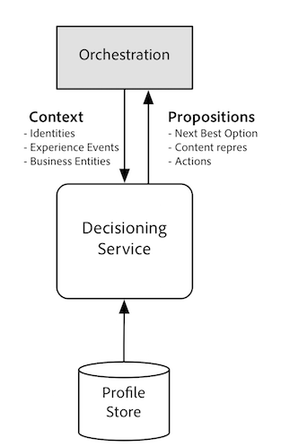
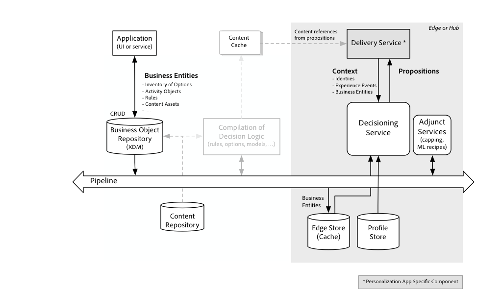

# 의사 결정 서비스 개요

[!DNL Decisioning Service] adobe experience platform에서 실행되는 애플리케이션에서 개인화되고 최적화된 통합 경험을 제작할 수 있는 기능을 제공합니다. 를 [!DNL Decisioning Service]사용하면 사용 가능한 옵션 *세트에서 최상의* 옵션을결정할 수 있습니다. 대체 요소라고도 하는 이러한 옵션은 오퍼, 제품 추천, 웹 경험을 위한 컨텐츠 구성 요소, 대화 스크립트 및 수행할 작업이 될 수 있습니다. 현재 *Offer Decisioning* 의 사용 사례와 도메인이 지원되며, 여기에서 의사 결정 옵션이 오퍼로 모델링되며 더 많은 사용 사례가 제공될 예정입니다.

이를 통해 [!DNL Decisioning Service]고객은 비즈니스 로직을 재사용할 수 있을 뿐만 아니라 다양한 채널과 애플리케이션에서 다양한 옵션 카탈로그를 공유할 수 있습니다. 애플리케이션 내에서 의사 결정 옵션 및 선택 전략을 관리하는 대신, 이제 최종 사용자가 비즈니스 또는 조직과 상호 작용하는 시기와 방법 및 채널에 상관없이 이러한 의사 결정을 활용할 수 있습니다.

의사 결정 전략은 많은 채널과 애플리케이션에서 고객이 갖고 있는 다양한 인터랙션을 고려할 수 있습니다. 예를 들어, 콜센터 애플리케이션 활동은 불만 사항이 발생한 이후 한동안 마케팅 메시지를 활성화 또는 비활성화할 수 있으며 그 메시지 자체는 고객이 게시한 구매 및 검토를 기반으로 할 수 있습니다.

[!DNL Decisioning Service] 진화된 경험 개인화

| 경험 의사 결정 전 | 경험 의사 결정 후 |
| --- | --- |
| 단일 채널 또는 소규모 경험 접점에서 사용자 경험을 개인화하고 최적화할 수 있습니다. | 경험은 상호 작용 간 응답을 조율합니다. |
| 최적화는 최종 사용자의 여정의 단면에 초점이 맞춰집니다 | 의사 결정은 과거에 탐지된 행동에서 최신 상황 상황까지 포괄하는 전체 상호 작용 내역을 기반으로 합니다. |
| 옵션 및 고객 경험 동안 표시할 옵션을 선택하는 전략은 일반적으로 애플리케이션 내부에서 크게 코딩됩니다. | 최적의 옵션을 선택하는 전략은 채널별 애플리케이션 외부에서 정의되고 다시 사용할 수 있게 됩니다. |
| 고객 경험은 웹 페이지에서 체크아웃 횟수를 증가시키거나 담당자와의 상호 작용에 제시된 제안을 수락하는 것과 같이 간단한 목표에 따라 개인화되고 최적화됩니다. | 고객 경험은 고객의 현재 요구 사항을 전체적으로 파악하고 사용자가 가진 모든 경험, 좋거나 나쁜 경험 등에 따라 최적화됩니다. 예를 들어, 최근 제품 또는 서비스에 대해 불만을 제기한 고객에게 마케팅 캠페인이 적합하지 않을 수 있습니다. |

[!DNL Decisioning Service] 경험 개인화 기능을 단일 채널에서 타겟팅하는 것에서 채널 독립적 브랜드에 대한 고객 참여의 라이프사이클의 전반적인 단계를 파악하는 것으로 이동합니다. 라이프사이클 단계는 세그먼트 멤버십보다 훨씬 복잡하며 거의 항상 복잡한 이벤트 스트림, 비즈니스 규칙 및 예측된 속성을 기반으로 합니다.

유사한 사용 사례를 제공하기 위해 제품 및 서비스에서 사용하는 기타 용어:

- 실시간 상호 작용 관리(RTIM)
- 고객 여정 관리
- 옴니채널 마케팅 및 개인화
- 실시간 의사 결정

## 어떻게 [!DNL Decisioning Service] 작동합니까?

고객이 사이트나 모바일 앱 [!DNL Decisioning Service] 과 같은 인바운드 채널을 통해 브랜드에 참여하므로 경험을 실시간으로 맞춤화할 수 있습니다. 의사 결정은 이메일 또는 푸시 알림과 같은 아웃바운드 채널을 통해 메시지를 사용자 지정하는 데에도 사용할 수 있습니다.

결정은 여러 가지 방법으로 할 수 있다. 한 가지 방법은 옵션을 하나만 남겨두거나 옵션을 축소하고 일부 하위 세트가 남아있거나 축소된 세트에서 무작위로 선택될 때까지 연속 옵션을 제거하는 것입니다. 계산된 공식에 따라 우승 옵션을 선택하는 이 접근 방식의 변수입니다. 등급 지정 옵션은 함수를 사용하여 수행됩니다. 오퍼 결정의 경우, 이 함수는 비용, 비즈니스에 대한 오퍼 값을 계산하고 최종 사용자가 오퍼를 수락할 가능성을 사전에 판별하여 사용할 수 있습니다. 결과 점수를 사용하여 오퍼를 주문할 수 있습니다.

또는 이와 함께 유사한 옵션을 제안했던 유사한 고객과의 이전 인터랙션에서 수집된 결과를 바탕으로 전략을 세울 수도 있습니다. 이 전략에서는 우선 순위 값을 계산하는 함수를 학습합니다. 최적의 결과 값은 활동의 목표에 연결되어 있고 예보에 대한 성능 지표는 옵션을 제안한 후 결과가 얼마나 자주 달성되었는가 입니다.

### 의사 결정 전략

의사 결정 전략은 활동이라는 객체를 통해 구성됩니다. 각 의사 결정 전략은 기본적으로 N 옵션 {o1, o2, ...oN}을 입력으로 사용하고 목록의 첫 번째 옵션이 최적화 기준에 따라 가장 좋은 것으로 간주되는 옵션(o1, o2,..oK)의 순서가 지정된 목록을 만드는 알고리즘 또는 함수입니다. 그런 다음 결과 목록의 두 번째 옵션은 두 번째 우수 옵션으로 간주됩니다.

고객 여정 동안 주어진 시간에 주어진 활동에 대한 가장 좋은 옵션은 최신 컨텍스트 변수, 규칙 및 제약 조건에 따라 재평가됩니다. 컨텍스트 변수에는 저장된 레코드가 포함됩니다 [!DNL Real Time Customer Profile]. 중앙 레코드 개체는 고객의 프로필이지만 운영 비즈니스 데이터와 같은 다른 개체는 활동에서도 동일하게 사용할 수 있습니다.

최상위 K 옵션 목록을 만드는 알고리즘이나 함수는 사용 사례에 따라 다릅니다. 해당 알고리즘의 내부 구성 요소는 사용 사례마다 다릅니다. 구성 요소는 디자인 시 저장소에 정의되며 사용 사례별 의사 결정 전략에 대한 지침에 &quot;컴파일됨&quot;합니다.

## Working with [!DNL Decisioning Service]

다른 서비스와 [!DNL Decisioning Service]마찬가지로 API 퍼스트 [!DNL Platform] 철학을 채택합니다. 즉, API는 관리 기능을 포함한 모든 기능이 API를 통해 사용할 수 있는 기본 인터페이스입니다. 또한 다른 [!DNL Platform] 서비스, Adobe 솔루션 및 타사 통합에서 동일한 API를 사용한다는 의미입니다.

간단한 HTTP REST API를 통해 동기 요청 응답 상호 작용 모드 [!DNL Decisioning Service] 에서 사용할 수 있습니다. API 호출은 현재 단일 프로필에 가장 적합한 옵션을 반환합니다. &quot;현재 최선의 옵션&quot; 선택 사항은 지정된 활동이 고려 중인 모든 옵션에 적용된 규칙 및 제한 사항을 기반으로 변경됩니다. REST API를 사용하면 한 번에 여러 활동을 위한 최상의 다음 옵션을 얻을 수 있습니다. 이를 통해 여러 채널에서 옵션을 중재할 수 있습니다. 여러 활동에 대한 응답을 함께 얻으면 추가 규칙이 적용될 수 있습니다.

### 다른 워크플로우와 [!DNL Platform] 통합

개체 사용 [!DNL Decisioning Service] 은 선택 사항이며 개체를 만들고 관리하는 데 필요한 일반적인 단계 외에 몇 단계만 [!DNL Profile] 있으면 됩니다.

>[!NOTE]
>
>이를 최대한 활용하기 위해 [!DNL Real-time Customer Profile]프로필 스토어와 [!DNL Decisioning Service] 직접 통합되어 있습니다. API 호출은 지정된 프로필에 대한 ID 중 하나만 표시해야 합니다.

일반적인 단계 시퀀스는 프로파일 작성부터 시작됩니다.

- 인증 대상 [!DNL Experience Platform].
- 프로필 클래스를 기반으로 스키마를 정의하고 선택적으로 경험 이벤트 클래스를 기반으로 스키마를 정의합니다.
- 레코드 및 시간 시리즈 데이터를 업로드하도록 데이터 세트를 구성합니다 [!DNL Customer Profile].
- 이전 단계 또는 파이프라인을 통해 스트림 인스턴스 데이터에 구성된 데이터 세트를 통해 데이터를 추가합니다.
- 경험 이벤트를 다음으로 스트리밍하여 행동 데이터 [!DNL Platform] 로 프로파일을 강화할 수 있습니다.

또한 다음 단계 [!DNL Decisioning Service]를 사용하십시오.

- 저장소 API를 사용하여 의사 결정 구성 요소를 정의합니다. 의사 결정 전략을 구성하는 비즈니스 논리 업체입니다. 의사 결정 구성 요소는 에서 사용하는 형식으로 자동으로 컴파일됩니다 [!DNL Decision Service Runtime]. 저장소 API는 아래 다이어그램의 왼쪽에 표시됩니다.
- 이전 단계에서 정의된 비즈니스 로직에 따라 최상의 옵션을 얻으려면 런타임 API를 불러옵니다. 아래 다이어그램에서 [!DNL Decision Service Runtime] API는 오른쪽에 나와 있습니다.

비즈니스 논리 엔티티 활성화는 자동으로 지속적으로 이루어집니다. 새 옵션이 저장소에 저장되고 &quot;승인됨&quot;으로 표시되면 사용 가능한 옵션 세트에 포함할 수 있는 후보가 됩니다. 결정 규칙이 업데이트되면 규칙 세트가 다시 어셈블되고 런타임 실행을 위해 준비됩니다. 이 자동 활성화 단계에서는 런타임 컨텍스트에 종속되지 않는 비즈니스 논리로 정의된 모든 제한이 평가됩니다. 이 활성화 단계 결과는 런타임에서 사용할 수 있는 캐시에 [!DNL Decisioning Service] 전송됩니다. 다음 다이어그램에 나와 있습니다.

옵션 세트, 규칙 세트 및 제약 조건이 활성화되고 노드에 푸시되면 간단한 API를 사용하여 의사 결정 요청을 게시합니다. [!DNL Decisioning Service] API는 일반적으로 전달 서비스에서 호출되며, 이 서비스는 제안된 옵션(예: 다음 우수 작업 또는 다음 우수 제안)을 수행하고 경험을 어셈블하거나 작업을 실행합니다. 제안이 오퍼인 경우 해당 오퍼를 나타내는 컨텐츠가 조회되어 최종 사용자에게 전달된 경험에 삽입됩니다. 다음 다이어그램에 나와 있습니다.

[!DNL Delivery Service] 의사 결정 요청에 대한 데이터를 조합합니다. 가장 좋은 옵션이 결정되는 프로필 엔티티의 ID를 결정합니다. 또한 저장되지 [!DNL Customer Profile] 않지만 의사 결정 논리에 사용될 수 있는 모든 컨텍스트 데이터를 취합합니다.

의사 결정 로직은 활동별로 구성되며, 각각은 단일 폴백 옵션과 함께 이 활동에 대해 고려해야 하는 옵션 하위 세트에 대한 필터를 지정합니다.

각 결정은 우선 제한 사항을 적용하여 옵션 수를 줄이고 나머지 옵션의 등급을 매기는 방식으로 이루어집니다. 대부분의 논리는 내부에서 평가되지만, 다양한 [!DNL Decisioning Service]부가서비스 서비스는 이러한 두 가지 측면을 돕기 위해 사용됩니다. 예를 들어, 매핑 서비스는 어떤 결정에서든 옵션을 사용할 수 있는 빈도에 대한 상한선을 관리하고, 다른 서비스는 프로필 및 옵션에 대한 점수를 계산하는 데 사용되는 기계 학습 모델을 호스팅할 수 있습니다.

저장소 API 사용에 대한 자세한 내용은 API를 사용하여 의사 결정 엔티티 및 규칙 [관리에 대한 자습서를 참조하십시오](./tutorials/entities.md)

런타임 사용에 대한 자세한 내용은 [!DNL Decisioning Service] API를 사용하여 의사 결정 서비스 런타임 [작업에 대한 자습서를 참조하십시오](./tutorials/runtime.md)