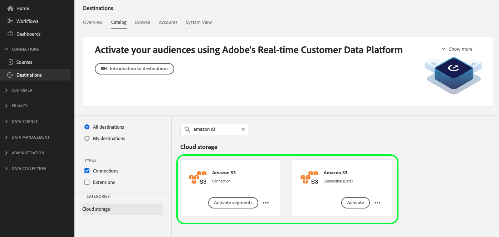

# 클라우드 스토리지 대상에 대한 API 마이그레이션 안내서

>[!IMPORTANT]
>
>* 이 페이지에 설명된 기능은 Real-Time CDP Prime 및 Ultimate 패키지를 구입한 고객이 사용할 수 있습니다. 자세한 내용은 Adobe 담당자에게 문의하십시오.

## 마이그레이션 컨텍스트 {#migration-context}

시작 [2022년 10월](/help/release-notes/2022/october-2022.md#new-or-updated-destinations)를 사용하면 Experience Platform 외부에서 파일을 내보낼 때 새로운 파일 내보내기 기능을 사용하여 향상된 사용자 정의 기능에 액세스할 수 있습니다.

* 추가 [파일 이름 지정 옵션](/help/destinations/ui/activate-batch-profile-destinations.md#file-names).
* 를 통해 내보낸 파일에서 사용자 정의 파일 헤더를 설정하는 기능 [새 매핑 단계](/help/destinations/ui/activate-batch-profile-destinations.md#mapping).
* 을(를) 선택하는 기능 [파일 유형](/help/destinations/ui/connect-destination.md#file-formatting-and-compression-options) 내보낸 파일.
* 다음에 대한 기능: [내보낸 CSV 데이터 파일의 형식 사용자 지정](/help/destinations/ui/batch-destinations-file-formatting-options.md).

이 기능은 아래 나열된 Beta 클라우드 스토리지 카드에서 지원됩니다.

* [[!DNL (Beta) Amazon S3]](../../destinations/catalog/cloud-storage/amazon-s3.md#changelog)
* [[!DNL (Beta) Azure Blob]](../../destinations/catalog/cloud-storage/azure-blob.md#changelog)
* [[!DNL (Beta) SFTP]](../../destinations/catalog/cloud-storage/sftp.md#changelog)

<!--

Commenting out the three net new cloud storage destinations

* [[!DNL (Beta) Azure Data Lake Storage Gen2]](../../destinations/catalog/cloud-storage/adls-gen2.md)
* [[!DNL (Beta) Data Landing Zone]](../../destinations/catalog/cloud-storage/data-landing-zone.md)
* [[!DNL (Beta) Google Cloud Storage]](../../destinations/catalog/cloud-storage/google-cloud-storage.md)

-->

현재 Experience Platform UI에는 세 대상의 두 가지 대상 카드가 나란히 표시됩니다. 아래에 표시된 항목은 [!DNL Amazon S3] 기존 및 새 대상. 모든 경우에, 카드에 **베타** 는 새 대상 카드입니다.



기능이 향상된 이러한 대상은 처음에 베타로 제공되었지만, *이제 Adobe이 모든 Real-Time CDP 고객을 새로운 클라우드 스토리지 대상으로 이동합니다*. 이미 사용 중인 고객 [!DNL Amazon S3], [!DNL Azure Blob]또는 SFTP인 경우 기존 데이터 흐름이 새 카드로 마이그레이션됩니다. 마이그레이션의 일부인 특정 변경 내용에 대한 자세한 내용은 계속 읽어보십시오.

## 이 페이지의 적용 대상 {#who-this-applies-to}

이미 을(를) 사용하고 있는 경우 [플로우 서비스 API](https://developer.adobe.com/experience-platform-apis/references/destinations/) 프로필을 Amazon S3, Azure Blob 또는 SFTP 클라우드 스토리지 대상으로 내보내려면 이 API 마이그레이션 가이드가 적용됩니다.

스크립트를에서 실행 중인 경우 [!DNL Amazon S3], [!DNL Azure Blob]또는 Experience Platform에서 내보낸 파일 위에 있는 SFTP 클라우드 저장소 위치는 매핑 단계와 관련하여 새 카드의 연결 및 흐름 사양과 관련하여 일부 매개 변수가 변경되고 있다는 점에 유의하십시오.

예를 들어 스크립트를 사용하여 의 대상 데이터 흐름을 필터링하는 경우 [!DNL Amazon S3] 대상, 의 연결 사양 기반 [!DNL Amazon S3] 대상: 연결 사양이 변경되므로 필터를 업데이트해야 합니다.

## 관련 설명서 링크 {#relevant-documentation-links}

이 섹션에는 데이터를 클라우드 스토리지 대상으로 내보내는 향상된 기능에 대한 관련 API 튜토리얼 및 참조 설명서가 포함되어 있습니다.

<!--

TBD if we keep this link but will likely remove it

[Legacy API tutorial to export data to cloud storage destinations](/help/destinations/api/connect-activate-batch-destinations.md) (outdated, do not use anymore)

-->
* [대상을 클라우드 스토리지 대상으로 내보내는 API 튜토리얼](/help/destinations/api/activate-segments-file-based-destinations.md)
* [대상 플로우 서비스 API 참조 설명서](https://developer.adobe.com/experience-platform-apis/references/destinations/)

## 이전 버전과 호환 불가능한 변경 사항 요약 {#summary-backwards-incompatible-changes}

새 대상으로 마이그레이션하면 기존의 모든 데이터가에 [!DNL Amazon S3], [!DNL Azure Blob]및 SFTP 대상에는 이제 새 타겟 연결과 기본 연결이 할당됩니다. 프로필 매핑 단계도 변경됩니다. 이전 버전과 호환 불가능한 변경 사항은 각 대상에 대해 아래 섹션에 요약되어 있습니다. 다음 항목도 보기 [대상 용어집](https://developer.adobe.com/experience-platform-apis/references/destinations/#tag/Glossary) 아래 다이어그램의 용어에 대한 자세한 정보입니다.


### 이전 버전과 호환 불가능한 변경 사항 [!DNL Amazon S3] 대상 {#changes-amazon-s3-destination}

API 사용자의 이전 버전과 호환 불가능한 변경 사항이 업데이트되었습니다 `connection spec ID` 및 `flow spec ID` 아래 표에 표시된 대로:

| [!DNL Amazon S3] | 기존 | 신규 |
|---------|----------|---------|
| 흐름 사양 | 71471eba-b620-49e4-90fd-23f1fa0174d8 | 1a0514a6-33d4-4c7f-aff8-594799c47549 |
| 연결 사양 | 4890fc95-5a1f-4983-94bb-e060c08e3f81 | 4fce964d-3f37-408f-9778-e597338a21ee |

에 대한 전체 레거시 및 새 기본 연결 및 대상 연결 예제 보기 [!DNL Amazon S3] 을 참조하십시오. 기본 연결을 만드는 데 필요한 매개 변수 [!DNL Amazon S3] 대상은 변경되지 않습니다.

마찬가지로 타겟 연결을 만드는 데 필요한 매개 변수에는 이전 버전과 호환되지 않는 변경 사항이 없습니다.

>[!BEGINTABS]

>[!TAB 레거시 기본 연결 및 대상 연결]

+++이전 보기 [!DNL base connection] 대상 [!DNL Amazon S3]

```json {line-numbers="true" start-line="1" highlight="5"}
{
  ...
  "name": "amazon-s3",
  "connectionSpec": {
    "id": "4890fc95-5a1f-4983-94bb-e060c08e3f81",
    "version": "1.0"
  },
  "state": "enabled",
  "auth": {
    "specName": "Access Key",
    "params": {
      "authorizedDate": "2022-10-26",
      "s3SecretKey": "<your-secret-key>",
      "s3AccessKey": "<your-access-key>"
    }
  },
  "encryption": {
    "specName": "File Encryption",
    "params": {
      "encryptionAlgo": "PGP/GPG",
      "publicKey": "<publicKey>"
    }
  },
  "version": "\"640418e2-0000-0200-0000-6359b9ef0000\"",
  "etag": "\"640418e2-0000-0200-0000-6359b9ef0000\""
}
```

+++

+++이전 보기 [!DNL target connection] 대상 [!DNL Amazon S3]

```json {line-numbers="true" start-line="1" highlight="12"}
{
  ...
  "name": "test 121",
  "baseConnectionId": "ee86d122-10d3-434b-81c7-7252e4d747a7",
  "state": "enabled",
  "data": {
    "format": "CSV",
    "schema": null,
    "properties": null
  },
  "connectionSpec": {
    "id": "4890fc95-5a1f-4983-94bb-e060c08e3f81",
    "version": "1.0"
  },
  "params": {
    "mode": "S3",
    "path": "testpath",
    "bucketName": "test"
  },
  "version": "\"1609cd86-0000-0200-0000-63892cbb0000\"",
  "etag": "\"1609cd86-0000-0200-0000-63892cbb0000\"",
  "inheritedAttributes": {
    "baseConnection": {
      "id": "ee86d122-10d3-434b-81c7-7252e4d747a7",
      "connectionSpec": {
        "id": "4890fc95-5a1f-4983-94bb-e060c08e3f81",
        "version": "1.0"
      }
    }
  }
}
```

+++

>[!TAB 새 기본 연결 및 대상 연결]

+++새로 보기 [!DNL base connection] 대상 [!DNL Amazon S3]

```json {line-numbers="true" start-line="1" highlight="5"}
{
  ...
  "name": "Amazon S3",
  "connectionSpec": {
    "id": "4fce964d-3f37-408f-9778-e597338a21ee",
    "version": "1.0"
  },
  "state": "enabled",
  "auth": {
    "specName": "Access Key",
    "params": {
      "authorizedDate": "2022-10-26",
      "s3SecretKey": "<your-secret-key>",
      "s3AccessKey": "<your-access-key>"
    }
  },
  "encryption": {
    "specName": "File Encryption",
    "params": {
      "encryptionAlgo": "PGP/GPG",
      "publicKey": "<publicKey>"
    }
  },
  "version": "\"3708da21-0000-0200-0000-638940b10000\"",
  "etag": "\"3708da21-0000-0200-0000-638940b10000\""
}
```

+++

+++새로 보기 [!DNL target connection] 대상 [!DNL Amazon S3]

```json {line-numbers="true" start-line="1" highlight="12, 16-27"}
{
  ...
  "name": "test 121",
  "baseConnectionId": "d114c86f-fd47-4bb6-846c-cb1d15a00fe9",
  "state": "enabled",
  "data": {
    "format": "CSV",
    "schema": null,
    "properties": null
  },
  "connectionSpec": {
    "id": "4fce964d-3f37-408f-9778-e597338a21ee",
    "version": "1.0"
  },
  "params": {
    "csvOptions": {
      "nullValue": "null",
      "emptyValue": "",
      "escape": "\\",
      "quote": "",
      "delimiter": ","
    },
    "compression": "NONE",
    "fileType": "CSV",
    "mode": "Server-to-server",
    "path": "testpath",
    "bucketName": "test"
  },
  "version": "\"1b0985c6-0000-0200-0000-638940b10000\"",
  "etag": "\"1b0985c6-0000-0200-0000-638940b10000\"",
  "inheritedAttributes": {
    "baseConnection": {
      "id": "d114c86f-fd47-4bb6-846c-cb1d15a00fe9",
      "connectionSpec": {
        "id": "4fce964d-3f37-408f-9778-e597338a21ee",
        "version": "1.0"
      }
    }
  }
}
```

+++

>[!ENDTABS]

### 이전 버전과 호환 불가능한 변경 사항 [!DNL Azure Blob] 대상 {#changes-azure-blob-destination}

API 사용자의 이전 버전과 호환 불가능한 변경 사항이 업데이트되었습니다 `connection spec ID` 및 `flow spec ID` 아래 표에 표시된 대로:

| [!DNL Azure Blob] | 기존 | 신규 |
|---------|----------|---------|
| 흐름 사양 | 71471eba-b620-49e4-90fd-23f1fa0174d8 | 752d422f-b16f-4f0d-b1c6-26e448e3b388 |
| 연결 사양 | e258278b-a4cf-43ac-b158-4fa0ca0d948b | 6d6b59bf-fb58-4107-9064-4d246c0e5bb2 |

에 대한 전체 레거시 및 새 기본 연결 및 대상 연결 예제 보기 [!DNL Azure Blob] 을 참조하십시오. Azure Blob 대상에 대한 기본 연결을 만드는 데 필요한 매개 변수가 변경되지 않습니다.

마찬가지로 타겟 연결을 만드는 데 필요한 매개 변수에는 이전 버전과 호환되지 않는 변경 사항이 없습니다.

>[!BEGINTABS]

>[!TAB 레거시 기본 연결 및 대상 연결]

+++이전 보기 [!DNL base connection] 대상 [!DNL Azure Blob]

```json {line-numbers="true" start-line="1" highlight="5"}
{
  ...
  "name": "azure-blob",
  "connectionSpec": {
    "id": "e258278b-a4cf-43ac-b158-4fa0ca0d948b",
    "version": "1.0"
  },
  "state": "enabled",
  "auth": {
    "specName": "ConnectionString",
    "params": {
      "authorizedDate": "2022-06-02",
      "connectionString": "<your-connection-string>"
    }
  },
  "encryption": {
    "specName": "File Encryption",
    "params": {
      "encryptionAlgo": "PGP/GPG",
      "publicKey": "<publicKey>"
    }
  }, 
  "version": "\"d000d23c-0000-0200-0000-6299051c0000\"",
  "etag": "\"d000d23c-0000-0200-0000-6299051c0000\""
}
```

+++

+++이전 보기 [!DNL target connection] 대상 [!DNL Azure Blob]

```json {line-numbers="true" start-line="1" highlight="13"}
{
  ...
  "name": "v1",
  "description": "v2",
  "baseConnectionId": "d10fcecf-9963-4062-820c-0f878be98805",
  "state": "enabled",
  "data": {
    "format": "CSV",
    "schema": null,
    "properties": null
  },
  "connectionSpec": {
    "id": "e258278b-a4cf-43ac-b158-4fa0ca0d948b",
    "version": "1.0"
  },
  "params": {
    "mode": "AZURE_BLOB",
    "container": "usdasda",
    "path": "v3"
  },
  "version": "\"cb0468ba-0000-0200-0000-631ab0790000\"",
  "etag": "\"cb0468ba-0000-0200-0000-631ab0790000\"",
  "inheritedAttributes": {
    "baseConnection": {
      "id": "d10fcecf-9963-4062-820c-0f878be98805",
      "connectionSpec": {
        "id": "e258278b-a4cf-43ac-b158-4fa0ca0d948b",
        "version": "1.0"
      }
    }
  }
}
```

+++

>[!TAB 새 기본 연결 및 대상 연결]

+++새로 보기 [!DNL base connection] 대상 [!DNL Azure Blob]

```json {line-numbers="true" start-line="1" highlight="5"}
{
  ...
  "name": "Azure Blob Storage",
  "connectionSpec": {
    "id": "6d6b59bf-fb58-4107-9064-4d246c0e5bb2",
    "version": "1.0"
  },
  "state": "enabled",
  "auth": {
    "specName": "ConnectionString",
    "params": {
      "authorizedDate": "2022-06-02",      
      "connectionString": "<your-connection-string>"
    }
  },
  "encryption": {
    "specName": "File Encryption",
    "params": {
      "encryptionAlgo": "PGP/GPG",
      "publicKey": "<publicKey>"
    }
  },
  "version": "\"4008a892-0000-0200-0000-6389890d0000\"",
  "etag": "\"4008a892-0000-0200-0000-6389890d0000\""
}
```

+++

+++새로 보기 [!DNL target connection] 대상 [!DNL Azure Blob]

```json {line-numbers="true" start-line="1" highlight="13, 17-25"}
{
  ...
  "name": "v1",
  "description": "v2",
  "baseConnectionId": "1329d183-a3ee-4454-ab3f-e2388082bf29",
  "state": "enabled",
  "data": {
    "format": "CSV",
    "schema": null,
    "properties": null
  },
  "connectionSpec": {
    "id": "6d6b59bf-fb58-4107-9064-4d246c0e5bb2",
    "version": "1.0"
  },
  "params": {
    "csvOptions": {
      "nullValue": "null",
      "emptyValue": "",
      "escape": "\\",
      "quote": "",
      "delimiter": ","
    },
    "compression": "NONE",
    "fileType": "CSV",
    "mode": "Server-to-server",
    "container": "usdasda",
    "path": "v3"
  },
  "version": "\"5509fe3f-0000-0200-0000-638a28880000\"",
  "etag": "\"5509fe3f-0000-0200-0000-638a28880000\"",
  "inheritedAttributes": {
    "baseConnection": {
      "id": "1329d183-a3ee-4454-ab3f-e2388082bf29",
      "connectionSpec": {
        "id": "6d6b59bf-fb58-4107-9064-4d246c0e5bb2",
        "version": "1.0"
      }
    }
  }
}
```

+++

>[!ENDTABS]

### SFTP 대상에 대한 이전 버전과 호환 불가능한 변경 사항 {#changes-sftp-destination}

API 사용자의 이전 버전과 호환 불가능한 변경 사항이 업데이트되었습니다 `connection spec ID` 및 `flow spec ID` 아래 표에 표시된 대로:

| SFTP | 기존 | 신규 |
|---------|----------|---------|
| 흐름 사양 | 71471eba-b620-49e4-90fd-23f1fa0174d8 | fd36aaa4-bf2b-43fb-9387-43785eeeb799 |
| 연결 사양 | 64ef4b8b-a6e0-41b5-9677-3805d1ee5dd0 | 36965a81-b1c6-401b-99f8-22508f1e6a26 |

위의 업데이트된 흐름 및 연결 사양 외에 SFTP 기본 연결을 만들 때 필요한 매개 변수에 대한 변경 사항이 있습니다.

* 이전에는 SFTP 대상에 대한 기본 연결에 `host` 매개 변수. 이제 이 매개 변수의 이름이 (으)로 변경되었습니다. `domain`.

SFTP에 대한 전체 기존 및 새 기본 연결 및 대상 연결 예를 아래 탭에서 보고, 변경되는 줄이 강조 표시됩니다. SFTP 대상에 대한 대상 연결을 만드는 데 필요한 매개 변수는 변경되지 않습니다.

>[!BEGINTABS]

>[!TAB 레거시 기본 연결 및 대상 연결]

+++이전 보기 [!DNL base connection] SFTP용 - 암호 인증

```json {line-numbers="true" start-line="1" highlight="5,15"}
{
  ...
  "name": "sftp",
  "connectionSpec": {
    "id": "64ef4b8b-a6e0-41b5-9677-3805d1ee5dd0",
    "version": "1.0"
  },
  "state": "enabled",
  "auth": {
    "specName": "Basic Authentication for sftp",
    "params": {
      "authorizedDate": "2022-06-02",
      "password": "<your-password>",
      "userName": "DPID12345",
      "host": "ftp-out.demdex.com"
    }
  },
  "encryption": {
    "specName": "File Encryption",
    "params": {
      "encryptionAlgo": "PGP/GPG",
      "publicKey": "<publicKey>"
    }
  },
  "version": "\"d000013c-0000-0200-0000-629903bd0000\"",
  "etag": "\"d000013c-0000-0200-0000-629903bd0000\""
}
```

+++

+++이전 보기 [!DNL base connection] 대상 [!DNL SFTP - SSH key] 인증

```json {line-numbers="true" start-line="1" highlight="5,15"}
{
  ...
  "name": "sftp",
  "connectionSpec": {
    "id": "64ef4b8b-a6e0-41b5-9677-3805d1ee5dd0",
    "version": "1.0"
  },
  "state": "enabled",
  "auth": {
    "specName": "Basic Authentication for sftp",
    "params": {
      "authorizedDate": "2022-06-02",
      "sshKey": "<your-ssh-key>",
      "userName": "DPID12345",
      "port": 22
      "domain": "ftp-out.demdex.com"
    }
  },
  "encryption": {
    "specName": "File Encryption",
    "params": {
      "encryptionAlgo": "PGP/GPG",
      "publicKey": "<publicKey>"
    }
  },
  "version": "\"d000013c-0000-0200-0000-629903bd0000\"",
  "etag": "\"d000013c-0000-0200-0000-629903bd0000\""
}
```

+++

+++이전 보기 [!DNL target connection] SFTP용

```json {line-numbers="true" start-line="1" highlight="13"}
{
  ...
  "name": "test sftp 6/2",
  "description": "",
  "baseConnectionId": "e6f3a300-0bf7-4755-b7f8-308dc2a99133",
  "state": "enabled",
  "data": {
    "format": "CSV",
    "schema": null,
    "properties": null
  },
  "connectionSpec": {
    "id": "64ef4b8b-a6e0-41b5-9677-3805d1ee5dd0",
    "version": "1.0"
  },
  "params": {
    "mode": "FTP",
    "remotePath": "test"
  },
  "version": "\"8503ab91-0000-0200-0000-629903ce0000\"",
  "etag": "\"8503ab91-0000-0200-0000-629903ce0000\"",
  "inheritedAttributes": {
    "baseConnection": {
      "id": "e6f3a300-0bf7-4755-b7f8-308dc2a99133",
      "connectionSpec": {
        "id": "64ef4b8b-a6e0-41b5-9677-3805d1ee5dd0",
        "version": "1.0"
      }
    }
  }
}
```

+++

>[!TAB 새 기본 연결 및 대상 연결]

+++새로 보기 [!DNL base connection] 대상 [!DNL SFTP - password authentication]

```json {line-numbers="true" start-line="1" highlight="5"}
{
  ...
  "name": "SFTP",
  "connectionSpec": {
    "id": "36965a81-b1c6-401b-99f8-22508f1e6a26",
    "version": "1.0"
  },
  "state": "enabled",
  "auth": {
    "specName": "SFTP with Password",
    "params": {
      "authorizedDate": "2022-06-02",
      "domain": "ftp-out.demdex.com",
      "username": "DPID12345",
      "password": "<your-password>",
      "port": 22      
    }
  },
  "encryption": {
    "specName": "File Encryption",
    "params": {
      "encryptionAlgo": "PGP/GPG",
      "publicKey": "<publicKey>"
    }
  },
  "version": "\"420826cc-0000-0200-0000-638999a60000\"",
  "etag": "\"420826cc-0000-0200-0000-638999a60000\""
}
```

+++

+++새로 보기 [!DNL base connection] 대상 [!DNL SFTP - SSH key] 인증

```json {line-numbers="true" start-line="1" highlight="5,12"}
{
  ...
  "name": "SFTP",
  "connectionSpec": {
    "id": "36965a81-b1c6-401b-99f8-22508f1e6a26",
    "version": "1.0"
  },
  "state": "enabled",
  "auth": {
    "specName": "Basic Authentication for sftp",
    "params": {
      "authorizedDate": "2022-06-02",
      "domain": "ftp-out.demdex.com",
      "username": "DPID12345",
      "sshKey": "<your-ssh-key>",
    }
  },
  "encryption": {
    "specName": "File Encryption",
    "params": {
      "encryptionAlgo": "PGP/GPG",
      "publicKey": "<publicKey>"
    }
  },
  "version": "\"420826cc-0000-0200-0000-638999a60000\"",
  "etag": "\"420826cc-0000-0200-0000-638999a60000\""
}
```

+++

+++새로 보기 [!DNL target connection] SFTP용

```json {line-numbers="true" start-line="1" highlight="13, 17-25"}
{
  ...
  "name": "test sftp 6/2",
  "description": "",
  "baseConnectionId": "af63fbe1-45ff-4722-a9de-fbbe789dc7b0",
  "state": "enabled",
  "data": {
    "format": "CSV",
    "schema": null,
    "properties": null
  },
  "connectionSpec": {
    "id": "36965a81-b1c6-401b-99f8-22508f1e6a26",
    "version": "1.0"
  },
  "params": {
    "csvOptions": {
      "nullValue": "null",
      "emptyValue": "",
      "escape": "\\",
      "quote": "",
      "delimiter": ","
    },
    "compression": "NONE",
    "fileType": "CSV",
    "mode": "FTP",
    "remotePath": "test"
  },
  "version": "\"5509b5cf-0000-0200-0000-638a2ab60000\"",
  "etag": "\"5509b5cf-0000-0200-0000-638a2ab60000\"",
  "inheritedAttributes": {
    "baseConnection": {
      "id": "af63fbe1-45ff-4722-a9de-fbbe789dc7b0",
      "connectionSpec": {
        "id": "36965a81-b1c6-401b-99f8-22508f1e6a26",
        "version": "1.0"
      }
    }
  }
}
```

+++

>[!ENDTABS]

### 다음에 공통되는 이전 버전과 호환 불가능한 변경 사항 [!DNL Amazon S3], [!DNL Azure Blob]및 SFTP 대상 {#changes-all-destinations}

세 대상 모두 의 프로필 선택기 단계는 매핑 단계로 대체되며, 필요한 경우 내보낸 파일의 열 헤더 이름을 변경할 수 있습니다. 이전 속성 선택기 단계 왼쪽과 새 매핑 단계 오른쪽이 있는 아래 나란히 표시되는 이미지를 참조하십시오.


다음 방법에 주목하십시오. `profileSelectors` 기존 예제의 오브젝트가 새 오브젝트로 대체됩니다. `profileMapping` 개체.

설정에 대한 전체 정보 찾기 `profileMapping` 의 오브젝트 [데이터를 클라우드 스토리지 대상으로 내보내는 API 튜토리얼](/help/destinations/api/activate-segments-file-based-destinations.md#attribute-and-identity-mapping).

>[!BEGINTABS]

>[!TAB 이전 변형 매개 변수]

+++이전 변형 매개 변수의 예 보기

```json{line-numbers="true" start-line="1" highlight="4-40, 45-53"}
{
  "segmentSelectors": { // shortened for brevity since nothing changes in the audience selectors
  },  
  "profileSelectors": {
    "selectors": [
      {
        "type": "JSON_PATH",
        "value": {
          "path": "CORE",
          "operator": "EXISTS",
          "mapping": {
            "sourceType": "text/x.schema-path",
            "source": "CORE",
            "destination": "CORE",
            "identity": false,
            "primaryIdentity": false,
            "functionVersion": 0,
            "sourceAttribute": "CORE",
            "destinationXdmPath": "CORE"
          },
          "identity": {
            "namespace": "CORE"
          }
        }
      },
      ...
      {
        "type": "JSON_PATH",
        "value": {
          "path": "segmentMembership.status",
          "operator": "EXISTS",
          "mapping": {
            "sourceType": "text/x.schema-path",
            "source": "segmentMembership.status",
            "destination": "segmentMembership.status",
            "identity": false,
            "primaryIdentity": false,
            "functionVersion": 0,
            "sourceAttribute": "segmentMembership.status",
            "destinationXdmPath": "segmentMembership.status"
          }
        }
      }
    ],
    "mandatoryFields": [
      "CORE",
      "person.name.lastName",
      "personalEmail.address"
    ],
    "primaryFields": [
      {
        "identityNamespace": "CORE",
        "fieldType": "IDENTITY"
      }
    ]
  }
}
```

+++

>[!TAB 새로운 변형 매개 변수]

+++마이그레이션 후 변형 매개 변수의 예 보기

아래 구성 예제에서 확인할 수 있는 방법 `profileSelectors` 필드가 (으)로 대체됨 `profileMapping` 개체.

```json {line-numbers="true" start-line="1" highlight="4-12, 18-20"}
{
  "segmentSelectors": { // shortened for brevity since nothing changes in the audience selectors
  },  
  "mandatoryFields": [
    "CORE",
    "person_name_lastName",
    "personalEmail_address"
  ],
  "primaryFields": [
    {
      "identityNamespace": "CORE",
      "fieldType": "IDENTITY"
    }
  ],
  "identityMapping": {
    "mappings": []
  },
  "profileMapping": {
    "mappingId": "40dfd952fe09498ba65145c7a5de3e07",
    "mappingVersion": 0
  },
  "attributeMapping": {}
}
```

+++

>[!ENDTABS]

## 마이그레이션 타임라인 및 작업 항목 {#timeline-and-action-items}

기존 데이터 흐름을 의 새 대상 카드로 마이그레이션합니다. [!DNL Amazon S3], [!DNL Azure Blob], 및 SFTP 대상은 조직이 마이그레이션할 준비가 되는 즉시 늦지 않게 발생합니다. **2023년 7월 26일**.

마이그레이션 날짜가 다가오면 Adobe에서 미리 알림 이메일을 받게 됩니다. 준비 시 아래의 작업 항목 섹션을 읽고 마이그레이션을 준비하십시오.

### 작업 항목 {#action-items}

의 마이그레이션에 대비하여 [!DNL Amazon S3], [!DNL Azure Blob], 및 SFTP 클라우드 스토리지 대상을 새 카드에 매핑하려면 아래 제안된 대로 스크립트 및 자동화된 API 호출을 업데이트할 준비를 하십시오.

1. 기존 스크립트나 자동화된 API 호출 업데이트 [!DNL Amazon S3], [!DNL Azure Blob]또는 2023년 7월 26일까지 SFTP 클라우드 스토리지 대상. 기존 연결 사양 또는 흐름 사양을 활용하는 자동화된 모든 API 호출 또는 스크립트를 새 연결 사양 또는 흐름 사양으로 업데이트해야 합니다.
2. 7월 26일 이전에 스크립트가 업데이트되면 Adobe 계정 담당자에게 문의하십시오.
3. 예를 들어 `targetConnectionSpecId` 는 데이터 흐름이 새 대상 카드로 마이그레이션되었는지 확인하는 플래그로 사용할 수 있습니다. 다음을 사용하여 스크립트를 업데이트할 수 있습니다. `if` 에서 레거시 및 업데이트된 target 연결 사양을 보는 조건 `flow.inheritedAttributes.targetConnections[0].connectionSpec.id` 데이터 흐름이 마이그레이션되었는지 확인합니다. 각 대상에 대해 이 페이지의 특정 섹션에서 레거시 및 새 연결 사양 ID를 볼 수 있습니다.
4. 데이터 흐름이 마이그레이션되는 시기에 대한 자세한 내용은 Adobe 계정 팀에 문의하십시오.
5. 7월 26일 이후에는 모든 데이터 흐름이 마이그레이션됩니다. 이제 기존 데이터 흐름에 새 흐름 엔티티(연결 사양, 흐름 사양, 기본 연결 및 대상 연결)가 생깁니다. 기존 흐름 엔티티를 사용하는 사용자 측의 모든 스크립트 또는 API 호출이 작동하지 않습니다.

## 기타 마이그레이션 고려 사항 {#other-considerations}

마이그레이션 도중이나 이후에 내보내기의 기존 일정에는 영향을 주지 않습니다.

## 다음 단계 {#next-steps}

이제 이 페이지를 읽고 클라우드 스토리지 대상의 마이그레이션을 준비하기 위해 어떤 조치도 취해야 하는지 알 수 있습니다. 또한 Experience Platform에서 파일을 원하는 클라우드 스토리지 대상으로 내보내도록 API 기반 워크플로를 설정할 때 참조할 설명서 페이지를 알 수 있습니다. 다음으로, API 튜토리얼을 보고 다음을 수행할 수 있습니다. [클라우드 스토리지 대상으로 데이터 내보내기](/help/destinations/api/activate-segments-file-based-destinations.md).
