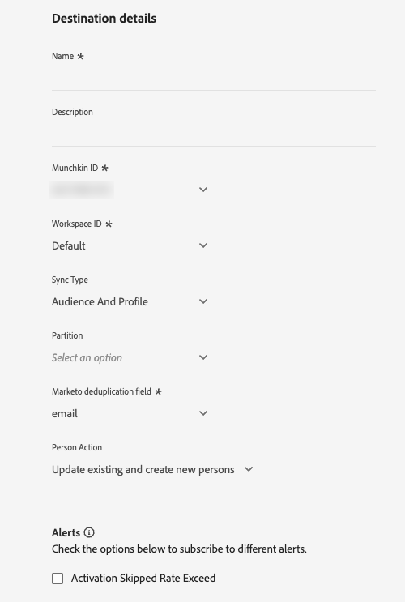

# Marketo Engage 연결

## 개요 {#overview}

[!DNL Marketo Engage]은(는) 마케팅, 광고, 분석 및 상거래를 위한 유일한 엔드 투 엔드 CXM(Customer Experience Management) 솔루션입니다. CRM 리드 관리 및 고객 참여에서 계정 기반 마케팅 및 매출 기여도 분석에 이르기까지 활동을 자동화하고 관리할 수 있습니다.

Adobe Experience Platform과 Marketo Engage 간에 대상 데이터 및 프로필 속성을 실시간으로 동기화하는 데 이 대상을 사용합니다.

## 사용 사례 {#use-cases}

[!DNL Marketo Engage] 대상을 사용하는 방법과 시기를 더 잘 이해할 수 있도록 Adobe Experience Platform 고객이 이 대상을 사용하여 해결할 수 있는 사용 사례를 소개합니다.

### 대상자 동기화 사용 사례 {#audience-sync-use-cases}

**알려진 리드만 다시 참여**

마케팅 팀은 90일 이상 참여하지 않았지만 Marketo에 이미 존재하는 리드를 대상으로 윈-백 캠페인을 실행하려고 합니다.

대상자를 Marketo Engage에 활성화하고 **[!UICONTROL Audience Only]** 동기화 유형을 사용할 수 있습니다.

### 대상자 및 프로필 동기화 사용 사례 {#audience-profile-sync-use-cases}

**알려진 잠재 고객 다시 참여 및 잠재 고객 업데이트**

마케팅 팀은 웹 사이트 방문을 기반으로 관심을 보인 기존 Marketo 연락처에 대해 재참여 캠페인을 시작하려고 합니다. 또한 잠재 고객 정보(예: 환경 설정, 인구 통계 정보)를 업데이트하려고 하지만 Marketo에서 새로운 사용자를 만들지 않습니다.

대상을 Marketo Engage에 활성화하고 **[!UICONTROL Audience and Profile]** 작업과 결합된 **[!UICONTROL Update existing persons only]** 동기화 유형을 사용하여 Marketo에 이미 있는 대상만 타깃팅하도록 할 수 있습니다.

**전체 프로필 동기화로 다시 참여 및 연결 확장**

마케팅 팀은 새 캠페인에 대한 제품 관심 대상을 활성화하려고 합니다. 대부분의 프로필이 Marketo에 이미 있지만, 일부는 새로운 프로필이며 Real-Time CDP에만 있습니다. 기존 직원의 경우 Marketo에서 해당 직원을 업데이트하지만 새 프로필도 만들려고 합니다.

Marketo Engage에서 대상을 활성화하고 **[!UICONTROL Audience and Profile]** 작업과 결합된 **[!UICONTROL Update existing and create new persons]** 동기화 유형을 사용하여 Marketo에서 기존 잠재 고객을 타깃팅하고 Real-Time CDP에서 내보낸 새 대상에 대해 새 잠재 고객을 만들 수 있습니다.

## 전제 조건 {#prerequisites}

* 대상을 설정하는 사용자는 Marketo 인스턴스 및 파티션에 [사용자 편집](https://experienceleague.adobe.com/en/docs/marketo/using/product-docs/administration/users-and-roles/descriptions-of-role-permissions#access-database) 권한이 있어야 합니다.
* 이 대상을 설정할 때는 동일한 Adobe Real-Time CDP 조직의 Marketo Engage 인스턴스만 사용할 수 있습니다.
* Adobe Admin Console에서 사용자를 관리하는 Marketo Engage 인스턴스만 이 대상을 활용할 수 있습니다.

## 지원되는 ID {#supported-identities}

[!DNL Marketo Engage]은(는) 아래 표에 설명된 ID 활성화를 지원합니다. [ID](/help/identity-service/features/namespaces.md)에 대해 자세히 알아보세요.

| 대상 ID | 설명 | 고려 사항 |
|---|---|---|
| `DedupeField` | Marketo에서 기존 잠재 고객을 식별하고 연결하는 데 사용되는 필드입니다. | [매핑](#mapping) 단계 동안 중복 제거 필드로 사용할 원본 필드(예: `Email` 또는 기타 사용자 지정 식별자)를 이 대상 ID에 매핑합니다. 최상의 결과를 얻으려면 모든 고객 프로필에서 일관되게 사용할 수 있고 고유한 필드를 선택하십시오. `ECID`은(는) 중복 제거 필드로 지원되지 않습니다. |

{style="table-layout:auto"}

## 지원되는 대상자 {#supported-audiences}

이 섹션에서는 이 대상으로 내보낼 수 있는 대상자 유형을 설명합니다. 아래 두 표는 이 커넥터가 지원하는 대상을 _대상 원본_ 및 _대상에 포함된 프로필 유형_&#x200B;별로 나타냅니다.

| 대상자 원본 | 지원됨 | 설명 |
|---------|----------|----------|
| [!DNL Segmentation Service] | ✓ | Experience Platform [세그먼테이션 서비스](../../../segmentation/home.md)를 통해 생성된 대상입니다. |
| 기타 모든 대상 원본 | ✓ | 이 범주에는 [!DNL Segmentation Service]을(를) 통해 생성된 대상 외부의 모든 대상 출처가 포함됩니다. [다양한 대상 원본](/help/segmentation/ui/audience-portal.md#customize)에 대해 읽어 보십시오. 예를 들면 다음과 같습니다. <ul><li> CSV 파일에서 Experience Platform으로 사용자 지정 업로드 대상 [가져옴](../../../segmentation/ui/audience-portal.md#import-audience),</li><li> 유사 대상, </li><li> 페더레이션 대상, </li><li> Adobe Journey Optimizer과 같은 다른 Experience Platform 앱에서 생성된 대상자 </li><li> 등. </li></ul>   |

{style="table-layout:auto"}

대상 데이터 유형별 지원되는 대상:

| 대상 데이터 유형 | 지원됨 | 설명 | 사용 사례 |
|--------------------|-----------|-------------|-----------|
| [사람 대상](/help/segmentation/types/people-audiences.md) | 예 | 고객 프로필을 기반으로 마케팅 캠페인을 위해 특정 사용자 그룹을 타깃팅할 수 있습니다. | 빈번한 구매자, 장바구니 포기 |
| [계정 대상자](/help/segmentation/types/account-audiences.md) | 아니요 | 계정 기반 마케팅 전략을 위해 특정 조직 내의 개인을 타깃팅합니다. | B2B 마케팅 |
| [잠재 고객](/help/segmentation/types/prospect-audiences.md) | 아니요 | 아직 고객이 아니지만 타겟 대상자와 특성을 공유하는 개인을 타겟팅합니다. | 타사 데이터를 이용한 잠재 고객 확보 |
| [데이터 집합 내보내기](/help/catalog/datasets/overview.md) | 아니요 | Adobe Experience Platform 데이터 레이크에 저장된 구조화된 데이터의 컬렉션입니다. | 보고, 데이터 과학 워크플로 |

{style="table-layout:auto"}

## 내보내기 유형 및 빈도 {#export-type-frequency}

대상 내보내기 유형 및 빈도에 대한 자세한 내용은 아래 표를 참조하십시오.

| 항목 | 유형 | 참고 |
|---------|----------|---------|
| 내보내기 유형 | **[!UICONTROL Audience export]** | [!DNL Marketo Engage] 대상에 사용된 식별자(전자 메일, ECID)를 사용하여 대상자의 모든 구성원을 내보내고 있습니다. |
| 내보내기 빈도 | **[!UICONTROL Streaming]** | 스트리밍 대상은 &quot;항상&quot; API 기반 연결입니다. 대상자 평가를 기반으로 Experience Platform에서 프로필이 업데이트되는 즉시 커넥터가 업데이트 다운스트림을 대상 플랫폼으로 전송합니다. [스트리밍 대상](/help/destinations/destination-types.md#streaming-destinations)에 대해 자세히 알아보세요. |

{style="table-layout:auto"}

## 잠재 고객 일치 동작 {#lead-matching}

Marketo 리드 일치의 작동 방식을 이해하면 사용 사례에 적합한 구성을 선택하는 데 도움이 됩니다. 일치하는 동작은 선택한 **[!UICONTROL Sync Type]** 및 **[!UICONTROL Person Action]** 설정에 따라 다릅니다.

Marketo에서는 선택한 **[!UICONTROL Marketo deduplication field]**&#x200B;을(를) 사용하여 Experience Platform 프로필을 기존 Marketo 리드와 연결합니다. 일치 프로세스는 Marketo 인스턴스의 모든 파티션을 검색하여 기존 리드를 찾습니다. 선택한 구성에 따라 Marketo 인스턴스에서 잠재 고객을 만들고 업데이트하는 방법을 알려면 아래 표를 참조하십시오.

| 동기화 유형 | 개인 작업 | 일치하는 동작 |
|-----------|---------------|-------------------|
| **[!UICONTROL Profile only]** | **[!UICONTROL Update existing and create new persons]** | <ul><li>새 프로필 데이터로 기존 잠재 고객 업데이트</li><li>일치하지 않는 프로필에 대해 선택한 파티션에 새 잠재 고객을 만듭니다.</li></ul> |
| **[!UICONTROL Profile only]** | **[!UICONTROL Update existing persons only]** | <ul><li>새 프로필 데이터로 기존 잠재 고객 업데이트</li><li>일치하지 않는 프로필에 대해 생성된 새 잠재 고객 없음</li></ul> |
| **[!UICONTROL Audience only]** | N/A | <ul><li>대상자 목록에 기존 리드 추가</li><li>일치하지 않는 프로필에 대해 생성된 새 잠재 고객 없음</li></ul> |
| **[!UICONTROL Audience and profile]** | **[!UICONTROL Update existing and create new persons]** | <ul><li>새 프로필 데이터로 기존 잠재 고객 업데이트</li><li>대상자 목록에 기존 리드 추가</li><li>일치하지 않는 프로필에 대해 선택한 파티션에 새 잠재 고객을 만듭니다.</li><li>대상 목록에 새 리드 추가</li></ul> |
| **[!UICONTROL Audience and profile]** | **[!UICONTROL Update existing persons only]** | <ul><li>새 프로필 데이터로 기존 잠재 고객 업데이트</li><li>대상자 목록에 기존 리드 추가</li><li>일치하지 않는 프로필에 대해 생성된 새 잠재 고객 없음</li></ul> |

{style="table-layout:auto"}

### 중요한 고려 사항

* **중복 제거 필드 선택**: 고객 프로필 전체에서 일관되게 사용할 수 있고 고유한 필드를 선택합니다(예: 이메일 주소, 고객 ID).
* **파티션 처리**: 새 리드를 만들 때 선택한 파티션(또는 파티션을 선택하지 않은 경우 **[!UICONTROL Default]** 파티션)에 배치됩니다.
* **중복 처리**: 여러 Marketo 잠재 고객이 동일한 프로필과 일치하는 경우 가장 최근에 업데이트된 잠재 고객만 업데이트됩니다
* **교차 파티션 일치**: 새 잠재 고객에 대해 선택한 파티션과 관계없이 시스템은 모든 파티션에서 기존 잠재 고객을 검색합니다

## 대상에 연결 {#connect}

>[!IMPORTANT]
> 
>* 대상에 연결하려면 **[!UICONTROL View Destinations]** 및 **[!UICONTROL Manage Destinations]** [액세스 제어 권한](/help/access-control/home.md#permissions)이 필요합니다.
>
>* 데이터를 활성화하려면 **[!UICONTROL View Destinations]**, **[!UICONTROL Activate Destinations]**, **[!UICONTROL View Profiles]** 및 **[!UICONTROL View Segments]** [액세스 제어 권한](/help/access-control/home.md#permissions)이 필요합니다. [액세스 제어 개요](/help/access-control/ui/overview.md)를 읽거나 제품 관리자에게 문의하여 필요한 권한을 받으십시오.

이 대상에 연결하려면 [대상 구성 자습서](../../ui/connect-destination.md)에 설명된 단계를 따르십시오. 대상 구성 워크플로에서 아래 두 섹션에 나열된 필드를 채웁니다.

### 대상으로 인증 {#authenticate}

대상에 인증하려면 **[!UICONTROL Connect to destination]**&#x200B;을(를) 선택하십시오.

대상에 인증하는 방법을 보여 주는 

### 대상 세부 정보 입력 {#destination-details}

대상에 대한 세부 정보를 구성하려면 아래의 필수 및 선택 필드를 채우십시오. UI에서 필드 옆에 있는 별표는 필드가 필수임을 나타냅니다.

* **[!UICONTROL Name]**: 나중에 이 대상을 인식할 수 있는 이름입니다.
* **[!UICONTROL Description]**: 나중에 이 대상을 식별하는 데 도움이 되는 설명입니다.
* **[!UICONTROL Munchkin ID]**: 이 대상에 사용할 [!DNL Marketo Munchkin ID]을(를) 선택하십시오.
* **[!UICONTROL Workspace ID]**: Marketo 작업 영역 ID를 선택합니다.
* **[!UICONTROL Sync type]**: 이 대상에 사용할 동기화 유형 선택:
   * **[!UICONTROL Audience and profile]**: Marketo 목록에 대상 구성원을 추가하고 프로필 정보를 최신 상태로 유지하려면 이 옵션을 선택하십시오.
   * **[!UICONTROL Profile only]**: Experience Platform의 최신 정보를 사용하여 Marketo 잠재 고객 프로필을 최신 상태로 유지하려면 이 옵션을 선택하십시오.
   * **[!UICONTROL Audience only]**: 프로필 정보를 업데이트하지 않고 Marketo 목록에 대상 구성원을 추가하려면 이 옵션을 선택하십시오.
* **[!UICONTROL Partition]**: *파티션 선택은&#x200B;**[!UICONTROL Profile only]**&#x200B;또는&#x200B;**[!UICONTROL Audience and profile]**&#x200B;동기화 유형*&#x200B;을 선택하는 경우에만 사용할 수 있습니다. 선택한 작업 영역과 연결된 Marketo 파티션 ID를 선택합니다. 내보낸 데이터를 받을 Marketo의 리드 파티션을 지정할 수 있습니다. 특정 파티션을 선택하지 않으면 데이터가 Marketo의 **[!UICONTROL Default]** 파티션으로 전송됩니다.
* **[!UICONTROL Marketo deduplication field]**: 기존 Marketo 리드를 업데이트할 때 사용할 Marketo 중복 제거 필드를 선택합니다. 이 선택기는 Marketo에서 중복 제거 필드로 표시한 필드를 표시합니다. Marketo의 특정 필드가 중복 제거 필드로 표시되도록 하려면 Marketo에서 필드를 [검색 가능한 필드](https://experienceleague.adobe.com/en/docs/marketo-developer/marketo/rest/lead-database/lead-database)&#x200B;(으)로 표시해야 합니다.

  >[!NOTE]
  >
  >Marketo `Lead ID` 및 Experience Cloud ID(`ECID`)는 중복 제거에 지원되지 않습니다.

* **[!UICONTROL Person Action]**: 데이터를 내보낼 때 수행할 Marketo 작업을 선택합니다.
   * **[!UICONTROL Update existing and create new persons]**: 기존 Marketo 리드를 업데이트하고 아직 Marketo에 있지 않은 대상 구성원에 대한 새 리드를 만들려면 이 옵션을 선택하십시오. 선택한 파티션에 새 리드가 만들어집니다. 파티션을 선택하지 않으면 **[!UICONTROL Default]** 파티션에 새 리드가 만들어집니다.
   * **[!UICONTROL Update existing persons only]**: 새 항목을 만들지 않고 기존 Marketo 리드만 업데이트하려면 이 옵션을 선택하십시오. 여러 리드가 동일한 프로필과 일치하는 경우 가장 최근에 업데이트된 Marketo 리드만 Experience Platform 데이터로 업데이트됩니다.

### 경고 활성화 {#enable-alerts}

경고를 활성화하여 대상에 대한 데이터 흐름 상태에 대한 알림을 받을 수 있습니다. 목록에서 경고를 선택하여 데이터 흐름 상태에 대한 알림을 수신합니다. 경고에 대한 자세한 내용은 [UI를 사용하여 대상 경고 구독](../../ui/alerts.md)에 대한 안내서를 참조하십시오.

대상 연결에 대한 세부 정보를 제공했으면 **[!UICONTROL Next]**&#x200B;을(를) 선택합니다.

## 이 대상으로 대상자 활성화 {#activate}

>[!IMPORTANT]
> 
>* 데이터를 활성화하려면 **[!UICONTROL View Destinations]**, **[!UICONTROL Activate Destinations]**, **[!UICONTROL View Profiles]** 및 **[!UICONTROL View Segments]** [액세스 제어 권한](/help/access-control/home.md#permissions)이 필요합니다. [액세스 제어 개요](/help/access-control/ui/overview.md)를 읽거나 제품 관리자에게 문의하여 필요한 권한을 받으십시오.
>* *ID*&#x200B;을(를) 내보내려면 **[!UICONTROL View Identity Graph]** [액세스 제어 권한](/help/access-control/home.md#permissions)이 필요합니다.   {width="100" zoomable="yes"}

이 대상으로 대상을 활성화하는 방법에 대한 지침은 [프로필 및 대상을 스트리밍 대상 내보내기 대상으로 활성화](/help/destinations/ui/activate-segment-streaming-destinations.md)를 참조하십시오.

### 필수 매핑 {#required-mappings}

매핑 단계에서 중복 제거 필드로 사용할 소스 필드(예: `email` 또는 기타 사용자 지정 식별자)를 `DedupeField` 대상 ID에 매핑합니다. 최상의 결과를 얻으려면 모든 고객 프로필에서 일관되게 사용할 수 있고 고유한 필드를 선택하십시오.

Marketo이 리드를 성공적으로 만들려면 다음 필수 타겟 속성도 매핑해야 합니다.

* `firstName`: 잠재 고객의 이름
* `lastName`: 잠재 고객의 성
* `email`: 잠재 고객의 이메일 주소

`email`을(를) 중복 제거 필드로 사용하는 경우 아래 그림과 같이 `firstName` 및 `lastName` 특성도 매핑해야 합니다.

다른 중복 제거 필드를 사용하는 경우 아래 그림과 같이 세 가지 필수 특성(`firstName`, `lastName`, `email`)을 모두 수동으로 매핑해야 합니다.

## 내보낸 데이터/데이터 내보내기 유효성 검사 {#exported-data}

대상을 Marketo Engage으로 내보낸 후에는 Marketo 계정에 로그인하여 대상이 예상대로 활성화되었는지 확인해야 합니다. Marketo에서 관련 리드 파티션 및 작업 공간을 확인하여 대상 데이터가 올바르게 표시되고 의도한 작업(예: 사람 업데이트 또는 만들기)이 수행되었는지 확인합니다.

예상 데이터가 표시되지 않으면 Adobe Experience Platform에서 매핑 및 내보내기 설정을 검토하고 내보내기를 다시 시도하십시오.

## 데이터 사용 및 관리 {#data-usage-governance}

데이터를 처리할 때 모든 [!DNL Adobe Experience Platform] 대상이 데이터 사용 정책을 준수합니다. [!DNL Adobe Experience Platform]에서 데이터 거버넌스를 적용하는 방법에 대한 자세한 내용은 [데이터 거버넌스 개요](/help/data-governance/home.md)를 참조하십시오.
