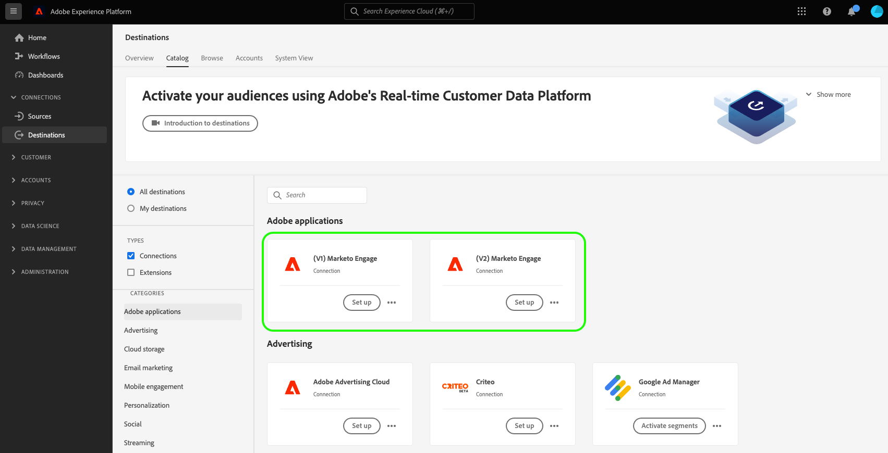

# (기존) (V2) Marketo Engage 대상 {#beta-marketo-engage-destination}

## 대상 변경 로그 {#changelog}

<!--
>[!IMPORTANT]
>
>The **[!UICONTROL (Legacy) (V2) Marketo Engage]** will be deprecated in **March 2026**.
>
>To ensure a smooth transition to the new **[[!UICONTROL Marketo Engage]](marketo-engage-connection.md)** destination, review the following key points and required actions:
>
>* All users of the existing **[!UICONTROL (Legacy) (V2) Marketo Engage]** must migrate to the new **[!UICONTROL Marketo Engage]** destination by March 2026.
>* **Existing dataflows will not be migrated automatically.** You must [set up a new connection](../../ui/connect-destination.md) to the new **[!UICONTROL Marketo Engage]** destination and activate your audiences there.

-->

Marketo V2 대상의 개선 사항은 다음과 같습니다.

* 활성화 워크플로의 **[!UICONTROL Schedule segment]** 단계(Marketo V1)에서 데이터를 Marketo으로 내보내려면 **매핑 ID**&#x200B;를 수동으로 추가해야 합니다. Marketo V2에서는 이 수동 단계가 더 이상 필요하지 않습니다.
* 활성화 워크플로의 **[!UICONTROL Mapping]** 단계(Marketo V1)에서 XDM 필드를 Marketo의 세 개의 대상 필드인 `firstName`, `lastName` 및 `companyName`에만 매핑할 수 있습니다. 이제 Marketo V2 릴리스를 통해 XDM 필드를 Marketo의 더 많은 필드에 매핑할 수 있습니다. 자세한 내용은 아래의 [지원되는 특성](#supported-attributes) 섹션을 참조하십시오.

## 개요 {#overview}

[!DNL Marketo Engage]은(는) 마케팅, 광고, 분석 및 상거래를 위한 유일한 엔드 투 엔드 CXM(Customer Experience Management) 솔루션입니다. CRM 리드 관리 및 고객 참여에서 계정 기반 마케팅 및 매출 기여도 분석에 이르기까지 활동을 자동화하고 관리할 수 있습니다.

대상을 사용하면 마케터가 Adobe Experience Platform에서 만든 대상을 정적 목록으로 표시되는 Marketo으로 푸시할 수 있습니다.

## 지원되는 ID 및 속성 {#supported-identities-attributes}

>[!NOTE]
>
>대상 활성화 워크플로의 [매핑 단계](/help/destinations/ui/activate-segment-streaming-destinations.md#mapping)에서 ID를 매핑하는 것은 *필수*&#x200B;이고 특성을 매핑하는 것은 *선택적*&#x200B;입니다. ID 네임스페이스 탭의 이메일 및/또는 ECID 매핑은 개인이 Marketo에서 일치하는지 확인하기 위해 수행하는 가장 중요한 작업입니다. 매핑 이메일을 통해 가장 높은 일치율을 보장합니다.

### 지원되는 ID {#supported-identities}

| 대상 ID | 설명 |
|---|---|
| ECID | ECID를 나타내는 네임스페이스입니다. 이 네임스페이스는 &quot;Adobe Marketing Cloud ID&quot;, &quot;Adobe Experience Cloud ID&quot;, &quot;Adobe Experience Platform ID&quot; 별칭으로도 참조할 수 있습니다. 자세한 내용은 [ECID](/help/identity-service/features/ecid.md)에서 다음 문서를 참조하십시오. |
| 이메일 | 이메일 주소를 나타내는 네임스페이스입니다. 이러한 유형의 네임스페이스는 종종 단일 사용자와 연결되므로 여러 채널에서 해당 사용자를 식별하는 데 사용할 수 있습니다. |

{style="table-layout:auto"}

### 지원되는 속성 {#supported-attributes}

Experience Platform의 속성을 조직이 Marketo에서 액세스할 수 있는 모든 속성에 매핑할 수 있습니다. Marketo에서는 [API 요청 설명](https://developers.marketo.com/rest-api/lead-database/leads/#describe)을(를) 사용하여 조직에서 액세스할 수 있는 특성 필드를 검색할 수 있습니다.

## 지원되는 대상자 {#supported-audiences}

이 섹션에서는 이 대상으로 내보낼 수 있는 대상자 유형을 설명합니다.

| 대상자 원본 | 지원됨 | 설명 |
|---------|----------|----------|
| [!DNL Segmentation Service] | 예 | Experience Platform [세그먼테이션 서비스](../../../segmentation/home.md)를 통해 생성된 대상입니다. |
| 기타 모든 대상 원본 | 아니요 | 이 범주에는 [!DNL Segmentation Service]을(를) 통해 생성된 대상 외부의 모든 대상 출처가 포함됩니다. [다양한 대상 원본](/help/segmentation/ui/audience-portal.md#customize)에 대해 읽어 보십시오. 예를 들면 다음과 같습니다. <ul><li> CSV 파일에서 Experience Platform으로 사용자 지정 업로드 대상 [가져옴](../../../segmentation/ui/audience-portal.md#import-audience),</li><li> 유사 대상, </li><li> 페더레이션 대상, </li><li> Adobe Journey Optimizer과 같은 다른 Experience Platform 앱에서 생성된 대상자 </li><li> 등. </li></ul> |

{style="table-layout:auto"}

대상 데이터 유형별 지원되는 대상:

| 대상 데이터 유형 | 지원됨 | 설명 | 사용 사례 |
|--------------------|-----------|-------------|-----------|
| [사람 대상](/help/segmentation/types/people-audiences.md) | 예 | 고객 프로필을 기반으로 마케팅 캠페인을 위해 특정 사용자 그룹을 타깃팅할 수 있습니다. | 빈번한 구매자, 장바구니 포기 |
| [계정 대상자](/help/segmentation/types/account-audiences.md) | 아니요 | 계정 기반 마케팅 전략을 위해 특정 조직 내의 개인을 타깃팅합니다. | B2B 마케팅 |
| [잠재 고객](/help/segmentation/types/prospect-audiences.md) | 아니요 | 아직 고객이 아니지만 타겟 대상자와 특성을 공유하는 개인을 타겟팅합니다. | 타사 데이터를 이용한 잠재 고객 확보 |
| [데이터 집합 내보내기](/help/catalog/datasets/overview.md) | 아니요 | Adobe Experience Platform 데이터 레이크에 저장된 구조화된 데이터의 컬렉션입니다. | 보고, 데이터 과학 워크플로 |

{style="table-layout:auto"}

## 내보내기 유형 및 빈도 {#export-type-frequency}

대상 내보내기 유형 및 빈도에 대한 자세한 내용은 아래 표를 참조하십시오.

| 항목 | 유형 | 참고 |
|---------|----------|---------|
| 내보내기 유형 | **[!UICONTROL Audience export]** | [!DNL Marketo Engage] 대상에 사용된 식별자(전자 메일, ECID)를 사용하여 대상자의 모든 구성원을 내보내고 있습니다. |
| 내보내기 빈도 | **[!UICONTROL Streaming]** | 스트리밍 대상은 &quot;항상&quot; API 기반 연결입니다. 대상자 평가를 기반으로 Experience Platform에서 프로필이 업데이트되는 즉시 커넥터가 업데이트 다운스트림을 대상 플랫폼으로 전송합니다. [스트리밍 대상](/help/destinations/destination-types.md#streaming-destinations)에 대해 자세히 알아보세요. |

{style="table-layout:auto"}

## 대상 설정 및 대상 활성화 {#set-up}

>[!IMPORTANT]
> 
>* 대상에 연결하려면 **[!UICONTROL View Destinations]** 및 **[!UICONTROL Manage Destinations]** [액세스 제어 권한](/help/access-control/home.md#permissions)이 필요합니다.
>* 데이터를 활성화하려면 **[!UICONTROL View Destinations]**, **[!UICONTROL Activate Destinations]**, **[!UICONTROL View Profiles]** 및 **[!UICONTROL View Segments]** [액세스 제어 권한](/help/access-control/home.md#permissions)이 필요합니다. [액세스 제어 개요](/help/access-control/ui/overview.md)를 읽거나 제품 관리자에게 문의하여 필요한 권한을 받으십시오.

대상을 설정하고 대상을 활성화하는 방법에 대한 자세한 지침은 Marketo 설명서에서 [Adobe Experience Platform 대상을 Marketo 정적 목록으로 푸시](https://experienceleague.adobe.com/docs/marketo/using/product-docs/core-marketo-concepts/smart-lists-and-static-lists/static-lists/push-an-adobe-experience-cloud-segment-to-a-marketo-static-list.html)를 참조하십시오.

아래 비디오에서는 Marketo 대상을 구성하고 대상을 활성화하는 단계도 보여 줍니다.

>[!IMPORTANT]
>
>비디오는 현재 기능을 완전히 반영하지 않습니다. 최신 정보는 위에 링크된 안내서를 참조하시기 바랍니다. 다음 비디오 부분은 오래되었습니다.
> 
>* Experience Platform UI에서 사용해야 하는 대상 카드는 **[!UICONTROL Marketo V2]**&#x200B;입니다.
>* 대상 연결 워크플로의 새 **[!UICONTROL Person creation]** 선택기 필드가 비디오에 표시되지 않습니다. 이 필드를 사용하려면 속성 매핑 단계에서 이름과 성을 모두 매핑해야 합니다.
>* 비디오에서 호출된 두 가지 제한 사항은 더 이상 적용되지 않습니다. 이제 비디오가 기록될 때 지원된 대상 멤버십 정보 외에도 다른 많은 프로필 속성 필드를 매핑할 수 있습니다. 아직 Marketo 정적 목록에 없는 Marketo으로 대상 구성원을 내보낼 수도 있으며 이러한 구성원이 목록에 추가됩니다.
>* 활성화 워크플로의 **[!UICONTROL Schedule audience step]**(Marketo V1)에서 데이터를 Marketo으로 내보내려면 **[!UICONTROL Mapping ID]**&#x200B;을(를) 수동으로 추가해야 합니다. Marketo V2에서는 이 수동 단계가 더 이상 필요하지 않습니다.

>[!VIDEO](https://video.tv.adobe.com/v/338248?quality=12)

## 대상 모니터링 {#monitor-destination}

대상에 연결하고 대상 데이터 흐름을 설정한 후 Real-Time CDP의 [모니터링 기능](/help/dataflows/ui/monitor-destinations.md)을 사용하여 각 데이터 흐름 실행에서 대상에 활성화된 프로필 레코드에 대한 광범위한 정보를 얻을 수 있습니다.

[!DNL Marketo Engage] 연결에 대한 모니터링 정보에는 각 데이터 흐름 및 데이터 흐름 실행에서 활성화, 제외 및 실패한 ID와 관련된 대상 수준 정보가 포함되어 있습니다. 기능에 대해 [자세히 알아보십시오](/help/dataflows/ui/monitor-destinations.md#segment-level-view).

## 데이터 사용 및 관리 {#data-usage-governance}

데이터를 처리할 때 모든 [!DNL Adobe Experience Platform] 대상이 데이터 사용 정책을 준수합니다. [!DNL Adobe Experience Platform]에서 데이터 거버넌스를 적용하는 방법에 대한 자세한 내용은 [데이터 거버넌스 개요](https://experienceleague.adobe.com/docs/experience-platform/data-governance/home.html?lang=ko)를 참조하십시오.
