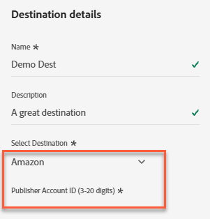
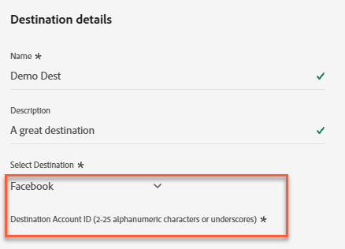
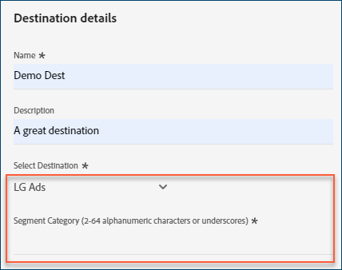
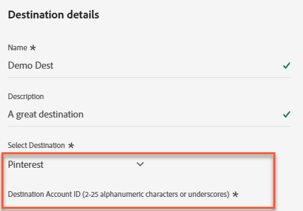
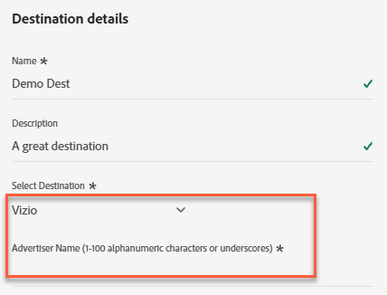

# [!DNL Acxiom Real ID™ Audience Connection] 대상

[!DNL Acxiom Real ID Audience Connection] 대상을 사용하여 [!DNL Acxiom]의 [Real ID™](https://www.acxiom.com/real-id/real-id/) 기술로 대상을 향상시킵니다. 그런 다음 [!DNL Altice], [!DNL Ampersand], [!DNL Comcast] 등의 플랫폼에서 이러한 대상을 활성화합니다.

>[!NOTE]
>
>이 대상 커넥터 및 설명서 페이지는 [!DNL Acxiom] 팀에서 만들고 유지 관리합니다. 문의 사항이나 업데이트 요청이 있으면 [!DNL Acxiom]에게 [acxiom-adobe-help@acxiom.com](mailto:acxiom-adobe-help@acxiom.com)로 직접 문의하십시오.

[!DNL Adobe Experience Platform] 사용자 인터페이스를 사용하여 [!DNL Acxiom Real ID Audience Connection] 대상 커넥터를 만들려면 다음 단계를 따르십시오. 이 커넥터를 사용하여 대상자를 빌드하고 선택한 대상에 배포합니다.

## 사용 사례 {#use-cases}

[!DNL Acxiom]의 [!DNL Real ID]을(를) 식별자로 [!DNL Real-Time CDP]에 로드한 경우 이 대상을 사용합니다. 다음 사용 사례에서는 [!DNL Acxiom Real ID Audience Connection] 대상을 사용하는 방법을 보여 줍니다.

### [!DNL Experience Platform]에서 [!DNL Acxiom] 계정으로 대상자 보내기 {#send-audiences}

이 대상 커넥터를 사용하여 채널 간 획득을 위해 대상을 [!DNL Experience Platform]에서 [!DNL Acxiom] 계정으로 보낼 수 있습니다.

예를 들어 글로벌 금융 서비스 브랜드의 마케팅 운영 부서에서는 여러 광고 플랫폼을 통한 크로스 채널 고객 확보에 관심이 있습니다. [!DNL Acxiom Real ID Audience Connection] 대상 커넥터를 사용하여 대상을 [!DNL Experience Platform]에서 [!DNL Acxiom]&#x200B;(으)로 보내고, [!DNL Acxiom]의 [!DNL Real ID] 기술로 대상을 향상시키며, [!DNL Altice], [!DNL Ampersand], [!DNL Comcast] 등과 같은 여러 플랫폼에 대상을 활성화할 수 있습니다.

## 전제 조건 {#prerequisites}

[!DNL Acxiom Real ID Audience Connection] 대상을 구성하기 전에 다음 필수 구성 요소를 완료하십시오.

* **사용 약관 확인:** [!DNL Acxiom]의 사용 약관을 읽고 서명합니다. 실행된 판매 주문이 완료되면 계약 링크를 받습니다. 계약에 서명할 때까지 [!DNL Acxiom Real ID Audience Connection] 대상 카드가 [!DNL Experience Platform] 대상 카탈로그에 표시되지 않습니다. 계약에 동의하고 서명하면 [!DNL Adobe]이(가) 설정을 완료하고 [!DNL Acxiom Real ID Audience Connection] 대상 카드가 표시됩니다.
* **조직 ID [!DNL Adobe]을(를) 알 수 있습니다.** 사용 약관 계약을 완료하려면 [!DNL Adobe] 조직 ID가 필요합니다. [조직 ID를 확인](https://experienceleague.adobe.com/ko/docs/core-services/interface/administration/organizations#concept_EA8AEE5B02CF46ACBDAD6A8508646255)하는 방법에 대한 자세한 내용은 [!DNL Adobe]의 *Experience Cloud의 조직* 항목을 참조하십시오.
* **[!DNL Acxiom]의 [!DNL Real ID] 제품에 대한 라이선스 취득:** 라이선스를 취득한 후 [!DNL Acxiom]의 [!DNL Real ID]을(를) [!DNL Real-Time CDP] 내에 사용할 수 있도록 하십시오. 자세한 내용은 [Acxiom 데이터 개선 사항](/help/destinations/catalog/data-partner/acxiom-data-enhancement.md)을 참조하십시오.

## 지원되는 ID {#supported-identities}

[!DNL Acxiom]의 [!DNL Real ID] 대상 연결 대상에서 다음 ID 활성화를 지원합니다. [ID](/help/identity-service/features/namespaces.md)에 대해 자세히 알아보세요.

| 타겟 ID | 설명 | 고려 사항 |
| --------------- | ----------- | -------------- |
| [!DNL Real ID] | [!DNL Real ID] | 소스 필드를 이 대상 ID에 매핑합니다. 소스 필드는 [!DNL Acxiom] [!DNL Real ID] 또는 사용자 지정 식별자일 수 있습니다. |

{style="table-layout:auto"}

## 지원되는 대상자 {#supported-audiences}

이 섹션에서는 이 대상으로 내보낼 수 있는 대상자 유형을 설명합니다.

| 대상자 원본 | 지원됨 | 설명 |
| --------------- | --------- | ----------- |
| [!DNL Segmentation Service] | 예 | [!DNL Experience Platform] [세분화 서비스](/help/segmentation/home.md)를 통해 생성된 대상입니다. |
| 기타 모든 대상 원본 | 예 | 이 범주에는 [!DNL Segmentation Service]을(를) 통해 생성된 대상 외부의 모든 대상 출처가 포함됩니다. [다양한 대상 원본](/help/segmentation/ui/audience-portal.md#customize)에 대해 읽어 보십시오. 예를 들면 다음과 같습니다. <ul><li>CSV 파일에서 [!DNL Experience Platform]&#x200B;(으)로 사용자 지정 업로드 대상 [가져옴](/help/segmentation/ui/audience-portal.md#import-audience),</li><li>유사 대상,</li><li>페더레이션 대상,</li><li>[!DNL Adobe Journey Optimizer]과(와) 같은 다른 [!DNL Experience Platform] 앱에서 생성된 대상,</li><li>등.</li></ul> |

{style="table-layout:auto"}

### 데이터 유형별 지원되는 대상 {#supported-audiences-data-type}

다음 표에서는 이 대상으로 내보낼 수 있는 대상 데이터 유형을 설명합니다.

| 대상 데이터 유형 | 지원됨 | 설명 | 사용 사례 |
| -------------------- | --------- | ----------- | --------- |
| [사람 대상](/help/segmentation/types/people-audiences.md) | 예 | 고객 프로필 기반. 마케팅 캠페인에 대한 특정 사용자 그룹을 타겟팅하는 데 사용합니다. | 빈번한 구매자, 장바구니 포기 |
| [계정 대상자](/help/segmentation/types/account-audiences.md) | 아니요 | 계정 기반 마케팅 전략을 위해 특정 조직 내의 개인을 타깃팅합니다. | B2B 마케팅 |
| [잠재 고객](/help/segmentation/types/prospect-audiences.md) | 아니요 | 아직 고객이 아니지만 타겟 대상자와 특성을 공유하는 개인을 타겟팅합니다. | 타사 데이터를 이용한 잠재 고객 확보 |
| [데이터 집합 내보내기](/help/catalog/datasets/overview.md) | 아니요 | [!DNL Adobe Experience Platform] 데이터 레이크에 저장된 구조화된 데이터의 컬렉션입니다. | 보고, 데이터 과학 워크플로 |

{style="table-layout:auto"}

## 내보내기 유형 및 빈도 {#export-type-frequency}

다음 표에서는 대상 내보내기 유형 및 빈도에 대해 설명합니다.

| 항목 | 유형 | 참고 |
| ---- | ---- | ----- |
| 내보내기 유형 | **[!UICONTROL Audience export]** | [!DNL Acxiom Real ID Audience Connection] 대상에 사용된 식별자로 대상의 모든 멤버를 내보냅니다. |
| 내보내기 빈도 | **[!UICONTROL Batch]** | 배치 대상은 파일을 3, 6, 8, 12 또는 24시간 단위로 다운스트림 플랫폼으로 내보냅니다. [일괄 파일 기반 대상](/help/destinations/destination-types.md#file-based)에 대해 자세히 알아보세요. |

{style="table-layout:auto"}

## 지원되는 대상 {#supported-destinations}

[!DNL Acxiom Real ID Audience Connection] 대상을 통해 다음 플랫폼에 대한 대상을 활성화합니다.

* [!DNL Altice]
* [[!DNL Amazon]](#amazon)
* [!DNL Ampersand]
* [!DNL Comcast]
* [!DNL Cox]
* [[!DNL Facebook]](#facebook)
* [[!DNL LG Ads]](#lg-ads)
* [[!DNL Pinterest]](#pinterest)
* [!DNL Spectrum]
* [!DNL Viant]
* [[!DNL Vizio]](#vizio)

## 대상에 연결 {#connect}

[!DNL Experience Platform]이(가) [!DNL Acxiom Real ID Audience Connection] 대상에 대한 인증을 자동으로 처리합니다.

>[!IMPORTANT]
>
>대상에 연결하려면 **[!UICONTROL View Destinations]** 및 **[!UICONTROL Manage Destinations]** [액세스 제어 권한](/help/access-control/home.md#permissions)이 필요합니다. [액세스 제어 개요](/help/access-control/ui/overview.md)를 읽거나 제품 관리자에게 문의하여 필요한 권한을 받으십시오.

## 대상별 설정 {#destination-settings}

일부 [!DNL Acxiom Real ID Audience Connection] 대상에 추가 정보가 필요합니다. 다음 섹션에서는 이러한 옵션을 구성하는 방법에 대한 자세한 지침을 제공합니다.

### [!DNL Amazon] {#amazon}

대상에 대한 세부 정보를 구성하려면 다음 필드를 완료하십시오.

* **[!UICONTROL Publisher Account ID]**: 이 대상과 연결된 게시자 계정 ID를 입력하십시오.

  게시자 계정 ID 필드를 표시하는 [!DNL Amazon] 대상 세부 정보 패널의 {zoomable="yes"}

### [!DNL Facebook] {#facebook}

대상에 대한 세부 정보를 구성하려면 다음 필드를 완료하십시오.

* **[!UICONTROL Destination Account ID]**: 이 대상의 대상 계정 ID를 입력하십시오.

  대상 계정 ID 필드를 표시하는 [!DNL Facebook] 대상 세부 정보 패널의 {zoomable="yes"}

### [!DNL LG Ads] {#lg-ads}

대상에 대한 세부 정보를 구성하려면 다음 필드를 완료하십시오.

* **[!UICONTROL Segment Category]**: 세그먼트가 속하는 대상 범주 또는 세로 범주. 예: 금융 서비스, 자동차 또는 건강.

  세그먼트 범주 필드를 표시하는 [!DNL LG Ads] 대상 세부 정보 패널의 {zoomable="yes"}

### [!DNL Pinterest] {#pinterest}

대상에 대한 세부 정보를 구성하려면 다음 필드를 완료하십시오.

* **[!UICONTROL Destination Account ID]**: 이 대상의 대상 계정 ID를 입력하십시오.

  대상 계정 ID 필드를 표시하는 [!DNL Pinterest] 대상 세부 정보 패널의 {zoomable="yes"}

### [!DNL Vizio] {#vizio}

대상에 대한 세부 정보를 구성하려면 다음 필드를 완료하십시오.

* **[!UICONTROL Advertiser Name]**: 이 대상의 광고주 이름을 입력하십시오.

  광고주 이름 필드를 표시하는 [!DNL Vizio] 대상 세부 정보 패널의 {zoomable="yes"}

## 이 대상으로 대상자 활성화 {#activate}

이 대상으로 대상을 활성화하는 방법에 대한 지침은 [대상 데이터를 일괄 프로필 내보내기 대상으로 활성화](/help/destinations/ui/activate-batch-profile-destinations.md)를 참조하십시오.

>[!IMPORTANT]
>
>* 데이터를 활성화하려면 **[!UICONTROL View Destinations]**, **[!UICONTROL Activate Destinations]**, **[!UICONTROL View Profiles]** 및 **[!UICONTROL View Segments]** [액세스 제어 권한](/help/access-control/home.md#permissions)이 필요합니다. [액세스 제어 개요](/help/access-control/ui/overview.md)를 읽거나 제품 관리자에게 문의하여 필요한 권한을 받으십시오.
>* *ID*&#x200B;을(를) 내보내려면 **[!UICONTROL View Identity Graph]** [액세스 제어 권한](/help/access-control/home.md#permissions)이 필요합니다.   {width="100" zoomable="yes"}

>[!NOTE]
>
>[!DNL Acxiom Real ID Audience Connection] 대상은 전체 파일 내보내기만 지원합니다.

### 속성 및 ID 매핑 {#map}

대상 데이터를 올바르게 수신할 [!DNL Acxiom Real ID Audience Connection] 대상의 경우 [!DNL Experience Platform]의 원본 필드를 올바른 [!DNL Acxiom Real ID Audience Connection] 대상 필드에 매핑하십시오.

**[!UICONTROL Real ID]** 대상 필드는 매핑 단계에서 자동으로 미리 채워집니다. 소스 필드를 사용자 지정 식별자 네임스페이스 또는 프로필 스키마에 저장된 실제 [!DNL Acxiom] [!DNL Real ID]에 매핑합니다.

| 필드 이름 | 설명 | 필수 여부 |
| ---------- | ----------- | -------- |
| [!DNL Real ID] | [!DNL Real ID]은(는) [!DNL Acxiom]의 고유 ID 확인 그래프에서 고유한 36바이트 영숫자 식별자입니다. 사용자, 세대 또는 주소를 나타내는 식별자입니다. | 예 |

{style="table-layout:auto"}

**[!UICONTROL Source Field]** 열에서 **[!UICONTROL Real ID]** 대상 필드에 매핑할 원본 특성의 이름을 입력합니다. 또는 **[!UICONTROL Select source field]**&#x200B;을(를) 선택하여 사용 가능한 소스 필드를 찾아봅니다. **[!UICONTROL Next]**&#x200B;을(를) 선택합니다.

[!UICONTROL Source Field] 열 및 [!UICONTROL Select source field] 패널을 표시하는 매핑 화면의 {zoomable="yes"}

[!DNL Adobe]의 표준 스키마를 사용하지 않는 경우 [쿼리 서비스 UI 안내서](/help/query-service/ui/overview.md)를 참조하여 [!DNL Adobe] 표준 스키마를 필드 이름으로 채웁니다.

### 대상 검토 {#review}

모든 단계를 완료한 후 대상 연결 상태 및 대상 세부 사항을 검토한 후 활성화합니다. 선택한 대상이 목록에 나타납니다. 각 대상자는 [!DNL Acxiom Real ID Audience Connection] API에 대한 별도의 호출입니다.

결과가 정확하면 **[!UICONTROL Finish]**&#x200B;을(를) 선택하여 대상을 활성화하십시오.

{zoomable="yes"}

## 문제 해결 {#troubleshooting}

대상 담당자가 대상자를 찾을 수 없는 경우 [!DNL Adobe] 담당자에게 지원을 요청하십시오.

[!DNL Adobe] 담당자에게 다음 정보를 제공하십시오.

* 대상자 이름
* 대상 이름
* 대상자 활성화 날짜
* 내보낸 파일 이름

## 다음 단계 {#next-steps}

선택한 대상 플랫폼에 대한 대상자를 활성화했습니다. 그런 다음 대상 플랫폼 담당자에게 문의하여 캠페인 설정을 시작합니다.

## 데이터 사용 및 관리 {#data-usage-governance}

데이터를 처리할 때 모든 [!DNL Adobe Experience Platform] 대상이 데이터 사용 정책을 준수합니다. [!DNL Adobe Experience Platform]에서 데이터 거버넌스를 적용하는 방법에 대한 자세한 내용은 [데이터 거버넌스 개요](/help/data-governance/home.md)를 참조하십시오.
