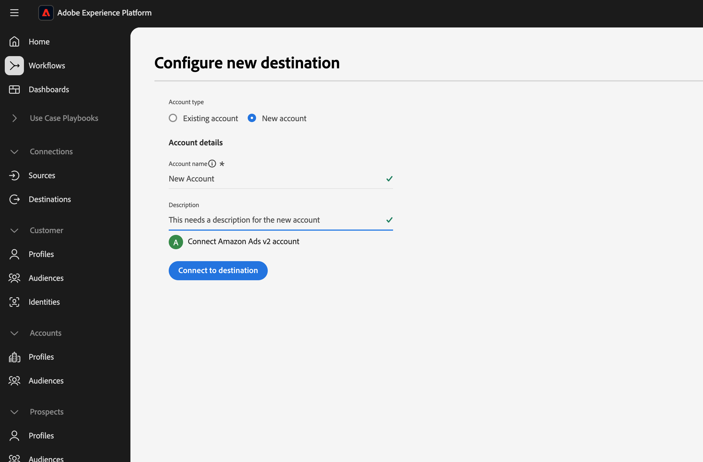
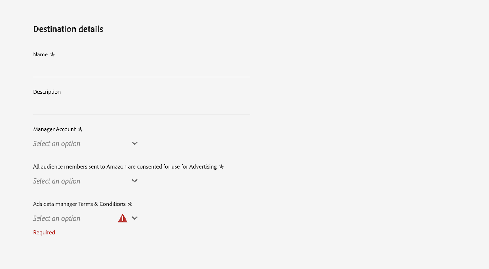

# Amazon Ads v2 연결 {#amazon-ads-v2}

## 개요 {#overview}

[!DNL Amazon Ads v2]을(를) 사용하면 광고주가 [!DNL Amazon Ads] 제품에서 대상 데이터를 효율적으로 수집, 관리, 활성화 및 재사용할 수 있습니다.

>[!IMPORTANT]
>
>[!DNL Amazon Ads v2]은(는) 모든 새 [!DNL Amazon Ads] 연결의 현재 대상입니다. 기존 [(레거시) [!DNL Amazon Ads]](./amazon-ads.md) 연결이 있는 경우 필요한 변경 없이 계속 작동합니다. [!DNL Amazon Ads v2]이(가) [!DNL Ads Data Manager]에 연결되어 확장된 ID 유형, 주소 관련 필드 및 [!DNL Amazon Ads] 제품 간 데이터 공유를 지원하므로 [(레거시) [!DNL Amazon Ads]](./amazon-ads.md)에 비해 타깃팅 및 대상 일치율이 향상됩니다.
>
>2026년 4월 말 이후에는 [!DNL Amazon Ads v2]의 이름이 [!DNL Amazon Ads]&#x200B;(으)로 바뀌고 기존 카드는 숨겨지며 카탈로그에 단일 대상 카드가 남습니다. 기존 레거시 데이터 흐름은 계속 작동하며 해당 날짜 이후에 **[!UICONTROL Browse]** 탭에서 관리할 수 있습니다.

[!DNL Amazon Ads v2]과(와) [!DNL Adobe Experience Platform] 통합은 대상 구성원을 [!DNL Amazon Ads]&#x200B;(으)로 수집하기 위한 직접 연결을 제공합니다. 업로드한 대상은 [!DNL Ads Data Manager (ADM)] 내의 [!DNL Amazon Ads] 콘솔에서 사용할 수 있습니다. [!DNL Ads Data Manager] 콘솔을 사용하여 다른 [!DNL Amazon Ads] 제품에서 데이터를 공유할 수 있습니다.

[!DNL Ads Data Manager]에 대한 자세한 내용은 다음을 참조하세요.

* [광고 데이터 관리자 - 콘솔 개요](https://advertising.amazon.com/API/docs/en-us/adm/1_ads-data-manager-console-overview)
* [광고 데이터 관리자 콘솔 사용](https://advertising.amazon.com/API/docs/en-us/adm/2_ads-data-manager-console)
* [광고 데이터 관리자의 계정 설정](https://advertising.amazon.com/API/docs/en-us/adm/2a_ads-data-manager_account_setup)

>[!IMPORTANT]
>
>이 대상 커넥터 및 설명서 페이지는 *[!DNL Amazon Ads]* 팀에서 만들고 유지 관리합니다. 문의 사항이나 업데이트 요청은 *`amc-support@amazon.com`.*&#x200B;에서 직접 문의하십시오.

## 사용 사례 {#use-cases}

[!DNL Amazon Ads v2] 대상을 사용하는 방법과 시기를 더 잘 이해할 수 있도록 [!DNL Adobe Experience Platform] 고객이 이 대상을 사용하여 해결할 수 있는 사용 사례의 예제를 소개합니다.

### 대상자 수집 및 활성화 {#activation-and-targeting}

운동복 브랜드는 [!DNL Amazon Ads]에서 관련 광고를 통해 기존 고객에게 연락하려고 합니다. 브랜드는 CRM의 고객 이메일 주소를 [!DNL Adobe Experience Platform]&#x200B;(으)로 수집하고, 자사 오프라인 데이터를 사용하여 대상을 빌드하고, [!DNL Amazon Ads] 대상을 통해 [!DNL Amazon Ads v2]&#x200B;(으)로 이러한 대상을 활성화할 수 있습니다. 활성화한 후 이러한 대상을 사용하여 [!DNL Amazon Ads] 인벤토리에서 해당 고객에게 광고를 타깃팅할 수 있으므로 브랜드가 알려진 고객을 다시 참여시키고 반복 구매를 유도하는 데 도움이 됩니다. 자세한 내용은 [데이터 관리](https://advertising.amazon.com/API/docs/en-us/adm/6_adm-manage-data)를 참조하세요.

## 전제 조건 {#prerequisites}

[!DNL Amazon Ads v2]과(와) [!DNL Adobe Experience Platform] 연결을 사용하려면 **[!DNL Amazon Ads Data Manager]**&#x200B;관리자 계정[을(를) 사용하여 ](https://advertising.amazon.com/help/G69CDSR9MNSWJH95)에 액세스할 수 있어야 합니다. 자세한 내용은 [Amazon 광고 데이터 관리자 시작하기](https://advertising.amazon.com/API/docs/en-us/adm/1_ads-data-manager-console-overview)를 참조하십시오.

### Amazon Ads Data Manager 약관에 동의 {#accept-terms}

[!DNL Amazon Ads v2] 대상을 구성하기 전에 [!DNL Amazon Ads] 계정에 로그인하고 [!DNL Ads Data Manager] 사용 약관에 동의하십시오. [!DNL Ads Data Manager] 내의 [!DNL Amazon Ads] 콘솔로 이동한 다음 메시지가 표시되면 약관에 동의합니다. 사용 약관에 동의하지 않으면 대상자가 [!DNL Amazon Ads]에 만들어지지 않습니다.

## 지원되는 ID {#supported-identities}

[!DNL Amazon Ads v2] 대상은 다음 ID의 활성화를 지원합니다. [ID](/help/identity-service/features/namespaces.md)에 대해 자세히 알아보세요.

| 대상 ID | 설명 | 고려 사항 |
|---|---|---|
| `phone` | SHA256 알고리즘으로 해시된 전화번호 | 일반 텍스트와 SHA256 해시된 전화 번호는 모두 [!DNL Adobe Experience Platform]에서 지원됩니다. 소스 필드에 해시되지 않은 특성이 포함되어 있는 경우 **[!UICONTROL Apply transformation]** 옵션을 선택하여 [!DNL Experience Platform]이(가) 활성화 시 데이터를 자동으로 해시하도록 합니다. |
| `email` | SHA256 알고리즘으로 해시된 이메일 주소(소문자) | [!DNL Adobe Experience Platform]은(는) 일반 텍스트와 SHA256 해시된 전자 메일 주소를 모두 지원합니다. 소스 필드에 해시되지 않은 특성이 포함되어 있는 경우 **[!UICONTROL Apply transformation]** 옵션을 선택하여 [!DNL Experience Platform]이(가) 활성화 시 데이터를 자동으로 해시하도록 합니다. |
| `firstname` | 사용자의 이름 | 일반 텍스트와 SHA256 해시 이름은 모두 [!DNL Adobe Experience Platform]에서 지원됩니다. 소스 필드에 해시되지 않은 특성이 포함되어 있는 경우 **[!UICONTROL Apply transformation]** 옵션을 선택하여 [!DNL Experience Platform]이(가) 활성화 시 데이터를 자동으로 해시하도록 합니다. |
| `lastname` | 사용자의 성 | 일반 텍스트와 SHA256 해시 성 모두 [!DNL Adobe Experience Platform]에서 지원됩니다. 소스 필드에 해시되지 않은 특성이 포함되어 있는 경우 **[!UICONTROL Apply transformation]** 옵션을 선택하여 [!DNL Experience Platform]이(가) 활성화 시 데이터를 자동으로 해시하도록 합니다. |
| `address` | 사용자의 주소 | 일반 텍스트와 SHA256 해시 거리는 모두 [!DNL Adobe Experience Platform]에서 지원됩니다. 소스 필드에 해시되지 않은 특성이 포함되어 있는 경우 **[!UICONTROL Apply transformation]** 옵션을 선택하여 [!DNL Experience Platform]이(가) 활성화 시 데이터를 자동으로 해시하도록 합니다. |
| `city` | 사용자의 구/군/시 | 일반 텍스트와 SHA256 해시 도시는 모두 [!DNL Adobe Experience Platform]에서 지원됩니다. 소스 필드에 해시되지 않은 특성이 포함되어 있는 경우 **[!UICONTROL Apply transformation]** 옵션을 선택하여 [!DNL Experience Platform]이(가) 활성화 시 데이터를 자동으로 해시하도록 합니다. |
| `state` | 사용자의 주 또는 시/도 | 일반 텍스트와 SHA256 해시 상태는 모두 [!DNL Adobe Experience Platform]에서 지원됩니다. 소스 필드에 해시되지 않은 특성이 포함되어 있는 경우 **[!UICONTROL Apply transformation]** 옵션을 선택하여 [!DNL Experience Platform]이(가) 활성화 시 데이터를 자동으로 해시하도록 합니다. |
| `zip` | 사용자의 우편 번호 | 일반 텍스트와 SHA256 해시 zip은 모두 [!DNL Adobe Experience Platform]에서 지원됩니다. 소스 필드에 해시되지 않은 특성이 포함되어 있는 경우 **[!UICONTROL Apply transformation]** 옵션을 선택하여 [!DNL Experience Platform]이(가) 활성화 시 데이터를 자동으로 해시하도록 합니다. |
| `countryCode` | 사용자 국가(2자 ISO 코드) | 일반 텍스트 입력을 지원합니다. |
| `experianId` | [!DNL Experian]에 의해 할당된 식별자 | 일반 텍스트 입력을 지원합니다. |
| `kantarId` | [!DNL Kantar]에 의해 할당된 식별자 | 일반 텍스트 입력을 지원합니다. |
| `liveRampId` | [!DNL LiveRamp]에 의해 할당된 식별자 | 일반 텍스트 입력을 지원합니다. |
| `maId` | 모바일 애플리케이션에서 할당한 식별자 | 일반 텍스트 입력을 지원합니다. |
| `merkleId` | [!DNL Merkle]에 의해 할당된 식별자 | 일반 텍스트 입력을 지원합니다. |
| `neustarId` | [!DNL Neustar]에 의해 할당된 식별자 | 일반 텍스트 입력을 지원합니다. |
| `realId` | 실제 ID ID 그래프에서 할당한 식별자 | 일반 텍스트 입력을 지원합니다. |
| `sambaTvId` | [!DNL Samba TV]에 의해 할당된 식별자 | 일반 텍스트 입력을 지원합니다. |

{style="table-layout:auto"}

## 지원되는 대상자 {#supported-audiences}

이 섹션에서는 이 대상으로 내보낼 수 있는 대상자 유형을 설명합니다.

| 대상자 원본 | 지원됨 | 설명 |
|---------|----------|----------|
| [!DNL Segmentation Service] | 예 | [!DNL Experience Platform] [세분화 서비스](/help/segmentation/home.md)를 통해 생성된 대상입니다. |
| 기타 모든 대상 원본 | 예 | 이 범주에는 [!DNL Segmentation Service]을(를) 통해 생성된 대상 외부의 모든 대상 출처가 포함됩니다. [다양한 대상 원본](/help/segmentation/ui/audience-portal.md#customize)에 대해 읽어 보십시오. 예를 들면 다음과 같습니다. <ul><li> CSV 파일에서 [(으)로 사용자 지정 업로드 대상 ](/help/segmentation/ui/audience-portal.md#import-audience)가져옴[!DNL Experience Platform],</li><li> 유사 대상, </li><li> 페더레이션 대상, </li><li> [!DNL Experience Platform]과(와) 같은 다른 [!DNL Adobe Journey Optimizer] 앱에서 생성된 대상, </li><li> 등. </li></ul> |

{style="table-layout:auto"}

대상 데이터 유형별 지원되는 대상:

| 대상 데이터 유형 | 지원됨 | 설명 | 사용 사례 |
|--------------------|-----------|-------------|-----------|
| [사람 대상](/help/segmentation/types/people-audiences.md) | 예 | 고객 프로필을 기반으로 마케팅 캠페인을 위해 특정 사용자 그룹을 타깃팅할 수 있습니다. | 빈번한 구매자, 장바구니 포기 |
| [계정 대상자](/help/segmentation/types/account-audiences.md) | 아니요 | 계정 기반 마케팅 전략을 위해 특정 조직 내의 개인을 타깃팅합니다. | B2B 마케팅 |
| [잠재 고객](/help/segmentation/types/prospect-audiences.md) | 아니요 | 아직 고객이 아니지만 타겟 대상자와 특성을 공유하는 개인을 타겟팅합니다. | 타사 데이터를 이용한 잠재 고객 확보 |
| [데이터 집합 내보내기](/help/catalog/datasets/overview.md) | 아니요 | [!DNL Adobe Experience Platform] 데이터 레이크에 저장된 구조화된 데이터의 컬렉션입니다. | 보고, 데이터 과학 워크플로 |

{style="table-layout:auto"}

## 내보내기 유형 및 빈도 {#export-type-frequency}

아래 표에서는 대상 내보내기 유형 및 빈도에 대해 설명합니다.

| 항목 | 유형 | 참고 |
| ---------|----------|---------|
| 내보내기 유형 | **[!UICONTROL Audience export]** | [!DNL Amazon Ads]에서 지원하는 식별자로 대상자의 모든 구성원을 내보내고 있습니다. |
| 내보내기 빈도 | **[!UICONTROL Streaming]** | 스트리밍 대상은 &quot;항상&quot; API 기반 연결입니다. [!DNL Experience Platform]의 대상자 업데이트가 즉시 [!DNL Ads Data Manager]&#x200B;(으)로 전송됩니다. |

{style="table-layout:auto"}

## 대상에 연결 {#connect}

>[!IMPORTANT]
>
>대상에 연결하려면 **[!UICONTROL View Destinations]** 및 **[!UICONTROL Manage Destinations]** [액세스 제어 권한](/help/access-control/home.md#permissions)이 필요합니다. [액세스 제어 개요](/help/access-control/ui/overview.md)를 읽거나 제품 관리자에게 문의하여 필요한 권한을 받으십시오.

이 대상에 연결하려면 [대상 구성 자습서](/help/destinations/ui/connect-destination.md)에 설명된 단계를 따르십시오. 대상 구성 워크플로에서 아래 두 섹션에 나열된 필드를 채웁니다.

### 대상으로 인증 {#authenticate}

대상에 인증하려면 필수 필드를 입력한 다음 **[!UICONTROL Connect to destination]**&#x200B;을(를) 선택하십시오.

* **[!UICONTROL Account name]**: 이 대상 계정을 식별하는 데 도움이 되는 이름을 입력하십시오. 이 기능은 동일한 대상에 대한 연결이 여러 개 있는 경우에 특히 유용합니다.
* **[!UICONTROL Description]**(선택 사항): 연결 목적 또는 관련 비즈니스 컨텍스트 등 사용자 또는 팀이 계정을 구분하는 데 도움이 되는 세부 정보를 추가합니다.

[!DNL Amazon Ads v2] 인터페이스로 리디렉션되었습니다. **[!UICONTROL Allow]**&#x200B;을(를) 선택하여 Amazon 계정에 로그인합니다.

인증 후 새 연결을 사용하여 [!DNL Adobe Experience Platform]&#x200B;(으)로 다시 리디렉션됩니다.

### 대상 세부 정보 입력 {#destination-details}

대상에 대한 세부 정보를 구성하려면 아래의 필수 및 선택 필드를 채우십시오. UI에서 필드 옆에 있는 별표는 필드가 필수임을 나타냅니다.

* **[!UICONTROL Name]**: 이 대상을 인식하는 이름입니다.
* **[!UICONTROL Description]**: 이 대상을 식별하는 데 도움이 되는 설명입니다.
* **[!UICONTROL Manager Account]**: 드롭다운의 대상 관리자 계정 ID.
* **[!UICONTROL All audience members sent to Amazon are consented for use for Advertising]**: 데이터 사용에 대한 동의(`GRANTED` 또는 `DENIED`)를 지정하십시오.
* **[!UICONTROL Ads data manager Terms & Conditions]**: [!DNL Amazon Ads] Data Manager 약관에 동의합니다. 자세한 내용은 [약관 동의](#accept-terms) 섹션을 참조하십시오.

### 경고 활성화 {#enable-alerts}

경고를 활성화하여 대상에 대한 데이터 흐름 상태에 대한 알림을 받을 수 있습니다. 목록에서 경고를 선택하여 데이터 흐름 상태에 대한 알림을 수신합니다. 경고에 대한 자세한 내용은 [UI를 사용하여 대상 경고 구독](/help/destinations/ui/alerts.md)에 대한 안내서를 참조하십시오.

대상 연결에 대한 세부 정보를 제공했으면 **[!UICONTROL Next]**&#x200B;을(를) 선택합니다.

## 이 대상으로 대상자 활성화 {#activate}

>[!IMPORTANT]
>
>* 데이터를 활성화하려면 **[!UICONTROL View Destinations]**, **[!UICONTROL Activate Destinations]**, **[!UICONTROL View Profiles]** 및 **[!UICONTROL View Segments]** [액세스 제어 권한](/help/access-control/home.md#permissions)이 필요합니다. [액세스 제어 개요](/help/access-control/ui/overview.md)를 읽거나 제품 관리자에게 문의하여 필요한 권한을 받으십시오.
>* ID를 내보내려면 **[!UICONTROL View Identity Graph]** [액세스 제어 권한](/help/access-control/home.md#permissions)이 필요합니다.   {width="100" zoomable="yes"}

이 대상으로 대상을 활성화하는 방법에 대한 지침은 [프로필 및 대상을 스트리밍 대상 내보내기 대상으로 활성화](/help/destinations/ui/activate-segment-streaming-destinations.md)를 참조하십시오.

### 필수 매핑 {#map}

[!DNL Amazon Ads v2] 대상을 사용하려면 성공적인 데이터 활성화를 위해 다음 매핑을 구성해야 합니다.

| 소스 필드 | 대상 필드 | 설명 |
|---------|----------|---------|
| `IdentityMap: Email_LC_SHA256` 또는 `IdentityMap: Email` | `Identity: email` | 소스 필드에 해시되지 않은 특성이 포함되어 있는 경우 **[!UICONTROL Apply transformation]** 옵션을 선택하여 [!DNL Experience Platform]이(가) 활성화 시 데이터를 자동으로 해시하도록 합니다. |
| `xdm: homeAddress.countryCode` | `Identity: countryCode` | 사용자 국가(2자 ISO 코드) |

### 매핑 모범 사례 {#mapping-best-practices}

자사 식별자(예: 전화 번호 및 주소)를 파트너가 제공한 식별자와 결합합니다. 이렇게 하면 [!DNL Amazon Ads]이(가) 대상을 일치시키는 동안 여러 ID 신호를 사용할 수 있으므로 일치율이 향상됩니다.

파트너가 제공한 식별자는 소스 데이터에 채워져 있을 때만 사용합니다. 매핑된 파트너 식별자 필드가 비어 있거나 지정된 프로필에 대해 존재하지 않는 경우, 대상 일치 시 이 필드는 무시되며 일치율에 기여하지 않습니다.

### 예시 {#examples}

* `kantarId` ID 데이터를 사용하여 빌드되거나 보강된 대상을 활성화할 때 [!DNL Kantar]을(를) 사용하십시오.
* 대상 데이터가 `merkleId` 관리 ID 솔루션에서 생성되는 경우 [!DNL Merkle]을(를) 사용합니다.
* 데이터가 `neustarId` ID 확인을 통해 연결된 경우 [!DNL Neustar]을(를) 사용합니다.
* `experianId` ID 데이터를 사용하여 보강된 대상에 [!DNL Experian]을(를) 사용합니다.
* `liveRampId` ID 확인을 사용하는 대상을 활성화할 때 [!DNL LiveRamp]을(를) 사용하십시오.
* `sambaTvId`에서 제공한 대상 데이터로 작업할 때 [!DNL Samba TV]을(를) 사용하십시오.

이러한 식별자는 일반적으로 각 파트너에서 일반 텍스트 식별자로 제공하며 해싱이 필요하지 않습니다.

## 데이터 내보내기 유효성 검사 {#exported-data}

활성화 후 **[!DNL Ads Data Manager]콘솔에서 대상 수집의 유효성을 검사하십시오**.

**[!UICONTROL Audiences]** → **[!UICONTROL Uploaded Sources]**(으)로 이동합니다. 대상자 수집 상태, 크기 및 오류 로그를 확인합니다. [ 설명서의 ](https://advertising.amazon.com/API/docs/en-us/adm/6_adm-manage-data)데이터 관리[ 및 ](https://advertising.amazon.com/API/docs/en-us/adm/7_adm-destinations)대상[!DNL Amazon Ads] 페이지에서 추가 유효성 검사 지침을 제공합니다.

## 데이터 사용 및 관리 {#data-usage-governance}

데이터를 처리할 때 모든 [!DNL Adobe Experience Platform] 대상이 데이터 사용 정책을 준수합니다. [!DNL Adobe Experience Platform]에서 데이터 거버넌스를 적용하는 방법에 대한 자세한 내용은 [데이터 거버넌스 개요](/help/data-governance/home.md)를 참조하십시오.

## 추가 리소스 {#additional-resources}

[!DNL Amazon Ads Data Manager]에 대한 자세한 내용은 다음 리소스를 참조하십시오.

* [Amazon 광고 데이터 관리자 개요](https://advertising.amazon.com/API/docs/en-us/adm/1_ads-data-manager-console-overview)
