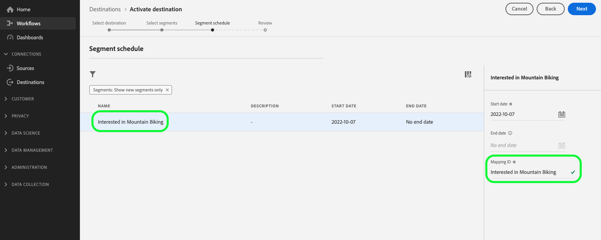

# [!DNL Microsoft Bing] 연결 {#bing-destination}

## 개요 {#overview}

사용 [!DNL Microsoft Bing] 프로필 데이터를 전체에 보낼 대상 [!DNL Microsoft Advertising Network], 포함 [!DNL Display Advertising], [!DNL Search], 및 [!DNL Native].

다음 [!DNL Microsoft Bing] 대상이 다음을 생성합니다. *[!DNL Custom Audiences]* Microsoft. 이러한 기능은 모두에서 사용할 수 있습니다. [!DNL Microsoft Search Network] 및 [!DNL Audience Network] ([!DNL Native] /[!DNL Display] /[!DNL Programmatic])에 나열되어 있습니다. [Microsoft Advertising 설명서](https://help.ads.microsoft.com/#apex/ads/en/56892/1-500).

프로필 데이터를 (으)로 보내려면 [!DNL Microsoft Bing], 먼저 대상에 연결해야 합니다.

## 사용 사례 {#use-cases}

마케터로서 다음으로 구성된 대상을 사용할 수 있기를 원합니다 [!DNL Microsoft Advertising IDs] 디스플레이 또는 검색 광고를 통해 사용자를 타겟팅하려면 [!DNL Microsoft Advertising] 채널.

## 지원되는 ID {#supported-identities}

[!DNL Microsoft Bing] 는 아래 표에 표시된 id를 기반으로 대상의 활성화를 지원합니다. 자세히 알아보기 [id](/help/identity-service/namespaces.md).

| 신원 | 설명 |
|---|---|
| 하녀 | Microsoft 광고 ID |

{style="table-layout:auto"}

## 지원되는 대상자 {#supported-audiences}

이 섹션에서는 이 대상으로 내보낼 수 있는 대상자 유형을 설명합니다.

| 대상자 원본 | 지원됨 | 설명 |
---------|----------|----------|
| [!DNL Segmentation Service] | ✓ 덧신 | Experience Platform을 통해 생성된 대상자 [세분화 서비스](../../../segmentation/home.md). |
| 사용자 정의 업로드 | ✓ | 대상 [가져옴](../../../segmentation/ui/overview.md#import-audience) csv 파일에서 Experience Platform으로 변환했습니다. |

{style="table-layout:auto"}

## 내보내기 유형 및 빈도 {#export-type-frequency}

**[!DNL Audience Export]** - 대상의 모든 멤버를 [!DNL Microsoft Bing] 대상.

대상 내보내기 유형 및 빈도에 대한 자세한 내용은 아래 표를 참조하십시오.

| 항목 | 유형 | 참고 |
---------|----------|---------|
| 내보내기 유형 | **[!UICONTROL 대상자 내보내기]** | 대상의 모든 구성원을 (으)로 내보내는 경우 [!DNL Microsoft Bing] 대상. |
| 내보내기 빈도 | **[!UICONTROL 스트리밍]** | 스트리밍 대상은 &quot;항상&quot; API 기반 연결입니다. 대상자 평가를 기반으로 Experience Platform에서 프로필이 업데이트되는 즉시 커넥터가 업데이트 다운스트림을 대상 플랫폼으로 전송합니다. 자세한 내용 [스트리밍 대상](/help/destinations/destination-types.md#streaming-destinations). |

{style="table-layout:auto"}

## 전제 조건 {#prerequisites}

>[!IMPORTANT]
>
>을(를) 사용하여 첫 번째 대상을 만들려는 경우 [!DNL Microsoft Bing] 및 이(가) 을(를) 활성화하지 않음 [ID 동기화 기능](https://experienceleague.adobe.com/docs/id-service/using/id-service-api/methods/idsync.html) 과거의 Experience Cloud ID 서비스(Adobe Audience Manager 또는 기타 애플리케이션 포함)에서 ID 동기화를 활성화하려면 Adobe 컨설팅 또는 고객 지원 센터에 문의하십시오. 이전에 을 설정한 경우 [!DNL Microsoft Bing] Audience Manager의 통합, 설정한 ID 동기화를 플랫폼으로 이월합니다.

대상을 구성할 때는 다음 정보를 제공해야 합니다.

* [!UICONTROL 계정 ID]: 사용자 [!DNL Bing Ads CID], 정수 형식.

## 대상에 연결 {#connect}

>[!IMPORTANT]
> 
>대상에 연결하려면 다음이 필요합니다. **[!UICONTROL 대상 관리]** [액세스 제어 권한](/help/access-control/home.md#permissions). 읽기 [액세스 제어 개요](/help/access-control/ui/overview.md) 필요한 권한을 얻으려면 제품 관리자에게 문의하십시오.

이 대상에 연결하려면 다음과같이 하십시오. [대상 구성 자습서](../../ui/connect-destination.md).

### 대상 세부 정보 입력 {#parameters}

While [설정 중](../../ui/connect-destination.md) 이 대상에는 다음 정보를 제공해야 합니다.

* **[!UICONTROL 이름]**: 나중에 이 대상을 인식할 수 있는 이름입니다.
* **[!UICONTROL 설명]**: 나중에 이 대상을 식별하는 데 도움이 되는 설명입니다.
* **[!UICONTROL 계정 ID]**: 사용자 [!DNL Bing Ads Customer ID] (CID). CID는 정수입니다. 로그인할 때 URL에 있습니다. [!DNL Microsoft Advertising].

### 경고 활성화 {#enable-alerts}

경고를 활성화하여 대상에 대한 데이터 흐름 상태에 대한 알림을 받을 수 있습니다. 목록에서 경고를 선택하여 데이터 흐름 상태에 대한 알림을 수신합니다. 경고에 대한 자세한 내용은 다음 안내서를 참조하십시오. [UI를 사용하여 대상 경고 구독](../../ui/alerts.md).

대상 연결에 대한 세부 정보를 제공했으면 을 선택합니다. **[!UICONTROL 다음]**.

## 이 대상으로 대상자 활성화 {#activate}

>[!CONTEXTUALHELP]
>id="platform_destinations_bing_mapping_id"
>title="ID 매핑"
>abstract="선택한 대상자를 매핑할 숫자 Bing 세그먼트 ID를 입력합니다. 제공된 [!UICONTROL 매핑 ID] 가 Bing 대상의 대상자 ID와 일치하지 않는 경우 Bing 계정에 예상되는 대상자 데이터가 표시되지 않습니다."

>[!IMPORTANT]
> 
>데이터를 활성화하려면 **[!UICONTROL 대상 관리]**, **[!UICONTROL 대상 활성화]**, **[!UICONTROL 프로필 보기]**, 및 **[!UICONTROL 세그먼트 보기]** [액세스 제어 권한](/help/access-control/home.md#permissions). 읽기 [액세스 제어 개요](/help/access-control/ui/overview.md) 필요한 권한을 얻으려면 제품 관리자에게 문의하십시오.

다음을 참조하십시오 [대상 데이터를 스트리밍 대상 내보내기 대상으로 활성화](../../ui/activate-segment-streaming-destinations.md) 이 대상에 대한 대상자 활성화에 대한 지침을 참조하십시오.

다음에서 [대상자 일정](../../ui/activate-segment-streaming-destinations.md#scheduling) 단계에서는 대상 이름을에서 수동으로 매핑해야 합니다 [!UICONTROL 매핑 ID] 필드. 이렇게 하면 대상 메타데이터를에 올바르게 전달할 수 있습니다 [!DNL Bing].

## 내보낸 데이터 {#exported-data}

데이터가 성공적으로 로 내보내졌는지 확인하려면 [!DNL Microsoft Bing] 대상, 다음을 확인: [!DNL Microsoft Bing Ads] 계정입니다. 활성화가 성공하면 계정에 대상자가 채워집니다.
