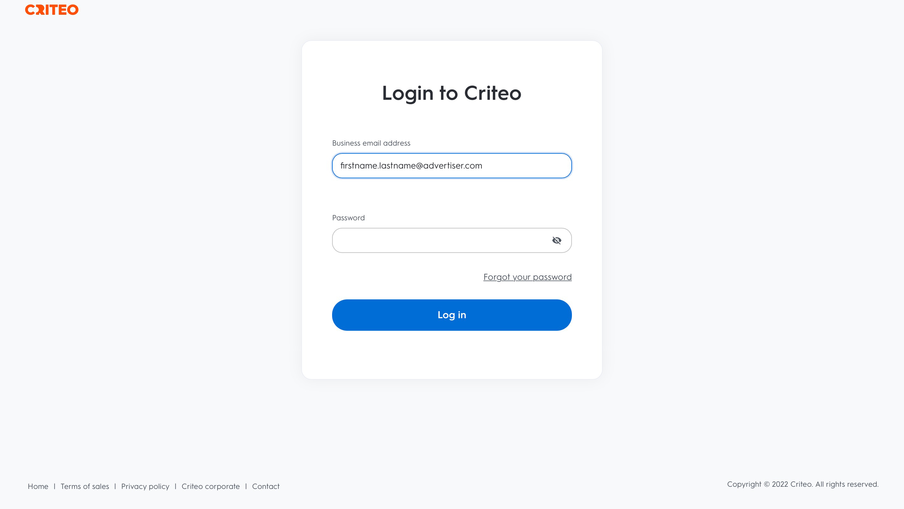
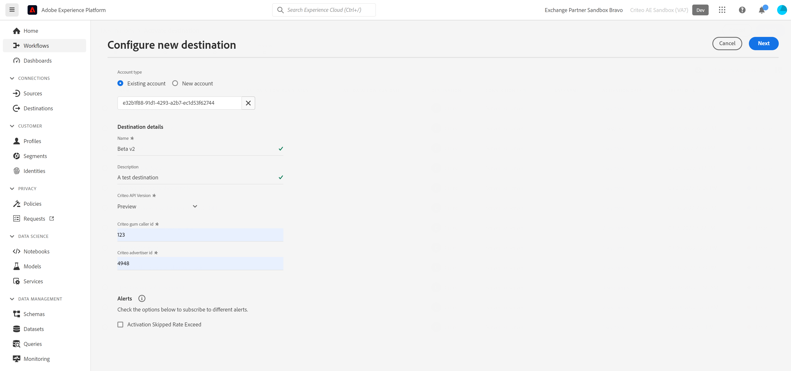

# 크리테오 연결

## 개요 {#overview}

>[!IMPORTANT]
>
>이 대상 커넥터 및 설명서 페이지는 Criteo에서 만들고 유지 관리합니다. 문의 사항이나 업데이트 요청이 있으면 Criteo에게 직접 [여기](mailto:criteoTechnicalPartnerships@criteo.com)로 문의하십시오.

Criteo는 신뢰할 수 있고 영향력 있는 광고를 통해 개방형 인터넷을 이용하는 모든 소비자에게 더욱 풍부한 경험을 제공합니다. Criteo는 세계 최대 규모의 상거래 데이터 세트와 동급 최고의 AI를 바탕으로 쇼핑 여정 전반의 각 터치포인트를 개인화하여 적절한 시점에 적절한 광고를 고객에게 전달합니다.

## 전제 조건 {#prerequisites}

* [Criteo 관리 센터](https://marketing.criteo.com)에 관리자 계정이 있어야 합니다.
* Criteo 광고주 ID가 필요합니다(이 ID가 없는 경우 Criteo 담당자에게 문의).
* [!DNL GUM caller ID]을(를) 식별자로 사용하려면 [!DNL GUM ID]을(를) 제공해야 합니다.

## 제한 사항 {#limitations}

* Criteo는 해시된 일반 텍스트 [!DNL SHA-256] 이메일만 허용합니다(보내기 전에 [!DNL SHA-256]&#x200B;(으)로 변환됨). PII(개인 이름 또는 전화 번호와 같은 개인 식별 정보)는 보내지 마십시오.
* Criteo는 클라이언트가 제공할 식별자가 하나 이상 필요합니다. [!DNL GUM ID]은(는) 더 나은 일치율에 기여하므로 해시된 이메일보다 식별자로 우선 순위를 지정합니다.


## 지원되는 ID {#supported-identities}

크리터는 아래 표에 설명된 ID 활성화를 지원합니다. [ID](https://experienceleague.adobe.com/docs/experience-platform/identity/namespaces.html#getting-started)에 대해 자세히 알아보세요.

| 대상 ID | 설명 | 고려 사항 |
| --- | --- | --- |
| `email_sha256` | SHA-256 알고리즘으로 해시된 이메일 주소 | [!DNL Adobe Experience Platform]은(는) 일반 텍스트와 SHA-256 해시된 이메일 주소를 모두 지원합니다. 소스 필드에 해시되지 않은 특성이 포함된 경우 [!UICONTROL Apply transformation] 옵션을 선택하여 Experience Platform이 활성화 시 데이터를 자동으로 해시하도록 합니다. |
| `gum_id` | 기준 [!DNL GUM] 쿠키 식별자 | [!DNL GUM IDs]을(를) 사용하면 클라이언트가 사용자 식별 시스템과 크리터의 사용자 식별([!DNL UID]) 간에 서신을 유지할 수 있습니다. 식별자 유형이 `gum_id`인 경우 추가 매개 변수인 [!DNL GUM Caller ID]도 포함되어야 합니다. 필요한 경우 해당 [!DNL GUM Caller ID]을(를) 위해 Criteo 계정 팀에 연락하거나 이 [!DNL GUM ID] 동기화에 대한 자세한 정보를 얻으십시오. |

## 지원되는 대상자 {#supported-audiences}

이 섹션에서는 이 대상으로 내보낼 수 있는 대상자 유형을 설명합니다.

| 대상자 원본 | 지원됨 | 설명 |
|---------|----------|----------|
| [!DNL Segmentation Service] | 예 | Experience Platform [세그먼테이션 서비스](../../../segmentation/home.md)를 통해 생성된 대상입니다. |
| 기타 모든 대상 원본 | 아니요 | 이 범주에는 [!DNL Segmentation Service]을(를) 통해 생성된 대상 외부의 모든 대상 출처가 포함됩니다. [다양한 대상 원본](/help/segmentation/ui/audience-portal.md#customize)에 대해 읽어 보십시오. 예를 들면 다음과 같습니다. <ul><li> CSV 파일에서 Experience Platform으로 사용자 지정 업로드 대상 [가져옴](../../../segmentation/ui/audience-portal.md#import-audience),</li><li> 유사 대상, </li><li> 페더레이션 대상, </li><li> [!DNL Adobe Journey Optimizer]과(와) 같은 다른 Experience Platform 앱에서 생성된 대상, </li><li> 등. </li></ul> |

{style="table-layout:auto"}


대상 데이터 유형별 지원되는 대상:

| 대상 데이터 유형 | 지원됨 | 설명 | 사용 사례 |
|--------------------|-----------|-------------|-----------|
| [사람 대상](/help/segmentation/types/people-audiences.md) | 예 | 고객 프로필을 기반으로 마케팅 캠페인을 위해 특정 사용자 그룹을 타깃팅할 수 있습니다. | 빈번한 구매자, 장바구니 포기 |
| [계정 대상자](/help/segmentation/types/account-audiences.md) | 아니요 | 계정 기반 마케팅 전략을 위해 특정 조직 내의 개인을 타깃팅합니다. | B2B 마케팅 |
| [잠재 고객](/help/segmentation/types/prospect-audiences.md) | 아니요 | 아직 고객이 아니지만 타겟 대상자와 특성을 공유하는 개인을 타겟팅합니다. | 타사 데이터를 이용한 잠재 고객 확보 |
| [데이터 집합 내보내기](/help/catalog/datasets/overview.md) | 아니요 | [!DNL Adobe Experience Platform] 데이터 레이크에 저장된 구조화된 데이터의 컬렉션입니다. | 보고, 데이터 과학 워크플로 |

{style="table-layout:auto"}


## 내보내기 유형 및 빈도 {#export-type-frequency}

대상 내보내기 유형 및 빈도에 대한 자세한 내용은 아래 표를 참조하십시오.

| 항목 | 유형 | 참고 |
| --- | --- | --- |
| 내보내기 유형 | 대상자 내보내기 | [!DNL Criteo] 대상에 사용된 식별자(이름, 전화번호 또는 기타)를 사용하여 대상자의 모든 구성원을 내보내고 있습니다. |
| 내보내기 빈도 | 스트리밍 | 스트리밍 대상은 &quot;항상&quot; API 기반 연결입니다. 대상자 평가를 기반으로 Experience Platform에서 프로필이 업데이트되는 즉시 커넥터가 업데이트 다운스트림을 대상 플랫폼으로 전송합니다. [스트리밍 대상](../../destination-types.md#streaming-destinations)에 대해 자세히 알아보세요. |

## 사용 사례 {#use-cases}

[!DNL Criteo] 대상을 사용하는 방법을 더 잘 이해할 수 있도록 [!DNL Adobe Experience Platform] 고객이 [!DNL Criteo]을(를) 통해 달성할 수 있는 몇 가지 목표가 있습니다.

### 사용 사례 1 : 트래픽 가져오기 {#use-case-1}

관련 제품 오퍼와 유연한 크리에이티브를 통해 비즈니스를 선보일 수 있습니다. 지능형 제품 추천을 사용하면 광고는 방문 및 참여를 트리거할 가능성이 가장 높은 제품을 자동으로 표시합니다. 유연한 타깃팅을 사용하면 Criteo의 상거래 데이터 세트 또는 고유한 잠재 고객 목록 및 Adobe CDP 세그먼트에서 대상을 구축할 수 있습니다.

### 사용 사례 2 : 웹 사이트 전환 증가 {#use-case-2}

방문자가 웹 사이트를 떠날 때 다음 위치에 관계없이 특별 거래와 매우 연관성 있는 오퍼를 표시하여 전환을 늘리는 리타겟팅 광고에서 누락된 내용을 상기하십시오. Adobe CDP 대상자를 연결하여 기존 고객을 다시 참여시키거나 가장 충성도가 높은 쇼핑객과 유사한 소비자를 타겟팅합니다.

## 크리테오에 연결 {#connect}

>[!IMPORTANT]
>
>대상에 연결하려면 **[!UICONTROL View Destinations]** 및 **[!UICONTROL Manage Destinations]** [액세스 제어 권한](/help/access-control/home.md#permissions)이 필요합니다. [액세스 제어 개요](/help/access-control/ui/overview.md)를 읽거나 제품 관리자에게 문의하여 필요한 권한을 받으십시오.

이 대상에 연결하려면 [대상 구성 자습서](../../ui/connect-destination.md)에 설명된 단계를 따르십시오.

### 크리테오 인증 {#authenticate}

연결하는 단계는 다음과 같습니다.

1. [!DNL Adobe Experience Platform]에 로그인하고 Criteo 대상에 연결합니다.

   

1. 연결을 승인하려면 Criteo로 리디렉션됩니다. 먼저 크리테오 자격 증명으로 로그인해야 할 수 있습니다.

   

   

   


### 연결 매개변수 {#connection-parameters}

대상에 인증한 후 다음 연결 매개 변수를 입력하십시오.



| 필드 | 설명 | 필수 여부 |
| --- | --- | --- |
| 이름 | 나중에 이 대상을 인식하는 데 도움이 되는 이름입니다. 여기에서 선택한 이름은 크리테오 관리 센터에서 [!DNL Audience] 이름이 되며 이후 단계에서 수정할 수 없습니다. | 예 |
| 설명 | 나중에 이 대상을 식별하는 데 도움이 되는 설명입니다. | 아니요 |
| 광고주 ID | 조직의 크리테오 광고주 ID. 이 정보를 얻으려면 크리터 계정 관리자에게 문의하십시오. | 예 |
| 크리테오 [!DNL GUM caller ID] | 조직의 [!DNL GUM Caller ID]. 필요한 경우 해당 [!DNL GUM Caller ID]을(를) 위해 Criteo 계정 팀에 연락하거나 이 [!DNL GUM] 동기화에 대한 자세한 정보를 얻으십시오. | 예. [!DNL GUM ID]이(가) 식별자로 제공될 때마다 |

### 경고 활성화 {#enable-alerts}

경고를 활성화하여 대상에 대한 데이터 흐름 상태에 대한 알림을 받을 수 있습니다. 목록에서 경고를 선택하여 데이터 흐름 상태에 대한 알림을 수신합니다. 경고에 대한 자세한 내용은 [UI를 사용하여 대상 경고 구독](../../ui/alerts.md)에 대한 안내서를 참조하십시오.

대상 연결에 대한 세부 정보를 제공했으면 **[!UICONTROL Next]**&#x200B;을(를) 선택합니다.

## 이 대상으로 대상자 활성화 {#activate-segments}

>[!IMPORTANT]
>
>* 데이터를 활성화하려면 **[!UICONTROL View Destinations]**, **[!UICONTROL Activate Destinations]**, **[!UICONTROL View Profiles]** 및 **[!UICONTROL View Segments]** [액세스 제어 권한](/help/access-control/home.md#permissions)이 필요합니다. [액세스 제어 개요](/help/access-control/ui/overview.md)를 읽거나 제품 관리자에게 문의하여 필요한 권한을 받으십시오.
>* *ID*&#x200B;을(를) 내보내려면 **[!UICONTROL View Identity Graph]** [액세스 제어 권한](/help/access-control/home.md#permissions)이 필요합니다. <br> {width="100" zoomable="yes"}

이 대상으로 대상을 활성화하는 방법에 대한 지침은 [프로필 및 대상을 스트리밍 대상 내보내기 대상으로 활성화](../../ui/activate-segment-streaming-destinations.md)를 참조하십시오.

## 내보낸 데이터 {#exported-data}

내보낸 대상자는 [크리테오 관리 센터](https://marketing.criteo.com/audience-manager/dashboard)에서 볼 수 있습니다.

[!DNL Criteo] 연결에서 받은 사용자 프로필 추가 요청 본문은 다음과 유사합니다.

```json
{
  "data": {
    "type": "ContactlistWithUserAttributesAmendment",
    "attributes": {
      "operation": "add",
      "identifierType": "gum",
      "gumCallerId": "123",
      "identifiers": [
        {
          "identifier": "456",
          "attributes": [
            { "key": "ctoid_GumCaller", "value": "123" },
            { "key": "ctoid_Gum", "value": "456" },
            {
              "key": "ctoid_HashedEmail",
              "value": "98833030dc03751f2b2c1a0017078975fdae951aa6908668b3ec422040f2d4be"
            }
          ]
        }
      ]
    }
  }
}
```

[!DNL Criteo] 연결에서 받은 사용자 프로필 제거의 요청 본문은 다음과 유사합니다.

```json
{
  "data": {
    "type": "ContactlistWithUserAttributesAmendment",
    "attributes": {
      "operation": "remove",
      "identifierType": "gum",
      "gumCallerId": "123",
      "identifiers": [
        {
          "identifier": "456",
          "attributes": [
            { "key": "ctoid_GumCaller", "value": "123" },
            { "key": "ctoid_Gum", "value": "456" },
            {
              "key": "ctoid_HashedEmail",
              "value": "98833030dc03751f2b2c1a0017078975fdae951aa6908668b3ec422040f2d4be"
            }
          ]
        }
      ]
    }
  }
}
```

## 데이터 사용 및 관리 {#data-usage}

데이터를 처리할 때 모든 [!DNL Adobe Experience Platform] 대상이 데이터 사용 정책을 준수합니다. [!DNL Adobe Experience Platform]에서 데이터 거버넌스를 적용하는 방법에 대한 자세한 내용은 [데이터 거버넌스 개요](https://experienceleague.adobe.com/docs/experience-platform/data-governance/home.html?lang=ko)를 참조하십시오.

## 추가 리소스 {#additional-resources}

* [크리테오 도움말 센터](https://help.criteo.com/kb/en)
* [크리테오 개발자 포털](https://developers.criteo.com)
