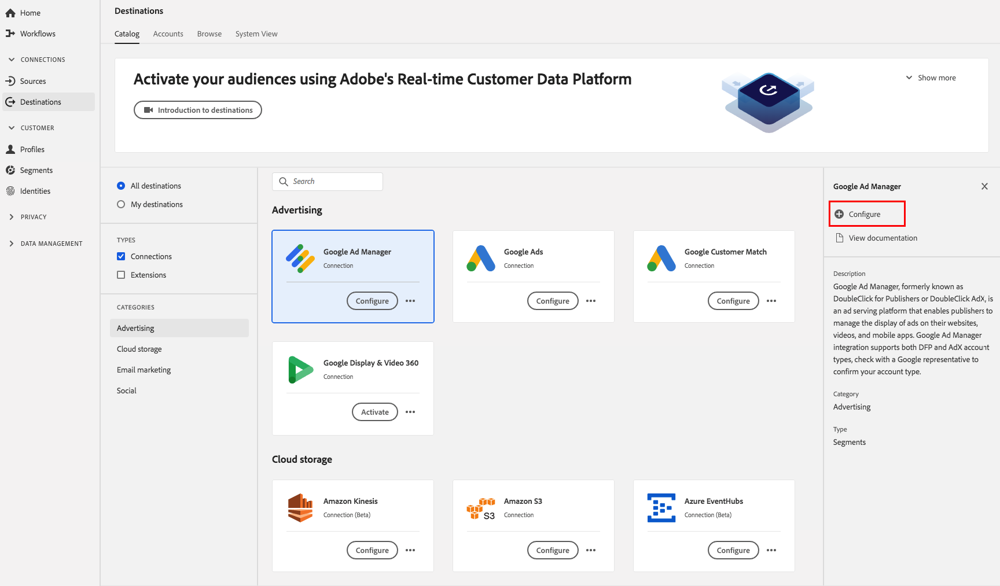

# [!DNL Google Ad Manager Destination]

## 개요

[!DNL Google Ad Manager]이전에 출판업체 [!DNL DoubleClick] 또는 [!DNL DoubleClick AdX]로 알려진 광고 서비스 플랫폼으로 출판업체는 자사 웹 사이트, 비디오 및 모바일 앱을 통해 광고 표시를 관리할 수 [!DNL Google] 있는 수단을 제공합니다.

## 대상 사양

대상에 대한 다음 세부 사항을 [!DNL Google Ad Manager] 참고하십시오.

* 다음 ID를 [대상으로](../../../identity-service/namespaces.md) 보낼 수 [!DNL Google Ad Manager] 있습니다. **Google 쿠키 ID, IDFA, GAID, Roku ID, Microsoft ID, Amazon Fire TV ID**.
* 활성화된 대상은 [!DNL Google] 플랫폼에서 프로그래밍 방식으로 생성됩니다.
* 현재 실시간 CDP에는 성공적인 활성화를 검증하는 측정 지표가 포함되어 있지 않습니다. 통합을 확인하고 대상 타깃팅 크기를 이해하려면 Google의 대상 수를 참조하십시오.

>[!IMPORTANT]
>
>Experience Cloud ID 서비스 [!DNL Google Ad Manager] 에서 이전에 [ID 동기화 기능을](https://experienceleague.adobe.com/docs/id-service/using/id-service-api/methods/idsync.html) 활성화하지 않은 상태로 첫 번째 대상을 만들려는 경우(Audience Manager 또는 다른 응용 프로그램 포함) Adobe 컨설팅 또는 고객 지원 센터에 연락하여 ID 동기화를 활성화하십시오. 이전에 Audience Manager에서 [!DNL Google] 통합을 설정한 경우 설정한 ID 시크는 실시간 CDP로 전달됩니다.

### 내보내기 유형 {#export-type}

**세그먼트 내보내기** - 세그먼트(대상)의 모든 멤버를 Google 대상으로 내보냅니다.

## 전제 조건

### 허용 목록

>[!NOTE]
>
>실시간 CDP에서 첫 번째 [!DNL Google Ad Manager] 대상을 설정하기 전에 허용 목록이 필수입니다. 대상을 만들기 전에 아래에 설명된 허용 목록 프로세스가 완료되었는지 [!DNL Google] 확인하십시오.

실시간 CDP에서 [!DNL Google Ad Manager] 대상을 생성하기 전에 허용된 데이터 공급자 목록에 Adobe [!DNL Google] 가 포함될 수 있도록 문의하고 허용 목록에 계정을 추가할 수 있도록 연락해야 합니다. 연락처 [!DNL Google] 와 다음 정보를 제공합니다.

* **계정 ID** :adobe 계정 ID입니다 [!DNL Google]. 이 ID를 얻으려면 Adobe 고객 지원 센터 또는 Adobe 담당자에게 문의하십시오.
* **고객 ID** :adobe 고객 계정 ID입니다 [!DNL Google]. 이 ID를 얻으려면 Adobe 고객 지원 센터 또는 Adobe 담당자에게 문의하십시오.
* **네트워크 ID** :이 계정은 [!DNL Google Ad Manager]
* **대상 링크 ID** :이 계정은 [!DNL Google Ad Manager]
* 계정 유형. Google 또는 AdX 구매자의 DFP.

## 대상 구성

[ **[!UICONTROL 연결]** ] > **[!UICONTROL 대상]**&#x200B;에서 **[!DNL Google Ad Manager]**&#x200B;를 선택하고 구성을 **[!UICONTROL 선택합니다]**.

>[!NOTE]
>
>이 대상과의 연결이 이미 있는 경우 대상 카드에 **[!UICONTROL 활성화]** 단추가 표시됩니다. 활성화 및 구성 **[!UICONTROL 의 차이에 대한 자세한]****[!UICONTROL 내용은 대상 작업 공간 설명서의]**&#x200B;카탈로그 [섹션을](../../ui/destinations-workspace.md#catalog) 참조하십시오.

대상 **만들기 작업** 과정의 설정 단계에서 대상에 대한 [!UICONTROL 기본 정보] 를 입력합니다.

* **[!UICONTROL 이름]**:이 대상에 대한 기본 이름을 입력합니다.
* **[!UICONTROL 설명]**:선택 사항. 예를 들어 이 대상을 사용하는 캠페인을 언급할 수 있습니다.
* **[!UICONTROL 계정 유형]**:Google의 계정에 따라 옵션을 선택합니다.
   * 게시자 `DFP by Google` 에 [!DNL DoubleClick] 사용
   * 사용 `AdX buyer` 대상 [!DNL Google AdX]
* **[!UICONTROL 계정 ID]**:계정 ID를 입력합니다 [!DNL Google]. 네트워크 ID 또는 대상 링크 ID일 수 있습니다. 일반적으로 8자리 ID입니다.
* **[!UICONTROL 마케팅 활용 사례]**:마케팅 사용 사례에서는 데이터를 대상으로 내보내려는 의도를 나타냅니다. Adobe에서 정의한 마케팅 사용 사례에서 선택하거나 고유한 마케팅 사용 사례를 만들 수 있습니다. 마케팅 활용 사례에 대한 자세한 내용은 실시간 CDP의 [데이터 거버넌스](../../../rtcdp/privacy/data-governance-overview.md#destinations) 페이지를 참조하십시오. 개별 Adobe에서 정의한 마케팅 사용 사례에 대한 자세한 내용은 [데이터 사용 정책 개요를 참조하십시오](../../../data-governance/policies/overview.md#core-actions).

>[!NOTE]
>
>대상을 설정할 때 [!DNL Google Ad Manager] 귀하의 [!DNL Google Account Manager] 또는 Adobe 담당자에게 연락하여 보유하고 있는 계정 유형을 파악하십시오.

## 세그먼트 활성화 [!DNL Google Ad Manager]

세그먼트를 활성화할 방법에 대한 지침 [!DNL Google Ad Manager]은 대상에 [데이터 활성화를 참조하십시오](../../ui/activate-destinations.md).

## 내보낸 데이터

데이터를 대상으로 성공적으로 내보냈는지 확인하려면 [!DNL Google Ad Manager] [!DNL Google Ad Manager] 계정을 확인하십시오. 정품 인증이 성공적으로 완료되면 사용자의 계정에 대상이 채워집니다.