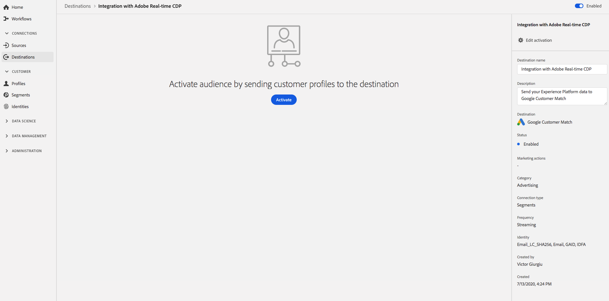
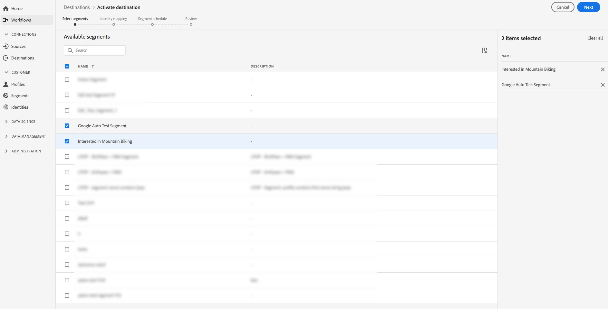

# [!DNL Google Customer Match] 연결

[Google Customer ](https://support.google.com/google-ads/answer/6379332?hl=en) Match를 사용하면 온라인 및 오프라인 데이터를 사용하여 다음과 같이 Google의 소유 및 운영 자산에서 고객에게 도달하고 다시 참여할 수 있습니다. [!DNL Search],  [!DNL Shopping],  [!DNL Gmail]및  [!DNL YouTube]을 참조하십시오.

## 사용 사례

다음은 Adobe Experience Platform 고객이 이 기능을 사용하여 해결할 수 있는 샘플 사용 사례입니다. [!DNL Google Customer Match] 대상을 사용하는 방법과 시기를 이해하는 데 도움이 됩니다.

### 사용 사례 #1

운동복 브랜드 기업은 [!DNL Google Search] 및 [!DNL Google Shopping]을 통해 기존 고객에게 도달하여 과거 구매 및 검색 내역을 기반으로 오퍼와 항목을 개인화하고자 합니다. 의류 브랜드는 자신의 CRM에서 Experience Platform으로 이메일 주소를 인제스트하고, 자체 오프라인 데이터에서 세그먼트를 작성하고, 이러한 세그먼트를 [!DNL Search] 및 [!DNL Shopping]에서 사용할 [!DNL Google Customer Match]으로 보내 광고 지출을 최적화할 수 있습니다.

### 사용 사례 #2

한 유명 기술 회사가 방금 새 휴대폰을 출시했다. 이 새로운 전화 모델을 홍보하기 위한 노력의 일환으로, 그들은 전화를 이전 모델을 소유하고 있는 고객에게 전화기의 새로운 기능과 기능에 대한 인식을 높이고자 노력하고 있다.

이 릴리스를 홍보하기 위해 CRM 데이터베이스의 이메일 주소를 식별자로 사용하여 Experience Platform으로 업로드합니다. 세그먼트는 이전 전화 모델을 소유하고 있는 고객을 기반으로 생성되어 [!DNL Google Customer Match]으로 전송되므로 현재 고객, 이전 전화 모델을 보유한 고객 및 [!DNL YouTube]에 있는 유사한 고객을 타깃팅할 수 있습니다.

## 대상 세부 사항 {#destination-specs}

### [!DNL Google Customer Match] 대상 {#data-governance}에 대한 데이터 거버넌스

Experience Platform의 대상은 대상 플랫폼으로 전송되거나 수신되는 데이터에 대한 특정 규칙 및 의무를 가질 수 있습니다. 데이터의 제한 및 의무와 Adobe Experience Platform 및 대상 플랫폼에서 해당 데이터를 사용하는 방법에 대한 책임은 귀하에게 있습니다. Adobe Experience Platform은 이러한 데이터 사용 의무 사항 중 일부를 관리하는 데 도움이 되는 데이터 관리 툴을 제공합니다. [데이터 거버넌스 툴 및 정책에 대한 ](../../..//data-governance/labels/overview.md) 자세한 내용을 살펴보십시오.

### 내보내기 유형 및 ID {#export-type}

**세그먼트 내보내기**  - 식별자(이름, 전화 번호 등)를 사용하여 세그먼트(대상)의 모든 구성원을 내보냅니다. [!DNL Google Customer Match] 대상에 사용됨

**ID**  - Google에서 원시 또는 해시된 이메일을 고객 ID로 사용할 수 있습니다.

### [!DNL Google Customer Match] 계정 전제 조건  {#google-account-prerequisites}

Experience Platform에서 [!DNL Google Customer Match] 대상을 설정하기 전에 [Google 지원 문서](https://support.google.com/google-ads/answer/6299717)에 설명된 대로 [!DNL Customer Match] 사용에 대한 Google의 정책을 읽고 따르도록 하십시오.

### 허용 목록 {#allowlist}

>[!NOTE]
>
>Experience Platform에서 첫 번째 [!DNL Google Customer Match] 대상을 설정하기 전에 Google 허용 목록에 추가해야 합니다. 대상을 만들기 전에 아래에 설명된 허용 목록 프로세스가 Google에서 완료되었는지 확인하십시오.

Experience Platform에서 [!DNL Google Customer Match] 대상을 만들기 전에 Google에 문의하고 [고객 일치 파트너 사용]의 허용 목록 지침을 따라 Google 설명서에 있는 데이터](https://support.google.com/google-ads/answer/7361372?hl=en&amp;ref_topic=6296507)를 업로드해야 합니다.

또한 Google의 [User_ID](https://developers.google.com/adwords/api/docs/guides/remarketing#customer_match_with_email_address_address_or_user_id)을 사용하여 데이터를 업로드할 계획인 경우 계정을 추가해야 하는 두 번째 Google 허용 목록이 있습니다. 허용 목록에 추가되어 있는지 확인하려면 Google 계정 관리자에게 문의하십시오.

### 요구 사항 {#id-matching-requirements} 일치하는 ID

[!DNL Google] 는 PII(개인 식별 정보)가 명확하게 전송되지 않도록 요구합니다. 따라서 [!DNL Google Customer Match]에 대해 활성화된 대상은 이메일 주소 또는 전화 번호와 같은 *해시된* 식별자에서 키잉할 수 있습니다.

Adobe Experience Platform에 인제스트하는 ID 유형에 따라 해당 요구 사항을 준수해야 합니다.

#### 전화 번호 해싱 요구 사항 {#phone-number-hashing-requirements}

[!DNL Google Customer Match]에는 전화 번호를 활성화하는 두 가지 방법이 있습니다.

* **원시 전화 번호 인제스트**:형식의 Raw 전화 번호를  [!DNL E.164] 인제스트할 수  [!DNL Platform]있으며 활성화하면 자동으로 해시됩니다. 이 옵션을 선택하는 경우 원시 전화 번호를 항상 `Phone_E.164` 네임스페이스로 인제스트해야 합니다.
* **해시된 전화 번호** 인제스트:수신 전에 전화 번호를 사전에 해시 처리할 수 있습니다 [!DNL Platform]. 이 옵션을 선택하는 경우 해시 처리된 전화 번호를 항상 `PHONE_SHA256_E.164` 네임스페이스로 인제스트해야 합니다.

>[!NOTE]
>
>`Phone` 네임스페이스로 인제스트된 전화 번호는 [!DNL Google Customer Match]에서 활성화할 수 없습니다.

#### 전자 메일 해싱 요구 사항 {#hashing-requirements}

이메일 주소를 Adobe Experience Platform으로 인제스트하기 전에 해시하도록 선택하거나, Experience Platform에서 지워진 이메일 주소를 사용하여 작업하도록 선택하고 알고리즘에서 활성화를 처리하도록 할 수 있습니다.

Google의 해시 요구 사항 및 기타 활성화 제한 사항에 대한 자세한 내용은 Google 설명서의 다음 섹션을 참조하십시오.

* [[!DNL Customer Match] 이메일 주소, 주소 또는 사용자 ID 사용](https://developers.google.com/adwords/api/docs/guides/remarketing#customer_match_with_email_address_address_or_user_id)
* [[!DNL Customer Match] 고려 사항](https://developers.google.com/adwords/api/docs/guides/remarketing#customer_match_considerations)
* [전화 번호와 고객 일치](https://developers.google.com/adwords/api/docs/guides/remarketing#customer_match_with_phone_number)
* [모바일 장치 ID와 고객 일치](https://developers.google.com/adwords/api/docs/guides/remarketing#customer_match_with_mobile_device_ids)

Experience Platform에서 이메일 주소 인제스트에 대한 자세한 내용은 [일괄 처리 통합 개요](../../../ingestion/batch-ingestion/overview.md) 및 [스트리밍 통합 개요](../../../ingestion/streaming-ingestion/overview.md)를 참조하십시오.

직접 이메일 주소를 해시하도록 선택한 경우 위의 링크에 설명된 Google의 요구 사항을 따라야 합니다.

#### 사용자 정의 네임스페이스 사용 {#custom-namespaces}

`User_ID` 네임스페이스를 사용하여 데이터를 Google에 보내려면 [!DNL gTag]을(를) 사용하여 자체 식별자를 동기화해야 합니다. 자세한 내용은 [Google 공식 문서](https://support.google.com/google-ads/answer/9199250)를 참조하십시오.

<!-- Data from unhashed namespaces is automatically hashed by [!DNL Platform] upon activation.

Attribute source data is not automatically hashed. When your source field contains unhashed attributes, check the **[!UICONTROL Apply transformation]** option, to have [!DNL Platform] automatically hash the data on activation.
 -->

## 대상 {#connect-destination}에 연결

**[!UICONTROL 대상]** > **[!UICONTROL 카탈로그]**&#x200B;에서 **[!UICONTROL 광고]** 범주로 스크롤합니다. [!DNL Google Customer Match]을 선택하고 **[!UICONTROL 구성]**&#x200B;을 선택합니다.

>[!NOTE]
>
>이 대상과의 연결이 이미 있는 경우 대상 카드에 **[!UICONTROL 활성화]** 단추가 표시될 수 있습니다. **[!UICONTROL 활성화]**&#x200B;와 **[!UICONTROL 구성]**&#x200B;의 차이에 대한 자세한 내용은 대상 작업 공간 설명서의 [카탈로그](../../ui/destinations-workspace.md#catalog) 섹션을 참조하십시오.

**계정** 단계에서 이전에 [!DNL Google Customer Match] 대상에 대한 연결을 설정한 경우 **[!UICONTROL 기존 계정]**&#x200B;을 선택하고 기존 연결을 선택합니다. 또는 **[!UICONTROL 새 계정]**&#x200B;을 선택하여 [!DNL Google Customer Match]에 대한 새 연결을 설정할 수 있습니다. **[!UICONTROL 대상에 연결]**&#x200B;을 선택하여 로그인하고 Adobe Experience Cloud을 [!DNL Google Ad] 계정에 연결합니다.

>[!NOTE]
>
>Experience Platform은 인증 프로세스의 자격 증명 유효성 검사를 지원하며 [!DNL Google Ad] 계정에 잘못된 자격 증명을 입력하는 경우 오류 메시지를 표시합니다. 이렇게 하면 자격 증명이 잘못된 작업 흐름을 완료하지 못합니다.

자격 증명이 확인되고 Adobe Experience Cloud이 Google 계정에 연결되면 **[!UICONTROL 다음]**&#x200B;을 선택하여 **[!UICONTROL 인증]** 단계로 진행할 수 있습니다.

**[!UICONTROL 인증]** 단계에서 활성화 플로우에 **[!UICONTROL 이름]** 및 **[!UICONTROL 설명]**&#x200B;을 입력하고 Google **[!UICONTROL 계정 ID]**&#x200B;을 입력합니다.

이 단계에서 이 대상에 적용할 **[!UICONTROL 마케팅 작업]**&#x200B;을 선택할 수도 있습니다. 마케팅 작업은 데이터를 대상에 내보내려는 의도를 나타냅니다. Adobe 정의 마케팅 작업 중에서 선택하거나 자신의 마케팅 작업을 만들 수 있습니다. 마케팅 작업에 대한 자세한 내용은 [데이터 사용 정책 개요](../../../data-governance/policies/overview.md)를 참조하십시오.

위의 필드를 채운 후 **[!UICONTROL 대상 만들기]**&#x200B;를 선택합니다.

>[!IMPORTANT]
>
> * **[!UICONTROL PII]**&#x200B;와 결합 마케팅 작업은 기본적으로 [!DNL Google Customer Match] 대상에 대해 선택되어 있으며 제거할 수 없습니다.
> * [!DNL Google Customer Match] 대상의 경우. **[!UICONTROL 계정]** ID는 Google의 고객 클라이언트 ID입니다. ID의 형식은 xxx-xxx-xxxx입니다.

이제 대상이 만들어집니다. 나중에 세그먼트를 활성화하려면 **[!UICONTROL 저장 및 종료]**&#x200B;을 선택하고, **[!UICONTROL 다음]**&#x200B;을 선택하여 워크플로우를 계속하고 활성화할 세그먼트를 선택할 수 있습니다. 두 경우 모두 워크플로우의 나머지 부분에 대해서는 다음 섹션 [세그먼트 활성화 [!DNL Google Customer Match]](#activate-segments)를 참조하십시오.

## 세그먼트를 [!DNL Google Customer Match] {#activate-segments}에 활성화

세그먼트를 [!DNL Google Customer Match]에 활성화하는 방법에 대한 지침은 [대상에 데이터 활성화](../../ui/activate-destinations.md)를 참조하십시오.

**[!UICONTROL 세그먼트 일정]** 단계에서 [!DNL IDFA] 또는 [!DNL GAID] 세그먼트를 [!DNL Google Customer Match]에 보낼 때 [!UICONTROL 앱 ID]을 제공해야 합니다.

[!DNL App ID]을(를) 찾는 방법에 대한 자세한 내용은 [Google 공식 문서](https://developers.google.com/adwords/api/docs/reference/v201809/AdwordsUserListService.CrmBasedUserList#appid)를 참조하십시오.

<!-- 
To activate segments to [!DNL Google Customer Match], follow the steps below: 

In **[!UICONTROL Destinations > Browse]**, select the [!DNL Google Customer Match] destination where you want to activate your segments.

Click the name of the destination. This takes you to the Activate flow.

Note that if an activation flow already exists for a destination, you can see the segments that are currently being sent to the destination. Select **[!UICONTROL Edit activation]** in the right rail and follow the steps below to modify the activation details.

Select **[!UICONTROL Activate]**. In the **[!UICONTROL Activate destination]** workflow, on the **[!UICONTROL Select Segments]** page, select which segments to send to [!DNL Google Customer Match].

In the **[!UICONTROL Identity mapping]** step, select which attributes to be included as an identity in this destination. Select **[!UICONTROL Add new mapping]** and browse your schema, select email and/or hashed email, and map them to the corresponding target identity.

 

**Plain text email address as primary identity**: If you have plain text (unhashed) email addresses as primary identity in your schema, select the email field in your **[!UICONTROL Source Attributes]** and map to the Email field in the right column under **[!UICONTROL Target Identities]**, as shown below:

 

**Hashed email address as primary identity**: If you have hashed email addresses as primary identity in your schema, select the hashed email field in your **[!UICONTROL Source Attributes]** and map to the Email_LC_SHA256 field in the right column under **[!UICONTROL Target Identities]**, as shown below:

On the **[!UICONTROL Segment schedule]** page, you can set the start date for sending data to the destination.

On the **[!UICONTROL Review]** page, you can see a summary of your selection. Select **[!UICONTROL Cancel]** to break up the flow, **[!UICONTROL Back]** to modify your settings, or **[!UICONTROL Finish]** to confirm your selection and start sending data to the destination.

>[!IMPORTANT]
>
>In this step, Real-time CDP checks for data usage policy violations. Shown below is an example where a policy is violated. You cannot complete the segment activation workflow until you have resolved the violation. For information on how to resolve policy violations, see [Policy enforcement](../../../rtcdp/privacy/data-governance-overview.md#enforcement) in the data governance documentation section.
 

If no policy violations have been detected, select **[!UICONTROL Finish]** to confirm your selection and start sending data to the destination.

 -->

## 세그먼트 활성화가 성공했는지 확인 {#verify-activation}

활성화 과정을 완료한 후 **[!UICONTROL Google 광고]** 계정으로 전환하십시오. 활성화된 세그먼트가 이제 Google 계정에 고객 목록으로 표시됩니다. 세그먼트 크기에 따라, 제공할 활성 사용자가 100명 이상인 경우 일부 대상이 채워지지 않습니다.

세그먼트를 [!DNL IDFA] 및 [!DNL GAID] 모바일 ID 모두에 매핑하면 [!DNL Google Customer Match]는 각 ID 매핑에 대해 별도의 세그먼트를 만듭니다. [!DNL Google Ads] 계정에는 [!DNL IDFA] 및 [!DNL GAID] 매핑에 대해 각각 다른 두 개의 세그먼트가 표시됩니다.

## 추가 리소스 {#additional-resources}

* [Google 고객 일치 통합 - 비디오 자습서](https://experienceleague.adobe.com/docs/platform-learn/tutorials/rtcdp/integrate-with-google-customer-match.html)