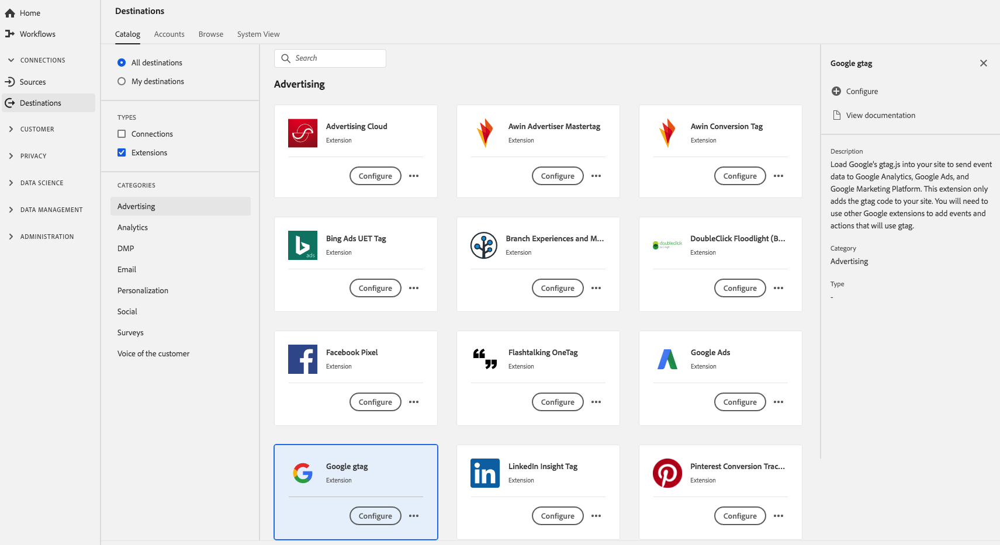

# Google gtag 확장 {#gtag-advertising-extension}

>[!IMPORTANT]
>
>여기에 설명된 Google gtag 확장은 더 이상 사용되지 않으며 [[!DNL Google Global Site Tag (gtag)]에서 개발한 &#x200B;](https://exchange.adobe.com/apps/ec/101437/google-global-site-tag-gtag) [!DNL Acronym] 확장으로 대체되었습니다. 데이터 수집 UI 또는 Experience Platform UI의 [!DNL Google Global Site Tag (gtag)] 작업 영역에서 [[!UICONTROL Tags]](../../../tags/home.md) 확장을 찾을 수 있습니다.

## 개요 {#overview}

Google `gtag.js`을(를) 사이트에 로드하여 [!DNL Google Analytics], Google Ads 및 [!DNL Google Marketing Platform]&#x200B;(으)로 이벤트 데이터를 보냅니다. 이 확장은 gtag 코드만 사이트에 추가합니다. gtag를 사용할 이벤트와 작업을 추가하려면 다른 Google 확장을 사용해야 합니다.

Google gtag는 Adobe Experience Platform의 광고 확장 프로그램입니다. 확장 기능에 대한 자세한 내용은 [Adobe Exchange](https://exchange.adobe.com/experiencecloud.details.102805.google-gtag.html)의 확장 페이지를 참조하십시오.

이 대상은 태그 확장입니다. Experience Platform에서 태그 확장이 작동하는 방법에 대한 자세한 내용은 [태그 확장 개요](../launch-extensions/overview.md)를 참조하십시오.

## 전제 조건 {#prerequisites}

이 확장은 Experience Platform을 구입한 모든 고객의 [!DNL Destinations] 카탈로그에서 사용할 수 있습니다.

이 확장을 사용하려면 Adobe Experience Platform의 태그에 액세스해야 합니다. 태그는 부가가치 기능으로 포함되어 Adobe Experience Cloud 고객에게 제공됩니다. 조직 관리자에게 연락하여 태그에 대한 액세스 권한을 받은 다음 확장을 설치할 수 있도록 **[!UICONTROL manage_properties]** 권한을 부여하도록 요청하십시오.

## 확장 설치 {#install-extension}

Google gtag 확장을 설치하려면:

[Experience Platform 인터페이스](https://platform.adobe.com/)에서 **[!UICONTROL Destinations]** > **[!UICONTROL Catalog]**(으)로 이동합니다.

카탈로그에서 확장을 선택하거나 검색 창을 사용합니다.

대상을 선택한 다음 오른쪽 레일에서 **[!UICONTROL Configure]**&#x200B;을(를) 선택합니다. **[!UICONTROL Configure]** 컨트롤이 회색으로 표시되어 있으면 **[!UICONTROL manage_properties]** 권한이 없습니다. [필수 구성 요소](#prerequisites)를 참조하십시오.

확장을 설치할 속성을 선택합니다. 새 속성을 만들 수도 있습니다. 속성은 규칙, 데이터 요소, 구성된 확장, 환경 및 라이브러리의 컬렉션입니다. 태그 설명서의 [속성 페이지 섹션](../../../tags/ui/administration/companies-and-properties.md#properties-page)에서 속성에 대해 알아봅니다.

워크플로는 설치를 완료하는 단계를 안내합니다.

확장 구성 옵션 및 설치 지원에 대한 자세한 내용은 Adobe Exchange의 [Google 태그 페이지](https://exchange.adobe.com/experiencecloud.details.102805.google-gtag.html)를 참조하십시오.

[데이터 수집 UI](https://experience.adobe.com/#/data-collection/)에서 바로 확장을 설치할 수도 있습니다. 자세한 내용은 태그 설명서의 [새 확장 추가](../../../tags/ui/managing-resources/extensions/overview.md#add-a-new-extension)에 대한 섹션을 참조하십시오.

## 확장 사용 방법 {#how-to-use}

확장을 설치하면 규칙 설정을 시작할 수 있습니다.

설치된 확장에 대한 규칙을 설정하여 이벤트 데이터를 특정 상황에서만 확장 대상으로 보낼 수 있습니다. 확장에 대한 규칙 설정에 대한 자세한 내용은 [태그 설명서](../../../tags/ui/managing-resources/rules.md)를 참조하세요.

## 확장 구성, 업그레이드 및 삭제 {#configure-upgrade-delete}

데이터 수집 UI에서 확장을 구성, 업그레이드 및 삭제할 수 있습니다.

>[!TIP]
>
>확장이 속성 중 하나에 이미 설치되어 있는 경우 Experience Platform UI에 확장에 대한 **[!UICONTROL Install]**&#x200B;이(가) 계속 표시됩니다. 확장을 구성하거나 삭제하려면 [확장 설치](#install-extension)에 설명된 대로 설치 워크플로를 시작합니다.

확장을 업그레이드하려면 태그 설명서의 [확장 업그레이드 프로세스](../../../tags/ui/managing-resources/extensions/extension-upgrade.md)에 대한 안내서를 참조하십시오.
