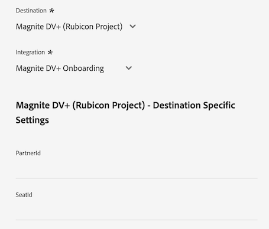

# [!DNL LiveRamp - Distribution] 연결

다음 [!DNL LiveRamp - Distribution] 연결을 사용하면 모바일, 웹, 디스플레이 및 연결된 TV 미디어에 있는 Experience Platform에서 프리미엄 게시자까지 대상을 활성화할 수 있습니다.

>[!IMPORTANT]
>
>이 대상 커넥터 및 설명서 페이지는 LiveRamp에서 만들고 유지 관리합니다. 문의 사항이나 업데이트 요청은 LiveRamp에 직접 문의하십시오 [여기](mailto:adobertcdp@liveramp.com).

## 지원되는 대상 {#supported-destinations}

[!DNL LiveRamp - Distribution] 는 현재 다음 플랫폼에 대한 대상 활성화를 지원합니다.

* [[!DNL 4C Insights]](#insights)
* [[!DNL Acast]](#acast)
* [[!DNL Nexxen]](#nexxen)
* [[!DNL Ampersand.tv]](#ampersand-tv)
* [[!DNL Captify]](#captify)
* [[!DNL Cardlytics]](#cardlytics)
* [[!DNL Disney (Hulu/ESPN/ABC)]](#disney)
* [[!DNL iHeartMedia]](#iheartmedia)
* [[!DNL Index Exchange]](#index-exchange)
* [[!DNL Magnite CTV Platform]](#magnite)
* [[!DNL Magnite DV+ (Rubicon Project)]](#magnite-dv)
* [[!DNL One Fox]](#fox)
* [[!DNL Pandora]](#pandora)
* [[!DNL Reddit]](#reddit)
* [[!DNL Roku]](#roku)
* [[!DNL Spotify]](#spotify)
* [[!DNL Taboola]](#taboola)
* [[!DNL TargetSpot]](#targetspot)
* [[!DNL Teads]](#teads)
* [[!DNL WB Discovery]](#wb-discovery)

## 사용 사례 {#use-cases}

을(를) 사용하는 방법과 시기를 더 잘 이해할 수 있도록 [!DNL LiveRamp - Distribution] destination은 Adobe Experience Platform 고객이 이 대상을 사용하여 해결할 수 있는 샘플 사용 사례입니다.

스포츠 의류 소매점의 마케팅 팀은 [라이브 램프 - 온보딩](liveramp-onboarding.md) Experience Platform에서 LiveRamp 계정으로 대상자를 전송하기 위한 연결입니다.

다음을 통해 [!DNL LiveRamp - Distribution] 이제 연결을 통해 온보딩된 대상자에 대한 활성화를 트리거할 수 있습니다. [지원되는 대상](#supported-destinations). 그런 다음 모바일, 오픈 웹, 소셜 및 [!DNL CTV] 플랫폼.

## LiveRamp에 대상자 온보드 {#onboarding}

를 통해 대상자를 활성화하기 전에 [!DNL LiveRamp - Distribution] 연결, 사용 [라이브 램프 - 온보딩](liveramp-onboarding.md) 연결을 통해 Experience Platform 대상을 LiveRamp로 내보낼 수 있습니다.

LiveRamp에 대상자를 온보딩한 후 [대상에 연결](#connect) 데이터 활성화를 위한 대상 플랫폼을 선택하고 구성하는 단계입니다.

## 대상에 연결 {#connect}

>[!CONTEXTUALHELP]
>id="platform_destinations_liveramp_distribution_identifier_settings"
>title="식별자 설정"
>abstract="대상에서 지원하는 식별자를 선택합니다. 각 대상에서 지원하는 식별자의 전체 목록은 설명서를 참조하십시오."

>[!IMPORTANT]
> 
>대상에 연결하려면 다음이 필요합니다. **[!UICONTROL 대상 관리]** [액세스 제어 권한](/help/access-control/home.md#permissions). 읽기 [액세스 제어 개요](/help/access-control/ui/overview.md) 필요한 권한을 얻으려면 제품 관리자에게 문의하십시오.

이 대상에 연결하려면 다음과같이 하십시오. [대상 구성 자습서](../../ui/connect-destination.md). 대상 구성 워크플로에서 아래 두 섹션에 나열된 필드를 채웁니다.

### LiveRamp 인증 {#authenticate}

대상에 인증하려면 필수 필드를 입력한 다음 을(를) 선택합니다. **[!UICONTROL 대상에 연결]**.

* **[!UICONTROL LiveRamp 조직 ID]**: LiveRamp 계정의 조직 ID(나열됨) _owner_org_ (LiveRamp에서 제공한 자격 증명).
* **[!UICONTROL 암호]**: LiveRamp 계정 암호(나열됨) _secret_key_ (LiveRamp에서 제공한 자격 증명).
* **[!UICONTROL 토큰 URL]**: LiveRamp 토큰 URL
* **[!UICONTROL 사용자 이름]**: LiveRamp 계정 사용자 이름(아래와 같이 나열됨) _account_id_ (LiveRamp에서 제공한 자격 증명).

### 대상 세부 정보 구성 {#destination-details}

LiveRamp 계정에 성공적으로 연결한 후 대상자를 활성화할 대상에 연결하는 데 필요한 정보를 입력하십시오.

* **[!UICONTROL 이름]**: 대상 연결의 기본 이름을 입력합니다.

>[!NOTE]
>
>대상 이름을 지정할 때 Adobe은 다음 형식을 따를 것을 권장합니다. `LiveRamp - Downstream Destination Name`. 이 이름 지정 패턴을 통해 [찾아보기](../../ui/destinations-workspace.md#browse) 대상 작업 영역의 탭입니다.
> 
>예: `LiveRamp - Roku`.

* **[!UICONTROL 설명]**: 대상에 대한 설명을 입력합니다. 이 대상의 목적을 쉽게 식별하는 데 도움이 되는 설명을 사용하십시오.
* **[!UICONTROL 대상]**: 드롭다운 메뉴를 사용하여 대상자를 활성화할 대상을 선택합니다. 여기에서 선택한 대상은 다음에 표시되는 내용에 직접 영향을 줍니다. [대상별 설정](#destination-settings) 화면.
* **[!UICONTROL 통합]**: 대상에 사용할 통합 계정을 선택합니다.
* **[!UICONTROL 식별자]**: 대상에서 지원하는 식별자를 선택합니다. 현재 모든 대상의 지원되는 식별자가 드롭다운 메뉴에 미리 채워져 있습니다.

## 대상별 설정 {#destination-settings}

각 대상 [지원됨](#supported-destinations) 작성자: [!DNL LiveRamp - Distribution] 을(를) 사용하려면 특정 구성 옵션을 입력해야 합니다.

각 대상을 구성하는 방법에 대한 자세한 지침은 아래 섹션을 참조하십시오.

### [!DNL 4C Insights] {#insights}

>[!CONTEXTUALHELP]
>id="platform_destinations_liveramp_distribution_4cinsights_profile_id"
>title="4C 브랜드 프로필 ID"
>abstract="4C 브랜드 프로필과 연계된 숫자 ID를 입력합니다. 이 ID가 없는 경우 4C 클라이언트 서비스 담당자에게 문의하시기 바랍니다."

대상에 대한 세부 정보를 구성하려면 아래 필드를 채우십시오.

* **[!UICONTROL 4C 브랜드 프로필 ID]**: 4C 브랜드 프로필과 연결된 숫자 ID를 입력합니다. 이 ID가 없는 경우 4C 클라이언트 서비스 담당자에게 문의하시기 바랍니다.

### [!DNL Acast] {#acast}

>[!CONTEXTUALHELP]
>id="platform_destinations_liveramp_distribution_acast_client"
>title="클라이언트 이름"
>abstract="대상 파트너에게 표시하고자 하는 광고주 계정 이름입니다. 회사 이름을 사용합니다. 공백이나 특수 문자는 사용하지 마십시오."

대상에 대한 세부 정보를 구성하려면 아래 필드를 채우십시오.

* **[!UICONTROL 클라이언트 이름]**: 대상 파트너에게 표시하려는 광고주 계정 이름입니다. 회사 이름을 사용합니다. 공백이나 특수 문자는 사용하지 마십시오.

### [!DNL Ampersand.tv] {#ampersand-tv}

>[!CONTEXTUALHELP]
>id="platform_destinations_liveramp_distribution_ampersand_company_name"
>title="회사 이름"
>abstract="대상 파트너에게 표시하고자 하는 회사 이름입니다. 공백이나 특수 문자는 사용하지 마십시오."

대상에 대한 세부 정보를 구성하려면 아래 필드를 채우십시오.

* **[!UICONTROL 회사 이름]**: 대상 파트너에게 표시하려는 회사 이름입니다. 공백이나 특수 문자는 사용하지 마십시오.

### [!DNL Captify] {#captify}

>[!CONTEXTUALHELP]
>id="platform_destinations_liveramp_distribution_captify_client"
>title="클라이언트 이름"
>abstract="대상 파트너에게 표시하고자 하는 광고주 계정 이름입니다. 회사 이름을 사용합니다. 공백이나 특수 문자는 사용하지 마십시오."

대상에 대한 세부 정보를 구성하려면 아래 필드를 채우십시오.

* **[!UICONTROL 클라이언트 이름]**: 대상 파트너에게 표시하려는 광고주 계정 이름입니다. 회사 이름을 사용합니다. 공백이나 특수 문자는 사용하지 마십시오.

### [!DNL Cardlytics] {#cardlytics}

>[!CONTEXTUALHELP]
>id="platform_destinations_liveramp_distribution_cardlytics_client"
>title="클라이언트 이름"
>abstract="대상 파트너에게 표시하고자 하는 광고주 계정 이름입니다. 회사 이름을 사용합니다. 공백이나 특수 문자는 사용하지 마십시오."

대상에 대한 세부 정보를 구성하려면 아래 필드를 채우십시오.

* **[!UICONTROL 클라이언트 이름]**: 대상 파트너에게 표시하려는 광고주 계정 이름입니다. 회사 이름을 사용합니다. 공백이나 특수 문자는 사용하지 마십시오.

### [!DNL Disney (Hulu/ESPN/ABC)] {#disney}

>[!CONTEXTUALHELP]
>id="platform_destinations_liveramp_distribution_agreement"
>title="광고주 데이터 대상 계약서 약관"
>abstract="`I AGREE`를 입력하고 Disney 광고주 데이터 계약서 약관의 승인 및 동의를 확인합니다."

<!-- >additional-url="<https://www.disneyadvertising.com/ADVERTISER-DATA-DESTINATION-TERMS/>" text="Read the agreement" -->

>[!CONTEXTUALHELP]
>id="platform_destinations_liveramp_distribution_disney_client"
>title="클라이언트 이름"
>abstract="대상 파트너에게 표시하고자 하는 광고주 계정 이름입니다. 회사 이름을 사용합니다. 공백이나 특수 문자는 사용하지 마십시오."

>[!CONTEXTUALHELP]
>id="platform_destinations_liveramp_distribution_disney_email"
>title="내 이메일 주소"
>abstract="개인 사용자와 연결된 이메일 주소를 입력합니다. 이 이메일 주소는 광고주 데이터 계약서 약관에서 서명 역할을 합니다. 필요한 경우 이 이메일 주소는 관리자에게 문의하는 데 사용됩니다."

대상에 대한 세부 정보를 구성하려면 아래 필드를 채우십시오.

* **[!UICONTROL 광고주 데이터 대상 약관 계약]**: 입력 `I AGREE` 디즈니 광고주 데이터 약관에 대한 승인 및 동의를 확인합니다.
* **[!UICONTROL 클라이언트 이름]**: 대상 파트너에게 표시하려는 회사 이름을 입력합니다.
* **[!UICONTROL 이메일 주소]**: 개인에게 연결된 이메일 주소를 입력합니다. 이 이메일 주소는 광고주 데이터 계약서 약관에서 서명 역할을 합니다.

### [!DNL iHeartMedia] {#iheartmedia}

>[!CONTEXTUALHELP]
>id="platform_destinations_liveramp_distribution_iheartmedia_client"
>title="클라이언트 이름"
>abstract="대상 파트너에게 표시하고자 하는 광고주 계정 이름입니다. 회사 이름을 사용합니다. 공백이나 특수 문자는 사용하지 마십시오."

대상에 대한 세부 정보를 구성하려면 아래 필드를 채우십시오.

* **[!UICONTROL 클라이언트 이름]**: 대상 파트너에게 표시하려는 광고주 계정 이름입니다. 회사 이름을 사용합니다. 공백이나 특수 문자는 사용하지 마십시오.

### [!DNL Index Exchange] {#index-exchange}

>[!CONTEXTUALHELP]
>id="platform_destinations_liveramp_distribution_index_advertiseraccountname"
>title="계정 이름"
>abstract="귀하의 Index Exchange 클라이언트 계정 이름입니다. 공백이나 특수 문자는 사용하지 마십시오."

대상에 대한 세부 정보를 구성하려면 아래 필드를 채우십시오.

* **[!UICONTROL 계정 이름]**: Index Exchange 클라이언트 계정 이름입니다. 공백이나 특수 문자는 사용하지 마십시오.

### [!DNL Magnite CTV Platform] {#magnite}

>[!CONTEXTUALHELP]
>id="platform_destinations_liveramp_distribution_magnitectv_client"
>title="클라이언트"
>abstract="대상 파트너에게 표시하고자 하는 클라이언트 이름입니다. 회사 이름을 사용합니다. 공백이나 특수 문자는 사용하지 마십시오."

대상에 대한 세부 정보를 구성하려면 아래 필드를 채우십시오.

* **[!UICONTROL 클라이언트]**: 대상 파트너에 표시할 클라이언트 이름입니다. 회사 이름을 사용합니다. 공백이나 특수 문자는 사용하지 마십시오.

### [!DNL Magnite DV+ (Rubicon Project)] {#magnite-dv}

>[!CONTEXTUALHELP]
>id="platform_destinations_liveramp_distribution_magnitedv+_partnerid"
>title="파트너 ID"
>abstract="세그먼트/데이터를 소유한 게시자와 관련된 Rubicon Project Partner ID입니다. 어떤 값을 사용해야 하는지 알 수 없는 경우 Rubicon Project 계정 담당자에게 문의하시기 바랍니다."

>[!CONTEXTUALHELP]
>id="platform_destinations_liveramp_distribution_magnitedv+_seatid"
>title="Seat ID"
>abstract="Magnite 계정 관리자가 제공한 Magnite DV+ Seat ID"

대상에 대한 세부 정보를 구성하려면 아래 필드를 채우십시오.

* **[!UICONTROL 파트너 ID]**: 세그먼트/데이터를 소유한 게시자와 연결된 Rubicon 프로젝트 파트너 ID입니다. 어떤 값을 사용해야 하는지 알 수 없는 경우 Rubicon Project 계정 담당자에게 문의하시기 바랍니다.
* **[!UICONTROL 시트 ID]**: Magnite 계정 관리자가 제공한 Magnite DV+ 시트 ID

### [!DNL Nexxen (formerly known as [!DNL Amobee])] {#nexxen}

>[!CONTEXTUALHELP]
>id="platform_destinations_liveramp_distribution_nexxen_ratetype"
>title="요금 유형"
>abstract="요금 유형은 데이터 사용량에 대해 비용이 청구되는 방식을 나타냅니다. 모든 $0.00 요금은 정액 요금이어야 합니다. 어떤 요금 유형을 사용해야 할지 알 수 없는 경우 Nexxen 담당자에게 문의하시기 바랍니다."

>[!CONTEXTUALHELP]
>id="platform_destinations_liveramp_distribution_nexxen_marketid"
>title="Market ID"
>abstract="Nexxen 데이터 약정을 생성해야 하는 숫자로 된 Market ID를 입력합니다. Nexxen 플랫폼의 모든 시장에서 “AlwaysOn” 신디케이션을 수행하는 경우 -1을 입력합니다."

>[!CONTEXTUALHELP]
>id="platform_destinations_liveramp_distribution_nexxen_advertiserid"
>title="광고주 ID"
>abstract="Nexxen 플랫폼의 단일 광고주에게 데이터를 보내는 경우 숫자로 된 Amobee Advertiser ID를 입력하십시오. 시장의 모든 광고주가 데이터를 사용할 수 있도록 하고자 하거나 해당 세그먼트가 “AlwaysOn”인 경우 -1을 입력합니다."

>[!CONTEXTUALHELP]
>id="platform_destinations_liveramp_distribution_nexxen_contactemail"
>title="연락처 이메일"
>abstract="Nexxen이 데이터 약정 세부 정보를 보내는 데 사용할 이메일 주소를 입력합니다. 이는 대체로 귀하의 이메일 주소지만 이메일 별칭일 수도 있습니다. 수신자가 여러 명인 경우 쉼표를 사용하여 구분합니다(`email1@domain.com`, `email2@domain.com` 등)."

대상에 대한 세부 정보를 구성하려면 아래 필드를 채우십시오.

* **[!UICONTROL 요금 유형]**: 요금 유형은 데이터 사용이 청구되는 방식을 나타냅니다. 모든 $0.00 요금은 정액 요금이어야 합니다. 어떤 요금 유형을 사용해야 할지 알 수 없는 경우 Nexxen 담당자에게 문의하시기 바랍니다.
* **[!UICONTROL 시장 ID]**: Nexxen 데이터 계약을 만들어야 하는 숫자 Market ID를 입력합니다. Nexxen 플랫폼의 모든 시장에서 “AlwaysOn” 신디케이션을 수행하는 경우 -1을 입력합니다.
* **[!UICONTROL 광고주 ID]**: Nexxen 플랫폼의 단일 광고주에게 데이터를 보내는 경우 숫자 Nexxen 광고주 ID를 입력합니다. 시장의 모든 광고주가 데이터를 사용할 수 있도록 하거나 이러한 세그먼트가 &quot;AlwaysOn&quot;인 경우 -1을 입력합니다.
* **[!UICONTROL 연락처 전자 메일]**: Nexxen이 데이터 계약 세부 사항을 전송하는 데 사용할 이메일 주소를 입력합니다. 이는 대체로 귀하의 이메일 주소지만 이메일 별칭일 수도 있습니다. 여러 수신자의 경우 쉼표( `email1@domain.com`, `email2@domain.com`).

### [!DNL One Fox] {#fox}

>[!CONTEXTUALHELP]
>id="platform_destinations_liveramp_distribution_fox_client"
>title="클라이언트"
>abstract="파트너에게 표시되는 회사/배포 계정의 이름입니다. 어떤 이름을 사용해야 할지 알 수 없는 경우 파트너 계정 담당자에게 문의하시기 바랍니다. 공백이나 특수 문자는 사용하지 마십시오."

대상에 대한 세부 정보를 구성하려면 아래 필드를 채우십시오.

* **[!UICONTROL 클라이언트]**: 파트너에게 표시하려는 회사/배포 계정의 이름입니다. 기본적으로 회사 이름을 사용하십시오. 어떤 이름을 사용해야 할지 알 수 없는 경우 파트너 계정 담당자에게 문의하시기 바랍니다. 공백이나 특수 문자는 사용하지 마십시오.

### [!DNL Pandora] {#pandora}

>[!CONTEXTUALHELP]
>id="platform_destinations_liveramp_distribution_pandora_account_name"
>title="계정 이름"
>abstract="Pandora 계정 이름입니다. 계정 이름을 모를 경우에는 Pandora 계정 담당자에게 문의하십시오. 공백이나 특수 문자는 사용하지 마십시오."

대상에 대한 세부 정보를 구성하려면 아래 필드를 채우십시오.

* **[!UICONTROL 계정 이름]**: Pandora 계정의 이름입니다. 계정 이름을 모를 경우에는 Pandora 계정 담당자에게 문의하십시오. 공백이나 특수 문자는 사용하지 마십시오.

### [!DNL Reddit] {#reddit}

>[!CONTEXTUALHELP]
>id="platform_destinations_liveramp_distribution_reddit_advertiser_id"
>title="Reddit 광고주 ID"
>abstract="내 Reddit 광고주 ID입니다. “t2_” 또는 “a2_”로 시작해야 합니다. 광고주 ID를 모르는 경우 Reddit 담당자에게 문의하십시오."

>[!CONTEXTUALHELP]
>id="platform_destinations_liveramp_distribution_reddit_advertiser_name"
>title="Reddit 광고주 이름"
>abstract="내 Reddit 광고주 이름입니다. 공백이나 특수 문자는 사용하지 마십시오."

대상에 대한 세부 정보를 구성하려면 아래 필드를 채우십시오.

* **[!UICONTROL Reddit 광고주 ID]**: Reddit 광고주 ID입니다. “t2_” 또는 “a2_”로 시작해야 합니다. 광고주 ID를 모르는 경우 Reddit 담당자에게 문의하십시오.
* **[!UICONTROL Reddit 광고주 이름]**: Reddit 광고주 이름입니다. 공백이나 특수 문자는 사용하지 마십시오.

### [!DNL Roku] {#roku}

>[!CONTEXTUALHELP]
>id="platform_destinations_liveramp_distribution_roku_email"
>title="Roku 계정 이메일 주소"
>abstract="Roku 계정에 연결된 이메일 주소를 입력합니다."

>[!CONTEXTUALHELP]
>id="platform_destinations_liveramp_distribution_roku_representative_email"
>title="Roku 계정 담당자 이메일 주소"
>abstract="내 Roku 계정 담당자의 이메일 주소를 입력합니다. 이 주소는 분류 체계 업데이트를 보내는 데 사용합니다. 여러 주소를 입력하려면 쉼표로 구분합니다."

대상에 대한 세부 정보를 구성하려면 아래 필드를 채우십시오.

* **[!UICONTROL Roku 계정 이메일 주소]**: Roku 계정에 연결된 이메일 주소를 입력합니다.
* **[!UICONTROL Roku 계정 담당자 이메일 주소]**: Roku 계정 담당자의 이메일 주소를 입력합니다. 여러 주소를 입력하려면 쉼표로 구분합니다.

### [!DNL Spotify] {#spotify}

>[!CONTEXTUALHELP]
>id="platform_destinations_liveramp_distribution_spotify_client"
>title="클라이언트 이름"
>abstract="대상 파트너에게 표시하고자 하는 광고주 계정 이름입니다. 회사 이름을 사용합니다. 공백이나 특수 문자는 사용하지 마십시오."

대상에 대한 세부 정보를 구성하려면 아래 필드를 채우십시오.

* **[!UICONTROL 클라이언트 이름]**: 대상 파트너에게 표시하려는 광고주 계정 이름입니다. 회사 이름을 사용합니다. 공백이나 특수 문자는 사용하지 마십시오.

### [!DNL Taboola] {#taboola}

>[!CONTEXTUALHELP]
>id="platform_destinations_liveramp_distribution_taboola_rep_email"
>title="계정 관리자 이메일 주소"
>abstract="Taboola 계정 관리자 이메일 주소입니다."

>[!CONTEXTUALHELP]
>id="platform_destinations_liveramp_distribution_taboola_seg_type"
>title="세그먼트 유형"
>abstract="세그먼트 유형입니다. 현재 자사 세그먼트만 지원됩니다."

대상에 대한 세부 정보를 구성하려면 아래 필드를 채우십시오.

* **[!UICONTROL 계정 관리자 이메일 주소]**: Tabola 계정 관리자의 이메일 주소입니다.
* **[!UICONTROL 세그먼트 유형]**: 세그먼트 유형입니다. 현재 자사 세그먼트만 지원됩니다.

### [!DNL TargetSpot] {#targetspot}

>[!CONTEXTUALHELP]
>id="platform_destinations_liveramp_distribution_targetspot_client"
>title="클라이언트 이름"
>abstract="대상 파트너에게 표시하고자 하는 광고주 계정 이름입니다. 회사 이름을 사용합니다. 공백이나 특수 문자는 사용하지 마십시오."

대상에 대한 세부 정보를 구성하려면 아래 필드를 채우십시오.

* **[!UICONTROL 클라이언트 이름]**: 대상 파트너에게 표시하려는 광고주 계정 이름입니다. 회사 이름을 사용합니다. 공백이나 특수 문자는 사용하지 마십시오.

### [!DNL Teads] {#teads}

>[!CONTEXTUALHELP]
>id="platform_destinations_liveramp_distribution_teads_teadsid"
>title="Teads ID"
>abstract="귀하의 Teads ID입니다."

대상에 대한 세부 정보를 구성하려면 아래 필드를 채우십시오.

* **[!UICONTROL Teads ID]**: 내 Teads ID

### [!DNL WB Discovery] {#wb-discovery}

>[!CONTEXTUALHELP]
>id="platform_destinations_liveramp_distribution_wb_client"
>title="클라이언트 이름"
>abstract="대상 파트너에게 표시하고자 하는 광고주 계정 이름입니다. 회사 이름을 사용합니다. 공백이나 특수 문자는 사용하지 마십시오."

대상에 대한 세부 정보를 구성하려면 아래 필드를 채우십시오.

* **[!UICONTROL 클라이언트 이름]**: 대상 파트너에게 표시하려는 광고주 계정 이름입니다. 회사 이름을 사용합니다. 공백이나 특수 문자는 사용하지 마십시오.

### 경고 활성화 {#enable-alerts}

경고를 활성화하여 대상에 대한 데이터 흐름 상태에 대한 알림을 받을 수 있습니다. 데이터 흐름 상태에 대한 알림을 받으려면 목록에서 경고를 선택합니다. 경고에 대한 자세한 내용은 의 안내서를 참조하십시오 [UI를 사용하여 대상 경고 구독](../../ui/alerts.md).

대상 연결에 대한 세부 정보를 제공했으면 을 선택합니다. **[!UICONTROL 다음]**.

## 이 대상으로 대상자 활성화 {#activate}

>[!IMPORTANT]
> 
>데이터를 활성화하려면 **[!UICONTROL 대상 관리]**, **[!UICONTROL 대상 활성화]**, **[!UICONTROL 프로필 보기]**, 및 **[!UICONTROL 세그먼트 보기]** [액세스 제어 권한](/help/access-control/home.md#permissions). 읽기 [액세스 제어 개요](/help/access-control/ui/overview.md) 필요한 권한을 얻으려면 제품 관리자에게 문의하십시오.

다음 [!DNL LiveRamp - Distribution] 연결은 를 통해 LiveRamp 계정에 이미 온보딩된 대상을 활성화합니다. [라이브 램프 - 온보딩](liveramp-onboarding.md) 연결.

대상을 성공적으로 활성화하려면 다음을 선택해야 합니다. **동일한 대상** 보유하고 있는 항목 [이전에 온보딩된](liveramp-onboarding.md) LiveRamp로 이동합니다.

>[!IMPORTANT]
>
>를 통해 이전에 온보딩되지 않은 대상자 선택 [라이브 램프 - 온보딩](liveramp-onboarding.md) 연결은 새 대상의 온보딩을 트리거하지 않습니다.

## 내보낸 데이터/데이터 내보내기 유효성 검사 {#exported-data}

대상자의 활성화를 확인 및 모니터링하려면 LiveRamp 계정에 로그인하고 활성화 지표를 확인합니다.

Audience 활성화에 대한 질문이 있는 경우 LiveRamp 계정 담당자에게 문의하십시오.

## 데이터 사용 및 관리 {#data-usage-governance}

모두 [!DNL Adobe Experience Platform] 대상은 데이터를 처리할 때 데이터 사용 정책을 준수합니다. 방법에 대한 자세한 정보 [!DNL Adobe Experience Platform] 데이터 거버넌스 적용, 다음을 읽습니다. [데이터 거버넌스 개요](/help/data-governance/home.md).

## 추가 리소스 {#additional-resources}

을(를) 구성하는 방법에 대한 자세한 내용은 [!DNL LiveRamp - Onboarding] 대상, 다음을 참조하십시오. [LiveRamp - 온보딩 설명서](liveramp-onboarding.md).
