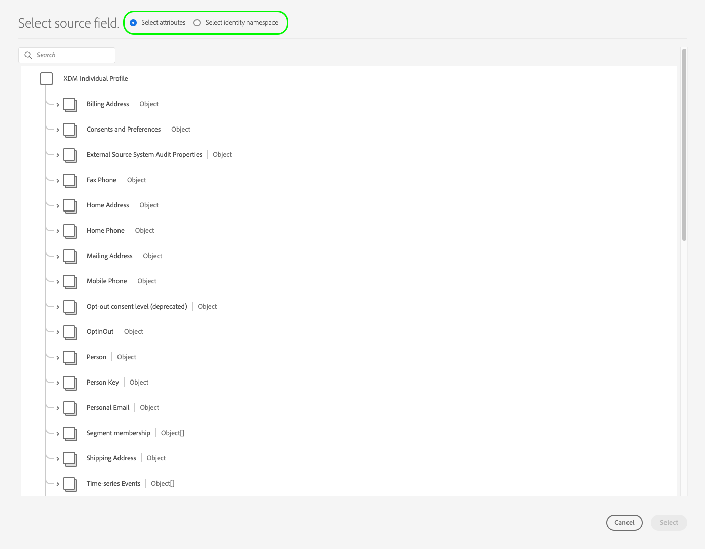

# [!DNL LiveRamp - Onboarding] 연결 {#liveramp-onboarding}

사용 [!DNL LiveRamp - Onboarding] Adobe Real-time Customer Data Platform에서 (으)로 대상자를 온보딩하기 위한 연결 [!DNL LiveRamp Connect].

## 사용 사례 {#use-cases}

을(를) 사용하는 방법과 시기를 더 잘 이해할 수 있도록 [!DNL LiveRamp - Onboarding] destination은 Adobe Experience Platform 고객이 이 대상을 사용하여 해결할 수 있는 샘플 사용 사례입니다.

마케터로서 Adobe Experience Platform에서 온보드 ID로 대상자를 보내고 싶습니다. [!DNL LiveRamp Connect] 모바일, 오픈 웹, 소셜 및 [!DNL CTV] 플랫폼, 사용 [!DNL Ramp ID] 식별자.

## 전제 조건 {#prerequisites}

다음 [!DNL LiveRamp - Onboarding] 연결을 통해 다음을 사용하여 파일을 내보냅니다. [LiveRamp SFTP](https://docs.liveramp.com/connect/en/upload-a-file-via-liveramp-s-sftp.html) 스토리지.

Experience Platform에서 (으)로 데이터를 보내기 전에 [!DNL LiveRamp - Onboarding], 다음이 필요합니다. [!DNL LiveRamp] 자격 증명. 다음으로 문의하십시오. [!DNL LiveRamp] 아직 자격 증명이 없는 경우 해당 자격 증명을 얻을 수 있는 담당자입니다.

## 지원되는 ID {#supported-identities}

[!DNL LiveRamp - Onboarding] 에서는 PII 기반 식별자, 알려진 식별자 및 사용자 정의 ID와 같이 공식 문서에 설명된 id의 활성화를 지원합니다 [LiveRamp 설명서](https://docs.liveramp.com/connect/en/identity-and-identifier-terms-and-concepts.html#known-identifiers).

다음에서 [매핑 단계](#map) 활성화 워크플로 중에서 타겟 매핑을 사용자 지정 속성으로 정의해야 합니다.

## 지원되는 대상자 {#supported-audiences}

이 섹션에서는 이 대상으로 내보낼 수 있는 대상자 유형을 설명합니다.

| 대상자 원본 | 지원됨 | 설명 |
---------|----------|----------|
| [!DNL Segmentation Service] | ✓ 덧신 | Experience Platform을 통해 생성된 대상자 [세분화 서비스](../../../segmentation/home.md). |
| 사용자 정의 업로드 | ✓ | 대상 [가져옴](../../../segmentation/ui/overview.md#import-audience) csv 파일에서 Experience Platform으로 변환했습니다. |

{style="table-layout:auto"}

## 내보내기 유형 및 빈도 {#export-type-frequency}

대상 내보내기 유형 및 빈도에 대한 자세한 내용은 아래 표를 참조하십시오.

| 항목 | 유형 | 참고 |
---------|----------|---------|
| 내보내기 유형 | **[!UICONTROL 대상자 내보내기]** | 에 사용된 식별자(이름, 전화번호 또는 기타)를 사용하여 대상자의 모든 구성원을 내보냅니다. [!DNL LiveRamp - Onboarding] 대상. |
| 내보내기 빈도 | **[!UICONTROL 일별 일괄 처리]** | 프로필은 대상 평가를 기반으로 Experience Platform에서 업데이트되므로 프로필(ID)은 대상 플랫폼으로 하루에 한 번 업데이트됩니다. 자세한 내용 [배치 파일 기반 대상](/help/destinations/destination-types.md#file-based). |

{style="table-layout:auto"}

## 대상에 연결 {#connect}

>[!IMPORTANT]
> 
>대상에 연결하려면 다음이 필요합니다. **[!UICONTROL 대상 관리]** [액세스 제어 권한](/help/access-control/home.md#permissions). 읽기 [액세스 제어 개요](/help/access-control/ui/overview.md) 필요한 권한을 얻으려면 제품 관리자에게 문의하십시오.

이 대상에 연결하려면 다음과같이 하십시오. [대상 구성 자습서](../../ui/connect-destination.md). 대상 구성 워크플로에서 아래 두 섹션에 나열된 필드를 채웁니다.

### 대상에 인증 {#authenticate}

대상에 인증하려면 필수 필드를 입력한 다음 을(를) 선택합니다. **[!UICONTROL 대상에 연결]**.

**암호가 포함된 SFTP 인증** {#sftp-password}


* **[!UICONTROL 사용자 이름]**: 의 사용자 이름 [!DNL LiveRamp - Onboarding] 저장소 위치.
* **[!UICONTROL 암호]**: 의 암호 [!DNL LiveRamp - Onboarding] 저장소 위치.
* **[!UICONTROL PGP/GPG 암호화 키]**: 원할 경우 RSA 형식의 공개 키를 첨부하여 내보낸 파일에 암호화를 추가할 수 있습니다. 아래 이미지에서 올바른 형식의 암호화 키의 예를 봅니다.
  
* **[!UICONTROL 하위 키 ID]**:암호화 키를 제공하는 경우 암호화도 제공해야 합니다. **[!UICONTROL 하위 키 ID]**. 다음을 참조하십시오. [!DNL LiveRamp] [암호화 설명서](https://docs.liveramp.com/connect/en/encrypting-files-for-uploading.html#downloading-the-current-encryption-key) 하위 키 ID를 얻는 방법에 대해 알아봅니다.

**SSH 키 인증이 있는 SFTP** {#sftp-ssh}


* **[!UICONTROL 사용자 이름]**: 의 사용자 이름 [!DNL LiveRamp - Onboarding] 저장소 위치.
* **[!UICONTROL SSH 키]**: 비공개 [!DNL SSH] 에 로그인하는 데 사용되는 키 [!DNL LiveRamp - Onboarding] 저장소 위치. 개인 키의 형식은 다음과 같아야 합니다. [!DNL Base64]-인코딩된 문자열이며, 암호로 보호될 수 없습니다.

   * 을(를) 연결하려면 [!DNL SSH] 키 [!DNL LiveRamp - Onboarding] 서버, 다음을 통해 티켓을 제출해야 합니다. [!DNL LiveRamp]의 기술 지원 포털에서 공개 키를 제공합니다. 자세한 내용은 [LiveRamp 설명서](https://docs.liveramp.com/connect/en/upload-a-file-via-liveramp-s-sftp.html#upload-with-an-sftp-client).

* **[!UICONTROL PGP/GPG 암호화 키]**: 원할 경우 RSA 형식의 공개 키를 첨부하여 내보낸 파일에 암호화를 추가할 수 있습니다. 아래 이미지에서 올바른 형식의 암호화 키의 예를 봅니다.
  
* **[!UICONTROL 하위 키 ID]**:암호화 키를 제공하는 경우 암호화도 제공해야 합니다. **[!UICONTROL 하위 키 ID]**. 다음을 참조하십시오. [!DNL LiveRamp] [암호화 설명서](https://docs.liveramp.com/connect/en/encrypting-files-for-uploading.html#downloading-the-current-encryption-key) 하위 키 ID를 얻는 방법에 대해 알아봅니다.

### 대상 세부 정보 입력 {#destination-details}

>[!CONTEXTUALHELP]
>id="platform_destinations_liveramp_subkey"
>title="암호화 하위 키 ID"
>abstract="LiveRamp 공개 암호화 키를 기반으로 암호화에 사용되는 하위 키 ID입니다. 인증 단계에서 암호화 키를 제공한 경우 이 필드는 필수 항목입니다."
>additional-url="https://docs.liveramp.com/connect/en/encrypting-files-for-uploading.html#downloading-the-current-encryption-key" text="하위 키 ID를 얻는 방법을 알아봅니다"

대상에 대한 세부 정보를 구성하려면 아래의 필수 및 선택 필드를 채우십시오. UI에서 필드 옆에 있는 별표는 필드가 필수임을 나타냅니다.


* **[!UICONTROL 이름]**: 나중에 이 대상을 인식할 수 있는 이름입니다.
* **[!UICONTROL 설명]**: 나중에 이 대상을 식별하는 데 도움이 되는 설명입니다.
* **[!UICONTROL 폴더 경로]**: 의 경로 [!DNL LiveRamp] `uploads` 내보낸 파일을 호스팅하는 하위 폴더입니다. 다음 `uploads` 접두사는 폴더 경로에 자동으로 추가됩니다. [!DNL LiveRamp] 는 파일을 다른 기존 피드와 구분하고 모든 자동화가 원활하게 실행되도록 Adobe Real-Time CDP에서 게재할 전용 하위 폴더를 만들 것을 권장합니다.
   * 예를 들어 파일을 내보내려는 경우 `uploads/my_export_folder`, 입력 `my_export_folder` 다음에서 **[!UICONTROL 폴더 경로]** 필드.
* **[!UICONTROL 압축 포맷]**: 내보낸 파일에 대해 Experience Platform이 사용해야 하는 압축 유형을 선택합니다. 사용 가능한 옵션은 다음과 같습니다 **[!UICONTROL GZIP]** 또는 **[!UICONTROL 없음]**.

### 경고 활성화 {#enable-alerts}

경고를 활성화하여 대상에 대한 데이터 흐름 상태에 대한 알림을 받을 수 있습니다. 목록에서 경고를 선택하여 데이터 흐름 상태에 대한 알림을 수신합니다. 경고에 대한 자세한 내용은 의 안내서를 참조하십시오 [UI를 사용하여 대상 경고 구독](../../ui/alerts.md).

대상 연결에 대한 세부 정보를 제공했으면 을 선택합니다. **[!UICONTROL 다음]**.

## 이 대상에 대상자 활성화 {#activate}

>[!IMPORTANT]
> 
>데이터를 활성화하려면 **[!UICONTROL 대상 관리]**, **[!UICONTROL 대상 활성화]**, **[!UICONTROL 프로필 보기]**, 및 **[!UICONTROL 세그먼트 보기]** [액세스 제어 권한](/help/access-control/home.md#permissions). 읽기 [액세스 제어 개요](/help/access-control/ui/overview.md) 필요한 권한을 얻으려면 제품 관리자에게 문의하십시오.

읽기 [대상자 데이터를 활성화하여 프로필 내보내기 대상 일괄 처리](/help/destinations/ui/activate-batch-profile-destinations.md) 이 대상에 대한 대상자 활성화에 대한 지침을 참조하십시오.

### 예약 {#scheduling}

다음에서 [!UICONTROL 예약] 단계: 아래 표시된 설정을 사용하여 각 대상에 대한 내보내기 일정을 만듭니다.

* **[!UICONTROL 파일 내보내기 옵션]**: [!UICONTROL 전체 파일 내보내기]. [증분 파일 내보내기](../../ui/activate-batch-profile-destinations.md#export-incremental-files) 은(는) 현재 다음에 대해 지원되지 않습니다. [!DNL LiveRamp] 대상.
* **[!UICONTROL 빈도]**: [!UICONTROL 매일]
* **[!UICONTROL 날짜]**: 원하는 대로 내보내기 시작 및 종료 시간을 선택합니다.


내보낸 파일 이름은 현재 사용자가 구성할 수 없습니다. 로 내보낸 모든 파일 [!DNL LiveRamp - Onboarding] 대상 은 다음 템플릿을 기반으로 자동 명명됩니다.

`%ORGANIZATION_NAME%_%DESTINATION%_%DESTINATION_INSTANCE_ID%_%DATETIME%`


(예: 조직용으로 내보낸 파일의 이름) [!DNL Luma] 다음과 비슷하게 보일 수 있습니다.

```json
Luma_LiveRamp_52137231-4a99-442d-804c-39a09ddd005d_20230330_153857.csv
```

### 속성 및 ID 매핑 {#map}

다음에서 **[!UICONTROL 매핑]** 단계에서는 프로필에 내보낼 속성 및 ID를 선택할 수 있습니다.

>[!IMPORTANT]
>
>이 대상은 활성화 흐름당 하나의 소스 ID 네임스페이스 활성화를 지원합니다. 다음과 같이 여러 ID 네임스페이스를 내보내야 하는 경우 `Email` 및 `Phone`, 다음을 수행해야 합니다. [별도의 활성화 플로우 만들기](../../ui/activate-batch-profile-destinations.md) 각 id에 대해.

다음에서 **[!UICONTROL 매핑]** 단계, **[!UICONTROL 대상 필드]** 매핑은 내보낸 CSV 파일의 열 헤더 이름을 정의합니다. 에 사용자 지정 이름을 제공하여 내보낸 파일의 CSV 열 헤더를 원하는 이름으로 변경할 수 있습니다. **[!UICONTROL 대상 필드]**.

>[!IMPORTANT]
>
>에 대한 초기 파일 게재 후 대상 필드에 수행된 모든 변경 사항 [!DNL LiveRamp], 에게 알리십시오. [!DNL LiveRamp] 계정 팀 또는 [LiveRamp 지원에 티켓 제출](https://docs.liveramp.com/connect/en/considerations-when-uploading-the-first-file-to-an-audience.html#creating-a-support-case) 변경 사항이 자동화 프로세스에 반영되도록 합니다.

1. 다음에서 **[!UICONTROL 매핑]** 단계, 선택 **[!UICONTROL 새 매핑 추가]**. 화면에 새 매핑 행이 표시됩니다.

   

2. 다음에서 **[!UICONTROL 소스 필드 선택]** 창에서 다음을 선택합니다. **[!UICONTROL 속성 선택]** 범주를 만들고 매핑할 XDM 속성을 선택하거나 **[!UICONTROL ID 네임스페이스 선택]** 범주를 만들고 대상에 매핑할 id를 선택합니다.

   

3. 다음에서 **[!UICONTROL 대상 필드 선택]** 창에서 선택한 소스 필드를 매핑할 속성 이름을 입력합니다. 여기에 정의된 속성 이름은 내보낸 CSV 파일에 열 헤더로 반영됩니다.

   

   속성 이름을에 직접 입력하여 입력할 수도 있습니다. **[!UICONTROL 대상 필드]**.

   

원하는 매핑을 모두 추가한 후 을 선택합니다. **[!UICONTROL 다음]** 활성화 워크플로를 완료합니다.

## 내보낸 데이터/데이터 내보내기 유효성 검사 {#exported-data}

데이터를 (으)로 내보냅니다. [!DNL LiveRamp - Onboarding] CSV 파일로 구성한 저장소 위치입니다.

파일을 로 내보낼 때 [!DNL LiveRamp - Onboarding] 대상, 플랫폼은 각각에 대해 하나의 CSV 파일을 생성합니다. [병합 정책 ID](../../../profile/merge-policies/overview.md).

예를 들어 다음 대상을 고려해 보겠습니다.

* 대상자 A (병합 정책 1)
* 대상 B(병합 정책 2)
* 대상자 C (병합 정책 1)
* 대상자 D (병합 정책 1)

플랫폼이 CSV 파일 두 개를 (으)로 내보냅니다. [!DNL LiveRamp - Onboarding]:

* 대상 A, C 및 D가 포함된 하나의 CSV 파일
* 대상자 B가 포함된 CSV 파일 1개.

내보낸 CSV 파일에는 선택한 속성이 있는 프로필과 해당 대상 상태가 별도의 열에 속성 이름이 있고 `audience_namespace:audience_ID` 아래 예에 표시된 대로 열 머리글로 쌍으로 묶습니다.

`ATTRIBUTE_NAME, AUDIENCE_NAMESPACE_1_AUDIENCE_ID_1, AUDIENCE_NAMESPACE_2_AUDIENCE_ID_2,..., AUDIENCE_NAMESPACE_X_AUDIENCE_ID_X`

내보낸 파일에 포함된 프로필은 다음 대상 자격 상태 중 하나와 일치할 수 있습니다.

* `Active`: 프로필이 현재 대상자에 대해 자격이 있습니다.
* `Expired`: 프로필이 더 이상 대상자에 적합하지 않지만 과거에 자격이 있습니다.
* `""`(빈 문자열): 프로필이 대상자에 대해 정격되지 않았습니다.

예를 들어 내보낸 CSV 파일에는 하나가 있습니다 `email` 속성입니다. Experience Platform에서 시작된 두 대상 [세분화 서비스](../../../segmentation/home.md), 및 1 [가져옴](../../../segmentation/ui/overview.md#importing-an-audience) 외부 대상, 형태는 다음과 같습니다.

```csv
email,ups_aa2e3d98-974b-4f8b-9507-59f65b6442df,ups_45d4e762-6e57-4f2f-a3e0-2d1893bcdd7f,CustomerAudienceUpload_7729e537-4e42-418e-be3b-dce5e47aaa1e
abc117@testemailabc.com,active,,
abc111@testemailabc.com,,,active
abc102@testemailabc.com,,,active
abc116@testemailabc.com,active,,
abc107@testemailabc.com,active,expired,active
abc101@testemailabc.com,active,active,
```

위의 예에서 `ups_aa2e3d98-974b-4f8b-9507-59f65b6442df` 및 `ups_45d4e762-6e57-4f2f-a3e0-2d1893bcdd7f` 섹션에서는 세분화 서비스에서 시작된 대상자에 대해 설명하고 `CustomerAudienceUpload_7729e537-4e42-418e-be3b-dce5e47aaa1e` 플랫폼으로 가져온 대상자를 다음과 같이 설명합니다. [사용자 지정 업로드](../../../segmentation/ui/overview.md#importing-an-audience).

Platform은 각각에 대해 하나의 CSV 파일을 생성하므로 [병합 정책 ID](../../../profile/merge-policies/overview.md)또한 각 병합 정책 ID에 대해 별도의 데이터 흐름 실행을 생성합니다.

즉, **[!UICONTROL ID 활성화됨]** 및 **[!UICONTROL 받은 프로필]** 의 지표 [데이터 흐름 실행](../../../dataflows/ui/monitor-destinations.md#dataflow-runs-for-batch-destinations) 페이지는 각 대상에 대해 표시되지 않고, 동일한 병합 정책을 사용하는 각 대상자 그룹에 대해 집계됩니다.

동일한 병합 정책을 사용하는 대상자 그룹에 대해 데이터 흐름이 생성되므로 대상자 이름이 [모니터링 대시보드](../../../dataflows/ui/monitor-destinations.md#dataflow-runs-for-batch-destinations).


## 내보낸 데이터를 LiveRamp에 업로드 {#upload-to-liveramp}

데이터를 (으)로 성공적으로 내보낸 후 [!DNL LiveRamp - Onboarding] 저장소에서에 데이터를 업로드해야 합니다 [!DNL LiveRamp] 플랫폼.

에서 파일을 업로드하는 방법에 대한 자세한 내용 [!DNL LiveRamp - Onboarding] 에 저장 [!DNL LiveRamp] 대상자는 다음 설명서를 참조하십시오. [첫 번째 파일을 대상자에 업로드할 때 고려 사항](https://docs.liveramp.com/connect/en/considerations-when-uploading-the-first-file-to-an-audience.html#considerations-when-uploading-the-first-file-to-an-audience).

## 데이터 사용 및 관리 {#data-usage-governance}

모두 [!DNL Adobe Experience Platform] 대상은 데이터를 처리할 때 데이터 사용 정책을 준수합니다. 방법에 대한 자세한 정보 [!DNL Adobe Experience Platform] 데이터 거버넌스 적용, 다음을 읽습니다. [데이터 거버넌스 개요](/help/data-governance/home.md).

## 추가 리소스 {#additional-resources}

을(를) 구성하는 방법에 대한 자세한 내용은 [!DNL LiveRamp - Onboarding] storage, 자세한 내용은 [공식 문서](https://docs.liveramp.com/connect/en/upload-a-file-via-liveramp-s-sftp.html).
