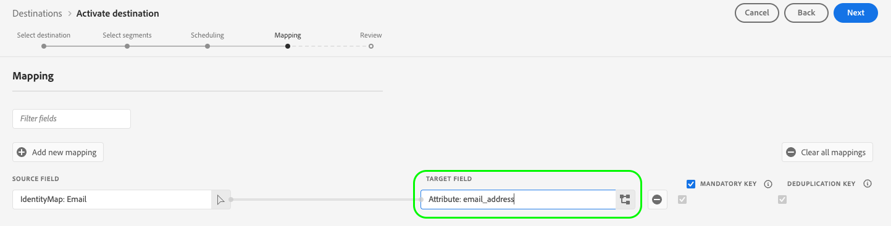

# (알파) [!DNL LiveRamp - SFTP] 연결 {#liveramp-destination}

LiveRamp 연결을 사용하여 Adobe Real-time Customer Data Platform에서 로 대상을 온보딩합니다 [!DNL LiveRamp Connect].

>[!IMPORTANT]
>
><p>이 대상 연결은 현재 알파 단계에 있으며 제한된 고객 선택에서만 사용할 수 있습니다. 기능 및 설명서는 변경될 수 있습니다.</p>
&gt;<p>이 대상 연결의 최종 버전은 고객 마이그레이션이 필요할 수 있습니다.</p>


## 사용 사례 {#use-cases}

를 사용하는 방법과 시기를 더 잘 이해할 수 있도록 하기 위해 [!DNL LiveRamp SFTP] 대상은 Adobe Experience Platform 고객이 이 대상을 사용하여 해결할 수 있는 샘플 사용 사례입니다.

마케터는 Adobe Experience Platform의 대상을 온보딩된 ID로 보내려고 합니다 [!DNL LiveRamp Connect] 타겟 사용자를 [!DNL CTV] 플랫폼, [!DNL Ramp ID] 식별자.

## 사전 요구 사항 {#prerequisites}

다음 [!DNL LiveRamp - SFTP] 연결은 [LiveRamp의 SFTP](https://docs.liveramp.com/connect/en/upload-a-file-via-liveramp-s-sftp.html) 저장.

Experience Platform에서 로 데이터를 보내기 전에 [!DNL LiveRamp SFTP]: [!DNL LiveRamp] 자격 증명. 다음 주소로 문의하십시오 [!DNL LiveRamp] 자격 증명이 없는 경우 자격 증명을 받을 담당자입니다.

## 지원되는 ID {#supported-identities}

LiveRamp SFTP는 공식 설명서에 설명된 PII 기반 식별자, 알려진 식별자 및 사용자 지정 ID와 같은 ID의 활성화를 지원합니다 [LiveRamp 설명서](https://docs.liveramp.com/connect/en/identity-and-identifier-terms-and-concepts.html#known-identifiers).

에서 [매핑 단계](#map) 활성화 워크플로우에서 타겟 매핑을 사용자 지정 속성으로 정의해야 합니다.

## 내보내기 유형 및 빈도 {#export-type-frequency}

대상 내보내기 유형 및 빈도에 대한 자세한 내용은 아래 표를 참조하십시오.

| 항목 | 유형 | 참고 |
---------|----------|---------|
| 내보내기 유형 | **[!UICONTROL 세그먼트 내보내기]** | 에서 사용되는 식별자(이름, 전화 번호 또는 기타 식별자)로 세그먼트의 모든 멤버(대상)를 내보내고 있습니다 [!DNL LiveRamp SFTP] 대상. |
| 내보내기 빈도 | **[!UICONTROL 일별 배치]** | Experience Platform 평가를 기반으로 프로필이에서 업데이트되므로 프로필(ID)은 대상 플랫폼에 다운스트림으로 매일 한 번 업데이트됩니다. 자세한 내용 [배치 파일 기반 대상](/help/destinations/destination-types.md#file-based). |

{style="table-layout:auto"}

## 대상에 연결 {#connect}

>[!IMPORTANT]
> 
>대상에 연결하려면 **[!UICONTROL 대상 관리]** [액세스 제어 권한](/help/access-control/home.md#permissions). 다음 문서를 참조하십시오. [액세스 제어 개요](/help/access-control/ui/overview.md) 또는 제품 관리자에게 문의하여 필요한 권한을 얻으십시오.

이 대상에 연결하려면 [대상 구성 자습서](../../ui/connect-destination.md). 대상 구성 워크플로우에서 아래 두 섹션에 나열된 필드를 채웁니다.

### 대상에 인증 {#authenticate}

대상을 인증하려면 필요한 필드를 입력하고 을(를) 선택합니다 **[!UICONTROL 대상에 연결]**.

**암호를 사용한 SFTP 인증** {#sftp-password}


* **[!UICONTROL 사용자 이름]**: 사용자 이름 [!DNL LiveRamp SFTP] 저장 위치입니다.
* **[!UICONTROL 암호]**: 사용자 [!DNL LiveRamp SFTP] 저장 위치입니다.
* **[!UICONTROL PGP/GPG 암호화 키]**: 선택적으로 RSA 형식의 공개 키를 첨부하여 내보낸 파일에 암호화를 추가할 수 있습니다. 아래 이미지에서 올바른 형식의 암호화 키의 예를 봅니다. 암호화 키를 제공하는 경우 **[!UICONTROL 암호화 하위 키 ID]** 에서 [대상 세부 정보](#destination-details) 섹션을 참조하십시오.

   

**SSH 키 인증이 있는 SFTP** {#sftp-ssh}


* **[!UICONTROL 사용자 이름]**: 사용자 이름 [!DNL LiveRamp SFTP] 저장 위치입니다.
* **[!UICONTROL SSH 키]**: 개인 [!DNL SSH] 에 로그인하는 데 사용되는 키 [!DNL LiveRamp SFTP] 저장 위치입니다. 개인 키는 [!DNL Base64]-인코딩된 문자열이며 암호로 보호되어서는 안 됩니다.

   * 연결 [!DNL SSH] 키 [!DNL LiveRamp SFTP] 서버, 티켓을 제출해 [!DNL LiveRamp]의 기술 지원 포털에서 공개 키를 제공합니다. 자세한 내용은 [LiveRamp 설명서](https://docs.liveramp.com/connect/en/upload-a-file-via-liveramp-s-sftp.html#upload-with-an-sftp-client).

* **[!UICONTROL PGP/GPG 암호화 키]**: 선택적으로 RSA 형식의 공개 키를 첨부하여 내보낸 파일에 암호화를 추가할 수 있습니다. 암호화 키를 제공하는 경우 **[!UICONTROL 암호화 하위 키 ID]** 에서 [대상 세부 정보](#destination-details) 섹션을 참조하십시오. 아래 이미지에서 올바른 형식의 암호화 키의 예를 봅니다.

   

### 대상 세부 사항 채우기 {#destination-details}

>[!CONTEXTUALHELP]
>id="platform_destinations_liveramp_subkey"
>title="암호화 하위 키 ID"
>abstract="LiveRamp 공개 암호화 키를 기반으로 암호화에 사용되는 하위 키 ID입니다. 인증 단계에서 암호화 키를 제공한 경우 이 필드가 필요합니다."
>additional-url="https://docs.liveramp.com/connect/en/encrypting-files-for-uploading.html#downloading-the-current-encryption-key" text="하위 키 ID를 가져오는 방법을 알아봅니다"

대상에 대한 세부 사항을 구성하려면 아래 필수 및 선택적 필드를 입력합니다. UI에서 필드 옆에 있는 별표는 필드가 필수임을 나타냅니다.


* **[!UICONTROL 이름]**: 나중에 이 대상을 인식하는 이름입니다.
* **[!UICONTROL 설명]**: 나중에 이 대상을 식별하는 데 도움이 되는 설명입니다.
* **[!UICONTROL 폴더 경로]**: 경로 [!DNL LiveRamp] `uploads` 내보낸 파일을 호스트하는 하위 폴더입니다. 다음 `uploads` 접두사가 폴더 경로에 자동으로 추가됩니다.
   * 예를 들어 파일을 로 내보내려면 `uploads/my_export_folder`, 입력 `my_export_folder` 에서 **[!UICONTROL 폴더 경로]** 필드.
* **[!UICONTROL 압축 포맷]**: Experience Platform이 내보낸 파일에 사용할 압축 유형을 선택합니다. 사용 가능한 옵션은 다음과 같습니다 **[!UICONTROL GZIP]** 또는 **[!UICONTROL 없음]**.
* **[!UICONTROL 암호화 하위 키 ID]**: 암호화에 사용되는 하위 키는 [!DNL LiveRamp] 공개 암호화 키. 이 필드는 [인증](#authenticate) 단계. 자세한 내용은 [!DNL LiveRamp] [암호화 설명서](https://docs.liveramp.com/connect/en/encrypting-files-for-uploading.html#downloading-the-current-encryption-key) 하위 키 ID를 가져오는 방법을 알아봅니다.

### 경고 활성화 {#enable-alerts}

경고를 활성화하여 대상으로 데이터 흐름 상태에 대한 알림을 받을 수 있습니다. 목록에서 경고를 선택하여 데이터 흐름 상태에 대한 알림을 수신합니다. 경고에 대한 자세한 내용은 다음 안내서를 참조하십시오. [UI를 사용하여 대상 경고 구독](../../ui/alerts.md).

대상 연결에 대한 세부 정보 제공을 마치면 를 선택합니다 **[!UICONTROL 다음]**.

## 세그먼트를 이 대상에 활성화 {#activate}

>[!IMPORTANT]
> 
>데이터를 활성화하려면 **[!UICONTROL 대상 관리]**, **[!UICONTROL 대상 활성화]**, **[!UICONTROL 프로필 보기]**, 및 **[!UICONTROL 세그먼트 보기]** [액세스 제어 권한](/help/access-control/home.md#permissions). 다음 문서를 참조하십시오. [액세스 제어 개요](/help/access-control/ui/overview.md) 또는 제품 관리자에게 문의하여 필요한 권한을 얻으십시오.

읽기 [대상자 데이터를 활성화하여 묶음 프로필 내보내기 대상 활성화](/help/destinations/ui/activate-batch-profile-destinations.md) 대상 세그먼트를 이 대상으로 활성화하는 방법에 대한 지침입니다.

### 예약 {#scheduling}

에서 [!UICONTROL 예약] 단계에서 아래 표시된 설정을 사용하여 각 세그먼트에 대한 내보내기 일정을 만듭니다.

>[!IMPORTANT]
>
>이 대상에 활성화된 모든 세그먼트는 아래와 같이 정확히 동일한 일정으로 구성해야 합니다.

* **[!UICONTROL 파일 내보내기 옵션]**: [!UICONTROL 전체 파일 내보내기]. [증분 파일 내보내기](../../ui/activate-batch-profile-destinations.md#export-incremental-files) 은 현재 [!DNL LiveRamp] 대상.
* **[!UICONTROL 빈도]**: [!UICONTROL 일별]
* 내보내기 시간을 로 설정합니다. **[!UICONTROL 세그먼트 평가 후]**. 예약된 세그먼트 내보내기 및 [on-demand 파일 내보내기](../../ui/export-file-now.md) 은 현재 [!DNL LiveRamp] 대상.
* **[!UICONTROL 날짜]**: 원하는 대로 내보내기 시작 및 종료 시간을 선택합니다.


내보낸 파일 이름은 현재 사용자가 구성할 수 없습니다. 로 내보낸 모든 파일 [!DNL LiveRamp SFTP] 대상은 다음 템플릿을 기반으로 자동으로 이름이 지정됩니다.

`%ORGANIZATION_NAME%_%DESTINATION%_%DESTINATION_INSTANCE_ID%_%DATETIME%`


예를 들어, 이름이 인 조직에 대해 내보낸 파일의 이름은 [!DNL Luma] 의 모습은 다음과 비슷합니다.

```json
Luma_LiveRamp_52137231-4a99-442d-804c-39a09ddd005d_20230330_153857.csv
```

### 특성 및 ID 매핑 {#map}

에서 **[!UICONTROL 매핑]** 단계: 프로필에 대해 내보낼 속성 및 ID를 선택할 수 있습니다.

>[!IMPORTANT]
>
>이 대상은 활성화 흐름당 하나의 소스 ID 네임스페이스의 활성화를 지원합니다. 처럼 여러 ID 네임스페이스를 내보내야 하는 경우 `Email` 및 `Phone`: [별도의 활성화 흐름 만들기](../../ui/activate-batch-profile-destinations.md) 각 id에 대해 사용할 수 있습니다.

에서 **[!UICONTROL 매핑]** 단계, **[!UICONTROL Target 필드]** 매핑은 내보낸 CSV 파일에서 열 헤더의 이름을 정의합니다. 에 사용자 지정 이름을 제공하여 내보낸 파일의 CSV 열 헤더를 원하는 친숙한 이름으로 변경할 수 있습니다 **[!UICONTROL Target 필드]**.

1. 에서 **[!UICONTROL 매핑]** 단계, 선택 **[!UICONTROL 새 매핑 추가]**. 화면에 새 매핑 행이 표시됩니다.

   

2. 에서 **[!UICONTROL 소스 필드 선택]** 창에서 **[!UICONTROL 속성 선택]** 카테고리를 선택하고 매핑할 XDM 속성을 선택하거나 **[!UICONTROL ID 네임스페이스 선택]** 카테고리를 선택하고 대상에 매핑할 ID를 선택합니다.

   

3. 에서 **[!UICONTROL 대상 필드 선택]** 창에서 선택한 소스 필드를 매핑할 속성 이름을 입력합니다. 여기에 정의된 특성 이름은 내보낸 CSV 파일에 열 헤더로 반영됩니다.

   

   또한 속성 이름을 **[!UICONTROL Target 필드]**.

   

원하는 매핑을 모두 추가했으면 를 선택합니다 **[!UICONTROL 다음]** 활성화 워크플로우를 완료합니다.

## 내보낸 데이터 / 데이터 내보내기 유효성 검사 {#exported-data}

데이터를 로 내보냅니다 [!DNL LiveRamp SFTP] 구성한 저장소 위치를 CSV 파일로 저장합니다.

파일을 로 내보낼 때 [!DNL LiveRamp SFTP] 대상, 플랫폼에서는 각 CSV 파일에 대해 하나의 CSV 파일을 생성합니다 [병합 정책 ID](../../../profile/merge-policies/overview.md).

예를 들어 다음 세그먼트를 고려해 보겠습니다.

* 세그먼트 A(병합 정책 1)
* 세그먼트 B(병합 정책 2)
* 세그먼트 C(병합 정책 1)
* 세그먼트 D(병합 정책 1)

플랫폼에서는 두 개의 CSV 파일을 로 내보냅니다 [!DNL LiveRamp SFTP]:

* 세그먼트 A, C 및 D가 포함된 하나의 CSV 파일
* 세그먼트 B가 포함된 하나의 CSV 파일입니다.

내보낸 CSV 파일에는 속성 이름과 세그먼트 ID를 열 헤더로 사용하는 별도의 열에 선택한 속성과 해당 세그먼트 상태가 있는 프로필이 포함되어 있습니다.

내보낸 파일에 포함된 프로필은 다음 세그먼트 자격 상태 중 하나와 일치할 수 있습니다.

* `Active`: 프로필은 현재 세그먼트에 대한 자격을 갖습니다.
* `Expired`: 이 프로필은 더 이상 세그먼트에 대한 자격이 없지만 과거에 자격을 가지고 있습니다.
* `""`(빈 문자열): 프로필이 세그먼트에 대해 자격을 부여받지 않았습니다.


예를 들어, 하나의 CSV 파일로 내보낸 CSV 파일 `email` 속성 및 3개의 세그먼트는 다음과 같습니다.

```csv
email,aa2e3d98-974b-4f8b-9507-59f65b6442df,45d4e762-6e57-4f2f-a3e0-2d1893bcdd7f,7729e537-4e42-418e-be3b-dce5e47aaa1e
abc117@testemailabc.com,active,,
abc111@testemailabc.com,,,active
abc102@testemailabc.com,,,active
abc116@testemailabc.com,active,,
abc107@testemailabc.com,active,expired,active
abc101@testemailabc.com,active,active,
```

Platform은 각 CSV 파일에 대해 하나의 CSV 파일을 생성하므로 [병합 정책 ID](../../../profile/merge-policies/overview.md)또한 각 병합 정책 ID에 대해 별도의 데이터 흐름 실행을 생성합니다.

이것은 **[!UICONTROL ID가 활성화됨]** 및 **[!UICONTROL 받은 프로필]** 지표 [데이터 흐름 실행](../../../dataflows/ui/monitor-destinations.md#dataflow-runs-for-batch-destinations) 각 세그먼트에 대해 표시되는 대신 동일한 병합 정책을 사용하는 각 세그먼트 그룹에 대해 페이지가 집계됩니다.

동일한 병합 정책을 사용하는 세그먼트 그룹에 대해 데이터 흐름 실행이 생성되므로 세그먼트 이름은 [대시보드 모니터링](../../../dataflows/ui/monitor-destinations.md#dataflow-runs-for-batch-destinations).


## 내보낸 데이터를 LiveRamp에 업로드 {#upload-to-liveramp}

데이터를 로 성공적으로 내보낸 후 [!DNL LiveRamp - SFTP] 저장 영역에서에 데이터를 업로드해야 합니다 [!DNL LiveRamp] 플랫폼.

에서 파일을 업로드하는 방법에 대한 자세한 내용은 [!DNL LiveRamp - SFTP] 스토리지 [!DNL LiveRamp] 대상. 다음 설명서를 참조하십시오. [대상으로 첫 번째 파일을 업로드할 때의 고려 사항](https://docs.liveramp.com/connect/en/considerations-when-uploading-the-first-file-to-an-audience.html#considerations-when-uploading-the-first-file-to-an-audience).

## 데이터 사용 및 거버넌스 {#data-usage-governance}

모두 [!DNL Adobe Experience Platform] 대상은 데이터를 처리할 때 데이터 사용 정책을 준수합니다. 방법에 대한 자세한 정보 [!DNL Adobe Experience Platform] 데이터 거버넌스 적용, 읽기 [데이터 거버넌스 개요](/help/data-governance/home.md).

## 추가 리소스 {#additional-resources}

LiveRamp SFTP 저장소를 구성하는 방법에 대한 자세한 내용은 [공식 문서](https://docs.liveramp.com/connect/en/upload-a-file-via-liveramp-s-sftp.html).
