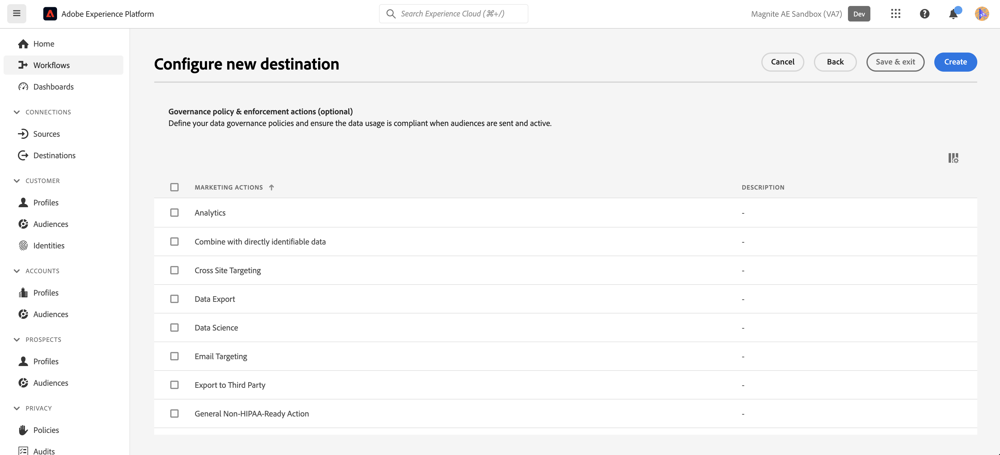
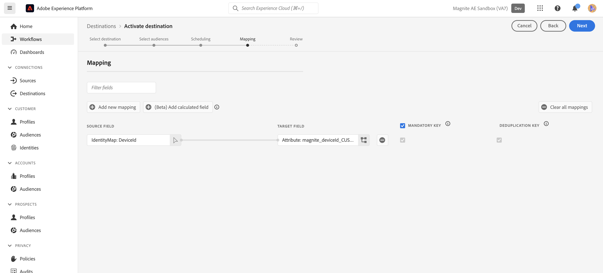

# Magnite: 배치 연결 {#magnite-streaming-batch}

## 개요 {#overview}

이 문서에서는 Magnite: 배치 대상에 대해 설명하고 대상자를 활성화하고 내보내는 방법을 이해하는 데 도움이 되는 샘플 사용 사례를 제공합니다.

Adobe Real-Time CDP 대상자는 하루에 한 번, 또는 실시간으로 제공될 수 있는 두 가지 방법으로 Magnite 스트리밍 플랫폼에 제공될 수 있습니다.

1. 하루에 한 번만 대상자를 전달하려는 경우, 일일 S3 배치 파일 전달을 통해 대상자를 Magnite 스트리밍으로 전달하는 Magnite: Batch 대상을 사용할 수 있습니다. 이러한 일괄 처리 대상자는 이틀 동안만 저장되는 실시간 대상자와 달리 Magnite 플랫폼에 무기한으로 저장됩니다.

2. 하지만 대상자를 더 자주 전달하거나 전달해야 하는 경우에는 [Magnite Real-Time](/help/destinations/catalog/advertising/magnite-streaming.md) 대상을 사용해야 합니다. 실시간 대상 사용 시 Magnite 스트리밍은 실시간으로 대상자를 받지만 Magnite는 자사 플랫폼에 실시간 대상자를 일시적으로 저장할 수 있을 뿐이며 2일 이내에 시스템에서 제거됩니다. 따라서 Magnite 실시간 대상을 사용하려면 *또한* Magnite: Batch 대상을 사용해야 합니다. Real-Time 대상에 대해 활성화하는 각 대상도 Batch 대상에 대해 활성화해야 합니다.

요약: 하루에 한 번만 Adobe Real-Time CDP 대상자를 전달하려는 경우 Magnite: Batch 대상만 사용하며 대상자는 하루에 한 번 전달됩니다. Adobe Real-Time CDP 대상을 실시간으로 전달하려면 Magnite: 배치 대상 및 Magnite 실시간 대상을 *모두*&#x200B;사용합니다. 자세한 내용은 Magnite: Streaming에 문의하십시오.

Magnite에 대한 자세한 내용은 아래를 계속 읽어 보십시오. 배치 대상, 연결 방법, 여기에 Adobe Real-Time CDP 대상자를 활성화하는 방법.
실시간 대상에 대한 자세한 내용은 대신 [이 설명서 페이지](magnite-streaming.md)를 참조하세요.

>[!IMPORTANT]
>
>대상 커넥터 및 문서 페이지는 [!DNL Magnite] 팀에서 만들고 유지 관리합니다. 문의 사항이나 업데이트 요청이 있으면 `adobe-tech@magnite.com`(으)로 직접 연락하십시오.

## 사용 사례 {#use-cases}

Magnite: 배치 대상을 사용하는 방법과 시기를 더 잘 이해할 수 있도록 Adobe Experience Platform 고객이 이 대상을 사용하여 해결할 수 있는 샘플 사용 사례를 소개합니다.

### 사용 사례 #1 {#use-case-1}

Magnite 실시간 대상에서 대상을 활성화했습니다.

배치 게재의 데이터는 Magnite 스트리밍 플랫폼 내에서 실시간 게재의 데이터를 대체/지속하기 위한 것이므로 Magnite 실시간 대상을 통해 활성화된 모든 대상도 Magnite: 배치 대상을 사용해야 합니다.

### 사용 사례 #2 {#use-case-2}

Magnite Streaming 플랫폼에 대한 배치/일일 케이던스로만 대상을 활성화하려고 합니다.

Magnite: 배치 대상을 통해 활성화된 모든 대상자는 배치/일별 케이던스로 전달되며 Magnite 스트리밍 플랫폼에서 타깃팅에 사용할 수 있습니다.

## 전제 조건 {#prerequisites}

Adobe Experience Platform에서 [!DNL Magnite] 대상을 사용하려면 먼저 Magnite 스트리밍 계정이 있어야 합니다. [!DNL Magnite Streaming] 계정이 있는 경우 [!DNL Magnite] 계정 관리자에게 연락하여 [!DNL Magnite's] 대상에 액세스하기 위한 자격 증명을 제공받으십시오. [!DNL Magnite Streaming] 계정이 없는 경우 adobe-tech@magnite.com에 문의하십시오.

## 지원되는 ID {#supported-identities}

Magnite: 배치 대상은 Adobe CDP로부터 *모든* ID 소스를 받을 수 있습니다. 현재 이 대상에는 매핑할 Target ID 필드가 3개 있습니다.

>[!NOTE]
>
>*모든* ID 원본을 `magnite_deviceId` 대상 ID에 매핑할 수 있습니다.

| 대상 ID | 설명 | 고려 사항 |
|:--------------------------- |:------------------------------------------------------------------------------------------------ |:------------------------------------------------------------------------------------- |
| magnite_deviceId_GAID | GOOGLE ADVERTISING ID | 소스 ID가 GAID인 경우 이 Target ID 선택 |
| magnite_deviceId_IDFA | 광고주용 Apple ID | 소스 ID가 IDFA인 경우 이 대상 ID를 선택합니다. |
| magnite_deviceId_CUSTOM | 사용자 정의/사용자 정의 ID | 소스 ID가 GAID 또는 IDFA가 아니거나 사용자 지정 또는 사용자 정의 ID인 경우 이 대상 ID를 선택합니다 |

{style="table-layout:auto"}

## 지원되는 대상자 {#supported-audiences}

| 대상자 원본 | 지원됨 | 설명 |
|-----------------------------|----------|----------|
| [!DNL Segmentation Service] | ✓ 덧신 | Experience Platform [세그먼테이션 서비스](../../../segmentation/home.md)를 통해 생성된 대상입니다. |
| 사용자 정의 업로드 | ✓ 덧신 | CSV 파일에서 Experience Platform으로 대상 [가져옴](../../../segmentation/ui/audience-portal.md#import-audience). |

{style="table-layout:auto"}

## 내보내기 유형 및 빈도 {#export-type-frequency}

| 항목 | 유형 | 참고 |
|-----------------------------|----------|----------|
| 내보내기 유형 | 대상자 내보내기 | Magnite: 배치 대상에 사용된 식별자(이름, 전화번호 또는 기타)로 대상자의 모든 구성원을 내보냅니다. |
| 내보내기 빈도 | 배치 | 배치 대상은 파일을 3, 6, 8, 12 또는 24시간 단위로 다운스트림 플랫폼으로 내보냅니다. 일괄 처리 [파일 기반 대상](/help/destinations/destination-types.md)에 대해 자세히 알아보세요. |

{style="table-layout:auto"}

## 대상에 연결 {#connect}

대상 사용이 승인되고 Magnite Streaming이 자격 증명을 공유하면 아래 단계에 따라 데이터를 인증, 매핑 및 공유하십시오.

### 대상으로 인증 {#authenticate}

Adobe 경험 카탈로그에서 Magnite: 배치 대상을 찾습니다. 추가 옵션 단추(\..)를 클릭한 다음 대상 연결/인스턴스를 구성합니다.

기존 계정이 이미 있는 경우 계정 유형 옵션을 &quot;기존 계정&quot;으로 변경하여 찾을 수 있습니다. 그렇지 않으면 아래에 계정을 만듭니다.

새 계정을 만들고 처음으로 대상에 인증하려면 필수 &quot;S3 액세스 키&quot; 및 &quot;S3 비밀 키&quot; 필드(계정 관리자를 통해 제공됨)를 입력한 다음 **[!UICONTROL 대상에 연결]**&#x200B;을 선택합니다.

>[!NOTE]
>
>Magnite Streaming의 보안 정책에는 S3 키를 정기적으로 회전해야 합니다. 새 S3 액세스 및 S3 비밀 키로 나중에 계정을 업데이트할 수 있습니다. 계정 자체만 업데이트하면 됩니다. 해당 계정을 사용하는 대상은 업데이트된 키를 자동으로 사용합니다. 새 키를 업로드하지 않으면 데이터를 이 대상으로 보내지 못합니다.

### 대상 세부 정보 입력 {#destination-details}

대상에 대한 세부 정보를 구성하려면 아래의 필수 및 선택 필드를 채우십시오. UI에서 필드 옆에 있는 별표는 필드가 필수임을 나타냅니다.

* **[!UICONTROL 이름]**: 이 대상 연결/인스턴스를 인식할 이름입니다.
미래.
* **[!UICONTROL 설명]**: 이 항목을 식별하는 데 도움이 되는 설명입니다
향후 대상 연결/인스턴스.
* **[!UICONTROL 회사 이름]**: 고객/회사 이름. 지원되는 [!DNL Magnite Streaming] 클라이언트만 선택할 수 있습니다.

>[!NOTE]
>
>회사 이름은 Magnite로 구성하고 [대상에 인증](#authenticate) 단계에서 설정한 Amazon S3 게재 버킷의 이름과 일치하는 문자열이어야 합니다. 지원되는 문자에는 &#39;a-z&#39;, &#39;A-Z&#39;, &#39;0-9&#39;, &#39;-&#39;(대시) 또는 &#39;_&#39;(밑줄)이 포함됩니다.

>[!NOTE]
>
>배치 대상을 사용하여 여러 ID 유형(GAID, IDFA 등)을 전송하려는 경우 각각에 대해 새 대상 연결/인스턴스가 필요합니다. 자세한 내용은 Magnite 계정 담당자에게 문의하십시오.

그런 다음 **[!UICONTROL 다음]**&#x200B;을 선택하여 계속할 수 있습니다.

다음 화면인 &quot;거버넌스 정책 및 시행 작업(선택 사항)&quot;에서는 필요한 경우 관련 데이터 거버넌스 정책을 선택할 수 있습니다. &quot;데이터 내보내기&quot;는 일반적으로 Magnite: 배치 대상에 대해 선택됩니다.

선택한 후 또는 이 선택적 화면을 건너뛰려면 **[!UICONTROL 만들기]**&#x200B;를 선택하세요.

### 경고 활성화 {#enable-alerts}

경고를 활성화하여 대상에 대한 데이터 흐름 상태에 대한 알림을 받을 수 있습니다. 목록에서 경고를 선택하여 데이터 흐름 상태에 대한 알림을 수신합니다. 경고에 대한 자세한 내용은 [UI를 사용하여 대상 경고 구독](../../ui/alerts.md)에 대한 안내서를 참조하십시오.

대상 연결에 대한 세부 정보를 모두 제공했으면 **[!UICONTROL 다음]**&#x200B;을 선택합니다.

### 이 대상에 대한 세그먼트 활성화 {#activate}

>[!IMPORTANT]
> 
>* 데이터를 활성화하려면 **[!UICONTROL 대상 보기]**, **[!UICONTROL 대상 활성화]**, **[!UICONTROL 프로필 보기]** 및 **[!UICONTROL 세그먼트 보기]** [액세스 제어 권한](/help/access-control/home.md#permissions)이 필요합니다. [액세스 제어 개요](/help/access-control/ui/overview.md)를 읽거나 제품 관리자에게 문의하여 필요한 권한을 받으십시오.
>* *ID*&#x200B;을(를) 내보내려면 **[!UICONTROL ID 그래프 보기]** [액세스 제어 권한](/help/access-control/home.md#permissions)이 필요합니다.   {width="100" zoomable="yes"}

대상 세그먼트를 이 대상으로 활성화하는 방법에 대한 지침은 [대상 데이터를 일괄 프로필 내보내기 대상으로 활성화](/help/destinations/ui/activate-batch-profile-destinations.md)를 참조하십시오.

### 속성 및 ID 매핑 {#map}

**[!UICONTROL Source 필드]**&#x200B;에서 장치에 대한 특성이나 ID를 선택할 수 있습니다. 이 예제에서는 &quot;DeviceId&quot;라는 사용자 지정 IdentityMap을 선택했습니다

**[!UICONTROL 대상 필드]**&#x200B;에서:
 자세한 내용은 [지원되는 ID](#supported-identities)를 참조하십시오.
이 예제에서는 **[!UICONTROL Source 필드]**&#x200B;이(가) 사용자 지정 IdentityMap: DeviceID로 정의되어 있으므로 **[!UICONTROL Target 필드]**: magnite_deviceId_CUSTOM을 선택했습니다.

>[!NOTE]
>
>배치 대상을 사용하여 여러 ID 유형(GAID, IDFA 등)을 전송/매핑하려는 경우 각각에 대해 새 대상 연결/인스턴스가 필요합니다. 자세한 내용은 Magnite 계정 담당자에게 문의하십시오.

&quot;각 대상에 대한 파일 이름 및 내보내기 일정 구성&quot; 화면에서 이제 각 대상에 대해 시작 날짜(필수), 종료 날짜(선택 사항) 및 매핑 ID(필수)를 구성해야 합니다.

>[!IMPORTANT]
>
> 이 대상에는 매핑 ID 또는 &quot;없음&quot;이 필요합니다.
>
> 대상자에게 이전에 Magnite Streaming으로 알려진 기존 세그먼트 ID가 있는 경우 매핑 ID를 제공해야 합니다. 그렇지 않으면 &quot;없음&quot;을 매핑 ID로 사용해야 합니다.
>
> 각 대상에 대한 파일 이름을 구성할 때 추가할 &quot;사용자 지정 텍스트&quot; 필드를 통해 매핑 ID를 포함하십시오. 매핑 ID가 `{previous_filename}\_\[MAPPING_ID\].`(으)로 추가됩니다. 이 대상자가 Magnite Streaming을 처음 사용하는 경우 매핑 ID를 제공하지 않을 경우 &quot;사용자 지정 텍스트&quot; 필드에 &quot;없음&quot;을 입력해야 합니다. 이 경우 새 파일 이름은 `{previous_filename}\_\[NONE\]`이어야 합니다.

## 내보낸 데이터/데이터 내보내기 유효성 검사 {#exported-data}

대상이 업로드되면 대상이 올바르게 생성 및 업로드되었는지 확인할 수 있습니다.

* Magnite: 배치 대상은 S3 파일을 매일 케이던스로 Magnite 스트리밍에 전달합니다. 게재 및 수집 후 대상/세그먼트는 Magnite Streaming에 나타나야 하며 거래에 적용될 수 있습니다. Adobe Experience Platform의 활성화 단계 동안 공유된 세그먼트 ID 또는 세그먼트 이름을 조회하여 이를 확인할 수 있습니다.

>[!NOTE]
>
>Magnite에 활성화/전달된 대상: 배치 대상은 Magnite 실시간 대상을 통해 활성화/전달된 동일한 대상을 *바꾸기*&#x200B;합니다. 세그먼트 이름을 사용하여 세그먼트를 조회하는 경우 Magnite Streaming Platform에서 일괄 처리를 수집하고 처리할 때까지 실시간으로 세그먼트를 찾을 수 없습니다.

## 데이터 사용 및 관리 {#data-usage-governance}

데이터를 처리할 때 모든 [!DNL Adobe Experience Platform] 대상이 데이터 사용 정책을 준수합니다. [!DNL Adobe Experience Platform]에서 데이터 거버넌스를 적용하는 방법에 대한 자세한 내용은 [데이터 거버넌스 개요](/help/data-governance/home.md)를 참조하십시오.

## 추가 리소스 {#additional-resources}

추가 도움말 문서를 보려면 [Magnite 도움말 센터](https://help.magnite.com/help)를 방문하세요.
