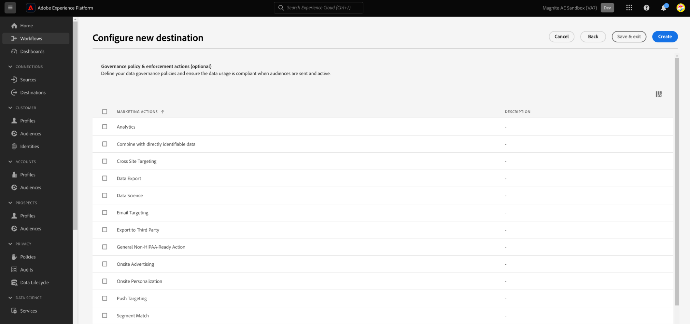

# (Beta) Magnite 스트리밍: 실시간 대상 연결

## 개요 {#overview}

다음 [!DNL Magnite Streaming: Real-Time] 그리고 Magnite 스트리밍: Adobe Experience Platform의 배치 대상을 사용하면 Magnite 스트리밍 플랫폼에서 타깃팅 및 활성화를 위해 대상을 매핑하고 내보낼 수 있습니다.

대상자를 다음으로 활성화 [!DNL Magnite Streaming] platform은 Magnite 스트리밍: 실시간 및 Magnite 스트리밍: 배치 대상을 모두 사용해야 하는 2단계 프로세스입니다.

대상자를 활성화하려면에 [!DNL Magnite Streaming], 다음을 수행해야 합니다.

* 에서 대상자 활성화 [!DNL Magnite Streaming: Real-Time] 대상 을 참조하십시오.
* Magnite Streaming: 배치 대상에서 동일한 대상을 활성화합니다. 다음 [!DNL Magnite Streaming: Batch] 대상은 필수 구성 요소입니다. 에서 대상자 활성화 실패 [!DNL Magnite Streaming] 일괄 처리 대상으로 인해 통합이 실패하고 대상이 활성화되지 않습니다.

참고: 실시간 대상을 사용하는 경우 [!DNL Magnite: Streaming] 실시간으로 대상자를 받지만, 실시간 대상자를 당사의 플랫폼에 임시 저장할 수 있으며, 이틀 내로 시스템에서 제거됩니다. 따라서 Magnite: Streaming Real-Time 대상을 사용하려면 다음을 수행합니다. *또한* Magnite Streaming: 배치 대상 을 사용해야 합니다. 실시간 대상으로 활성화하는 각 대상도 배치 대상으로 활성화해야 합니다.

>[!IMPORTANT]
>
>이 대상 커넥터는 베타 버전이며 일부 고객만 사용할 수 있습니다. 액세스 권한을 요청하려면 Adobe 담당자에게 문의하십시오.
>
>대상 커넥터 및 설명서 페이지는 [!DNL Magnite] 팀. 문의 사항이나 업데이트 요청은 다음 주소로 직접 문의하십시오. `adobe-tech@magnite.com`.

## 사용 사례 {#use-cases}

을(를) 사용하는 방법과 시기를 더 잘 이해할 수 있도록 [!DNL Magnite Streaming: Real-Time] destination은 Adobe Experience Platform 고객이 이 대상을 사용하여 해결할 수 있는 샘플 사용 사례입니다.

### 활성화 및 타기팅 {#activation-and-targeting}

Magnite와의 이러한 통합을 통해 고객은 광고 타겟팅을 위해 Adobe Experience Platform의 CDP 대상을 Magnite로 전달할 수 있습니다. 긍정적인 타겟팅과 부정적인 타겟팅(제외)을 위해 Magnite 내에서 대상을 선택할 수 있습니다.

## 전제 조건 {#prerequisites}

을(를) 사용하려면 [!DNL Magnite] 대상: Adobe Experience Platform에 있는 경우 먼저 [!DNL Magnite Streaming] 계정입니다. 다음 항목이 있는 경우: [!DNL Magnite Streaming] 계정, 다음으로 연락하십시오. [!DNL Magnite] 액세스하기 위해 자격 증명을 제공할 계정 관리자 [!DNL Magnite's] 대상.
이(가) 없는 경우 [!DNL Magnite Streaming] 계정, adobe-tech@magnite.com에 문의하십시오.

## 지원되는 ID {#supported-identities}

다음 [!DNL Magnite Streaming: Real-Time] 대상 은 아래 표에 설명된 id 활성화를 지원합니다. 자세히 알아보기 [id](/help/identity-service/features/namespaces.md).

| 대상 ID | 설명 | 고려 사항 |
|-------------------|--------------------------------------------------------------------------------------------------|--------------------------------------------------------------------------------------|
| device_id | 디바이스 또는 ID에 대한 고유 식별자. 유형에 관계없이 모든 장치 ID 및 자사 ID를 허용합니다. | 지원하는 ID 유형에는 PPUID, GAID, IDFA 및 TV Device ID가 포함되지만 이에 제한되지 않습니다. |

{style="table-layout:auto"}

## 지원되는 대상자 {#supported-audiences}

이 섹션에서는 이 대상으로 내보낼 수 있는 대상자 유형을 설명합니다.

| 대상자 원본 | 지원됨 | 설명 |
|-----------------------------|----------|----------|
| [!DNL Segmentation Service] | ✓ 덧신 | Experience Platform을 통해 생성된 대상자 [세분화 서비스](../../../segmentation/home.md). |
| 사용자 정의 업로드 | ✓ 덧신 | 대상 [가져옴](../../../segmentation/ui/audience-portal.md#import-audience) csv 파일에서 Experience Platform으로 변환했습니다. |

{style="table-layout:auto"}

## 내보내기 유형 및 빈도 {#export-type-frequency}

대상 내보내기 유형 및 빈도에 대한 자세한 내용은 아래 표를 참조하십시오.

| 항목 | 유형 | 참고 |
|------------------|---------------------------------|------------------------------------------------------------------------------------------------------------------------------------------------------------------------------------------------------------------------------------------------------------------------------------------------------------------------------------|
| 내보내기 유형 | **[!UICONTROL 세그먼트 내보내기]** | 에 사용된 식별자(이름, 전화번호 또는 기타)를 사용하여 세그먼트(대상자)의 모든 구성원을 내보냅니다. [!DNL Magnite Streaming: Real-Time] 대상. |
| 내보내기 빈도 | **[!UICONTROL 스트리밍]** | 스트리밍 대상은 &quot;항상&quot; API 기반 연결입니다. Experience Platform 평가를 기반으로 프로필이 세그먼트에서 업데이트되는 즉시 커넥터가 업데이트 다운스트림을 대상 플랫폼으로 전송합니다. 자세한 내용 [스트리밍 대상](/help/destinations/destination-types.md#streaming-destinations). |

{style="table-layout:auto"}

## 대상에 연결 {#connect}

>[!IMPORTANT]
>
>대상에 연결하려면 다음이 필요합니다. **[!UICONTROL 대상 보기]** 및 **[!UICONTROL 대상 관리]** [액세스 제어 권한](/help/access-control/home.md#permissions). 읽기 [액세스 제어 개요](/help/access-control/ui/overview.md) 필요한 권한을 얻으려면 제품 관리자에게 문의하십시오.

이 대상에 연결하려면 다음과같이 하십시오. [대상 구성 자습서](../../ui/connect-destination.md). 대상 구성 워크플로에서 아래 두 섹션에 나열된 필드를 채웁니다.

### 대상으로 인증 {#authenticate}

대상에 인증하려면 필수 필드를 입력한 다음 을(를) 선택합니다. **[!UICONTROL 대상에 연결]**.

* **[!UICONTROL 사용자 이름]**: 다음 사용자가 제공한 사용자 이름 [!DNL Magnite].
* **[!UICONTROL 암호]**: 다음 사용자가 제공한 암호 [!DNL Magnite].

### 대상 세부 정보 입력 {#destination-details}

대상에 대한 세부 정보를 구성하려면 아래의 필수 및 선택 필드를 채우십시오. UI에서 필드 옆에 있는 별표는 필드가 필수임을 나타냅니다.

* **[!UICONTROL 이름]**: 나중에 이 대상을 인식할 수 있는 이름입니다.
* **[!UICONTROL 설명]**: 나중에 이 대상을 식별하는 데 도움이 되는 설명입니다.
* **[!UICONTROL 소스 파트너 이름]**: 고객/회사 이름. 지원됨 [!DNL Magnite Streaming] 클라이언트를 선택할 수 있습니다.

완료되면 다음을 선택합니다 **[!UICONTROL 만들기]** 단추를 클릭합니다.

### 경고 활성화 {#enable-alerts}

경고를 활성화하여 대상에 대한 데이터 흐름 상태에 대한 알림을 받을 수 있습니다. 목록에서 경고를 선택하여 데이터 흐름 상태에 대한 알림을 수신합니다. 경고에 대한 자세한 내용은 다음 안내서를 참조하십시오. [UI를 사용하여 대상 경고 구독](../../ui/alerts.md).

대상 연결에 대한 세부 정보를 제공했으면 을 선택합니다. **[!UICONTROL 다음]**.

## 이 대상에 대한 세그먼트 활성화 {#activate}

>[!IMPORTANT]
>
>* 데이터를 활성화하려면 **[!UICONTROL 대상 보기]**, **[!UICONTROL 대상 활성화]**, **[!UICONTROL 프로필 보기]**, 및 **[!UICONTROL 세그먼트 보기]** [액세스 제어 권한](/help/access-control/home.md#permissions). 읽기 [액세스 제어 개요](/help/access-control/ui/overview.md) 필요한 권한을 얻으려면 제품 관리자에게 문의하십시오.
>* 내보내려면 *id*, 다음이 필요합니다. **[!UICONTROL ID 그래프 보기]** [액세스 제어 권한](/help/access-control/home.md#permissions).   {width="100" zoomable="yes"}

읽기 [프로필 및 세그먼트를 스트리밍 세그먼트 내보내기 대상으로 활성화](/help/destinations/ui/activate-segment-streaming-destinations.md) 대상 세그먼트를 이 대상으로 활성화하는 방법에 대한 지침

대상 연결이 생성되면 대상 활성화 플로우로 진행할 수 있습니다. 다음 섹션에서는 Real-Time 대상을 사용하여 대상을 활성화하는 방법을 안내합니다.

### 속성 및 ID 매핑 {#map}

다음 단계는 소스 식별자를 Magnite device_id 식별자에 매핑하는 것입니다.

* 을 선택하여 필요한 만큼 매핑을 추가할 수 있습니다. **[!UICONTROL 새 매핑 추가]**.

Real-Time 대상을 사용하는 이 예제는 Magnite device_id 대상 필드에 매핑된 일반 deviceId 소스 식별자를 포함하는 행을 보여 줍니다. 매핑을 사용하는 경우 다음을 선택합니다 [!UICONTROL 다음].

매핑 ID를 활성화된 모든 대상으로 설정하거나 매핑 ID가 없는 경우 없음 을 설정해야 합니다.

이제 각 대상에 대해 시작 날짜(필수), 종료 날짜(선택 사항) 및 매핑 ID를 구성해야 합니다.

**매핑 ID**

* 사용 **[!UICONTROL 매핑 ID]** 대상자에게 이전에 Magnite에 대해 알려진 기존 세그먼트 ID가 있는 경우 필드.

* 을(를) 추가하려면 **[!UICONTROL 매핑 ID]** 대상자에게 각 대상자 행을 개별적으로 선택하고 오른쪽 열에 데이터를 입력합니다(위의 이미지 참조). 매핑 ID를 추가하지 않으려면 매핑 ID 필드에 NONE을 입력하십시오.

선택 **[!UICONTROL 다음]** 활성화 플로우를 완료합니다.

## 내보낸 데이터/데이터 내보내기 유효성 검사 {#exported-data}

대상이 업로드되면 다음 단계를 통해 대상이 올바르게 생성 및 업로드되었는지 확인할 수 있습니다.

<!--

* In 95% of cases, audiences will be delivered to Magnite Streaming in under 10 minutes. The actual receipt and processing of the events within Magnite Streaming depends on the shared data volume.

-->

* Post-ingest, 대상은에 나타나야 합니다. [!DNL Magnite Streaming] 몇 분 안에 딜에 적용할 수 있습니다. Adobe Experience Platform의 활성화 단계 동안 공유된 세그먼트 ID를 조회하여 이를 확인할 수 있습니다.

## 를 통해 동일한 대상 활성화 [!DNL Magnite Streaming: Batch]대상

대상자 공유 대상 [!DNL Magnite Streaming] 실시간 대상을 사용하는 경우 Magnite Streaming: 배치 대상을 사용하여 공유해야 합니다. 올바르게 구성된 경우 의 세그먼트 이름은 [!DNL Magnite Streaming] UI는 Adobe Experience Platform 일일 이후 업데이트에 사용된 UI를 반영하도록 업데이트됩니다.

마지막으로, 배치 대상이 통합에 대해 구성되지 않은 경우 Magnite Streaming: 배치 대상 문서를 통해 지금 설정합니다.

## 데이터 사용 및 관리 {#data-usage-governance}

모두 [!DNL Adobe Experience Platform] 대상은 데이터를 처리할 때 데이터 사용 정책을 준수합니다. 방법에 대한 자세한 정보 [!DNL Adobe Experience Platform] 데이터 거버넌스 적용, 다음을 읽습니다. [데이터 거버넌스 개요](/help/data-governance/home.md).

## 추가 리소스 {#additional-resources}

추가 도움말 설명서를 보려면 [매그나이트 도움말 센터](https://help.magnite.com/help).
