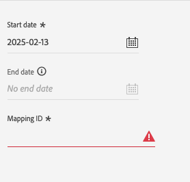

# PubMatic Connect 대상 {#pubmatic-connect}

## 개요 {#overview}

[!DNL PubMatic Connect]을(를) 사용하여 미래의 프로그래밍 방식 디지털 마케팅 공급망을 제공하여 고객 가치를 극대화하십시오. [!DNL PubMatic Connect]은(는) 플랫폼 기술과 전용 서비스를 결합하여 인벤토리와 데이터를 패키지하고 처리하는 방법을 향상시킵니다.

PubMatic Connect 플랫폼으로 대상 데이터를 보낼 수 있는 두 가지 대상이 있습니다. 기능은 약간 다릅니다.

1. PubMatic Connect

   초기 활성화 동안 이 대상은 PubMatic 플랫폼에서 대상을 자동으로 등록하고 내부 Adobe Experience Platform ID를 사용하여 매핑합니다.

2. PubMatic Connect(사용자 지정 대상 ID 매핑)

   이 대상은 활성화 워크플로 중에 매핑 ID를 수동으로 추가하도록 선택할 수 있습니다. PubMatic 플랫폼에서 기존 대상에게 데이터를 보내야 하거나 사용자 지정 &#39;Source 대상 ID&#39;가 필요한 경우 이 대상을 사용합니다.

>[!IMPORTANT]
>
> 대상 커넥터 및 문서 페이지는 [!DNL PubMatic] 팀에서 만들고 유지 관리합니다. 문의 사항이나 업데이트 요청이 있으면 `support@pubmatic.com`(으)로 직접 문의하십시오.

## 사용 사례 {#use-cases}

[!DNL PubMatic Connect] 대상을 사용하는 방법과 시기를 더 잘 이해할 수 있도록 Adobe Experience Platform 고객이 이 대상을 사용하여 해결할 수 있는 샘플 사용 사례를 소개합니다.

### 모바일, 웹 및 CTV 플랫폼에서 사용자 타겟팅 {#targeting}

게시자 또는 데이터 공급자는 다양한 식별자를 사용하여 Adobe Experience Platform에서 [!DNL PubMatic Connect]&#x200B;(으)로 대상을 모바일, 웹 및 CTV 플랫폼의 타겟 사용자로 보내려고 합니다.

## 전제 조건 {#prerequisites}

[!DNL PubMatic] 계정 관리자에게 문의하여 계정이 올바르게 구성되어 있고 대상 세그먼트의 온보딩을 지원하는지 확인하십시오. 또한 설정 중에 이 대상을 사용하고 지원을 제공하기 위해 모든 관련 세부 정보가 있는지 확인합니다.

## 지원되는 ID {#supported-identities}

[!DNL PubMatic Connect]은(는) 아래 표에 설명된 ID 활성화를 지원합니다. [ID](/help/identity-service/features/namespaces.md)에 대해 자세히 알아보세요.

| 대상 ID | 설명 | 고려 사항 |
| --------------- | ------------------------ | ------------------------------------------------------------------------------- |
| GAID | GOOGLE ADVERTISING ID | 소스 ID가 GAID 네임스페이스인 경우 GAID 대상 ID를 선택합니다. |
| IDFA | 광고주용 Apple ID | 소스 ID가 IDFA 네임스페이스인 경우 IDFA 대상 ID를 선택합니다. |
| extern_id | 사용자 지정 사용자 ID | 소스 ID가 사용자 지정 네임스페이스인 경우 이 대상 ID를 선택합니다. |

{style="table-layout:auto"}

## 지원되는 대상자 {#supported-audiences}

이 섹션에서는 이 대상으로 내보낼 수 있는 대상자 유형을 설명합니다.

| 대상자 원본 | 지원됨 | 설명 |
| --------------------------- | --------- | -------------------------------------------------------------------------------------------------------------------------- |
| [!DNL Segmentation Service] | ✓ | Experience Platform [세그먼테이션 서비스](../../../segmentation/home.md)를 통해 생성된 대상입니다. |
| 사용자 정의 업로드 | ✓ | CSV 파일에서 Experience Platform으로 대상 [가져옴](../../../segmentation/ui/audience-portal.md#import-audience). |

{style="table-layout:auto"}

## 내보내기 유형 및 빈도 {#export-type-frequency}

대상 내보내기 유형 및 빈도에 대한 자세한 내용은 아래 표를 참조하십시오.

| 항목 | 유형 | 참고 |
| ---------------- | ------------------------------- | ---------------------------------------------------------------------------------------------------------------------------------------------------------------------------------------------------------------------------------------------------------------------------------------------------------------------------- |
| 내보내기 유형 | **[!UICONTROL 세그먼트 내보내기]** | PubMatic Connect 대상에 사용된 식별자(이름, 전화번호 또는 기타)를 사용하여 세그먼트의 모든 멤버(대상자)를 내보내고 있습니다. |
| 내보내기 빈도 | **[!UICONTROL 스트리밍]** | 스트리밍 대상은 &quot;항상&quot; API 기반 연결입니다. 세그먼트 평가를 기반으로 Experience Platform에서 프로필을 업데이트하면 커넥터가 업데이트 다운스트림을 대상 플랫폼으로 보냅니다. [스트리밍 대상](/help/destinations/destination-types.md#streaming-destinations)에 대해 자세히 알아보세요. |

{style="table-layout:auto"}

## 대상에 연결 {#connect}

>[!IMPORTANT]
>
> 대상에 연결하려면 **[!UICONTROL 대상 관리]** [액세스 제어 권한](/help/access-control/home.md#permissions)이 필요합니다. [액세스 제어 개요](/help/access-control/ui/overview.md)를 읽거나 제품 관리자에게 문의하여 필요한 권한을 받으십시오.

이 대상에 연결하려면 [대상 구성 자습서](../../ui/connect-destination.md)에 설명된 단계를 따르십시오. 대상 구성 워크플로에서 아래 두 섹션에 나열된 필드를 채웁니다.

### 대상으로 인증 {#authenticate}

대상에 인증하려면 필수 필드를 입력한 다음 **[!UICONTROL 대상에 연결]**&#x200B;을(를) 선택하십시오.

- **[!UICONTROL 전달자 토큰]**: 대상에 인증하려면 전달자 토큰을 입력하십시오.

### 대상 세부 정보 입력 {#destination-details}

대상에 대한 세부 정보를 구성하려면 아래의 필수 및 선택 필드를 채우십시오. UI에서 필드 옆에 있는 별표는 필드가 필수임을 나타냅니다.

- **[!UICONTROL 이름]**: 나중에 이 대상을 인식할 수 있는 이름입니다.
- **[!UICONTROL 설명]**: 나중에 이 대상을 식별하는 데 도움이 되는 설명입니다.
- **[!UICONTROL 데이터 파트너 ID]**: 이 통합을 위해 [!DNL PubMatic] 계정에 설정된 데이터 파트너 ID입니다.
- **[!UICONTROL 기본 국가 코드]**: 프로필에 제공되지 않은 경우 모든 ID에 적용해야 하는 기본 국가 코드입니다.
- **[!UICONTROL 계정 ID]**: [!DNL PubMatic Connect] 계정 ID.
- **[!UICONTROL 계정 유형]**: [!DNL PubMatic] 플랫폼 계정의 계정 유형입니다. 선택할 질문이 있으면 [!DNL PubMatic] 계정 관리자에게 문의하십시오. 사용 가능한 옵션은 다음과 같습니다.
   - [!UICONTROL 게시자]
   - [!UICONTROL DEMAND_PARTNER]
   - [!UICONTROL 구매자]

### 경고 활성화 {#enable-alerts}

경고를 활성화하여 대상에 대한 데이터 흐름 상태에 대한 알림을 받을 수 있습니다. 목록에서 경고를 선택하여 데이터 흐름 상태에 대한 알림을 수신합니다. 경고에 대한 자세한 내용은 [UI를 사용하여 대상 경고 구독](../../ui/alerts.md)에 대한 안내서를 참조하십시오.

대상 연결에 대한 세부 정보를 모두 제공했으면 **[!UICONTROL 다음]**&#x200B;을 선택합니다.

## 이 대상에 대한 세그먼트 활성화 {#activate}

>[!IMPORTANT]
>
> - 데이터를 활성화하려면 **[!UICONTROL 대상 보기]**, **[!UICONTROL 대상 활성화]**, **[!UICONTROL 프로필 보기]** 및 **[!UICONTROL 세그먼트 보기]** [액세스 제어 권한](/help/access-control/home.md#permissions)이 필요합니다. [액세스 제어 개요](/help/access-control/ui/overview.md)를 읽거나 제품 관리자에게 문의하여 필요한 권한을 받으십시오.
>
> - _ID_&#x200B;을(를) 내보내려면 **[!UICONTROL ID 그래프 보기]** [액세스 제어 권한](/help/access-control/home.md#permissions)이 필요합니다.   {width="100" zoomable="yes"}

대상 세그먼트를 이 대상으로 활성화하는 방법에 대한 지침은 [프로필 및 세그먼트를 스트리밍 세그먼트 내보내기 대상으로 활성화](/help/destinations/ui/activate-segment-streaming-destinations.md)를 참조하십시오.

### 속성 및 ID 매핑 {#map}

소스 필드 선택:

- 식별자(일반적으로 IDFA 또는 사용자 지정 ID 네임스페이스와 같은 네임스페이스)를 선택합니다.

대상 필드 선택:

- 이 단계에서 올바른 UID 유형에 대한 정보를 얻으려면 [!DNL PubMatic] 계정 관리자에게 문의하십시오.
- 첫 번째 단계에서 선택한 식별자와 일치하는 [!DNL PubMatic UID] 형식 번호를 선택합니다.

### 대상자 예약

PubMatic Connect(사용자 지정 대상 ID 매핑) 대상을 사용하는 경우, PubMatic 플랫폼의 &#39;Source 대상 ID&#39;에 해당하는 각 대상에 매핑 ID를 제공해야 합니다.

## 내보낸 데이터/데이터 내보내기 유효성 검사 {#exported-data}

[!DNL PubMatic] UI를 통해 데이터가 올바르게 푸시되었는지, 세그먼트를 사용할 수 있는지 확인할 수 있습니다. [!DNL PubMatic] UI를 업데이트하기 위해 데이터를 푸시한 후 최대 24시간이 걸릴 수 있습니다.

## 데이터 사용 및 관리 {#data-usage-governance}

데이터를 처리할 때 모든 [!DNL Adobe Experience Platform] 대상이 데이터 사용 정책을 준수합니다. [!DNL Adobe Experience Platform]에서 데이터 거버넌스를 적용하는 방법에 대한 자세한 내용은 [데이터 거버넌스 개요](/help/data-governance/home.md)를 참조하십시오.
