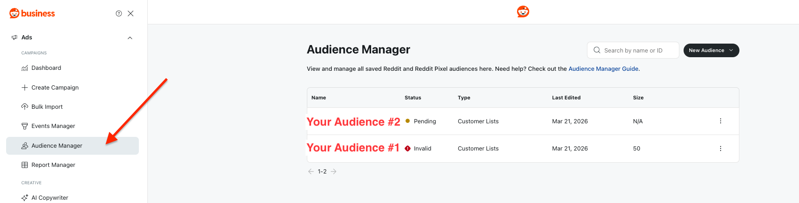

# [!DNL Reddit Custom Audience] 연결 {#reddit-custom-audience-connection}

## 개요 {#overview}

[!DNL Reddit Ads]은(는) 브랜드와 자신의 열정과 문제를 실시간으로 적극적으로 조사하는 사람들을 연결합니다. [!DNL Reddit Ads]은(는) 유연한 광고 형식과 강력한 타깃팅으로 커뮤니티 중심의 높은 목적의 대화를 연결하여 광고주가 참여 대상에게 도달하고, 성과 결과를 도출하며, 온라인으로 문화를 형성하는 커뮤니티에서 직접 배울 수 있도록 지원합니다.

이 안내서는 [!DNL Adobe Experience Platform]을(를) 사용하여 대상자를 [!DNL Reddit Ads]&#x200B;(으)로 보내는 광고주 및 미디어 팀을 위한 것입니다. 계정을 연결하고, ID를 매핑하고, 대상자를 활성화하는 데 필요한 사항을 다룹니다.

>[!IMPORTANT]
>
>이 대상 커넥터 및 설명서 페이지는 [!DNL Reddit] 팀에서 만들고 유지 관리합니다. 문의 사항이나 업데이트 요청이 있으면 <adsapi-partner-support@reddit.com>(으)로 직접 문의하십시오.

## 사용 사례 {#use-cases}

[!DNL Reddit Custom Audience] 대상을 사용하는 방법과 시기를 더 잘 이해할 수 있도록 [!DNL Adobe Experience Platform] 고객이 이 대상을 사용하여 해결할 수 있는 사용 사례의 예제를 소개합니다.

### 개인화된 오퍼를 사용하여 기존 고객 재타겟팅 {#use-case-1}

온라인 retailer은 소셜 플랫폼을 통해 기존 고객에게 도달하고 이전 주문을 기반으로 개인화된 오퍼를 표시하려고 합니다. 온라인 retailer은 자신의 CRM에서 [!DNL Adobe Experience Platform]&#x200B;(으)로 전자 메일 주소와 장치 ID(IDFA 및 GAID)를 수집하고, 자신의 오프라인 데이터에서 대상을 작성하고, 이러한 대상을 [!DNL Reddit Ads]&#x200B;(으)로 보내 광고 비용을 최적화할 수 있습니다.

## 전제 조건 {#prerequisites}

이 대상을 구성하기 전에 다음 전제 조건을 충족하는지 확인하십시오.

* 사용자 지정 대상 및 고객 목록을 사용할 수 있는 [!DNL Reddit Ads] 계정입니다.
* 연결 권한. 광고 계정을 대신하여 대상자를 관리하려면 [!DNL Reddit]에 로그인하고 [!DNL Experience Platform]에 대한 액세스 권한을 승인할 수 있는 사용자여야 합니다.
* [!DNL Reddit] 광고 계정 ID: 대상을 만드는 광고 계정의 식별자입니다. 광고 계정 ID는 [계정](https://ads.reddit.com/accounts)에서 찾을 수 있습니다. 예: `a2_1b2c34d`.

## 지원되는 ID {#supported-identities}

[!DNL Reddit Custom Audience]은(는) 아래 표에 설명된 ID 활성화를 지원합니다. [ID](/help/identity-service/features/namespaces.md)에 대해 자세히 알아보세요.

| 대상 ID | 설명 | 고려 사항 |
| --- | --- | --- |
| email_lc_sha256 | SHA256 알고리즘으로 해시된 이메일 주소 | [!DNL Adobe Experience Platform]은(는) 일반 텍스트와 SHA256 해시된 전자 메일 주소를 모두 지원합니다. 소스 필드에 해시되지 않은 특성이 포함된 경우 **[!UICONTROL Apply transformation]** 옵션을 선택하면 [!DNL Platform]이(가) 활성화 시 데이터를 자동으로 해시합니다. |
| 하녀 | Google Advertising ID 또는 광고주용 Apple ID(둘 다 SHA256 알고리즘으로 해시됨) | GAID 또는 IDFA를 **maid**&#x200B;에 매핑합니다. 소스 필드에 해시되지 않은 특성이 포함된 경우 **[!UICONTROL Apply transformation]** 옵션을 선택하면 [!DNL Platform]이(가) 활성화 시 데이터를 자동으로 해시합니다. |

{style="table-layout:auto"}

## 지원되는 대상자 {#supported-audiences}

이 섹션에서는 이 대상으로 내보낼 수 있는 대상자 유형을 설명합니다.

| 대상자 원본 | 지원됨 | 설명 |
| --- | --- | --- |
| [!DNL Segmentation Service] | 예 | [!DNL Experience Platform] [세분화 서비스](../../../segmentation/home.md)를 통해 생성된 대상입니다. |
| 기타 모든 대상 원본 | 예 | 이 카테고리에는 세분화 서비스를 통해 생성된 대상 외부의 모든 대상 출처가 포함됩니다. [다양한 대상 원본](/help/segmentation/ui/audience-portal.md#customize)에 대해 읽어 보십시오. |

{style="table-layout:auto"}

데이터 유형별 지원되는 대상:

| 대상 데이터 유형 | 지원됨 | 설명 | 사용 사례 |
| --- | --- | --- | --- |
| [사람 대상](/help/segmentation/types/people-audiences.md) | 예 | 고객 프로필을 기반으로 마케팅 캠페인을 위해 특정 사용자 그룹을 타깃팅할 수 있습니다. | 빈번한 구매자, 장바구니 포기 |
| [계정 대상자](/help/segmentation/types/account-audiences.md) | 아니요 | 계정 기반 마케팅 전략을 위해 특정 조직 내의 개인을 타깃팅합니다. | B2B 마케팅 |
| [잠재 고객](/help/segmentation/types/prospect-audiences.md) | 아니요 | 아직 고객이 아니지만 타겟 대상자와 특성을 공유하는 개인을 타겟팅합니다. | 타사 데이터를 이용한 잠재 고객 확보 |
| [데이터 집합 내보내기](/help/catalog/datasets/overview.md) | 아니요 | [!DNL Adobe Experience Platform] 데이터 레이크에 저장된 구조화된 데이터의 컬렉션입니다. | 보고, 데이터 과학 워크플로 |

{style="table-layout:auto"}

## 내보내기 유형 및 빈도 {#export-type-frequency}

대상 내보내기 유형 및 빈도에 대한 자세한 내용은 아래 표를 참조하십시오.

| 항목 | 유형 | 참고 |
| --- | --- | --- |
| 내보내기 유형 | **[!UICONTROL Audience export]** | [!DNL Reddit Custom Audience] 대상에 사용된 식별자(이름, 전화번호 또는 기타)를 사용하여 대상자의 모든 구성원을 내보내고 있습니다. |
| 내보내기 빈도 | **[!UICONTROL Streaming]** | 스트리밍 대상은 &quot;항상&quot; API 기반 연결입니다. 대상자 평가를 기반으로 Experience Platform에서 프로필이 업데이트되는 즉시 커넥터가 업데이트 다운스트림을 대상 플랫폼으로 전송합니다. [스트리밍 대상](/help/destinations/destination-types.md#streaming-destinations)에 대해 자세히 알아보세요. |

{style="table-layout:auto"}

## 대상에 연결 {#connect}

>[!IMPORTANT]
>
>대상에 연결하려면 **[!UICONTROL View Destinations]** 및 **[!UICONTROL Manage Destinations]** [액세스 제어 권한](/help/access-control/home.md#permissions)이 필요합니다. [액세스 제어 개요](/help/access-control/ui/overview.md)를 읽거나 제품 관리자에게 문의하여 필요한 권한을 받으십시오.

이 대상에 연결하려면 [대상 구성 자습서](../../ui/connect-destination.md)에 설명된 단계를 따르십시오. 대상 구성 워크플로에서 아래 두 섹션에 나열된 필드를 채웁니다.

### 대상으로 인증 {#authenticate}

대상에 인증하려면 필수 필드를 입력한 다음 **[!UICONTROL Connect to destination]**&#x200B;을(를) 선택하십시오.


[!DNL Reddit]&#x200B;(으)로 로그인하도록 리디렉션됩니다. 요청된 권한을 검토한 후 **[!UICONTROL Allow]**&#x200B;을(를) 선택하여 [!DNL Experience Platform]이(가) 광고 계정을 대신하여 대상자를 만들고 멤버십을 업데이트할 수 있도록 하십시오.


### 대상 세부 정보 입력 {#destination-details}

대상에 대한 세부 정보를 구성하려면 아래의 필수 및 선택 필드를 채우십시오. UI에서 필드 옆에 있는 별표는 필드가 필수임을 나타냅니다.


* **[!UICONTROL Name]**: 이 대상을 인식하는 이름입니다.
* **[!UICONTROL Description]**: 이 대상을 식별하는 데 도움이 되는 설명입니다.
* **[!UICONTROL Ad Account ID]**: [!DNL Reddit] 광고 계정 ID입니다.

### 경고 활성화 {#enable-alerts}

경고를 활성화하여 대상에 대한 데이터 흐름 상태에 대한 알림을 받을 수 있습니다. 목록에서 경고를 선택하여 데이터 흐름 상태에 대한 알림을 수신합니다. 경고에 대한 자세한 내용은 [UI를 사용하여 대상 경고 구독](../../ui/alerts.md)에 대한 안내서를 참조하십시오.

대상 연결에 대한 세부 정보를 제공했으면 **[!UICONTROL Next]**&#x200B;을(를) 선택합니다.

## 이 대상으로 대상자 활성화 {#activate}

>[!IMPORTANT]
>
>* 데이터를 활성화하려면 **[!UICONTROL View Destinations]**, **[!UICONTROL Activate Destinations]**, **[!UICONTROL View Profiles]** 및 **[!UICONTROL View Segments]** [액세스 제어 권한](/help/access-control/home.md#permissions)이 필요합니다. [액세스 제어 개요](/help/access-control/ui/overview.md)를 읽거나 제품 관리자에게 문의하여 필요한 권한을 받으십시오.
>* *ID*&#x200B;을(를) 내보내려면 **[!UICONTROL View Identity Graph]** [액세스 제어 권한](/help/access-control/home.md#permissions)이 필요합니다. <br> {width="100" zoomable="yes"}

이 대상으로 대상을 활성화하는 방법에 대한 지침은 [프로필 및 대상을 스트리밍 대상 내보내기 대상으로 활성화](/help/destinations/ui/activate-segment-streaming-destinations.md)를 참조하십시오.

### 속성 및 ID 매핑 {#map}

사용 사례에 따라 다음 대상 ID 네임스페이스를 매핑해야 합니다.

| 소스 필드 | 대상 필드 | 참고 |
| --- | --- | --- |
| 이메일(일반 텍스트 또는 해시됨) | email_lc_sha256 | 소스 필드는 해시되거나 해시되지 않을 수 있습니다. [!DNL Reddit]은(는) 해시된 값만 허용합니다. **[!UICONTROL Apply transformation]**&#x200B;을(를) 사용하도록 설정하여 [!DNL Experience Platform]이(가) 보내기 전에 전자 메일을 해시하도록 합니다. |
| MAID(일반 텍스트 또는 해시됨) | 하녀 | 소스 필드는 해시되거나 해시되지 않을 수 있습니다. [!DNL Reddit]은(는) 해시된 값만 허용합니다. **[!UICONTROL Apply transformation]**&#x200B;이(가) 보내기 전에 값을 해시하도록 [!DNL Experience Platform]을(를) 활성화하십시오. |

하나 이상의 ID를 매핑해야 합니다.


## 내보낸 데이터/데이터 내보내기 유효성 검사 {#exported-data}

대상을 활성화하면 [!DNL Reddit] Ads Manager 계정에서 볼 수 있습니다.

[!DNL Reddit]에서 새로 만든 대상이 보류 중인 상태로 나타납니다. 데이터 흐름이 실행되고 프로필이 내보내지면 [!DNL Reddit]이(가) [!DNL Reddit]명의 사용자에 대해 프로필을 일치시킵니다. 데이터가 처리되면 대상 상태가 **[!UICONTROL Valid]**(으)로 변경됩니다. 대상 크기가 [1,000명 이상의 사용자](https://ads-api.reddit.com/docs/v3/manage-customer-lists)에 도달해야 유효한 것으로 간주됩니다. 필요한 크기를 충족하지 않는 대상은 **[!UICONTROL Invalid]**(으)로 표시됩니다.



다음은 [!DNL Reddit]&#x200B;(으)로 전송된 페이로드의 예입니다.

```json
{
  "data": {
    "action_type": "ADD",
    "column_order": [
      "EMAIL_SHA256",
      "MAID_SHA256"
    ],
    "user_data": [
      [
        "d7ef2e7b2a3663c25284a3d6d13b1ca727fc8c659474b81afe0cec997a4737d2",
        "510870d7b3e47a28a2b2f3aef27a4c81aab0b2eefda27dea50bc4c991d9e5435"
      ]
    ]
  }
}
```

자세한 내용은 [Reddit API 설명서](https://ads-api.reddit.com/docs/v3/operations/Update%20Custom%20Audience%20Users)를 참조하십시오.

## 데이터 사용 및 관리 {#data-usage-governance}

데이터를 처리할 때 모든 [!DNL Adobe Experience Platform] 대상이 데이터 사용 정책을 준수합니다. [!DNL Adobe Experience Platform]에서 데이터 거버넌스를 적용하는 방법에 대한 자세한 내용은 [데이터 거버넌스 개요](/help/data-governance/home.md)를 참조하십시오.

## 추가 리소스 {#additional-resources}

사용자 지정 대상 끝점 작동 방식에 대한 자세한 내용은 [Reddit API 설명서](https://ads-api.reddit.com/docs/v3/operations/Update%20Custom%20Audience%20Users)를 참조하십시오.
