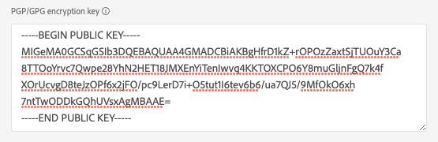

# SFTP 연결

## 대상 변경 로그 {#changelog}

2023년 7월 Experience Platform 릴리스에서는 SFTP 대상이 아래에 나열된 새로운 기능을 제공합니다.

* [데이터 세트 내보내기 지원](/help/destinations/ui/export-datasets.md).
* 추가 [파일 이름 지정 옵션](/help/destinations/ui/activate-batch-profile-destinations.md#scheduling).
* [향상된 매핑 단계](/help/destinations/ui/activate-batch-profile-destinations.md#mapping)를 통해 내보낸 파일에서 사용자 정의 파일 헤더를 설정하는 기능.
* [내보낸 CSV 데이터 파일의 형식을 사용자 지정하는 기능](/help/destinations/ui/batch-destinations-file-formatting-options.md).

## 개요 {#overview}

SFTP 서버에 대한 실시간 아웃바운드 연결을 생성하여 구분된 데이터 파일을 정기적으로 Adobe Experience Platform에서 내보냅니다.

>[!IMPORTANT]
>
> Experience Platform에서 SFTP 서버로 데이터 내보내기를 지원하지만 데이터를 내보내는 데 권장되는 클라우드 저장소 위치는 [!DNL Amazon S3] 및 [!DNL Azure Blob]입니다.

## API 또는 UI를 통해 SFTP에 연결 {#connect-api-or-ui}

* Platform 사용자 인터페이스를 사용하여 SFTP 저장소 위치에 연결하려면 아래의 [대상에 연결](#connect) 및 [이 대상에 대상 활성화](#activate) 섹션을 참조하십시오.
* 프로그래밍 방식으로 SFTP 저장소 위치에 연결하려면 흐름 서비스 API 자습서를 사용하여 [파일 기반 대상에 대상 활성화](../../api/activate-segments-file-based-destinations.md)를 읽어 보십시오.

## 지원되는 대상자 {#supported-audiences}

이 섹션에서는 이 대상으로 내보낼 수 있는 대상자 유형을 설명합니다.

| 대상자 원본 | 지원됨 | 설명 |
|---------|----------|----------|
| [!DNL Segmentation Service] | ✓ 덧신 | Experience Platform [세그먼테이션 서비스](../../../segmentation/home.md)를 통해 생성된 대상입니다. |
| 사용자 정의 업로드 | ✓ 덧신 | CSV 파일에서 Experience Platform으로 대상 [가져옴](../../../segmentation/ui/audience-portal.md#import-audience). |

{style="table-layout:auto"}

## 내보내기 유형 및 빈도 {#export-type-frequency}

대상 내보내기 유형 및 빈도에 대한 자세한 내용은 아래 표를 참조하십시오.

| 항목 | 유형 | 참고 |
---------|----------|---------|
| 내보내기 유형 | **[!UICONTROL 프로필 기반]** | [대상 활성화 워크플로](../../ui/activate-batch-profile-destinations.md#select-attributes)의 프로필 특성 선택 화면에서 선택한 대로 원하는 스키마 필드(예: 이메일 주소, 전화번호, 성)와 함께 세그먼트의 모든 구성원을 내보냅니다. |
| 내보내기 빈도 | **[!UICONTROL 일괄 처리]** | 배치 대상은 파일을 3, 6, 8, 12 또는 24시간 단위로 다운스트림 플랫폼으로 내보냅니다. [일괄 파일 기반 대상](/help/destinations/destination-types.md#file-based)에 대해 자세히 알아보세요. |

{style="table-layout:auto"}

## 데이터 세트 내보내기 {#export-datasets}

이 대상은 데이터 세트 내보내기를 지원합니다. 데이터 세트 내보내기 설정 방법에 대한 자세한 내용은 튜토리얼을 참조하십시오.

* [플랫폼 사용자 인터페이스를 사용하여 데이터 세트를 내보내는 방법](/help/destinations/ui/export-datasets.md).
* 흐름 서비스 API를 사용하여 프로그래밍 방식으로 데이터 세트를 [내보내는 방법](/help/destinations/api/export-datasets.md).

## 내보낸 데이터의 파일 형식 {#file-format}

*대상 데이터*&#x200B;를 내보낼 때 Platform은 사용자가 제공한 저장소 위치에 `.csv`, `parquet` 또는 `.json` 파일을 만듭니다. 파일에 대한 자세한 내용은 대상 활성화 자습서에서 [내보내기에 지원되는 파일 형식](../../ui/activate-batch-profile-destinations.md#supported-file-formats-export) 섹션을 참조하십시오.

*데이터 세트*&#x200B;를 내보낼 때 Platform은 사용자가 제공한 저장소 위치에 `.parquet` 또는 `.json` 파일을 만듭니다. 파일에 대한 자세한 내용은 데이터 세트 내보내기 자습서에서 [데이터 세트 내보내기에 성공했는지 확인](../../ui/export-datasets.md#verify) 섹션을 참조하십시오.

## 대상에 연결 {#connect}

>[!IMPORTANT]
> 
>대상에 연결하려면 **[!UICONTROL 대상 보기]** 및 **[!UICONTROL 대상 관리]** [액세스 제어 권한](/help/access-control/home.md#permissions)이 필요합니다. [액세스 제어 개요](/help/access-control/ui/overview.md)를 읽거나 제품 관리자에게 문의하여 필요한 권한을 받으십시오.

이 대상에 연결하려면 [대상 구성 자습서](../../ui/connect-destination.md)에 설명된 단계를 따르십시오. 대상 구성 워크플로에서 아래 두 섹션에 나열된 필드를 채웁니다.

### 인증 정보 {#authentication-information}

>[!CONTEXTUALHELP]
>id="platform_destinations_connect_sftp_rsa"
>title="RSA 공개 키"
>abstract="필요한 경우 RSA 형식의 공개 키를 첨부하여 암호화를 내보낸 파일에 추가할 수 있습니다. 아래 설명서 링크에서 올바른 형식의 키 예를 봅니다."

>[!CONTEXTUALHELP]
>id="platform_destinations_connect_sftp_ssh"
>title="비공개 SSH 키"
>abstract="비공개 SSH 키는 RSA 포맷의 Base64로 인코딩된 문자열이어야 하며 암호로 보호되지 않아야 합니다."

**[!UICONTROL 암호를 사용하는 SFTP]** 인증 유형을 선택하여 SFTP 위치에 연결하는 경우:

* **[!UICONTROL 도메인]**: SFTP 저장소 위치의 주소입니다.
* **[!UICONTROL 사용자 이름]**: SFTP 저장소 위치에 로그인할 사용자 이름;
* **[!UICONTROL 포트]**: SFTP 저장소 위치에서 사용하는 포트입니다.
* **[!UICONTROL 암호]**: SFTP 저장소 위치에 로그인할 암호입니다.
* **[!UICONTROL 암호화 키]**: 필요한 경우 RSA 형식의 공개 키를 첨부하여 내보낸 파일에 암호화를 추가할 수 있습니다. 아래 이미지에서 올바른 형식의 암호화 키의 예를 봅니다.

  

SFTP 위치에 연결할 **[!UICONTROL SFTP(SSH 키 포함)]** 인증 유형을 선택하는 경우:

* **[!UICONTROL 도메인]**: SFTP 계정의 IP 주소 또는 도메인 이름을 입력하십시오.
* **[!UICONTROL 포트]**: SFTP 저장소 위치에서 사용하는 포트입니다.
* **[!UICONTROL 사용자 이름]**: SFTP 저장소 위치에 로그인할 사용자 이름;
* **[!UICONTROL SSH 키]**: SFTP 저장소 위치에 로그인하는 데 사용되는 개인 SSH 키입니다. 개인 키는 RSA 형식의 Base64 인코딩 문자열이어야 하며 암호로 보호되지 않아야 합니다.
* **[!UICONTROL 암호화 키]**: 필요한 경우 RSA 형식의 공개 키를 첨부하여 내보낸 파일에 암호화를 추가할 수 있습니다. 아래 이미지에서 올바른 형식의 암호화 키의 예를 봅니다.

  

### 대상 세부 정보 {#destination-details}

SFTP 위치에 인증 연결을 설정한 후 대상에 대해 다음 정보를 제공합니다.

* **[!UICONTROL 이름]**: Experience Platform 사용자 인터페이스에서 이 대상을 식별하는 데 도움이 되는 이름을 입력하십시오.
* **[!UICONTROL 설명]**: 이 대상에 대한 설명을 입력하십시오.
* **[!UICONTROL 폴더 경로]**: 파일을 내보낼 SFTP 위치의 폴더 경로를 입력합니다.
* **[!UICONTROL 파일 형식]**: 내보낸 파일에 사용할 형식 Experience Platform을 선택하십시오. [!UICONTROL CSV] 옵션을 선택할 때 [파일 서식 옵션을 구성](../../ui/batch-destinations-file-formatting-options.md)할 수도 있습니다.
* Experience Platform **[!UICONTROL 압축 형식]**: 내보낸 파일에 사용할 압축 형식을 선택합니다.
* **[!UICONTROL 매니페스트 파일 포함]**: 내보내기 위치, 내보내기 크기 등에 대한 정보가 포함된 매니페스트 JSON 파일을 내보내기에 포함하려면 이 옵션을 켜십시오. 매니페스트의 이름은 `manifest-<<destinationId>>-<<dataflowRunId>>.json` 형식을 사용하여 지정합니다. [샘플 매니페스트 파일](/help/destinations/assets/common/manifest-d0420d72-756c-4159-9e7f-7d3e2f8b501e-0ac8f3c0-29bd-40aa-82c1-f1b7e0657b19.json)을(를) 봅니다. 매니페스트 파일에는 다음 필드가 포함되어 있습니다.
   * `flowRunId`: 내보낸 파일을 생성한 [데이터 흐름 실행](/help/dataflows/ui/monitor-destinations.md#dataflow-runs-for-batch-destinations).
   * `scheduledTime`: 파일을 내보낸 시간(UTC)입니다.
   * `exportResults.sinkPath`: 내보낸 파일이 저장된 저장소 위치의 경로입니다.
   * `exportResults.name`: 내보낸 파일의 이름입니다.
   * `size`: 내보낸 파일의 크기(바이트)입니다.

## 이 대상으로 대상자 활성화 {#activate}

>[!IMPORTANT]
> 
>* 데이터를 활성화하려면 **[!UICONTROL 대상 보기]**, **[!UICONTROL 대상 활성화]**, **[!UICONTROL 프로필 보기]** 및 **[!UICONTROL 세그먼트 보기]** [액세스 제어 권한](/help/access-control/home.md#permissions)이 필요합니다. [액세스 제어 개요](/help/access-control/ui/overview.md)를 읽거나 제품 관리자에게 문의하여 필요한 권한을 받으십시오.
>* *ID*&#x200B;을(를) 내보내려면 **[!UICONTROL ID 그래프 보기]** [액세스 제어 권한](/help/access-control/home.md#permissions)이 필요합니다.   {width="100" zoomable="yes"}

이 대상에 대한 대상자 활성화에 대한 지침은 [대상자 데이터를 일괄 프로필 내보내기 대상으로 활성화](../../ui/activate-batch-profile-destinations.md)를 참조하십시오.

## 성공적인 데이터 내보내기 유효성 검사 {#exported-data}

데이터를 성공적으로 내보냈는지 확인하려면 SFTP 저장소를 확인하고 내보낸 파일에 예상 프로필 모집단이 포함되어 있는지 확인하십시오.

## 허용 목록에 추가하다 IP 주소 {#ip-address-allow-list}

허용 목록에 추가하다 Adobe IP를 허용 목록에 추가하다에 추가해야 하는 경우 [IP 주소](ip-address-allow-list.md) 문서를 참조하십시오.
