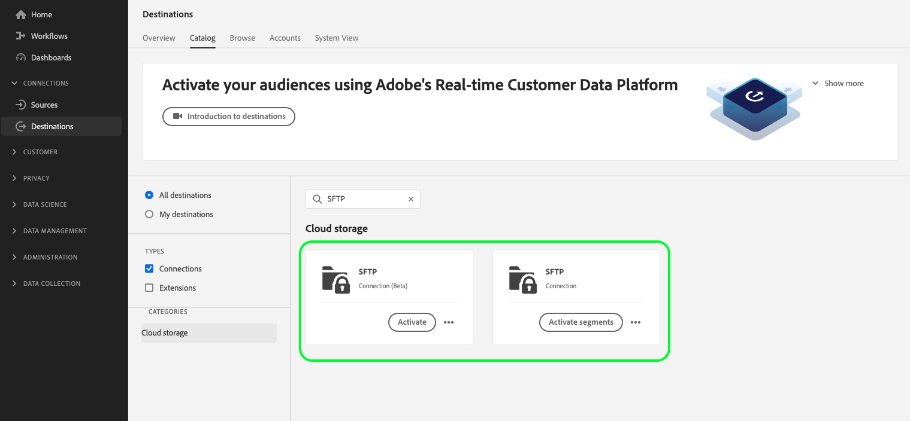

# SFTP 연결

## 대상 변경 로그 {#changelog}

>[!IMPORTANT]
>
>데이터 세트 내보내기 기능의 베타 릴리스와 향상된 파일 내보내기 기능으로 이제 두 가지가 표시될 수 있습니다 [!DNL SFTP] 대상 카탈로그의 카드.
>* 이미 파일을 로 내보내고 있는 경우 **[!UICONTROL SFTP]** 대상: 새 데이터 흐름을 만드십시오. **[!UICONTROL SFTP 베타]** 대상.
>* 에 대한 데이터 흐름을 아직 만들지 않은 경우 **[!UICONTROL SFTP]** 대상, 새 대상을 사용하십시오. **[!UICONTROL SFTP 베타]** 파일을 내보낼 카드 **[!UICONTROL SFTP]**.

새로운 기능 개선 [!DNL SFTP] 대상 카드에는 다음이 포함됩니다.

* [데이터 세트 내보내기 지원](/help/destinations/ui/export-datasets.md).
* 추가 [파일 이름 지정 옵션](/help/destinations/ui/activate-batch-profile-destinations.md#scheduling).
* 를 통해 내보낸 파일에서 사용자 정의 파일 헤더를 설정하는 기능 [매핑 단계 개선](/help/destinations/ui/activate-batch-profile-destinations.md#mapping).
* [내보낸 CSV 데이터 파일의 형식을 사용자 지정하는 기능](/help/destinations/ui/batch-destinations-file-formatting-options.md).

## 개요 {#overview}

SFTP 서버에 대한 실시간 아웃바운드 연결을 생성하여 구분된 데이터 파일을 정기적으로 Adobe Experience Platform에서 내보냅니다.

>[!IMPORTANT]
>
> Experience Platform은 SFTP 서버로 데이터 내보내기를 지원하지만 데이터를 내보내는 데 권장되는 클라우드 스토리지 위치는 다음과 같습니다 [!DNL Amazon S3] 및 [!DNL SFTP].

## 내보내기 유형 및 빈도 {#export-type-frequency}

대상 내보내기 유형 및 빈도에 대한 자세한 내용은 아래 표를 참조하십시오.

| 항목 | 유형 | 참고 |
---------|----------|---------|
| 내보내기 유형 | **[!UICONTROL 프로필 기반]** | 의 프로필 속성 선택 화면에서 선택한 대로 원하는 스키마 필드(예: 이메일 주소, 전화번호, 성)와 함께 세그먼트의 모든 멤버를 내보냅니다. [대상 활성화 워크플로](../../ui/activate-batch-profile-destinations.md#select-attributes). |
| 내보내기 빈도 | **[!UICONTROL 일괄 처리]** | 배치 대상은 파일을 3, 6, 8, 12 또는 24시간 단위로 다운스트림 플랫폼으로 내보냅니다. 자세한 내용 [배치 파일 기반 대상](/help/destinations/destination-types.md#file-based). |

{style="table-layout:auto"}

## 대상에 연결 {#connect}

>[!IMPORTANT]
> 
>대상에 연결하려면 다음이 필요합니다. **[!UICONTROL 대상 관리]** [액세스 제어 권한](/help/access-control/home.md#permissions). 읽기 [액세스 제어 개요](/help/access-control/ui/overview.md) 필요한 권한을 얻으려면 제품 관리자에게 문의하십시오.

이 대상에 연결하려면 다음과같이 하십시오. [대상 구성 자습서](../../ui/connect-destination.md). 대상 구성 워크플로에서 아래 두 섹션에 나열된 필드를 채웁니다.

### 인증 정보 {#authentication-information}

>[!CONTEXTUALHELP]
>id="platform_destinations_connect_sftp_rsa"
>title="RSA 공개 키"
>abstract="필요한 경우 RSA 형식의 공개 키를 첨부하여 암호화를 내보낸 파일에 추가할 수 있습니다. 아래 설명서 링크에서 올바른 형식의 키 예를 봅니다."

>[!CONTEXTUALHELP]
>id="platform_destinations_connect_sftp_ssh"
>title="비공개 SSH 키"
>abstract="비공개 SSH 키 형식은 Base64 인코딩된 문자열로 지정하며 암호로 보호해서는 안 됩니다."

을(를) 선택하는 경우 **[!UICONTROL 기본 인증]** 를 입력하여 SFTP 위치에 연결합니다.

* **[!UICONTROL 호스트]**: SFTP 저장소 위치 주소;
* **[!UICONTROL 사용자 이름]**: SFTP 저장소 위치에 로그인할 사용자 이름
* **[!UICONTROL 암호]**: SFTP 저장소 위치에 로그인하기 위한 암호입니다.
* **[!UICONTROL 암호화 키]**: 원할 경우 RSA 형식의 공개 키를 첨부하여 내보낸 파일에 암호화를 추가할 수 있습니다. 아래 이미지에서 올바른 형식의 암호화 키의 예를 봅니다.

   

을(를) 선택하는 경우 **[!UICONTROL SSH 키가 포함된 SFTP]** SFTP 위치에 연결하는 인증 유형:

* **[!UICONTROL 도메인]**: SFTP 계정의 IP 주소 또는 도메인 이름을 입력합니다
* **[!UICONTROL 포트]**: SFTP 저장소 위치에서 사용하는 포트
* **[!UICONTROL 사용자 이름]**: SFTP 저장소 위치에 로그인할 사용자 이름
* **[!UICONTROL SSH 키]**: SFTP 저장소 위치에 로그인하는 데 사용되는 개인 SSH 키입니다. 비공개 키 형식은 Base64 인코딩된 문자열로 지정하며 암호로 보호해서는 안 됩니다.
* **[!UICONTROL 암호화 키]**: 원할 경우 RSA 형식의 공개 키를 첨부하여 내보낸 파일에 암호화를 추가할 수 있습니다. 아래 이미지에서 올바른 형식의 암호화 키의 예를 봅니다.

   

### 대상 세부 사항 {#destination-details}

SFTP 위치에 인증 연결을 설정한 후 대상에 대해 다음 정보를 제공합니다.

* **[!UICONTROL 이름]**: Experience Platform 사용자 인터페이스에서 이 대상을 식별하는 데 도움이 되는 이름을 입력합니다.
* **[!UICONTROL 설명]**: 이 대상에 대한 설명을 입력합니다.
* **[!UICONTROL 폴더 경로]**: 파일을 내보낼 SFTP 위치의 폴더 경로를 입력합니다.
* **[!UICONTROL 파일 유형]**: 내보낸 파일에 사용할 형식 Experience Platform을 선택합니다. 이 옵션은 에만 사용할 수 있습니다. **[!UICONTROL SFTP 베타]** 대상. 을(를) 선택할 때 [!UICONTROL CSV] 옵션을 사용하여 다음을 수행할 수도 있습니다. [파일 서식 옵션 구성](../../ui/batch-destinations-file-formatting-options.md).
* **[!UICONTROL 압축 포맷]**: 내보낸 파일에 대해 Experience Platform이 사용해야 하는 압축 유형을 선택합니다. 이 옵션은 에만 사용할 수 있습니다. **[!UICONTROL SFTP 베타]** 대상.
* **[!UICONTROL 매니페스트 파일 포함]**: 내보내기 위치, 내보내기 크기 등에 대한 정보가 포함된 매니페스트 JSON 파일을 내보내기에 포함하려면 이 옵션을 켜거나 끕니다. 이 옵션은 에만 사용할 수 있습니다. **[!UICONTROL SFTP 베타]** 대상.

## 이 대상에 대한 세그먼트 활성화 {#activate}

>[!IMPORTANT]
> 
>데이터를 활성화하려면 **[!UICONTROL 대상 관리]**, **[!UICONTROL 대상 활성화]**, **[!UICONTROL 프로필 보기]**, 및 **[!UICONTROL 세그먼트 보기]** [액세스 제어 권한](/help/access-control/home.md#permissions). 읽기 [액세스 제어 개요](/help/access-control/ui/overview.md) 필요한 권한을 얻으려면 제품 관리자에게 문의하십시오.

다음을 참조하십시오 [대상자 데이터를 활성화하여 프로필 내보내기 대상 일괄 처리](../../ui/activate-batch-profile-destinations.md) 대상 세그먼트를 이 대상으로 활성화하는 방법에 대한 지침

## (베타) 데이터 세트 내보내기 {#export-datasets}

이 대상은 데이터 세트 내보내기를 지원합니다. 데이터 세트 내보내기를 설정하는 방법에 대한 자세한 내용은 [데이터 세트 내보내기 자습서](/help/destinations/ui/export-datasets.md).

## 내보낸 데이터 {#exported-data}

대상 [!DNL SFTP] 대상, 플랫폼에서 다음을 생성합니다. `.csv` 파일을 제공한 저장소 위치에 있습니다. 파일에 대한 자세한 내용은 [대상자 데이터를 활성화하여 프로필 내보내기 대상 일괄 처리](../../ui/activate-batch-profile-destinations.md) 세그먼트 활성화 자습서에서 참조하십시오.

## IP 주소 허용 목록

을(를) 참조하십시오 [SFTP 대상에 대한 IP 주소 허용 목록](ip-address-allow-list.md) 허용 목록에 Adobe IP를 추가해야 하는 경우.
