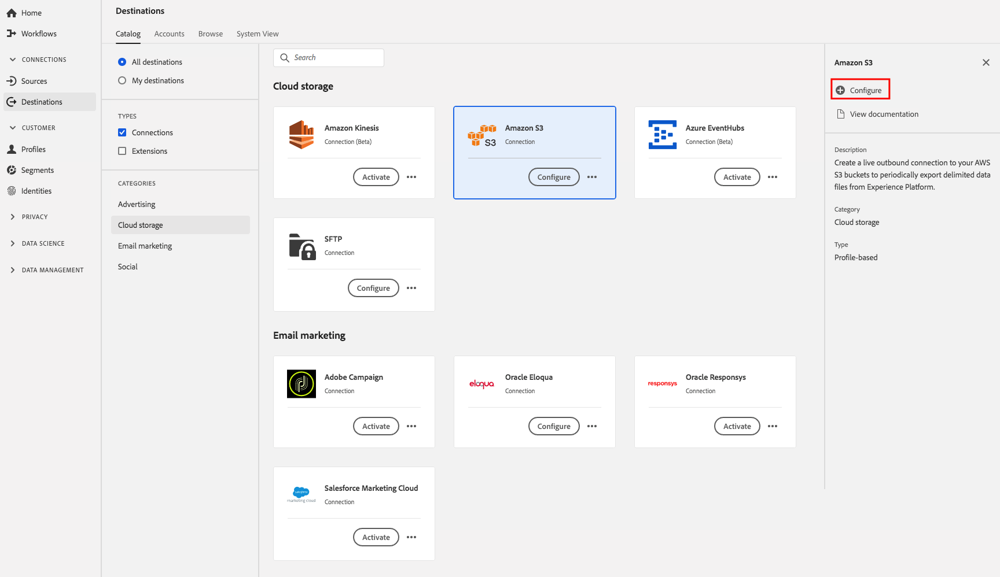
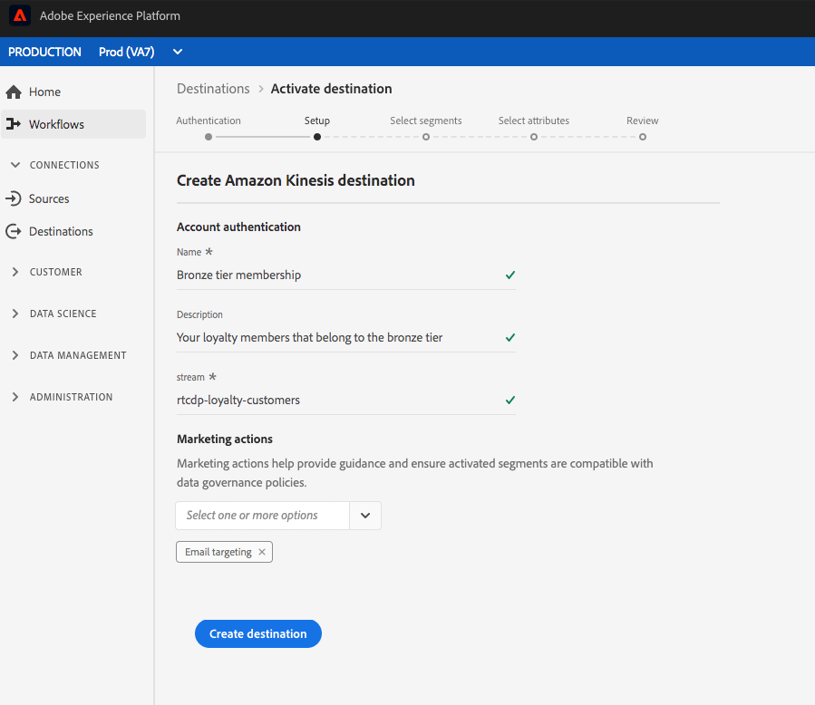

# 클라우드 스토리지 대상 만들기

## 개요 {#overview}

이 페이지에서는 Adobe Experience Platform의 클라우드 저장소 위치에 연결할 수 있는 방법에 대해 설명합니다.

**[!UICONTROL Connections]** > **[!UICONTROL Destinations]**&#x200B;에서 원하는 클라우드 스토리지 대상을 선택한 다음 **[!UICONTROL Configure]**&#x200B;를 선택합니다.

>[!NOTE]
>
>이 대상과의 연결이 이미 있는 경우 대상 카드에 **[!UICONTROL Activate]** 단추가 표시될 수 있습니다. **[!UICONTROL Activate]**&#x200B;과 **[!UICONTROL Configure]** 사이의 차이에 대한 자세한 내용은 대상 작업 공간 설명서의 [카탈로그](../../ui/destinations-workspace.md#catalog) 섹션을 참조하십시오.

## 계정 단계 {#account}

**[!UICONTROL Account]** 단계에서 이전에 클라우드 스토리지 대상에 대한 연결을 설정한 경우 **[!UICONTROL Existing Account]**&#x200B;을 선택하고 기존 연결을 선택합니다. 또는 **[!UICONTROL New Account]**&#x200B;을 선택하여 클라우드 스토리지 대상에 대한 새 연결을 설정할 수 있습니다. 계정 인증 자격 증명을 입력하고 **[!UICONTROL Connect to destination]**&#x200B;을 선택합니다. RSA 형식 공개 키를 첨부하여 내보낸 파일에 암호화를 추가할 수도 있습니다. 공개 키는 [!DNL Base64] 인코딩 문자열로 작성해야 합니다.

**인증** 단계의 자격 증명 입력에 대한 자세한 내용은 [Amazon S3](./amazon-s3.md) 대상, [[!DNL Amazon Kinesis]](./amazon-kinesis.md) 대상, [[!DNL Azure Event Hubs]](./azure-event-hubs.md) 대상 및 [SFTP](./sftp.md) 대상을 참조하십시오.

>[!NOTE]
>
>플랫폼은 인증 프로세스에서 자격 증명 유효성 검사를 지원하고 클라우드 스토리지 위치에 잘못된 자격 증명을 입력하는 경우 오류 메시지를 표시합니다. 이렇게 하면 자격 증명이 잘못된 작업 흐름을 완료하지 못합니다.

## 인증 단계 {#authentication}

**[!UICONTROL Authentication]** 단계에서 활성화 과정에 대해 **[!UICONTROL Name]** 및 **[!UICONTROL Description]**&#x200B;를 입력합니다.

이 단계에서 이 대상에 적용할 **[!UICONTROL Marketing action]**&#x200B;을 선택할 수도 있습니다. 마케팅 작업은 데이터를 대상에 내보내려는 의도를 나타냅니다. Adobe 정의 마케팅 작업 중에서 선택하거나 자신의 마케팅 작업을 만들 수 있습니다. 마케팅 작업에 대한 자세한 내용은 [데이터 사용 정책 개요](../../../data-governance/policies/overview.md)를 참조하십시오.

Amazon S3 대상의 경우 파일이 배달될 클라우드 스토리지 대상에 **[!UICONTROL Bucket name]** 및 **[!UICONTROL Folder path]**&#x200B;을(를) 삽입합니다. 위의 필드를 채운 후 **[!UICONTROL Create Destination]**&#x200B;을 선택합니다.

SFTP 대상의 경우 파일이 배달될 **[!UICONTROL Folder path]**&#x200B;을 삽입합니다. 위의 필드를 채운 후 **[!UICONTROL Create Destination]**&#x200B;을 선택합니다.

[!DNL Amazon Kinesis] 대상의 경우 [!DNL Amazon Kinesis] 계정에 기존 데이터 스트림의 이름을 입력합니다. 플랫폼이 데이터를 이 스트림으로 내보냅니다. 위의 필드를 채운 후 **[!UICONTROL Create Destination]**&#x200B;을 선택합니다.

[!DNL Azure Event Hubs] 대상의 경우 [!DNL Amazon Event Hubs] 계정에 기존 데이터 스트림의 이름을 입력합니다. 플랫폼이 데이터를 이 스트림으로 내보냅니다. 위의 필드를 채운 후 **[!UICONTROL Create Destination]**&#x200B;을 선택합니다.

이제 대상이 만들어집니다. 나중에 세그먼트를 활성화하거나 **[!UICONTROL Next]**&#x200B;을 선택하여 워크플로우를 계속 진행하고 활성화할 세그먼트를 선택할 수 있습니다. **[!UICONTROL Save & Exit]** 데이터를 내보내는 워크플로의 나머지 부분에서 [세그먼트 활성화](#activate-segments) 섹션을 읽어 보십시오.

## 매크로를 사용하여 저장소 위치 {#use-macros}에 폴더를 만듭니다.

>[!NOTE]
>
> 이 섹션에 설명된 기능은 현재 [Amazon S3](./amazon-s3.md) 목적으로만 사용할 수 있습니다.

저장 위치에 세그먼트 파일당 사용자 지정 폴더를 만들려면 폴더 경로 입력 필드에서 매크로를 사용할 수 있습니다. 아래와 같이 입력 필드 끝에 매크로를 삽입합니다.

아래 예는 ID `25768be6-ebd5-45cc-8913-12fb3f348615`가 있는 샘플 세그먼트 `Luxury Audience`을 참조합니다.

**매크로 1:`%SEGMENT_NAME%`**

입력:`acme/campaigns/2021/%SEGMENT_NAME%`
저장소 위치의 폴더 경로:`acme/campaigns/2021/Luxury Audience`

**매크로 2:`%SEGMENT_ID%`**

입력:`acme/campaigns/2021/%SEGMENT_ID%`
저장소 위치의 폴더 경로:`acme/campaigns/2021/25768be6-ebd5-45cc-8913-12fb3f348615`

**매크로 3:`%SEGMENT_NAME%/%SEGMENT_ID%`**

입력:`acme/campaigns/2021/%SEGMENT_NAME%/%SEGMENT_ID%`
저장소 위치의 폴더 경로:`acme/campaigns/2021/Luxury Audience/25768be6-ebd5-45cc-8913-12fb3f348615`

## 세그먼트 활성화 {#activate-segments}

세그먼트 활성화 작업 과정에 대한 자세한 내용은 [프로필 및 세그먼트를 대상](../../ui/activate-destinations.md)에 활성화를 참조하십시오.
