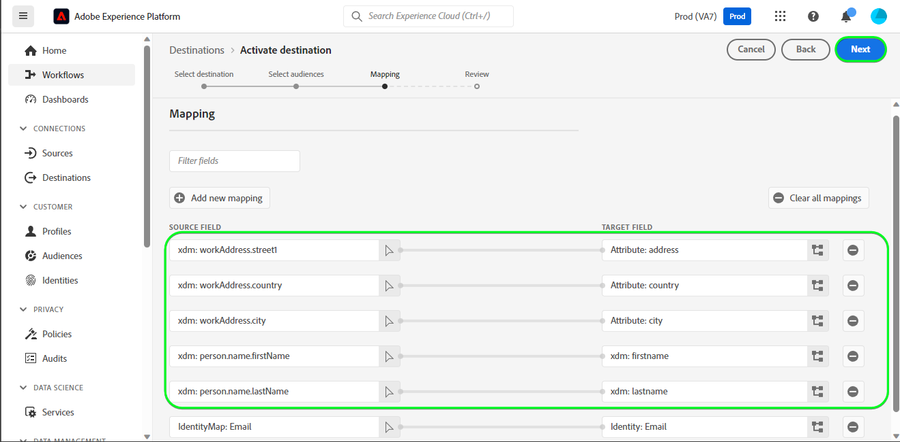

# [!DNL HubSpot] 연결

[[!DNL HubSpot]](https://www.hubspot.com)은(는) 마케팅, 판매, 콘텐츠 관리 및 고객 서비스에 연결하는 데 필요한 모든 소프트웨어, 통합 및 리소스가 포함된 CRM 플랫폼입니다. 이를 통해 하나의 CRM 플랫폼에서 데이터, 팀 및 고객을 연결할 수 있습니다.

이 [!DNL Adobe Experience Platform] [대상](/help/destinations/home.md)은(는) [[!DNL HubSpot] 연락처 API](https://developers.hubspot.com/docs/api/crm/contacts)를 활용하여 활성화 후 기존 Experience Platform 대상에서 [!DNL HubSpot] 내의 연락처를 업데이트합니다.

[!DNL HubSpot] 인스턴스에 대한 인증 지침은 [대상에 대한 인증](#authenticate) 섹션에서 아래에 더 나와 있습니다.

## 사용 사례 {#use-cases}

[!DNL HubSpot] 대상을 사용하는 방법과 시기를 더 잘 이해할 수 있도록 Adobe Experience Platform 고객이 이 대상을 사용하여 해결할 수 있는 샘플 사용 사례를 소개합니다.

[!DNL HubSpot] 연락처는 귀사와 상호 작용하는 개인에 대한 정보를 저장합니다. 팀은 [!DNL HubSpot]에 있는 연락처를 사용하여 Experience Platform 대상자를 만듭니다. 이 대상자를 [!DNL HubSpot]에게 보낸 후 해당 정보가 업데이트되고 각 연락처에는 해당 연락처가 속한 대상자를 나타내는 대상자 이름으로 해당 값이 있는 속성이 할당됩니다.

## 전제 조건 {#prerequisites}

Experience Platform 및 [!DNL HubSpot]에서 설정해야 하는 필수 구성 요소와 [!DNL HubSpot] 대상으로 작업하기 전에 수집해야 하는 정보는 아래 섹션을 참조하십시오.

### Experience Platform 사전 요구 사항 {#prerequisites-in-experience-platform}

[!DNL HubSpot] 대상에 대한 데이터를 활성화하기 전에 [!DNL Experience Platform]에서 만든 [스키마](/help/xdm/schema/composition.md), [데이터 세트](https://experienceleague.adobe.com/docs/platform-learn/tutorials/data-ingestion/create-datasets-and-ingest-data.html) 및 [대상](https://experienceleague.adobe.com/docs/platform-learn/tutorials/audiences/create-audiences.html)이 있어야 합니다.

대상 상태에 대한 지침이 필요한 경우 [대상 멤버십 세부 정보 스키마 필드 그룹](/help/xdm/field-groups/profile/segmentation.md)은 Experience Platform 설명서를 참조하십시오.

### [!DNL HubSpot] 대상에 대한 필수 구성 요소 {#prerequisites-destination}

Experience Platform에서 [!DNL HubSpot] 계정으로 데이터를 내보내려면 다음 전제 조건을 참고하십시오.

#### [!DNL HubSpot] 계정이 있어야 합니다. {#prerequisites-account}

Experience Platform에서 [!DNL Hubspot] 계정으로 데이터를 내보내려면 [!DNL HubSpot] 계정이 있어야 합니다. 아직 계정이 없는 경우 [HubSpot 계정 설정](https://knowledge.hubspot.com/get-started/set-up-your-account) 페이지를 방문하여 안내에 따라 계정을 등록하고 만드십시오.

#### [!DNL HubSpot] 개인 앱 액세스 토큰 수집 {#gather-credentials}

[!DNL HubSpot] 계정 내에서 [!DNL HubSpot] 개인 앱을 통해 [!DNL HubSpot] 대상이 API를 호출하도록 허용하려면 [!DNL HubSpot] `Access token`이(가) 필요합니다. [대상을 인증](#authenticate)할 때 `Access token`이(가) `Bearer token` 역할을 합니다.

개인 앱이 없는 경우 설명서에 따라 [개인 앱을 만듭니다 [!DNL HubSpot]](https://developers.hubspot.com/docs/api/private-apps).

>[!IMPORTANT]
>
> 비공개 앱에는 아래 범위를 할당해야 합니다.
> `crm.objects.contacts.write`, `crm.objects.contacts.read`
> `crm.schemas.contacts.write`, `crm.schemas.contacts.read`

| 자격 증명 | 설명 | 예 |
| --- | --- | --- |
| `Bearer token` | [!DNL HubSpot] 개인 앱의 `Access token`.  [!DNL HubSpot]을(를) 가져오려면 `Access token` [!DNL HubSpot] 설명서에 따라 [앱의 액세스 토큰으로 API를 호출합니다](https://developers.hubspot.com/docs/api/private-apps#make-api-calls-with-your-app-s-access-token). | `pat-na1-11223344-abcde-12345-9876-1234a1b23456` |

## 가드레일 {#guardrails}

[!DNL HubSpot]개의 개인 앱에 [등급 제한](https://developers.hubspot.com/docs/api/usage-details)이 적용됩니다. 비공개 앱에서 호출할 수 있는 호출 수는 [!DNL HubSpot] 계정 구독과 API 추가 기능을 구입했는지 여부에 따라 결정됩니다. 또한 [기타 제한](https://developers.hubspot.com/docs/api/usage-details#other-limits)도 참조하세요.

## 지원되는 ID {#supported-identities}

[!DNL HubSpot]은(는) 아래 표에 설명된 ID 업데이트를 지원합니다. [ID](/help/identity-service/features/namespaces.md)에 대해 자세히 알아보세요.

| 대상 ID | 예 | 설명 | 고려 사항 |
|---|---|---|---|
| `email` | `test@test.com` | 연락처의 이메일 주소입니다. | 필수 |

## 지원되는 대상자 {#supported-audiences}

이 섹션에서는 이 대상으로 내보낼 수 있는 모든 대상에 대해 설명합니다.

이 대상은 Experience Platform [세그먼테이션 서비스](../../../segmentation/home.md)를 통해 생성된 모든 대상의 활성화를 지원합니다.

이 대상은 아래 표에 설명된 대상의 활성화도 지원합니다.

| 대상자 유형 | 설명 |
|---------|----------|
| 사용자 정의 업로드 | CSV 파일에서 Experience Platform으로 대상 [가져옴](../../../segmentation/ui/audience-portal.md#import-audience). |

{style="table-layout:auto"}

## 내보내기 유형 및 빈도 {#export-type-frequency}

대상 내보내기 유형 및 빈도에 대한 자세한 내용은 아래 표를 참조하십시오.

| 항목 | 유형 | 참고 |
---------|----------|---------|
| 내보내기 유형 | **[!UICONTROL 프로필 기반]** | <ul><li>필드 매핑에 따라 원하는 스키마 필드 *(예: 이메일 주소, 전화번호, 성)*&#x200B;과(와) 함께 대상자의 모든 구성원을 내보냅니다.</li><li> 또한 대상 이름을 사용하여 [!DNL HubSpot]에서 새 속성이 만들어지고 해당 값은 선택한 각 대상에 대해 Experience Platform의 해당 대상 상태와 함께 사용됩니다.</li></ul> |
| 내보내기 빈도 | **[!UICONTROL 스트리밍]** | <ul><li>스트리밍 대상은 &quot;항상&quot; API 기반 연결입니다. 대상자 평가를 기반으로 Experience Platform에서 프로필이 업데이트되는 즉시 커넥터가 업데이트 다운스트림을 대상 플랫폼으로 전송합니다. [스트리밍 대상](/help/destinations/destination-types.md#streaming-destinations)에 대해 자세히 알아보세요.</li></ul> |

{style="table-layout:auto"}

## 대상에 연결 {#connect}

>[!IMPORTANT]
>
>대상에 연결하려면 **[!UICONTROL 대상 보기]** 및 **[!UICONTROL 대상 관리]** [액세스 제어 권한](/help/access-control/home.md#permissions)이 필요합니다. [액세스 제어 개요](/help/access-control/ui/overview.md)를 읽거나 제품 관리자에게 문의하여 필요한 권한을 받으십시오.

이 대상에 연결하려면 [대상 구성 자습서](../../ui/connect-destination.md)에 설명된 단계를 따르십시오. 대상 구성 워크플로에서 아래 두 섹션에 나열된 필드를 채웁니다.

**[!UICONTROL 대상]** > **[!UICONTROL 카탈로그]** 내에서 [!DNL HubSpot] 검색 또는 **[!UICONTROL CRM]** 범주 아래에서 찾을 수 있습니다.

### 대상으로 인증 {#authenticate}

아래의 필수 필드를 입력하십시오. 자세한 내용은 [개인 앱 액세스 토큰 수집 [!DNL HubSpot] 2&rbrace; 섹션을 참조하십시오.](#gather-credentials)
* **[!UICONTROL 전달자 토큰]**: [!DNL HubSpot] 개인 앱에 대한 액세스 토큰입니다.

대상에 인증하려면 **[!UICONTROL 대상에 연결]**&#x200B;을 선택하세요.
인증 방법을 보여 주는 

제공된 세부 정보가 유효하면 UI에 녹색 확인 표시와 함께 **[!UICONTROL 연결됨]** 상태가 표시됩니다. 그런 다음 다음 다음 단계로 진행할 수 있습니다.

### 대상 세부 정보 입력 {#destination-details}

대상에 대한 세부 정보를 구성하려면 아래의 필수 및 선택 필드를 채우십시오. UI에서 필드 옆에 있는 별표는 필드가 필수임을 나타냅니다.
대상 세부 정보를 표시하는 

* **[!UICONTROL 이름]**: 나중에 이 대상을 인식할 수 있는 이름입니다.
* **[!UICONTROL 설명]**: 나중에 이 대상을 식별하는 데 도움이 되는 설명입니다.

### 경고 활성화 {#enable-alerts}

경고를 활성화하여 대상에 대한 데이터 흐름 상태에 대한 알림을 받을 수 있습니다. 목록에서 경고를 선택하여 데이터 흐름 상태에 대한 알림을 수신합니다. 경고에 대한 자세한 내용은 [UI를 사용하여 대상 경고 구독](../../ui/alerts.md)에 대한 안내서를 참조하십시오.

대상 연결에 대한 세부 정보를 모두 제공했으면 **[!UICONTROL 다음]**&#x200B;을 선택합니다.

## 이 대상으로 대상자 활성화 {#activate}

>[!IMPORTANT]
>
>데이터를 활성화하려면 **[!UICONTROL 대상 보기]**, **[!UICONTROL 대상 활성화]**, **[!UICONTROL 프로필 보기]** 및 **[!UICONTROL 세그먼트 보기]** [액세스 제어 권한](/help/access-control/home.md#permissions)이 필요합니다. [액세스 제어 개요](/help/access-control/ui/overview.md)를 읽거나 제품 관리자에게 문의하여 필요한 권한을 받으십시오.

이 대상으로 대상을 활성화하는 방법에 대한 지침은 [프로필 및 대상을 스트리밍 대상 내보내기 대상으로 활성화](/help/destinations/ui/activate-segment-streaming-destinations.md)를 참조하십시오.

### 속성 및 ID 매핑 {#map}

대상 데이터를 Adobe Experience Platform에서 [!DNL HubSpot] 대상으로 올바르게 보내려면 필드 매핑 단계를 거쳐야 합니다. 매핑은 Experience Platform 계정의 XDM(Experience Data Model) 스키마 필드와 대상 대상의 해당 스키마 필드 간에 링크를 작성하는 것으로 구성됩니다.

XDM 필드를 [!DNL HubSpot] 대상 필드에 올바르게 매핑하려면 아래 단계를 따르십시오.

#### `Email` ID 매핑

`Email` ID는 이 대상에 대한 필수 매핑입니다. 매핑하려면 아래 단계를 따르십시오.
1. **[!UICONTROL 매핑]** 단계에서 **[!UICONTROL 새 매핑 추가]**&#x200B;를 선택합니다. 이제 새 매핑 행이 화면에 표시됩니다.
   
1. **[!UICONTROL 소스 필드 선택]** 창에서 **[!UICONTROL ID 네임스페이스 선택]**&#x200B;을(를) 선택하고 ID를 선택합니다.
   
1. **[!UICONTROL 대상 필드 선택]** 창에서 **[!UICONTROL 특성 선택]**&#x200B;을(를) 선택하고 `email`을(를) 선택합니다.
   

| 소스 필드 | 대상 필드 | 필수 |
| --- | --- | --- |
| `IdentityMap: Email` | `Identity: email` | 예 |

다음은 ID 매핑의 예입니다.

#### **선택적** 특성 매핑

XDM 프로필 스키마와 [!DNL HubSpot] 계정 사이에 업데이트할 다른 특성을 추가하려면 아래 단계를 반복합니다.
1. **[!UICONTROL 매핑]** 단계에서 **[!UICONTROL 새 매핑 추가]**&#x200B;를 선택합니다. 이제 새 매핑 행이 화면에 표시됩니다.
   
1. **[!UICONTROL 소스 필드 선택]** 창에서 **[!UICONTROL 특성 선택]** 범주를 선택하고 XDM 특성을 선택합니다.
   
1. **[!UICONTROL 대상 필드 선택]** 창에서 **[!UICONTROL 특성 선택]** 범주를 선택하고 [!DNL HubSpot] 계정에서 자동으로 채워지는 특성 목록에서 선택하십시오. 대상은 [[!DNL HubSpot] 속성](https://developers.hubspot.com/docs/api/crm/properties) API를 사용하여 이 정보를 검색합니다. [!DNL HubSpot] [기본 속성](https://knowledge.hubspot.com/contacts/hubspots-default-contact-properties)과(와) 사용자 지정 속성을 모두 대상 필드로 선택하기 위해 검색됩니다.
   

XDM 프로필 스키마와 [!DNL Hubspot] 간에 사용 가능한 몇 가지 매핑이 아래에 표시되어 있습니다.

| 소스 필드 | 대상 필드 |
| --- | --- |
| `xdm: person.name.firstName` | `Attribute: firstname` |
| `xdm: person.name.lastName` | `Attribute: lastname` |
| `xdm: workAddress.street1` | `Attribute: address` |
| `xdm: workAddress.city` | `Attribute: city` |
| `xdm: workAddress.country` | `Attribute: country` |

이러한 속성 매핑을 사용하는 예는 다음과 같습니다.
특성 매핑이 있는 

대상 연결에 대한 매핑을 제공했으면 **[!UICONTROL 다음]**&#x200B;을 선택합니다.

## 데이터 내보내기 유효성 검사 {#exported-data}

대상을 올바르게 설정했는지 확인하려면 아래 단계를 수행하십시오.

1. [!DNL HubSpot] 웹 사이트에 로그인한 다음 **[!UICONTROL 연락처]** 페이지로 이동하여 대상자 상태를 확인합니다. 이 목록은 대상 이름으로 만들어진 사용자 지정 속성에 대한 열을 표시하도록 구성할 수 있으며, 해당 값은 대상 상태입니다.
   대상 이름 및 셀 대상 상태를 보여 주는 열 머리글이 있는 연락처 페이지를 보여 주는 

1. 또는 개별 **[!UICONTROL 개인]** 페이지로 드릴다운하고 대상 이름 및 대상 상태를 표시하는 속성으로 이동할 수 있습니다.
   

## 데이터 사용 및 관리 {#data-usage-governance}

데이터를 처리할 때 모든 [!DNL Adobe Experience Platform] 대상이 데이터 사용 정책을 준수합니다. [!DNL Adobe Experience Platform]에서 데이터 거버넌스를 적용하는 방법에 대한 자세한 내용은 [데이터 거버넌스 개요](/help/data-governance/home.md)를 참조하십시오.

## 추가 리소스 {#additional-resources}

[!DNL HubSpot] 설명서의 추가 유용한 정보는 다음과 같습니다.
* [HubSpot의 인증 방법](https://developers.hubspot.com/docs/api/intro-to-auth)
* [연락처](https://developers.hubspot.com/docs/api/crm/contacts) 및 [속성](https://developers.hubspot.com/docs/api/crm/properties) API에 대한 [!DNL HubSpot] API 참조.

### 변경 로그

이 섹션에서는 이 대상 커넥터에 대한 기능 및 중요 설명서 업데이트를 캡처합니다.

+++ 변경 로그 보기

| 릴리스 월 | 업데이트 유형 | 설명 |
|---|---|---|
| 2023년 9월 | 초기 릴리스 | 초기 대상 릴리스 및 설명서 게시. |

{style="table-layout:auto"}

+++
