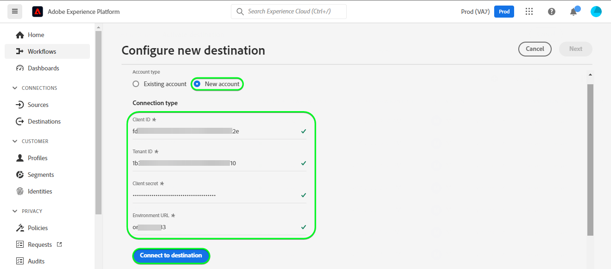

# [!DNL Microsoft Dynamics 365] 연결

## 개요 {#overview}

[[!DNL Microsoft Dynamics 365]](https://dynamics.microsoft.com/en-us/) 는 생산성 애플리케이션 및 AI 도구와 함께 ERP(전사적 자원 관리) 및 CRM(고객 관계 관리)을 결합하여 전체적인 원활하고 더욱 통제된 운영, 향상된 성장 잠재력 및 비용 절감을 제공하는 클라우드 기반의 비즈니스 애플리케이션 플랫폼입니다.

이 [!DNL Adobe Experience Platform] [대상](/help/destinations/home.md) 을 활용합니다. [[!DNL Contact Entity Reference API]](https://docs.microsoft.com/en-us/dynamics365/customerengagement/on-premises/developer/entities/contact?view=op-9-1)대상자 내의 ID를 업데이트할 수 있는 [!DNL Dynamics 365].

[!DNL Dynamics 365] 은 인증 메커니즘으로 권한 부여와 함께 OAuth 2를 사용하여 와 통신합니다. [!DNL Contact Entity Reference API]. 에 대한 인증 지침 [!DNL Dynamics 365] 인스턴스는 다음보다 아래에 있습니다. [대상에 인증](#authenticate) 섹션.

## 사용 사례 {#use-cases}

마케터는 Adobe Experience Platform 프로필의 속성에 따라 개인화된 경험을 사용자에게 제공할 수 있습니다. 오프라인 데이터에서 대상을 작성하고 이 대상자를 (으)로 보낼 수 있습니다. [!DNL Dynamics 365]: Adobe Experience Platform에서 대상자 및 프로필이 업데이트되는 즉시 사용자의 피드에 표시할 수 있습니다.

## 사전 요구 사항 {#prerequisites}

### Experience Platform 사전 요구 사항 {#prerequisites-in-experience-platform}

에 대한 데이터를 활성화하기 전에 [!DNL Dynamics 365] 대상, 다음 항목이 있어야 합니다. [스키마](/help/xdm/schema/composition.md), a [데이터 세트](https://experienceleague.adobe.com/docs/platform-learn/tutorials/data-ingestion/create-datasets-and-ingest-data.html?lang=en), 및 [세그먼트](https://experienceleague.adobe.com/docs/platform-learn/tutorials/segments/create-segments.html?lang=en) 생성 위치 [!DNL Experience Platform].

다음에 대한 Adobe 설명서를 참조하십시오. [세그먼트 멤버십 세부 정보 스키마 필드 그룹](/help/xdm/field-groups/profile/segmentation.md) 대상 상태에 대한 지침이 필요한 경우.

### [!DNL Microsoft Dynamics 365] 전제 조건 {#prerequisites-destination}

에서 다음 전제 조건을 참고하십시오. [!DNL Dynamics 365]: 데이터를 플랫폼에서 로 내보내기 [!DNL Dynamics 365] 계정:

#### 다음을 수행해야 합니다. [!DNL Microsoft Dynamics 365] account {#prerequisites-account}

로 이동 [!DNL Dynamics 365] [체험판](https://dynamics.microsoft.com/en-us/dynamics-365-free-trial/) 아직 계정이 없는 경우 등록하고 계정을 만들 수 있는 페이지입니다.

#### 다음 범위 내에 필드 만들기 [!DNL Dynamics 365] {#prerequisites-custom-field}

유형의 사용자 정의 필드 만들기 `Simple` (필드 데이터 유형 포함) `Single Line of Text` 다음 기간 내에 대상자 상태를 업데이트하는 데 사용할 Experience Platform [!DNL Dynamics 365].
다음을 참조하십시오. [!DNL Dynamics 365] 에 대한 설명서 [필드(속성) 만들기](https://docs.microsoft.com/en-us/dynamics365/customerengagement/on-premises/customize/create-edit-fields?view=op-9-1) 추가 지침이 필요한 경우.

내의 예제 설정 [!DNL Dynamics 365] 다음이 표시됩니다.

#### Azure Active Directory 내에서 응용 프로그램 및 응용 프로그램 사용자 등록 {#prerequisites-app-user}

활성화하려면 [!DNL Dynamics 365] 리소스에 액세스하려면 다음으로 로그인해야 합니다. [!DNL Azure Account] 끝 [[!DNL Azure Active Directory]](https://docs.microsoft.com/en-us/azure/active-directory/develop/howto-create-service-principal-portal#register-an-application-with-azure-ad-and-create-a-service-principal) 다음을 생성합니다.
* An [!DNL Azure Active Directory] 애플리케이션
* 서비스 주체
* 애플리케이션 암호

또한 다음을 수행해야 합니다 [응용 프로그램 사용자 만들기](https://docs.microsoft.com/en-us/power-platform/admin/manage-application-users#create-an-application-user) 위치: [!DNL Azure Active Directory] 새로 만든 응용 프로그램과 연결합니다.

#### 수집 [!DNL Dynamics 365] 자격 증명 {#gather-credentials}

에 인증하기 전에 아래 항목을 적어 두십시오. [!DNL Dynamics 365] CRM 대상:

| 자격 증명 | 설명 | 예 |
| --- | --- | --- |
| `Client ID` | 다음 [!DNL Dynamics 365] 클라이언트 ID [!DNL Azure Active Directory] 응용 프로그램. 다음을 참조하십시오. [[!DNL Dynamics 365] 설명서](https://docs.microsoft.com/en-us/azure/active-directory/develop/howto-create-service-principal-portal#get-tenant-and-app-id-values-for-signing-in) 지침을 참조하십시오. | `ababbaba-abab-baba-acac-acacacacacac` |
| `Client Secret` | 다음 [!DNL Dynamics 365] 에 대한 클라이언트 암호 [!DNL Azure Active Directory] 응용 프로그램. 다음 내에서 #2 옵션을 사용합니다. [[!DNL Dynamics 365] 설명서](https://docs.microsoft.com/en-us/azure/active-directory/develop/howto-create-service-principal-portal#authentication-two-options). | `abcde~abcdefghijklmnopqrstuvwxyz12345678` 지침을 참조하십시오. |
| `Tenant ID` | 다음 [!DNL Dynamics 365] 에 대한 임차인 ID [!DNL Azure Active Directory] 응용 프로그램. 다음을 참조하십시오. [[!DNL Dynamics 365] 설명서](https://docs.microsoft.com/en-us/azure/active-directory/develop/howto-create-service-principal-portal#get-tenant-and-app-id-values-for-signing-in) 지침을 참조하십시오. | `1234567-aaaa-12ab-ba21-1234567890` |
| `Environment URL` | 다음을 참조하십시오. [[!DNL Dynamics 365] 설명서](https://docs.microsoft.com/en-us/dynamics365/customerengagement/on-premises/developer/org-service/discover-url-organization-organization-service?view=op-9-1) 지침을 참조하십시오. | 다음의 경우 [!DNL Dynamics 365] 도메인은 아래와 같습니다. 강조 표시된 값이 필요합니다.  *`org57771b33`.crm.dynamics.com* |

## 가드레일 {#guardrails}

다음 [요청 제한 및 할당](https://docs.microsoft.com/en-us/power-platform/admin/api-request-limits-allocations) 페이지 세부 정보 [!DNL Dynamics 365] 와 연계된 API 제한 [!DNL Dynamics 365] 라이센스. 데이터와 페이로드가 이러한 제한 내에 있는지 확인해야 합니다.

## 지원되는 ID {#supported-identities}

[!DNL Dynamics 365] 는 아래 표에 설명된 id 업데이트를 지원합니다. 자세히 알아보기 [id](/help/identity-service/namespaces.md).

| TARGET ID | 예 | 설명 | 고려 사항 |
|---|---|---|---|
| `contactId` | 7eb682f1-ca75-e511-80d4-00155d2a68d1 | 연락처에 대한 고유 식별자. | **필수입니다**. 다음을 참조하십시오. [[!DNL Dynamics 365] 설명서](https://docs.microsoft.com/en-us/dynamics365/customerengagement/on-premises/developer/entities/contact?view=op-9-1) 을 참조하십시오. |

## 내보내기 유형 및 빈도 {#export-type-frequency}

대상 내보내기 유형 및 빈도에 대한 자세한 내용은 아래 표를 참조하십시오.

| 항목 | 유형 | 참고 |
---------|----------|---------|
| 내보내기 유형 | **[!UICONTROL 프로필 기반]** | <ul><li>원하는 스키마 필드와 함께 세그먼트의 모든 멤버를 내보냅니다 *(예: 이메일 주소, 전화번호, 성)*&#x200B;를 입력합니다.</li><li> 의 각 대상자 상태 [!DNL Dynamics 365] 는 을 기반으로 플랫폼에서 해당 대상 상태로 업데이트됩니다. **[!UICONTROL 매핑 ID]** 다음 기간 동안 제공된 값: [대상자 예약](#schedule-segment-export-example) 단계.</li></ul> |
| 내보내기 빈도 | **[!UICONTROL 스트리밍]** | <ul><li>스트리밍 대상은 &quot;항상&quot; API 기반 연결입니다. 대상자 평가를 기반으로 Experience Platform에서 프로필이 업데이트되는 즉시 커넥터가 업데이트 다운스트림을 대상 플랫폼으로 전송합니다. 자세한 내용 [스트리밍 대상](/help/destinations/destination-types.md#streaming-destinations).</li></ul> |

{style="table-layout:auto"}

## 대상에 연결 {#connect}

>[!IMPORTANT]
>
>대상에 연결하려면 다음이 필요합니다. **[!UICONTROL 대상 관리]** [액세스 제어 권한](/help/access-control/home.md#permissions). 읽기 [액세스 제어 개요](/help/access-control/ui/overview.md) 필요한 권한을 얻으려면 제품 관리자에게 문의하십시오.

이 대상에 연결하려면 다음과같이 하십시오. [대상 구성 자습서](../../ui/connect-destination.md). 대상 구성 워크플로에서 아래 두 섹션에 나열된 필드를 채웁니다.

다음 범위 내 **[!UICONTROL 대상]** > **[!UICONTROL 카탈로그]** 검색 대상 [!DNL Dynamics 365]. 또는 아래에서 찾을 수 있습니다 **[!UICONTROL CRM]** 범주.

### 대상에 인증 {#authenticate}

대상에 인증하려면 다음을 선택합니다. **[!UICONTROL 대상에 연결]**.

아래의 필수 필드를 입력하십시오. 다음을 참조하십시오. [Dynamics 365 자격 증명 수집](#gather-credentials) 섹션에 자세히 설명되어 있습니다.
* **[!UICONTROL 클라이언트 ID]**: [!DNL Dynamics 365] 클라이언트 ID [!DNL Azure Active Directory] 응용 프로그램.
* **[!UICONTROL 임차인 ID]**: [!DNL Dynamics 365] 에 대한 임차인 ID [!DNL Azure Active Directory] 응용 프로그램.
* **[!UICONTROL 클라이언트 암호]**: [!DNL Dynamics 365] 에 대한 클라이언트 암호 [!DNL Azure Active Directory] 응용 프로그램.
* **[!UICONTROL 환경 URL]**: 사용자 [!DNL Dynamics 365] 환경 URL.

제공된 세부 정보가 유효한 경우 UI에 **[!UICONTROL 연결됨]** 녹색 확인 표시가 있는 상태. 그런 다음 다음 다음 단계로 진행할 수 있습니다.

### 대상 세부 정보 입력 {#destination-details}

대상에 대한 세부 정보를 구성하려면 아래의 필수 및 선택 필드를 채우십시오. UI에서 필드 옆에 있는 별표는 필드가 필수임을 나타냅니다.

* **[!UICONTROL 이름]**: 나중에 이 대상을 인식할 수 있는 이름입니다.
* **[!UICONTROL 설명]**: 나중에 이 대상을 식별하는 데 도움이 되는 설명입니다.

### 경고 활성화 {#enable-alerts}

경고를 활성화하여 대상에 대한 데이터 흐름 상태에 대한 알림을 받을 수 있습니다. 목록에서 경고를 선택하여 데이터 흐름 상태에 대한 알림을 수신합니다. 경고에 대한 자세한 내용은 다음 안내서를 참조하십시오. [UI를 사용하여 대상 경고 구독](../../ui/alerts.md).

대상 연결에 대한 세부 정보를 제공했으면 을 선택합니다. **[!UICONTROL 다음]**.

## 이 대상에 대상자 활성화 {#activate}

>[!IMPORTANT]
>
>데이터를 활성화하려면 **[!UICONTROL 대상 관리]**, **[!UICONTROL 대상 활성화]**, **[!UICONTROL 프로필 보기]**, 및 **[!UICONTROL 세그먼트 보기]** [액세스 제어 권한](/help/access-control/home.md#permissions). 읽기 [액세스 제어 개요](/help/access-control/ui/overview.md) 필요한 권한을 얻으려면 제품 관리자에게 문의하십시오.

읽기 [스트리밍 대상자 내보내기 대상으로 프로필 및 대상자 활성화](/help/destinations/ui/activate-segment-streaming-destinations.md) 이 대상에 대한 대상자 활성화에 대한 지침을 참조하십시오.

### 매핑 고려 사항 및 예제 {#mapping-considerations-example}

대상 데이터를 Adobe Experience Platform에서 로 올바르게 보내려면 [!DNL Dynamics 365] 대상, 필드 매핑 단계를 거쳐야 합니다. 매핑은 Platform 계정의 XDM(Experience Data Model) 스키마 필드와 대상 대상의 해당 필드 간에 링크를 만드는 것으로 구성됩니다. XDM 필드를 [!DNL Dynamics 365] 대상 필드에서 다음 단계를 수행합니다.

1. 다음에서 **[!UICONTROL 매핑]** 단계, 선택 **[!UICONTROL 새 매핑 추가]**. 화면에 새 매핑 행이 표시됩니다.
   

1. 다음에서 **[!UICONTROL 소스 필드 선택]** 창에서 다음을 선택합니다. **[!UICONTROL ID 네임스페이스 선택]** 범주 및 선택 `contactId`.
   

1. 다음에서 **[!UICONTROL 대상 필드 선택]** 창에서 소스 필드를 매핑할 대상 필드의 유형을 선택합니다.
   * **[!UICONTROL ID 네임스페이스 선택]**: 이 옵션을 선택하여 소스 필드를 목록의 id 네임스페이스에 매핑합니다.
     

   * XDM 프로필 스키마와 사용자 간에 다음 매핑을 추가합니다 [!DNL Dynamics 365] 인스턴스: |XDM 프로필 스키마|[!DNL Dynamics 365] 인스턴스| 필수| |—|—| |`contactId`|`contactId`| 예 |

   * **[!UICONTROL 사용자 지정 속성 선택]**: 소스 필드를 다음에서 정의한 사용자 지정 속성에 매핑하려면 이 옵션을 선택합니다. **[!UICONTROL 속성 이름]** 필드. 을(를) 참조하십시오 [[!DNL Dynamics 365] 설명서](https://docs.microsoft.com/en-us/dynamics365/customerengagement/on-premises/developer/entities/contact?view=op-9-1#entity-properties) 를 참조하십시오.
     

     >[!IMPORTANT]
     >
     >에 매핑된 날짜 또는 타임스탬프 소스 필드가 있는 경우 [!DNL Dynamics 365] [날짜 또는 타임스탬프](https://docs.microsoft.com/en-us/power-apps/developer/data-platform/webapi/reference/timestampdatemapping?view=dataverse-latest) 대상 필드에서 매핑되는 값이 비어 있지 않은지 확인합니다. 전달된 값이 비어 있으면 다음이 발생합니다. *`Bad request reported while pushing events to the destination. Please contact the administrator and try again.`* 오류 메시지가 표시되고 데이터가 업데이트되지 않습니다. (이)는 [!DNL Dynamics 365] 제한 사항.

   * 예를 들어 업데이트할 값에 따라 XDM 프로필 스키마와 [!DNL Dynamics 365] 인스턴스: |XDM 프로필 스키마|[!DNL Dynamics 365] 인스턴스| |—|—| |`person.name.firstName`|`FirstName`| |`person.name.lastName`|`LastName`| |`personalEmail.address`|`Email`|

   * 이러한 매핑을 사용하는 예는 다음과 같습니다.
     

### 대상자 내보내기 예약 및 예제 {#schedule-segment-export-example}

다음에서 [[!UICONTROL 대상자 내보내기 예약]](/help/destinations/ui/activate-segment-streaming-destinations.md#scheduling) 활성화 워크플로 단계에서 Platform 대상을 의 사용자 지정 필드 속성에 수동으로 매핑해야 합니다. [!DNL Dynamics 365].

이렇게 하려면 각 세그먼트를 선택한 다음, 해당 사용자 정의 필드 속성을 다음에서 입력합니다 [!DNL Dynamics 365] 다음에서 **[!UICONTROL 매핑 ID]** 필드.

>[!IMPORTANT]
>
>에 사용되는 값 **[!UICONTROL 매핑 ID]** 은(는) 내에서 만든 사용자 정의 필드 속성의 이름과 정확히 일치해야 합니다. [!DNL Dynamics 365]. 다음을 참조하십시오 [[!DNL Dynamics 365] 설명서](https://docs.microsoft.com/en-us/dynamics365/customerengagement/on-premises/customize/create-edit-fields?view=op-9-1) 사용자 지정 필드 속성을 찾는 방법에 대한 지침이 필요한 경우.

예제는 아래에 나와 있습니다.

## 데이터 내보내기 유효성 검사 {#exported-data}

대상을 올바르게 설정했는지 확인하려면 아래 단계를 수행하십시오.

1. 선택 **[!UICONTROL 대상]** > **[!UICONTROL 찾아보기]** 대상 목록으로 이동합니다.
   

1. 대상을 선택하고 상태가 다음과 같은지 확인합니다. **[!UICONTROL 활성화됨]**.
   

1. 다음으로 전환 **[!DNL Activation data]** 탭을 누른 다음 대상 이름을 선택합니다.
   

1. 대상자 요약을 모니터링하고 프로필 수가 세그먼트 내에서 만든 수에 해당하는지 확인합니다.
   

1. 에 로그인합니다 [!DNL Dynamics 365] 웹 사이트를 방문한 다음 [!DNL Customers] > [!DNL Contacts] 페이지를 만들고 대상자의 프로필이 추가되었는지 확인합니다. 에서 각 대상자 상태를 확인할 수 있습니다. [!DNL Dynamics 365] 이(가) 다음을 기반으로 플랫폼에서 해당 대상 상태로 업데이트되었습니다. **[!UICONTROL 매핑 ID]** 다음 기간 동안 제공된 값: [대상자 예약](#schedule-segment-export-example) 단계.
   

## 데이터 사용 및 관리 {#data-usage-governance}

모두 [!DNL Adobe Experience Platform] 대상은 데이터를 처리할 때 데이터 사용 정책을 준수합니다. 방법에 대한 자세한 정보 [!DNL Adobe Experience Platform] 데이터 거버넌스 시행, 다음을 참조하십시오. [데이터 거버넌스 개요](/help/data-governance/home.md).

## 오류 및 문제 해결 {#errors-and-troubleshooting}

### 이벤트를 대상으로 푸시하는 동안 알 수 없는 오류 발생 {#unknown-errors}

데이터 흐름 실행을 확인할 때 다음 오류 메시지가 표시되는 경우: `Bad request reported while pushing events to the destination. Please contact the administrator and try again.`

이 오류를 수정하려면 다음을 확인하십시오. **[!UICONTROL 매핑 ID]** 에 을(를) 제공했습니다. [!DNL Dynamics 365] 플랫폼 대상자가 유효하고 다음 내에 존재합니다. [!DNL Dynamics 365].

## 추가 리소스 {#additional-resources}

에서 제공하는 추가 유용한 정보 [[!DNL Dynamics 365] 설명서](https://docs.microsoft.com/en-us/dynamics365/) 은(는) 아래에 있습니다.
* [IOorganizationService.Update(Entity) 메서드](https://docs.microsoft.com/en-us/dotnet/api/microsoft.xrm.sdk.iorganizationservice.update?view=dataverse-sdk-latest)
* [웹 API를 사용하여 테이블 행 업데이트 및 삭제](https://docs.microsoft.com/en-us/power-apps/developer/data-platform/webapi/update-delete-entities-using-web-api#basic-update)
