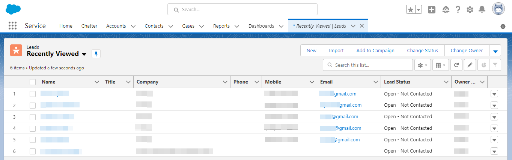

# [!DNL Salesforce CRM] 연결

## 개요 {#overview}

[[!DNL Salesforce CRM]](https://www.salesforce.com/crm/) 는 인기 있는 CRM(고객 관계 관리) 플랫폼으로, 다음을 지원합니다.

* [잠재 고객](https://developer.salesforce.com/docs/atlas.en-us.object_reference.meta/object_reference/sforce_api_objects_lead.htm) - 잠재 고객은 귀하가 판매하는 제품 또는 서비스에 관심이 있거나 관심이 없는 개인 또는 회사의 이름입니다.
* [연락처](https://developer.salesforce.com/docs/atlas.en-us.object_reference.meta/object_reference/sforce_api_objects_contact.htm) - 연락처는 담당자 중 한 명이 관계를 맺고 잠재 고객으로 자격을 얻은 개인입니다.

이 [!DNL Adobe Experience Platform] [대상](/help/destinations/home.md) 을 활용합니다. [[!DNL Salesforce composite API]](https://developer.salesforce.com/docs/atlas.en-us.api_rest.meta/api_rest/resources_composite_sobjects_collections_update.htm)는 위에서 설명한 두 유형의 프로필을 모두 지원합니다.

날짜 [세그먼트 활성화](#activate), 리드 또는 연락처 중 하나를 선택하고 속성 및 세그먼트 데이터를 다음으로 업데이트할 수 있습니다. [!DNL Salesforce CRM].

[!DNL Salesforce CRM] 는 암호 부여가 포함된 OAuth 2를 인증 메커니즘으로 사용하여 Salesforce REST API와 통신합니다. 에 대한 인증 지침 [!DNL Salesforce CRM] 인스턴스는 다음보다 아래에 있습니다. [대상에 인증](#authenticate) 섹션.

## 사용 사례 {#use-cases}

마케터는 Adobe Experience Platform 프로필의 속성에 따라 개인화된 경험을 사용자에게 제공할 수 있습니다. 오프라인 데이터에서 세그먼트를 작성하고 이러한 세그먼트를 Salesforce CRM으로 보내어 Adobe Experience Platform에서 세그먼트 및 프로필이 업데이트되는 즉시 사용자 피드에 표시할 수 있습니다.

## 사전 요구 사항 {#prerequisites}

### Experience Platform의 사전 요구 사항 {#prerequisites-in-experience-platform}

Salesforce CRM 대상으로 데이터를 활성화하기 전에 [스키마](/help/xdm/schema/composition.md), a [데이터 세트](https://experienceleague.adobe.com/docs/platform-learn/tutorials/data-ingestion/create-datasets-and-ingest-data.html?lang=en), 및 [세그먼트](https://experienceleague.adobe.com/docs/platform-learn/tutorials/segments/create-segments.html?lang=en) 생성 위치 [!DNL Experience Platform].

### 의 사전 요구 사항 [!DNL Salesforce CRM] {#prerequisites-destination}

에서 다음 전제 조건을 참고하십시오. [!DNL Salesforce CRM]: Platform에서 Salesforce 계정으로 데이터를 내보내려면 다음을 수행하십시오.

#### 다음을 수행해야 합니다. [!DNL Salesforce] account {#prerequisites-account}

로 이동 [!DNL Salesforce] [체험판](https://www.salesforce.com/in/form/signup/freetrial-sales/) 등록 및 만들 페이지 [!DNL Salesforce] 계정, 아직 계정이 없는 경우.

#### 내에서 연결된 앱 구성 [!DNL Salesforce] {#prerequisites-connected-app}

먼저 다음을 구성해야 합니다. [[!DNL Salesforce] 연결된 앱](https://help.salesforce.com/s/articleView?id=sf.connected_app_create.htm&amp;language=en_US&amp;r=https%3A%2F%2Fhelp.salesforce.com%2F&amp;type=5) 내 [!DNL Salesforce] 계정, 아직 계정이 없는 경우. [!DNL Salesforce CRM] 연결된 앱을 활용하여 연결 [!DNL Salesforce].

다음, 활성화 [!DNL OAuth Settings for API Integration] 대상: [!DNL Salesforce connected app]. 다음을 참조하십시오. [[!DNL Salesforce]](https://help.salesforce.com/s/articleView?id=connected_app_create_api_integration.htm&amp;type=5&amp;language=en_US) 설명서를 참조하십시오.

또한 [범위](https://help.salesforce.com/s/articleView?id=connected_app_create_api_integration.htm&amp;type=5&amp;language=en_US) 아래에 언급된 항목은 다음에 대해 선택됩니다. [!DNL Salesforce connected app].

* ``chatter_api``
* ``lightning``
* ``visualforce``
* ``content``
* ``openid``
* ``full``
* ``api``
* ``web``
* ``refresh_token``
* ``offline_access``

마지막으로 `password` 권한 부여가 다음 내에서 활성화됩니다. [!DNL Salesforce] 계정입니다. 다음을 참조하십시오. [!DNL Salesforce] [특수 시나리오에 대한 OAuth 2.0 사용자 이름-암호 흐름](https://help.salesforce.com/s/articleView?id=sf.remoteaccess_oauth_username_password_flow.htm&amp;type=5) 지침이 필요한 경우 설명서를 참조하십시오.

>[!IMPORTANT]
>
>다음의 경우 [!DNL Salesforce] 계정 관리자가 신뢰할 수 있는 IP 범위에 대한 액세스를 제한했습니다. 액세스하려면 해당 범위에 문의해야 합니다. [EXPERIENCE PLATFORM IP](/help/destinations/catalog/streaming/ip-address-allow-list.md) 허용 목록에추가된. 다음을 참조하십시오. [!DNL Salesforce] [연결된 앱의 신뢰할 수 있는 IP 범위에 대한 액세스 제한](https://help.salesforce.com/s/articleView?id=sf.connected_app_edit_ip_ranges.htm&amp;type=5) 추가 지침이 필요한 경우 설명서를 참조하십시오.

#### 다음 범위 내에서 사용자 정의 필드 만들기 [!DNL Salesforce] {#prerequisites-custom-field}

세그먼트를 활성화할 때 [!DNL Salesforce CRM] 대상, 다음에 값을 입력해야 합니다. **[!UICONTROL 매핑 ID]** 에서 활성화된 각 세그먼트의 필드 **[세그먼트 일정](#schedule-segment-export-example)** 단계.

[!DNL Salesforce CRM] Experience Platform 에서 들어오는 세그먼트를 올바르게 읽고 해석하고 내에서 세그먼트 상태를 업데이트하려면 이 값이 필요합니다. [!DNL Salesforce]. 다음에 대한 Experience Platform 설명서 참조: [세그먼트 멤버십 세부 정보 스키마 필드 그룹](/help/xdm/field-groups/profile/segmentation.md) 세그먼트 상태에 대한 지침이 필요한 경우.

플랫폼에서 로 활성화하는 각 세그먼트에 대해 [!DNL Salesforce CRM], 유형의 사용자 정의 필드를 만들어야 합니다 `Text Area (Long)` 다음 범위 내 [!DNL Salesforce]. 비즈니스 요구 사항에 따라 256~131,072자 사이의 모든 크기의 필드 문자 길이를 정의할 수 있습니다. 다음을 참조하십시오. [!DNL Salesforce] [사용자 정의 필드 유형](https://help.salesforce.com/s/articleView?id=sf.custom_field_types.htm&amp;type=5) 사용자 지정 필드 유형에 대한 추가 정보는 설명서 페이지를 참조하십시오. 다음 참조: [!DNL Salesforce] 에 대한 설명서 [사용자 정의 필드 만들기](https://help.salesforce.com/s/articleView?id=mc_cab_create_an_attribute.htm&amp;type=5&amp;language=en_US) 필드 만들기에 대한 지원이 필요한 경우.

>[!IMPORTANT]
>
>필드 이름에 공백 문자를 포함하지 마십시오. 대신 밑줄을 사용하십시오 `(_)` 문자를 구분 기호로 사용했습니다.
>다음 범위 내 [!DNL Salesforce] 다음을 사용하여 사용자 정의 필드를 만들어야 합니다. **[!UICONTROL 필드 이름]** 내에 지정된 값과 정확히 일치하는 **[!UICONTROL 매핑 ID]** 활성화된 각 플랫폼 세그먼트에 대해. 예를 들어 아래 스크린샷에는 이라는 사용자 정의 필드가 표시됩니다 `crm_2_seg`. 이 대상에 대한 세그먼트를 활성화할 때 다음을 추가합니다. `crm_2_seg` 다음으로: **[!UICONTROL 매핑 ID]** Experience Platform의 세그먼트 대상을 이 사용자 지정 필드로 채우려면 다음을 수행합니다.

의 사용자 정의 필드 만들기 예 [!DNL Salesforce], *1단계 - 데이터 유형 선택*이 아래에 표시되어 있습니다.

의 사용자 정의 필드 만들기 예 [!DNL Salesforce], *2단계 - 사용자 정의 필드에 대한 세부 정보 입력*이 아래에 표시되어 있습니다.

>[!TIP]
>
>* 플랫폼 세그먼트에 사용된 사용자 정의 필드와 내의 다른 사용자 정의 필드를 구분하려면 [!DNL Salesforce] 사용자 지정 필드를 만들 때 인식 가능한 접두사 또는 접미사를 포함할 수 있습니다. 예를 들어, 대신 `test_segment`, 사용 `Adobe_test_segment` 또는 `test_segment_Adobe`
>* 에 이미 다른 사용자 정의 필드가 만들어져 있는 경우 [!DNL Salesforce], 플랫폼 세그먼트와 동일한 이름을 사용하여에서 세그먼트를 쉽게 식별할 수 있습니다 [!DNL Salesforce].

>[!NOTE]
>
>* Salesforce의 오브젝트는 25개의 외부 필드로 제한됩니다. 다음을 참조하십시오. [사용자 정의 필드 속성](https://help.salesforce.com/s/articleView?id=sf.custom_field_attributes.htm&amp;type=5).
>* 이 제한은 언제든지 최대 25개의 Experience Platform 세그먼트 멤버십만 활성화할 수 있음을 의미합니다.
>* Salesforce 내에서 이 한도에 도달한 경우, 새로 만들기 전에 Experience Platform 내의 이전 세그먼트에 대한 세그먼트 상태를 저장하는 데 사용된 Salesforce에서 사용자 지정 특성을 제거해야 합니다 **[!UICONTROL 매핑 ID]** 를 사용할 수 있습니다.

#### 수집 [!DNL Salesforce CRM] 자격 증명 {#gather-credentials}

에 인증하기 전에 아래 항목을 적어 두십시오. [!DNL Salesforce CRM] 대상:

| 자격 증명 | 설명 | 예 |
| --- | --- | --- |
| `Username` | 사용자 [!DNL Salesforce] 계정 사용자 이름. |  |
| `Password` | 사용자 [!DNL Salesforce] 계정 암호입니다. |  |
| `Security Token` | 사용자 [!DNL Salesforce] 나중에 끝에 추가할 보안 토큰 [!DNL Salesforce] 다음으로 사용할 연결된 문자열을 만들기 위한 암호 **[!UICONTROL 암호]** 조건 [대상에 대한 인증](#authenticate).  다음을 참조하십시오. [!DNL Salesforce] 에 대한 설명서 [보안 토큰 재설정](https://help.salesforce.com/s/articleView?id=sf.user_security_token.htm&amp;type=5) 에서 재생성하는 방법에 대해 알아봅니다. [!DNL Salesforce] 보안 토큰이 없는 경우 인터페이스합니다. |  |
| `Custom Domain` | 사용자 [!DNL Salesforce] 도메인 접두사입니다.   다음을 참조하십시오. [[!DNL Salesforce] 설명서](https://help.salesforce.com/s/articleView?id=sf.domain_name_setting_login_policy.htm&amp;type=5) 에서 이 값을 가져오는 방법을 알아보려면 [!DNL Salesforce] 인터페이스. | 다음의 경우 [!DNL Salesforce] 도메인:  *`d5i000000isb4eak-dev-ed`.my.salesforce.com*,  다음이 필요합니다 `d5i000000isb4eak-dev-ed` 을 값으로 추가합니다. |
| `Client ID` | Salesforce `Consumer Key`.   다음을 참조하십시오. [[!DNL Salesforce] 설명서](https://help.salesforce.com/s/articleView?id=sf.connected_app_rotate_consumer_details.htm&amp;type=5) 에서 이 값을 가져오는 방법을 알아보려면 [!DNL Salesforce] 인터페이스. |  |
| `Client Secret` | Salesforce `Consumer Secret`.   다음을 참조하십시오. [[!DNL Salesforce] 설명서](https://help.salesforce.com/s/articleView?id=sf.connected_app_rotate_consumer_details.htm&amp;type=5) 에서 이 값을 가져오는 방법을 알아보려면 [!DNL Salesforce] 인터페이스. |  |

### 가드레일 {#guardrails}

[!DNL Salesforce] 요청, 속도 및 시간 제한 제한을 적용하여 트랜잭션 로드 밸런싱을 수행합니다. 다음을 참조하십시오. [API 요청 제한 및 할당](https://developer.salesforce.com/docs/atlas.en-us.salesforce_app_limits_cheatsheet.meta/salesforce_app_limits_cheatsheet/salesforce_app_limits_platform_api.htm) 을 참조하십시오.

다음의 경우 [!DNL Salesforce] 계정 관리자가 IP 제한을 적용했습니다. 다음을 추가해야 합니다. [Experience Platform IP 주소](/help/destinations/catalog/streaming/ip-address-allow-list.md) (으)로 [!DNL Salesforce] 계정의 신뢰할 수 있는 IP 범위입니다. 다음을 참조하십시오. [!DNL Salesforce] [연결된 앱의 신뢰할 수 있는 IP 범위에 대한 액세스 제한](https://help.salesforce.com/s/articleView?id=sf.connected_app_edit_ip_ranges.htm&amp;type=5) 추가 지침이 필요한 경우 설명서를 참조하십시오.

>[!IMPORTANT]
>
>날짜 [세그먼트 활성화](#activate) 다음 중 하나를 선택해야 합니다. *연락처* 또는 *리드* 유형. 선택한 유형에 따라 세그먼트에 적절한 데이터 매핑이 있는지 확인해야 합니다.

## 지원되는 ID {#supported-identities}

[!DNL Salesforce CRM] 는 아래 표에 설명된 id 업데이트를 지원합니다. 자세히 알아보기 [id](/help/identity-service/namespaces.md).

| TARGET ID | 설명 | 고려 사항 |
|---|---|---|
| `SalesforceId` | 다음 [!DNL Salesforce CRM] 세그먼트를 통해 내보내거나 업데이트하는 연락처 또는 잠재 고객 ID에 대한 식별자입니다. | 필수입니다 |

## 내보내기 유형 및 빈도 {#export-type-frequency}

대상 내보내기 유형 및 빈도에 대한 자세한 내용은 아래 표를 참조하십시오.

| 항목 | 유형 | 참고 |
---------|----------|---------|
| 내보내기 유형 | **[!UICONTROL 프로필 기반]** | <ul><li>원하는 스키마 필드와 함께 세그먼트의 모든 멤버를 내보냅니다 *(예: 이메일 주소, 전화번호, 성)*&#x200B;를 입력합니다.</li><li> 의 각 세그먼트 상태 [!DNL Salesforce CRM] 는 을 기반으로 플랫폼에서 해당 세그먼트 상태로 업데이트됩니다. **[!UICONTROL 매핑 ID]** 다음 기간 동안 제공된 값: [세그먼트 예약](#schedule-segment-export-example) 단계.</li></ul> |
| 내보내기 빈도 | **[!UICONTROL 스트리밍]** | <ul><li>스트리밍 대상은 &quot;항상&quot; API 기반 연결입니다. Experience Platform 평가를 기반으로 프로필이 세그먼트에서 업데이트되는 즉시 커넥터가 업데이트 다운스트림을 대상 플랫폼으로 전송합니다. 자세한 내용 [스트리밍 대상](/help/destinations/destination-types.md#streaming-destinations).</li></ul> |

{style="table-layout:auto"}

## 대상에 연결 {#connect}

>[!IMPORTANT]
>
>대상에 연결하려면 다음이 필요합니다. **[!UICONTROL 대상 관리]** [액세스 제어 권한](/help/access-control/home.md#permissions). 읽기 [액세스 제어 개요](/help/access-control/ui/overview.md) 필요한 권한을 얻으려면 제품 관리자에게 문의하십시오.

이 대상에 연결하려면 다음과같이 하십시오. [대상 구성 자습서](../../ui/connect-destination.md). 대상 구성 워크플로에서 아래 두 섹션에 나열된 필드를 채웁니다.

다음 범위 내 **[!UICONTROL 대상]** > **[!UICONTROL 카탈로그]** 검색 대상 [!DNL Salesforce CRM]. 또는 아래에서 찾을 수 있습니다 **[!UICONTROL CRM]** 범주.

### 대상에 인증 {#authenticate}

대상에 인증하려면 아래의 필수 필드를 입력한 다음 을(를) 선택합니다. **[!UICONTROL 대상에 연결]**. 다음을 참조하십시오. [수집 [!DNL Salesforce CRM] 자격 증명](#gather-credentials) 섹션에 자세히 설명되어 있습니다.
| 자격 증명 | 설명 | | — | — | | **[!UICONTROL 사용자 이름]** | 내 [!DNL Salesforce] 계정 사용자 이름. | | **[!UICONTROL 암호]** | 다음으로 구성된 연결된 문자열 [!DNL Salesforce] 다음에 추가된 계정 암호: [!DNL Salesforce] 보안 토큰. 연결된 값은 다음 형식을 갖습니다. `{PASSWORD}{TOKEN}`.  참고: 중괄호나 공백을 사용하지 마십시오. 예를 들어 [!DNL Salesforce] 암호: `MyPa$$w0rd123` 및 [!DNL Salesforce] 보안 토큰은 `TOKEN12345....0000`에서 사용할 연결된 값 **[!UICONTROL 암호]** 필드는 입니다. `MyPa$$w0rd123TOKEN12345....0000`. | | **[!UICONTROL 사용자 정의 도메인]** | 내 [!DNL Salesforce] 도메인 접두사입니다.  예를 들어 도메인이 입니다. *`d5i000000isb4eak-dev-ed`.my.salesforce.com*, 다음을 제공해야 합니다. `d5i000000isb4eak-dev-ed` 을 값으로 추가합니다. | | **[!UICONTROL 클라이언트 ID]** | 내 [!DNL Salesforce] 연결된 앱 `Consumer Key`. | | **[!UICONTROL 클라이언트 암호]** | 내 [!DNL Salesforce] 연결된 앱 `Consumer Secret`. |

제공된 세부 정보가 유효한 경우 UI에 **[!UICONTROL 연결됨]** 상태가 녹색 확인 표시로 표시되면 다음 단계로 진행할 수 있습니다.

### 대상 세부 정보 입력 {#destination-details}

대상에 대한 세부 정보를 구성하려면 아래의 필수 및 선택 필드를 채우십시오. UI에서 필드 옆에 있는 별표는 필드가 필수임을 나타냅니다.
* **[!UICONTROL 이름]**: 나중에 이 대상을 인식할 수 있는 이름입니다.
* **[!UICONTROL 설명]**: 나중에 이 대상을 식별하는 데 도움이 되는 설명입니다.
* **[!UICONTROL Salesforce ID 유형]**:
   * 선택 **[!UICONTROL 연락처]** 내보내거나 업데이트하려는 id가 유형인 경우 *연락처*.
   * 선택 **[!UICONTROL 리드]** 내보내거나 업데이트하려는 id가 유형인 경우 *리드*.

### 경고 활성화 {#enable-alerts}

경고를 활성화하여 대상에 대한 데이터 흐름 상태에 대한 알림을 받을 수 있습니다. 목록에서 경고를 선택하여 데이터 흐름 상태에 대한 알림을 수신합니다. 경고에 대한 자세한 내용은 다음 안내서를 참조하십시오. [UI를 사용하여 대상 경고 구독](../../ui/alerts.md).

대상 연결에 대한 세부 정보를 제공했으면 을 선택합니다. **[!UICONTROL 다음]**.

## 이 대상에 대한 세그먼트 활성화 {#activate}

>[!IMPORTANT]
>
>데이터를 활성화하려면 **[!UICONTROL 대상 관리]**, **[!UICONTROL 대상 활성화]**, **[!UICONTROL 프로필 보기]**, 및 **[!UICONTROL 세그먼트 보기]** [액세스 제어 권한](/help/access-control/home.md#permissions). 읽기 [액세스 제어 개요](/help/access-control/ui/overview.md) 필요한 권한을 얻으려면 제품 관리자에게 문의하십시오.

읽기 [프로필 및 세그먼트를 스트리밍 세그먼트 내보내기 대상으로 활성화](/help/destinations/ui/activate-segment-streaming-destinations.md) 대상 세그먼트를 이 대상으로 활성화하는 방법에 대한 지침

### 매핑 고려 사항 및 예제 {#mapping-considerations-example}

대상 데이터를 Adobe Experience Platform에서 로 올바르게 보내려면 [!DNL Salesforce CRM] 대상, 필드 매핑 단계를 거쳐야 합니다. 매핑은 Platform 계정의 XDM(Experience Data Model) 스키마 필드와 대상 대상의 해당 필드 간에 링크를 만드는 것으로 구성됩니다.

에 지정된 속성 **[!UICONTROL Target 필드]** 이 속성은 요청 본문을 형성하므로 속성 매핑 표에 설명된 것과 정확히 동일하게 이름이 지정되어야 합니다.

에 지정된 속성 **[!UICONTROL 소스 필드]** 이러한 제한 사항을 따르지 마십시오. 필요에 따라 매핑할 수 있지만 입력 데이터의 형식이 [[!DNL Salesforce] 설명서](https://help.salesforce.com/s/articleView?id=sf.custom_field_attributes.htm&amp;type=5). 입력 데이터가 올바르지 않으면 업데이트 호출이 [!DNL Salesforce] 이(가) 실패하고 연락처/잠재 고객이 업데이트되지 않습니다.

XDM 필드를 [!DNL (API) Salesforce CRM] 대상 필드에서 다음 단계를 수행합니다.

1. 다음에서 **[!UICONTROL 매핑]** 단계, 선택 **[!UICONTROL 새 매핑 추가]**화면에 새 매핑 행이 표시됩니다.
   
1. 다음에서 **[!UICONTROL 소스 필드 선택]** 창에서 다음을 선택합니다. **[!UICONTROL 속성 선택]** 범주를 선택한 다음 XDM 속성을 선택하거나 **[!UICONTROL ID 네임스페이스 선택]** id를 선택합니다.
1. 다음에서 **[!UICONTROL 대상 필드 선택]** 창에서 다음을 선택합니다. **[!UICONTROL ID 네임스페이스 선택]** id를 선택하거나 **[!UICONTROL 사용자 지정 속성 선택]** 범주를 선택하고 속성을 선택하거나 **[!UICONTROL 속성 이름]** 필드를 추가합니다. 다음을 참조하십시오. [[!DNL Salesforce CRM] 설명서](https://help.salesforce.com/s/articleView?id=sf.custom_field_attributes.htm&amp;type=5) 를 참조하십시오.
   * XDM 프로필 스키마와 간에 다음 매핑을 추가하려면 이 단계를 반복합니다 [!DNL (API) Salesforce CRM]:

   **연락처 작업**

   * 을 사용하여 작업하는 경우 *연락처* 세그먼트 내에서 Salesforce의 개체 참조 를 참조하십시오. [연락처](https://developer.salesforce.com/docs/atlas.en-us.object_reference.meta/object_reference/sforce_api_objects_contact.htm) 업데이트할 필드에 대한 매핑을 정의합니다.
   * 단어를 검색하여 필수 필드를 식별할 수 있습니다 *필수*: 위의 링크에서 필드 설명에 언급되어 있습니다.
   * 내보내거나 업데이트할 필드에 따라 XDM 프로필 스키마와 [!DNL (API) Salesforce CRM]: |소스 필드|Target 필드| 메모 | | — | — | — | |`IdentityMap: crmID`|`Identity: SalesforceId`|`Mandatory`| |`xdm: person.name.lastName`|`Attribute: LastName`| `Mandatory`. 연락처의 성(최대 80자). |\
      |`xdm: person.name.firstName`|`Attribute: FirstName`| 연락처의 이름을 최대 40자까지 지정할 수 있습니다. | |`xdm: personalEmail.address`|`Attribute: Email`| 연락처의 이메일 주소입니다. |

   * 이러한 매핑을 사용하는 예는 다음과 같습니다.
      

   **리드 작업**

   * 을 사용하여 작업하는 경우 *잠재 고객* 세그먼트 내에서 Salesforce의 개체 참조 를 참조하십시오. [리드](https://developer.salesforce.com/docs/atlas.en-us.object_reference.meta/object_reference/sforce_api_objects_lead.htm) 업데이트할 필드에 대한 매핑을 정의합니다.
   * 단어를 검색하여 필수 필드를 식별할 수 있습니다 *필수*: 위의 링크에서 필드 설명에 언급되어 있습니다.
   * 내보내거나 업데이트할 필드에 따라 XDM 프로필 스키마와 [!DNL (API) Salesforce CRM]: |소스 필드|Target 필드| 메모 | | — | — | — | |`IdentityMap: crmID`|`Identity: SalesforceId`|`Mandatory`| |`xdm: person.name.lastName`|`Attribute: LastName`| `Mandatory`. 리드 최대 80자의 성. |\
      |`xdm: b2b.companyName`|`Attribute: Company`| `Mandatory`. 리드의 회사. | |`xdm: personalEmail.address`|`Attribute: Email`| 잠재 고객의 이메일 주소입니다. |

   * 이러한 매핑을 사용하는 예는 다음과 같습니다.
      

대상 연결에 대한 매핑 제공을 마쳤으면 다음을 선택합니다. **[!UICONTROL 다음]**.

### 세그먼트 내보내기 예약 및 예제 {#schedule-segment-export-example}

다음을 수행할 때 [세그먼트 내보내기 예약](/help/destinations/ui/activate-segment-streaming-destinations.md#scheduling) 단계 Platform에서 활성화된 세그먼트를 의 해당 사용자 정의 필드에 수동으로 매핑해야 함 [!DNL Salesforce].

이렇게 하려면 각 세그먼트를 선택한 다음 사용자 정의 필드 이름을 입력합니다. [!DNL Salesforce] 다음에서 [!DNL Salesforce CRM] **[!UICONTROL 매핑 ID]** 필드. 다음을 참조하십시오. [다음 범위 내에서 사용자 정의 필드 만들기 [!DNL Salesforce]](#prerequisites-custom-field) 에서 사용자 정의 필드 만들기에 대한 지침 및 모범 사례에 대한 섹션 [!DNL Salesforce].

예를 들어 [!DNL Salesforce] 사용자 정의 필드: `crm_2_seg`에서 이 값을 지정합니다. [!DNL Salesforce CRM] **[!UICONTROL 매핑 ID]** Experience Platform의 세그먼트 대상을 이 사용자 지정 필드로 채우려면 다음을 수행합니다.

의 사용자 정의 필드 예 [!DNL Salesforce] 다음이 표시됩니다.
![[!DNL Salesforce] 사용자 정의 필드를 보여주는 UI 스크린샷입니다.](../../assets/catalog/crm/salesforce/salesforce-custom-field.png)

의 위치를 나타내는 예 [!DNL Salesforce CRM] **[!UICONTROL 매핑 ID]** 다음이 표시됩니다.

위에 표시된 대로 [!DNL Salesforce] **[!UICONTROL 필드 이름]** 다음 내에 지정된 값과 정확히 일치 [!DNL Salesforce CRM] **[!UICONTROL 매핑 ID]**.

사용 사례에 따라 활성화된 모든 세그먼트를 동일한 세그먼트에 매핑할 수 있습니다 [!DNL Salesforce] 사용자 지정 필드 또는 다른 사용자 지정 필드 **[!UICONTROL 필드 이름]** 위치: [!DNL Salesforce CRM]. 위에 표시된 이미지를 기반으로 한 일반적인 예는 다음과 같을 수 있습니다.
| [!DNL Salesforce CRM] 세그먼트 이름 | [!DNL Salesforce] **[!UICONTROL 필드 이름]** | [!DNL Salesforce CRM] **[!UICONTROL 매핑 ID]** | | — | — | — | | crm_1_seg | `crm_1_seg` | `crm_1_seg` | | crm_2_seg | `crm_2_seg` | `crm_2_seg` |

활성화된 각 플랫폼 세그먼트에 대해 이 섹션을 반복합니다.

## 데이터 내보내기 유효성 검사 {#exported-data}

대상을 올바르게 설정했는지 확인하려면 아래 단계를 수행하십시오.

1. 선택 **[!UICONTROL 대상]** > **[!UICONTROL 찾아보기]** 대상 목록으로 이동합니다.
   

1. 대상을 선택하고 상태가 다음과 같은지 확인합니다. **[!UICONTROL 활성화됨]**.
   

1. 다음으로 전환 **[!UICONTROL 활성화 데이터]** 탭을 누른 다음 세그먼트 이름을 선택합니다.
   

1. 세그먼트 요약을 모니터링하고 프로필 수가 세그먼트 내에서 생성된 수에 해당하는지 확인합니다.
   

1. 마지막으로 Salesforce 웹 사이트에 로그인하여 세그먼트의 프로필이 추가 또는 업데이트되었는지 확인합니다.

   **연락처 작업**

   * 을(를) 선택한 경우 *연락처* 플랫폼 세그먼트 내에서 **[!DNL Apps]** > **[!DNL Contacts]** 페이지를 가리키도록 업데이트하는 중입니다.
      

   * 선택 *연락처* 필드가 업데이트되었는지 확인합니다. 에서 각 세그먼트 상태를 확인할 수 있습니다. [!DNL Salesforce CRM] 이(가) 다음을 기반으로 플랫폼에서 해당 세그먼트 상태로 업데이트되었습니다. **[!UICONTROL 매핑 ID]** 다음 기간 동안 제공된 값: [세그먼트 예약](#schedule-segment-export-example).
      

   **리드 작업**

   * 을(를) 선택한 경우 *잠재 고객* 플랫폼 세그먼트 내에서 다음 위치로 이동합니다. **[!DNL Apps]** > **[!DNL Leads]** 페이지를 가리키도록 업데이트하는 중입니다.
      

   * 선택 *리드* 필드가 업데이트되었는지 확인합니다. 에서 각 세그먼트 상태를 확인할 수 있습니다. [!DNL Salesforce CRM] 이(가) 다음을 기반으로 플랫폼에서 해당 세그먼트 상태로 업데이트되었습니다. **[!UICONTROL 매핑 ID]** 다음 기간 동안 제공된 값: [세그먼트 예약](#schedule-segment-export-example).
      

## 데이터 사용 및 관리 {#data-usage-governance}

모두 [!DNL Adobe Experience Platform] 대상은 데이터를 처리할 때 데이터 사용 정책을 준수합니다. 방법에 대한 자세한 정보 [!DNL Adobe Experience Platform] 데이터 거버넌스 시행, 다음을 참조하십시오. [데이터 거버넌스 개요](/help/data-governance/home.md).

## 오류 및 문제 해결 {#errors-and-troubleshooting}

### 이벤트를 대상으로 푸시하는 동안 알 수 없는 오류 발생 {#unknown-errors}

* 데이터 흐름 실행을 확인할 때 다음 오류 메시지가 표시될 수 있습니다. `Unknown errors encountered while pushing events to the destination. Please contact the administrator and try again.`

   

   * 이 오류를 수정하려면 다음을 확인하십시오. **[!UICONTROL 매핑 ID]** 활성화 워크플로에서 제공한 [!DNL Salesforce CRM] 대상이 사용자 정의 필드 유형 값과 정확히 일치함 [!DNL Salesforce]. 다음을 참조하십시오. [다음 범위 내에서 사용자 정의 필드 만들기 [!DNL Salesforce]](#prerequisites-custom-field) 섹션을 참조하십시오.

* 세그먼트를 활성화할 때 다음과 같은 오류 메시지가 표시될 수 있습니다. `The client's IP address is unauthorized for this account. Allowlist the client's IP address...`
   * 이 오류를 수정하려면 다음 연락처로 문의하십시오. [!DNL Salesforce] 추가할 계정 관리자 [Experience Platform IP 주소](/help/destinations/catalog/streaming/ip-address-allow-list.md) (으)로 [!DNL Salesforce] 계정의 신뢰할 수 있는 IP 범위입니다. 다음을 참조하십시오. [!DNL Salesforce] [연결된 앱의 신뢰할 수 있는 IP 범위에 대한 액세스 제한](https://help.salesforce.com/s/articleView?id=sf.connected_app_edit_ip_ranges.htm&amp;type=5) 추가 지침이 필요한 경우 설명서를 참조하십시오.

## 추가 리소스 {#additional-resources}

에서 제공하는 추가 유용한 정보 [Salesforce 개발자 포털](https://developer.salesforce.com/) 은(는) 아래에 있습니다.
* [빠른 시작](https://developer.salesforce.com/docs/atlas.en-us.api_rest.meta/api_rest/quickstart.htm)
* [레코드 만들기](https://developer.salesforce.com/docs/atlas.en-us.api_rest.meta/api_rest/dome_sobject_create.htm)
* [사용자 지정 권장 사항 대상](https://developer.salesforce.com/docs/atlas.en-us.236.0.chatterapi.meta/chatterapi/connect_resources_recommendation_audiences_list.htm)
* [복합 리소스 사용](https://developer.salesforce.com/docs/atlas.en-us.api_rest.meta/api_rest/using_composite_resources.htm?q=composite)
* 이 대상은 [여러 레코드 업데이트](https://developer.salesforce.com/docs/atlas.en-us.api_rest.meta/api_rest/resources_composite_sobjects_collections_update.htm) 대신 API를 사용하십시오 [단일 레코드 업데이트](https://developer.salesforce.com/docs/atlas.en-us.api_rest.meta/api_rest/dome_composite_upsert_example.htm?q=contacts) API 호출.