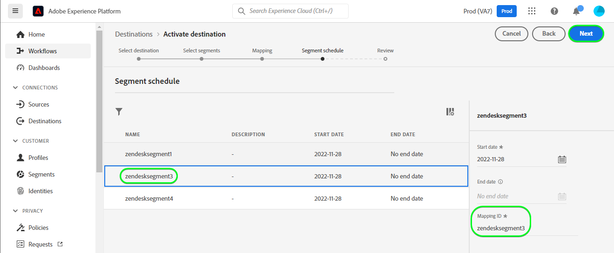

# [!DNL Zendesk] 연결

[[!DNL Zendesk]](https://www.zendesk.com)은(는) 고객 서비스 솔루션 및 판매 도구입니다.

이 [!DNL Adobe Experience Platform] [대상](/help/destinations/home.md)은(는) [[!DNL Zendesk] 연락처 API](https://developer.zendesk.com/api-reference/sales-crm/resources/contacts/)를 활용하여 대상 내에서 **ID를 만들고 업데이트**&#x200B;합니다[!DNL Zendesk] 내의 연락처로.

[!DNL Zendesk]은(는) 전달자 토큰을 인증 메커니즘으로 사용하여 [!DNL Zendesk] 연락처 API와 통신합니다. [!DNL Zendesk] 인스턴스에 대한 인증 지침은 [대상에 대한 인증](#authenticate) 섹션에서 아래에 더 나와 있습니다.

## 사용 사례 {#use-cases}

멀티채널 B2C 플랫폼의 고객 서비스 부서는 고객을 위해 매끄러운 개인화된 경험을 보장하기를 원합니다. 부서는 자체 오프라인 데이터로 대상자를 만들어 새 사용자 프로필을 만들거나 다른 상호 작용(예: 구매, 반품 등)에서 기존 프로필 정보를 업데이트할 수 있습니다 Adobe Experience Platform에서 [!DNL Zendesk](으)로 대상자를 보냅니다. [!DNL Zendesk]에 업데이트된 정보를 제공하면 고객 서비스 상담원이 즉시 고객의 최신 정보를 사용할 수 있으므로 더 빠른 응답과 해결이 가능합니다.

## 전제 조건 {#prerequisites}

### Experience Platform 사전 요구 사항 {#prerequisites-in-experience-platform}

[!DNL Zendesk] 대상에 대한 데이터를 활성화하기 전에 [!DNL Experience Platform]에서 만든 [스키마](/help/xdm/schema/composition.md), [데이터 세트](https://experienceleague.adobe.com/docs/platform-learn/tutorials/data-ingestion/create-datasets-and-ingest-data.html) 및 [세그먼트](https://experienceleague.adobe.com/docs/platform-learn/tutorials/segments/create-segments.html)가 있어야 합니다.

대상 상태에 대한 지침이 필요한 경우 [대상 멤버십 세부 정보 스키마 필드 그룹](/help/xdm/field-groups/profile/segmentation.md)에 대한 Experience Platform 설명서를 참조하세요.

### [!DNL Zendesk]개 필수 구성 요소 {#prerequisites-destination}

플랫폼에서 [!DNL Zendesk] 계정으로 데이터를 내보내려면 [!DNL Zendesk] 계정이 있어야 합니다.

#### [!DNL Zendesk] 자격 증명 수집 {#gather-credentials}

[!DNL Zendesk] 대상에 인증하기 전에 아래 항목을 적어 두십시오.

| 자격 증명 | 설명 | 예 |
| --- | --- | --- |
| `Bearer token` | [!DNL Zendesk] 계정에서 생성한 액세스 토큰입니다.   설명서를 따라 액세스 토큰이 없는 경우 [액세스 토큰을 생성 [!DNL Zendesk] 합니다](https://developer.zendesk.com/documentation/sales-crm/first-call/#1-generate-an-access-token). | `a0b1c2d3e4...v20w21x22y23z` |

## 가드레일 {#guardrails}

[가격 및 요금 제한](https://developer.zendesk.com/api-reference/sales-crm/rate-limits/#pricing) 페이지에서 계정과 연결된 [!DNL Zendesk] API 제한을 자세히 설명합니다. 데이터와 페이로드가 이러한 제한 내에 있는지 확인해야 합니다.

## 지원되는 ID {#supported-identities}

[!DNL Zendesk]은(는) 아래 표에 설명된 ID 업데이트를 지원합니다. [ID](/help/identity-service/features/namespaces.md)에 대해 자세히 알아보세요.

| 대상 ID | 예 | 설명 | 필수 |
|---|---|---|---|
| `email` | `test@test.com` | 연락처의 이메일 주소입니다. | 예 |

## 내보내기 유형 및 빈도 {#export-type-frequency}

대상 내보내기 유형 및 빈도에 대한 자세한 내용은 아래 표를 참조하십시오.

| 항목 | 유형 | 참고 |
---------|----------|---------|
| 내보내기 유형 | **[!UICONTROL 프로필 기반]** | <ul><li>필드 매핑에 따라 원하는 스키마 필드 *(예: 이메일 주소, 전화 번호, 성)*&#x200B;과(와) 함께 세그먼트의 모든 멤버를 내보냅니다.</li><li> [!DNL Zendesk]의 각 세그먼트 상태는 [대상 예약](#schedule-segment-export-example) 단계 동안 제공된 **[!UICONTROL 매핑 ID]** 값을 기반으로 플랫폼에서 해당 대상 상태로 업데이트됩니다.</li></ul> |
| 내보내기 빈도 | **[!UICONTROL 스트리밍]** | <ul><li>스트리밍 대상은 &quot;항상&quot; API 기반 연결입니다. 대상자 평가를 기반으로 Experience Platform에서 프로필이 업데이트되는 즉시 커넥터가 업데이트 다운스트림을 대상 플랫폼으로 전송합니다. [스트리밍 대상](/help/destinations/destination-types.md#streaming-destinations)에 대해 자세히 알아보세요.</li></ul> |

{style="table-layout:auto"}

## 대상에 연결 {#connect}

>[!IMPORTANT]
>
>대상에 연결하려면 **[!UICONTROL 대상 보기]** 및 **[!UICONTROL 대상 관리]** [액세스 제어 권한](/help/access-control/home.md#permissions)이 필요합니다. [액세스 제어 개요](/help/access-control/ui/overview.md)를 읽거나 제품 관리자에게 문의하여 필요한 권한을 받으십시오.

이 대상에 연결하려면 [대상 구성 자습서](../../ui/connect-destination.md)에 설명된 단계를 따르십시오. 대상 구성 워크플로에서 아래 두 섹션에 나열된 필드를 채웁니다.

**[!UICONTROL 대상]** > **[!UICONTROL 카탈로그]** 내에서 [!DNL Zendesk] 검색 또는 **[!UICONTROL CRM]** 범주 아래에서 찾을 수 있습니다.

### 대상으로 인증 {#authenticate}

아래의 필수 필드를 입력하십시오. 자세한 내용은 [수집 [!DNL Zendesk] 자격 증명](#gather-credentials) 섹션을 참조하십시오.
* **[!UICONTROL 전달자 토큰]**: [!DNL Zendesk] 계정에서 생성한 액세스 토큰입니다.

대상에 인증하려면 **[!UICONTROL 대상에 연결]**을 선택하세요.
인증 방법을 보여 주는 

제공된 세부 정보가 유효하면 UI에 녹색 확인 표시와 함께 **[!UICONTROL 연결됨]** 상태가 표시됩니다. 그런 다음 다음 다음 단계로 진행할 수 있습니다.

### 대상 세부 정보 입력 {#destination-details}

대상에 대한 세부 정보를 구성하려면 아래의 필수 및 선택 필드를 채우십시오. UI에서 필드 옆에 있는 별표는 필드가 필수임을 나타냅니다.

* **[!UICONTROL 이름]**: 나중에 이 대상을 인식할 수 있는 이름입니다.
* **[!UICONTROL 설명]**: 나중에 이 대상을 식별하는 데 도움이 되는 설명입니다.

### 경고 활성화 {#enable-alerts}

경고를 활성화하여 대상에 대한 데이터 흐름 상태에 대한 알림을 받을 수 있습니다. 목록에서 경고를 선택하여 데이터 흐름 상태에 대한 알림을 수신합니다. 경고에 대한 자세한 내용은 [UI를 사용하여 대상 경고 구독](../../ui/alerts.md)에 대한 안내서를 참조하십시오.

대상 연결에 대한 세부 정보를 모두 제공했으면 **[!UICONTROL 다음]**&#x200B;을 선택합니다.

## 이 대상으로 대상자 활성화 {#activate}

>[!IMPORTANT]
> 
>* 데이터를 활성화하려면 **[!UICONTROL 대상 보기]**, **[!UICONTROL 대상 활성화]**, **[!UICONTROL 프로필 보기]** 및 **[!UICONTROL 세그먼트 보기]** [액세스 제어 권한](/help/access-control/home.md#permissions)이 필요합니다. [액세스 제어 개요](/help/access-control/ui/overview.md)를 읽거나 제품 관리자에게 문의하여 필요한 권한을 받으십시오.
>* *ID*&#x200B;을(를) 내보내려면 **[!UICONTROL ID 그래프 보기]** [액세스 제어 권한](/help/access-control/home.md#permissions)이 필요합니다.   {width="100" zoomable="yes"}

이 대상으로 대상을 활성화하는 방법에 대한 지침은 [프로필 및 대상을 스트리밍 대상 내보내기 대상으로 활성화](/help/destinations/ui/activate-segment-streaming-destinations.md)를 참조하십시오.

### 매핑 고려 사항 및 예제 {#mapping-considerations-example}

대상 데이터를 Adobe Experience Platform에서 [!DNL Zendesk] 대상으로 올바르게 보내려면 필드 매핑 단계를 거쳐야합니다. 매핑은 Platform 계정의 XDM(Experience Data Model) 스키마 필드와 대상 대상의 해당 필드 간에 링크를 만드는 것으로 구성됩니다.

**[!UICONTROL 대상 필드]**&#x200B;에 지정된 특성은 요청 본문을 형성하므로 특성 매핑 표에 설명된 대로 정확히 이름을 지정해야 합니다.

**[!UICONTROL Source 필드]**&#x200B;에 지정된 특성은 이러한 제한을 따르지 않습니다. 필요에 따라 매핑할 수 있지만 [!DNL Zendesk]에 푸시할 때 데이터 형식이 올바르지 않으면 오류가 발생합니다.

XDM 필드를 [!DNL Zendesk] 대상 필드에 올바르게 매핑하려면 다음 단계를 따르십시오.

1. **[!UICONTROL 매핑]** 단계에서 **[!UICONTROL 새 매핑 추가]**&#x200B;를 선택합니다. 화면에 새 매핑 행이 표시됩니다.
1. **[!UICONTROL 소스 필드 선택]** 창에서 **[!UICONTROL 특성 선택]** 범주를 선택하고 XDM 특성을 선택하거나 **[!UICONTROL ID 네임스페이스 선택]**&#x200B;을 선택하고 ID를 선택합니다.
1. **[!UICONTROL 대상 필드 선택]** 창에서 **[!UICONTROL ID 네임스페이스 선택]** 범주를 선택하고 대상 ID를 선택하거나 **[!UICONTROL 특성 선택]** 범주를 선택하고 지원되는 스키마 특성 중 하나를 선택합니다.
   * 다음 필수 매핑을 추가하려면 다음 단계를 반복하십시오. XDM 프로필 스키마와 [!DNL Zendesk] 인스턴스 간에 업데이트할 다른 특성을 추가할 수도 있습니다.
|Source 필드|대상 필드| 필수|
|—|—|
|`xdm: person.name.lastName`|`xdm: last_name`| 예 |
|`IdentityMap: Email`|`Identity: email`| 예 |
|`xdm: person.name.firstName`|`xdm: first_name`| |

   * 이러한 매핑을 사용하는 예는 다음과 같습니다.
     특성 매핑이 있는 

>[!IMPORTANT]
>
>이 대상에는 `Attribute: last_name` 및 `Identity: email` 대상 매핑이 필수입니다. 이러한 매핑이 누락된 경우 다른 매핑은 모두 무시되고 [!DNL Zendesk](으)로 전송되지 않습니다.

대상 연결에 대한 매핑을 제공했으면 **[!UICONTROL 다음]**&#x200B;을 선택합니다.

### 대상자 내보내기 예약 및 예제 {#schedule-segment-export-example}

활성화 워크플로의 [[!UICONTROL 대상 내보내기 예약]](/help/destinations/ui/activate-segment-streaming-destinations.md#scheduling) 단계에서 플랫폼 대상을 [!DNL Zendesk]의 사용자 지정 필드 특성에 수동으로 매핑해야 합니다.

이렇게 하려면 각 세그먼트를 선택한 다음 **[!UICONTROL 매핑 ID]** 필드에 [!DNL Zendesk]의 해당 사용자 지정 필드 특성을 입력하십시오.

예제는 아래에 나와 있습니다.
대상자 내보내기 일정을 보여 주는 

## 데이터 내보내기 유효성 검사 {#exported-data}

대상을 올바르게 설정했는지 확인하려면 아래 단계를 수행하십시오.

1. **[!UICONTROL 대상]** > **[!UICONTROL 찾아보기]**&#x200B;를 선택하고 대상 목록으로 이동합니다.
1. 그런 다음 대상을 선택하고 **[!UICONTROL 활성화 데이터]** 탭으로 전환한 다음 대상 이름을 선택합니다.
   

1. 대상자 요약을 모니터링하고 프로필 수가 세그먼트 내의 수와 일치하는지 확인합니다.
   

1. [!DNL Zendesk] 웹 사이트에 로그인한 다음 **[!UICONTROL 연락처]** 페이지로 이동하여 대상자의 프로필이 추가되었는지 확인합니다. 대상**[!UICONTROL 매핑 ID]** 및 대상 상태로 만든 추가 필드에 대한 열을 표시하도록 이 목록을 구성할 수 있습니다.
   대상 이름으로 만든 추가 필드가 있는 연락처 페이지를 보여 주는 

1. 또는 개별 **[!UICONTROL 개인]** 페이지로 드릴다운하여 대상 이름 및 대상 상태를 표시하는 **[!UICONTROL 추가 필드]** 섹션을 확인할 수 있습니다.
   

## 데이터 사용 및 관리 {#data-usage-governance}

데이터를 처리할 때 모든 [!DNL Adobe Experience Platform] 대상이 데이터 사용 정책을 준수합니다. [!DNL Adobe Experience Platform]에서 데이터 거버넌스를 적용하는 방법에 대한 자세한 내용은 [데이터 거버넌스 개요](/help/data-governance/home.md)를 참조하십시오.

## 추가 리소스 {#additional-resources}

[!DNL Zendesk] 설명서의 추가 유용한 정보는 다음과 같습니다.
* [첫 번째 전화 걸기](https://developer.zendesk.com/documentation/sales-crm/first-call/)
* [사용자 지정 필드](https://developer.zendesk.com/api-reference/sales-crm/requests/#custom-fields)

### 변경 로그

이 섹션에서는 이 대상 커넥터에 대한 기능 및 중요 설명서 업데이트를 캡처합니다.

+++ 변경 로그 보기

| 릴리스 월 | 업데이트 유형 | 설명 |
|---|---|---|
| 2023년 4월 | 설명서 업데이트 | <ul><li>고객이 이 대상을 사용할 때 이점을 얻을 수 있는 경우를 보다 명확하게 예로 들어 [사용 사례](#use-cases) 섹션을 업데이트했습니다.</li> <li>올바른 필수 매핑을 반영하도록 [매핑](#mapping-considerations-example) 섹션을 업데이트했습니다. 이 대상에는 `Attribute: last_name` 및 `Identity: email` 대상 매핑이 필수입니다. 이러한 매핑이 누락된 경우 다른 매핑은 모두 무시되고 [!DNL Zendesk](으)로 전송되지 않습니다.</li> <li>필수 및 선택적 매핑에 대한 명확한 예제로 [매핑](#mapping-considerations-example) 섹션을 업데이트했습니다.</li></ul> |
| 2023년 3월 | 초기 릴리스 | 초기 대상 릴리스 및 설명서 게시. |

{style="table-layout:auto"}

+++
