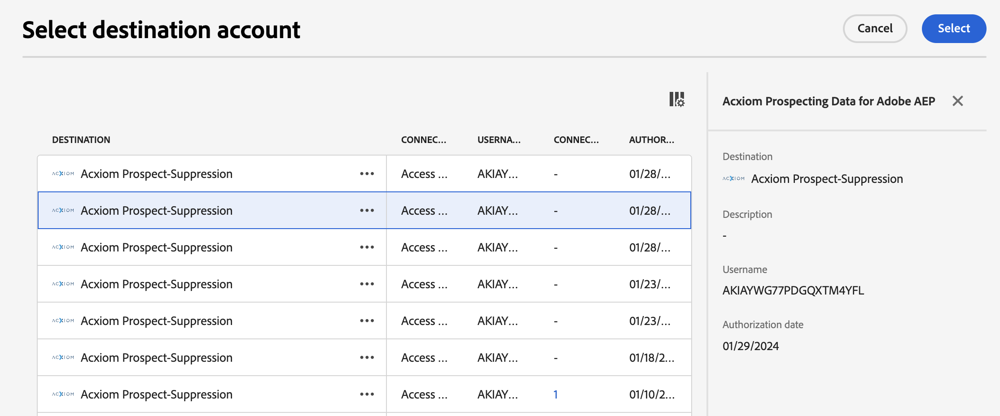
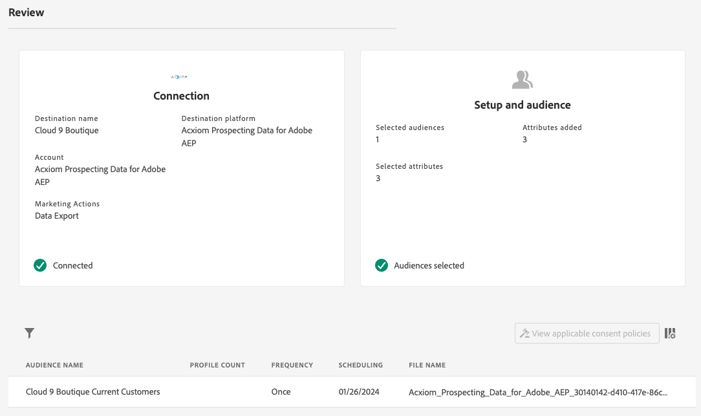

# [!DNL Acxiom Prospect-Suppression] 대상 연결

>[!NOTE]
>
>[!DNL Acxiom Prospect-Suppression] 대상이 Beta 상태입니다. 이 대상 커넥터 및 설명서 페이지는 Acxiom 팀이 만들고 유지 관리합니다. 문의 사항이나 업데이트 요청은 acxiom-adobe-help@acxiom.com으로 직접 문의하십시오.

## 개요 {#overview}

[!DNL Acxiom Prospect-Suppression]을(를) 사용하여 가능한 가장 생산적인 잠재 고객을 제공하십시오. 이 커넥터는 [!DNL Real-Time Customer Data Platform]에서 자사 데이터를 안전하게 내보내고 비표시 목록으로 사용할 데이터 파일을 생성하는 수상 경력에 빛나는 위생 및 ID 확인을 통해 실행합니다. 이 값은 가져오기에 맞게 잠재 고객 목록을 조정할 수 있는 [!DNL Acxiom Global] 데이터베이스와 일치합니다. 그런 다음 [[!DNL Acxiom Prospecting Data Import]](/help/sources/connectors/data-partners/acxiom-prospecting-data-import.md) 소스 커넥터를 사용하여 Acxiom의 목록을 알려진 고객 또는 전환된 고객이 제거된 [!DNL Real-Time CDP]&#x200B;(으)로 다시 보냅니다.

Acxiom은 개인화된 경험을 제공하는 데 중점을 둔 12,000개 이상의 글로벌 데이터 속성으로 구성된 가장 큰 카탈로그를 통해 업계에서 가장 성과가 좋은 대상자를 제공합니다. 고품질 데이터의 무제한 조합을 사용하여 특정 캠페인 요구 사항에 부합하는 대상을 만들고 배포할 수 있습니다.

이 자습서에서는 [!DNL Acxiom Prospect-Suppression] 사용자 인터페이스를 사용하여 [!DNL Adobe Experience Platform] 대상 연결 및 데이터 흐름을 만드는 단계를 제공합니다. 이 커넥터는 Amazon S3를 드롭 포인트로 사용하여 Acxiom Prospect Service에 데이터를 제공합니다. Amazon S3 드롭포인트로 파일 내보내기를 시작하면 Acxiom 계정 담당자에게 문의하십시오.

## 사용 사례 {#use-cases}

[!DNL Acxiom Prospect-Suppression] 대상을 사용하는 방법과 시기를 더 잘 이해할 수 있도록 [!DNL Adobe Experience Platform] 고객이 이 대상을 사용하여 해결할 수 있는 사용 사례의 예제를 소개합니다.

### 데이터 세트 전망에 대한 제외 목록 만들기 {#create-suppression-list}

전달 전략의 효과를 높이려는 마케팅 전문가는 종종 억제 목록을 만듭니다. 이 목록에는 기존 고객 및 특정 세그먼트가 포함되어 있으므로 타겟팅된 캠페인 중에 고객이 전망 활동에서 제외될 수 있습니다. 이러한 전략적 접근 방식은 대상자를 세분화하고 중복 커뮤니케이션을 방지하며 보다 집중적이고 효율적인 마케팅 활동에 기여합니다.

예를 들어 마케터는 제공한 세분화 및 제외 기준에 따라 캠페인에 타겟팅된 잠재 고객 프로필을 추가하여 캠페인 범위를 넓힐 수 있습니다.

사용 사례는 대상 및 소스 커넥터 조합을 통해 실행됩니다.

처음에는 제외 파일로 사용할 대상 커넥터를 사용하여 기존 고객 프로필을 내보내는 것부터 시작합니다. 이렇게 하면 기존 고객 레코드가 포함되지 않습니다.

Acxiom의 서비스는 파일을 검색하여 추가 선택 기준과 함께 사용하고 잠재 파일을 생성합니다. 그런 다음 해당 [[!DNL Acxiom Prospecting Data Import]](/help/sources/connectors/data-partners/acxiom-prospecting-data-import.md) 소스 커넥터를 사용하여 잠재 고객 프로필을 Adobe [!DNL Real-Time CDP]&#x200B;(으)로 수집합니다.

## 전제 조건 {#prerequisites}

>[!IMPORTANT]
>
>* 대상에 연결하려면 **[!UICONTROL View Destinations]** 및 **[!UICONTROL Manage Destinations]**, **[!UICONTROL Activate Destinations]**, **[!UICONTROL View Profiles]**, **[!UICONTROL View Segments]** [액세스 제어 권한](/help/access-control/home.md#permissions)이 필요합니다. [액세스 제어 개요](/help/access-control/ui/overview.md)를 읽거나 제품 관리자에게 문의하여 필요한 권한을 받으십시오.
>* *ID*&#x200B;을(를) 내보내려면 **[!UICONTROL View Identity Graph]** [액세스 제어 권한](/help/access-control/home.md#permissions)이 필요합니다.   {width="100" zoomable="yes"}

## 지원되는 대상자 {#supported-audiences}

이 섹션에서는 이 대상으로 내보낼 수 있는 대상자 유형을 설명합니다.

| 대상자 원본 | 지원됨 | 설명 |
|---------|----------|----------|
| [!DNL Segmentation Service] | 예 | Experience Platform [세그먼테이션 서비스](../../../segmentation/home.md)를 통해 생성된 대상입니다. |
| 기타 모든 대상 원본 | 아니요 | 이 범주에는 [!DNL Segmentation Service]을(를) 통해 생성된 대상 외부의 모든 대상 출처가 포함됩니다. [다양한 대상 원본](/help/segmentation/ui/audience-portal.md#customize)에 대해 읽어 보십시오. 예를 들면 다음과 같습니다. <ul><li> CSV 파일에서 Experience Platform으로 사용자 지정 업로드 대상 [가져옴](../../../segmentation/ui/audience-portal.md#import-audience),</li><li> 유사 대상, </li><li> 페더레이션 대상, </li><li> [!DNL Adobe Journey Optimizer]과(와) 같은 다른 Experience Platform 앱에서 생성된 대상, </li><li> 등. </li></ul> |

{style="table-layout:auto"}

대상 데이터 유형별 지원되는 대상:

| 대상 데이터 유형 | 지원됨 | 설명 | 사용 사례 |
|--------------------|-----------|-------------|-----------|
| [사람 대상](/help/segmentation/types/people-audiences.md) | 예 | 고객 프로필을 기반으로 마케팅 캠페인을 위해 특정 사용자 그룹을 타깃팅할 수 있습니다. | 빈번한 구매자, 장바구니 포기 |
| [계정 대상자](/help/segmentation/types/account-audiences.md) | 아니요 | 계정 기반 마케팅 전략을 위해 특정 조직 내의 개인을 타깃팅합니다. | B2B 마케팅 |
| [잠재 고객](/help/segmentation/types/prospect-audiences.md) | 아니요 | 아직 고객이 아니지만 타겟 대상자와 특성을 공유하는 개인을 타겟팅합니다. | 타사 데이터를 이용한 잠재 고객 확보 |
| [데이터 집합 내보내기](/help/catalog/datasets/overview.md) | 아니요 | [!DNL Adobe Experience Platform] 데이터 레이크에 저장된 구조화된 데이터의 컬렉션입니다. | 보고, 데이터 과학 워크플로 |

{style="table-layout:auto"}

## 내보내기 유형 및 빈도 {#export-type-frequency}

대상 내보내기 유형 및 빈도에 대한 자세한 내용은 아래 표를 참조하십시오.

| 항목 | 유형 | 참고 |
|------------------|--------------------------------|------------------------------------------------------------------------------------------------------------------------------------------------------------------------------------------------------------------------------------------------------------------------------------------------------------------------|
| 내보내기 유형 | **[!UICONTROL Profile-based]** | [대상 활성화 워크플로](/help/destinations/ui/activate-batch-profile-destinations.md#select-attributes)의 프로필 특성 선택 화면에서 선택한 대로 원하는 스키마 필드(예: 이메일 주소, 전화번호, 성)와 함께 세그먼트의 모든 구성원을 내보냅니다. |
| 내보내기 빈도 | **[!UICONTROL Batch]** | 배치 대상은 파일을 3, 6, 8, 12 또는 24시간 단위로 다운스트림 플랫폼으로 내보냅니다. [일괄 파일 기반 대상](/help/destinations/destination-types.md#file-based)에 대해 자세히 알아보세요. |

{style="table-layout:auto"}

## 대상에 연결 {#connect}

>[!IMPORTANT]
>
>대상에 연결하려면 **[!UICONTROL View Destinations]** 및 **[!UICONTROL Manage Destinations]** [액세스 제어 권한](/help/access-control/home.md#permissions)이 필요합니다. [액세스 제어 개요](/help/access-control/ui/overview.md)를 읽거나 제품 관리자에게 문의하여 필요한 권한을 받으십시오.

이 대상에 연결하려면 [대상 구성 자습서](../../ui/connect-destination.md)에 설명된 단계를 따르십시오. 대상 구성 워크플로에서 아래 두 섹션에 나열된 필드를 채웁니다.

### 대상으로 인증 {#authenticate}

대상에 인증하려면 필수 필드를 입력한 다음 **[!UICONTROL Connect to destination]**&#x200B;을(를) 선택하십시오.

Experience Platform에서 버킷에 액세스하려면 다음 자격 증명에 대한 유효한 값을 제공해야 합니다.

| 자격 증명 | 설명 |
|---------------|----------------------------------------------------------------------------------------------------------|
| S3 액세스 키 | 버킷에 대한 액세스 키 ID입니다. [!DNL Acxiom] 팀에서 이 값을 검색할 수 있습니다. |
| S3 비밀 키 | 버킷의 비밀 키 ID. [!DNL Acxiom] 팀에서 이 값을 검색할 수 있습니다. |
| 버킷 이름 | 파일을 공유할 버킷입니다. [!DNL Acxiom] 팀에서 이 값을 검색할 수 있습니다. |

### 새 계정 {#new-account}

새 Acxiom Managed S3 위치를 정의하려면

### 기존 계정 {#existing-account}

[!DNL Acxiom Prospect Suppression] 대상을 사용하여 이미 정의된 계정이 목록 팝업에 나타납니다. 선택하면 오른쪽 레일에서 계정에 대한 세부 정보를 볼 수 있습니다. **[!UICONTROL Destinations]** > **[!UICONTROL Accounts]**(으)로 이동하면 UI에서 예제를 봅니다.

### 대상 세부 정보 입력 {#destination-details}

대상에 대한 세부 정보를 구성하려면 아래의 필수 및 선택 필드를 채우십시오. UI에서 필드 옆에 있는 별표는 필드가 필수임을 나타냅니다.

* **이름(필수)** - 대상이 저장될 이름
* **설명** - 대상의 용도에 대한 간략한 설명
* **버킷 이름(필수)** - S3에 설정된 Amazon S3 버킷의 이름
* **폴더 경로(필수)** - 버킷의 하위 디렉터리를 사용하는 경우 루트 경로를 참조하려면 경로를 정의하거나 &#39;/&#39;를 정의해야 합니다.
* **파일 형식** - Experience Platform에서 내보낸 파일에 사용할 형식을 선택합니다. 현재 Acxiom 처리에 필요한 유일한 파일 유형은 CSV입니다

>[!IMPORTANT]
>
>CSV 옵션을 선택할 때 *구분 기호*, *따옴표 문자*, *이스케이프 문자*, *빈 값*, *Null 값*, *압축 형식* 및 *매니페스트 파일 포함* 옵션이 표시됩니다. 다음 문서에서는 이러한 설정에 대해 자세히 설명합니다 [서식 옵션 구성](../../ui/batch-destinations-file-formatting-options.md).

### 경고 활성화 {#enable-alerts}

경고를 활성화하여 대상에 대한 데이터 흐름 상태에 대한 알림을 받을 수 있습니다. 목록에서 경고를 선택하여 데이터 흐름 상태에 대한 알림을 수신합니다. 경고에 대한 자세한 내용은 [UI를 사용하여 대상 경고 구독](../../ui/alerts.md)에 대한 안내서를 참조하십시오.

대상 연결에 대한 세부 정보를 제공했으면 **[!UICONTROL Next]**&#x200B;을(를) 선택합니다.

## 이 대상으로 대상자 활성화 {#activate}

>[!IMPORTANT]
>
>* 데이터를 활성화하려면 **[!UICONTROL View Destinations]**, **[!UICONTROL Activate Destinations]**, **[!UICONTROL View Profiles]** 및 **[!UICONTROL View Segments]** [액세스 제어 권한](/help/access-control/home.md#permissions)이 필요합니다. [액세스 제어 개요](/help/access-control/ui/overview.md)를 읽거나 제품 관리자에게 문의하여 필요한 권한을 받으십시오.
>* *ID*&#x200B;을(를) 내보내려면 **[!UICONTROL View Identity Graph]** [액세스 제어 권한](/help/access-control/home.md#permissions)이 필요합니다.   {width="100" zoomable="yes"}

이 대상으로 대상을 활성화하는 방법에 대한 지침은 [대상 데이터를 일괄 프로필 내보내기 대상으로 활성화](/help/destinations/ui/activate-batch-profile-destinations.md)를 참조하십시오.

### 매핑 제안 {#mapping-suggestions}

처리에는 이름 및 주소 요소가 필요하지만, 모든 요소가 필요한 것은 아닙니다. 가능한 한 많이 제공하면 성공적인 일치에 도움이 됩니다.  매핑 제안은 고객이 프로필 속성을 매핑할 수 있는 Acxiom 처리에 사용되는 대상 측의 속성을 나열하는 아래 표에 제공됩니다.  모든 요소가 필요한 것은 아니며 소스 값은 계정의 요구 사항에 따라 달라지므로 이는 제안으로 취급해야 합니다.

| 대상 필드 | Source 설명 |
|--------------|-------------------------------------------------------------|
| 이름 | Experience Platform의 `person.name.fullName` 값입니다. |
| 이름 | Experience Platform의 `person.name.firstName` 값입니다. |
| 성 | Experience Platform의 `person.name.lastName` 값입니다. |
| address1 | Experience Platform의 `mailingAddress.street1` 값입니다. |
| address2 | Experience Platform의 `mailingAddress.street2` 값입니다. |
| 도시 | Experience Platform의 `mailingAddress.city` 값입니다. |
| state | Experience Platform의 `mailingAddress.state` 값입니다. |
| zip | Experience Platform의 `mailingAddress.postalCode` 값입니다. |

{style="table-layout:auto"}

>[!NOTE]
>
>위에 나열되지 않은 추가 필드는 내보내기에 포함되지만 Acxiom 처리에서는 무시됩니다.

## 데이터 흐름 검토 {#review-dataflow}

제출 전 데이터 흐름을 요약하려면 검토 페이지를 사용하십시오

## 데이터 내보내기 유효성 검사 {#exported-data}

데이터를 성공적으로 내보냈는지 확인하려면 [!DNL Amazon S3 Storage] 버킷을 확인하고 내보낸 파일에 예상 프로필 모집단이 포함되어 있는지 확인하십시오.

## 다음 단계 {#next-steps}

Experience Platform에서 [!DNL Acxiom] 관리 S3 위치로 일괄 처리 데이터를 내보내는 데이터 흐름을 만들었습니다. 처리를 설정할 수 있도록 계정 이름, 파일 이름 및 버킷 경로를 사용하여 Acxiom 담당자에게 문의해야 합니다.

## 데이터 사용 및 관리 {#data-usage-governance}

데이터를 처리할 때 모든 [!DNL Adobe Experience Platform] 대상이 데이터 사용 정책을 준수합니다. [!DNL Adobe Experience Platform]에서 데이터 거버넌스를 적용하는 방법에 대한 자세한 내용은 [데이터 거버넌스 개요](/help/data-governance/home.md)를 참조하십시오.

## 추가 리소스 {#additional-resources}

*Acxiom 대상 데이터 및 배포:* https://www.acxiom.com/customer-data/audience-data-distribution/
