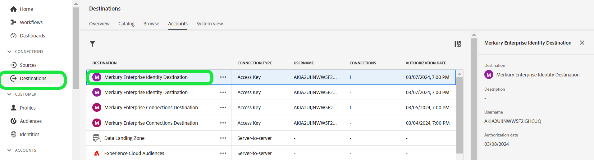

# Merkury Enterprise ID 대상

>[!NOTE]
>
>대상 커넥터 및 문서 페이지는 [!DNL Merkury] 팀에서 만들고 유지 관리합니다. 문의 사항이나 업데이트 요청은 [!DNL Merkury] 계정 담당자에게 문의하십시오.

## 개요

[!DNL Merkury Enterprise Identity] 대상을 사용하여 보다 정확하고 포괄적이며 인사이트를 갖춘 소비자 프로필을 구축할 수 있습니다. 향상된 프로필 데이터를 통해 마케터는 더 나은 통찰력, 세그먼트 및 모델을 제공할 수 있으므로 보다 정확한 타겟팅 및 예측 모델링을 수행할 수 있습니다.

이 설명서 페이지의 단계에 따라 [!DNL Merkury Identity] 대상 연결을 만들고 Adobe Experience Platform 사용자 인터페이스를 사용하여 식별 및 데이터 보강 대상을 활성화합니다.

>[!NOTE]
>
>[!DNL Merkury Connect] 계정으로 대상자를 미디어 대상에 활성화하려는 경우 대신 [!DNL Merkury Connections] 대상을 사용하십시오.

## 사용 사례

[!DNL Merkury Enterprise Identity] 대상은 다음 [!DNL Merkury] 기능에 대해 소비자 PII를 안전하게 전송하는 기능을 제공합니다.

* **데이터 품질**: 데이터 위생 및 표준화로 소비자 프로필 데이터 품질을 개선합니다. [!DNL Merkury]에는 미국 우편 위생 및 최신 DM 마케팅 사용 사례를 지원하기 위한 이동 식별이 포함되어 있습니다.
* **ID 확인**: [!DNL Merkury]개의 개별 및 가구 ID를 통해 제공되는 정확하고 포괄적인 고객 단일 보기를 빌드합니다. Merkury ID는 2억 6,800만 명 이상의 미국 성인 소비자 ID 그래프에서 제공하는 심층적인 프로필 연결 기능을 제공합니다.[!DNL Merkury]
* **데이터 보강**: [!DNL Merkury Data]을(를) 통해 더 나은 통찰력과 개인화를 구현하십시오. [!DNL Merkury Data]에는 인구 통계학적, 라이프스타일, 재무, 생활 이벤트 및 [!DNL Merkury Data Suite]의 구매 데이터에 이르기까지 사용 가능한 10,000개 이상의 데이터 특성이 포함되어 있습니다.

>[!NOTE]
>
>이러한 사용 사례는 대상 및 소스 커넥터의 조합을 통해 실행됩니다. 고객은 이 대상 커넥터를 사용하여 데이터 보강 목적으로 기존 고객 레코드를 내보내는 것부터 시작합니다. [!DNL Merkury]의 서비스에서 파일을 검색하고 [!DNL Merkury]의 데이터로 보강하고 파일을 생성합니다. 그런 다음 해당 [!DNL Merkury] Source 커넥터 소스 카드를 사용하여 하이드레이션된 고객 프로필을 다시 Adobe Real-Time CDP으로 수집합니다.

## 전제 조건

>[!IMPORTANT]
>
>* 대상에 연결하려면 **대상 보기** 및 **대상 관리**, **대상 활성화**, **프로필 보기** 및 **세그먼트 보기** [[액세스 제어 권한]](https://experienceleague.adobe.com/ko/docs/experience-platform/access-control/home#permissions)이 필요합니다. 필요한 권한을 얻으려면 [[액세스 제어 개요]](https://experienceleague.adobe.com/ko/docs/experience-platform/access-control/ui/overview)를 읽거나 제품 관리자에게 문의하십시오.
>* *ID*&#x200B;을(를) 내보내려면 **ID 그래프 보기** [[액세스 제어 권한]](https://experienceleague.adobe.com/ko/docs/experience-platform/access-control/home#permissions)이 필요합니다.\

## 지원되는 ID {#supported-identities}

| 대상 ID | 설명 | 고려 사항 |
|---|---|---|
| GAID | GOOGLE ADVERTISING ID | 소스 ID가 GAID 네임스페이스인 경우 GAID 대상 ID를 선택합니다. |
| IDFA | 광고주용 Apple ID | 소스 ID가 IDFA 네임스페이스인 경우 IDFA 대상 ID를 선택합니다. |
| ECID | Experience Cloud ID | ECID를 나타내는 네임스페이스입니다. 이 네임스페이스는 &quot;Adobe Marketing Cloud ID&quot;, &quot;Adobe Experience Cloud ID&quot;, &quot;Adobe Experience Platform ID&quot; 별칭으로도 참조할 수 있습니다. 자세한 내용은 [ECID](/help/identity-service/features/ecid.md)에서 다음 문서를 참조하십시오. |
| phone_sha256 | SHA256 알고리즘으로 해시된 전화번호 | 일반 텍스트와 SHA256 해시 전화 번호는 모두 Adobe Experience Platform에서 지원됩니다. 소스 필드에 해시되지 않은 특성이 포함된 경우 **[!UICONTROL 변환 적용]** 옵션을 선택하여 [!DNL Experience Platform]이(가) 활성화 시 데이터를 자동으로 해시하도록 하십시오. |
| email_lc_sha256 | SHA256 알고리즘으로 해시된 이메일 주소 | Adobe Experience Platform은 일반 텍스트와 SHA256 해시 이메일 주소를 모두 지원합니다. 소스 필드에 해시되지 않은 특성이 포함된 경우 **[!UICONTROL 변환 적용]** 옵션을 선택하여 [!DNL Experience Platform]이(가) 활성화 시 데이터를 자동으로 해시하도록 하십시오. |
| extern_id | 사용자 지정 사용자 ID | 소스 ID가 사용자 지정 네임스페이스인 경우 이 대상 ID를 선택합니다. |

{style="table-layout:auto"}

## 지원되는 대상자

이 섹션에서는 이 대상으로 내보낼 수 있는 대상자 유형을 설명합니다.

| **대상자** | **지원됨** | **설명** | **원본** |
|---|---|---|---|
| Segmentation Service | ✓ | Experience Platform [[Segmentation Service]](https://experienceleague.adobe.com/ko/docs/experience-platform/segmentation/home)을(를) 통해 생성된 대상입니다. |
| 사용자 정의 업로드 | x | CSV 파일에서 대상 [[가져옴]](https://experienceleague.adobe.com/ko/docs/experience-platform/segmentation/ui/overview#import-audience)을(를) Experience Platform으로 가져왔습니다. |

{style="table-layout:auto"}

## 내보내기 유형 및 빈도

대상 내보내기 유형 및 빈도에 대한 자세한 내용은 아래 표를 참조하십시오.

| **대상자** | **지원됨** | **설명 원본** |
|---|---|---|      
| Segmentation Service | ✓ | Experience Platform [[Segmentation Service]](https://experienceleague.adobe.com/ko/docs/experience-platform/segmentation/home)을(를) 통해 생성된 대상입니다. |
| 사용자 정의 업로드 | X | CSV 파일에서 대상 [[가져옴]](https://experienceleague.adobe.com/ko/docs/experience-platform/segmentation/ui/overview#import-audience)을(를) Experience Platform으로 가져왔습니다. |

{style="table-layout:auto"}

## 대상에 연결

>[!IMPORTANT]
>
>대상에 연결하려면 **대상 보기** 및 **데이터 집합 대상 관리 및 활성화** [[액세스 제어 권한]](https://experienceleague.adobe.com/ko/docs/experience-platform/access-control/home#permissions)이 필요합니다. 필요한 권한을 얻으려면 [[액세스 제어 개요]](https://experienceleague.adobe.com/ko/docs/experience-platform/access-control/ui/overview)를 읽거나 제품 관리자에게 문의하십시오.

이 대상에 연결하려면 [[대상 구성 자습서]](https://experienceleague.adobe.com/ko/docs/experience-platform/destinations/ui/connect-destination)에 설명된 단계를 따르십시오. 대상 구성 워크플로에서 아래 두 섹션에 나열된 필드를 채웁니다.

### 대상으로 인증

대상에 인증하려면 필수 필드를 입력한 다음 **대상에 연결**&#x200B;을(를) 선택하십시오.

Experience Platform에서 버킷에 액세스하려면 다음 자격 증명에 대한 유효한 값을 제공해야 합니다.

| **자격 증명** | **설명** |
|---|---|
| 액세스 키 | 버킷에 대한 액세스 키 ID입니다. Merkury 팀에서 이 값을 검색할 수 있습니다. |
| 비밀 키 | 버킷의 비밀 키 ID. Merkury 팀에서 이 값을 검색할 수 있습니다. |
| 버킷 이름 | 파일을 공유할 버킷입니다. Merkury 팀에서 이 값을 검색할 수 있습니다. |

{style="table-layout:auto"}

### 대상 세부 정보 입력

대상에 대한 세부 정보를 구성하려면 아래의 필수 및 선택 필드를 채우십시오. UI에서 필드 옆에 있는 별표는 필드가 필수임을 나타냅니다.

* **이름(필수)** - 대상이 저장될 이름
* **설명** - 대상의 용도에 대한 간략한 설명
* **버킷 이름(필수)** - S3에 설정된 Amazon S3 버킷의 이름
* **폴더 경로(필수)** - 버킷의 하위 디렉터리를 사용하는 경우 루트 경로를 참조하려면 경로를 정의하거나 &#39;/&#39;를 정의해야 합니다.
* **파일 형식** - Experience Platform에서 내보낸 파일에 사용할 형식을 선택합니다. 계정의 예상 파일 형식을 알려면 Merkury 팀에 문의하십시오.

>[!NOTE]
>
>CSV 옵션, 구분 기호, 따옴표 문자, 이스케이프 문자, 빈 값, Null 값, 압축 형식 및 매니페스트 파일 포함 옵션을 선택할 때 Merkury 팀에 문의하여 계정에 대한 적절한 설정을 확인하십시오.

### 기존 계정

Merkury Enterprise ID 대상을 사용하여 이미 정의된 계정이 목록 팝업에 나타납니다. 선택하면 오른쪽 레일에서 계정에 대한 세부 정보를 볼 수 있습니다. **대상** > **계정**(으)로 이동하면 UI에서 예제를 볼 수 있습니다.

### 경고 활성화

경고를 활성화하여 대상에 대한 데이터 흐름 상태에 대한 알림을 받을 수 있습니다. 목록에서 경고를 선택하여 데이터 흐름 상태에 대한 알림을 수신합니다. 경고에 대한 자세한 내용은 [UI를 사용하여 대상 경고 구독](https://experienceleague.adobe.com/ko/docs/experience-platform/destinations/ui/alerts)에 대한 안내서를 참조하십시오.

대상 연결에 대한 세부 정보를 모두 제공했으면 **다음**&#x200B;을 선택합니다.

## 이 대상으로 대상자 활성화

>[!IMPORTANT]
>
>* 데이터를 활성화하려면 **대상 보기**, **대상 활성화**, **프로필 보기** 및 **세그먼트 보기** 액세스 제어 권한이 필요합니다. 액세스 제어 개요를 읽거나 제품 관리자에게 문의하여 필요한 권한을 얻으십시오.
>* ID를 내보내려면 **ID 그래프 보기** 액세스 제어 권한이 필요합니다.

이 대상으로 대상을 활성화하는 방법에 대한 지침은 [대상 데이터를 일괄 프로필 내보내기 대상으로 활성화](https://experienceleague.adobe.com/ko/docs/experience-platform/destinations/ui/activate/activate-batch-profile-destinations)를 참조하십시오.

## 매핑 제안

[!DNL Merkury]측에서 파일을 올바르게 처리하려면 이름 및 주소 요소가 필요합니다. 모든 요소가 필요한 것은 아니지만 가능한 한 많이 제공하면 성공적인 일치를 수행하는 데 도움이 됩니다.

매핑 제안은 고객이 프로필 속성을 매핑할 수 있는 [!DNL Merkury] 처리에 사용되는 대상 측의 속성을 나열하는 아래 표에 제공됩니다. 모든 요소가 필요한 것은 아니므로 이러한 요소를 제안으로 취급하십시오. 소스 값은 계정의 필요에 따라 달라집니다.

| 대상 필드 | Source 설명 |
|---|---|
| ID | [!DNL Merkury Enterprise Identity] Source 커넥터를 통해 [!DNL Merkury] 데이터를 Experience Platform에 매핑하는 데 사용할 ID 필드 |
| Input_First_Name | Experience Platform의 `person.name.firstName` 값입니다. |
| Input_Last_Name | Experience Platform의 `person.name.lastName` 값입니다. |
| Input_Address_Line_1 | Experience Platform의 `mailingAddress.street` 값입니다. |
| Input_City | Experience Platform의 `mailingAddress.city` 값입니다. |
| Input_State_Province_Code | Experience Platform의 `mailingAddress.state` 값입니다. 상태가 두 문자 코드 형식인 경우 를 사용합니다. |
| Input_State_Province_Name | Experience Platform의 `mailingAddress.state` 값입니다. 상태가 전체 상태 이름인 경우 를 사용합니다. |
| Input_Postal_Code | Experience Platform의 `mailingAddress.postalCode` 값입니다. |
| Input_Email_Address | 프로필 이메일 주소로 매핑할 값입니다. |
| Input_Phone | 프로필 전화번호로 매핑할 값입니다. |

{style="table-layout:auto"}

## 데이터 내보내기 유효성 검사

데이터를 성공적으로 내보냈는지 확인하려면 Amazon S3 저장소 버킷을 확인하고 내보낸 파일에 예상 프로필 모집단이 포함되어 있는지 확인하십시오.

## 데이터 사용 및 관리

모든 Adobe Experience Platform 대상은 데이터를 처리할 때 데이터 사용 정책을 준수합니다. Adobe Experience Platform에서 데이터 거버넌스를 적용하는 방법에 대한 자세한 내용은 [데이터 거버넌스 개요](https://experienceleague.adobe.com/ko/docs/experience-platform/data-governance/home)를 참조하십시오.

## 다음 단계

이 자습서를 따라 Experience Platform에서 [!DNL Merkury] 관리 S3 위치로 프로필 데이터를 내보내는 데이터 흐름을 만들었습니다. 다음으로, 처리를 설정할 수 있도록 계정 이름, 파일 이름 및 버킷 경로를 사용하여 [!DNL Merkury] 담당자에게 문의해야 합니다.
