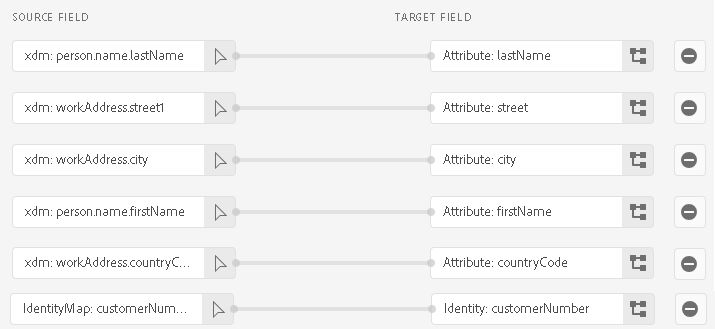
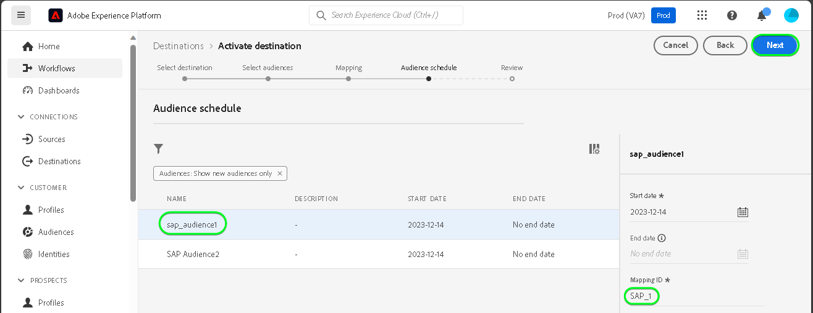

# [!DNL SAP Commerce] 연결

이전에 [[!DNL Hybris]](https://www.sap.com/india/products/acquired-brands/what-is-hybris.html)&#x200B;(으)로 알려졌던 [!DNL SAP Commerce]은(는) B2B 및 B2C 기업을 위한 클라우드 기반 전자 상거래 플랫폼 솔루션이며 SAP Customer Experience 포트폴리오의 일부로 사용할 수 있습니다. [[!DNL SAP] 구독 청구](https://www.sap.com/products/financial-management/subscription-billing.html)는 포트폴리오의 제품이며 표준화된 통합을 통해 간소화된 판매 및 결제 환경을 통해 완전한 구독 라이프사이클 관리를 가능하게 합니다.

이 [!DNL Adobe Experience Platform] [대상](/help/destinations/home.md)은(는) [[!DNL SAP Subscription Billing] 고객 관리 API](https://api.sap.com/api/BusinessPartner_APIs/path/PUT_customers-customerNumber)를 사용하여 활성화 후 기존 Experience Platform 대상자에서 [!DNL SAP Commerce] 내의 고객 세부 정보를 업데이트합니다.

[!DNL SAP Commerce] 인스턴스에 대한 인증 지침은 [대상에 대한 인증](#authenticate) 섹션에서 아래에 더 나와 있습니다.

## 사용 사례 {#use-cases}

[!DNL SAP Commerce] 대상을 사용하는 방법과 시기를 더 잘 이해할 수 있도록 Adobe Experience Platform 고객이 이 대상을 사용하여 해결할 수 있는 샘플 사용 사례를 소개합니다.

[!DNL SAP Commerce]개의 고객은 비즈니스와 상호 작용하는 개인 또는 조직 엔터티에 대한 정보를 저장합니다. 귀하의 팀은 [!DNL SAP Commerce]에 있는 고객을 사용하여 Experience Platform 대상자를 빌드합니다. 이러한 대상을 [!DNL SAP Commerce]에 보내면 해당 정보가 업데이트되고 각 고객에게는 고객이 속한 대상을 나타내는 대상 이름으로 해당 값이 있는 속성이 할당됩니다.

## 전제 조건 {#prerequisites}

Experience Platform 및 [!DNL SAP Commerce]에서 설정해야 하는 필수 구성 요소와 [!DNL SAP Commerce] 대상으로 작업하기 전에 수집해야 하는 정보는 아래 섹션을 참조하십시오.

### Experience Platform 사전 요구 사항 {#prerequisites-in-experience-platform}

[!DNL SAP Commerce] 대상에 대한 데이터를 활성화하기 전에 [!DNL Experience Platform]에서 만든 [스키마](/help/xdm/schema/composition.md), [데이터 세트](https://experienceleague.adobe.com/docs/platform-learn/tutorials/data-ingestion/create-datasets-and-ingest-data.html) 및 [대상](https://experienceleague.adobe.com/docs/platform-learn/tutorials/audiences/create-audiences.html)이 있어야 합니다.

대상 상태에 대한 지침이 필요한 경우 [대상 멤버십 세부 정보 스키마 필드 그룹](/help/xdm/field-groups/profile/segmentation.md)은 Experience Platform 설명서를 참조하십시오.

### [!DNL SAP Commerce] 대상에 대한 필수 구성 요소 {#prerequisites-destination}

Experience Platform에서 [!DNL SAP Commerce] 계정으로 데이터를 내보내려면 다음 전제 조건을 참고하십시오.

#### [!DNL SAP Subscription Billing] 계정이 있어야 합니다. {#prerequisites-account}

Experience Platform에서 [!DNL SAP Commerce] 계정으로 데이터를 내보내려면 [!DNL SAP Subscription Billing] 계정이 있어야 합니다. 유효한 청구 계정이 없는 경우 [!DNL SAP] 계정 관리자에게 문의하십시오. 자세한 내용은 [[!DNL SAP] 플랫폼 구성](https://help.sap.com/doc/5fd179965d5145fbbe7f2a7aa1272338/latest/en-US/PlatformConfiguration.pdf) 문서를 참조하십시오.

#### 서비스 키 생성 {#prerequisites-service-key}

* [!DNL SAP Commerce] 서비스 키를 사용하면 Experience Platform을 통해 [!DNL SAP Subscription Billing] API에 액세스할 수 있습니다. 서비스 키를 만들려면 [!DNL SAP Commerce] [클라이언트 ID 및 클라이언트 암호를 사용하여 서비스 키 만들기](https://help.sap.com/docs/CLOUD_TO_CASH_OD/1216e7b79c984675b0a6f0005e351c74/87c11a0f5dc3494eaf3baa355925c030.html#create-a-service-key-with-client-id-and-client-secret)를 참조하십시오. [!DNL SAP Commerce]를 사용하려면 다음 요구 사항을 충족해야 합니다.
   * 클라이언트 ID
   * 클라이언트 암호
   * URL. URL 패턴은 `https://subscriptionbilling.authentication.eu10.hana.ondemand.com`입니다. 이 값은 나중에 `Region` 및 `Endpoint`의 값을 가져오는 데 사용됩니다.

+++서비스 키의 예를 보려면 선택

```json
{ 
    "url": "https://eu10.revenue.cloud.sap/api",
    "uaa": {
        "clientid": "XXX",
        "clientsecret": "XXX",
        "url": "https://subscriptionbilling.authentication.eu10.hana.ondemand.com",
        "identityzone": "subscriptionbilling",
        "identityzoneid": "XXX",
        "tenantid": "XXX",
        "tenantmode": "dedicated",
        "sburl": "https://internal-xsuaa.authentication.eu10.hana.ondemand.com",
        "apiurl": "https://api.authentication.eu10.hana.ondemand.com",
        "verificationkey": "XXX",
        "xsappname": "XXX",
        "subaccountid": "XXX",
        "uaadomain": "authentication.eu10.hana.ondemand.com",
        "zoneid": "XXX",
        "credential-type": "binding-secret"
    },
    "vendor": "SAP"
}
```

+++

#### [!DNL SAP Subscription Billing]에서 사용자 지정 참조 만들기 {#prerequisites-custom-reference}

[!DNL SAP Subscription Billing]에서 Experience Platform 대상 상태를 업데이트하려면 Experience Platform에서 선택한 각 대상에 대해 사용자 지정 참조 필드가 필요합니다.

사용자 지정 참조를 만들려면 [!DNL SAP Subscription Billing] 계정에 로그인하고 **[기본 데이터 및 구성]** > **[사용자 지정 참조]** 페이지로 이동하십시오. 그런 다음 **[!UICONTROL 만들기]**&#x200B;를 선택하여 Experience Platform에서 선택한 각 대상에 대한 새 참조를 추가합니다. 후속 [대상 내보내기 예약 및 예제](#schedule-segment-export-example) 단계에서 이러한 참조 필드 이름이 필요합니다.

[!DNL SAP Subscription Billing] 내에서 사용자 지정 **[!UICONTROL 참조 형식]**을(를) 만드는 방법의 예는 다음과 같습니다.


추가 지침은 [!DNL SAP Subscription Billing] [사용자 지정 참조](https://help.sap.com/docs/CLOUD_TO_CASH_OD/80d121f216af43648e79664efe5595f7/85696a63c8d8453a934e86c9413a25cf.html?version=2023-11-27) 설명서를 참조하십시오.

### 필요한 자격 증명 수집 {#gather-credentials}

[!DNL SAP Commerce]을(를) Experience Platform에 연결하려면 다음 연결 속성에 대한 값을 제공해야 합니다.

| 자격 증명 | 설명 |
| --- | --- |
| 클라이언트 ID | 서비스 키의 `clientId` 값입니다. |
| 클라이언트 암호 | 서비스 키의 `clientSecret` 값입니다. |
| 엔드포인트 | 서비스 키의 `url` 값은 `https://subscriptionbilling.authentication.eu10.hana.ondemand.com`과(와) 비슷합니다. |
| 지역 | 데이터 센터 위치. 영역이 `url`에 있으며 `eu10` 또는 `us10`과(와) 유사한 값을 갖습니다. 예를 들어 `url`이(가) `https://eu10.revenue.cloud.sap/api`이면 `eu10`이(가) 필요합니다. |

## 가드레일 {#guardrails}

[!DNL SAP Cloud Management service]에 대한 API 요청이 [속도 제한](https://help.sap.com/docs/btp/sap-business-technology-platform/account-administration-rate-limiting)을(를) 받습니다. 속도 제한을 초과하면 `HTTP 429 Too Many Requests` 응답 상태 코드 가 표시됩니다.

## 지원되는 ID {#supported-identities}

[!DNL SAP Commerce]은(는) 아래 표에 설명된 ID 업데이트를 지원합니다. [ID](/help/identity-service/features/namespaces.md)에 대해 자세히 알아보세요.

| 대상 ID | 설명 | 고려 사항 |
| --- | --- | --- |
| `customerNumberSAP` | [!DNL SAP Commerce] 계정에 이미 있는 개인 또는 회사 고객의 고객 식별자입니다. | 필수 |

## 지원되는 대상자 {#supported-audiences}

이 섹션에서는 이 대상으로 내보낼 수 있는 모든 대상에 대해 설명합니다.

이 대상은 Experience Platform [세그먼테이션 서비스](../../../segmentation/home.md)를 통해 생성된 모든 대상의 활성화를 지원합니다.

이 대상은 아래 표에 설명된 대상의 활성화도 지원합니다.

| 대상자 유형 | 지원됨 | 설명 |
| ------------- | --------- | ----------- |
| [!DNL Segmentation Service] | ✓ | Experience Platform [세그먼테이션 서비스](../../../segmentation/home.md)를 통해 생성된 대상입니다. |
| 사용자 정의 업로드 | ✓ | CSV 파일에서 Experience Platform으로 대상 [가져옴](../../../segmentation/ui/audience-portal.md#import-audience). |

{style="table-layout:auto"}

## 내보내기 유형 및 빈도 {#export-type-frequency}

대상 내보내기 유형 및 빈도에 대한 자세한 내용은 아래 표를 참조하십시오.

| 항목 | 유형 | 참고 |
---------|----------|---------|
| 내보내기 유형 | **[!UICONTROL 프로필 기반]** | <ul><li>필드 매핑에 따라 원하는 스키마 필드 *(예: 이메일 주소, 전화번호, 성)*&#x200B;과(와) 함께 대상자의 모든 구성원을 내보냅니다.</li><li> Experience Platform에서 선택한 각 대상에 대해 해당 [!DNL SAP Commerce] 추가 특성이 Experience Platform의 대상 상태로 업데이트됩니다.</li></ul> |
| 내보내기 빈도 | **[!UICONTROL 스트리밍]** | <ul><li>스트리밍 대상은 &quot;항상&quot; API 기반 연결입니다. 대상 평가를 기반으로 Experience Platform에서 프로필을 업데이트하면 커넥터가 업데이트 다운스트림을 대상 플랫폼으로 보냅니다. [스트리밍 대상](/help/destinations/destination-types.md#streaming-destinations)에 대해 자세히 알아보세요.</li></ul> |

{style="table-layout:auto"}

## 대상에 연결 {#connect}

>[!IMPORTANT]
>
>대상에 연결하려면 **[!UICONTROL 대상 관리]** [액세스 제어 권한](/help/access-control/home.md#permissions)이 필요합니다. [액세스 제어 개요](/help/access-control/ui/overview.md)를 읽거나 제품 관리자에게 문의하여 필요한 권한을 받으십시오.

이 대상에 연결하려면 [대상 구성 자습서](../../ui/connect-destination.md)에 설명된 단계를 따르십시오. 대상 구성 워크플로에서 아래 두 섹션에 나열된 필드를 채웁니다.

**[!UICONTROL 대상]** > **[!UICONTROL 카탈로그]** 내에서 [!DNL SAP Commerce]을(를) 검색합니다. 또는 **[!UICONTROL eCommerce]** 범주 아래에서 찾을 수 있습니다.

### 대상으로 인증 {#authenticate}

아래의 필수 필드를 입력하십시오. 자세한 내용은 [서비스 키 생성](#prerequisites-service-key) 섹션을 참조하십시오.

| 필드 | 설명 |
| --- | --- |
| **[!UICONTROL 클라이언트 ID]** | 서비스 키의 `clientId` 값입니다. |
| **[!UICONTROL 클라이언트 암호]** | 서비스 키의 `clientSecret` 값입니다. |
| **[!UICONTROL 끝점]** | 서비스 키의 `url` 값은 `https://subscriptionbilling.authentication.eu10.hana.ondemand.com`과(와) 비슷합니다. |
| **[!UICONTROL 지역]** | 데이터 센터 위치. 영역이 `url`에 있으며 `eu10` 또는 `us10`과(와) 유사한 값을 갖습니다. 예를 들어 `url`이(가) `https://eu10.revenue.cloud.sap/api`이면 `eu10`이(가) 필요합니다. |

대상에 인증하려면 **[!UICONTROL 대상에 연결]**을 선택하세요.


제공된 세부 정보가 유효하면 UI에 녹색 확인 표시와 함께 **[!UICONTROL 연결됨]** 상태가 표시됩니다. 그런 다음 다음 다음 단계로 진행할 수 있습니다.

### 대상 세부 정보 입력 {#destination-details}

대상에 대한 세부 정보를 구성하려면 아래의 필수 및 선택 필드를 채우십시오. UI에서 필드 옆에 있는 별표는 필드가 필수임을 나타냅니다.


* **[!UICONTROL 이름]**: 나중에 이 대상을 인식할 수 있는 이름입니다.
* **[!UICONTROL 설명]**: 나중에 이 대상을 식별하는 데 도움이 되는 설명입니다.
* **[!UICONTROL 고객 유형]**: 대상 내의 엔터티에 따라 ***개인*** 또는 ***회사***&#x200B;를 선택합니다. [!DNL SAP Subscription Billing] [schema](https://api.sap.com/api/BusinessPartner_APIs/schema)은(는) `customerType` 특성에 매핑된 이 선택 항목에 따라 필수 필드를 전환합니다. 선택 항목이 ***회사***&#x200B;인 경우 개별 고객에 필요한 `firstName` 및 `lastName`과(와) 같은 필수 매핑이 무시되고 `company`이(가) 필수가 되며 그 반대의 경우도 마찬가지입니다.

### 경고 활성화 {#enable-alerts}

경고를 활성화하여 대상에 대한 데이터 흐름 상태에 대한 알림을 받을 수 있습니다. 목록에서 경고를 선택하여 데이터 흐름 상태에 대한 알림을 수신합니다. 경고에 대한 자세한 내용은 [UI를 사용하여 대상 경고 구독](../../ui/alerts.md)에 대한 안내서를 참조하십시오.

대상 연결에 대한 세부 정보를 모두 제공했으면 **[!UICONTROL 다음]**&#x200B;을 선택합니다.

## 이 대상으로 대상자 활성화 {#activate}

>[!IMPORTANT]
> 
>* 데이터를 활성화하려면 **[!UICONTROL 대상 보기]**, **[!UICONTROL 대상 활성화]**, **[!UICONTROL 프로필 보기]** 및 **[!UICONTROL 세그먼트 보기]** [액세스 제어 권한](/help/access-control/home.md#permissions)이 필요합니다. [액세스 제어 개요](/help/access-control/ui/overview.md)를 읽거나 제품 관리자에게 문의하여 필요한 권한을 받으십시오.
>* *ID*&#x200B;을(를) 내보내려면 **[!UICONTROL ID 그래프 보기]** [액세스 제어 권한](/help/access-control/home.md#permissions)이 필요합니다. <br> {width="100" zoomable="yes"}

이 대상으로 대상을 활성화하는 방법에 대한 지침은 [프로필 및 대상을 스트리밍 대상 내보내기 대상으로 활성화](/help/destinations/ui/activate-segment-streaming-destinations.md)를 참조하십시오.

### 속성 및 ID 매핑 {#map}

대상 데이터를 Adobe Experience Platform에서 [!DNL SAP Commerce] 대상으로 올바르게 보내려면 필드 매핑 단계를 거쳐야 합니다. 매핑은 Experience Platform 계정의 XDM(Experience Data Model) 스키마 필드와 대상 대상의 해당 스키마 필드 간에 링크를 작성하는 것으로 구성됩니다. XDM 필드를 [!DNL SAP Commerce] 대상 필드에 올바르게 매핑하려면 아래 단계를 따르십시오.

#### `customerNumberSAP` ID 매핑

`customerNumberSAP` ID는 이 대상에 대한 필수 매핑입니다. 매핑하려면 아래 단계를 따르십시오.

1. **[!UICONTROL 매핑]** 단계에서 **[!UICONTROL 새 매핑 추가]**를 선택합니다. 이제 새 매핑 행이 화면에 표시됩니다.
   
1. **[!UICONTROL 소스 필드 선택]** 창에서 **[!UICONTROL ID 네임스페이스 선택]**&#x200B;을(를) 선택하고 `customerNumberSAP`을(를) 선택합니다.
   
1. **[!UICONTROL 대상 필드 선택]** 창에서 **[!UICONTROL ID 네임스페이스 선택]**&#x200B;을(를) 선택하고 `customerNumber` ID를 선택합니다.
   

| 소스 필드 | 대상 필드 | 필수 |
| --- | --- | --- |
| `IdentityMap: customerNumberSAP` | `Identity: customerNumber` | 예 |

다음은 ID 매핑의 예입니다.


#### 속성 매핑

XDM 프로필 스키마와 [!DNL SAP Subscription Billing] 계정 사이에 업데이트할 다른 특성을 추가하려면 아래 단계를 반복합니다.

1. **[!UICONTROL 매핑]** 단계에서 **[!UICONTROL 새 매핑 추가]**를 선택합니다. 이제 새 매핑 행이 화면에 표시됩니다.
   
1. **[!UICONTROL 소스 필드 선택]** 창에서 **[!UICONTROL 특성 선택]** 범주를 선택하고 XDM 특성을 선택합니다.
   
1. **[!UICONTROL 대상 필드 선택]** 창에서 **[!UICONTROL 사용자 지정 특성 선택]** 범주를 선택하고 [스키마](https://api.sap.com/api/BusinessPartner_APIs/schema) 특성 목록에서 [!DNL SAP Subscription Billing] 특성 이름을 입력하십시오.
   

>[!IMPORTANT]
>
> 대상 필드 이름은 대/소문자를 구분하며 [!DNL SAP Subscription Billing] 특성 이름과 일치해야 합니다. 이에 대한 유일한 예외는 `country`이며 대신 `countryCode`을(를) 사용해야 합니다. [!DNL SAP Subscription Billing]은(는) 알파-2(ISO 3166) 국가 코드를 지원합니다. 이 값은 대/소문자를 구분하며 0~3자 사이여야 합니다. 따라서 오류가 발생하는 경우 정의된 대로 정확히 입력해야 합니다. `The country code {} does not exist` 또는 `size must be between 0 and 3`.

#### 선택한 고객 유형에 대한 `mandatory` 특성 매핑

필수 특성 매핑은 선택한 **[!UICONTROL 고객 유형]**&#x200B;에 따라 다릅니다. 필수 속성을 매핑하려면 아래에서 을(를) 선택합니다.

>[!BEGINTABS]

>[!TAB 개인 고객]

| 소스 필드 | 대상 필드 | 필수 |
| --- | --- | --- |
| `xdm: person.lastName` | `Attribute: lastName` | 예 |
| `xdm: workAddress.countryCode` | `Attribute: countryCode` | 예 |

>[!TAB 회사 고객]

| 소스 필드 | 대상 필드 | 필수 |
| --- | --- | --- |
| `xdm: b2b.companyName` | `Attribute: company` | 예 |
| `xdm: workAddress.countryCode` | `Attribute: countryCode` | 예 |

>[!ENDTABS]

#### 추가 속성 매핑

그런 다음 아래와 같이 XDM 프로필 스키마와 고객에 대한 [!DNL SAP Subscription Billing] [스키마](https://api.sap.com/api/BusinessPartner_APIs/schema) 특성 사이에 매핑을 추가할 수 있습니다.

>[!BEGINTABS]

>[!TAB 개인 고객]

| 소스 필드 | 대상 필드 | 필수 |
| --- | --- | --- |
| `xdm: person.name.firstName` | `Attribute: firstName` | 아니요 |
| `xdm: workAddress.street1` | `Attribute: street` | 아니요 |
| `xdm: workAddress.city` | `Attribute: city` | 아니요 |

고객이 개인인 필수 및 선택적 속성 매핑의 예가 아래에 나와 있습니다.


>[!TAB 회사 고객]

| 소스 필드 | 대상 필드 | 필수 |
| --- | --- | --- |
| `xdm: workAddress.street1` | `Attribute: street` | 아니요 |
| `xdm: workAddress.city` | `Attribute: city` | 아니요 |

고객이 법인인 경우 필수 및 선택적 속성 매핑이 모두 포함된 예는 다음과 같습니다.


>[!ENDTABS]

대상 연결에 대한 매핑을 제공했으면 **[!UICONTROL 다음]**&#x200B;을 선택합니다.

### 대상자 내보내기 예약 및 예제 {#schedule-segment-export-example}

[대상 내보내기 예약](/help/destinations/ui/activate-segment-streaming-destinations.md#scheduling) 단계를 수행할 때 Experience Platform 대상을 [!DNL SAP Subscription Billing]의 [특성](#prerequisites-attribute)에 수동으로 매핑해야 합니다.

[!DNL SAP Commerce] **[!UICONTROL 매핑 ID]** 위치가 강조 표시된 대상 내보내기 예약 단계의 예는 다음과 같습니다.


이렇게 하려면 각 세그먼트를 선택한 다음 [!DNL SAP Commerce] **[!UICONTROL 매핑 ID]** 대상 커넥터 필드의 [!DNL SAP Subscription Billing]에서 사용자 지정 참조의 이름을 입력하십시오. 사용자 지정 참조 만들기에 대한 지침은 [사용자 지정 참조 만들기 [!DNL SAP Subscription Billing]](#prerequisites-custom-reference) 섹션을 참조하십시오.

>[!IMPORTANT]
>
> 사용자 지정 참조 레이블을 값으로 사용하지 마십시오.
>

예를 들어 선택한 Experience Platform 대상이 `sap_audience1`이고 상태를 [!DNL SAP Subscription Billing] 사용자 지정 참조 `SAP_1`(으)로 업데이트하려면 [!DNL SAP_Commerce] **[!UICONTROL 매핑 ID]** 필드에 이 값을 지정하십시오.

[!DNL SAP Subscription Billing]의 **[!UICONTROL 참조 형식]** 예는 다음과 같습니다.


대상을 선택하고 해당 [!DNL SAP Commerce] **[!UICONTROL 매핑 ID]**가 강조 표시된 대상 내보내기 예약 단계의 예는 다음과 같습니다.


표시된 대로 **[!UICONTROL 매핑 ID]** 필드 내의 값은 [!DNL SAP Subscription Billing] **[!UICONTROL 참조 형식]** 값과 정확히 일치해야 합니다.

활성화된 각 Experience Platform 대상에 대해 이 섹션을 반복합니다.

두 대상을 선택한 위에 표시된 이미지에 따라 매핑은 다음과 같습니다.

| [!DNL SAP Commerce] 대상 이름 | [!DNL SAP Subscription Billing] **[!UICONTROL 참조 형식]** | [!DNL SAP Commerce] **[!UICONTROL 매핑 ID]** 값 |
| --- | --- | --- |
| sap_audience1 | `SAP_1` | `SAP_1` |
| SAP 대상2 | `SAP_2` | `SAP_2` |

## 데이터 내보내기 유효성 검사 {#exported-data}

대상을 올바르게 설정했는지 확인하려면 아래 단계를 수행하십시오.

[!DNL SAP Subscription Billing] 계정에 로그인한 다음 **[!UICONTROL 연락처]** 페이지로 이동하여 대상자 상태를 확인하십시오. 사용자 지정 참조에 대한 열을 표시하고 해당 대상 상태를 표시하도록 목록을 구성할 수 있습니다.


## 데이터 사용 및 관리 {#data-usage-governance}

데이터를 처리할 때 모든 [!DNL Adobe Experience Platform] 대상이 데이터 사용 정책을 준수합니다. [!DNL Adobe Experience Platform]에서 데이터 거버넌스를 적용하는 방법에 대한 자세한 내용은 [데이터 거버넌스 개요](/help/data-governance/home.md)를 참조하십시오.

## 오류 및 문제 해결 {#errors-and-troubleshooting}

가능한 오류 유형 및 응답 코드 목록은 [[!DNL SAP Subscription Billing] 오류 유형](https://help.sap.com/docs/CLOUD_TO_CASH_OD/987aec876092428f88162e438acf80d6/1a6a0dd6129c48e8b235190a1b5409fa.html) 설명서 페이지를 참조하세요.

## 추가 리소스 {#additional-resources}

[!DNL SAP] 설명서의 추가 유용한 정보는 다음과 같습니다.
* [SAP 구독 청구 온보드](https://help.sap.com/docs/CLOUD_TO_CASH_OD/1216e7b79c984675b0a6f0005e351c74/e4b8badf7d124026991e4ab6b57d2a33.html)

### 변경 로그

이 섹션에서는 이 대상 커넥터에 대한 기능 및 중요 설명서 업데이트를 캡처합니다.

+++ 변경 로그 보기

| 릴리스 월 | 업데이트 유형 | 설명 |
|---|---|---|
| 2024년 1월 | 초기 릴리스 | 초기 대상 릴리스 및 설명서 게시. |

{style="table-layout:auto"}

+++
